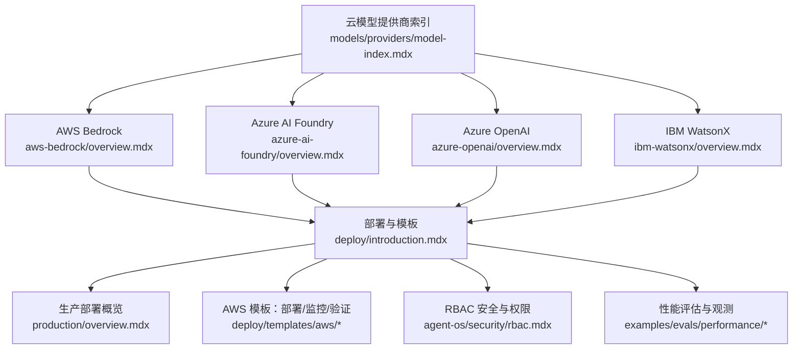
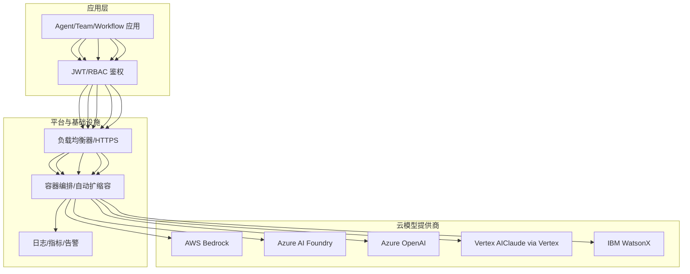
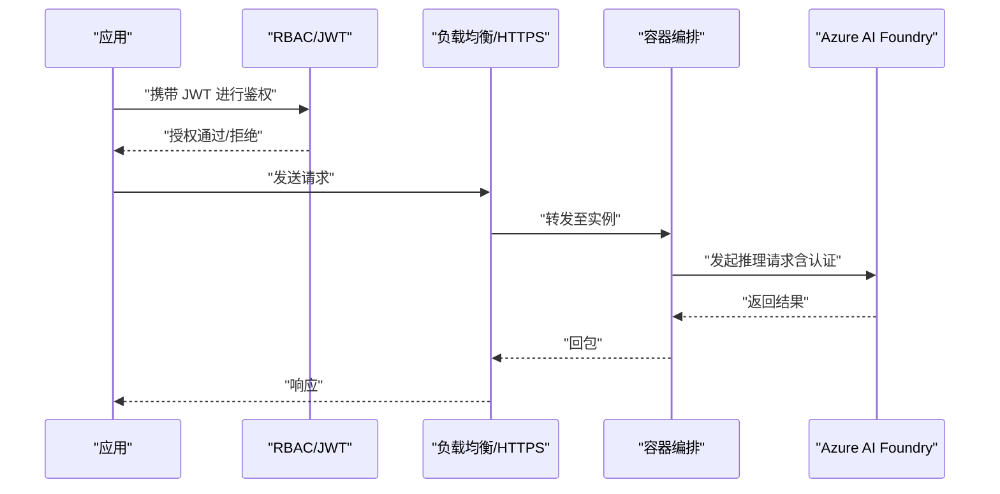
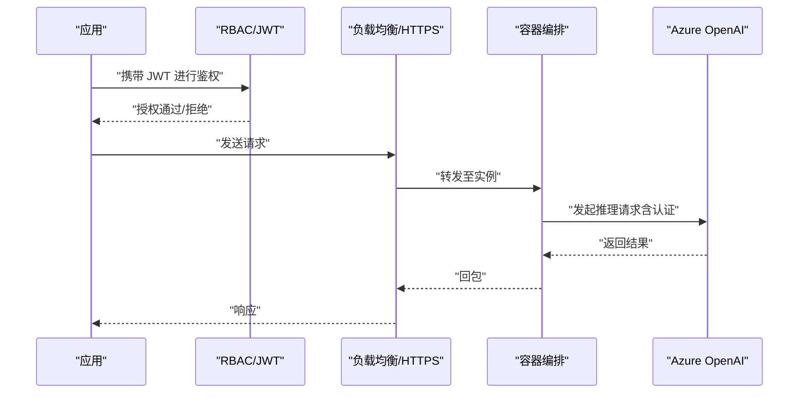
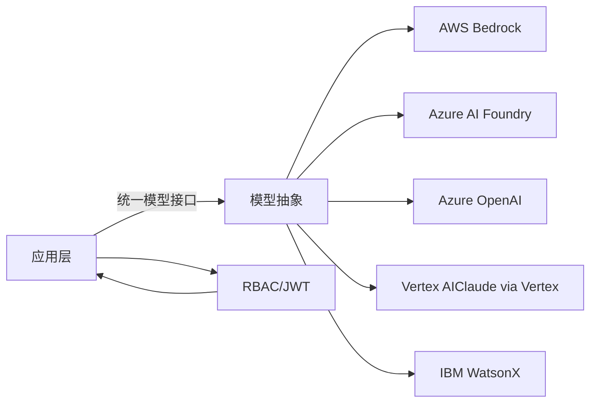
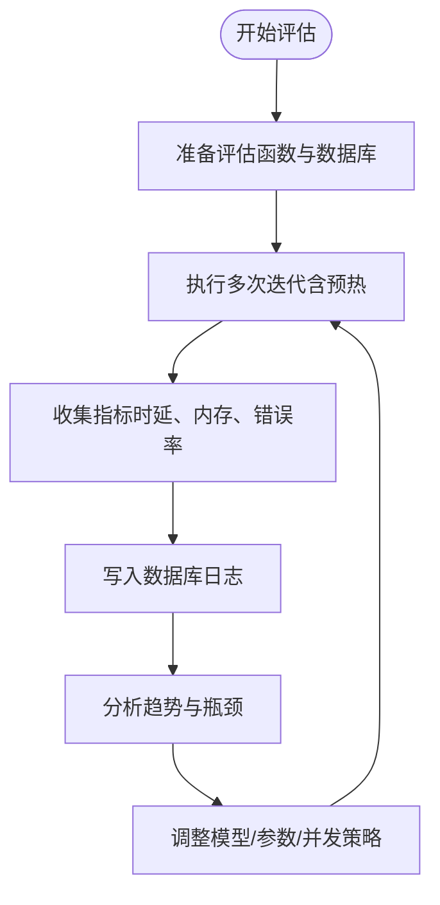
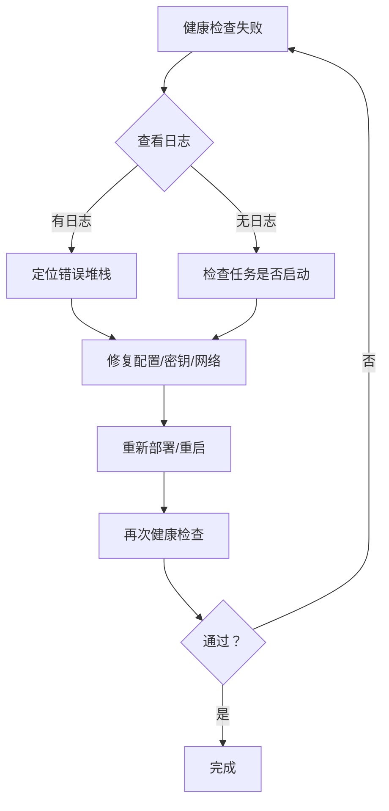

# 云模型提供商

<cite>
**本文引用的文件**
- [AWS Bedrock 概览](file://models/providers/cloud/aws-bedrock/overview.mdx)
- [Azure AI Foundry 概览](file://models/providers/cloud/azure-ai-foundry/overview.mdx)
- [Azure OpenAI 概览](file://models/providers/cloud/azure-openai/overview.mdx)
- [IBM WatsonX 概览](file://models/providers/cloud/ibm-watsonx/overview.mdx)
- [云模型提供商索引](file://models/providers/model-index.mdx)
- [部署概览](file://deploy/introduction.mdx)
- [生产部署概览](file://production/overview.mdx)
- [AWS 模板：部署与验证](file://deploy/templates/aws/deploy.mdx)
- [AWS 模板：监控与告警](file://deploy/templates/aws/manage/monitoring.mdx)
- [AWS 模板：上线验证](file://deploy/templates/aws/go-live/verify.mdx)
- [自定义域名与 HTTPS（AWS）](file://production/templates/customize-aws/domain-https.mdx)
- [RBAC 安全与权限控制](file://agent-os/security/rbac.mdx)
- [按代理权限的 RBAC 示例](file://agent-os/usage/rbac/per-agent-permissions.mdx)
- [性能基准与数据库日志](file://examples/evals/performance/db-logging.mdx)
- [性能评估：响应与存储](file://examples/evals/performance/response-with-storage.mdx)
- [性能总览](file://performance.mdx)
</cite>

## 目录
1. [简介](#简介)
2. [项目结构](#项目结构)
3. [核心组件](#核心组件)
4. [架构总览](#架构总览)
5. [详细组件分析](#详细组件分析)
6. [依赖关系分析](#依赖关系分析)
7. [性能考虑](#性能考虑)
8. [故障排查指南](#故障排查指南)
9. [结论](#结论)
10. [附录](#附录)

## 简介
本文件面向企业级云模型提供商集成与运维，覆盖 AWS Bedrock、Azure AI Foundry、Azure OpenAI、Google Vertex AI（Claude via Vertex）、IBM WatsonX 等主流云厂商的接入方式、认证配置、企业特性（高可用、弹性伸缩、监控告警、安全合规）、成本优化与性能调优，并提供可落地的部署与故障转移建议。

## 项目结构
围绕“云模型提供商”的文档主要分布在以下区域：
- 云模型提供商入口与索引：models/providers/model-index.mdx
- 各云提供商的官方集成与参数说明：aws-bedrock、azure-ai-foundry、azure-openai、ibm-watsonx
- 部署与生产模板：deploy、production
- 安全与权限：agent-os/security/rbac.mdx 及其用法示例
- 性能评估与观测：examples/evals/performance、performance.mdx

**图表来源**
- [云模型提供商索引:148-201](file://models/providers/model-index.mdx#L148-L201)
- [AWS Bedrock 概览:1-155](file://models/providers/cloud/aws-bedrock/overview.mdx#L1-L155)
- [Azure AI Foundry 概览:1-95](file://models/providers/cloud/azure-ai-foundry/overview.mdx#L1-L95)
- [Azure OpenAI 概览:1-81](file://models/providers/cloud/azure-openai/overview.mdx#L1-L81)
- [IBM WatsonX 概览:1-77](file://models/providers/cloud/ibm-watsonx/overview.mdx#L1-L77)
- [部署概览:1-102](file://deploy/introduction.mdx#L1-L102)
- [生产部署概览:1-73](file://production/overview.mdx#L1-L73)

**章节来源**
- [云模型提供商索引:148-201](file://models/providers/model-index.mdx#L148-L201)
- [部署概览:1-102](file://deploy/introduction.mdx#L1-L102)
- [生产部署概览:1-73](file://production/overview.mdx#L1-L73)

## 核心组件
- 云模型客户端封装：各云提供商通过统一的模型抽象进行调用，支持参数化与流式输出。
- 认证与密钥管理：支持环境变量、API Key、会话（SSO/角色扮演）等多种认证方式。
- 部署与弹性：结合容器编排与负载均衡，实现高可用与自动扩缩容。
- 监控与告警：通过平台日志与指标建立健康检查与失败告警。
- 安全与合规：基于 RBAC 的访问控制与 JWT 验证，确保最小权限与审计可追溯。
- 性能与可靠性：通过基准测试与数据库日志化评估系统表现，指导优化与容量规划。

**章节来源**
- [AWS Bedrock 概览:24-155](file://models/providers/cloud/aws-bedrock/overview.mdx#L24-L155)
- [Azure AI Foundry 概览:11-95](file://models/providers/cloud/azure-ai-foundry/overview.mdx#L11-L95)
- [Azure OpenAI 概览:11-81](file://models/providers/cloud/azure-openai/overview.mdx#L11-L81)
- [IBM WatsonX 概览:19-77](file://models/providers/cloud/ibm-watsonx/overview.mdx#L19-L77)
- [AWS 模板：部署与验证:291-342](file://deploy/templates/aws/deploy.mdx#L291-L342)
- [AWS 模板：监控与告警:97-127](file://deploy/templates/aws/manage/monitoring.mdx#L97-L127)
- [RBAC 安全与权限:321-393](file://agent-os/security/rbac.mdx#L321-L393)

## 架构总览
下图展示从应用到云模型提供商的整体调用链路，以及在企业环境中应具备的可观测性与安全控制点。

**图表来源**
- [AWS Bedrock 概览:1-155](file://models/providers/cloud/aws-bedrock/overview.mdx#L1-L155)
- [Azure AI Foundry 概览:1-95](file://models/providers/cloud/azure-ai-foundry/overview.mdx#L1-L95)
- [Azure OpenAI 概览:1-81](file://models/providers/cloud/azure-openai/overview.mdx#L1-L81)
- [IBM WatsonX 概览:1-77](file://models/providers/cloud/ibm-watsonx/overview.mdx#L1-L77)
- [AWS 模板：监控与告警:97-127](file://deploy/templates/aws/manage/monitoring.mdx#L97-L127)
- [自定义域名与 HTTPS（AWS）:41-89](file://production/templates/customize-aws/domain-https.mdx#L41-L89)

## 详细组件分析

### AWS Bedrock
- 企业特性
  - 多模型支持：支持多种开源与闭源模型，适合不同场景。
  - 认证方式灵活：支持 Access Key/Secret Key、SSO、Boto3 Session。
  - 异步支持：通过 aioboto3 提升并发与吞吐。
- 认证配置
  - 环境变量或直接传参；支持 SSO 与预置 Session。
- 参数与调用
  - 支持温度、最大生成长度、停止序列等通用参数。
- 建议
  - 在生产中启用 HTTPS 与证书管理，结合负载均衡与容器编排实现高可用与弹性。

**图表来源**
- [AWS Bedrock 概览:24-109](file://models/providers/cloud/aws-bedrock/overview.mdx#L24-L109)
- [自定义域名与 HTTPS（AWS）:41-89](file://production/templates/customize-aws/domain-https.mdx#L41-L89)

**章节来源**
- [AWS Bedrock 概览:1-155](file://models/providers/cloud/aws-bedrock/overview.mdx#L1-L155)

### Azure AI Foundry
- 企业特性
  - 托管开源模型生态：Phi、Llama、Mistral、Cohere 等。
  - 结构化输出严格模式：支持 schema 遵循，便于企业数据治理。
- 认证配置
  - API Key + Endpoint + 可选版本号。
- 参数与调用
  - 温度、最大 token、频率/存在惩罚、top_p、停止序列、随机种子等。
- 建议
  - 使用 HTTPS 与证书，结合平台日志与告警机制保障稳定性。

**图表来源**
- [Azure AI Foundry 概览:11-95](file://models/providers/cloud/azure-ai-foundry/overview.mdx#L11-L95)
- [自定义域名与 HTTPS（AWS）:41-89](file://production/templates/customize-aws/domain-https.mdx#L41-L89)

**章节来源**
- [Azure AI Foundry 概览:1-95](file://models/providers/cloud/azure-ai-foundry/overview.mdx#L1-L95)

### Azure OpenAI
- 企业特性
  - 通过 Azure 托管 OpenAI 模型，具备企业级 SLA 与合规能力。
  - 自动提示缓存（Prompt caching）提升成本与延迟效率。
- 认证配置
  - API Key + Endpoint（含部署名）+ 可选部署名。
- 参数与调用
  - 支持 OpenAI 兼容参数与 Azure 特有参数。
- 建议
  - 结合 HTTPS 与证书，配合平台日志与告警，确保稳定运行。

**图表来源**
- [Azure OpenAI 概览:11-81](file://models/providers/cloud/azure-openai/overview.mdx#L11-L81)
- [自定义域名与 HTTPS（AWS）:41-89](file://production/templates/customize-aws/domain-https.mdx#L41-L89)

**章节来源**
- [Azure OpenAI 概览:1-81](file://models/providers/cloud/azure-openai/overview.mdx#L1-L81)

### IBM WatsonX
- 企业特性
  - 多模态输入支持（图像等）。
  - 丰富的模型推荐：通用、代码、视觉理解等。
- 认证配置
  - API Key + Project ID + 可选 URL。
- 参数与调用
  - 支持温度、最大生成长度等生成参数。
- 建议
  - 生产部署中启用 HTTPS 与证书，结合日志与告警保障可用性。

**图表来源**
- [IBM WatsonX 概览:19-77](file://models/providers/cloud/ibm-watsonx/overview.mdx#L19-L77)
- [自定义域名与 HTTPS（AWS）:41-89](file://production/templates/customize-aws/domain-https.mdx#L41-L89)

**章节来源**
- [IBM WatsonX 概览:1-77](file://models/providers/cloud/ibm-watsonx/overview.mdx#L1-L77)

### Vertex AI（Claude via Vertex）
- 企业特性
  - 依托 Google Cloud 的基础设施与合规能力。
  - 与 Claude 的多模态与推理能力结合。
- 建议
  - 使用 HTTPS 与证书，结合日志与告警保障稳定性与安全性。

**章节来源**
- [云模型提供商索引:184-189](file://models/providers/model-index.mdx#L184-L189)

## 依赖关系分析
- 组件耦合
  - 应用层仅依赖统一的模型抽象，降低对具体云提供商的耦合。
  - 鉴权与安全控制集中在中间层，便于集中管理。
- 外部依赖
  - 各云提供商 SDK/HTTP 客户端、平台日志与告警服务。
- 循环依赖
  - 文档与示例之间无循环依赖，职责清晰。

**图表来源**
- [AWS Bedrock 概览:134-155](file://models/providers/cloud/aws-bedrock/overview.mdx#L134-L155)
- [Azure AI Foundry 概览:58-83](file://models/providers/cloud/azure-ai-foundry/overview.mdx#L58-L83)
- [Azure OpenAI 概览:63-81](file://models/providers/cloud/azure-openai/overview.mdx#L63-L81)
- [IBM WatsonX 概览:62-77](file://models/providers/cloud/ibm-watsonx/overview.mdx#L62-L77)

**章节来源**
- [AWS Bedrock 概览:134-155](file://models/providers/cloud/aws-bedrock/overview.mdx#L134-L155)
- [Azure AI Foundry 概览:58-83](file://models/providers/cloud/azure-ai-foundry/overview.mdx#L58-L83)
- [Azure OpenAI 概览:63-81](file://models/providers/cloud/azure-openai/overview.mdx#L63-L81)
- [IBM WatsonX 概览:62-77](file://models/providers/cloud/ibm-watsonx/overview.mdx#L62-L77)

## 性能考虑
- 基准与评估
  - 提供性能评估示例，支持将结果写入数据库，便于长期追踪。
  - 包含响应时间、内存占用、工具调用与历史管理等关键维度。
- 调优建议
  - 选择合适模型与参数（温度、top_p、最大 token），结合缓存策略（如 Azure OpenAI 的提示缓存）。
  - 使用异步与并发执行，减少等待时间。
  - 通过数据库日志化评估，持续监控与迭代。

**图表来源**
- [性能评估：响应与存储:37-71](file://examples/evals/performance/response-with-storage.mdx#L37-L71)
- [性能基准与数据库日志:1-67](file://examples/evals/performance/db-logging.mdx#L1-L67)
- [性能总览:1-67](file://performance.mdx#L1-L67)

**章节来源**
- [性能评估：响应与存储:1-71](file://examples/evals/performance/response-with-storage.mdx#L1-L71)
- [性能基准与数据库日志:1-67](file://examples/evals/performance/db-logging.mdx#L1-L67)
- [性能总览:1-67](file://performance.mdx#L1-L67)

## 故障排查指南
- 部署与上线验证
  - 健康检查端点返回状态正常，容器任务启动成功，负载均衡目标健康。
  - 若返回错误或日志缺失，检查平台日志与任务状态。
- 监控与告警
  - 设置 CloudWatch 告警，关注任务失败次数与异常。
  - 合理设置日志保留策略，平衡成本与可追溯性。
- HTTPS 与证书
  - 确保证书已签发并正确应用，监听器需支持 HTTPS 并重定向 HTTP 到 HTTPS。

**图表来源**
- [AWS 模板：上线验证:54-79](file://deploy/templates/aws/go-live/verify.mdx#L54-L79)
- [AWS 模板：监控与告警:97-127](file://deploy/templates/aws/manage/monitoring.mdx#L97-L127)
- [自定义域名与 HTTPS（AWS）:41-89](file://production/templates/customize-aws/domain-https.mdx#L41-L89)

**章节来源**
- [AWS 模板：上线验证:54-79](file://deploy/templates/aws/go-live/verify.mdx#L54-L79)
- [AWS 模板：监控与告警:97-127](file://deploy/templates/aws/manage/monitoring.mdx#L97-L127)
- [自定义域名与 HTTPS（AWS）:41-89](file://production/templates/customize-aws/domain-https.mdx#L41-L89)

## 结论
通过统一的模型抽象与完善的认证、安全、监控与部署流程，可在企业环境中稳定地接入 AWS Bedrock、Azure AI Foundry、Azure OpenAI、Vertex AI（Claude via Vertex）与 IBM WatsonX 等云模型提供商。建议以 HTTPS/证书、RBAC/JWT、日志与告警为核心，结合性能评估与调优，构建高可用、可扩展且合规的智能体平台。

## 附录
- 部署与模板
  - 采用容器化与负载均衡，结合平台日志与告警，实现高可用与弹性。
  - 可参考部署模板与生产概览，快速落地。
- 安全与合规
  - 使用 JWT 验证与 RBAC 控制访问范围，最小权限原则贯穿始终。
  - 对敏感密钥与凭据进行加密存储与轮换，定期审计。

**章节来源**
- [部署概览:1-102](file://deploy/introduction.mdx#L1-L102)
- [生产部署概览:1-73](file://production/overview.mdx#L1-L73)
- [RBAC 安全与权限:321-393](file://agent-os/security/rbac.mdx#L321-L393)
- [按代理权限的 RBAC 示例:44-80](file://agent-os/usage/rbac/per-agent-permissions.mdx#L44-L80)