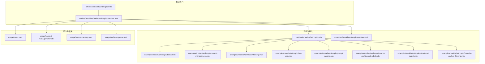
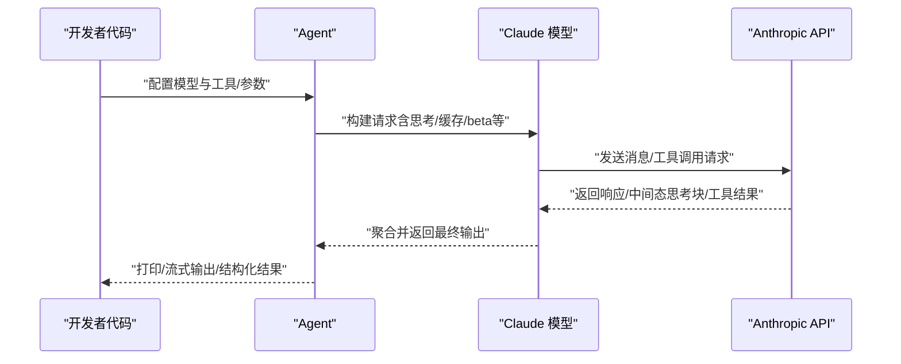
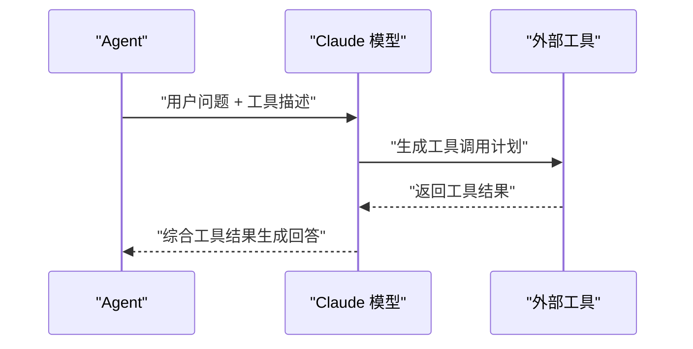
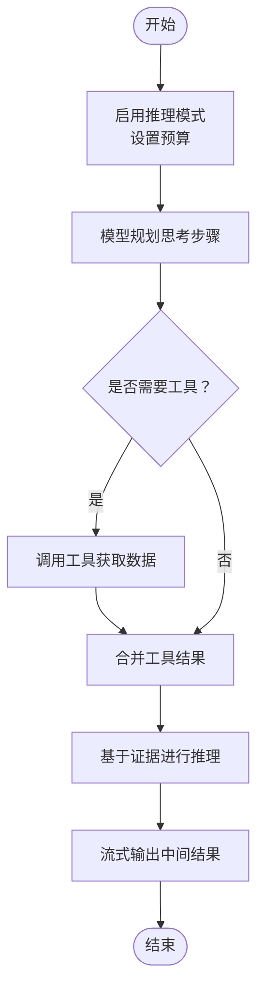
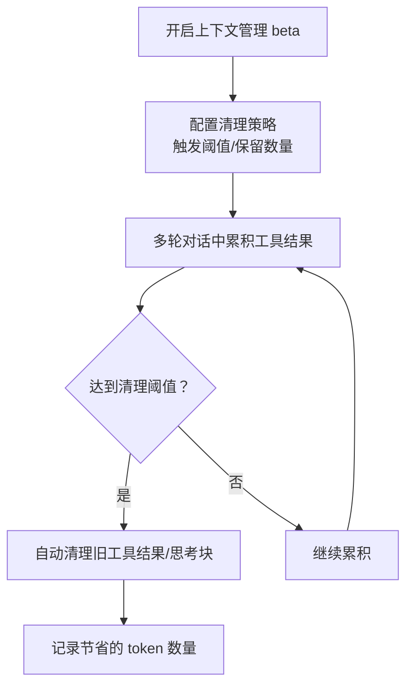
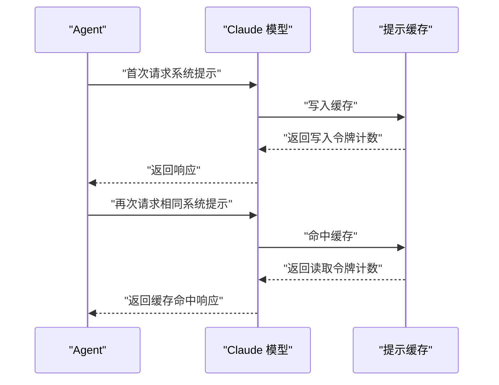
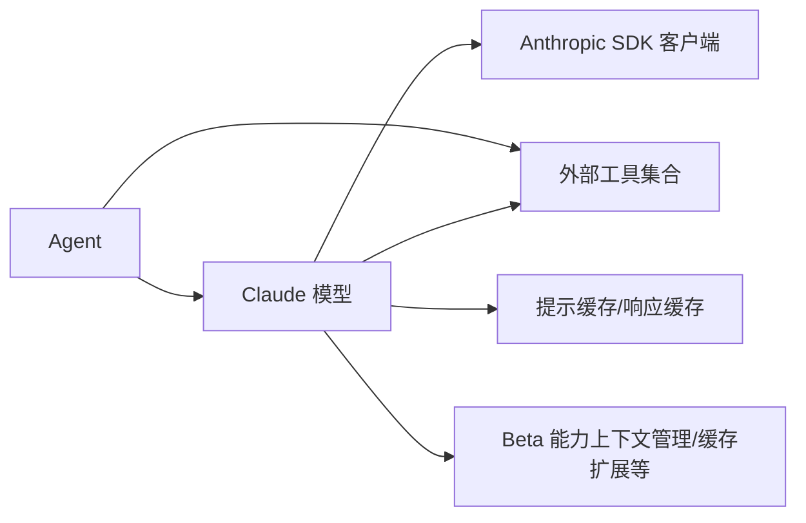

# Anthropic 提供商

<cite>
**本文引用的文件**
- [cookbook/models/anthropic.mdx](file://cookbook/models/anthropic.mdx)
- [models/providers/native/anthropic/overview.mdx](file://models/providers/native/anthropic/overview.mdx)
- [models/providers/native/anthropic/usage/betas.mdx](file://models/providers/native/anthropic/usage/betas.mdx)
- [models/providers/native/anthropic/usage/context-management.mdx](file://models/providers/native/anthropic/usage/context-management.mdx)
- [models/providers/native/anthropic/usage/prompt-caching.mdx](file://models/providers/native/anthropic/usage/prompt-caching.mdx)
- [models/providers/native/anthropic/usage/cache-response.mdx](file://models/providers/native/anthropic/usage/cache-response.mdx)
- [examples/models/anthropic/overview.mdx](file://examples/models/anthropic/overview.mdx)
- [examples/models/anthropic/betas.mdx](file://examples/models/anthropic/betas.mdx)
- [examples/models/anthropic/context-management.mdx](file://examples/models/anthropic/context-management.mdx)
- [examples/models/anthropic/thinking.mdx](file://examples/models/anthropic/thinking.mdx)
- [examples/models/anthropic/tool-use.mdx](file://examples/models/anthropic/tool-use.mdx)
- [examples/models/anthropic/prompt-caching.mdx](file://examples/models/anthropic/prompt-caching.mdx)
- [examples/models/anthropic/prompt-caching-extended.mdx](file://examples/models/anthropic/prompt-caching-extended.mdx)
- [examples/models/anthropic/structured-output.mdx](file://examples/models/anthropic/structured-output.mdx)
- [examples/models/anthropic/financial-analyst-thinking.mdx](file://examples/models/anthropic/financial-analyst-thinking.mdx)
- [reference/models/anthropic.mdx](file://reference/models/anthropic.mdx)
</cite>

## 目录
1. [简介](#简介)
2. [项目结构](#项目结构)
3. [核心组件](#核心组件)
4. [架构总览](#架构总览)
5. [详细组件分析](#详细组件分析)
6. [依赖关系分析](#依赖关系分析)
7. [性能考量](#性能考量)
8. [故障排查指南](#故障排查指南)
9. [结论](#结论)
10. [附录](#附录)

## 简介
本文件面向在 Agno 中集成 Anthropic Claude 模型提供商的工程师与技术文档读者，系统化介绍 Claude 模型系列（如 claude-3-5-sonnet、claude-3-opus 等）的使用方式，并深入讲解 Anthropic 的独特能力：推理模式（Thinking）、工具调用、上下文管理、提示缓存等。同时覆盖 beta 功能的启用与使用路径，给出可直接复用的示例与最佳实践，帮助在生产环境中稳定、高效地使用 Claude 能力。

## 项目结构
围绕 Anthropic 集成，文档与示例分布在以下位置：
- 概览与参数参考：models/providers/native/anthropic/overview.mdx、reference/models/anthropic.mdx
- 使用场景示例：cookbook/models/anthropic.mdx、examples/models/anthropic/*
- 专项能力：usage/betas.mdx、usage/context-management.mdx、usage/prompt-caching.mdx、usage/cache-response.mdx

**图表来源**
- [models/providers/native/anthropic/overview.mdx:1-150](file://models/providers/native/anthropic/overview.mdx#L1-L150)
- [cookbook/models/anthropic.mdx:1-112](file://cookbook/models/anthropic.mdx#L1-L112)
- [examples/models/anthropic/overview.mdx:1-37](file://examples/models/anthropic/overview.mdx#L1-L37)

**章节来源**
- [models/providers/native/anthropic/overview.mdx:1-150](file://models/providers/native/anthropic/overview.mdx#L1-L150)
- [cookbook/models/anthropic.mdx:1-112](file://cookbook/models/anthropic.mdx#L1-L112)
- [examples/models/anthropic/overview.mdx:1-37](file://examples/models/anthropic/overview.mdx#L1-L37)

## 核心组件
- Claude 模型封装：提供 Anthropic Claude 的统一接入，支持 id、max_tokens、thinking、temperature、stop_sequences、top_p/top_k、cache_system_prompt、extended_cache_time、betas、mcp_servers、client/async_client 等参数。
- Agent 集成：通过 Agent.model 指定 Claude，即可在多轮对话、工具调用、结构化输出、流式输出等场景中使用。
- 示例与用法：涵盖基础问答、工具调用、视觉输入、推理模式、提示缓存、上下文管理、beta 功能等典型用法。

关键参数与能力概览（节选）：
- id：指定 Claude 模型版本（如 claude-3-5-sonnet-20241022、claude-3-opus-20240229 等）
- thinking：启用可见扩展推理，含 budget_tokens 等预算控制
- betas：启用实验性能力（如上下文管理、提示缓存扩展、代码执行等）
- cache_system_prompt / extended_cache_time：系统提示缓存与延长缓存时长
- mcp_servers：MCP（模型上下文协议）服务器配置
- client/async_client：预配置的 Anthropic 客户端实例

**章节来源**
- [models/providers/native/anthropic/overview.mdx:126-149](file://models/providers/native/anthropic/overview.mdx#L126-L149)
- [reference/models/anthropic.mdx:8-18](file://reference/models/anthropic.mdx#L8-L18)

## 架构总览
下图展示了从 Agent 到 Claude 模型的调用链路，以及关键能力（推理、工具、上下文管理、提示缓存）在流程中的位置。

**图表来源**
- [models/providers/native/anthropic/overview.mdx:40-94](file://models/providers/native/anthropic/overview.mdx#L40-L94)
- [cookbook/models/anthropic.mdx:8-97](file://cookbook/models/anthropic.mdx#L8-L97)

## 详细组件分析

### 基础使用与认证
- 认证：设置环境变量 ANTHROPIC_API_KEY 后即可使用。
- 最小示例：将 Claude(id=...) 注入 Agent，随后调用 print_response 或 run 即可获得回复。
- 注意：Claude API 要求每次请求携带 max_tokens；若未显式设置，框架默认值为 8192。

**章节来源**
- [models/providers/native/anthropic/overview.mdx:24-38](file://models/providers/native/anthropic/overview.mdx#L24-L38)
- [models/providers/native/anthropic/overview.mdx:18-22](file://models/providers/native/anthropic/overview.mdx#L18-L22)
- [cookbook/models/anthropic.mdx:8-18](file://cookbook/models/anthropic.mdx#L8-L18)

### 工具调用
- 在 Agent 中传入 tools 列表，Claude 可以根据任务自动选择并调用工具。
- 支持同步、异步与流式输出，便于实时反馈与长耗时任务处理。
- 示例覆盖 Web 搜索等常见工具，可按需替换为自定义工具。

**图表来源**
- [examples/models/anthropic/tool-use.mdx:18-36](file://examples/models/anthropic/tool-use.mdx#L18-L36)
- [cookbook/models/anthropic.mdx:22-34](file://cookbook/models/anthropic.mdx#L22-L34)

**章节来源**
- [examples/models/anthropic/tool-use.mdx:1-50](file://examples/models/anthropic/tool-use.mdx#L1-L50)
- [cookbook/models/anthropic.mdx:20-34](file://cookbook/models/anthropic.mdx#L20-L34)

### 推理模式（Thinking）
- 通过 thinking 参数启用“可见扩展推理”，可为复杂问题提供分步思考过程。
- 支持 budget_tokens 控制推理预算，避免过度消耗 token。
- 示例展示逐步解题与流式输出，适合需要清晰推理链的场景。

**图表来源**
- [examples/models/anthropic/thinking.mdx:20-40](file://examples/models/anthropic/thinking.mdx#L20-L40)
- [examples/models/anthropic/financial-analyst-thinking.mdx:31-50](file://examples/models/anthropic/financial-analyst-thinking.mdx#L31-L50)

**章节来源**
- [examples/models/anthropic/thinking.mdx:1-54](file://examples/models/anthropic/thinking.mdx#L1-L54)
- [examples/models/anthropic/financial-analyst-thinking.mdx:1-72](file://examples/models/anthropic/financial-analyst-thinking.mdx#L1-L72)

### 结构化输出
- 通过 output_schema 指定 Pydantic 模型，确保模型输出严格符合预期结构。
- 适用于生产系统对一致性与可靠性要求较高的场景。
- 支持同步与流式两种输出方式。

**章节来源**
- [examples/models/anthropic/structured-output.mdx:44-62](file://examples/models/anthropic/structured-output.mdx#L44-L62)
- [models/providers/native/anthropic/overview.mdx:96-125](file://models/providers/native/anthropic/overview.mdx#L96-L125)

### 上下文管理（Context Management）
- 通过 betas 启用上下文编辑能力，自动清理历史工具调用与思考块，降低 token 消耗并减少越界风险。
- 支持配置触发条件与保留策略，实现“按工具使用次数”清理等精细化控制。
- 示例演示了在多轮搜索场景中节省 token 并输出清理统计。

**图表来源**
- [examples/models/anthropic/context-management.mdx:29-74](file://examples/models/anthropic/context-management.mdx#L29-L74)
- [models/providers/native/anthropic/usage/context-management.mdx:19-43](file://models/providers/native/anthropic/usage/context-management.mdx#L19-L43)

**章节来源**
- [examples/models/anthropic/context-management.mdx:1-100](file://examples/models/anthropic/context-management.mdx#L1-L100)
- [models/providers/native/anthropic/usage/context-management.mdx:1-43](file://models/providers/native/anthropic/usage/context-management.mdx#L1-L43)

### 提示缓存（Prompt Caching）
- 对静态且较长的系统提示启用缓存，显著降低写入与读取成本。
- 支持延长缓存 TTL（通过 extended_cache_time 与相应 beta），将缓存有效期从数分钟提升至小时级。
- 示例展示首次写入缓存、后续读取缓存的效果，并提供度量指标。

**图表来源**
- [examples/models/anthropic/prompt-caching.mdx:35-57](file://examples/models/anthropic/prompt-caching.mdx#L35-L57)
- [examples/models/anthropic/prompt-caching-extended.mdx:32-57](file://examples/models/anthropic/prompt-caching-extended.mdx#L32-L57)
- [models/providers/native/anthropic/usage/prompt-caching.mdx:14-44](file://models/providers/native/anthropic/usage/prompt-caching.mdx#L14-L44)

**章节来源**
- [examples/models/anthropic/prompt-caching.mdx:1-78](file://examples/models/anthropic/prompt-caching.mdx#L1-L78)
- [examples/models/anthropic/prompt-caching-extended.mdx:1-78](file://examples/models/anthropic/prompt-caching-extended.mdx#L1-L78)
- [models/providers/native/anthropic/usage/prompt-caching.mdx:1-84](file://models/providers/native/anthropic/usage/prompt-caching.mdx#L1-L84)

### Beta 功能启用与使用
- 通过 betas 参数启用实验性能力，如上下文管理、代码执行、文件上传、Web 抓取、Agent Skills、提示缓存扩展等。
- 可通过第三方库枚举当前可用的 beta 列表，便于调试与确认能力开关。
- 不同推理提供商对 beta 的支持范围可能不同，需结合平台文档确认。

**章节来源**
- [examples/models/anthropic/betas.mdx:1-55](file://examples/models/anthropic/betas.mdx#L1-L55)
- [models/providers/native/anthropic/usage/betas.mdx:1-59](file://models/providers/native/anthropic/usage/betas.mdx#L1-L59)
- [models/providers/native/anthropic/overview.mdx:61-77](file://models/providers/native/anthropic/overview.mdx#L61-L77)

### 视觉输入与多模态
- 支持图片输入（URL/本地文件/字节流/文件上传），适用于需要图像理解或文档解析的任务。
- 示例展示通过 Image 组件传入图片并进行描述性问答。

**章节来源**
- [cookbook/models/anthropic.mdx:36-53](file://cookbook/models/anthropic.mdx#L36-L53)

### 响应缓存（Response Caching）
- 与提示缓存不同，响应缓存针对整个模型输出进行缓存，适合开发测试阶段快速迭代。
- 通过 cache_response 开启后，相同输入会命中缓存，显著降低等待时间与 API 成本。

**章节来源**
- [models/providers/native/anthropic/usage/cache-response.mdx:16-40](file://models/providers/native/anthropic/usage/cache-response.mdx#L16-L40)

## 依赖关系分析
- Agent 依赖 Claude 模型封装，Claude 再依赖 Anthropic 官方 SDK 客户端。
- 工具调用链路中，Claude 与外部工具交互，工具结果回传给 Claude 进行综合输出。
- 上下文管理与提示缓存作为 Claude 的增强能力，通过 betas 与参数组合生效。

**图表来源**
- [models/providers/native/anthropic/overview.mdx:40-94](file://models/providers/native/anthropic/overview.mdx#L40-L94)
- [cookbook/models/anthropic.mdx:22-34](file://cookbook/models/anthropic.mdx#L22-L34)

**章节来源**
- [models/providers/native/anthropic/overview.mdx:126-149](file://models/providers/native/anthropic/overview.mdx#L126-L149)

## 性能考量
- 合理设置 max_tokens 与 thinking.budget_tokens，避免不必要的 token 消耗。
- 对静态系统提示启用 cache_system_prompt，并在需要时配合 extended_cache_time。
- 使用上下文管理 beta 控制工具结果与思考块规模，降低 token 使用峰值。
- 在开发测试阶段启用 cache_response，加速迭代与联调。
- 通过流式输出（stream=True）改善用户体验，降低首字节延迟感知。

[本节为通用指导，无需特定文件引用]

## 故障排查指南
- 认证失败：检查 ANTHROPIC_API_KEY 是否正确设置。
- 请求缺少 max_tokens：确保在 Claude 初始化时显式设置 max_tokens，或接受默认值。
- 上下文过长：启用上下文管理 beta 并配置清理策略，观察清理后的 token 节省情况。
- 缓存未生效：确认系统提示长度满足提示缓存门槛，或检查 extended_cache_time 的 beta 是否正确启用。
- 工具调用异常：检查工具权限与网络连通性，必要时在 Agent 层增加重试与降级逻辑。

**章节来源**
- [models/providers/native/anthropic/overview.mdx:24-38](file://models/providers/native/anthropic/overview.mdx#L24-L38)
- [models/providers/native/anthropic/overview.mdx:18-22](file://models/providers/native/anthropic/overview.mdx#L18-L22)
- [models/providers/native/anthropic/usage/context-management.mdx:19-43](file://models/providers/native/anthropic/usage/context-management.mdx#L19-L43)
- [models/providers/native/anthropic/usage/prompt-caching.mdx:26-44](file://models/providers/native/anthropic/usage/prompt-caching.mdx#L26-L44)

## 结论
通过在 Agno 中集成 Anthropic Claude，可以便捷地使用其强大的推理、工具与多模态能力，并借助上下文管理、提示缓存与 beta 功能进一步优化成本与稳定性。建议在生产环境中优先采用结构化输出保障一致性，结合缓存与上下文管理控制成本，并通过流式输出提升交互体验。

[本节为总结性内容，无需特定文件引用]

## 附录
- 快速索引：示例清单与对应主题
  - 基础与超参：[examples/models/anthropic/overview.mdx:1-37](file://examples/models/anthropic/overview.mdx#L1-L37)
  - Beta 功能：[examples/models/anthropic/betas.mdx:1-55](file://examples/models/anthropic/betas.mdx#L1-L55)
  - 上下文管理：[examples/models/anthropic/context-management.mdx:1-100](file://examples/models/anthropic/context-management.mdx#L1-L100)
  - 推理模式：[examples/models/anthropic/thinking.mdx:1-54](file://examples/models/anthropic/thinking.mdx#L1-L54)、[examples/models/anthropic/financial-analyst-thinking.mdx:1-72](file://examples/models/anthropic/financial-analyst-thinking.mdx#L1-L72)
  - 工具调用：[examples/models/anthropic/tool-use.mdx:1-50](file://examples/models/anthropic/tool-use.mdx#L1-L50)
  - 提示缓存：[examples/models/anthropic/prompt-caching.mdx:1-78](file://examples/models/anthropic/prompt-caching.mdx#L1-L78)、[examples/models/anthropic/prompt-caching-extended.mdx:1-78](file://examples/models/anthropic/prompt-caching-extended.mdx#L1-L78)
  - 结构化输出：[examples/models/anthropic/structured-output.mdx:1-76](file://examples/models/anthropic/structured-output.mdx#L1-L76)

**章节来源**
- [examples/models/anthropic/overview.mdx:1-37](file://examples/models/anthropic/overview.mdx#L1-L37)
- [examples/models/anthropic/betas.mdx:1-55](file://examples/models/anthropic/betas.mdx#L1-L55)
- [examples/models/anthropic/context-management.mdx:1-100](file://examples/models/anthropic/context-management.mdx#L1-L100)
- [examples/models/anthropic/thinking.mdx:1-54](file://examples/models/anthropic/thinking.mdx#L1-L54)
- [examples/models/anthropic/financial-analyst-thinking.mdx:1-72](file://examples/models/anthropic/financial-analyst-thinking.mdx#L1-L72)
- [examples/models/anthropic/tool-use.mdx:1-50](file://examples/models/anthropic/tool-use.mdx#L1-L50)
- [examples/models/anthropic/prompt-caching.mdx:1-78](file://examples/models/anthropic/prompt-caching.mdx#L1-L78)
- [examples/models/anthropic/prompt-caching-extended.mdx:1-78](file://examples/models/anthropic/prompt-caching-extended.mdx#L1-L78)
- [examples/models/anthropic/structured-output.mdx:1-76](file://examples/models/anthropic/structured-output.mdx#L1-L76)