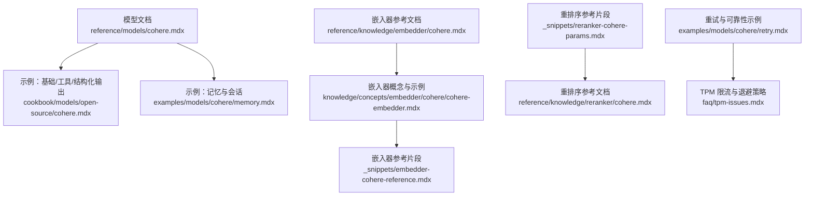
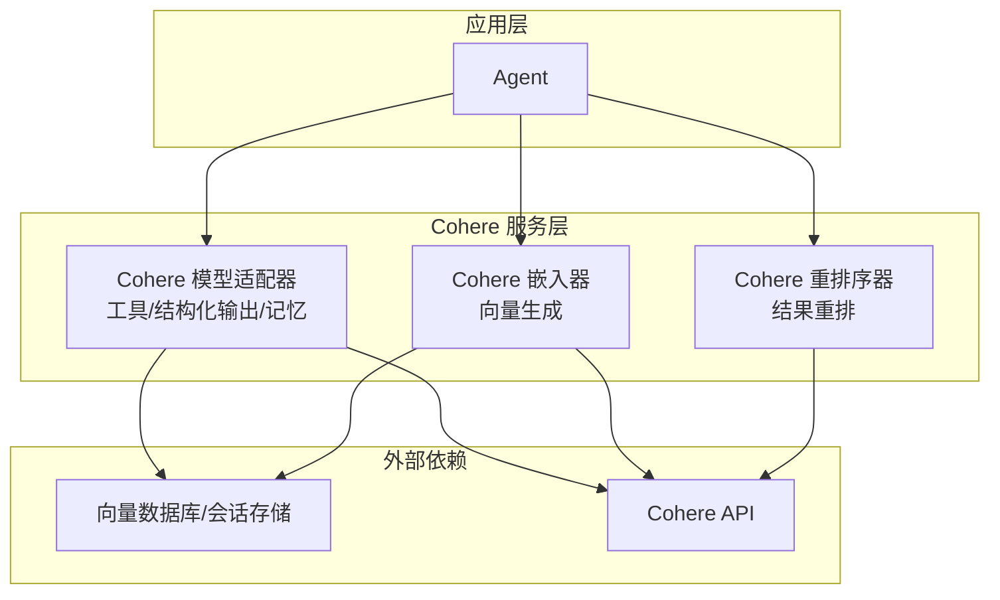
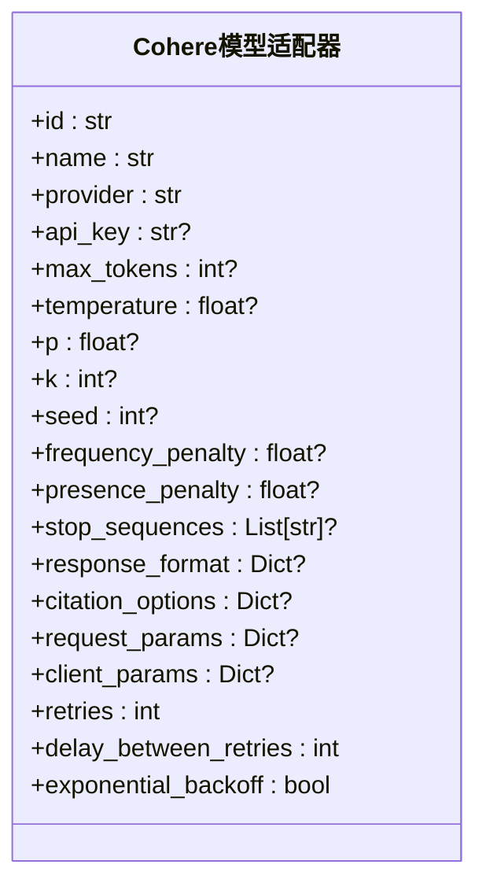
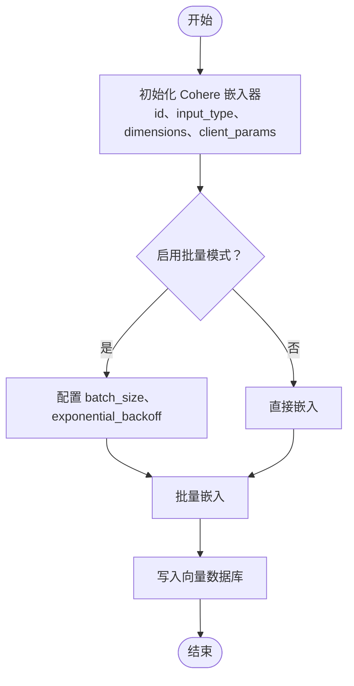
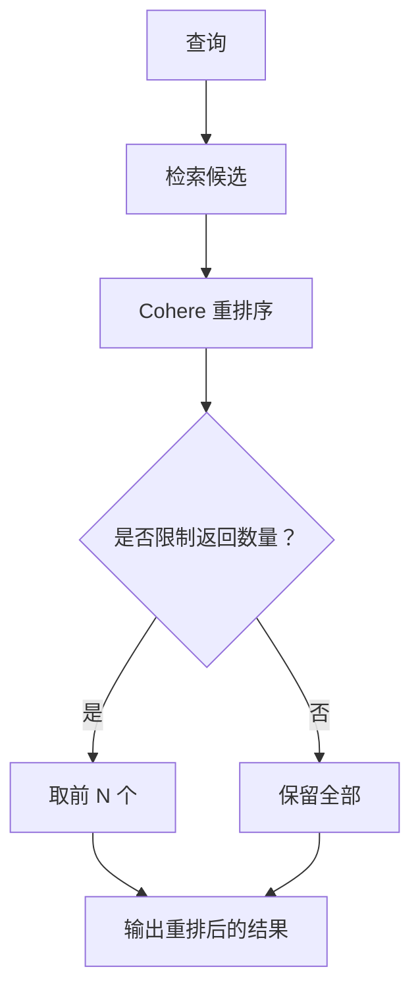
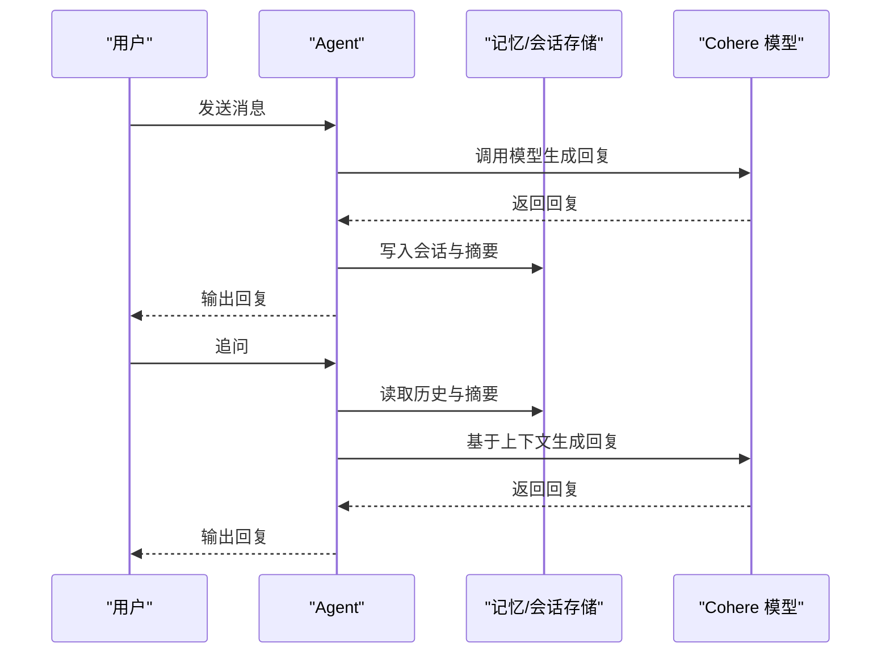
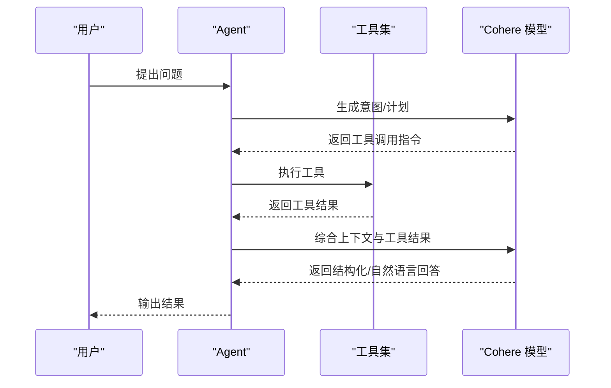
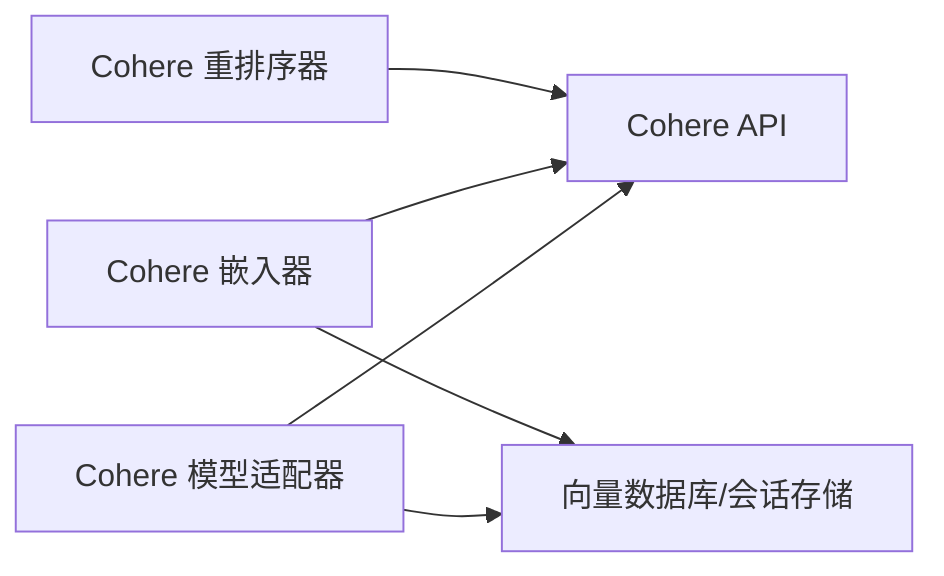

# Cohere 提供商

<cite>
**本文引用的文件**
- [reference/models/cohere.mdx](file://reference/models/cohere.mdx)
- [cookbook/models/open-source/cohere.mdx](file://cookbook/models/open-source/cohere.mdx)
- [examples/models/cohere/memory.mdx](file://examples/models/cohere/memory.mdx)
- [examples/models/cohere/retry.mdx](file://examples/models/cohere/retry.mdx)
- [knowledge/concepts/embedder/cohere/cohere-embedder.mdx](file://knowledge/concepts/embedder/cohere/cohere-embedder.mdx)
- [reference/knowledge/embedder/cohere.mdx](file://reference/knowledge/embedder/cohere.mdx)
- [_snippets/embedder-cohere-reference.mdx](file://_snippets/embedder-cohere-reference.mdx)
- [reference/knowledge/reranker/cohere.mdx](file://reference/knowledge/reranker/cohere.mdx)
- [_snippets/reranker-cohere-params.mdx](file://_snippets/reranker-cohere-params.mdx)
- [faq/tpm-issues.mdx](file://faq/tpm-issues.mdx)
</cite>

## 目录
1. [简介](#简介)
2. [项目结构](#项目结构)
3. [核心组件](#核心组件)
4. [架构总览](#架构总览)
5. [组件详解](#组件详解)
6. [依赖关系分析](#依赖关系分析)
7. [性能与可靠性](#性能与可靠性)
8. [故障排查指南](#故障排查指南)
9. [结论](#结论)
10. [附录](#附录)

## 简介
本文件面向在 Agno 生态中集成 Cohere 模型提供商（以 Command 系列为主）的开发者与使用者，系统性说明如何配置客户端、设置 API 密钥、选择合适模型，并基于仓库中的示例与参考文档，演示如何利用 Cohere 的工具调用、结构化输出、个性化记忆与会话摘要、以及嵌入与重排序能力。同时给出性能优化建议与与其他提供商的对比视角。

## 项目结构
围绕 Cohere 的相关文档与示例主要分布在以下路径：
- 模型层：reference/models/cohere.mdx、cookbook/models/open-source/cohere.mdx
- 记忆与会话：examples/models/cohere/memory.mdx
- 嵌入与向量库：knowledge/concepts/embedder/cohere/cohere-embedder.mdx、reference/knowledge/embedder/cohere.mdx、_snippets/embedder-cohere-reference.mdx
- 重排序：reference/knowledge/reranker/cohere.mdx、_snippets/reranker-cohere-params.mdx
- 可靠性与重试：examples/models/cohere/retry.mdx、faq/tpm-issues.mdx

**图表来源**
- [reference/models/cohere.mdx:1-30](file://reference/models/cohere.mdx#L1-L30)
- [cookbook/models/open-source/cohere.mdx:1-67](file://cookbook/models/open-source/cohere.mdx#L1-L67)
- [examples/models/cohere/memory.mdx:1-70](file://examples/models/cohere/memory.mdx#L1-L70)
- [knowledge/concepts/embedder/cohere/cohere-embedder.mdx:1-71](file://knowledge/concepts/embedder/cohere/cohere-embedder.mdx#L1-L71)
- [_snippets/embedder-cohere-reference.mdx:1-11](file://_snippets/embedder-cohere-reference.mdx#L1-L11)
- [_snippets/reranker-cohere-params.mdx:1-7](file://_snippets/reranker-cohere-params.mdx#L1-L7)
- [reference/knowledge/reranker/cohere.mdx:1-6](file://reference/knowledge/reranker/cohere.mdx#L1-L6)
- [reference/knowledge/embedder/cohere.mdx:1-7](file://reference/knowledge/embedder/cohere.mdx#L1-L7)
- [examples/models/cohere/retry.mdx:1-49](file://examples/models/cohere/retry.mdx#L1-L49)
- [faq/tpm-issues.mdx:1-28](file://faq/tpm-issues.mdx#L1-L28)

**章节来源**
- [reference/models/cohere.mdx:1-30](file://reference/models/cohere.mdx#L1-L30)
- [cookbook/models/open-source/cohere.mdx:1-67](file://cookbook/models/open-source/cohere.mdx#L1-L67)
- [examples/models/cohere/memory.mdx:1-70](file://examples/models/cohere/memory.mdx#L1-L70)
- [knowledge/concepts/embedder/cohere/cohere-embedder.mdx:1-71](file://knowledge/concepts/embedder/cohere/cohere-embedder.mdx#L1-L71)
- [_snippets/embedder-cohere-reference.mdx:1-11](file://_snippets/embedder-cohere-reference.mdx#L1-L11)
- [_snippets/reranker-cohere-params.mdx:1-7](file://_snippets/reranker-cohere-params.mdx#L1-L7)
- [reference/knowledge/reranker/cohere.mdx:1-6](file://reference/knowledge/reranker/cohere.mdx#L1-L6)
- [reference/knowledge/embedder/cohere.mdx:1-7](file://reference/knowledge/embedder/cohere.mdx#L1-L7)
- [examples/models/cohere/retry.mdx:1-49](file://examples/models/cohere/retry.mdx#L1-L49)
- [faq/tpm-issues.mdx:1-28](file://faq/tpm-issues.mdx#L1-L28)

## 核心组件
- Cohere 模型适配器：支持通过 id 选择具体模型（如 command-r-plus、command-a-03-2025），并提供温度、采样参数、停止序列、响应格式、重试等配置项。
- 嵌入器（Cohere Embedder）：用于将文本转换为向量，支持维度、输入类型、批量处理与客户端自定义。
- 重排序器（Cohere Reranker）：对候选结果进行重排，支持模型、API Key、top_n 等参数。
- 记忆与会话：通过数据库持久化会话与摘要，结合个性化记忆实现上下文增强。

**章节来源**
- [reference/models/cohere.mdx:8-30](file://reference/models/cohere.mdx#L8-L30)
- [_snippets/embedder-cohere-reference.mdx:1-11](file://_snippets/embedder-cohere-reference.mdx#L1-L11)
- [_snippets/reranker-cohere-params.mdx:1-7](file://_snippets/reranker-cohere-params.mdx#L1-L7)
- [examples/models/cohere/memory.mdx:24-31](file://examples/models/cohere/memory.mdx#L24-L31)

## 架构总览
下图展示了从 Agent 到 Cohere 模型、嵌入与重排序的整体调用链路与数据流：

**图表来源**
- [reference/models/cohere.mdx:6-30](file://reference/models/cohere.mdx#L6-L30)
- [knowledge/concepts/embedder/cohere/cohere-embedder.mdx:1-71](file://knowledge/concepts/embedder/cohere/cohere-embedder.mdx#L1-L71)
- [reference/knowledge/reranker/cohere.mdx:1-6](file://reference/knowledge/reranker/cohere.mdx#L1-L6)
- [examples/models/cohere/memory.mdx:24-31](file://examples/models/cohere/memory.mdx#L24-L31)

## 组件详解

### Cohere 模型适配器
- 关键参数与能力
  - 模型选择：通过 id 指定模型（如 command-r-plus、command-a-03-2025）
  - 生成控制：temperature、p（核采样）、k（Top-K）、seed、频率/出现惩罚、stop_sequences
  - 输出控制：response_format（如 JSON）、citation_options
  - 请求与客户端扩展：request_params、client_params
  - 可靠性：retries、delay_between_retries、exponential_backoff
- 使用场景
  - 基础对话与 RAG：见示例 cookbook 中的基础与工具调用示例
  - 结构化输出：通过 Pydantic Schema 约束模型输出
  - 记忆与会话：结合数据库持久化与会话摘要

**图表来源**
- [reference/models/cohere.mdx:10-29](file://reference/models/cohere.mdx#L10-L29)

**章节来源**
- [reference/models/cohere.mdx:6-30](file://reference/models/cohere.mdx#L6-L30)
- [cookbook/models/open-source/cohere.mdx:8-67](file://cookbook/models/open-source/cohere.mdx#L8-L67)

### 嵌入器（Cohere Embedder）
- 能力概述
  - 将文本编码为向量，支持指定维度与输入类型
  - 支持批量模式以降低请求次数与规避限流
  - 可传入已配置的 Cohere 客户端实例
- 典型流程
  - 初始化嵌入器与向量数据库（如 PgVector）
  - 插入知识或批量插入
  - 查询与检索

**图表来源**
- [_snippets/embedder-cohere-reference.mdx:3-11](file://_snippets/embedder-cohere-reference.mdx#L3-L11)
- [knowledge/concepts/embedder/cohere/cohere-embedder.mdx:13-36](file://knowledge/concepts/embedder/cohere/cohere-embedder.mdx#L13-L36)

**章节来源**
- [knowledge/concepts/embedder/cohere/cohere-embedder.mdx:1-71](file://knowledge/concepts/embedder/cohere/cohere-embedder.mdx#L1-L71)
- [_snippets/embedder-cohere-reference.mdx:1-11](file://_snippets/embedder-cohere-reference.mdx#L1-L11)
- [reference/knowledge/embedder/cohere.mdx:1-7](file://reference/knowledge/embedder/cohere.mdx#L1-L7)

### 重排序器（Cohere Reranker）
- 能力概述
  - 对检索到的候选文档进行重排，提升相关性
  - 支持指定模型、API Key、top_n 返回数量
- 使用建议
  - 在 RAG 管线中作为后处理步骤，结合嵌入与检索结果

**图表来源**
- [_snippets/reranker-cohere-params.mdx:1-7](file://_snippets/reranker-cohere-params.mdx#L1-L7)
- [reference/knowledge/reranker/cohere.mdx:1-6](file://reference/knowledge/reranker/cohere.mdx#L1-L6)

**章节来源**
- [_snippets/reranker-cohere-params.mdx:1-7](file://_snippets/reranker-cohere-params.mdx#L1-L7)
- [reference/knowledge/reranker/cohere.mdx:1-6](file://reference/knowledge/reranker/cohere.mdx#L1-L6)

### 记忆与会话（Memory）
- 能力概述
  - 将 Agent 的会话与摘要持久化至数据库，支持个性化记忆
  - 通过 PostgresDb 实现会话历史与摘要的读写
- 使用要点
  - 启用 update_memory_on_run 与 enable_session_summaries
  - 适合需要长期交互与上下文延续的应用场景

**图表来源**
- [examples/models/cohere/memory.mdx:24-45](file://examples/models/cohere/memory.mdx#L24-L45)

**章节来源**
- [examples/models/cohere/memory.mdx:1-70](file://examples/models/cohere/memory.mdx#L1-L70)

### 工具调用与结构化输出
- 工具调用
  - 在 Agent 中注册工具（如 YFinanceTools），Cohere 模型可按需调用工具完成任务
- 结构化输出
  - 通过 Pydantic Schema 约束模型输出，确保稳定的数据结构

**图表来源**
- [cookbook/models/open-source/cohere.mdx:20-53](file://cookbook/models/open-source/cohere.mdx#L20-L53)

**章节来源**
- [cookbook/models/open-source/cohere.mdx:8-67](file://cookbook/models/open-source/cohere.mdx#L8-L67)

## 依赖关系分析
- Cohere 模型适配器依赖于 Cohere API；嵌入器与重排序器同样依赖 Cohere API
- 向量数据库（如 PgVector）与会话存储（如 PostgresDb）作为外部持久化依赖
- 可靠性方面，模型适配器内置重试与指数退避机制，FAQ 中也提供了针对限流的策略

**图表来源**
- [reference/models/cohere.mdx:6-30](file://reference/models/cohere.mdx#L6-L30)
- [knowledge/concepts/embedder/cohere/cohere-embedder.mdx:1-71](file://knowledge/concepts/embedder/cohere/cohere-embedder.mdx#L1-L71)
- [reference/knowledge/reranker/cohere.mdx:1-6](file://reference/knowledge/reranker/cohere.mdx#L1-L6)
- [examples/models/cohere/memory.mdx:24-31](file://examples/models/cohere/memory.mdx#L24-L31)

**章节来源**
- [reference/models/cohere.mdx:6-30](file://reference/models/cohere.mdx#L6-L30)
- [examples/models/cohere/retry.mdx:1-49](file://examples/models/cohere/retry.mdx#L1-L49)
- [faq/tpm-issues.mdx:1-28](file://faq/tpm-issues.mdx#L1-L28)

## 性能与可靠性
- 重试与退避
  - 模型适配器支持 retries、delay_between_retries、exponential_backoff
  - FAQ 中提供了针对令牌/分钟（TPM）限流的退避策略示例
- 批量嵌入
  - 嵌入器支持批量模式，减少 API 调用次数，缓解限流压力
- 会话与摘要
  - 通过会话摘要与持久化存储，减少重复上下文传输，提高响应速度

**章节来源**
- [reference/models/cohere.mdx:28-30](file://reference/models/cohere.mdx#L28-L30)
- [examples/models/cohere/retry.mdx:16-26](file://examples/models/cohere/retry.mdx#L16-L26)
- [faq/tpm-issues.mdx:8-24](file://faq/tpm-issues.mdx#L8-L24)
- [_snippets/embedder-cohere-reference.mdx:44-47](file://_snippets/embedder-cohere-reference.mdx#L44-L47)
- [examples/models/cohere/memory.mdx:29-31](file://examples/models/cohere/memory.mdx#L29-L31)

## 故障排查指南
- API 密钥未设置或错误
  - Cohere 模型与嵌入器均支持从环境变量加载 API Key；请确认环境变量已正确设置
- 模型 ID 错误导致失败
  - 示例中通过错误的模型 ID 触发重试，验证重试与退避配置是否生效
- 限流与速率限制
  - 使用 exponential_backoff 与调整 delay_between_retries 缓解限流影响
- 记忆/会话异常
  - 检查数据库连接与表结构，确认启用了会话摘要与更新开关

**章节来源**
- [cookbook/models/open-source/cohere.mdx:57-66](file://cookbook/models/open-source/cohere.mdx#L57-L66)
- [examples/models/cohere/retry.mdx:16-26](file://examples/models/cohere/retry.mdx#L16-L26)
- [faq/tpm-issues.mdx:8-24](file://faq/tpm-issues.mdx#L8-L24)
- [examples/models/cohere/memory.mdx:24-31](file://examples/models/cohere/memory.mdx#L24-L31)

## 结论
在 Agno 中集成 Cohere 提供商的关键在于：
- 正确配置 API Key 与模型参数，合理设置采样与输出约束
- 在 RAG 场景中结合嵌入器、向量库与重排序器，提升检索质量
- 通过记忆与会话持久化，构建长期交互体验
- 借助重试与退避策略，提升稳定性与抗限流能力

## 附录
- 快速参考
  - 模型参数与能力：参见模型参考文档
  - 嵌入器参数与批量模式：参见嵌入器参考片段
  - 重排序器参数：参见重排序器参考片段
  - 示例与运行脚本：参见各示例文档的“运行示例”部分

**章节来源**
- [reference/models/cohere.mdx:8-30](file://reference/models/cohere.mdx#L8-L30)
- [_snippets/embedder-cohere-reference.mdx:1-11](file://_snippets/embedder-cohere-reference.mdx#L1-L11)
- [_snippets/reranker-cohere-params.mdx:1-7](file://_snippets/reranker-cohere-params.mdx#L1-L7)
- [cookbook/models/open-source/cohere.mdx:55-67](file://cookbook/models/open-source/cohere.mdx#L55-L67)