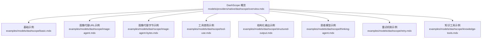
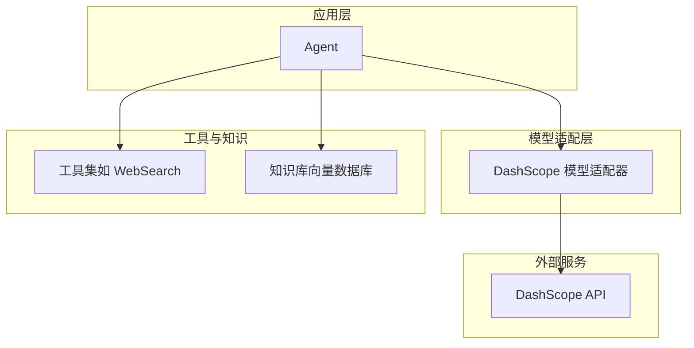
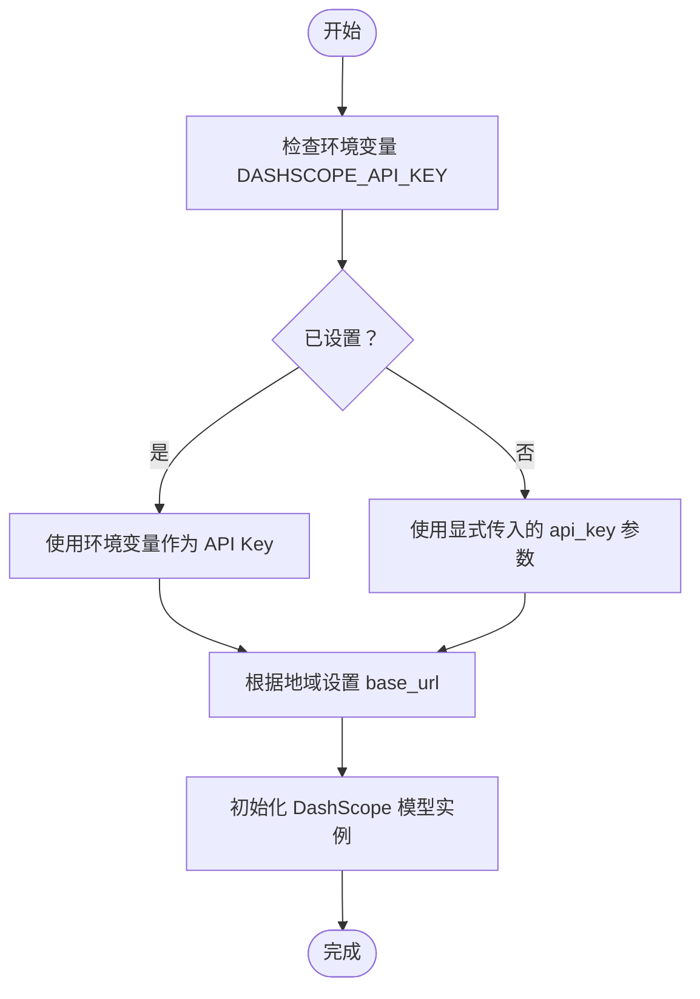
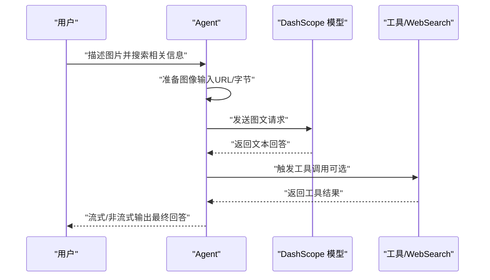
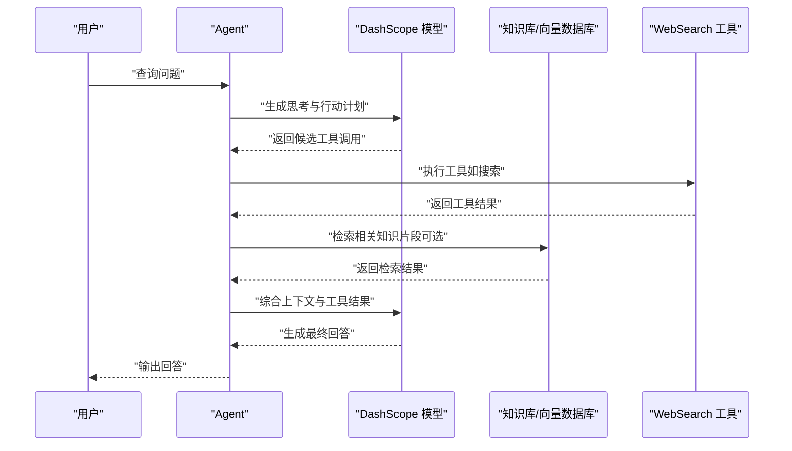
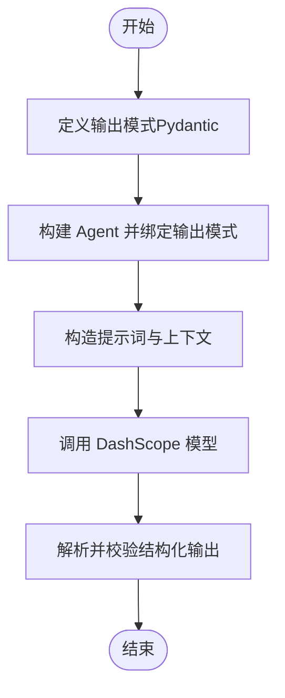
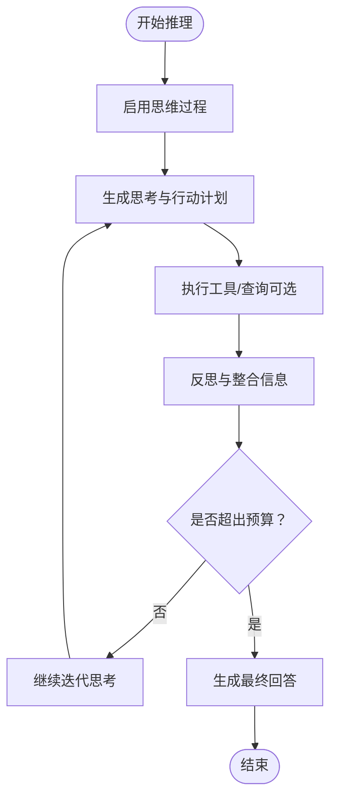
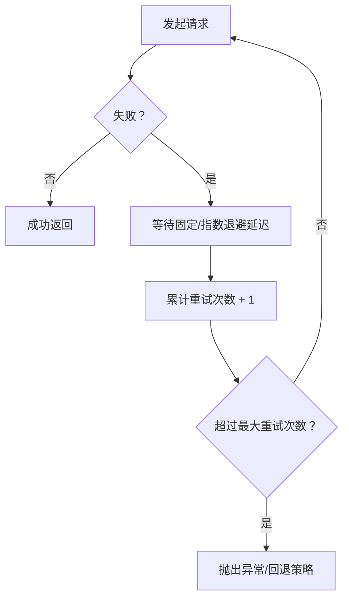
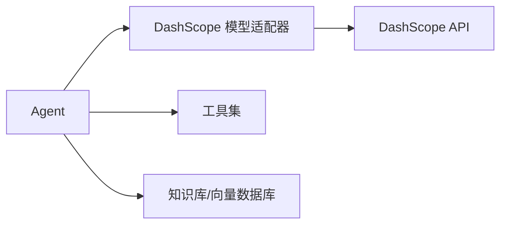

# DashScope 提供商

<cite>
**本文引用的文件**
- [DashScope 概览](file://models/providers/native/dashscope/overview.mdx)
- [DashScope 基础示例](file://examples/models/dashscope/basic.mdx)
- [DashScope 图像代理（URL）示例](file://examples/models/dashscope/image-agent.mdx)
- [DashScope 图像代理（字节）示例](file://examples/models/dashscope/image-agent-bytes.mdx)
- [DashScope 工具使用示例](file://examples/models/dashscope/tool-use.mdx)
- [DashScope 结构化输出示例](file://examples/models/dashscope/structured-output.mdx)
- [DashScope 思维模型示例](file://examples/models/dashscope/thinking-agent.mdx)
- [DashScope 重试机制示例](file://examples/models/dashscope/retry.mdx)
- [DashScope 知识工具示例](file://examples/models/dashscope/knowledge-tools.mdx)
</cite>

## 目录
1. [简介](#简介)
2. [项目结构](#项目结构)
3. [核心组件](#核心组件)
4. [架构总览](#架构总览)
5. [详细组件分析](#详细组件分析)
6. [依赖关系分析](#依赖关系分析)
7. [性能考虑](#性能考虑)
8. [故障排查指南](#故障排查指南)
9. [结论](#结论)
10. [附录](#附录)

## 简介
本文件面向在 Agno 框架中集成 DashScope（通义千问）模型提供商的开发者与使用者，系统性说明如何配置 DashScope 客户端、设置 API 密钥、选择合适模型，并通过实际示例演示中文对话、推理任务与工具调用。同时给出针对中文场景的优化建议与本地化部署思路。

## 项目结构
DashScope 集成位于“模型提供商原生实现”与“示例”两个维度：
- 概览与参数说明：位于“models/providers/native/dashscope/overview.mdx”
- 示例集合：位于“examples/models/dashscope/”，覆盖基础对话、图像理解、工具调用、结构化输出、思维模型、重试与知识工具等主题

图表来源
- [DashScope 概览:1-87](file://models/providers/native/dashscope/overview.mdx#L1-L87)
- [DashScope 基础示例:1-64](file://examples/models/dashscope/basic.mdx#L1-L64)
- [DashScope 图像代理（URL）示例:1-72](file://examples/models/dashscope/image-agent.mdx#L1-L72)
- [DashScope 图像代理（字节）示例:1-69](file://examples/models/dashscope/image-agent-bytes.mdx#L1-L69)
- [DashScope 工具使用示例:1-57](file://examples/models/dashscope/tool-use.mdx#L1-L57)
- [DashScope 结构化输出示例:1-76](file://examples/models/dashscope/structured-output.mdx#L1-L76)
- [DashScope 思维模型示例:1-60](file://examples/models/dashscope/thinking-agent.mdx#L1-L60)
- [DashScope 重试机制示例:1-50](file://examples/models/dashscope/retry.mdx#L1-L50)
- [DashScope 知识工具示例:1-81](file://examples/models/dashscope/knowledge-tools.mdx#L1-L81)

章节来源
- [DashScope 概览:1-87](file://models/providers/native/dashscope/overview.mdx#L1-L87)

## 核心组件
- DashScope 客户端封装
  - 支持通过环境变量或显式参数传入 API Key
  - 默认兼容 OpenAI 兼容接口路径，便于迁移与统一调用
  - 支持思维模型参数：开启思考过程、思考预算等
- 模型选择与推荐
  - 推荐“qwen-plus”用于大多数场景
  - 多模态场景可选用“qwen-vl-plus”
- 工具与知识增强
  - 可与 WebSearch、KnowledgeTools 等工具协同，实现检索增强与推理增强
- 流式与异步输出
  - 支持同步、异步与流式输出，满足不同交互需求

章节来源
- [DashScope 概览:11-13](file://models/providers/native/dashscope/overview.mdx#L11-L13)
- [DashScope 概览:15-29](file://models/providers/native/dashscope/overview.mdx#L15-L29)
- [DashScope 概览:55-67](file://models/providers/native/dashscope/overview.mdx#L55-L67)
- [DashScope 概览:70-87](file://models/providers/native/dashscope/overview.mdx#L70-L87)

## 架构总览
DashScope 在 Agno 中以“模型适配器”的形式接入，遵循统一的模型接口，支持：
- 文本对话
- 多模态输入（文本+图片）
- 工具调用
- 结构化输出
- 推理思维链（Thinking）

图表来源
- [DashScope 概览:31-53](file://models/providers/native/dashscope/overview.mdx#L31-L53)
- [DashScope 工具使用示例:23-27](file://examples/models/dashscope/tool-use.mdx#L23-L27)
- [DashScope 知识工具示例:48-52](file://examples/models/dashscope/knowledge-tools.mdx#L48-L52)

## 详细组件分析

### 组件一：客户端初始化与认证
- 关键点
  - 通过环境变量设置 API Key；也可在构造函数中显式传入
  - 国内用户需注意 base_url 的切换，避免“无效密钥”错误
- 使用建议
  - 开发阶段建议使用环境变量管理密钥
  - 生产部署时结合密钥管理服务与只读权限策略

图表来源
- [DashScope 概览:15-29](file://models/providers/native/dashscope/overview.mdx#L15-L29)
- [DashScope 概览:62-63](file://models/providers/native/dashscope/overview.mdx#L62-L63)

章节来源
- [DashScope 概览:15-29](file://models/providers/native/dashscope/overview.mdx#L15-L29)
- [DashScope 概览:62-63](file://models/providers/native/dashscope/overview.mdx#L62-L63)

### 组件二：多模态与图像理解
- 关键点
  - 使用 qwen-vl-plus 支持图文理解
  - 支持从 URL 或字节流加载图片
- 实践要点
  - 图片字节方式适合离线或本地资源
  - 流式输出可提升交互体验

图表来源
- [DashScope 图像代理（URL）示例:24-43](file://examples/models/dashscope/image-agent.mdx#L24-L43)
- [DashScope 图像代理（字节）示例:25-47](file://examples/models/dashscope/image-agent-bytes.mdx#L25-L47)
- [DashScope 工具使用示例:23-42](file://examples/models/dashscope/tool-use.mdx#L23-L42)

章节来源
- [DashScope 图像代理（URL）示例:24-43](file://examples/models/dashscope/image-agent.mdx#L24-L43)
- [DashScope 图像代理（字节）示例:25-47](file://examples/models/dashscope/image-agent-bytes.mdx#L25-L47)
- [DashScope 工具使用示例:23-42](file://examples/models/dashscope/tool-use.mdx#L23-L42)

### 组件三：工具调用与检索增强
- 关键点
  - 将工具注入 Agent，实现“先思考再行动”
  - 结合知识库（向量数据库）进行检索增强与分析
- 适用场景
  - 问答系统、智能客服、内容创作与分析

图表来源
- [DashScope 工具使用示例:23-42](file://examples/models/dashscope/tool-use.mdx#L23-L42)
- [DashScope 知识工具示例:48-63](file://examples/models/dashscope/knowledge-tools.mdx#L48-L63)

章节来源
- [DashScope 工具使用示例:23-42](file://examples/models/dashscope/tool-use.mdx#L23-L42)
- [DashScope 知识工具示例:48-63](file://examples/models/dashscope/knowledge-tools.mdx#L48-L63)

### 组件四：结构化输出与模式约束
- 关键点
  - 通过输出模式（Pydantic Schema）约束模型输出格式
  - 适用于抽取、生成结构化数据（如 JSON）
- 实践建议
  - 明确字段定义与默认值，减少后处理成本
  - 在提示词中强调输出格式要求

图表来源
- [DashScope 结构化输出示例:24-48](file://examples/models/dashscope/structured-output.mdx#L24-L48)

章节来源
- [DashScope 结构化输出示例:24-48](file://examples/models/dashscope/structured-output.mdx#L24-L48)

### 组件五：思维模型与推理能力
- 关键点
  - 通过 enable_thinking 与 thinking_budget 控制推理深度与开销
  - 适合复杂推理、规划与多步思考任务
- 使用建议
  - 合理设置预算，平衡质量与成本
  - 对关键决策环节开启思维输出以便审计

图表来源
- [DashScope 概览:70-87](file://models/providers/native/dashscope/overview.mdx#L70-L87)
- [DashScope 思维模型示例:1-60](file://examples/models/dashscope/thinking-agent.mdx#L1-L60)

章节来源
- [DashScope 概览:70-87](file://models/providers/native/dashscope/overview.mdx#L70-L87)
- [DashScope 思维模型示例:1-60](file://examples/models/dashscope/thinking-agent.mdx#L1-L60)

### 组件六：重试机制与稳定性
- 关键点
  - 通过 retries、delay_between_retries、exponential_backoff 控制重试策略
  - 适合网络波动或上游限流场景
- 实践建议
  - 为关键流程开启指数退避重试
  - 设置合理的最大重试次数与超时时间

图表来源
- [DashScope 重试机制示例:19-26](file://examples/models/dashscope/retry.mdx#L19-L26)

章节来源
- [DashScope 重试机制示例:19-26](file://examples/models/dashscope/retry.mdx#L19-L26)

## 依赖关系分析
- 模块耦合
  - Agent 与 DashScope 模型适配器松耦合，通过统一接口交互
  - 工具与知识库通过插件化注入，便于替换与扩展
- 外部依赖
  - DashScope API（含国际版与国内版 base_url 切换）
  - 工具链（如 WebSearch）、向量数据库（如 LanceDB）等

图表来源
- [DashScope 概览:31-53](file://models/providers/native/dashscope/overview.mdx#L31-L53)
- [DashScope 工具使用示例:23-27](file://examples/models/dashscope/tool-use.mdx#L23-L27)
- [DashScope 知识工具示例:48-52](file://examples/models/dashscope/knowledge-tools.mdx#L48-L52)

章节来源
- [DashScope 概览:31-53](file://models/providers/native/dashscope/overview.mdx#L31-L53)
- [DashScope 工具使用示例:23-27](file://examples/models/dashscope/tool-use.mdx#L23-L27)
- [DashScope 知识工具示例:48-52](file://examples/models/dashscope/knowledge-tools.mdx#L48-L52)

## 性能考虑
- 模型选择
  - 日常对话与通用任务优先选择“qwen-plus”
  - 复杂推理与长上下文任务可评估更高规格模型
- 多模态与工具
  - 图像理解与工具调用会增加延迟，建议在必要场景启用
- 输出控制
  - 启用流式输出可改善感知延迟
  - 结构化输出可减少后处理开销
- 网络与稳定性
  - 在不稳定网络环境下启用指数退避重试
  - 合理设置超时与预算，避免长时间阻塞

## 故障排查指南
- 常见问题
  - “无效 API Key”：确认 base_url 是否正确（国内用户需切换到国内域名）
  - 调用失败：检查 retries 与延迟参数，确保有足够重试次数
  - 输出格式不符：核对输出模式定义与提示词约束
- 排查步骤
  - 核对环境变量与构造参数
  - 查看网络连通性与速率限制
  - 分模块验证工具与知识库可用性

章节来源
- [DashScope 概览:62-63](file://models/providers/native/dashscope/overview.mdx#L62-L63)
- [DashScope 重试机制示例:19-26](file://examples/models/dashscope/retry.mdx#L19-L26)
- [DashScope 结构化输出示例:24-48](file://examples/models/dashscope/structured-output.mdx#L24-L48)

## 结论
DashScope 在 Agno 中提供了与 OpenAI 兼容的统一接口，配合丰富的参数与工具生态，能够高效支撑中文场景下的对话、推理、工具调用与结构化输出。通过合理选择模型、启用思维链与检索增强，并结合稳定的重试与流式输出策略，可在生产环境中获得稳定且高质量的用户体验。

## 附录
- 快速上手清单
  - 设置 DASHSCOPE_API_KEY 环境变量
  - 选择合适模型（qwen-plus/qwen-vl-plus）
  - 注入工具与知识库（可选）
  - 开启流式输出与必要的重试策略
- 中文优化建议
  - 在提示词中明确语言偏好与风格
  - 对长文本任务启用思维链与预算控制
  - 使用结构化输出降低歧义与后处理成本
- 本地化部署思路
  - 若涉及敏感数据，可参考本地模型运行方案（如 Ollama/VLLM），但需权衡与 DashScope 的生态差异与迁移成本