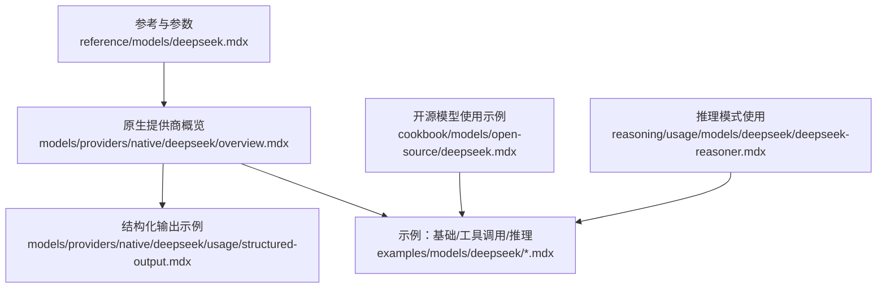
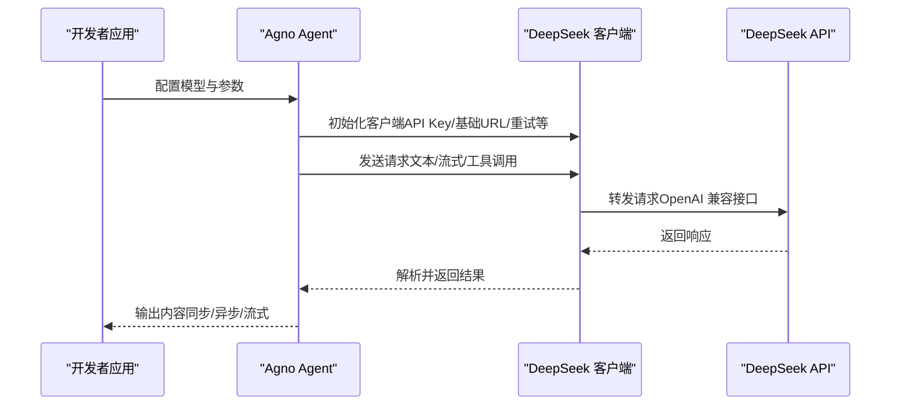
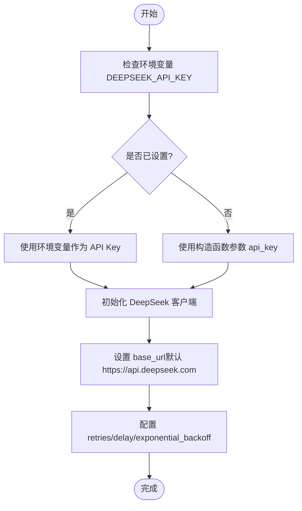
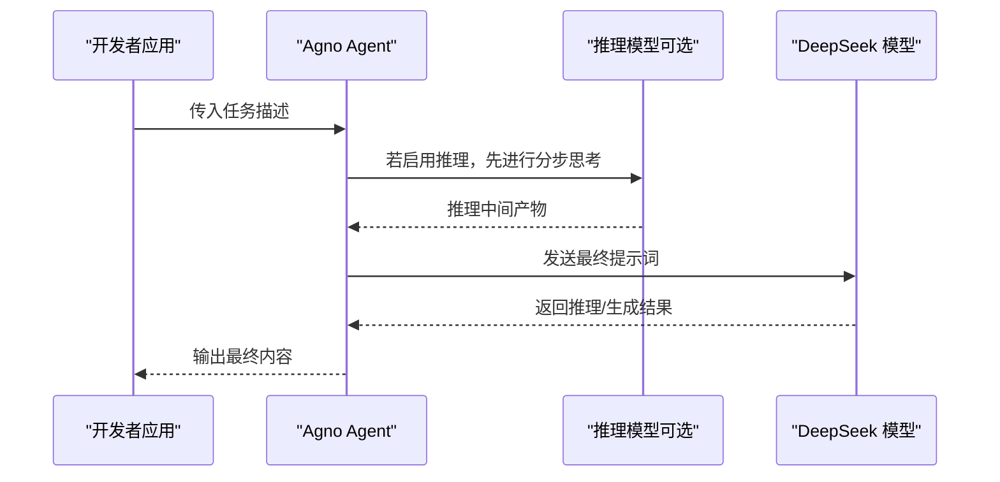
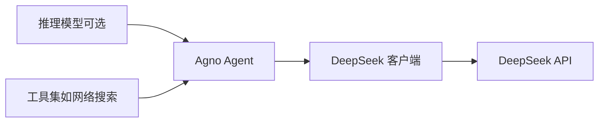

# DeepSeek 提供商

<cite>
**本文引用的文件**
- [reference/models/deepseek.mdx](file://reference/models/deepseek.mdx)
- [models/providers/native/deepseek/overview.mdx](file://models/providers/native/deepseek/overview.mdx)
- [models/providers/native/deepseek/usage/structured-output.mdx](file://models/providers/native/deepseek/usage/structured-output.mdx)
- [cookbook/models/open-source/deepseek.mdx](file://cookbook/models/open-source/deepseek.mdx)
- [examples/models/deepseek/basic.mdx](file://examples/models/deepseek/basic.mdx)
- [examples/models/deepseek/tool-use.mdx](file://examples/models/deepseek/tool-use.mdx)
- [examples/models/deepseek/reasoning-agent.mdx](file://examples/models/deepseek/reasoning-agent.mdx)
- [reasoning/usage/models/deepseek/deepseek-reasoner.mdx](file://reasoning/usage/models/deepseek/deepseek-reasoner.mdx)
</cite>

## 目录
1. [简介](#简介)
2. [项目结构](#项目结构)
3. [核心组件](#核心组件)
4. [架构总览](#架构总览)
5. [详细组件分析](#详细组件分析)
6. [依赖关系分析](#依赖关系分析)
7. [性能考虑](#性能考虑)
8. [故障排查指南](#故障排查指南)
9. [结论](#结论)
10. [附录](#附录)

## 简介
本文件面向在 Agno 生态中集成 DeepSeek 模型提供商的开发者，系统性说明 DeepSeek 系列模型（如 DeepSeek Chat、DeepSeek Reasoner）的可用性、配置方法、参数说明、能力边界以及在代码生成与推理场景中的最佳实践。DeepSeek 提供 OpenAI 兼容接口，支持大多数 OpenAI 参数，并通过环境变量或显式参数注入 API Key；其结构化输出当前不完全兼容，需注意相关限制。

## 项目结构
围绕 DeepSeek 的文档与示例分布在以下位置：
- 参考与参数说明：reference/models/deepseek.mdx
- 原生提供商概览与示例：models/providers/native/deepseek/*
- 结构化输出示例：models/providers/native/deepseek/usage/structured-output.mdx
- 开源模型使用示例：cookbook/models/open-source/deepseek.mdx
- 示例脚本与运行方式：examples/models/deepseek/*.mdx
- 推理模式使用：reasoning/usage/models/deepseek/deepseek-reasoner.mdx

**图表来源**
- [reference/models/deepseek.mdx:1-21](file://reference/models/deepseek.mdx#L1-L21)
- [models/providers/native/deepseek/overview.mdx:1-72](file://models/providers/native/deepseek/overview.mdx#L1-L72)
- [models/providers/native/deepseek/usage/structured-output.mdx:1-69](file://models/providers/native/deepseek/usage/structured-output.mdx#L1-L69)
- [cookbook/models/open-source/deepseek.mdx:1-84](file://cookbook/models/open-source/deepseek.mdx#L1-L84)
- [examples/models/deepseek/basic.mdx:1-58](file://examples/models/deepseek/basic.mdx#L1-L58)
- [examples/models/deepseek/tool-use.mdx:1-52](file://examples/models/deepseek/tool-use.mdx#L1-L52)
- [examples/models/deepseek/reasoning-agent.mdx:1-55](file://examples/models/deepseek/reasoning-agent.mdx#L1-L55)
- [reasoning/usage/models/deepseek/deepseek-reasoner.mdx:1-59](file://reasoning/usage/models/deepseek/deepseek-reasoner.mdx#L1-L59)

**章节来源**
- [reference/models/deepseek.mdx:1-21](file://reference/models/deepseek.mdx#L1-L21)
- [models/providers/native/deepseek/overview.mdx:1-72](file://models/providers/native/deepseek/overview.mdx#L1-L72)

## 核心组件
- DeepSeek 客户端封装
  - 支持通过环境变量或显式参数传入 API Key
  - 默认基础地址与 OpenAI 兼容接口对齐
  - 支持重试次数与延迟策略（含指数退避开关）
- 可用模型
  - deepseek-chat：通用对话模型，适合多数基础场景
  - deepseek-reasoner：高级推理模型，适合复杂问题与多步推理
- 能力边界
  - 结构化输出当前不完全兼容，需谨慎使用 JSON Mode 或输出模式

**章节来源**
- [reference/models/deepseek.mdx:8-21](file://reference/models/deepseek.mdx#L8-L21)
- [models/providers/native/deepseek/overview.mdx:54-72](file://models/providers/native/deepseek/overview.mdx#L54-L72)

## 架构总览
下图展示了从应用到 DeepSeek 提供商的整体调用链路与关键节点：

**图表来源**
- [models/providers/native/deepseek/overview.mdx:17-31](file://models/providers/native/deepseek/overview.mdx#L17-L31)
- [reference/models/deepseek.mdx:10-21](file://reference/models/deepseek.mdx#L10-L21)

## 详细组件分析

### 组件一：认证与客户端初始化
- 认证方式
  - 优先使用环境变量 DEEPSEEK_API_KEY
  - 也可通过构造函数显式传入 api_key
- 基础地址
  - 默认 base_url 为 https://api.deepseek.com
- 重试策略
  - retries：失败重试次数
  - delay_between_retries：每次重试间隔（秒）
  - exponential_backoff：启用后按指数增加延迟

**图表来源**
- [models/providers/native/deepseek/overview.mdx:17-31](file://models/providers/native/deepseek/overview.mdx#L17-L31)
- [reference/models/deepseek.mdx:10-21](file://reference/models/deepseek.mdx#L10-L21)

**章节来源**
- [models/providers/native/deepseek/overview.mdx:17-31](file://models/providers/native/deepseek/overview.mdx#L17-L31)
- [reference/models/deepseek.mdx:10-21](file://reference/models/deepseek.mdx#L10-L21)

### 组件二：模型选择与参数优化
- 模型选择
  - deepseek-chat：通用对话，适合日常问答、总结、生成
  - deepseek-reasoner：推理增强，适合逻辑题、规划类任务
- 参数建议
  - temperature：根据稳定性需求调整
  - max_tokens：控制输出长度，避免过长导致成本上升
  - top_p/seed：在需要稳定输出时可固定 seed
  - stream：开启流式输出以提升交互体验
- 注意事项
  - 结构化输出当前不完全兼容，建议配合 JSON Mode 使用或改用其他模式

**章节来源**
- [models/providers/native/deepseek/overview.mdx:10-15](file://models/providers/native/deepseek/overview.mdx#L10-L15)
- [models/providers/native/deepseek/overview.mdx:64-66](file://models/providers/native/deepseek/overview.mdx#L64-L66)

### 组件三：代码生成与推理任务
- 代码生成
  - 使用 deepseek-chat 执行生成类任务
  - 建议结合工具调用（如网络搜索）以增强信息支撑
- 推理任务
  - 使用 deepseek-reasoner 处理复杂问题与多步推理
  - 可结合推理模式（reasoning model）进行分层思考

**图表来源**
- [examples/models/deepseek/reasoning-agent.mdx:20-33](file://examples/models/deepseek/reasoning-agent.mdx#L20-L33)
- [reasoning/usage/models/deepseek/deepseek-reasoner.mdx:13-28](file://reasoning/usage/models/deepseek/deepseek-reasoner.mdx#L13-L28)

**章节来源**
- [examples/models/deepseek/reasoning-agent.mdx:1-55](file://examples/models/deepseek/reasoning-agent.mdx#L1-L55)
- [reasoning/usage/models/deepseek/deepseek-reasoner.mdx:1-59](file://reasoning/usage/models/deepseek/deepseek-reasoner.mdx#L1-L59)

### 组件四：工具调用与稳定性建议
- 工具调用现状
  - 当前 deepseek-chat 的函数调用能力尚不稳定，可能出现循环调用或空响应
  - 建议在测试阶段观察行为，必要时回退至手动拼接或外部工具
- 最佳实践
  - 对于高可靠性任务，优先使用 deepseek-reasoner
  - 将工具调用与模型输出解耦，先由模型生成思路，再执行工具调用
  - 合理设置超时与重试，避免长时间阻塞

**章节来源**
- [examples/models/deepseek/tool-use.mdx:18-21](file://examples/models/deepseek/tool-use.mdx#L18-L21)

### 组件五：结构化输出与 JSON Mode
- 当前限制
  - DeepSeek 对结构化输出支持不完全兼容，建议使用 JSON Mode 或自定义 Schema
- 实践要点
  - 明确输出字段与约束，减少歧义
  - 在示例中通过 Pydantic 模型定义输出结构，便于解析与校验

**章节来源**
- [models/providers/native/deepseek/usage/structured-output.mdx:15-45](file://models/providers/native/deepseek/usage/structured-output.mdx#L15-L45)
- [models/providers/native/deepseek/overview.mdx:64-66](file://models/providers/native/deepseek/overview.mdx#L64-L66)

## 依赖关系分析
- 组件内聚与耦合
  - DeepSeek 客户端与 Agno Agent 强耦合，通过统一接口适配 OpenAI 兼容协议
  - 推理模式与主模型解耦，可独立配置与切换
- 外部依赖
  - 依赖 DeepSeek API（默认 https://api.deepseek.com）
  - 依赖环境变量 DEEPSEEK_API_KEY
- 循环依赖
  - 文档与示例之间为单向依赖，无循环

**图表来源**
- [models/providers/native/deepseek/overview.mdx:35-50](file://models/providers/native/deepseek/overview.mdx#L35-L50)
- [examples/models/deepseek/tool-use.mdx:10-27](file://examples/models/deepseek/tool-use.mdx#L10-L27)

**章节来源**
- [models/providers/native/deepseek/overview.mdx:35-50](file://models/providers/native/deepseek/overview.mdx#L35-L50)
- [examples/models/deepseek/tool-use.mdx:10-27](file://examples/models/deepseek/tool-use.mdx#L10-L27)

## 性能考虑
- 流式输出
  - 开启 stream 可显著改善交互体验，尤其在长文本生成与工具调用场景
- 超时与重试
  - 根据业务 SLA 设置合理的 retries 与 delay_between_retries
  - 启用指数退避可降低峰值压力
- 模型选择
  - 对于简单任务优先使用 deepseek-chat，复杂推理使用 deepseek-reasoner
- 成本控制
  - 合理设置 max_tokens，避免不必要的长输出
  - 在不需要结构化输出时，避免额外的 JSON Mode 校验开销

[本节为通用指导，无需特定文件来源]

## 故障排查指南
- 无法认证
  - 确认 DEEPSEEK_API_KEY 是否正确设置
  - 如使用本地开发环境，确认环境变量生效范围
- 请求失败或超时
  - 检查 retries 与 delay_between_retries 配置
  - 若启用指数退避，确认网络抖动与服务端限速情况
- 函数调用不稳定
  - 当前 deepseek-chat 的函数调用能力尚不稳定，建议规避或降级处理
- 结构化输出异常
  - 当前支持不完全兼容，建议改用 JSON Mode 或自定义 Schema

**章节来源**
- [models/providers/native/deepseek/overview.mdx:17-31](file://models/providers/native/deepseek/overview.mdx#L17-L31)
- [examples/models/deepseek/tool-use.mdx:18-21](file://examples/models/deepseek/tool-use.mdx#L18-L21)
- [models/providers/native/deepseek/overview.mdx:64-66](file://models/providers/native/deepseek/overview.mdx#L64-L66)

## 结论
DeepSeek 在 Agno 中提供了 OpenAI 兼容的接入方式，具备良好的通用对话与推理能力。对于结构化输出与函数调用，当前存在兼容性与稳定性限制，建议在生产环境中谨慎使用。通过合理配置 API Key、基础地址与重试策略，并结合模型特性（chat/reasoner），可在代码生成与推理任务中获得稳定体验。

[本节为总结，无需特定文件来源]

## 附录

### 快速上手清单
- 设置 API Key：DEEPSEEK_API_KEY
- 选择模型：deepseek-chat（通用）、deepseek-reasoner（推理）
- 启用流式输出：stream=True
- 工具调用：关注当前稳定性，必要时降级
- 结构化输出：建议使用 JSON Mode 或自定义 Schema

**章节来源**
- [models/providers/native/deepseek/overview.mdx:17-31](file://models/providers/native/deepseek/overview.mdx#L17-L31)
- [models/providers/native/deepseek/overview.mdx:64-66](file://models/providers/native/deepseek/overview.mdx#L64-L66)

### 示例与路径索引
- 基础示例与运行方式：见示例文档
  - [examples/models/deepseek/basic.mdx:1-58](file://examples/models/deepseek/basic.mdx#L1-L58)
  - [examples/models/deepseek/tool-use.mdx:1-52](file://examples/models/deepseek/tool-use.mdx#L1-L52)
  - [examples/models/deepseek/reasoning-agent.mdx:1-55](file://examples/models/deepseek/reasoning-agent.mdx#L1-L55)
- 开源模型使用示例
  - [cookbook/models/open-source/deepseek.mdx:1-84](file://cookbook/models/open-source/deepseek.mdx#L1-L84)
- 结构化输出示例
  - [models/providers/native/deepseek/usage/structured-output.mdx:1-69](file://models/providers/native/deepseek/usage/structured-output.mdx#L1-L69)
- 推理模式使用
  - [reasoning/usage/models/deepseek/deepseek-reasoner.mdx:1-59](file://reasoning/usage/models/deepseek/deepseek-reasoner.mdx#L1-L59)