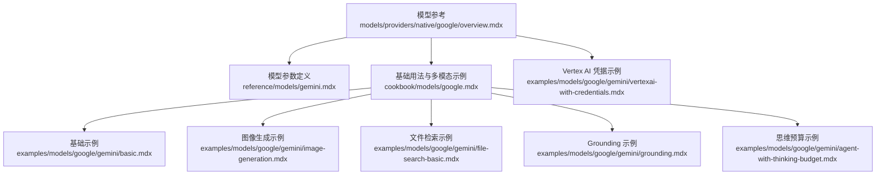
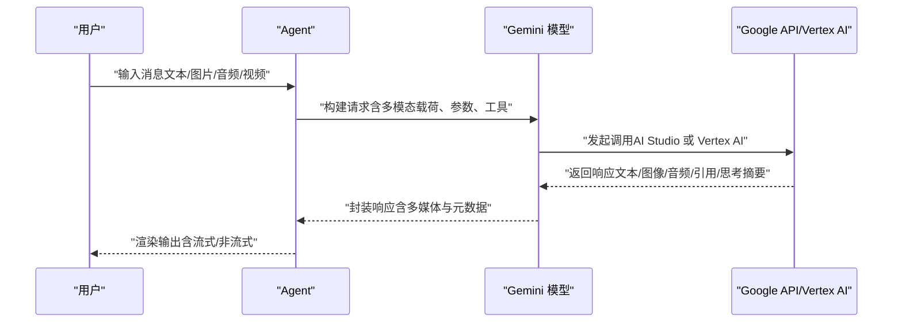
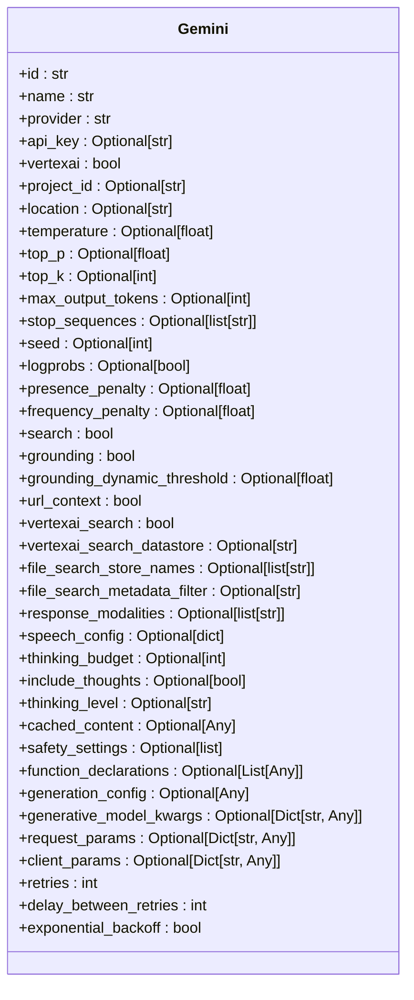
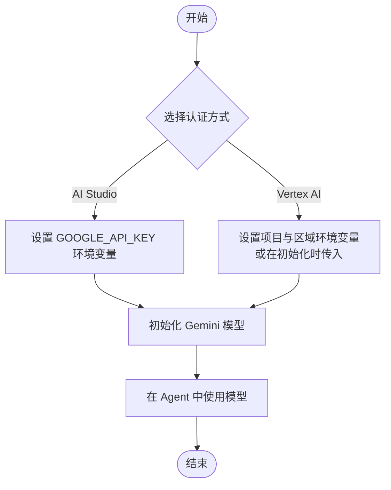
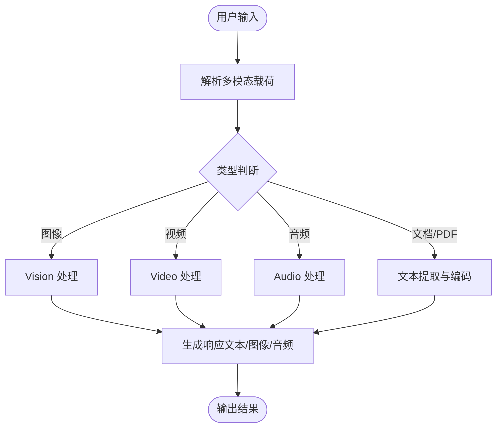
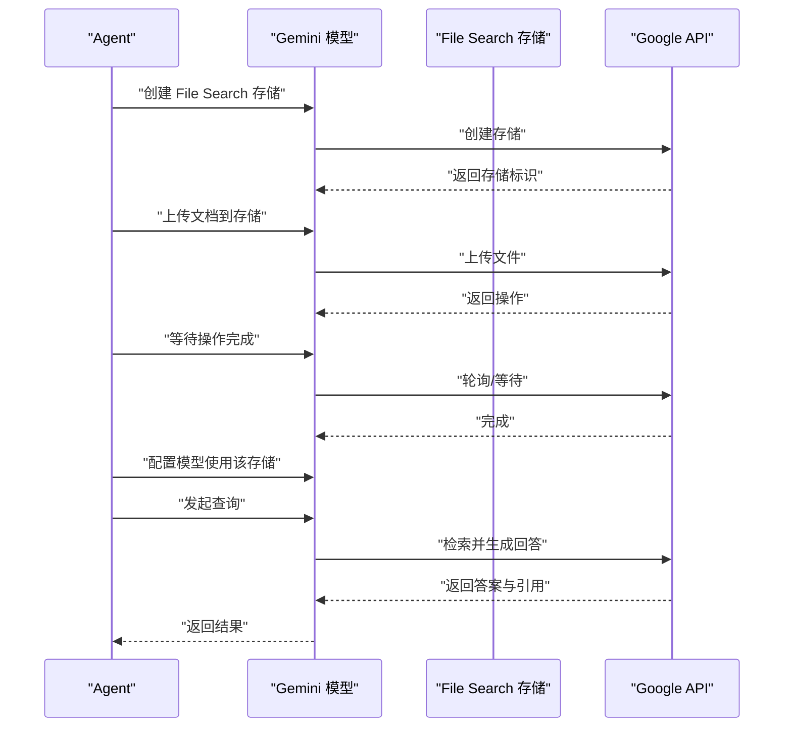
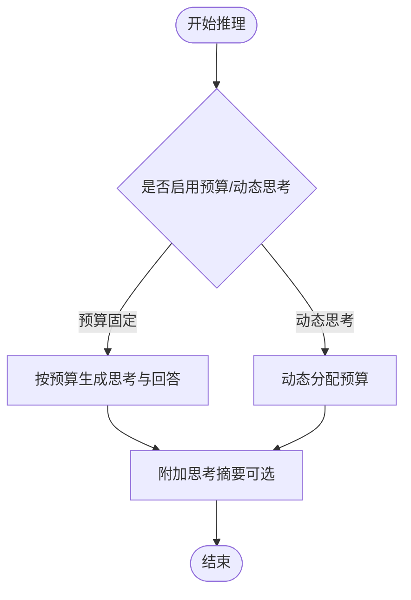
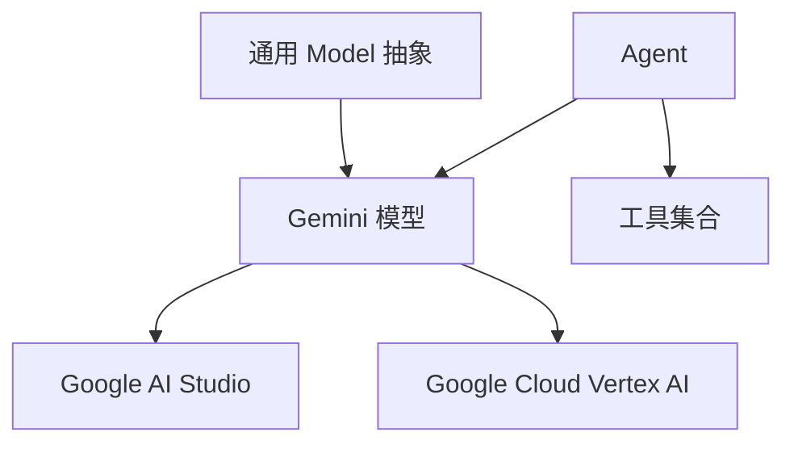

# Google 提供商

<cite>
**本文引用的文件**
- [overview.mdx](file://models/providers/native/google/overview.mdx)
- [gemini.mdx](file://reference/models/gemini.mdx)
- [google.mdx](file://cookbook/models/google.mdx)
- [basic.mdx](file://examples/models/google/gemini/basic.mdx)
- [image-generation.mdx](file://examples/models/google/gemini/image-generation.mdx)
- [file-search-basic.mdx](file://examples/models/google/gemini/file-search-basic.mdx)
- [grounding.mdx](file://examples/models/google/gemini/grounding.mdx)
- [agent-with-thinking-budget.mdx](file://examples/models/google/gemini/agent-with-thinking-budget.mdx)
- [vertexai-with-credentials.mdx](file://examples/models/google/gemini/vertexai-with-credentials.mdx)
</cite>

## 目录
1. [简介](#简介)
2. [项目结构](#项目结构)
3. [核心组件](#核心组件)
4. [架构总览](#架构总览)
5. [详细组件分析](#详细组件分析)
6. [依赖关系分析](#依赖关系分析)
7. [性能考虑](#性能考虑)
8. [故障排查指南](#故障排查指南)
9. [结论](#结论)
10. [附录](#附录)

## 简介
本文件面向在 Google Cloud 上集成 Google Gemini 模型提供商（含 AI Studio 与 Vertex AI）的工程师与产品团队，系统性说明如何在应用中接入 Gemini 系列模型，覆盖文本、图像、音频、视频等多模态能力，并提供认证配置、参数调优、成本优化与最佳实践。文档同时给出可直接参考的示例路径，帮助快速落地。

## 项目结构
围绕 Google 提供商的文档与示例主要分布在以下位置：
- 模型参考与参数：models/providers/native/google/overview.mdx
- 模型参数定义：reference/models/gemini.mdx
- 基础用法与多模态示例：cookbook/models/google.mdx
- 具体示例（基础、图像生成、文件检索、思维预算、Vertex AI 凭据等）：examples/models/google/gemini/*.mdx

**图表来源**
- [overview.mdx:1-469](file://models/providers/native/google/overview.mdx#L1-L469)
- [gemini.mdx:1-27](file://reference/models/gemini.mdx#L1-L27)
- [google.mdx:1-102](file://cookbook/models/google.mdx#L1-L102)
- [basic.mdx:1-58](file://examples/models/google/gemini/basic.mdx#L1-L58)
- [image-generation.mdx:1-64](file://examples/models/google/gemini/image-generation.mdx#L1-L64)
- [file-search-basic.mdx:1-123](file://examples/models/google/gemini/file-search-basic.mdx#L1-L123)
- [grounding.mdx:1-60](file://examples/models/google/gemini/grounding.mdx#L1-L60)
- [agent-with-thinking-budget.mdx:1-58](file://examples/models/google/gemini/agent-with-thinking-budget.mdx#L1-L58)
- [vertexai-with-credentials.mdx:1-67](file://examples/models/google/gemini/vertexai-with-credentials.mdx#L1-L67)

**章节来源**
- [overview.mdx:1-469](file://models/providers/native/google/overview.mdx#L1-L469)
- [gemini.mdx:1-27](file://reference/models/gemini.mdx#L1-L27)
- [google.mdx:1-102](file://cookbook/models/google.mdx#L1-L102)

## 核心组件
- Gemini 模型类：封装对 Google Gemini 的访问，支持 AI Studio 与 Vertex AI 双通道；提供多模态输入输出、搜索/检索、思维模式、结构化输出、工具调用、缓存等能力。
- Agent 集成：通过 Agent 封装模型调用，统一管理上下文、流式输出、多媒体响应与工具协作。
- 文件搜索与检索：基于 File Search 的本地知识库上传、检索与引用溯源。
- 思维模式与预算：针对高复杂度推理任务启用扩展思考能力与预算控制。
- 认证与部署：支持环境变量与显式凭据两种认证方式，适配开发与生产环境。

**章节来源**
- [overview.mdx:1-469](file://models/providers/native/google/overview.mdx#L1-L469)
- [gemini.mdx:1-27](file://reference/models/gemini.mdx#L1-L27)

## 架构总览
下图展示了从 Agent 到 Gemini 模型的典型调用链路，以及多模态输入与输出的关键节点。

**图表来源**
- [overview.mdx:1-469](file://models/providers/native/google/overview.mdx#L1-L469)
- [google.mdx:1-102](file://cookbook/models/google.mdx#L1-L102)

## 详细组件分析

### 组件一：Gemini 模型参数与能力矩阵
- 参数维度：模型标识、名称、提供商、API 密钥、生成配置、安全策略、工具与工具配置、系统指令、缓存内容、请求与客户端参数、思维模式开关与预算、重试策略等。
- 能力矩阵：多模态输入（图像、视频、音频、PDF）、图像生成与编辑、实时网络检索（Grounding/Search）、私有知识检索（Vertex AI Search）、URL 上下文抽取、文件检索（RAG）、语音合成、思维模型、结构化输出、函数调用工具、上下文缓存、思维预算与思考级别。

**图表来源**
- [gemini.mdx:8-27](file://reference/models/gemini.mdx#L8-L27)
- [overview.mdx:427-469](file://models/providers/native/google/overview.mdx#L427-L469)

**章节来源**
- [gemini.mdx:1-27](file://reference/models/gemini.mdx#L1-L27)
- [overview.mdx:112-469](file://models/providers/native/google/overview.mdx#L112-L469)

### 组件二：认证与部署（AI Studio 与 Vertex AI）
- AI Studio：通过环境变量 GOOGLE_API_KEY 使用 API 密钥进行认证。
- Vertex AI：支持应用默认凭据或显式服务账号凭据；需设置项目 ID 与区域，或在 Agent 初始化时传入。

**图表来源**
- [overview.mdx:29-88](file://models/providers/native/google/overview.mdx#L29-L88)

**章节来源**
- [overview.mdx:29-88](file://models/providers/native/google/overview.mdx#L29-L88)

### 组件三：多模态输入与输出
- 多模态输入：图像、视频、音频、PDF、GCS/外部 URL、S3 预签名链接等。
- 输出模态：文本、图像、音频。
- 示例路径：
  - 图像输入与理解：[image-input 示例](file://examples/models/google/gemini/image-input.mdx)
  - 视频输入：[video-input 示例](file://examples/models/google/gemini/video-input-file-upload.mdx)
  - 音频输入：[audio-input 示例](file://examples/models/google/gemini/audio-input-file-upload.mdx)
  - PDF 输入：[pdf-input 示例](file://examples/models/google/gemini/pdf-input-url.mdx)
  - 图像生成：[image-generation 示例](file://examples/models/google/gemini/image-generation.mdx)

**图表来源**
- [overview.mdx:135-163](file://models/providers/native/google/overview.mdx#L135-L163)
- [image-generation.mdx:1-64](file://examples/models/google/gemini/image-generation.mdx#L1-L64)

**章节来源**
- [overview.mdx:135-191](file://models/providers/native/google/overview.mdx#L135-L191)
- [image-generation.mdx:1-64](file://examples/models/google/gemini/image-generation.mdx#L1-L64)

### 组件四：搜索与检索（Grounding/Search、File Search、URL Context、Vertex AI Search）
- Grounding/Search：启用网络检索与引用，2.0+ 推荐使用 search，旧版可用 grounding。
- File Search：创建存储、上传文档、等待操作完成、配置模型使用、查询并提取引用。
- URL Context：从指定 URL 抽取内容用于回答。
- Vertex AI Search：对接企业知识库进行私有检索。

**图表来源**
- [overview.mdx:193-301](file://models/providers/native/google/overview.mdx#L193-L301)
- [file-search-basic.mdx:1-123](file://examples/models/google/gemini/file-search-basic.mdx#L1-L123)

**章节来源**
- [overview.mdx:193-301](file://models/providers/native/google/overview.mdx#L193-L301)
- [file-search-basic.mdx:1-123](file://examples/models/google/gemini/file-search-basic.mdx#L1-L123)

### 组件五：思维模式与预算（Extended Thinking）
- 支持通过 thinking_budget 控制推理预算，include_thoughts 获取思考摘要；也可使用 thinking_level 简化控制。
- 示例路径：[agent-with-thinking-budget 示例](file://examples/models/google/gemini/agent-with-thinking-budget.mdx)

**图表来源**
- [overview.mdx:358-383](file://models/providers/native/google/overview.mdx#L358-L383)
- [agent-with-thinking-budget.mdx:1-58](file://examples/models/google/gemini/agent-with-thinking-budget.mdx#L1-L58)

**章节来源**
- [overview.mdx:358-383](file://models/providers/native/google/overview.mdx#L358-L383)
- [agent-with-thinking-budget.mdx:1-58](file://examples/models/google/gemini/agent-with-thinking-budget.mdx#L1-L58)

### 组件六：工具调用与结构化输出
- 工具调用：通过 function_declarations 或工具列表与外部 API 协作。
- 结构化输出：使用 Pydantic 模型约束输出格式。
- 示例路径：
  - 工具调用：[tool-use 示例:20-34](file://cookbook/models/google.mdx#L20-L34)
  - 结构化输出：[structured-output 示例:68-86](file://cookbook/models/google.mdx#L68-L86)

**章节来源**
- [overview.mdx:407-426](file://models/providers/native/google/overview.mdx#L407-L426)
- [google.mdx:20-86](file://cookbook/models/google.mdx#L20-L86)

### 组件七：上下文缓存与成本优化
- 缓存大文档或长上下文，避免重复传输，降低延迟与成本。
- 示例路径：[context-caching 示例:329-357](file://models/providers/native/google/overview.mdx#L329-L357)

**章节来源**
- [overview.mdx:329-357](file://models/providers/native/google/overview.mdx#L329-L357)

### 组件八：Vertex AI 凭据与生产环境
- 支持显式服务账号凭据，便于在容器或 CI/CD 环境中稳定认证。
- 示例路径：[vertexai-with-credentials 示例](file://examples/models/google/gemini/vertexai-with-credentials.mdx)

**章节来源**
- [vertexai-with-credentials.mdx:1-67](file://examples/models/google/gemini/vertexai-with-credentials.mdx#L1-L67)

## 依赖关系分析
- 模型层：Gemini 类继承自通用 Model，复用参数体系与错误处理。
- Agent 层：统一调度模型调用、流式输出、多媒体响应与工具执行。
- Google 服务层：AI Studio 或 Vertex AI，负责实际推理与检索。

**图表来源**
- [overview.mdx:468-469](file://models/providers/native/google/overview.mdx#L468-L469)
- [gemini.mdx:1-27](file://reference/models/gemini.mdx#L1-L27)

**章节来源**
- [overview.mdx:427-469](file://models/providers/native/google/overview.mdx#L427-L469)
- [gemini.mdx:1-27](file://reference/models/gemini.mdx#L1-L27)

## 性能考虑
- 合理设置温度、top_p、top_k、最大输出长度等生成参数，平衡质量与速度。
- 对高成本场景启用上下文缓存，减少重复传输。
- 使用文件检索前先上传并等待完成，避免重复上传带来的额外开销。
- 在需要实时信息时启用搜索/检索，但注意引用与溯源的处理以提升可信度。
- 对于高频任务优先选择轻量级模型（如 2.0-flash-lite），复杂任务再切换至 2.5-pro 或更高。

## 故障排查指南
- 认证失败
  - AI Studio：确认 GOOGLE_API_KEY 是否正确设置。
  - Vertex AI：确认项目 ID、区域与凭据配置；必要时使用显式凭据。
- 请求超时或限流
  - 检查速率限制与配额；适当增加重试次数与退避策略。
- 多模态输入异常
  - 确认媒体格式与大小限制；优先使用受支持的 URL 或云端直连。
- 搜索/检索无结果
  - 检查存储创建、上传与等待完成流程；核对检索配置与权限。
- 思维模式未生效
  - 确认模型版本支持扩展思考；检查预算与思考摘要开关。

**章节来源**
- [overview.mdx:21-21](file://models/providers/native/google/overview.mdx#L21-L21)
- [overview.mdx:29-88](file://models/providers/native/google/overview.mdx#L29-L88)
- [file-search-basic.mdx:1-123](file://examples/models/google/gemini/file-search-basic.mdx#L1-L123)

## 结论
通过统一的 Gemini 模型抽象与丰富的参数配置，结合 Agent 的多模态与工具编排能力，可在 Google Cloud 上高效构建从文本到图像、音频、视频的全栈智能应用。建议在开发阶段优先采用 AI Studio 快速验证，在生产阶段迁移至 Vertex AI 并结合显式凭据与缓存策略实现稳定与低成本运行。

## 附录
- 安装与基础示例
  - 安装命令与基础用法参考：[安装与示例:23-111](file://models/providers/native/google/overview.mdx#L23-L111)
  - 更多示例运行方式参考：[示例运行:88-102](file://cookbook/models/google.mdx#L88-L102)
- 关键示例路径
  - 基础调用：[basic 示例:1-58](file://examples/models/google/gemini/basic.mdx#L1-L58)
  - 图像生成：[image-generation 示例:1-64](file://examples/models/google/gemini/image-generation.mdx#L1-L64)
  - 文件检索：[file-search-basic 示例:1-123](file://examples/models/google/gemini/file-search-basic.mdx#L1-L123)
  - Grounding：[grounding 示例:1-60](file://examples/models/google/gemini/grounding.mdx#L1-L60)
  - 思维预算：[agent-with-thinking-budget 示例:1-58](file://examples/models/google/gemini/agent-with-thinking-budget.mdx#L1-L58)
  - Vertex AI 凭据：[vertexai-with-credentials 示例:1-67](file://examples/models/google/gemini/vertexai-with-credentials.mdx#L1-L67)