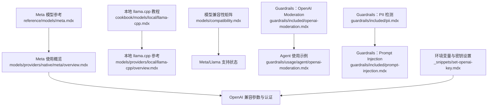
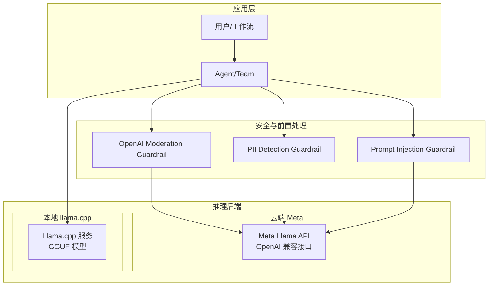
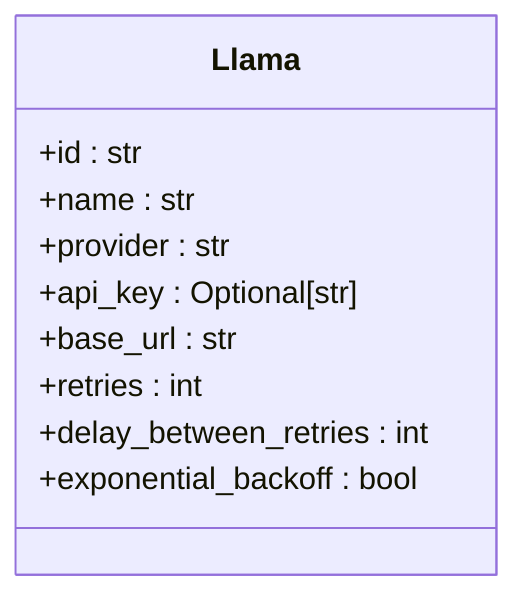
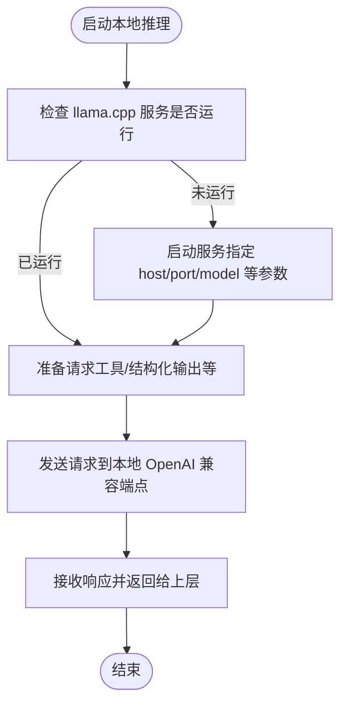
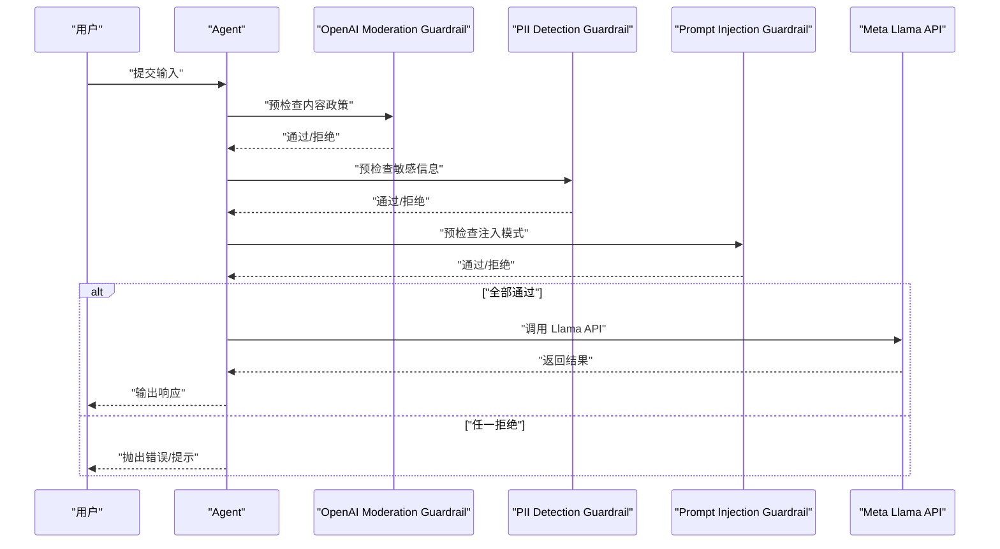
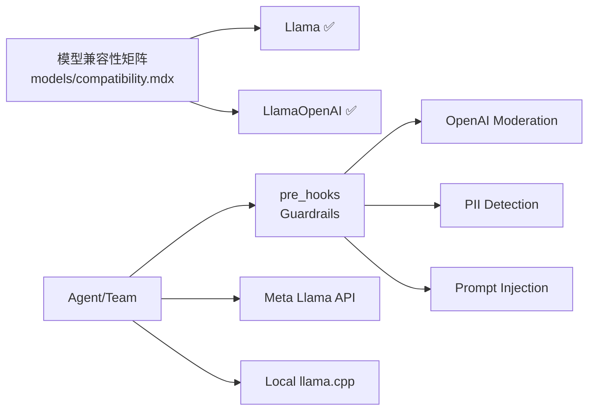

# Meta 提供商

<cite>
**本文引用的文件**
- [reference/models/meta.mdx](file://reference/models/meta.mdx)
- [models/providers/native/meta/overview.mdx](file://models/providers/native/meta/overview.mdx)
- [cookbook/models/local/llama-cpp.mdx](file://cookbook/models/local/llama-cpp.mdx)
- [models/providers/local/llama-cpp/overview.mdx](file://models/providers/local/llama-cpp/overview.mdx)
- [models/compatibility.mdx](file://models/compatibility.mdx)
- [guardrails/included/openai-moderation.mdx](file://guardrails/included/openai-moderation.mdx)
- [guardrails/usage/agent/openai-moderation.mdx](file://guardrails/usage/agent/openai-moderation.mdx)
- [guardrails/included/pii.mdx](file://guardrails/included/pii.mdx)
- [guardrails/included/prompt-injection.mdx](file://guardrails/included/prompt-injection.mdx)
- [_snippets/set-openai-key.mdx](file://_snippets/set-openai-key.mdx)
</cite>

## 目录
1. [简介](#简介)
2. [项目结构](#项目结构)
3. [核心组件](#核心组件)
4. [架构总览](#架构总览)
5. [详细组件分析](#详细组件分析)
6. [依赖关系分析](#依赖关系分析)
7. [性能考量](#性能考量)
8. [故障排查指南](#故障排查指南)
9. [结论](#结论)
10. [附录](#附录)

## 简介
本集成文档面向希望在系统中接入 Meta Llama 生态（含 Llama 3、Llama Guard 等）的开发者与产品团队。文档覆盖以下关键主题：
- 使用 Meta 提供的 OpenAI 兼容接口访问 Llama 系列模型（如 Llama 3.1、Llama 4 等）
- 在本地通过 llama.cpp 运行量化 GGUF 模型，满足资源受限场景
- 基于内置 Guardrails 实现内容安全与合规检查（如 OpenAI Moderation、PII 检测、Prompt Injection）
- 配置客户端、设置 API 密钥与使用 OpenAI 兼容接口进行对话、代码生成与安全检查
- 开源模型使用的注意事项与最佳实践

## 项目结构
围绕 Meta 集成的关键文档分布如下：
- 模型参考与参数：reference/models/meta.mdx
- Meta 提供商使用概览与认证：models/providers/native/meta/overview.mdx
- 本地推理（llama.cpp）：cookbook/models/local/llama-cpp.mdx 与 models/providers/local/llama-cpp/overview.mdx
- 模型兼容性矩阵：models/compatibility.mdx
- 内容安全与合规（Guardrails）：guardrails/included/* 与 guardrails/usage/agent/*
- 环境变量与密钥设置：_snippets/set-openai-key.mdx

**图表来源**
- [reference/models/meta.mdx:1-21](file://reference/models/meta.mdx#L1-L21)
- [models/providers/native/meta/overview.mdx:1-65](file://models/providers/native/meta/overview.mdx#L1-L65)
- [cookbook/models/local/llama-cpp.mdx:1-64](file://cookbook/models/local/llama-cpp.mdx#L1-L64)
- [models/providers/local/llama-cpp/overview.mdx:129-187](file://models/providers/local/llama-cpp/overview.mdx#L129-L187)
- [models/compatibility.mdx:67-80](file://models/compatibility.mdx#L67-L80)
- [guardrails/included/openai-moderation.mdx:1-45](file://guardrails/included/openai-moderation.mdx#L1-L45)
- [guardrails/usage/agent/openai-moderation.mdx:35-98](file://guardrails/usage/agent/openai-moderation.mdx#L35-L98)
- [guardrails/included/pii.mdx:1-78](file://guardrails/included/pii.mdx#L1-L78)
- [guardrails/included/prompt-injection.mdx:1-65](file://guardrails/included/prompt-injection.mdx#L1-L65)
- [_snippets/set-openai-key.mdx](file://_snippets/set-openai-key.mdx)

**章节来源**
- [reference/models/meta.mdx:1-21](file://reference/models/meta.mdx#L1-L21)
- [models/providers/native/meta/overview.mdx:1-65](file://models/providers/native/meta/overview.mdx#L1-L65)
- [cookbook/models/local/llama-cpp.mdx:1-64](file://cookbook/models/local/llama-cpp.mdx#L1-L64)
- [models/providers/local/llama-cpp/overview.mdx:129-187](file://models/providers/local/llama-cpp/overview.mdx#L129-L187)
- [models/compatibility.mdx:67-80](file://models/compatibility.mdx#L67-L80)
- [guardrails/included/openai-moderation.mdx:1-45](file://guardrails/included/openai-moderation.mdx#L1-L45)
- [guardrails/usage/agent/openai-moderation.mdx:35-98](file://guardrails/usage/agent/openai-moderation.mdx#L35-L98)
- [guardrails/included/pii.mdx:1-78](file://guardrails/included/pii.mdx#L1-L78)
- [guardrails/included/prompt-injection.mdx:1-65](file://guardrails/included/prompt-injection.mdx#L1-L65)
- [_snippets/set-openai-key.mdx](file://_snippets/set-openai-key.mdx)

## 核心组件
- Meta 模型适配器（OpenAI 兼容接口）
  - 支持通过 id 指定具体模型（如 Llama 3.1、Llama 4 系列），默认 provider 为 Meta，支持从环境变量读取 API Key，默认 base_url 指向 Meta 的 Llama API。
  - 参数包括：id、name、provider、api_key、base_url、重试次数与退避策略等。
  - 该适配器扩展了 OpenAI 兼容接口，可复用大多数 OpenAI 参数。

- 本地 llama.cpp 推理
  - 适合在 CPU 上运行量化 GGUF 模型，适用于资源受限或需要本地私有化的场景。
  - 支持工具调用、结构化输出等能力；提供服务器配置选项与性能优化建议（硬件加速、模型量化）。

- Guardrails 内容安全
  - OpenAI Moderation：检测输入中的政策违规内容（如暴力、仇恨言论等），可自定义分类与模型。
  - PII 检测：识别并可选屏蔽敏感信息（如 SSN、信用卡、邮箱、电话）。
  - Prompt Injection：检测注入模式，阻断针对系统的恶意指令注入尝试。

**章节来源**
- [reference/models/meta.mdx:8-21](file://reference/models/meta.mdx#L8-L21)
- [models/providers/native/meta/overview.mdx:16-64](file://models/providers/native/meta/overview.mdx#L16-L64)
- [cookbook/models/local/llama-cpp.mdx:1-64](file://cookbook/models/local/llama-cpp.mdx#L1-L64)
- [models/providers/local/llama-cpp/overview.mdx:129-187](file://models/providers/local/llama-cpp/overview.mdx#L129-L187)
- [guardrails/included/openai-moderation.mdx:1-45](file://guardrails/included/openai-moderation.mdx#L1-L45)
- [guardrails/included/pii.mdx:1-78](file://guardrails/included/pii.mdx#L1-L78)
- [guardrails/included/prompt-injection.mdx:1-65](file://guardrails/included/prompt-injection.mdx#L1-L65)

## 架构总览
下图展示了两种接入路径：云端 Meta OpenAI 兼容接口与本地 llama.cpp 推理，并标注 Guardrails 在请求前的拦截作用。

**图表来源**
- [models/providers/native/meta/overview.mdx:16-64](file://models/providers/native/meta/overview.mdx#L16-L64)
- [cookbook/models/local/llama-cpp.mdx:1-64](file://cookbook/models/local/llama-cpp.mdx#L1-L64)
- [guardrails/included/openai-moderation.mdx:1-45](file://guardrails/included/openai-moderation.mdx#L1-L45)
- [guardrails/included/pii.mdx:1-78](file://guardrails/included/pii.mdx#L1-L78)
- [guardrails/included/prompt-injection.mdx:1-65](file://guardrails/included/prompt-injection.mdx#L1-L65)

## 详细组件分析

### 组件 A：Meta 模型适配器（OpenAI 兼容）
- 职责
  - 封装 Meta 的 Llama API，暴露与 OpenAI 兼容的接口参数，便于在现有框架中无缝切换。
  - 默认读取环境变量作为 API Key，支持重试与指数退避策略，提升稳定性。
- 关键参数
  - id：模型标识（如 Llama 3.1、Llama 4 系列）
  - name/provider：模型名称与提供商标识
  - api_key/base_url：认证与服务地址
  - 重试相关：retries、delay_between_retries、exponential_backoff
- 使用要点
  - 在 Agent/Team 中直接以 model 参数传入，即可获得 OpenAI 风格的调用体验
  - 可结合 Guardrails 在请求前进行内容安全检查

**图表来源**
- [reference/models/meta.mdx:8-21](file://reference/models/meta.mdx#L8-L21)
- [models/providers/native/meta/overview.mdx:46-64](file://models/providers/native/meta/overview.mdx#L46-L64)

**章节来源**
- [reference/models/meta.mdx:8-21](file://reference/models/meta.mdx#L8-L21)
- [models/providers/native/meta/overview.mdx:16-64](file://models/providers/native/meta/overview.mdx#L16-L64)

### 组件 B：本地 llama.cpp 推理
- 职责
  - 在本地运行量化 GGUF 模型，实现低资源占用的推理能力
- 关键特性
  - 支持工具调用与结构化输出
  - 服务器配置项丰富（上下文大小、批处理、线程数、监听地址与端口等）
  - 性能优化：GPU 加速后端（CUDA/Metal/OpenCL）、模型量化等级选择
- 使用要点
  - 适合隐私敏感、数据不出域的场景
  - 与 OpenAI 兼容接口保持一致的调用风格

**图表来源**
- [cookbook/models/local/llama-cpp.mdx:1-64](file://cookbook/models/local/llama-cpp.mdx#L1-L64)
- [models/providers/local/llama-cpp/overview.mdx:129-187](file://models/providers/local/llama-cpp/overview.mdx#L129-L187)

**章节来源**
- [cookbook/models/local/llama-cpp.mdx:1-64](file://cookbook/models/local/llama-cpp.mdx#L1-L64)
- [models/providers/local/llama-cpp/overview.mdx:129-187](file://models/providers/local/llama-cpp/overview.mdx#L129-L187)

### 组件 C：Guardrails 内容安全
- OpenAI Moderation Guardrail
  - 用于检测输入中的政策违规内容（如暴力、仇恨言论等），可在 Agent/Team 的 pre_hooks 中启用
  - 可自定义 moderation_model 与检查类别
- PII Detection Guardrail
  - 检测并可选屏蔽敏感信息（SSN、信用卡、邮箱、电话等）
- Prompt Injection Guardrail
  - 检测注入模式，阻断针对系统的恶意指令注入尝试

**图表来源**
- [guardrails/included/openai-moderation.mdx:1-45](file://guardrails/included/openai-moderation.mdx#L1-L45)
- [guardrails/usage/agent/openai-moderation.mdx:35-98](file://guardrails/usage/agent/openai-moderation.mdx#L35-L98)
- [guardrails/included/pii.mdx:1-78](file://guardrails/included/pii.mdx#L1-L78)
- [guardrails/included/prompt-injection.mdx:1-65](file://guardrails/included/prompt-injection.mdx#L1-L65)
- [models/providers/native/meta/overview.mdx:16-64](file://models/providers/native/meta/overview.mdx#L16-L64)

**章节来源**
- [guardrails/included/openai-moderation.mdx:1-45](file://guardrails/included/openai-moderation.mdx#L1-L45)
- [guardrails/usage/agent/openai-moderation.mdx:35-98](file://guardrails/usage/agent/openai-moderation.mdx#L35-L98)
- [guardrails/included/pii.mdx:1-78](file://guardrails/included/pii.mdx#L1-L78)
- [guardrails/included/prompt-injection.mdx:1-65](file://guardrails/included/prompt-injection.mdx#L1-L65)

## 依赖关系分析
- 模型兼容性
  - Llama 与 LlamaOpenAI 在兼容矩阵中标注为“✅”，表明与 OpenAI 兼容接口良好
- 组件耦合
  - Agent/Team 与 Guardrails 通过 pre_hooks 解耦，便于按需启用
  - Meta 适配器与本地 llama.cpp 互为补充，分别服务于云端与本地场景

**图表来源**
- [models/compatibility.mdx:67-80](file://models/compatibility.mdx#L67-L80)

**章节来源**
- [models/compatibility.mdx:67-80](file://models/compatibility.mdx#L67-L80)

## 性能考量
- 云端 Meta Llama API
  - 通过合理的重试与退避策略提升稳定性
  - 选择合适模型 id 以平衡性能与成本
- 本地 llama.cpp
  - 启用 GPU 加速后端（CUDA/Metal/OpenCL）以提升吞吐
  - 使用量化模型（如 Q4_K_M/Q8_0/Q2_K）在精度与体积间取得平衡
  - 调整上下文大小、批处理与线程数以适配硬件资源

**章节来源**
- [models/providers/native/meta/overview.mdx:16-21](file://models/providers/native/meta/overview.mdx#L16-L21)
- [models/providers/local/llama-cpp/overview.mdx:129-187](file://models/providers/local/llama-cpp/overview.mdx#L129-L187)

## 故障排查指南
- 认证失败
  - 确认环境变量中已正确设置 API Key；Meta 适配器默认从环境变量读取
- 本地服务不可达
  - 检查 llama.cpp 服务是否启动、监听地址与端口是否正确
- 内容被拦截
  - 若启用 Guardrails，确认输入是否触发了政策违规、PII 或注入模式
- 模型加载问题
  - 确认模型文件路径或 HuggingFace 仓库配置正确，必要时调整量化等级与硬件后端

**章节来源**
- [models/providers/native/meta/overview.mdx:16-24](file://models/providers/native/meta/overview.mdx#L16-L24)
- [models/providers/local/llama-cpp/overview.mdx:177-187](file://models/providers/local/llama-cpp/overview.mdx#L177-L187)
- [guardrails/included/openai-moderation.mdx:13-45](file://guardrails/included/openai-moderation.mdx#L13-L45)
- [guardrails/included/pii.mdx:11-78](file://guardrails/included/pii.mdx#L11-L78)
- [guardrails/included/prompt-injection.mdx:11-65](file://guardrails/included/prompt-injection.mdx#L11-L65)

## 结论
通过 Meta 的 OpenAI 兼容接口与本地 llama.cpp，可以灵活地在云端与本地部署 Llama 系列模型。结合 Guardrails，可在请求进入模型前完成内容安全与合规检查，降低风险并提升系统鲁棒性。建议根据业务场景选择合适的模型与部署方式，并在生产环境中启用重试与监控机制。

## 附录
- 快速开始
  - 设置 API Key 环境变量
  - 在 Agent 中配置 Meta 模型适配器或本地 llama.cpp
  - 按需启用 Guardrails
- 示例参考
  - Meta 使用示例与参数说明
  - 本地 llama.cpp 工具调用与结构化输出示例
  - Guardrails 的基础用法与自定义分类

**章节来源**
- [_snippets/set-openai-key.mdx](file://_snippets/set-openai-key.mdx)
- [models/providers/native/meta/overview.mdx:25-44](file://models/providers/native/meta/overview.mdx#L25-L44)
- [cookbook/models/local/llama-cpp.mdx:20-53](file://cookbook/models/local/llama-cpp.mdx#L20-L53)
- [guardrails/usage/agent/openai-moderation.mdx:35-98](file://guardrails/usage/agent/openai-moderation.mdx#L35-L98)