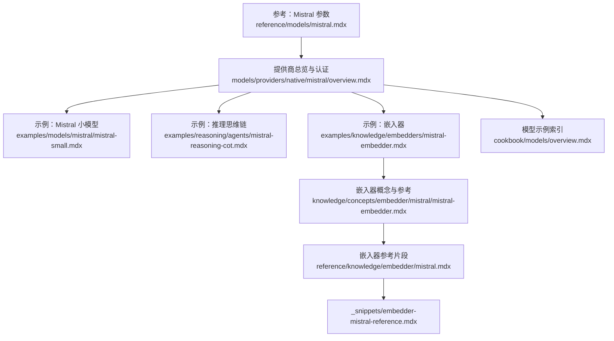
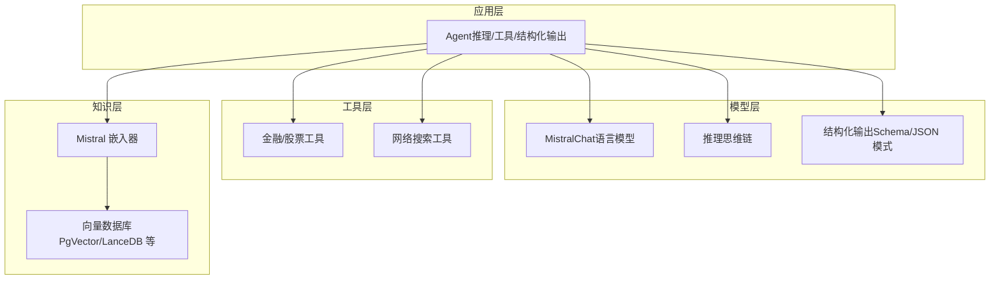
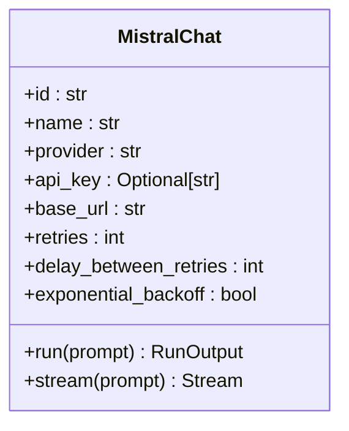
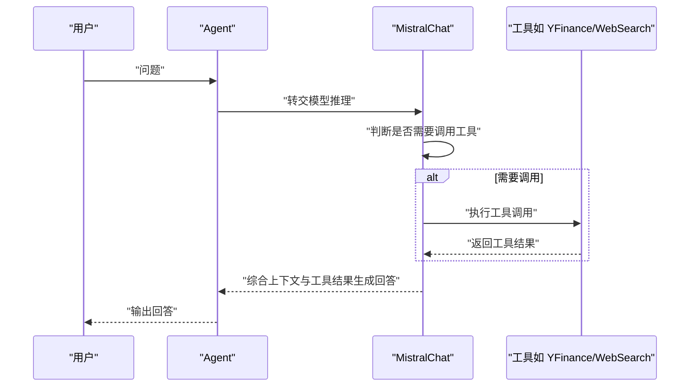
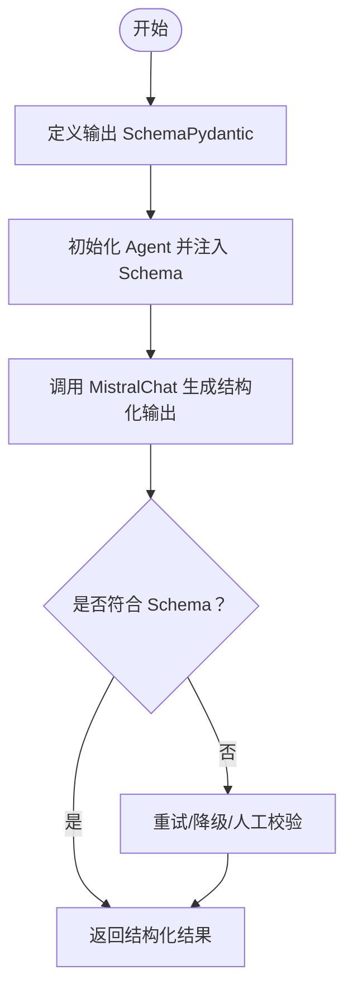
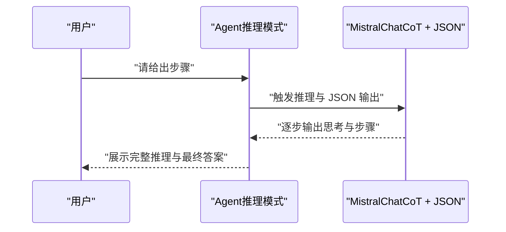
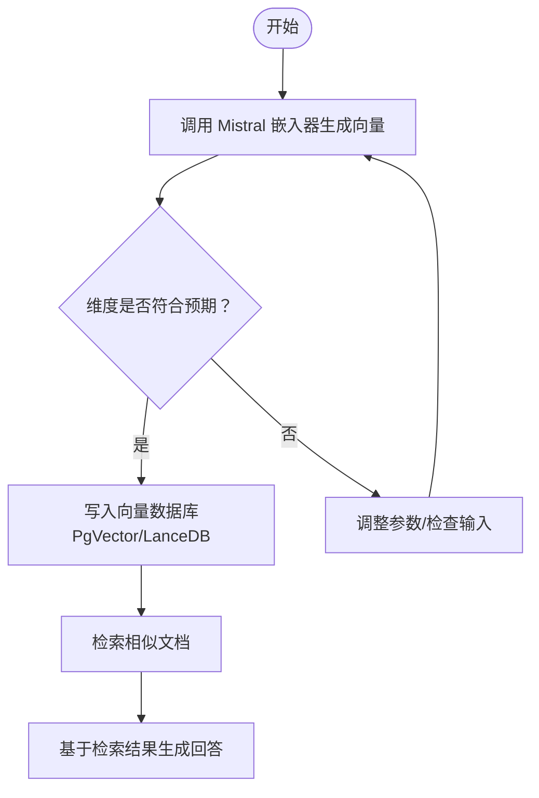
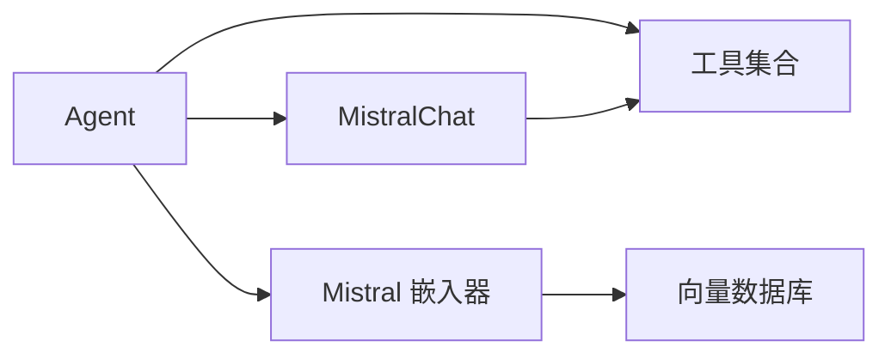

# Mistral 提供商

<cite>
**本文引用的文件**
- [mistral.mdx](file://reference/models/mistral.mdx)
- [mistral-embedder.mdx](file://knowledge/concepts/embedder/mistral/mistral-embedder.mdx)
- [mistral.mdx（提供商总览）](file://models/providers/native/mistral/overview.mdx)
- [mistral 小模型示例.mdx](file://examples/models/mistral/mistral-small.mdx)
- [Mistral 推理思维链示例.mdx](file://examples/reasoning/agents/mistral-reasoning-cot.mdx)
- [Mistral 嵌入器示例.mdx](file://examples/knowledge/embedders/mistral-embedder.mdx)
- [Mistral 嵌入器参考.mdx](file://reference/knowledge/embedder/mistral.mdx)
- [_snippets/embedder-mistral-reference.mdx](file://_snippets/embedder-mistral-reference.mdx)
- [模型总览（示例索引）.mdx](file://cookbook/models/overview.mdx)
</cite>

## 目录
1. [简介](#简介)
2. [项目结构](#项目结构)
3. [核心组件](#核心组件)
4. [架构概览](#架构概览)
5. [详细组件分析](#详细组件分析)
6. [依赖关系分析](#依赖关系分析)
7. [性能考虑](#性能考虑)
8. [故障排查指南](#故障排查指南)
9. [结论](#结论)
10. [附录](#附录)

## 简介
本文件面向 Mistral 模型提供商在 Agno 生态中的集成与使用，覆盖 Mistral 系列模型（如 mistral-large、mistral-medium、mistral-small、codestral、open-mistral-nemo、pixtral 等）的接入方式、工具调用、结构化输出、推理能力、客户端配置、API 密钥设置与参数优化，并提供可直接定位到仓库示例的路径指引。同时给出与其他开源模型提供商的对比要点，帮助快速选型与落地。

## 项目结构
围绕 Mistral 的文档与示例主要分布在以下位置：
- 参考与参数：reference/models/mistral.mdx
- 提供商总览与认证：models/providers/native/mistral/overview.mdx
- 示例：examples/models/mistral、examples/reasoning/agents、examples/knowledge/embedders
- 嵌入器概念与参考：knowledge/concepts/embedder/mistral/mistral-embedder.mdx、reference/knowledge/embedder/mistral.mdx、_snippets/embedder-mistral-reference.mdx
- 模型示例索引：cookbook/models/overview.mdx

**图表来源**
- [mistral.mdx:1-21](file://reference/models/mistral.mdx#L1-L21)
- [mistral.mdx（提供商总览）:1-77](file://models/providers/native/mistral/overview.mdx#L1-L77)
- [mistral 小模型示例.mdx:1-43](file://examples/models/mistral/mistral-small.mdx#L1-L43)
- [Mistral 推理思维链示例.mdx:1-49](file://examples/reasoning/agents/mistral-reasoning-cot.mdx#L1-L49)
- [Mistral 嵌入器示例.mdx:1-73](file://examples/knowledge/embedders/mistral-embedder.mdx#L1-L73)
- [mistral-embedder.mdx:1-82](file://knowledge/concepts/embedder/mistral/mistral-embedder.mdx#L1-L82)
- [Mistral 嵌入器参考.mdx:1-7](file://reference/knowledge/embedder/mistral.mdx#L1-L7)
- [_snippets/embedder-mistral-reference.mdx:1-13](file://_snippets/embedder-mistral-reference.mdx#L1-L13)
- [模型总览（示例索引）.mdx:1-107](file://cookbook/models/overview.mdx#L1-L107)

**章节来源**
- [mistral.mdx:1-21](file://reference/models/mistral.mdx#L1-L21)
- [mistral.mdx（提供商总览）:1-77](file://models/providers/native/mistral/overview.mdx#L1-L77)
- [模型总览（示例索引）.mdx:1-107](file://cookbook/models/overview.mdx#L1-L107)

## 核心组件
- MistralChat 模型适配器：用于在 Agno Agent 中以统一接口调用 Mistral 语言模型，支持工具调用、流式输出、结构化输出等特性。
- Mistral 嵌入器：用于生成文本向量表示，配合向量数据库实现 RAG、检索增强与知识插入。
- 认证与基础配置：通过环境变量 MISTRAL_API_KEY 进行鉴权，默认基础地址为 Mistral 官方 API v1。

关键参数与行为要点（来自参考与示例）：
- 模型选择：可通过 id 指定具体模型（如 mistral-large-latest、mistral-small-latest、codestral、open-mistral-nemo、pixtral-12b-2409 等），并遵循提供商推荐的用途分层。
- 工具调用：MistralChat 支持工具注入与调用，示例中包含金融查询工具与网络搜索工具。
- 结构化输出：支持通过输出模式（如 JSON 模式或原生结构化输出）约束模型输出格式；注意 JSON 模式不保证严格 Schema 合规，优先使用具备原生结构化输出能力的模型。
- 推理能力：内置思维链（CoT）推理示例，结合 JSON 模式提升步骤输出的稳定性。
- 嵌入器：支持标准与批量两种模式，输出维度默认 1024，可按需调整。

**章节来源**
- [mistral.mdx:8-21](file://reference/models/mistral.mdx#L8-L21)
- [mistral.mdx（提供商总览）:10-17](file://models/providers/native/mistral/overview.mdx#L10-L17)
- [mistral 小模型示例.mdx:16-21](file://examples/models/mistral/mistral-small.mdx#L16-L21)
- [Mistral 推理思维链示例.mdx:19-24](file://examples/reasoning/agents/mistral-reasoning-cot.mdx#L19-L24)
- [Mistral 嵌入器示例.mdx:23-37](file://examples/knowledge/embedders/mistral-embedder.mdx#L23-L37)
- [_snippets/embedder-mistral-reference.mdx:1-13](file://_snippets/embedder-mistral-reference.mdx#L1-L13)

## 架构概览
下图展示了从 Agent 到 Mistral 模型与嵌入器的整体调用路径，以及与外部工具的协作关系。

**图表来源**
- [mistral.mdx（提供商总览）:10-17](file://models/providers/native/mistral/overview.mdx#L10-L17)
- [mistral 小模型示例.mdx:16-21](file://examples/models/mistral/mistral-small.mdx#L16-L21)
- [Mistral 推理思维链示例.mdx:19-24](file://examples/reasoning/agents/mistral-reasoning-cot.mdx#L19-L24)
- [Mistral 嵌入器示例.mdx:23-37](file://examples/knowledge/embedders/mistral-embedder.mdx#L23-L37)

## 详细组件分析

### 组件一：MistralChat（语言模型）
- 职责：封装 Mistral API 调用，提供统一的聊天接口，支持流式输出、工具调用、结构化输出。
- 关键点：
  - 认证：通过环境变量 MISTRAL_API_KEY 或显式传入 api_key。
  - 模型选择：通过 id 指定具体模型，如 mistral-large-latest、mistral-small-latest、codestral、open-mistral-nemo、pixtral-12b-2409。
  - 参数扩展：支持重试次数、重试间隔、指数退避等错误处理参数。
- 使用场景：通用对话、复杂推理、工具编排、结构化结果抽取。

**图表来源**
- [mistral.mdx:10-20](file://reference/models/mistral.mdx#L10-L20)
- [mistral.mdx（提供商总览）:66-76](file://models/providers/native/mistral/overview.mdx#L66-L76)

**章节来源**
- [mistral.mdx:1-21](file://reference/models/mistral.mdx#L1-L21)
- [mistral.mdx（提供商总览）:19-33](file://models/providers/native/mistral/overview.mdx#L19-L33)
- [mistral 小模型示例.mdx:16-21](file://examples/models/mistral/mistral-small.mdx#L16-L21)

### 组件二：工具调用流程（Agent → MistralChat → 工具）
- 流程说明：Agent 注入工具列表后，MistralChat 在对话中根据上下文决定是否调用工具；工具执行完成后将结果回传给模型，由模型生成最终回答。
- 典型工具：金融查询、网络搜索等。

**图表来源**
- [mistral 小模型示例.mdx:16-21](file://examples/models/mistral/mistral-small.mdx#L16-L21)

**章节来源**
- [mistral 小模型示例.mdx:1-43](file://examples/models/mistral/mistral-small.mdx#L1-L43)

### 组件三：结构化输出（Schema/JSON 模式）
- 方案一：原生结构化输出（推荐）。通过定义 Pydantic 模型作为输出 Schema，Agent 将其传递给 MistralChat，模型据此生成符合 Schema 的结构化结果。
- 方案二：JSON 模式。指示模型以 JSON 形式输出，但不保证严格合规，建议优先使用具备原生结构化输出能力的模型。
- 注意事项：参考片段提示 JSON 模式不具备强约束力，应结合模型能力与业务校验共同使用。

**图表来源**
- [mistral.mdx（提供商总览）:66-76](file://models/providers/native/mistral/overview.mdx#L66-L76)
- [_snippets/embedder-mistral-reference.mdx:1-13](file://_snippets/embedder-mistral-reference.mdx#L1-L13)

**章节来源**
- [Mistral 推理思维链示例.mdx:19-24](file://examples/reasoning/agents/mistral-reasoning-cot.mdx#L19-L24)
- [_snippets/note-json-mode-output-schema.mdx:1-3](file://_snippets/note-json-mode-output-schema.mdx#L1-L3)

### 组件四：推理（思维链 CoT）
- 通过启用推理模式与 JSON 模式，Agent 可引导 Mistral 模型逐步输出思考过程与最终答案，适合复杂问题分解与验证。
- 示例展示了如何开启推理与 JSON 模式，并打印完整推理过程。

**图表来源**
- [Mistral 推理思维链示例.mdx:19-34](file://examples/reasoning/agents/mistral-reasoning-cot.mdx#L19-L34)

**章节来源**
- [Mistral 推理思维链示例.mdx:1-49](file://examples/reasoning/agents/mistral-reasoning-cot.mdx#L1-L49)

### 组件五：嵌入器与向量检索（知识库）
- 嵌入器：使用 Mistral 嵌入模型生成文本向量，支持标准与批量模式，输出维度默认 1024。
- 知识库：将嵌入后的文档写入向量数据库（如 PgVector、LanceDB），实现检索增强与 RAG。
- 示例：演示了嵌入生成、维度检查、知识插入与异步插入流程。

**图表来源**
- [Mistral 嵌入器示例.mdx:43-55](file://examples/knowledge/embedders/mistral-embedder.mdx#L43-L55)
- [mistral-embedder.mdx:23-36](file://knowledge/concepts/embedder/mistral/mistral-embedder.mdx#L23-L36)

**章节来源**
- [Mistral 嵌入器示例.mdx:1-73](file://examples/knowledge/embedders/mistral-embedder.mdx#L1-L73)
- [mistral-embedder.mdx:1-82](file://knowledge/concepts/embedder/mistral/mistral-embedder.mdx#L1-L82)
- [Mistral 嵌入器参考.mdx:1-7](file://reference/knowledge/embedder/mistral.mdx#L1-L7)
- [_snippets/embedder-mistral-reference.mdx:1-13](file://_snippets/embedder-mistral-reference.mdx#L1-L13)

## 依赖关系分析
- 模型抽象：MistralChat 作为模型适配器，继承自统一的 Model 抽象，确保与 Agent 的一致交互。
- 工具生态：Agent 可注入任意工具，MistralChat 负责在推理过程中协调工具调用。
- 知识体系：嵌入器与向量数据库解耦，便于替换与扩展。

**图表来源**
- [mistral.mdx（提供商总览）:66-76](file://models/providers/native/mistral/overview.mdx#L66-L76)
- [Mistral 嵌入器示例.mdx:23-37](file://examples/knowledge/embedders/mistral-embedder.mdx#L23-L37)

**章节来源**
- [mistral.mdx（提供商总览）:66-76](file://models/providers/native/mistral/overview.mdx#L66-L76)
- [Mistral 嵌入器示例.mdx:23-37](file://examples/knowledge/embedders/mistral-embedder.mdx#L23-L37)

## 性能考虑
- 模型选择：根据任务类型选择合适模型（如代码场景优先 codestral，通用场景优先 mistral-large-latest，免费场景优先 open-mistral-nemo，视觉场景优先 pixtral-12b-2409）。
- 工具调用：合理设计工具粒度与调用顺序，避免过度往返；对高频工具可引入缓存策略。
- 结构化输出：优先使用原生结构化输出能力，减少后处理成本；必要时采用 JSON 模式并配合二次校验。
- 嵌入与检索：批量嵌入可显著降低请求次数；向量维度与索引策略需结合数据规模与延迟目标权衡。
- 错误处理：合理配置重试次数与退避策略，避免瞬时抖动影响整体吞吐。

## 故障排查指南
- 认证失败：确认已正确设置 MISTRAL_API_KEY 环境变量，并确保未被遮蔽或覆盖。
- 请求超时/限流：关注提供商的分层速率限制，必要时降低并发或启用指数退避。
- 工具调用异常：检查工具权限与网络连通性；对易失败工具增加重试与熔断。
- 结构化输出不符合预期：优先切换至具备原生结构化输出能力的模型；若必须使用 JSON 模式，加强后处理与校验。
- 嵌入维度异常：核对嵌入器参数与模型默认维度，确保向量数据库表结构一致。

**章节来源**
- [mistral.mdx（提供商总览）:19-33](file://models/providers/native/mistral/overview.mdx#L19-L33)
- [mistral.mdx:17-20](file://reference/models/mistral.mdx#L17-L20)
- [_snippets/embedder-mistral-reference.mdx:5-13](file://_snippets/embedder-mistral-reference.mdx#L5-L13)

## 结论
Mistral 在 Agno 中提供了统一、可扩展的模型接入方式，覆盖多类模型与典型应用场景（工具调用、结构化输出、推理、嵌入与检索）。通过合理的模型选择、参数配置与错误处理策略，可在不同业务场景中获得稳定且高性能的体验。建议优先采用具备原生结构化输出能力的模型，并结合嵌入器与向量数据库构建稳健的知识检索体系。

## 附录
- 快速开始与示例索引：可参考模型示例索引页面，快速定位各提供商的示例入口与运行方式。
- 相关示例路径（仅列出关键文件，便于直接跳转）：
  - Mistral 小模型示例：[mistral 小模型示例.mdx:1-43](file://examples/models/mistral/mistral-small.mdx#L1-L43)
  - Mistral 推理（思维链）示例：[Mistral 推理思维链示例.mdx:1-49](file://examples/reasoning/agents/mistral-reasoning-cot.mdx#L1-L49)
  - Mistral 嵌入器示例：[Mistral 嵌入器示例.mdx:1-73](file://examples/knowledge/embedders/mistral-embedder.mdx#L1-L73)
  - 嵌入器参考片段：[_snippets/embedder-mistral-reference.mdx:1-13](file://_snippets/embedder-mistral-reference.mdx#L1-L13)
  - 模型参数参考：[mistral.mdx:1-21](file://reference/models/mistral.mdx#L1-L21)
  - 提供商总览与认证：[mistral.mdx（提供商总览）:1-77](file://models/providers/native/mistral/overview.mdx#L1-L77)
  - 模型示例索引：[模型总览（示例索引）.mdx:1-107](file://cookbook/models/overview.mdx#L1-L107)