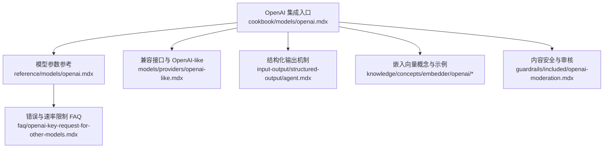
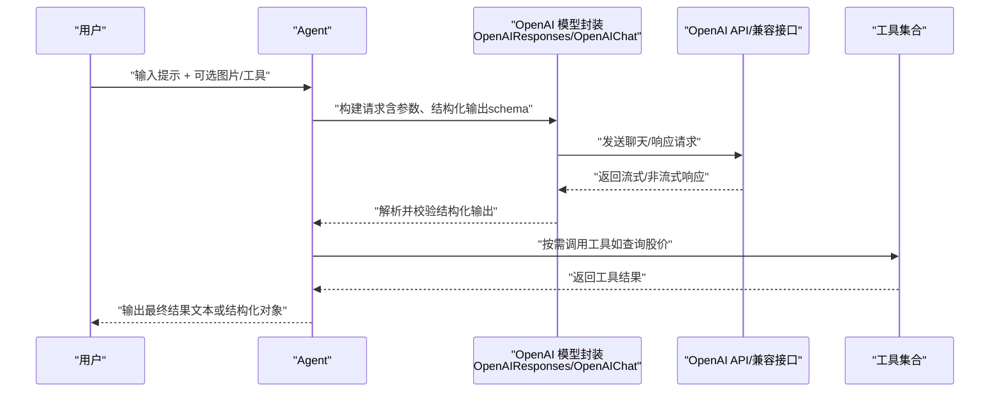
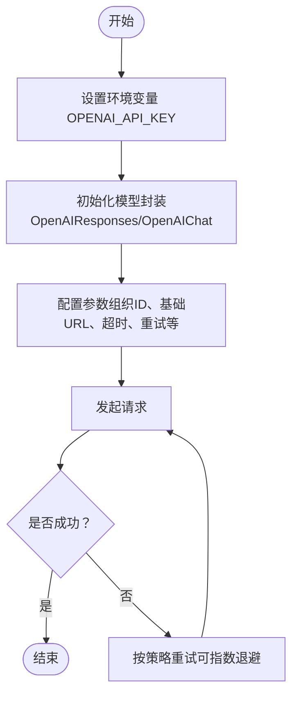
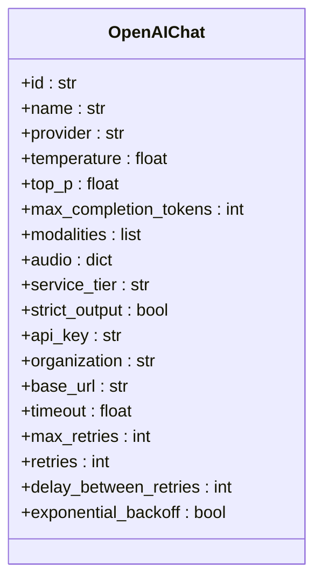
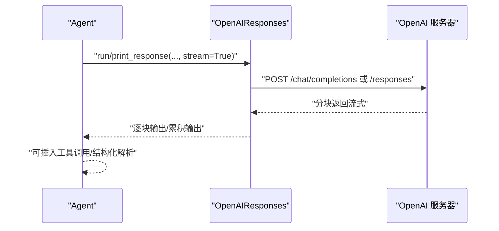
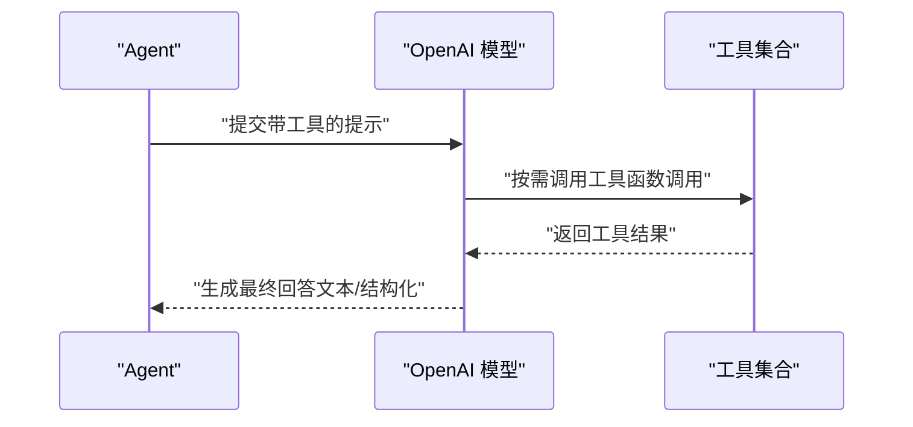
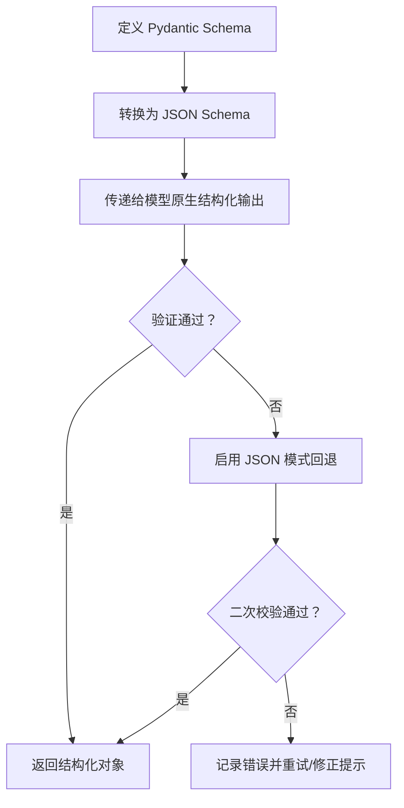
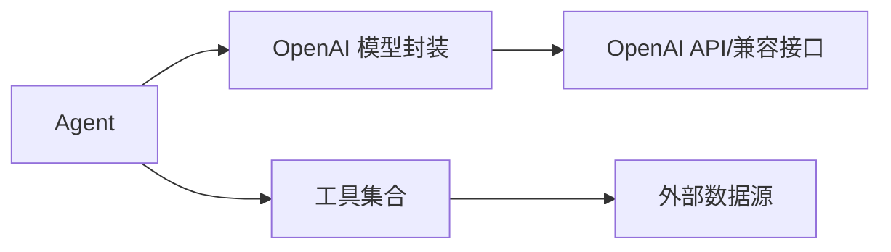

# OpenAI 提供商

<cite>
**本文引用的文件**
- [reference/models/openai.mdx](file://reference/models/openai.mdx)
- [cookbook/models/openai.mdx](file://cookbook/models/openai.mdx)
- [_snippets/set-openai-key.mdx](file://_snippets/set-openai-key.mdx)
- [models/providers/openai-like.mdx](file://models/providers/openai-like.mdx)
- [reference/models/openai-like.mdx](file://reference/models/openai-like.mdx)
- [input-output/structured-output/agent.mdx](file://input-output/structured-output/agent.mdx)
- [examples/models/openai/chat/structured-output.mdx](file://examples/models/openai/chat/structured-output.mdx)
- [faq/openai-key-request-for-other-models.mdx](file://faq/openai-key-request-for-other-models.mdx)
- [guardrails/included/openai-moderation.mdx](file://guardrails/included/openai-moderation.mdx)
- [knowledge/concepts/embedder/openai/openai-embedder.mdx](file://knowledge/concepts/embedder/openai/openai-embedder.mdx)
- [examples/knowledge/embedders/openai-embedder.mdx](file://examples/knowledge/embedders/openai-embedder.mdx)
</cite>

## 目录
1. [简介](#简介)
2. [项目结构](#项目结构)
3. [核心组件](#核心组件)
4. [架构总览](#架构总览)
5. [详细组件分析](#详细组件分析)
6. [依赖关系分析](#依赖关系分析)
7. [性能考虑](#性能考虑)
8. [故障排查指南](#故障排查指南)
9. [结论](#结论)
10. [附录](#附录)

## 简介
本文件面向在 Agno 中集成 OpenAI 模型提供商的开发者，系统性说明如何配置 API 密钥、选择模型（含 ChatGPT 系列如 gpt-4、gpt-3.5-turbo 等）、进行聊天补全、启用函数/工具调用、实现结构化输出以及处理流式响应。同时给出错误处理策略、速率限制管理与性能优化建议，并通过“章节来源”定位到仓库中的具体示例与参考文档。

## 项目结构
围绕 OpenAI 集成的关键文档与示例分布在以下位置：
- 参考：OpenAI 模型参数与能力说明
- 教程：OpenAI 使用示例（Responses/Chat API、工具、视觉、结构化输出）
- 兼容层：OpenAI 兼容接口与 OpenAI-like 模型
- 结构化输出：Agent 层面的结构化输出机制与最佳实践
- 嵌入：OpenAI Embeddings 的概念与示例
- 运维：API Key 设置、速率限制与常见问题

**图表来源**
- [cookbook/models/openai.mdx:1-107](file://cookbook/models/openai.mdx#L1-L107)
- [reference/models/openai.mdx:1-53](file://reference/models/openai.mdx#L1-L53)
- [models/providers/openai-like.mdx:1-75](file://models/providers/openai-like.mdx#L1-L75)
- [input-output/structured-output/agent.mdx:1-201](file://input-output/structured-output/agent.mdx#L1-L201)
- [faq/openai-key-request-for-other-models.mdx](file://faq/openai-key-request-for-other-models.mdx)
- [guardrails/included/openai-moderation.mdx](file://guardrails/included/openai-moderation.mdx)

**章节来源**
- [cookbook/models/openai.mdx:1-107](file://cookbook/models/openai.mdx#L1-L107)
- [reference/models/openai.mdx:1-53](file://reference/models/openai.mdx#L1-L53)
- [models/providers/openai-like.mdx:1-75](file://models/providers/openai-like.mdx#L1-L75)
- [input-output/structured-output/agent.mdx:1-201](file://input-output/structured-output/agent.mdx#L1-L201)

## 核心组件
- OpenAIChat/OpenAIResponses：面向 OpenAI 原生 Responses/Chat 接口的模型封装，支持参数化控制（温度、采样、停止序列、最大生成长度等），并可启用结构化输出与流式响应。
- OpenAI-like：用于对接任何遵循 OpenAI API 格式的第三方服务，只需替换 base_url 与 api_key 即可复用 OpenAI 参数体系。
- 结构化输出：通过 Pydantic 模型定义输出模式，由模型返回符合 schema 的对象；对不支持原生结构化输出的模型可回退至 JSON 模式。
- 工具/函数调用：结合工具集（如金融查询）在推理过程中动态调用外部能力，最终以结构化结果呈现。
- 流式响应：支持增量输出，便于实时展示与交互体验。

**章节来源**
- [reference/models/openai.mdx:8-53](file://reference/models/openai.mdx#L8-L53)
- [models/providers/openai-like.mdx:32-75](file://models/providers/openai-like.mdx#L32-L75)
- [input-output/structured-output/agent.mdx:35-44](file://input-output/structured-output/agent.mdx#L35-L44)

## 架构总览
下图展示了从 Agent 到 OpenAI 模型的调用链路，以及结构化输出与工具调用的交互：

**图表来源**
- [cookbook/models/openai.mdx:8-34](file://cookbook/models/openai.mdx#L8-L34)
- [input-output/structured-output/agent.mdx:35-44](file://input-output/structured-output/agent.mdx#L35-L44)

## 详细组件分析

### OpenAI API 配置与密钥管理
- API 密钥设置：通过环境变量 OPENAI_API_KEY 注入，适用于本地开发与生产部署。
- 组织 ID 与基础 URL：可通过模型参数指定组织 ID 与自定义 base_url，以适配企业或代理场景。
- 超时与重试：支持统一超时、最大重试次数与指数退避策略，提升稳定性。

**图表来源**
- [_snippets/set-openai-key.mdx:1-16](file://_snippets/set-openai-key.mdx#L1-L16)
- [reference/models/openai.mdx:41-53](file://reference/models/openai.mdx#L41-L53)

**章节来源**
- [_snippets/set-openai-key.mdx:1-16](file://_snippets/set-openai-key.mdx#L1-L16)
- [reference/models/openai.mdx:41-53](file://reference/models/openai.mdx#L41-L53)

### 模型选择与 ChatGPT 系列特性
- OpenAIChat/OpenAIResponses 支持多种模型 ID，包括但不限于 gpt-4o、o1 系列等。参数页列出 id、name、provider 等基础字段，以及推理效率、日志概率、音频模态、服务层级等高级参数。
- 不同模型在上下文长度、成本、速度与推理能力上存在差异，应根据任务类型（对话、推理、多模态）选择合适模型。

**图表来源**
- [reference/models/openai.mdx:10-53](file://reference/models/openai.mdx#L10-L53)

**章节来源**
- [reference/models/openai.mdx:6-18](file://reference/models/openai.mdx#L6-L18)

### 聊天补全与流式响应
- 流式输出：通过开启流式参数，模型会分块返回内容，适合实时展示与交互。
- 非流式输出：一次性返回完整结果，适用于批处理与后处理场景。
- 示例中演示了 Responses API 的基本调用、工具调用与图像理解场景。

**图表来源**
- [cookbook/models/openai.mdx:8-18](file://cookbook/models/openai.mdx#L8-L18)
- [cookbook/models/openai.mdx:20-34](file://cookbook/models/openai.mdx#L20-L34)
- [cookbook/models/openai.mdx:36-53](file://cookbook/models/openai.mdx#L36-L53)

**章节来源**
- [cookbook/models/openai.mdx:8-53](file://cookbook/models/openai.mdx#L8-L53)

### 函数调用与工具使用
- 工具注册：将工具（如 YFinanceTools）注入 Agent，使其在推理过程中按需调用。
- 调用流程：模型在推理中决定是否调用工具，工具执行后返回结果，最终由模型整合为自然语言回答或结构化输出。
- 与结构化输出协同：工具返回的数据可作为结构化输出的一部分，确保下游消费稳定可靠。

**图表来源**
- [cookbook/models/openai.mdx:20-34](file://cookbook/models/openai.mdx#L20-L34)
- [input-output/structured-output/agent.mdx:59-88](file://input-output/structured-output/agent.mdx#L59-L88)

**章节来源**
- [cookbook/models/openai.mdx:20-34](file://cookbook/models/openai.mdx#L20-L34)
- [input-output/structured-output/agent.mdx:59-88](file://input-output/structured-output/agent.mdx#L59-L88)

### 结构化输出与 JSON 模式
- 原生结构化输出：基于 Pydantic 模型生成 JSON Schema 并传递给模型，模型返回符合 schema 的对象，提高一致性与可解析性。
- 回退策略：对于不支持原生结构化输出的模型，可启用 JSON 模式，强制模型以 JSON 形式输出，再进行二次解析与校验。
- 最佳实践：为字段添加描述与约束，减少歧义；对不确定信息使用可选字段；在多任务场景中按次运行覆盖 schema。

**图表来源**
- [input-output/structured-output/agent.mdx:35-44](file://input-output/structured-output/agent.mdx#L35-L44)
- [input-output/structured-output/agent.mdx:184-195](file://input-output/structured-output/agent.mdx#L184-L195)

**章节来源**
- [input-output/structured-output/agent.mdx:1-201](file://input-output/structured-output/agent.mdx#L1-L201)
- [examples/models/openai/chat/structured-output.mdx:91-109](file://examples/models/openai/chat/structured-output.mdx#L91-L109)

### 多模态与音频能力
- 多模态输入：支持传入图片等媒体资源，结合视觉模型完成图文理解与问答。
- 音频模态：通过 audio 参数配置语音合成/转写等能力（如 voice、format 等）。
- 适用场景：客服对话、内容创作、知识检索与多媒体应用。

**章节来源**
- [reference/models/openai.mdx:26-28](file://reference/models/openai.mdx#L26-L28)
- [cookbook/models/openai.mdx:36-53](file://cookbook/models/openai.mdx#L36-L53)

### OpenAI 兼容接口与第三方集成
- OpenAI-like：通过替换 base_url 与 api_key，即可接入任意 OpenAI 兼容的服务（如 Together、Ollama、OpenRouter 等）。
- OpenResponses：针对实现 Open Responses 规范的提供商，可直接使用 OpenAI 参数体系，无需改动业务逻辑。
- 注意事项：不同服务对参数支持度不同，需按需裁剪参数并关注响应格式差异。

**章节来源**
- [models/providers/openai-like.mdx:1-75](file://models/providers/openai-like.mdx#L1-L75)
- [reference/models/openai-like.mdx:1-31](file://reference/models/openai-like.mdx#L1-L31)

## 依赖关系分析
- 组件耦合：Agent 依赖模型封装（OpenAIResponses/OpenAIChat/OpenAI-like），模型封装依赖 OpenAI API/兼容接口；工具通过 Agent 注入并在推理中被调用。
- 外部依赖：OpenAI API、第三方兼容服务、工具库（如金融数据）。
- 参数契约：所有参数均在参考页中明确定义，便于统一配置与迁移。

**图表来源**
- [cookbook/models/openai.mdx:8-34](file://cookbook/models/openai.mdx#L8-L34)
- [models/providers/openai-like.mdx:45-75](file://models/providers/openai-like.mdx#L45-L75)

**章节来源**
- [cookbook/models/openai.mdx:8-34](file://cookbook/models/openai.mdx#L8-L34)
- [models/providers/openai-like.mdx:45-75](file://models/providers/openai-like.mdx#L45-L75)

## 性能考虑
- 合理设置超时与重试：避免长时间阻塞，结合指数退避降低雪崩风险。
- 控制上下文与生成长度：通过 max_completion_tokens 与 temperature/top_p 等参数平衡质量与延迟。
- 流式输出优先：在需要实时反馈的场景启用流式，减少首字节延迟感知。
- 结构化输出缓存：对重复任务可缓存 schema 与历史提示，减少重复解析成本。
- 多模态与工具调用：尽量合并工具调用批次，减少往返次数。

[本节为通用指导，无需特定文件来源]

## 故障排查指南
- API 密钥无效或缺失：检查环境变量 OPENAI_API_KEY 是否正确设置，确认组织 ID 与 base_url。
- 速率限制与配额：参考 FAQ 文档，了解请求频率与限额问题及应对策略。
- 内容安全与审核：启用 OpenAI Moderation 进行前置过滤，避免违规内容进入系统。
- 嵌入向量异常：核对嵌入模型与输入格式，确保与 OpenAI Embeddings 规范一致。
- 结构化输出失败：优先启用 JSON 模式回退，检查 schema 设计与字段约束。

**章节来源**
- [_snippets/set-openai-key.mdx:1-16](file://_snippets/set-openai-key.mdx#L1-L16)
- [faq/openai-key-request-for-other-models.mdx](file://faq/openai-key-request-for-other-models.mdx)
- [guardrails/included/openai-moderation.mdx](file://guardrails/included/openai-moderation.mdx)
- [knowledge/concepts/embedder/openai/openai-embedder.mdx](file://knowledge/concepts/embedder/openai/openai-embedder.mdx)

## 结论
通过统一的模型封装与参数体系，Agno 能够便捷地对接 OpenAI 原生与兼容接口，覆盖聊天补全、工具调用、多模态与结构化输出等核心能力。配合流式响应与稳健的错误处理策略，可在生产环境中获得稳定且高性能的用户体验。建议在实际项目中结合任务特性选择合适的模型与参数，并持续监控与优化性能与成本。

[本节为总结性内容，无需特定文件来源]

## 附录
- 快速开始示例路径
  - [Responses 基础示例:8-18](file://cookbook/models/openai.mdx#L8-L18)
  - [工具调用示例:20-34](file://cookbook/models/openai.mdx#L20-L34)
  - [图像理解示例:36-53](file://cookbook/models/openai.mdx#L36-L53)
  - [结构化输出示例:55-76](file://cookbook/models/openai.mdx#L55-L76)
  - [推理示例:78-92](file://cookbook/models/openai.mdx#L78-L92)
- 结构化输出最佳实践
  - [Agent 层结构化输出说明:1-201](file://input-output/structured-output/agent.mdx#L1-L201)
  - [示例脚本（结构化输出）:91-109](file://examples/models/openai/chat/structured-output.mdx#L91-L109)
- 嵌入向量
  - [概念与参数](file://knowledge/concepts/embedder/openai/openai-embedder.mdx)
  - [示例脚本](file://examples/knowledge/embedders/openai-embedder.mdx)