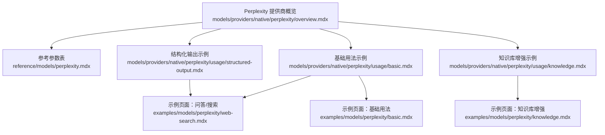
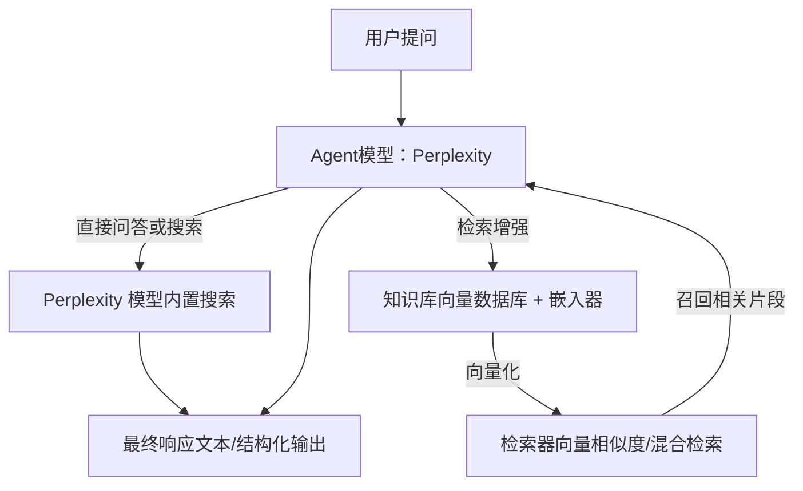
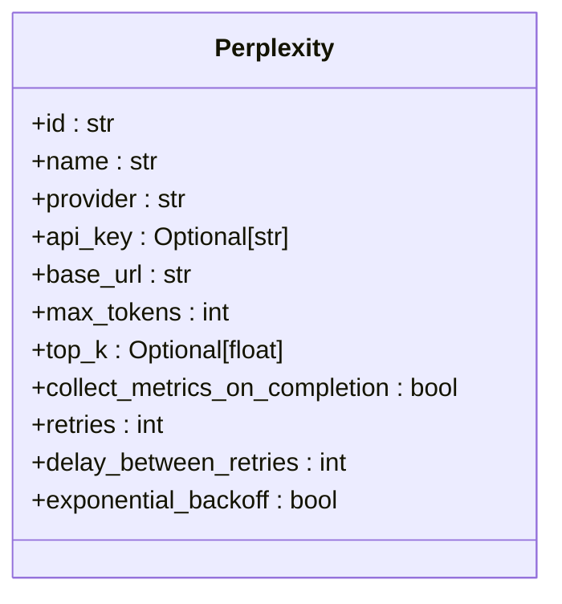
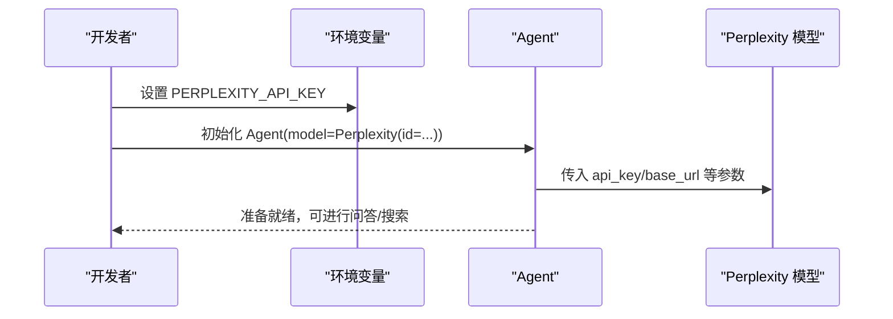
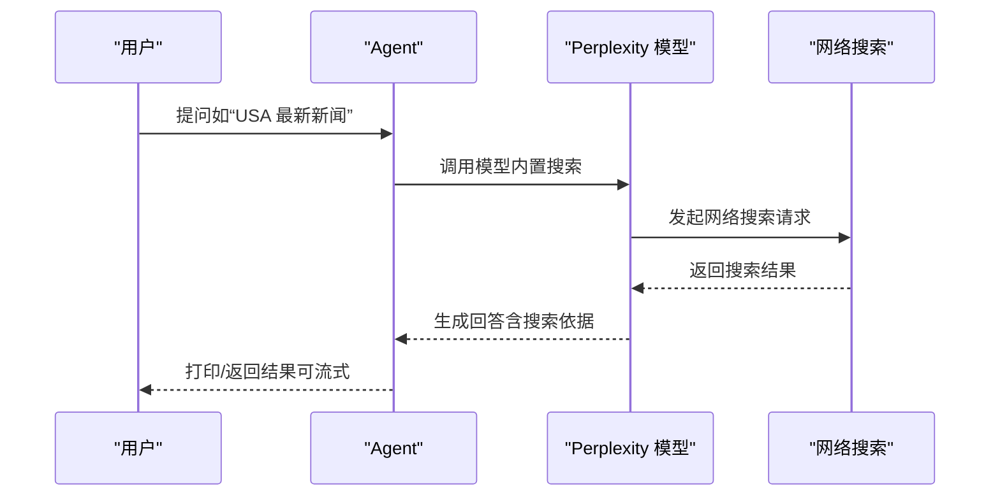
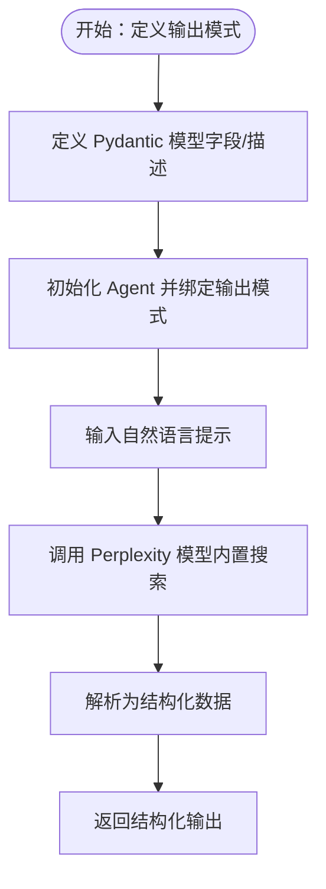
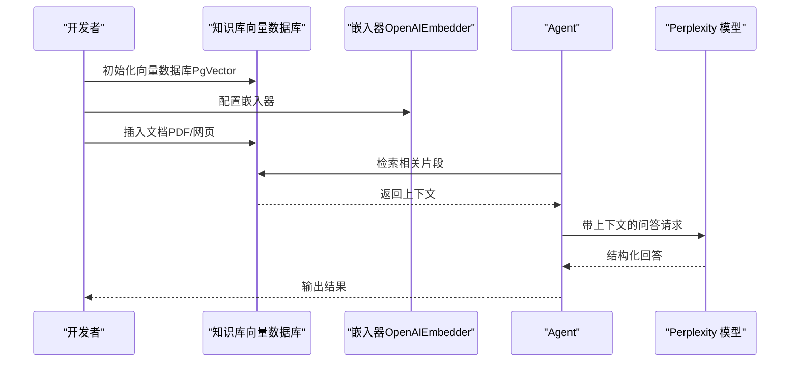
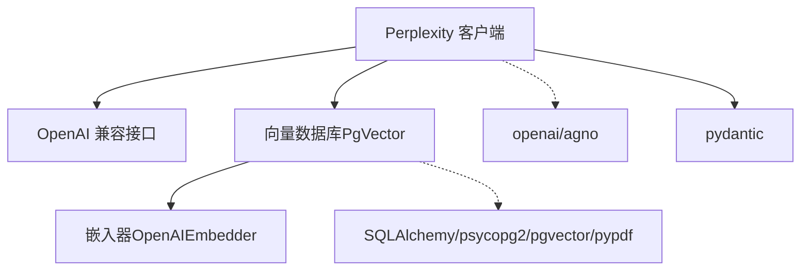

# Perplexity 提供商

<cite>
**本文引用的文件**
- [models/providers/native/perplexity/overview.mdx](file://models/providers/native/perplexity/overview.mdx)
- [reference/models/perplexity.mdx](file://reference/models/perplexity.mdx)
- [models/providers/native/perplexity/usage/basic.mdx](file://models/providers/native/perplexity/usage/basic.mdx)
- [models/providers/native/perplexity/usage/structured-output.mdx](file://models/providers/native/perplexity/usage/structured-output.mdx)
- [models/providers/native/perplexity/usage/knowledge.mdx](file://models/providers/native/perplexity/usage/knowledge.mdx)
- [examples/models/perplexity/web-search.mdx](file://examples/models/perplexity/web-search.mdx)
- [examples/models/perplexity/basic.mdx](file://examples/models/perplexity/basic.mdx)
- [examples/models/perplexity/knowledge.mdx](file://examples/models/perplexity/knowledge.mdx)
</cite>

## 目录
1. [简介](#简介)
2. [项目结构](#项目结构)
3. [核心组件](#核心组件)
4. [架构总览](#架构总览)
5. [详细组件分析](#详细组件分析)
6. [依赖关系分析](#依赖关系分析)
7. [性能考虑](#性能考虑)
8. [故障排查指南](#故障排查指南)
9. [结论](#结论)
10. [附录](#附录)

## 简介
本文件面向在 Agno 生态中集成 Perplexity 模型提供商的开发者与使用者，系统性说明如何配置与使用 Perplexity 的语言模型（含 Sonar 系列等），以及其内置的网络搜索能力。文档覆盖以下关键主题：
- 支持的模型系列与版本：重点说明 Sonar 系列模型的可用性与参数差异
- 客户端配置与认证：API 密钥设置、基础 URL、重试策略等
- 搜索增强功能：如何通过内置网络搜索与知识库检索实现“问答+搜索”
- 实战示例：问答、搜索、结构化输出、与知识库结合
- 搜索优化建议与信息准确性验证方法

## 项目结构
围绕 Perplexity 的文档与示例主要分布在如下位置：
- 提供商概览与参数说明：models/providers/native/perplexity/overview.mdx
- 参考参数表：reference/models/perplexity.mdx
- 基础用法示例：models/providers/native/perplexity/usage/basic.mdx
- 结构化输出示例：models/providers/native/perplexity/usage/structured-output.mdx
- 知识库增强示例：models/providers/native/perplexity/usage/knowledge.mdx
- 示例页面（问答/搜索）：examples/models/perplexity/web-search.mdx、examples/models/perplexity/basic.mdx、examples/models/perplexity/knowledge.mdx

**图表来源**
- [models/providers/native/perplexity/overview.mdx:1-62](file://models/providers/native/perplexity/overview.mdx#L1-L62)
- [reference/models/perplexity.mdx:1-24](file://reference/models/perplexity.mdx#L1-L24)
- [models/providers/native/perplexity/usage/basic.mdx:1-45](file://models/providers/native/perplexity/usage/basic.mdx#L1-L45)
- [models/providers/native/perplexity/usage/structured-output.mdx:1-71](file://models/providers/native/perplexity/usage/structured-output.mdx#L1-L71)
- [models/providers/native/perplexity/usage/knowledge.mdx:1-56](file://models/providers/native/perplexity/usage/knowledge.mdx#L1-L56)
- [examples/models/perplexity/web-search.mdx:1-49](file://examples/models/perplexity/web-search.mdx#L1-L49)
- [examples/models/perplexity/basic.mdx:1-58](file://examples/models/perplexity/basic.mdx#L1-L58)
- [examples/models/perplexity/knowledge.mdx:1-56](file://examples/models/perplexity/knowledge.mdx#L1-L56)

**章节来源**
- [models/providers/native/perplexity/overview.mdx:1-62](file://models/providers/native/perplexity/overview.mdx#L1-L62)
- [reference/models/perplexity.mdx:1-24](file://reference/models/perplexity.mdx#L1-L24)

## 核心组件
- Perplexity 模型客户端
  - 支持通过 id 指定具体模型（如 sonar-pro 等）
  - 默认提供 OpenAI 兼容接口，支持常见参数（如 max_tokens、top_k 等）
  - 认证方式：通过环境变量 PERPLEXITY_API_KEY 或显式传入 api_key
  - 基础 URL 默认为 https://api.perplexity.ai/
  - 支持重试策略（retries、delay_between_retries、exponential_backoff）

- 内置网络搜索能力
  - Perplexity 模型自带网络搜索，可直接用于“问答+搜索”场景
  - 示例中通过 Agent.print_response 或 agent.run 获取实时搜索结果

- 结合知识库的检索增强
  - 可将外部知识源（如 PDF、网页）注入知识库，再由 Agent 在对话中检索调用
  - 示例展示了基于向量数据库（PgVector）与嵌入器（OpenAIEmbedder）的知识增强流程

**章节来源**
- [reference/models/perplexity.mdx:8-24](file://reference/models/perplexity.mdx#L8-L24)
- [models/providers/native/perplexity/overview.mdx:11-25](file://models/providers/native/perplexity/overview.mdx#L11-L25)
- [models/providers/native/perplexity/usage/knowledge.mdx:1-56](file://models/providers/native/perplexity/usage/knowledge.mdx#L1-L56)

## 架构总览
下图展示了从用户提问到返回结果的关键路径，包括内置搜索与知识库检索两种增强方式：

**图表来源**
- [models/providers/native/perplexity/usage/basic.mdx:7-20](file://models/providers/native/perplexity/usage/basic.mdx#L7-L20)
- [models/providers/native/perplexity/usage/knowledge.mdx:7-31](file://models/providers/native/perplexity/usage/knowledge.mdx#L7-L31)

## 详细组件分析

### 组件一：Perplexity 模型客户端与参数
- 关键参数
  - id：模型标识（如 sonar-pro）
  - name/provider：模型名称与提供商
  - api_key/base_url：认证与服务地址
  - max_tokens/top_k：生成长度与采样策略
  - collect_metrics_on_completion：流式统计策略
  - retries/delay/exponential_backoff：重试机制
- 参数来源与默认值均来自参考文档与提供商概览

**图表来源**
- [reference/models/perplexity.mdx:10-23](file://reference/models/perplexity.mdx#L10-L23)

**章节来源**
- [reference/models/perplexity.mdx:8-24](file://reference/models/perplexity.mdx#L8-L24)
- [models/providers/native/perplexity/overview.mdx:48-61](file://models/providers/native/perplexity/overview.mdx#L48-L61)

### 组件二：认证与客户端初始化
- 认证方式
  - 设置环境变量 PERPLEXITY_API_KEY
  - 也可在构造 Perplexity 时显式传入 api_key
- 初始化示例
  - 使用 Agent(model=Perplexity(id="sonar-pro")) 创建具备内置搜索能力的智能体

**图表来源**
- [models/providers/native/perplexity/overview.mdx:11-25](file://models/providers/native/perplexity/overview.mdx#L11-L25)
- [models/providers/native/perplexity/usage/basic.mdx:27-31](file://models/providers/native/perplexity/usage/basic.mdx#L27-L31)

**章节来源**
- [models/providers/native/perplexity/overview.mdx:11-25](file://models/providers/native/perplexity/overview.mdx#L11-L25)
- [models/providers/native/perplexity/usage/basic.mdx:27-31](file://models/providers/native/perplexity/usage/basic.mdx#L27-L31)

### 组件三：内置网络搜索与问答
- 使用场景
  - 直接进行实时网络搜索问答（如新闻、时事）
  - 支持同步/异步与流式输出
- 示例要点
  - Agent.print_response(...) 触发 Perplexity 内置搜索并打印结果
  - 支持 stream=True 进行流式输出

**图表来源**
- [examples/models/perplexity/web-search.mdx:13-27](file://examples/models/perplexity/web-search.mdx#L13-L27)
- [models/providers/native/perplexity/usage/basic.mdx:7-18](file://models/providers/native/perplexity/usage/basic.mdx#L7-L18)

**章节来源**
- [examples/models/perplexity/web-search.mdx:1-49](file://examples/models/perplexity/web-search.mdx#L1-L49)
- [models/providers/native/perplexity/usage/basic.mdx:1-45](file://models/providers/native/perplexity/usage/basic.mdx#L1-L45)

### 组件四：结构化输出（JSON/模式约束）
- 场景
  - 将模型输出约束为特定结构（如电影脚本字段）
- 实现要点
  - 定义 Pydantic 模型作为输出模式
  - 通过 Agent(output_schema=...) 指定结构化输出
  - 示例中使用 Perplexity(id="sonar-pro") 并开启 markdown

**图表来源**
- [models/providers/native/perplexity/usage/structured-output.mdx:7-44](file://models/providers/native/perplexity/usage/structured-output.mdx#L7-L44)

**章节来源**
- [models/providers/native/perplexity/usage/structured-output.mdx:1-71](file://models/providers/native/perplexity/usage/structured-output.mdx#L1-L71)

### 组件五：知识库检索增强（RAG）
- 场景
  - 将外部文档（PDF/网页）注入知识库，使 Agent 在回答时检索调用
- 实现要点
  - 使用 Knowledge(vector_db=...) 构建向量数据库
  - 通过 OpenAIEmbedder 生成向量
  - 使用 PgVector 存储与检索
  - Agent(knowledge=...) 启用检索增强问答

**图表来源**
- [models/providers/native/perplexity/usage/knowledge.mdx:7-31](file://models/providers/native/perplexity/usage/knowledge.mdx#L7-L31)

**章节来源**
- [models/providers/native/perplexity/usage/knowledge.mdx:1-56](file://models/providers/native/perplexity/usage/knowledge.mdx#L1-L56)
- [examples/models/perplexity/knowledge.mdx:1-56](file://examples/models/perplexity/knowledge.mdx#L1-L56)

## 依赖关系分析
- 模型层
  - Perplexity 客户端依赖 OpenAI 兼容接口，参数与行为与 OpenAI 类似
- 知识库层
  - 知识库示例依赖向量数据库（PgVector）与嵌入器（OpenAIEmbedder）
  - 需要 SQLAlchemy、psycopg2/pgvector 等依赖
- 示例层
  - 基础示例依赖 openai 与 agno
  - 结构化输出示例依赖 pydantic
  - 知识库示例额外依赖 pypdf

**图表来源**
- [models/providers/native/perplexity/overview.mdx:61](file://models/providers/native/perplexity/overview.mdx#L61)
- [models/providers/native/perplexity/usage/basic.mdx:35](file://models/providers/native/perplexity/usage/basic.mdx#L35)
- [models/providers/native/perplexity/usage/structured-output.mdx:61](file://models/providers/native/perplexity/usage/structured-output.mdx#L61)
- [models/providers/native/perplexity/usage/knowledge.mdx:46](file://models/providers/native/perplexity/usage/knowledge.mdx#L46)

**章节来源**
- [models/providers/native/perplexity/overview.mdx:61](file://models/providers/native/perplexity/overview.mdx#L61)
- [models/providers/native/perplexity/usage/basic.mdx:33-36](file://models/providers/native/perplexity/usage/basic.mdx#L33-L36)
- [models/providers/native/perplexity/usage/structured-output.mdx:59-62](file://models/providers/native/perplexity/usage/structured-output.mdx#L59-L62)
- [models/providers/native/perplexity/usage/knowledge.mdx:44-47](file://models/providers/native/perplexity/usage/knowledge.mdx#L44-L47)

## 性能考虑
- 生成长度与成本
  - 通过 max_tokens 控制单次生成长度，避免过长导致成本上升
- 采样策略
  - top_k 可限制候选词范围，提升稳定性与可控性
- 流式输出
  - 在需要低延迟反馈时启用 stream，改善用户体验
- 搜索与检索
  - 对于时效性强的问题优先使用内置网络搜索；对于领域知识问题优先使用知识库检索
- 重试策略
  - 在不稳定网络环境下合理设置 retries 与指数退避，平衡可靠性与延迟

## 故障排查指南
- 认证失败
  - 确认 PERPLEXITY_API_KEY 已正确设置且未过期
  - 若使用代理或企业网络，请检查 base_url 是否可达
- 无搜索结果或结果不准确
  - 调整查询语句，明确时间范围、地点、领域等上下文
  - 对于事实性问题，优先使用内置网络搜索；对于专业领域，优先使用知识库检索
- 结构化输出失败
  - 检查输出模式定义是否完整、字段描述是否清晰
  - 确保模型支持 JSON/结构化输出模式（sonar-pro 等）
- 知识库检索效果差
  - 检查嵌入器与向量数据库配置是否一致
  - 适当调整检索策略（如 top_k、相似度阈值）与分段策略

## 结论
Perplexity 在 Agno 中提供了开箱即用的“问答+搜索”能力，并可通过知识库实现更精准的检索增强。通过合理的参数配置、搜索策略与知识管理，可在多种场景下获得高质量、高时效的响应。

## 附录
- 快速上手步骤
  - 设置 PERPLEXITY_API_KEY
  - 安装依赖（openai/agno/pydantic/SQLAlchemy/pgvector/pypdf 等）
  - 选择模型（如 sonar-pro）并初始化 Agent
  - 直接进行问答、搜索或结构化输出
  - 如需知识库增强，准备向量数据库与嵌入器并注入内容