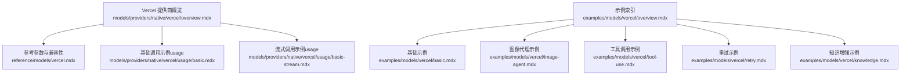
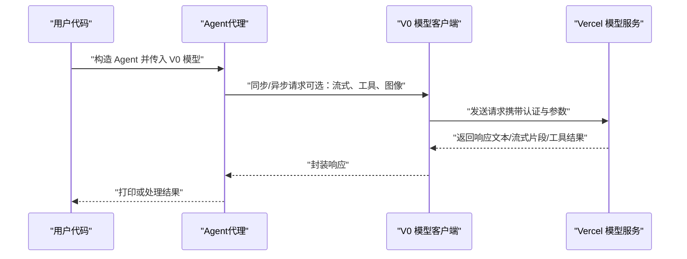
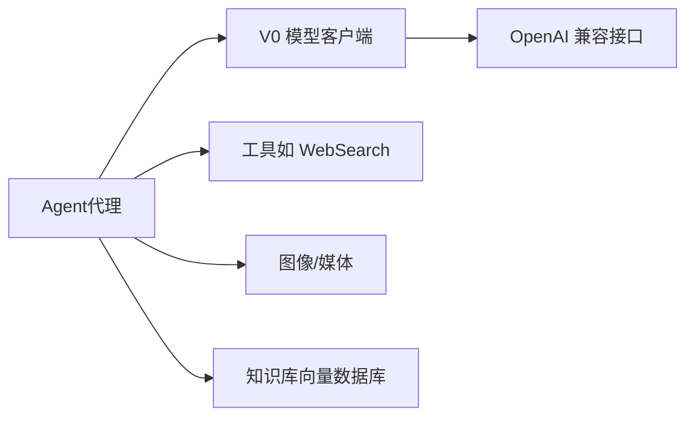

# Vercel 提供商

<cite>
**本文引用的文件**
- [models/providers/native/vercel/overview.mdx](file://models/providers/native/vercel/overview.mdx)
- [reference/models/vercel.mdx](file://reference/models/vercel.mdx)
- [examples/models/vercel/overview.mdx](file://examples/models/vercel/overview.mdx)
- [examples/models/vercel/basic.mdx](file://examples/models/vercel/basic.mdx)
- [examples/models/vercel/image-agent.mdx](file://examples/models/vercel/image-agent.mdx)
- [examples/models/vercel/tool-use.mdx](file://examples/models/vercel/tool-use.mdx)
- [examples/models/vercel/retry.mdx](file://examples/models/vercel/retry.mdx)
- [examples/models/vercel/knowledge.mdx](file://examples/models/vercel/knowledge.mdx)
- [models/providers/native/vercel/usage/basic.mdx](file://models/providers/native/vercel/usage/basic.mdx)
- [models/providers/native/vercel/usage/basic-stream.mdx](file://models/providers/native/vercel/usage/basic-stream.mdx)
</cite>

## 目录
1. [简介](#简介)
2. [项目结构](#项目结构)
3. [核心组件](#核心组件)
4. [架构总览](#架构总览)
5. [详细组件分析](#详细组件分析)
6. [依赖关系分析](#依赖关系分析)
7. [性能考量](#性能考量)
8. [故障排查指南](#故障排查指南)
9. [结论](#结论)
10. [附录](#附录)

## 简介
本文件面向希望在应用中集成 Vercel 提供商（以 Vercel v0 模型为代表）的开发者，系统性介绍其模型能力、参数配置、认证方式、客户端使用方法以及在边缘网络与实时部署场景下的优势。文档同时覆盖图像理解、工具调用、知识增强、重试策略与流式输出等关键能力，并给出可直接定位到仓库示例的路径，便于快速上手。

## 项目结构
围绕 Vercel 提供商的文档与示例主要分布在以下位置：
- 提供商概览与参数：models/providers/native/vercel/overview.mdx
- 参考参数表与兼容性说明：reference/models/vercel.mdx
- 示例索引与多类示例页面：examples/models/vercel/*
- 基础与流式调用示例：models/providers/native/vercel/usage/*

**图表来源**
- [models/providers/native/vercel/overview.mdx:1-64](file://models/providers/native/vercel/overview.mdx#L1-L64)
- [reference/models/vercel.mdx:1-22](file://reference/models/vercel.mdx#L1-L22)
- [examples/models/vercel/overview.mdx:1-13](file://examples/models/vercel/overview.mdx#L1-L13)
- [examples/models/vercel/basic.mdx:1-60](file://examples/models/vercel/basic.mdx#L1-L60)
- [examples/models/vercel/image-agent.mdx:1-58](file://examples/models/vercel/image-agent.mdx#L1-L58)
- [examples/models/vercel/tool-use.mdx:1-47](file://examples/models/vercel/tool-use.mdx#L1-L47)
- [examples/models/vercel/retry.mdx:1-50](file://examples/models/vercel/retry.mdx#L1-L50)
- [examples/models/vercel/knowledge.mdx:1-51](file://examples/models/vercel/knowledge.mdx#L1-L51)
- [models/providers/native/vercel/usage/basic.mdx:1-45](file://models/providers/native/vercel/usage/basic.mdx#L1-L45)
- [models/providers/native/vercel/usage/basic-stream.mdx:1-45](file://models/providers/native/vercel/usage/basic-stream.mdx#L1-L45)

**章节来源**
- [models/providers/native/vercel/overview.mdx:1-64](file://models/providers/native/vercel/overview.mdx#L1-L64)
- [reference/models/vercel.mdx:1-22](file://reference/models/vercel.mdx#L1-L22)
- [examples/models/vercel/overview.mdx:1-13](file://examples/models/vercel/overview.mdx#L1-L13)

## 核心组件
- V0 模型客户端
  - 支持同步与异步调用
  - 支持流式输出
  - 支持工具调用与图像输入
  - 支持重试策略（固定次数、延迟、指数退避）
- 认证与环境变量
  - 使用 V0_API_KEY 或 VERCEL_API_KEY
  - 默认基础地址分别为 v0.dev 与 vercel.com
- 兼容性
  - 扩展自 OpenAI 兼容接口，支持大多数 OpenAI 参数

**章节来源**
- [models/providers/native/vercel/overview.mdx:11-63](file://models/providers/native/vercel/overview.mdx#L11-L63)
- [reference/models/vercel.mdx:8-21](file://reference/models/vercel.mdx#L8-L21)
- [examples/models/vercel/basic.mdx:1-60](file://examples/models/vercel/basic.mdx#L1-L60)
- [examples/models/vercel/tool-use.mdx:1-47](file://examples/models/vercel/tool-use.mdx#L1-L47)
- [examples/models/vercel/image-agent.mdx:1-58](file://examples/models/vercel/image-agent.mdx#L1-L58)
- [examples/models/vercel/retry.mdx:1-50](file://examples/models/vercel/retry.mdx#L1-L50)

## 架构总览
下图展示了从客户端到 Vercel 模型服务的典型调用链路，包括同步/异步、流式与非流式、工具调用与图像输入等路径。

**图表来源**
- [examples/models/vercel/basic.mdx:13-45](file://examples/models/vercel/basic.mdx#L13-L45)
- [examples/models/vercel/tool-use.mdx:10-32](file://examples/models/vercel/tool-use.mdx#L10-L32)
- [examples/models/vercel/image-agent.mdx:13-36](file://examples/models/vercel/image-agent.mdx#L13-L36)
- [models/providers/native/vercel/usage/basic.mdx:7-21](file://models/providers/native/vercel/usage/basic.mdx#L7-L21)
- [models/providers/native/vercel/usage/basic-stream.mdx:7-21](file://models/providers/native/vercel/usage/basic-stream.mdx#L7-L21)

## 详细组件分析

### V0 模型参数与认证
- 关键参数
  - id：模型标识（如 v0-1.0-md）
  - name：模型名称（如 V0 或 VercelV0）
  - provider：提供商（Vercel）
  - api_key：API 密钥（默认从环境变量读取）
  - base_url：服务基础地址
  - retries/delay/exponential_backoff：重试策略
- 认证
  - V0_API_KEY（v0.dev）或 VERCEL_API_KEY（vercel.com）

**章节来源**
- [reference/models/vercel.mdx:8-21](file://reference/models/vercel.mdx#L8-L21)
- [models/providers/native/vercel/overview.mdx:11-25](file://models/providers/native/vercel/overview.mdx#L11-L25)

### 同步与异步调用
- 支持同步与异步两种调用方式，适用于不同运行时需求
- 异步示例可通过事件循环执行

**章节来源**
- [examples/models/vercel/basic.mdx:34-45](file://examples/models/vercel/basic.mdx#L34-L45)
- [models/providers/native/vercel/usage/basic.mdx:7-21](file://models/providers/native/vercel/usage/basic.mdx#L7-L21)

### 流式输出
- 支持流式输出，适合实时反馈与低延迟交互
- 可通过参数启用流式模式

**章节来源**
- [examples/models/vercel/basic.mdx:38-45](file://examples/models/vercel/basic.mdx#L38-L45)
- [models/providers/native/vercel/usage/basic-stream.mdx:14-21](file://models/providers/native/vercel/usage/basic-stream.mdx#L14-L21)

### 工具调用
- 可结合工具（如 WebSearchTools）实现检索增强与外部查询
- 适合构建“搜索+生成”的智能体

**章节来源**
- [examples/models/vercel/tool-use.mdx:10-32](file://examples/models/vercel/tool-use.mdx#L10-L32)

### 图像理解与多模态
- 支持图像输入，可用于图像描述、视觉问答等任务
- 示例中通过媒体对象传入图片 URL

**章节来源**
- [examples/models/vercel/image-agent.mdx:13-36](file://examples/models/vercel/image-agent.mdx#L13-L36)

### 知识增强（RAG）
- 结合向量数据库（如 PgVector）实现检索增强生成
- 示例演示了知识入库与查询流程

**章节来源**
- [examples/models/vercel/knowledge.mdx:8-26](file://examples/models/vercel/knowledge.mdx#L8-L26)

### 重试策略
- 支持固定次数重试、重试间隔与指数退避
- 示例中通过错误的模型 ID 触发重试逻辑

**章节来源**
- [examples/models/vercel/retry.mdx:16-26](file://examples/models/vercel/retry.mdx#L16-L26)

### 边缘计算与实时部署能力
- Vercel 提供边缘网络与全球分发能力，有助于降低延迟、提升可用性
- 在实时对话、流式输出与工具调用场景中尤为受益
- 配合 Vercel 平台进行部署与扩缩容，可获得更好的端到端性能

[本节为概念性说明，不直接分析具体源码文件]

## 依赖关系分析
- V0 模型客户端依赖于 OpenAI 兼容接口，参数与行为与 OpenAI 类似
- 示例中 Agent 负责编排工具、图像与知识等输入，V0 负责与服务通信
- 重试策略作为客户端级配置，贯穿所有调用路径

**图表来源**
- [examples/models/vercel/tool-use.mdx:10-22](file://examples/models/vercel/tool-use.mdx#L10-L22)
- [examples/models/vercel/image-agent.mdx:13-26](file://examples/models/vercel/image-agent.mdx#L13-L26)
- [examples/models/vercel/knowledge.mdx:8-25](file://examples/models/vercel/knowledge.mdx#L8-L25)
- [reference/models/vercel.mdx:21-21](file://reference/models/vercel.mdx#L21-L21)

**章节来源**
- [reference/models/vercel.mdx:21-21](file://reference/models/vercel.mdx#L21-L21)
- [examples/models/vercel/tool-use.mdx:10-22](file://examples/models/vercel/tool-use.mdx#L10-L22)
- [examples/models/vercel/image-agent.mdx:13-26](file://examples/models/vercel/image-agent.mdx#L13-L26)
- [examples/models/vercel/knowledge.mdx:8-25](file://examples/models/vercel/knowledge.mdx#L8-L25)

## 性能考量
- 优先使用流式输出以改善感知延迟
- 对高并发场景启用指数退避重试，避免雪崩效应
- 将工具调用与知识检索前置，减少模型重复生成开销
- 利用 Vercel 边缘网络就近路由，降低跨地域时延

[本节为通用性能建议，不直接分析具体源码文件]

## 故障排查指南
- 认证失败
  - 确认已正确设置 V0_API_KEY 或 VERCEL_API_KEY
  - 参考认证步骤与示例路径
- 请求超时或不稳定
  - 启用重试策略（retries、delay_between_retries、exponential_backoff）
  - 结合指数退避降低瞬时压力
- 响应异常或模型不可用
  - 使用错误的模型 ID 触发重试逻辑，验证重试配置是否生效

**章节来源**
- [models/providers/native/vercel/overview.mdx:11-25](file://models/providers/native/vercel/overview.mdx#L11-L25)
- [examples/models/vercel/retry.mdx:16-26](file://examples/models/vercel/retry.mdx#L16-L26)

## 结论
Vercel v0 模型通过 OpenAI 兼容接口与丰富的客户端能力，为 Web 开发与智能体应用提供了高效、可扩展的推理后端。配合流式输出、工具调用、图像理解与知识增强等特性，可在边缘网络与实时部署场景中获得更优的用户体验。建议在生产环境中结合重试策略与边缘路由，持续优化端到端性能与稳定性。

[本节为总结性内容，不直接分析具体源码文件]

## 附录
- 快速开始与示例路径
  - 基础示例：[examples/models/vercel/basic.mdx:1-60](file://examples/models/vercel/basic.mdx#L1-L60)
  - 流式示例：[models/providers/native/vercel/usage/basic-stream.mdx:1-45](file://models/providers/native/vercel/usage/basic-stream.mdx#L1-L45)
  - 工具调用示例：[examples/models/vercel/tool-use.mdx:1-47](file://examples/models/vercel/tool-use.mdx#L1-L47)
  - 图像代理示例：[examples/models/vercel/image-agent.mdx:1-58](file://examples/models/vercel/image-agent.mdx#L1-L58)
  - 知识增强示例：[examples/models/vercel/knowledge.mdx:1-51](file://examples/models/vercel/knowledge.mdx#L1-L51)
  - 重试示例：[examples/models/vercel/retry.mdx:1-50](file://examples/models/vercel/retry.mdx#L1-L50)
- 参数参考
  - [reference/models/vercel.mdx:8-21](file://reference/models/vercel.mdx#L8-L21)
- 提供商概览
  - [models/providers/native/vercel/overview.mdx:1-64](file://models/providers/native/vercel/overview.mdx#L1-L64)