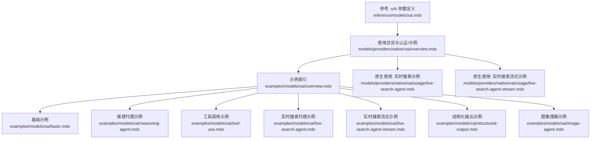
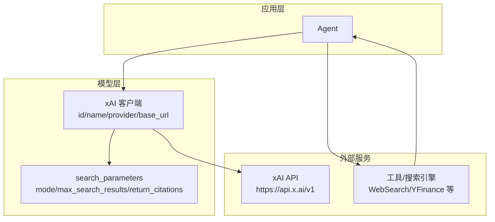
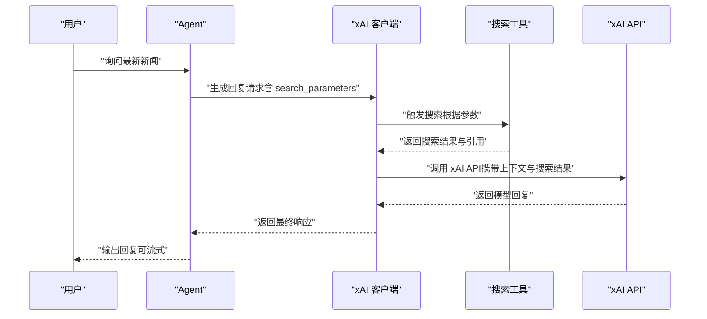
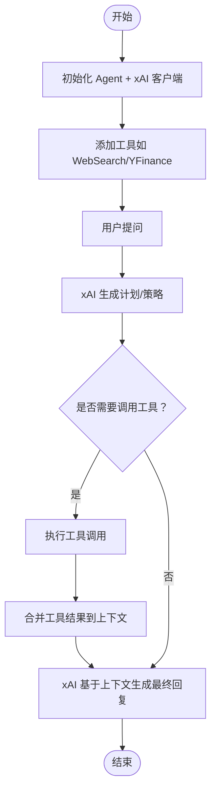
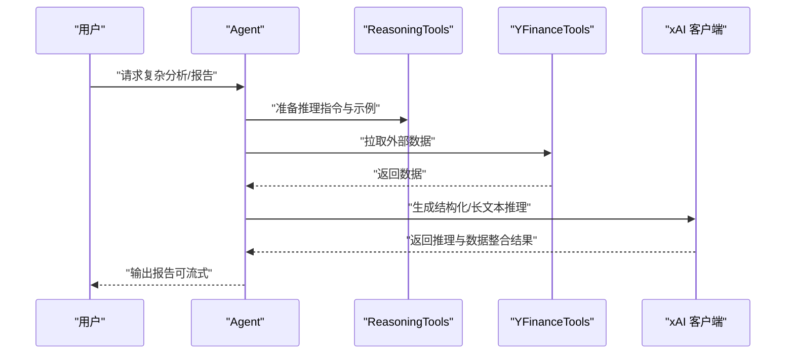
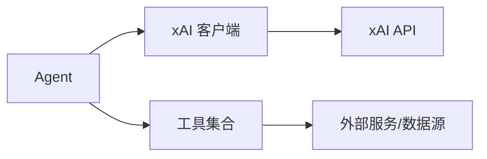

# xAI 提供商

<cite>
**本文引用的文件**
- [reference/models/xai.mdx](file://reference/models/xai.mdx)
- [models/providers/native/xai/overview.mdx](file://models/providers/native/xai/overview.mdx)
- [examples/models/xai/overview.mdx](file://examples/models/xai/overview.mdx)
- [examples/models/xai/basic.mdx](file://examples/models/xai/basic.mdx)
- [examples/models/xai/reasoning-agent.mdx](file://examples/models/xai/reasoning-agent.mdx)
- [examples/models/xai/tool-use.mdx](file://examples/models/xai/tool-use.mdx)
- [examples/models/xai/live-search-agent.mdx](file://examples/models/xai/live-search-agent.mdx)
- [examples/models/xai/live-search-agent-stream.mdx](file://examples/models/xai/live-search-agent-stream.mdx)
- [examples/models/xai/structured-output.mdx](file://examples/models/xai/structured-output.mdx)
- [examples/models/xai/image-agent.mdx](file://examples/models/xai/image-agent.mdx)
- [models/providers/native/xai/usage/live-search-agent.mdx](file://models/providers/native/xai/usage/live-search-agent.mdx)
- [models/providers/native/xai/usage/live-search-agent-stream.mdx](file://models/providers/native/xai/usage/live-search-agent-stream.mdx)
</cite>

## 目录
1. [简介](#简介)
2. [项目结构](#项目结构)
3. [核心组件](#核心组件)
4. [架构总览](#架构总览)
5. [详细组件分析](#详细组件分析)
6. [依赖关系分析](#依赖关系分析)
7. [性能考虑](#性能考虑)
8. [故障排查指南](#故障排查指南)
9. [结论](#结论)
10. [附录](#附录)

## 简介
本文件面向在 Agno 生态中集成 xAI Grok 模型提供商的开发者与架构师，系统性说明如何配置与使用 xAI 客户端、设置 API 密钥、启用实时搜索与工具调用，并针对复杂推理、结构化输出与多模态场景给出实践路径与优化建议。文档同时覆盖 Grok 系列模型（如 grok-2、grok-3、grok-3-beta、grok-3-mini-beta、grok-2-vision-latest、grok-2-latest 等）在不同场景下的选型与参数要点。

## 项目结构
围绕 xAI 集成的相关内容主要分布在以下位置：
- 参考与参数定义：reference/models/xai.mdx
- 使用总览与认证、示例与参数说明：models/providers/native/xai/overview.mdx
- 示例索引与具体示例：examples/models/xai/*
- 原生使用示例（含实时搜索流式与非流式）：models/providers/native/xai/usage/*

图表来源
- [reference/models/xai.mdx:1-22](file://reference/models/xai.mdx#L1-L22)
- [models/providers/native/xai/overview.mdx:1-89](file://models/providers/native/xai/overview.mdx#L1-L89)
- [examples/models/xai/overview.mdx:1-19](file://examples/models/xai/overview.mdx#L1-L19)
- [examples/models/xai/basic.mdx:1-58](file://examples/models/xai/basic.mdx#L1-L58)
- [examples/models/xai/reasoning-agent.mdx:1-60](file://examples/models/xai/reasoning-agent.mdx#L1-L60)
- [examples/models/xai/tool-use.mdx:1-50](file://examples/models/xai/tool-use.mdx#L1-L50)
- [examples/models/xai/live-search-agent.mdx:1-53](file://examples/models/xai/live-search-agent.mdx#L1-L53)
- [examples/models/xai/live-search-agent-stream.mdx:1-54](file://examples/models/xai/live-search-agent-stream.mdx#L1-L54)
- [examples/models/xai/structured-output.mdx:1-78](file://examples/models/xai/structured-output.mdx#L1-L78)
- [examples/models/xai/image-agent.mdx:1-58](file://examples/models/xai/image-agent.mdx#L1-L58)
- [models/providers/native/xai/usage/live-search-agent.mdx:1-48](file://models/providers/native/xai/usage/live-search-agent.mdx#L1-L48)
- [models/providers/native/xai/usage/live-search-agent-stream.mdx:1-50](file://models/providers/native/xai/usage/live-search-agent-stream.mdx#L1-L50)

章节来源
- [reference/models/xai.mdx:1-22](file://reference/models/xai.mdx#L1-L22)
- [models/providers/native/xai/overview.mdx:1-89](file://models/providers/native/xai/overview.mdx#L1-L89)
- [examples/models/xai/overview.mdx:1-19](file://examples/models/xai/overview.mdx#L1-L19)

## 核心组件
- xAI 模型客户端
  - 支持通过 id 指定具体 Grok 模型（如 grok-2、grok-3、grok-3-beta、grok-3-mini-beta、grok-2-vision-latest、grok-2-latest 等）
  - 默认 provider 与 name 均为 xAI，base_url 默认为 https://api.x.ai/v1
  - 支持 OpenAI 兼容参数（如温度、最大令牌数等），并扩展重试机制相关参数
- 认证与密钥
  - 通过环境变量 XAI_API_KEY 进行认证；可在本地开发环境中按平台导出
- 实时搜索能力
  - 通过 search_parameters 控制模式、最大搜索结果数与是否返回引用
- 工具与多模态
  - 可结合 WebSearchTools、YFinanceTools 等工具实现检索增强与金融分析
  - 支持图像输入（如 grok-2-vision-latest）以进行视觉理解与新闻关联

章节来源
- [reference/models/xai.mdx:8-21](file://reference/models/xai.mdx#L8-L21)
- [models/providers/native/xai/overview.mdx:12-26](file://models/providers/native/xai/overview.mdx#L12-L26)
- [models/providers/native/xai/overview.mdx:49-74](file://models/providers/native/xai/overview.mdx#L49-L74)

## 架构总览
下图展示了从 Agent 到 xAI 模型的调用链路，以及可选的工具与实时搜索扩展点：

图表来源
- [models/providers/native/xai/overview.mdx:30-47](file://models/providers/native/xai/overview.mdx#L30-L47)
- [models/providers/native/xai/overview.mdx:59-72](file://models/providers/native/xai/overview.mdx#L59-L72)
- [reference/models/xai.mdx:10-16](file://reference/models/xai.mdx#L10-L16)

## 详细组件分析

### 组件一：xAI 客户端与参数
- 关键参数
  - id：指定 Grok 模型版本（如 grok-2、grok-3、grok-3-beta、grok-3-mini-beta、grok-2-vision-latest、grok-2-latest 等）
  - name/provider：统一为 xAI
  - base_url：默认 https://api.x.ai/v1
  - api_key：默认从环境变量 XAI_API_KEY 读取
  - search_parameters：实时搜索相关参数（模式、最大结果数、是否返回引用）
  - 重试参数：retries、delay_between_retries、exponential_backoff
- 设计要点
  - 作为 OpenAI 兼容接口的扩展，复用通用参数体系，降低迁移成本
  - 通过 search_parameters 将实时搜索能力无缝接入对话流程

章节来源
- [reference/models/xai.mdx:8-21](file://reference/models/xai.mdx#L8-L21)
- [models/providers/native/xai/overview.mdx:78-88](file://models/providers/native/xai/overview.mdx#L78-L88)

### 组件二：认证与密钥管理
- 在本地开发环境中设置 XAI_API_KEY
- 推荐在 CI/CD 或生产环境使用安全的密钥管理方案（如托管密钥服务或环境变量注入）

章节来源
- [models/providers/native/xai/overview.mdx:12-26](file://models/providers/native/xai/overview.mdx#L12-L26)

### 组件三：实时搜索能力
- 启用方式
  - 在 Agent 初始化时传入 search_parameters，控制搜索行为
- 典型参数
  - mode：开启/关闭搜索
  - max_search_results：限制返回结果数量
  - return_citations：是否返回引用来源
- 流式与非流式两种调用方式均有示例

图表来源
- [models/providers/native/xai/usage/live-search-agent.mdx:7-24](file://models/providers/native/xai/usage/live-search-agent.mdx#L7-L24)
- [models/providers/native/xai/usage/live-search-agent-stream.mdx:7-24](file://models/providers/native/xai/usage/live-search-agent-stream.mdx#L7-L24)
- [examples/models/xai/live-search-agent.mdx:13-31](file://examples/models/xai/live-search-agent.mdx#L13-L31)
- [examples/models/xai/live-search-agent-stream.mdx:13-33](file://examples/models/xai/live-search-agent-stream.mdx#L13-L33)

章节来源
- [models/providers/native/xai/overview.mdx:49-74](file://models/providers/native/xai/overview.mdx#L49-L74)
- [models/providers/native/xai/usage/live-search-agent.mdx:1-48](file://models/providers/native/xai/usage/live-search-agent.mdx#L1-L48)
- [models/providers/native/xai/usage/live-search-agent-stream.mdx:1-50](file://models/providers/native/xai/usage/live-search-agent-stream.mdx#L1-L50)
- [examples/models/xai/live-search-agent.mdx:1-53](file://examples/models/xai/live-search-agent.mdx#L1-L53)
- [examples/models/xai/live-search-agent-stream.mdx:1-54](file://examples/models/xai/live-search-agent-stream.mdx#L1-L54)

### 组件四：工具调用与检索增强
- 场景示例
  - Web 搜索代理：结合 WebSearchTools 实现网络检索增强
  - 金融分析代理：结合 YFinanceTools 获取实时财务数据
- 能力体现
  - 将外部工具与 Grok 模型结合，提升回答的时效性与准确性

图表来源
- [examples/models/xai/tool-use.mdx:13-36](file://examples/models/xai/tool-use.mdx#L13-L36)
- [examples/models/xai/finance-agent.mdx:36-74](file://examples/models/xai/finance-agent.mdx#L36-L74)

章节来源
- [examples/models/xai/tool-use.mdx:1-50](file://examples/models/xai/tool-use.mdx#L1-L50)
- [examples/models/xai/finance-agent.mdx:1-149](file://examples/models/xai/finance-agent.mdx#L1-L149)

### 组件五：复杂推理与结构化输出
- 复杂推理
  - 结合 ReasoningTools 与 YFinanceTools，构建具备推理与数据分析能力的代理
  - 支持流式输出与“显示完整推理过程”的调试选项
- 结构化输出
  - 通过 output_schema 定义 Pydantic 模型，约束模型输出格式，便于下游处理

图表来源
- [examples/models/xai/reasoning-agent.mdx:22-38](file://examples/models/xai/reasoning-agent.mdx#L22-L38)
- [examples/models/xai/structured-output.mdx:46-56](file://examples/models/xai/structured-output.mdx#L46-L56)

章节来源
- [examples/models/xai/reasoning-agent.mdx:1-60](file://examples/models/xai/reasoning-agent.mdx#L1-L60)
- [examples/models/xai/structured-output.mdx:1-78](file://examples/models/xai/structured-output.mdx#L1-L78)

### 组件六：多模态与图像理解
- 场景示例
  - 图像理解代理：结合 grok-2-vision-latest，对图片进行描述并关联最新新闻
- 能力体现
  - 将视觉输入与文本理解结合，拓展信息获取维度

章节来源
- [examples/models/xai/image-agent.mdx:1-58](file://examples/models/xai/image-agent.mdx#L1-L58)

### 组件七：基础使用与多范式调用
- 支持同步、异步与流式三种调用范式
- 示例覆盖基础问答、流式输出与异步输出

章节来源
- [examples/models/xai/basic.mdx:1-58](file://examples/models/xai/basic.mdx#L1-L58)

## 依赖关系分析
- 组件耦合
  - Agent 与 xAI 客户端为直接依赖；工具模块（WebSearch/YFinance）与 Agent 解耦，通过工具注册方式接入
  - search_parameters 作为可选增强，不改变核心调用链
- 外部依赖
  - xAI API：https://api.x.ai/v1
  - 工具库：WebSearchTools、YFinanceTools 等（由示例引入）

图表来源
- [models/providers/native/xai/overview.mdx:30-47](file://models/providers/native/xai/overview.mdx#L30-L47)
- [examples/models/xai/tool-use.mdx:13-22](file://examples/models/xai/tool-use.mdx#L13-L22)
- [examples/models/xai/finance-agent.mdx:36-38](file://examples/models/xai/finance-agent.mdx#L36-L38)

章节来源
- [models/providers/native/xai/overview.mdx:30-47](file://models/providers/native/xai/overview.mdx#L30-L47)
- [examples/models/xai/tool-use.mdx:1-50](file://examples/models/xai/tool-use.mdx#L1-L50)
- [examples/models/xai/finance-agent.mdx:1-149](file://examples/models/xai/finance-agent.mdx#L1-L149)

## 性能考虑
- 模型选择
  - 对于通用问答与创意对话，可优先尝试 grok-3；对于轻量推理与快速响应，可考虑 grok-3-mini-beta 或 grok-2
  - 视觉任务优先选择 grok-2-vision-latest
- 流式输出
  - 在长文本与实时搜索场景中启用流式输出，改善用户体验与感知延迟
- 工具调用
  - 合理设置工具超时与重试策略，避免阻塞主流程
- 搜索参数
  - 控制 max_search_results 与 return_citations，平衡质量与延迟
- 并发与资源
  - 异步调用适合高并发场景；注意控制并发度与速率限制

## 故障排查指南
- 认证失败
  - 确认 XAI_API_KEY 是否正确设置且未过期
- 请求超时
  - 检查网络连通性与 xAI API 可用性；必要时启用重试参数
- 输出格式异常
  - 若使用结构化输出，检查 output_schema 定义与模型输出一致性
- 实时搜索无结果
  - 检查 search_parameters 设置（mode、max_search_results、return_citations）
- 工具调用错误
  - 确认工具可用性与权限；查看工具返回状态与日志

章节来源
- [reference/models/xai.mdx:17-19](file://reference/models/xai.mdx#L17-L19)
- [models/providers/native/xai/overview.mdx:12-26](file://models/providers/native/xai/overview.mdx#L12-L26)

## 结论
xAI 提供商在 Agno 中以 OpenAI 兼容接口形式提供，具备灵活的模型选择、强大的实时搜索能力、丰富的工具生态与多模态支持。通过合理的参数配置与最佳实践，可在复杂推理、创意对话、金融分析与检索增强等场景中获得稳定且高性能的体验。建议在生产环境中结合重试、流式输出与工具限流策略，持续监控与优化模型与工具组合。

## 附录
- 快速开始
  - 设置 XAI_API_KEY
  - 选择合适模型 id（如 grok-3、grok-2、grok-2-vision-latest 等）
  - 在 Agent 中注入 xAI 客户端与所需工具
- 推荐实践
  - 通用场景：grok-3
  - 轻量推理：grok-3-mini-beta 或 grok-2
  - 视觉理解：grok-2-vision-latest
  - 结构化输出：配合 output_schema
  - 实时搜索：合理设置 search_parameters