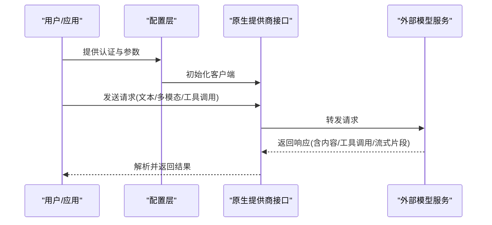
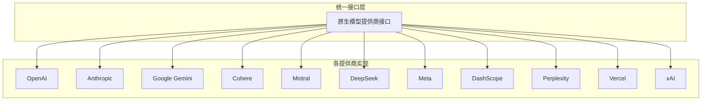

# 原生模型提供商

<cite>
**本文引用的文件**
- [cookbook/models/overview.mdx](file://cookbook/models/overview.mdx)
- [models/providers/model-index.mdx](file://models/providers/model-index.mdx)
- [models/providers/native/openai/completion/overview.mdx](file://models/providers/native/openai/completion/overview.mdx)
- [models/providers/native/openai/responses/overview.mdx](file://models/providers/native/openai/responses/overview.mdx)
- [models/providers/native/anthropic/overview.mdx](file://models/providers/native/anthropic/overview.mdx)
- [models/providers/native/google/overview.mdx](file://models/providers/native/google/overview.mdx)
- [models/providers/native/cohere/overview.mdx](file://models/providers/native/cohere/overview.mdx)
- [models/providers/native/mistral/overview.mdx](file://models/providers/native/mistral/overview.mdx)
- [models/providers/native/deepseek/overview.mdx](file://models/providers/native/deepseek/overview.mdx)
- [models/providers/native/meta/overview.mdx](file://models/providers/native/meta/overview.mdx)
- [models/providers/native/dashscope/overview.mdx](file://models/providers/native/dashscope/overview.mdx)
- [models/providers/native/perplexity/overview.mdx](file://models/providers/native/perplexity/overview.mdx)
- [models/providers/native/vercel/overview.mdx](file://models/providers/native/vercel/overview.mdx)
- [models/providers/native/xai/overview.mdx](file://models/providers/native/xai/overview.mdx)
- [models/providers/native/openai-like.mdx](file://models/providers/openai-like.mdx)
- [models/compatibility.mdx](file://models/compatibility.mdx)
- [reference/models/openai.mdx](file://reference/models/openai.mdx)
- [reference/models/anthropic.mdx](file://reference/models/anthropic.mdx)
- [reference/models/gemini.mdx](file://reference/models/gemini.mdx)
- [reference/models/cohere.mdx](file://reference/models/cohere.mdx)
- [reference/models/mistral.mdx](file://reference/models/mistral.mdx)
- [reference/models/deepseek.mdx](file://reference/models/deepseek.mdx)
- [reference/models/meta.mdx](file://reference/models/meta.mdx)
- [reference/models/dashscope.mdx](file://reference/models/dashscope.mdx)
- [reference/models/perplexity.mdx](file://reference/models/perplexity.mdx)
- [reference/models/vercel.mdx](file://reference/models/vercel.mdx)
- [reference/models/xai.mdx](file://reference/models/xai.mdx)
- [examples/models/openai/basic.mdx](file://examples/models/openai/basic.mdx)
- [examples/models/anthropic/basic.mdx](file://examples/models/anthropic/basic.mdx)
- [examples/models/google/gemini/basic.mdx](file://examples/models/google/gemini/basic.mdx)
- [examples/models/cohere/basic.mdx](file://examples/models/cohere/basic.mdx)
- [examples/models/mistral/basic.mdx](file://examples/models/mistral/basic.mdx)
- [examples/models/deepseek/basic.mdx](file://examples/models/deepseek/basic.mdx)
- [examples/models/meta/basic.mdx](file://examples/models/meta/basic.mdx)
- [examples/models/dashscope/basic.mdx](file://examples/models/dashscope/basic.mdx)
- [examples/models/perplexity/basic.mdx](file://examples/models/perplexity/basic.mdx)
- [examples/models/vercel/basic.mdx](file://examples/models/vercel/basic.mdx)
- [examples/models/xai/basic.mdx](file://examples/models/xai/basic.mdx)
- [examples/models/openai/streaming.mdx](file://examples/models/openai/streaming.mdx)
- [examples/models/anthropic/streaming.mdx](file://examples/models/anthropic/streaming.mdx)
- [examples/models/google/gemini/streaming.mdx](file://examples/models/google/gemini/streaming.mdx)
- [examples/models/cohere/streaming.mdx](file://examples/models/cohere/streaming.mdx)
- [examples/models/mistral/streaming.mdx](file://examples/models/mistral/streaming.mdx)
- [examples/models/deepseek/streaming.mdx](file://examples/models/deepseek/streaming.mdx)
- [examples/models/meta/streaming.mdx](file://examples/models/meta/streaming.mdx)
- [examples/models/dashscope/streaming.mdx](file://examples/models/dashscope/streaming.mdx)
- [examples/models/perplexity/streaming.mdx](file://examples/models/perplexity/streaming.mdx)
- [examples/models/vercel/streaming.mdx](file://examples/models/vercel/streaming.mdx)
- [examples/models/xai/streaming.mdx](file://examples/models/xai/streaming.mdx)
- [examples/models/openai/structured-output.mdx](file://examples/models/openai/structured-output.mdx)
- [examples/models/anthropic/structured-output.mdx](file://examples/models/anthropic/structured-output.mdx)
- [examples/models/google/gemini/structured-output.mdx](file://examples/models/google/gemini/structured-output.mdx)
- [examples/models/cohere/structured-output.mdx](file://examples/models/cohere/structured-output.mdx)
- [examples/models/mistral/structured-output.mdx](file://examples/models/mistral/structured-output.mdx)
- [examples/models/deepseek/structured-output.mdx](file://examples/models/deepseek/structured-output.mdx)
- [examples/models/meta/structured-output.mdx](file://examples/models/meta/structured-output.mdx)
- [examples/models/dashscope/structured-output.mdx](file://examples/models/dashscope/structured-output.mdx)
- [examples/models/perplexity/structured-output.mdx](file://examples/models/perplexity/structured-output.mdx)
- [examples/models/vercel/structured-output.mdx](file://examples/models/vercel/structured-output.mdx)
- [examples/models/xai/structured-output.mdx](file://examples/models/xai/structured-output.mdx)
- [examples/models/openai/knowledge.mdx](file://examples/models/openai/knowledge.mdx)
- [examples/models/anthropic/knowledge.mdx](file://examples/models/anthropic/knowledge.mdx)
- [examples/models/google/gemini/knowledge.mdx](file://examples/models/google/gemini/knowledge.mdx)
- [examples/models/cohere/knowledge.mdx](file://examples/models/cohere/knowledge.mdx)
- [examples/models/mistral/knowledge.mdx](file://examples/models/mistral/knowledge.mdx)
- [examples/models/deepseek/knowledge.mdx](file://examples/models/deepseek/knowledge.mdx)
- [examples/models/meta/knowledge.mdx](file://examples/models/meta/knowledge.mdx)
- [examples/models/dashscope/knowledge.mdx](file://examples/models/dashscope/knowledge.mdx)
- [examples/models/perplexity/knowledge.mdx](file://examples/models/perplexity/knowledge.mdx)
- [examples/models/vercel/knowledge.mdx](file://examples/models/vercel/knowledge.mdx)
- [examples/models/xai/knowledge.mdx](file://examples/models/xai/knowledge.mdx)
- [examples/models/openai/memory.mdx](file://examples/models/openai/memory.mdx)
- [examples/models/anthropic/memory.mdx](file://examples/models/anthropic/memory.mdx)
- [examples/models/google/gemini/memory.mdx](file://examples/models/google/gemini/memory.mdx)
- [examples/models/cohere/memory.mdx](file://examples/models/cohere/memory.mdx)
- [examples/models/mistral/memory.mdx](file://examples/models/mistral/memory.mdx)
- [examples/models/deepseek/memory.mdx](file://examples/models/deepseek/memory.mdx)
- [examples/models/meta/memory.mdx](file://examples/models/meta/memory.mdx)
- [examples/models/dashscope/memory.mdx](file://examples/models/dashscope/memory.mdx)
- [examples/models/perplexity/memory.mdx](file://examples/models/perplexity/memory.mdx)
- [examples/models/vercel/memory.mdx](file://examples/models/vercel/memory.mdx)
- [examples/models/xai/memory.mdx](file://examples/models/xai/memory.mdx)
</cite>

## 目录
1. [简介](#简介)
2. [项目结构](#项目结构)
3. [核心组件](#核心组件)
4. [架构总览](#架构总览)
5. [详细组件分析](#详细组件分析)
6. [依赖关系分析](#依赖关系分析)
7. [性能考虑](#性能考虑)
8. [故障排查指南](#故障排查指南)
9. [结论](#结论)
10. [附录](#附录)

## 简介
本文件面向需要在系统中集成与使用“原生模型提供商”的工程师与技术作者，覆盖 OpenAI、Anthropic、Google Gemini、Cohere、Mistral、DeepSeek、Meta、DashScope、Perplexity、Vercel、xAI 等 11 个原生提供商。内容包括：
- 各提供商特点与支持的模型系列
- 认证方式与关键配置参数
- 请求格式、响应处理与错误处理策略
- 实际使用场景与示例路径（以文件路径代替代码片段）
- 独特能力说明（如 OpenAI 函数调用、Anthropic 推理能力、Google Gemini 多模态等）
- 性能优化建议与最佳实践

## 项目结构
原生模型提供商相关文档与示例主要分布在以下位置：
- 模型索引与导航：models/providers/model-index.mdx
- 各提供商概览与参考：models/providers/native/{provider}/overview.mdx
- 使用示例：examples/models/{provider}/{scenario}.mdx
- 参考文档：reference/models/{provider}.mdx
- 兼容性与导入映射：cookbook/models/overview.mdx、models/compatibility.mdx

```mermaid
graph TB
A["模型索引<br/>models/providers/model-index.mdx"] --> B["OpenAI<br/>models/providers/native/openai/..."]
A --> C["Anthropic<br/>models/providers/native/anthropic/overview.mdx"]
A --> D["Google Gemini<br/>models/providers/native/google/overview.mdx"]
A --> E["Cohere<br/>models/providers/native/cohere/overview.mdx"]
A --> F["Mistral<br/>models/providers/native/mistral/overview.mdx"]
A --> G["DeepSeek<br/>models/providers/native/deepseek/overview.mdx"]
A --> H["Meta<br/>models/providers/native/meta/overview.mdx"]
A --> I["DashScope<br/>models/providers/native/dashscope/overview.mdx"]
A --> J["Perplexity<br/>models/providers/native/perplexity/overview.mdx"]
A --> K["Vercel<br/>models/providers/native/vercel/overview.mdx"]
A --> L["xAI<br/>models/providers/native/xai/overview.mdx"]
B --> R1["示例：basic/streaming/structured-output/knowledge/memory"]
C --> R2["示例：basic/streaming/structured-output/knowledge/memory"]
D --> R3["示例：basic/streaming/structured-output/knowledge/memory"]
E --> R4["示例：basic/streaming/structured-output/knowledge/memory"]
F --> R5["示例：basic/streaming/structured-output/knowledge/memory"]
G --> R6["示例：basic/streaming/structured-output/knowledge/memory"]
H --> R7["示例：basic/streaming/structured-output/knowledge/memory"]
I --> R8["示例：basic/streaming/structured-output/knowledge/memory"]
J --> R9["示例：basic/streaming/structured-output/knowledge/memory"]
K --> R10["示例：basic/streaming/structured-output/knowledge/memory"]
L --> R11["示例：basic/streaming/structured-output/knowledge/memory"]
```

图表来源
- [models/providers/model-index.mdx:10-109](file://models/providers/model-index.mdx#L10-L109)

章节来源
- [models/providers/model-index.mdx:1-148](file://models/providers/model-index.mdx#L1-L148)
- [cookbook/models/overview.mdx:46-72](file://cookbook/models/overview.mdx#L46-L72)

## 核心组件
- 模型索引页：提供所有原生提供商的卡片式导航入口，便于快速定位到各提供商的概览与使用示例。
- 各提供商概览页：包含该提供商的特性说明、模型系列、认证与配置要点、请求/响应格式与错误处理策略。
- 示例集合：覆盖基础调用、流式输出、结构化输出、知识增强、记忆增强等典型场景。
- 参考文档：提供更深入的参数定义、兼容性矩阵与最佳实践。

章节来源
- [models/providers/model-index.mdx:10-109](file://models/providers/model-index.mdx#L10-L109)
- [cookbook/models/overview.mdx:46-72](file://cookbook/models/overview.mdx#L46-L72)
- [models/compatibility.mdx:80-91](file://models/compatibility.mdx#L80-L91)

## 架构总览
从使用者视角，系统通过统一的“原生模型提供商”抽象对接各外部服务。调用流程通常如下：
- 配置认证与参数（API Key、端点、模型名、温度等）
- 组装请求（文本/图像/工具调用等）
- 发送请求并接收响应（同步或流式）
- 解析响应并进行后续处理（结构化输出、知识检索、记忆管理）

## 详细组件分析

### OpenAI
- 特点与能力
  - 支持函数调用、结构化输出、流式输出、工具调用等。
  - 提供 Completion 与 Chat 系列模型，适配多种任务形态。
- 认证与配置
  - 通过 API Key 进行认证；可配置端点、模型名、温度、最大生成长度等。
- 请求与响应
  - 请求体包含消息数组、工具定义、结构化输出模式等；响应包含文本内容、工具调用片段与 finish_reason。
- 错误处理
  - 对超时、配额不足、参数错误等进行分类处理，并记录上下文信息以便重试或降级。
- 使用示例
  - 基础调用、流式输出、结构化输出、知识增强、记忆增强等场景的示例路径见下方“章节来源”。

章节来源
- [models/providers/native/openai/completion/overview.mdx](file://models/providers/native/openai/completion/overview.mdx)
- [models/providers/native/openai/responses/overview.mdx](file://models/providers/native/openai/responses/overview.mdx)
- [reference/models/openai.mdx](file://reference/models/openai.mdx)
- [examples/models/openai/basic.mdx](file://examples/models/openai/basic.mdx)
- [examples/models/openai/streaming.mdx](file://examples/models/openai/streaming.mdx)
- [examples/models/openai/structured-output.mdx](file://examples/models/openai/structured-output.mdx)
- [examples/models/openai/knowledge.mdx](file://examples/models/openai/knowledge.mdx)
- [examples/models/openai/memory.mdx](file://examples/models/openai/memory.mdx)

### Anthropic
- 特点与能力
  - 强推理与长上下文能力，适合复杂推理与长文档理解。
- 认证与配置
  - 通过 API Key 认证；可配置模型系列、系统提示、最大输出长度等。
- 请求与响应
  - 请求包含人类消息与助手消息序列；响应包含文本内容与停止原因。
- 错误处理
  - 区分速率限制、无效参数、服务不可用等错误类型，支持指数退避重试。
- 使用示例
  - 基础调用、流式输出、结构化输出、知识增强、记忆增强等场景的示例路径见下方“章节来源”。

章节来源
- [models/providers/native/anthropic/overview.mdx](file://models/providers/native/anthropic/overview.mdx)
- [reference/models/anthropic.mdx](file://reference/models/anthropic.mdx)
- [examples/models/anthropic/basic.mdx](file://examples/models/anthropic/basic.mdx)
- [examples/models/anthropic/streaming.mdx](file://examples/models/anthropic/streaming.mdx)
- [examples/models/anthropic/structured-output.mdx](file://examples/models/anthropic/structured-output.mdx)
- [examples/models/anthropic/knowledge.mdx](file://examples/models/anthropic/knowledge.mdx)
- [examples/models/anthropic/memory.mdx](file://examples/models/anthropic/memory.mdx)

### Google Gemini
- 特点与能力
  - 多模态支持（文本、图像、视频），适合图文/视频理解与生成。
- 认证与配置
  - 通过 API Key 认证；可选择模型系列与多模态输入。
- 请求与响应
  - 请求支持文本与多模态组合；响应包含生成文本、图像/视频输出与安全过滤标记。
- 错误处理
  - 处理内容安全策略触发、输入格式错误、配额限制等。
- 使用示例
  - 基础调用、流式输出、结构化输出、知识增强、记忆增强等场景的示例路径见下方“章节来源”。

章节来源
- [models/providers/native/google/overview.mdx](file://models/providers/native/google/overview.mdx)
- [reference/models/gemini.mdx](file://reference/models/gemini.mdx)
- [examples/models/google/gemini/basic.mdx](file://examples/models/google/gemini/basic.mdx)
- [examples/models/google/gemini/streaming.mdx](file://examples/models/google/gemini/streaming.mdx)
- [examples/models/google/gemini/structured-output.mdx](file://examples/models/google/gemini/structured-output.mdx)
- [examples/models/google/gemini/knowledge.mdx](file://examples/models/google/gemini/knowledge.mdx)
- [examples/models/google/gemini/memory.mdx](file://examples/models/google/gemini/memory.mdx)

### Cohere
- 特点与能力
  - 专注对话与检索增强，支持 rerank 与嵌入模型。
- 认证与配置
  - 通过 API Key 认证；可配置模型系列与检索参数。
- 请求与响应
  - 请求包含对话历史与检索候选；响应包含生成回复与排序分数。
- 错误处理
  - 处理输入过长、模型不可用、配额不足等问题。
- 使用示例
  - 基础调用、流式输出、结构化输出、知识增强、记忆增强等场景的示例路径见下方“章节来源”。

章节来源
- [models/providers/native/cohere/overview.mdx](file://models/providers/native/cohere/overview.mdx)
- [reference/models/cohere.mdx](file://reference/models/cohere.mdx)
- [examples/models/cohere/basic.mdx](file://examples/models/cohere/basic.mdx)
- [examples/models/cohere/streaming.mdx](file://examples/models/cohere/streaming.mdx)
- [examples/models/cohere/structured-output.mdx](file://examples/models/cohere/structured-output.mdx)
- [examples/models/cohere/knowledge.mdx](file://examples/models/cohere/knowledge.mdx)
- [examples/models/cohere/memory.mdx](file://examples/models/cohere/memory.mdx)

### Mistral
- 特点与能力
  - 高性价比推理与指令遵循，适合成本敏感场景。
- 认证与配置
  - 通过 API Key 认证；可配置模型系列与上下文长度。
- 请求与响应
  - 请求包含系统提示与用户消息；响应包含生成文本与完成原因。
- 错误处理
  - 处理速率限制、参数校验失败、服务异常等。
- 使用示例
  - 基础调用、流式输出、结构化输出、知识增强、记忆增强等场景的示例路径见下方“章节来源”。

章节来源
- [models/providers/native/mistral/overview.mdx](file://models/providers/native/mistral/overview.mdx)
- [reference/models/mistral.mdx](file://reference/models/mistral.mdx)
- [examples/models/mistral/basic.mdx](file://examples/models/mistral/basic.mdx)
- [examples/models/mistral/streaming.mdx](file://examples/models/mistral/streaming.mdx)
- [examples/models/mistral/structured-output.mdx](file://examples/models/mistral/structured-output.mdx)
- [examples/models/mistral/knowledge.mdx](file://examples/models/mistral/knowledge.mdx)
- [examples/models/mistral/memory.mdx](file://examples/models/mistral/memory.mdx)

### DeepSeek
- 特点与能力
  - 强推理与代码能力，适合复杂推理与工程场景。
- 认证与配置
  - 通过 API Key 认证；可配置推理模型与上下文长度。
- 请求与响应
  - 请求包含系统提示与用户消息；响应包含推理过程与最终结论。
- 错误处理
  - 处理超时、配额不足、模型不可用等。
- 使用示例
  - 基础调用、流式输出、结构化输出、知识增强、记忆增强等场景的示例路径见下方“章节来源”。

章节来源
- [models/providers/native/deepseek/overview.mdx](file://models/providers/native/deepseek/overview.mdx)
- [reference/models/deepseek.mdx](file://reference/models/deepseek.mdx)
- [examples/models/deepseek/basic.mdx](file://examples/models/deepseek/basic.mdx)
- [examples/models/deepseek/streaming.mdx](file://examples/models/deepseek/streaming.mdx)
- [examples/models/deepseek/structured-output.mdx](file://examples/models/deepseek/structured-output.mdx)
- [examples/models/deepseek/knowledge.mdx](file://examples/models/deepseek/knowledge.mdx)
- [examples/models/deepseek/memory.mdx](file://examples/models/deepseek/memory.mdx)

### Meta
- 特点与能力
  - Meta 的 Llama 系列模型，适合多语言与通用对话。
- 认证与配置
  - 通过 API Key 认证；可配置模型系列与上下文长度。
- 请求与响应
  - 请求包含系统提示与用户消息；响应包含生成文本与完成原因。
- 错误处理
  - 处理速率限制、参数错误、服务异常等。
- 使用示例
  - 基础调用、流式输出、结构化输出、知识增强、记忆增强等场景的示例路径见下方“章节来源”。

章节来源
- [models/providers/native/meta/overview.mdx](file://models/providers/native/meta/overview.mdx)
- [reference/models/meta.mdx](file://reference/models/meta.mdx)
- [examples/models/meta/basic.mdx](file://examples/models/meta/basic.mdx)
- [examples/models/meta/streaming.mdx](file://examples/models/meta/streaming.mdx)
- [examples/models/meta/structured-output.mdx](file://examples/models/meta/structured-output.mdx)
- [examples/models/meta/knowledge.mdx](file://examples/models/meta/knowledge.mdx)
- [examples/models/meta/memory.mdx](file://examples/models/meta/memory.mdx)

### DashScope
- 特点与能力
  - 阿里云 DashScope 平台的多模态与对话模型，适合中文场景。
- 认证与配置
  - 通过 API Key 认证；可配置模型系列与多模态输入。
- 请求与响应
  - 请求支持文本与多模态组合；响应包含生成文本与多模态输出。
- 错误处理
  - 处理配额不足、输入格式错误、服务不可用等。
- 使用示例
  - 基础调用、流式输出、结构化输出、知识增强、记忆增强等场景的示例路径见下方“章节来源”。

章节来源
- [models/providers/native/dashscope/overview.mdx](file://models/providers/native/dashscope/overview.mdx)
- [reference/models/dashscope.mdx](file://reference/models/dashscope.mdx)
- [examples/models/dashscope/basic.mdx](file://examples/models/dashscope/basic.mdx)
- [examples/models/dashscope/streaming.mdx](file://examples/models/dashscope/streaming.mdx)
- [examples/models/dashscope/structured-output.mdx](file://examples/models/dashscope/structured-output.mdx)
- [examples/models/dashscope/knowledge.mdx](file://examples/models/dashscope/knowledge.mdx)
- [examples/models/dashscope/memory.mdx](file://examples/models/dashscope/memory.mdx)

### Perplexity
- 特点与能力
  - 专注在线检索增强与问答，适合事实性问题与实时信息查询。
- 认证与配置
  - 通过 API Key 认证；可配置检索增强与模型系列。
- 请求与响应
  - 请求包含用户问题与检索上下文；响应包含检索结果与生成回答。
- 错误处理
  - 处理检索失败、模型不可用、配额不足等。
- 使用示例
  - 基础调用、流式输出、结构化输出、知识增强、记忆增强等场景的示例路径见下方“章节来源”。

章节来源
- [models/providers/native/perplexity/overview.mdx](file://models/providers/native/perplexity/overview.mdx)
- [reference/models/perplexity.mdx](file://reference/models/perplexity.mdx)
- [examples/models/perplexity/basic.mdx](file://examples/models/perplexity/basic.mdx)
- [examples/models/perplexity/streaming.mdx](file://examples/models/perplexity/streaming.mdx)
- [examples/models/perplexity/structured-output.mdx](file://examples/models/perplexity/structured-output.mdx)
- [examples/models/perplexity/knowledge.mdx](file://examples/models/perplexity/knowledge.mdx)
- [examples/models/perplexity/memory.mdx](file://examples/models/perplexity/memory.mdx)

### Vercel
- 特点与能力
  - Vercel AI SDK 生态，支持多模型与流式输出，适合前端/边缘部署。
- 认证与配置
  - 通过 API Key 认证；可配置模型系列与流式输出开关。
- 请求与响应
  - 请求包含消息数组与流式标志；响应包含流式片段与最终结果。
- 错误处理
  - 处理网络错误、速率限制、模型不可用等。
- 使用示例
  - 基础调用、流式输出、图像生成、知识增强、工具调用等场景的示例路径见下方“章节来源”。

章节来源
- [models/providers/native/vercel/overview.mdx](file://models/providers/native/vercel/overview.mdx)
- [reference/models/vercel.mdx](file://reference/models/vercel.mdx)
- [examples/models/vercel/basic.mdx](file://examples/models/vercel/basic.mdx)
- [examples/models/vercel/streaming.mdx](file://examples/models/vercel/streaming.mdx)
- [examples/models/vercel/knowledge.mdx](file://examples/models/vercel/knowledge.mdx)
- [examples/models/vercel/structured-output.mdx](file://examples/models/vercel/structured-output.mdx)

### xAI
- 特点与能力
  - 由 xAI 提供的高推理能力模型，适合复杂推理与长文本生成。
- 认证与配置
  - 通过 API Key 认证；可配置模型系列与上下文长度。
- 请求与响应
  - 请求包含系统提示与用户消息；响应包含生成文本与完成原因。
- 错误处理
  - 处理速率限制、参数错误、服务异常等。
- 使用示例
  - 基础调用、流式输出、结构化输出、知识增强、记忆增强等场景的示例路径见下方“章节来源”。

章节来源
- [models/providers/native/xai/overview.mdx](file://models/providers/native/xai/overview.mdx)
- [reference/models/xai.mdx](file://reference/models/xai.mdx)
- [examples/models/xai/basic.mdx](file://examples/models/xai/basic.mdx)
- [examples/models/xai/streaming.mdx](file://examples/models/xai/streaming.mdx)
- [examples/models/xai/structured-output.mdx](file://examples/models/xai/structured-output.mdx)
- [examples/models/xai/knowledge.mdx](file://examples/models/xai/knowledge.mdx)
- [examples/models/xai/memory.mdx](file://examples/models/xai/memory.mdx)

## 依赖关系分析
- 组件内聚与耦合
  - 各提供商模块相对独立，通过统一的“原生模型提供商”接口进行封装，降低对上层业务的耦合。
- 直接与间接依赖
  - 认证与配置层为各提供商的共同依赖；请求/响应解析与错误处理策略在各模块中复用。
- 外部依赖与集成点
  - 主要依赖外部 HTTP 客户端与模型服务；部分提供商支持流式输出，需注意连接与缓冲策略。
- 接口契约与实现细节
  - 所有提供商均遵循一致的初始化参数与调用协议，便于切换与迁移。

图表来源
- [models/providers/model-index.mdx:10-109](file://models/providers/model-index.mdx#L10-L109)

章节来源
- [models/providers/model-index.mdx:10-109](file://models/providers/model-index.mdx#L10-L109)
- [cookbook/models/overview.mdx:46-72](file://cookbook/models/overview.mdx#L46-L72)

## 性能考虑
- 流式输出优先：在长文本生成与实时交互场景中启用流式输出，减少首字节延迟。
- 批量与并发：合理控制并发数与批量大小，避免触发速率限制；对失败请求采用指数退避重试。
- 上下文裁剪：对长上下文进行摘要或分段处理，降低 Token 成本与延迟。
- 缓存策略：对重复输入或相似查询进行缓存，结合 ETag 或内容哈希实现高效命中。
- 模型选择：根据任务类型选择合适模型（推理/对话/多模态），平衡质量与成本。
- 超时与重试：为网络不稳定场景设置合理的超时与重试上限，避免阻塞主线程。

## 故障排查指南
- 常见错误类型
  - 认证失败：检查 API Key 是否正确、是否过期或被撤销。
  - 参数错误：核对模型名、温度、最大输出长度等参数是否符合提供商要求。
  - 速率限制：降低并发或等待配额恢复；必要时切换备用提供商。
  - 服务不可用：检查提供商状态页面与网络连通性。
- 日志与追踪
  - 记录请求 ID、时间戳、模型名与错误码，便于定位问题。
- 降级与回退
  - 在主提供商不可用时自动切换至备用提供商或本地模型。
- 重试策略
  - 对临时性错误（如网络抖动）采用指数退避重试；对永久性错误直接失败并上报。

## 结论
通过统一的“原生模型提供商”抽象，系统能够以一致的方式接入 OpenAI、Anthropic、Google Gemini、Cohere、Mistral、DeepSeek、Meta、DashScope、Perplexity、Vercel、xAI 等多家服务商。配合完善的认证、请求/响应处理与错误处理机制，以及丰富的使用示例与性能优化建议，开发者可以快速构建稳定、高性能的多模型应用。

## 附录
- 快速定位示例
  - 基础调用：examples/models/{provider}/basic.mdx
  - 流式输出：examples/models/{provider}/streaming.mdx
  - 结构化输出：examples/models/{provider}/structured-output.mdx
  - 知识增强：examples/models/{provider}/knowledge.mdx
  - 记忆增强：examples/models/{provider}/memory.mdx
- 参考文档
  - reference/models/{provider}.mdx