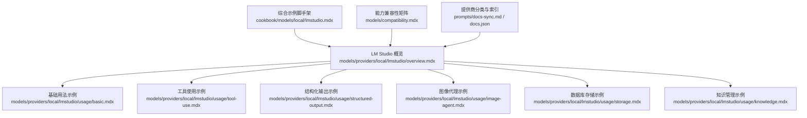
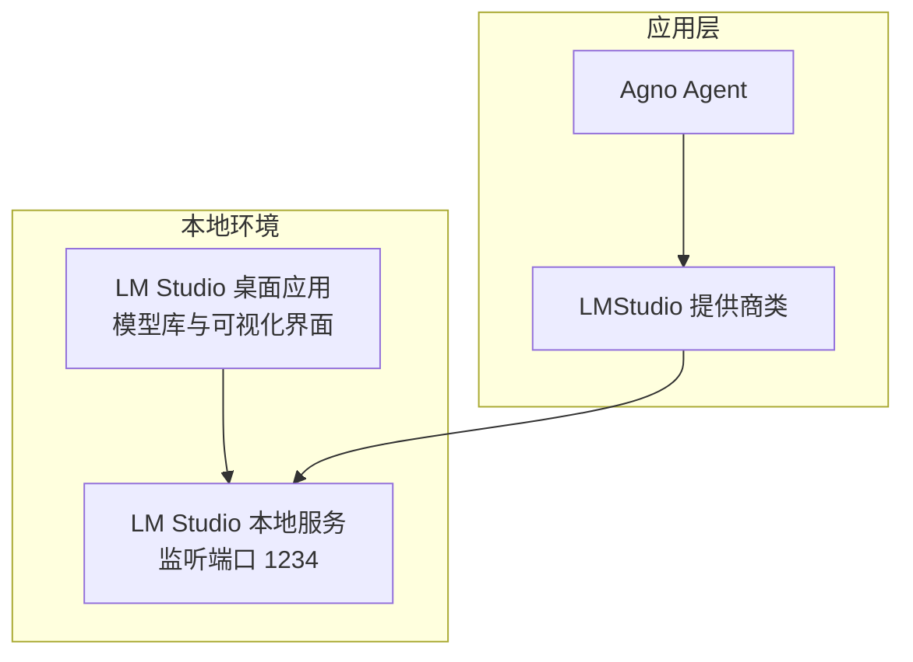
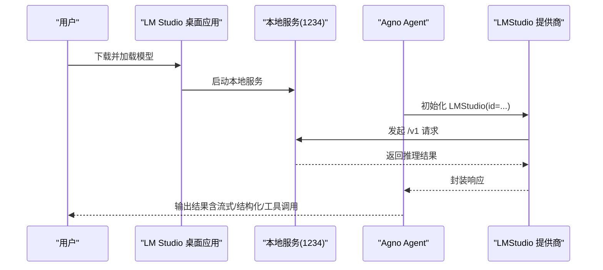
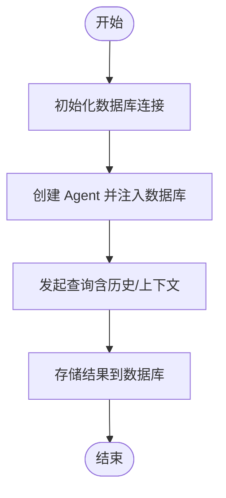
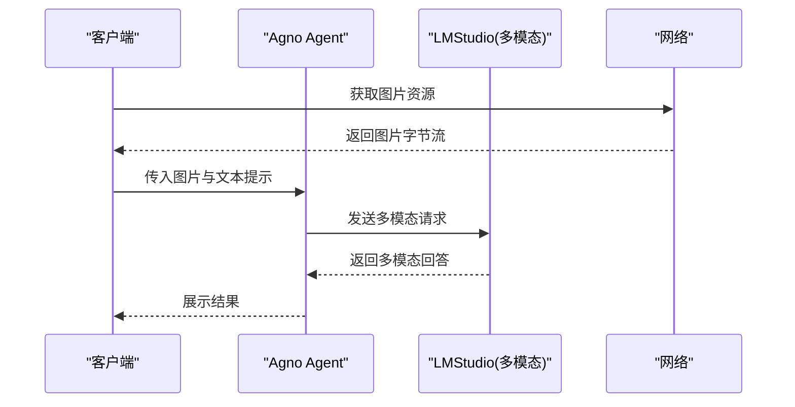
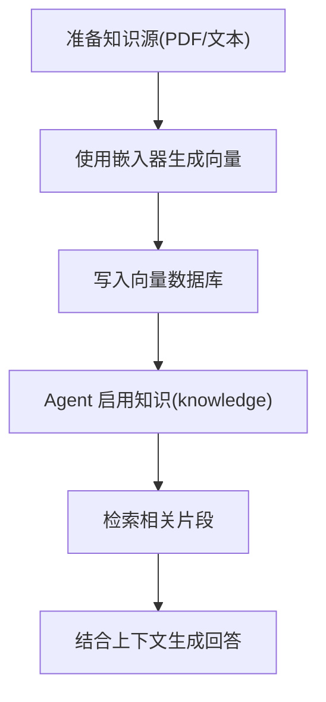
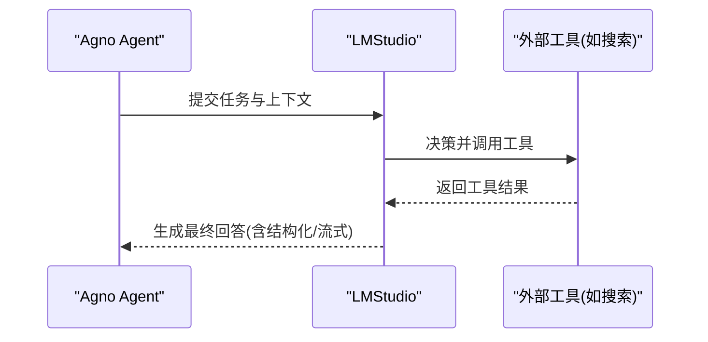
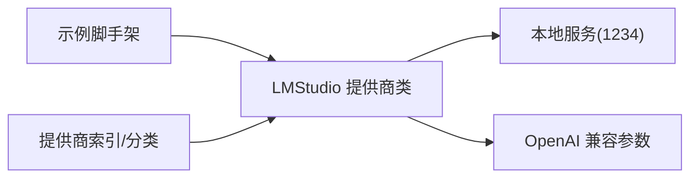

# LM Studio 本地模型

<cite>
**本文引用的文件**
- [cookbook/models/local/lmstudio.mdx](file://cookbook/models/local/lmstudio.mdx)
- [models/providers/local/lmstudio/overview.mdx](file://models/providers/local/lmstudio/overview.mdx)
- [models/providers/local/lmstudio/usage/basic.mdx](file://models/providers/local/lmstudio/usage/basic.mdx)
- [models/providers/local/lmstudio/usage/tool-use.mdx](file://models/providers/local/lmstudio/usage/tool-use.mdx)
- [models/providers/local/lmstudio/usage/structured-output.mdx](file://models/providers/local/lmstudio/usage/structured-output.mdx)
- [models/providers/local/lmstudio/usage/image-agent.mdx](file://models/providers/local/lmstudio/usage/image-agent.mdx)
- [models/providers/local/lmstudio/usage/storage.mdx](file://models/providers/local/lmstudio/usage/storage.mdx)
- [models/providers/local/lmstudio/usage/knowledge.mdx](file://models/providers/local/lmstudio/usage/knowledge.mdx)
- [models/compatibility.mdx](file://models/compatibility.mdx)
- [prompts/docs-sync.md](file://prompts/docs-sync.md)
- [docs.json](file://docs.json)
</cite>

## 目录
1. [简介](#简介)
2. [项目结构](#项目结构)
3. [核心组件](#核心组件)
4. [架构总览](#架构总览)
5. [详细组件分析](#详细组件分析)
6. [依赖关系分析](#依赖关系分析)
7. [性能考虑](#性能考虑)
8. [故障排除指南](#故障排除指南)
9. [结论](#结论)
10. [附录](#附录)

## 简介
本技术文档面向在本地运行大语言模型的用户，系统性介绍 LM Studio 的桌面应用与本地推理能力，并结合 Agno 框架中的 LM Studio 提供商实现，给出安装、启动、模型下载与管理界面使用方式、支持的模型格式与兼容性、配置与参数调优、以及在数据库集成、图像处理、知识管理与内存集成等场景下的特殊功能与实践示例。文档同时提供故障排除与性能调优建议，帮助用户充分发挥 LM Studio 的本地推理能力。

## 项目结构
围绕 LM Studio 的本地模型能力，相关文档分布在以下位置：
- 概览与参数：models/providers/local/lmstudio/overview.mdx
- 基础用法示例：models/providers/local/lmstudio/usage/basic.mdx
- 工具使用示例：models/providers/local/lmstudio/usage/tool-use.mdx
- 结构化输出示例：models/providers/local/lmstudio/usage/structured-output.mdx
- 图像多模态示例：models/providers/local/lmstudio/usage/image-agent.mdx
- 数据库存储示例：models/providers/local/lmstudio/usage/storage.mdx
- 知识管理示例：models/providers/local/lmstudio/usage/knowledge.mdx
- 综合示例与脚手架：cookbook/models/local/lmstudio.mdx
- 能力兼容性矩阵：models/compatibility.mdx
- 提供商分类与索引：prompts/docs-sync.md、docs.json

**图表来源**
- [models/providers/local/lmstudio/overview.mdx:1-58](file://models/providers/local/lmstudio/overview.mdx#L1-L58)
- [models/providers/local/lmstudio/usage/basic.mdx:1-39](file://models/providers/local/lmstudio/usage/basic.mdx#L1-L39)
- [models/providers/local/lmstudio/usage/tool-use.mdx:1-46](file://models/providers/local/lmstudio/usage/tool-use.mdx#L1-L46)
- [models/providers/local/lmstudio/usage/structured-output.mdx:1-70](file://models/providers/local/lmstudio/usage/structured-output.mdx#L1-L70)
- [models/providers/local/lmstudio/usage/image-agent.mdx:1-48](file://models/providers/local/lmstudio/usage/image-agent.mdx#L1-L48)
- [models/providers/local/lmstudio/usage/storage.mdx:1-69](file://models/providers/local/lmstudio/usage/storage.mdx#L1-L69)
- [models/providers/local/lmstudio/usage/knowledge.mdx:1-76](file://models/providers/local/lmstudio/usage/knowledge.mdx#L1-L76)
- [cookbook/models/local/lmstudio.mdx:1-88](file://cookbook/models/local/lmstudio.mdx#L1-L88)
- [models/compatibility.mdx:1-92](file://models/compatibility.mdx#L1-L92)
- [prompts/docs-sync.md:667-674](file://prompts/docs-sync.md#L667-L674)
- [docs.json:1302-1314](file://docs.json#L1302-L1314)

**章节来源**
- [models/providers/local/lmstudio/overview.mdx:1-58](file://models/providers/local/lmstudio/overview.mdx#L1-L58)
- [models/providers/local/lmstudio/usage/basic.mdx:1-39](file://models/providers/local/lmstudio/usage/basic.mdx#L1-L39)
- [models/providers/local/lmstudio/usage/tool-use.mdx:1-46](file://models/providers/local/lmstudio/usage/tool-use.mdx#L1-L46)
- [models/providers/local/lmstudio/usage/structured-output.mdx:1-70](file://models/providers/local/lmstudio/usage/structured-output.mdx#L1-L70)
- [models/providers/local/lmstudio/usage/image-agent.mdx:1-48](file://models/providers/local/lmstudio/usage/image-agent.mdx#L1-L48)
- [models/providers/local/lmstudio/usage/storage.mdx:1-69](file://models/providers/local/lmstudio/usage/storage.mdx#L1-L69)
- [models/providers/local/lmstudio/usage/knowledge.mdx:1-76](file://models/providers/local/lmstudio/usage/knowledge.mdx#L1-L76)
- [cookbook/models/local/lmstudio.mdx:1-88](file://cookbook/models/local/lmstudio.mdx#L1-L88)
- [models/compatibility.mdx:1-92](file://models/compatibility.mdx#L1-L92)
- [prompts/docs-sync.md:667-674](file://prompts/docs-sync.md#L667-L674)
- [docs.json:1302-1314](file://docs.json#L1302-L1314)

## 核心组件
- LM Studio 提供商类（LMStudio）：封装本地推理服务访问，支持 OpenAI 兼容接口参数，便于在 Agno Agent 中直接使用。
- 示例脚手架与用法：涵盖基础对话、流式输出、工具调用、结构化输出、图像输入、数据库与知识管理等典型场景。
- 兼容性矩阵：明确 LM Studio 在多模态、工具调用、结构化输出、异步执行等维度的能力覆盖情况。

关键参数要点（来自概览页）：
- id：本地已加载模型的标识符（例如 qwen2.5-7b-instruct-1m 或 llama3.2-vision）
- name：模型名称（默认 LMStudio）
- provider：提供方（默认 LMStudio）
- api_key：通常本地无需密钥（可选）
- base_url：本地服务地址（默认 http://localhost:1234/v1）

**章节来源**
- [models/providers/local/lmstudio/overview.mdx:47-57](file://models/providers/local/lmstudio/overview.mdx#L47-L57)

## 架构总览
LM Studio 作为本地推理服务，通过 OpenAI 兼容的 /v1 接口对外提供能力；Agno 的 LMStudio 提供商类以统一的模型参数与接口适配该服务，使 Agent 可以在不关心底层实现的情况下完成对话、工具调用、结构化输出与多模态输入等任务。

**图表来源**
- [models/providers/local/lmstudio/overview.mdx:20-22](file://models/providers/local/lmstudio/overview.mdx#L20-L22)
- [models/providers/local/lmstudio/overview.mdx:55-55](file://models/providers/local/lmstudio/overview.mdx#L55-L55)

## 详细组件分析

### 安装与启动流程
- 安装 LM Studio 并从其模型库下载所需模型。
- 启动 LM Studio，加载并运行模型，服务默认监听本地端口。
- 在 Agno 中通过 LMStudio 提供商类指定模型 id，即可发起请求。

**图表来源**
- [models/providers/local/lmstudio/overview.mdx:20-22](file://models/providers/local/lmstudio/overview.mdx#L20-L22)
- [models/providers/local/lmstudio/usage/basic.mdx:26-28](file://models/providers/local/lmstudio/usage/basic.mdx#L26-L28)

**章节来源**
- [models/providers/local/lmstudio/overview.mdx:20-22](file://models/providers/local/lmstudio/overview.mdx#L20-L22)
- [models/providers/local/lmstudio/usage/basic.mdx:26-28](file://models/providers/local/lmstudio/usage/basic.mdx#L26-L28)

### 模型格式与兼容性
- LM Studio 支持多种开源模型，示例中使用了具备视觉能力的模型与适合工具调用的模型组合，表明其对多模态与工具调用的支持。
- 能力兼容性矩阵显示 LM Studio 支持图像输入，适用于多模态场景；同时在工具调用、结构化输出、异步执行等方面具备一致支持。

**章节来源**
- [models/providers/local/lmstudio/overview.mdx:13-18](file://models/providers/local/lmstudio/overview.mdx#L13-L18)
- [models/compatibility.mdx:66-66](file://models/compatibility.mdx#L66-L66)

### 参数与配置
- 关键参数包括 id、name、provider、api_key、base_url 等，其中 base_url 默认指向本地 1234 端口。
- LM Studio 还继承 OpenAI 兼容参数，便于在不同提供商间切换时保持一致的调用体验。

**章节来源**
- [models/providers/local/lmstudio/overview.mdx:49-57](file://models/providers/local/lmstudio/overview.mdx#L49-L57)

### 数据库集成（存储）
- 通过在 Agent 中注入数据库实例，LM Studio 提供商可与数据库交互，实现上下文历史与数据查询的融合。
- 示例展示了如何连接 PostgreSQL 并配合向量数据库进行检索增强生成（RAG）。

**图表来源**
- [models/providers/local/lmstudio/usage/storage.mdx:14-22](file://models/providers/local/lmstudio/usage/storage.mdx#L14-L22)

**章节来源**
- [models/providers/local/lmstudio/usage/storage.mdx:1-69](file://models/providers/local/lmstudio/usage/storage.mdx#L1-L69)

### 图像处理（多模态）
- 使用图像输入能力，将图片内容传入 LM Studio，实现“看图说话”等多模态任务。
- 示例中通过网络拉取图片并传入 Agent，LM Studio 作为多模态模型进行理解与回答。

**图表来源**
- [models/providers/local/lmstudio/usage/image-agent.mdx:19-27](file://models/providers/local/lmstudio/usage/image-agent.mdx#L19-L27)

**章节来源**
- [models/providers/local/lmstudio/usage/image-agent.mdx:1-48](file://models/providers/local/lmstudio/usage/image-agent.mdx#L1-L48)

### 知识管理（嵌入与检索）
- 通过向量数据库与嵌入器构建知识库，LM Studio 提供商可结合检索到的内容进行问答或创作。
- 示例展示了如何使用嵌入器与向量数据库构建知识库，并在 Agent 中启用知识检索。

**图表来源**
- [models/providers/local/lmstudio/usage/knowledge.mdx:16-31](file://models/providers/local/lmstudio/usage/knowledge.mdx#L16-L31)

**章节来源**
- [models/providers/local/lmstudio/usage/knowledge.mdx:1-76](file://models/providers/local/lmstudio/usage/knowledge.mdx#L1-L76)

### 结构化输出与工具使用
- 结构化输出：通过 Pydantic 模型定义输出模式，Agent 在 LM Studio 的协助下稳定返回符合 schema 的结果。
- 工具使用：Agent 可调用外部工具（如网络搜索），LM Studio 负责决策何时调用工具及如何组织提示词。

**图表来源**
- [models/providers/local/lmstudio/usage/structured-output.mdx:34-42](file://models/providers/local/lmstudio/usage/structured-output.mdx#L34-L42)
- [models/providers/local/lmstudio/usage/tool-use.mdx:12-17](file://models/providers/local/lmstudio/usage/tool-use.mdx#L12-L17)

**章节来源**
- [models/providers/local/lmstudio/usage/structured-output.mdx:1-70](file://models/providers/local/lmstudio/usage/structured-output.mdx#L1-L70)
- [models/providers/local/lmstudio/usage/tool-use.mdx:1-46](file://models/providers/local/lmstudio/usage/tool-use.mdx#L1-L46)

## 依赖关系分析
- LM Studio 提供商类依赖本地服务端口（默认 1234），并与 OpenAI 兼容接口保持一致的参数风格。
- 示例脚手架与用法文档共同构成从入门到进阶的完整路径，覆盖多模态、工具调用、结构化输出、数据库与知识管理等主题。
- 文档索引与提供商分类明确了 LM Studio 归属“本地”类别，便于在整体生态中定位。

**图表来源**
- [models/providers/local/lmstudio/overview.mdx:55-57](file://models/providers/local/lmstudio/overview.mdx#L55-L57)
- [docs.json:1302-1314](file://docs.json#L1302-L1314)
- [prompts/docs-sync.md:669-669](file://prompts/docs-sync.md#L669-L669)

**章节来源**
- [models/providers/local/lmstudio/overview.mdx:49-57](file://models/providers/local/lmstudio/overview.mdx#L49-L57)
- [docs.json:1302-1314](file://docs.json#L1302-L1314)
- [prompts/docs-sync.md:667-674](file://prompts/docs-sync.md#L667-L674)

## 性能考虑
- 选择合适的模型：示例推荐不同用途的模型（如工具调用偏向 qwen 系列、推理偏向 deepseek-r1 系列、小体积偏向 phi4 系列）。
- 多模态与工具调用：LM Studio 对图像输入具备支持，结合工具调用可提升复杂任务的准确性与效率。
- 异步与流式：Agno 在多数提供商上支持异步与流式输出，有助于改善交互体验与资源占用。

**章节来源**
- [models/providers/local/lmstudio/overview.mdx:13-18](file://models/providers/local/lmstudio/overview.mdx#L13-L18)
- [models/compatibility.mdx:12-16](file://models/compatibility.mdx#L12-L16)

## 故障排除指南
- 本地服务未启动或端口冲突：确认 LM Studio 已启动并监听默认端口；若端口被占用，可在 LM Studio 设置中调整。
- 模型未正确加载：检查模型库中是否已下载并成功加载目标模型；必要时重新下载或更换量化版本。
- 访问超时或无法连通：验证 base_url 是否正确；确保防火墙未阻断本地回环。
- 多模态输入失败：确认所选模型具备视觉能力；检查图片格式与大小限制。
- 工具调用异常：检查工具可用性与网络连通性；对于需要 JSON 模式的任务，确保模型与框架的兼容性。

**章节来源**
- [models/providers/local/lmstudio/overview.mdx:20-22](file://models/providers/local/lmstudio/overview.mdx#L20-L22)
- [models/providers/local/lmstudio/usage/image-agent.mdx:19-27](file://models/providers/local/lmstudio/usage/image-agent.mdx#L19-L27)
- [models/providers/local/lmstudio/usage/tool-use.mdx:12-17](file://models/providers/local/lmstudio/usage/tool-use.mdx#L12-L17)

## 结论
LM Studio 为本地推理提供了简洁直观的桌面应用与强大的模型生态。通过 Agno 的 LMStudio 提供商类，用户可以快速在本地完成从基础对话到多模态、工具调用、结构化输出、数据库与知识管理的全栈实践。配合合理的模型选择与参数配置，LM Studio 能够在开发与测试场景中高效满足多样化需求。

## 附录
- 快速开始步骤（来自示例脚手架）：
  - 在 LM Studio 中下载并加载目标模型
  - 安装依赖并运行示例脚本，体验基础对话、工具调用、结构化输出、图像输入与数据库/知识管理等功能

**章节来源**
- [cookbook/models/local/lmstudio.mdx:78-87](file://cookbook/models/local/lmstudio.mdx#L78-L87)