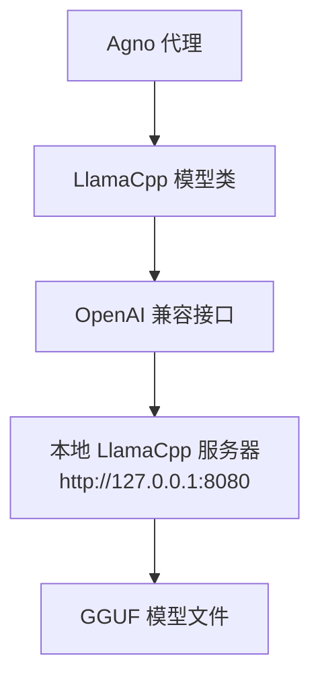
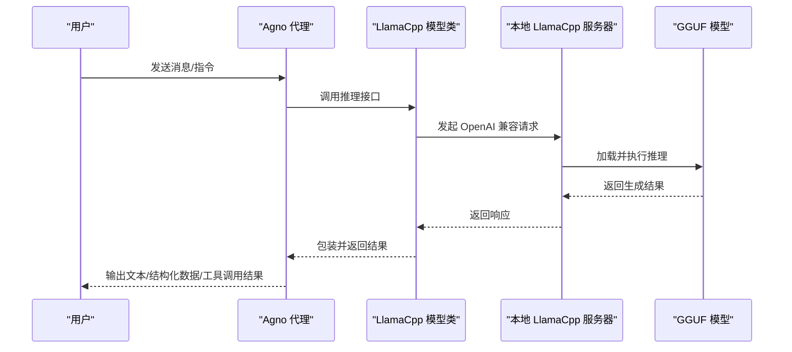
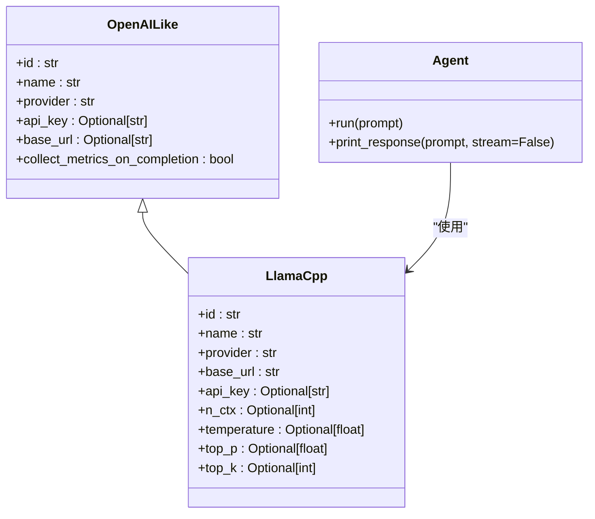

# LlamaCpp 本地模型

<cite>
**本文引用的文件**
- [models/providers/local/llama-cpp/overview.mdx](file://models/providers/local/llama-cpp/overview.mdx)
- [cookbook/models/local/llama-cpp.mdx](file://cookbook/models/local/llama-cpp.mdx)
- [examples/models/llama-cpp/structured-output.mdx](file://examples/models/llama-cpp/structured-output.mdx)
- [examples/models/llama-cpp/tool-use.mdx](file://examples/models/llama-cpp/tool-use.mdx)
- [examples/models/llama-cpp/retry.mdx](file://examples/models/llama-cpp/retry.mdx)
- [models/providers/openai-like.mdx](file://models/providers/openai-like.mdx)
</cite>

## 目录
1. [简介](#简介)
2. [项目结构](#项目结构)
3. [核心组件](#核心组件)
4. [架构总览](#架构总览)
5. [详细组件分析](#详细组件分析)
6. [依赖关系分析](#依赖关系分析)
7. [性能考虑](#性能考虑)
8. [故障排查指南](#故障排查指南)
9. [结论](#结论)
10. [附录](#附录)

## 简介
本技术文档面向希望在 Agno 代理中集成 LlamaCpp 本地推理引擎的用户与工程师。LlamaCpp 是一个高效的本地推理工具，支持以 GGUF 格式运行开源大语言模型，并提供与 OpenAI 兼容的 API 接口。通过 LlamaCpp，Agno 可以在本地或私有环境中进行安全、可控且低延迟的推理，适用于资源受限环境与隐私敏感场景。

## 项目结构
围绕 LlamaCpp 的文档与示例主要分布在以下位置：
- 提供商概览：models/providers/local/llama-cpp/overview.mdx
- 使用示例与工具调用：cookbook/models/local/llama-cpp.mdx
- 结构化输出示例：examples/models/llama-cpp/structured-output.mdx
- 工具使用示例：examples/models/llama-cpp/tool-use.mdx
- 重试机制示例：examples/models/llama-cpp/retry.mdx
- OpenAI 兼容接口参考：models/providers/openai-like.mdx

图表来源
- [models/providers/local/llama-cpp/overview.mdx:70-129](file://models/providers/local/llama-cpp/overview.mdx#L70-L129)
- [models/providers/openai-like.mdx:7-43](file://models/providers/openai-like.mdx#L7-L43)

章节来源
- [models/providers/local/llama-cpp/overview.mdx:11-68](file://models/providers/local/llama-cpp/overview.mdx#L11-L68)
- [cookbook/models/local/llama-cpp.mdx:1-64](file://cookbook/models/local/llama-cpp.mdx#L1-L64)

## 核心组件
- LlamaCpp 模型类：作为 OpenAI 兼容接口的实现，负责向本地 LlamaCpp 服务器发起请求并处理响应。
- 本地 LlamaCpp 服务器：提供 OpenAI Chat 兼容端点（默认 http://127.0.0.1:8080），承载 GGUF 模型推理。
- GGUF 模型文件：以量化格式存储的本地模型文件，可从 HuggingFace 或官方渠道获取。
- Agno 代理：通过 LlamaCpp 模型类与服务器交互，支持流式输出、工具调用与结构化输出等能力。

章节来源
- [models/providers/local/llama-cpp/overview.mdx:70-129](file://models/providers/local/llama-cpp/overview.mdx#L70-L129)
- [models/providers/openai-like.mdx:7-43](file://models/providers/openai-like.mdx#L7-L43)

## 架构总览
下图展示了 Agno 代理、LlamaCpp 模型类与本地服务器之间的交互关系，以及数据流向。

图表来源
- [models/providers/local/llama-cpp/overview.mdx:70-129](file://models/providers/local/llama-cpp/overview.mdx#L70-L129)
- [models/providers/openai-like.mdx:7-43](file://models/providers/openai-like.mdx#L7-L43)

## 详细组件分析

### 安装与配置
- 安装方式：可通过源码编译或包管理器安装 LlamaCpp；随后启动本地服务器并加载 GGUF 模型。
- 服务器默认地址：http://127.0.0.1:8080，提供 OpenAI Chat 兼容端点。
- 模型选择：示例中使用 ggml-org/gpt-oss-20b-GGUF；也可根据硬件与性能需求选择其他量化版本或系列模型。

章节来源
- [models/providers/local/llama-cpp/overview.mdx:39-68](file://models/providers/local/llama-cpp/overview.mdx#L39-L68)

### 参数配置
- 基础参数
  - id：模型标识符（如 GGUF 模型名称）
  - name：模型显示名
  - provider：提供方标识
  - base_url：本地服务器基础地址（默认 http://localhost:8080）
  - api_key：本地部署通常无需密钥
  - n_ctx：上下文窗口大小
  - temperature：采样温度
  - top_p：核采样参数
  - top_k：Top-K 采样参数
- 继承自 OpenAI 兼容接口：LlamaCpp 模型类继承 OpenAILike，因此可复用其参数体系。

章节来源
- [models/providers/local/llama-cpp/overview.mdx:115-129](file://models/providers/local/llama-cpp/overview.mdx#L115-L129)
- [models/providers/openai-like.mdx:32-43](file://models/providers/openai-like.mdx#L32-L43)

### 服务器配置与优化
- 常见服务器参数
  - 上下文大小、批大小、物理批大小、线程数、监听地址与端口
  - 模型路径、HuggingFace 仓库、Jinja 模板化聊天格式
- 性能优化
  - 启用硬件加速后端（NVIDIA CUDA、Apple Metal、OpenCL）
  - 使用量化模型（如 Q4_K_M、Q8_0、Q2_K）平衡体积与质量

章节来源
- [models/providers/local/llama-cpp/overview.mdx:131-176](file://models/providers/local/llama-cpp/overview.mdx#L131-L176)

### 结构化输出与工具使用
- 结构化输出：通过 Pydantic 数据模型定义输出模式，Agent 将自动约束生成内容符合 Schema。
- 工具使用：在 Agent 中注册工具（如网络搜索），由模型在推理过程中决定是否调用工具并返回结果。

章节来源
- [cookbook/models/local/llama-cpp.mdx:36-53](file://cookbook/models/local/llama-cpp.mdx#L36-L53)
- [examples/models/llama-cpp/structured-output.mdx:26-50](file://examples/models/llama-cpp/structured-output.mdx#L26-L50)
- [examples/models/llama-cpp/tool-use.mdx:16-20](file://examples/models/llama-cpp/tool-use.mdx#L16-L20)

### 部署示例与使用场景
- 基础对话：启动本地服务器后，直接使用 LlamaCpp 模型类进行问答。
- 流式输出：启用流式传输以获得更流畅的交互体验。
- 错误重试：在模型标识错误或网络波动时，配置重试次数与退避策略提升鲁棒性。

章节来源
- [cookbook/models/local/llama-cpp.mdx:8-18](file://cookbook/models/local/llama-cpp.mdx#L8-L18)
- [examples/models/llama-cpp/retry.mdx:19-26](file://examples/models/llama-cpp/retry.mdx#L19-L26)

## 依赖关系分析
- LlamaCpp 模型类依赖 OpenAI 兼容接口，从而统一参数与响应格式。
- 本地服务器承载模型推理，是 LlamaCpp 模型类与 GGUF 模型之间的桥梁。
- Agno 代理通过 LlamaCpp 模型类与服务器交互，支持多种高级特性（如工具、结构化输出、流式输出）。

图表来源
- [models/providers/openai-like.mdx:32-43](file://models/providers/openai-like.mdx#L32-L43)
- [models/providers/local/llama-cpp/overview.mdx:115-129](file://models/providers/local/llama-cpp/overview.mdx#L115-L129)

章节来源
- [models/providers/openai-like.mdx:32-43](file://models/providers/openai-like.mdx#L32-L43)
- [models/providers/local/llama-cpp/overview.mdx:115-129](file://models/providers/local/llama-cpp/overview.mdx#L115-L129)

## 性能考虑
- 硬件加速：优先启用与设备匹配的加速后端（CUDA、Metal、OpenCL），显著提升吞吐与降低延迟。
- 批处理与线程：根据 CPU/GPU 资源调整批大小与线程数，避免过载或资源浪费。
- 模型量化：在保证可接受质量的前提下，优先选择更小的量化版本以减少内存占用与提高速度。
- 上下文长度：按需设置上下文窗口，避免不必要的长上下文导致的性能下降。

章节来源
- [models/providers/local/llama-cpp/overview.mdx:152-176](file://models/providers/local/llama-cpp/overview.mdx#L152-L176)

## 故障排查指南
- 服务器连接问题：确认本地服务器已启动并可访问默认端点；使用健康检查命令验证可用性。
- 模型加载问题：检查模型文件是否存在、格式是否正确、内存是否充足、版本是否兼容。
- 性能问题：调整批大小、启用硬件加速、选择合适的量化模型；必要时降低上下文长度或并发度。

章节来源
- [models/providers/local/llama-cpp/overview.mdx:177-197](file://models/providers/local/llama-cpp/overview.mdx#L177-L197)

## 结论
LlamaCpp 为在本地或私网环境中运行高效、可控的大模型推理提供了可靠方案。通过 OpenAI 兼容接口与 Agno 代理的结合，开发者可以快速集成本地推理能力，并在结构化输出、工具调用与流式交互等方面获得一致的开发体验。配合硬件加速与量化模型，可在不同硬件条件下实现性能与质量的平衡。

## 附录
- 快速开始步骤
  - 安装 LlamaCpp 并启动本地服务器
  - 下载并放置 GGUF 模型文件
  - 在 Agno 中配置 LlamaCpp 模型类并发起推理
- 进一步阅读
  - OpenAI 兼容接口参数与行为
  - 结构化输出与工具使用的最佳实践
  - 重试与错误恢复策略

章节来源
- [models/providers/local/llama-cpp/overview.mdx:39-68](file://models/providers/local/llama-cpp/overview.mdx#L39-L68)
- [models/providers/openai-like.mdx:7-43](file://models/providers/openai-like.mdx#L7-L43)