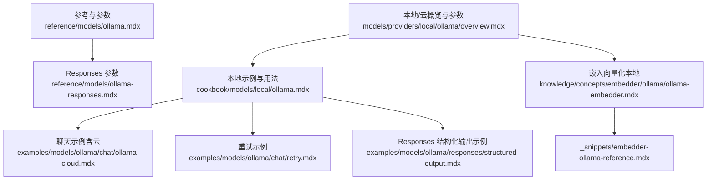
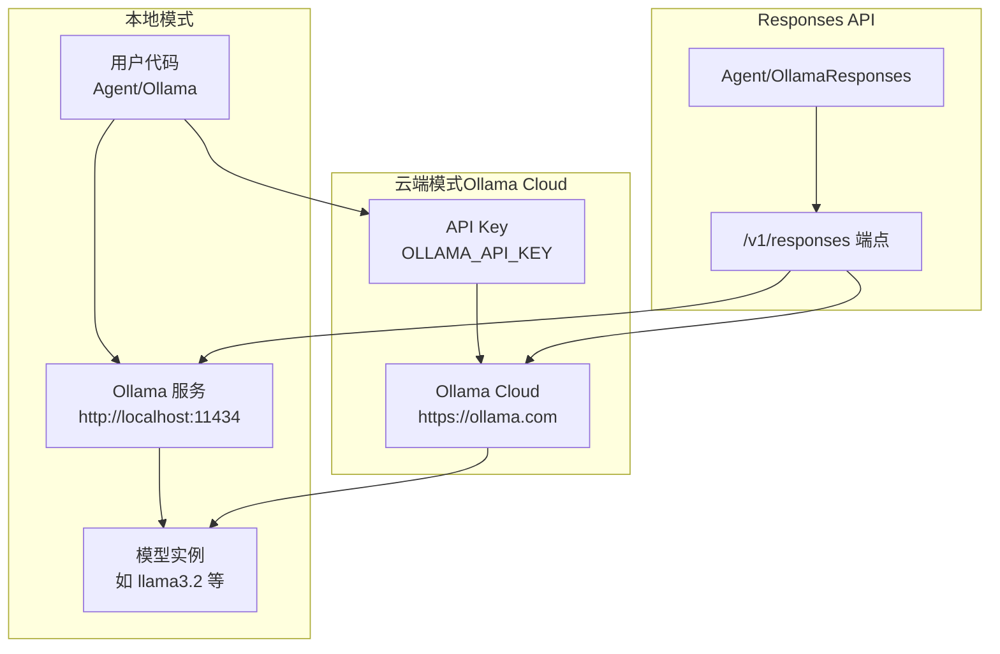
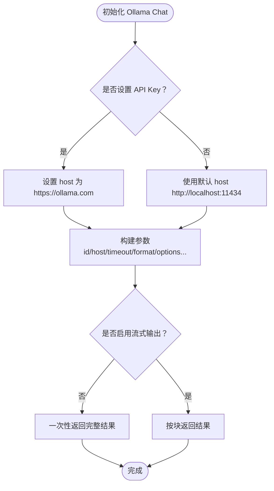
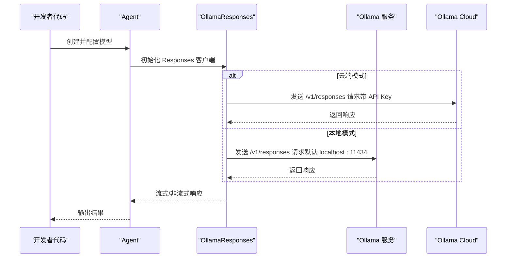
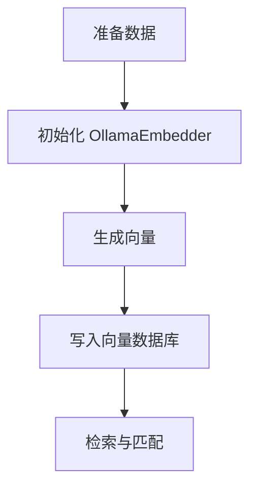
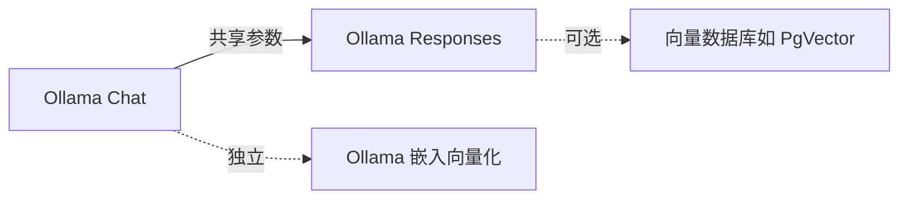

# Ollama 本地模型

<cite>
**本文引用的文件**
- [reference/models/ollama.mdx](file://reference/models/ollama.mdx)
- [reference/models/ollama-responses.mdx](file://reference/models/ollama-responses.mdx)
- [models/providers/local/ollama/overview.mdx](file://models/providers/local/ollama/overview.mdx)
- [cookbook/models/local/ollama.mdx](file://cookbook/models/local/ollama.mdx)
- [examples/models/ollama/chat/ollama-cloud.mdx](file://examples/models/ollama/chat/ollama-cloud.mdx)
- [examples/models/ollama/chat/retry.mdx](file://examples/models/ollama/chat/retry.mdx)
- [examples/models/ollama/responses/structured-output.mdx](file://examples/models/ollama/responses/structured-output.mdx)
- [knowledge/concepts/embedder/ollama/ollama-embedder.mdx](file://knowledge/concepts/embedder/ollama/ollama-embedder.mdx)
- [_snippets/embedder-ollama-reference.mdx](file://_snippets/embedder-ollama-reference.mdx)
</cite>

## 目录
1. [简介](#简介)
2. [项目结构](#项目结构)
3. [核心组件](#核心组件)
4. [架构总览](#架构总览)
5. [详细组件分析](#详细组件分析)
6. [依赖关系分析](#依赖关系分析)
7. [性能考虑](#性能考虑)
8. [故障排除指南](#故障排除指南)
9. [结论](#结论)
10. [附录](#附录)

## 简介
本技术文档面向在本地或云端使用 Ollama 提供商的开发者，系统性介绍 Ollama 的核心能力、安装与配置流程、参数配置、Responses API 使用方式，并通过丰富的示例覆盖基础对话、工具调用、视觉理解、结构化输出、重试机制、嵌入向量化等典型场景。同时提供故障排除与最佳实践建议，帮助用户在开发与生产环境中稳定高效地使用 Ollama。

## 项目结构
围绕 Ollama 的文档与示例主要分布在以下位置：
- 参考与参数定义：reference/models/ollama.mdx、reference/models/ollama-responses.mdx
- 本地/云使用概览与参数表：models/providers/local/ollama/overview.mdx
- 基础与进阶示例：cookbook/models/local/ollama.mdx、examples/models/ollama/chat/*、examples/models/ollama/responses/*
- 嵌入向量化（本地）：knowledge/concepts/embedder/ollama/ollama-embedder.mdx、_snippets/embedder-ollama-reference.mdx

**图表来源**
- [reference/models/ollama.mdx:1-37](file://reference/models/ollama.mdx#L1-L37)
- [reference/models/ollama-responses.mdx:1-88](file://reference/models/ollama-responses.mdx#L1-L88)
- [models/providers/local/ollama/overview.mdx:1-153](file://models/providers/local/ollama/overview.mdx#L1-L153)
- [cookbook/models/local/ollama.mdx:1-90](file://cookbook/models/local/ollama.mdx#L1-L90)
- [examples/models/ollama/chat/ollama-cloud.mdx:1-41](file://examples/models/ollama/chat/ollama-cloud.mdx#L1-L41)
- [examples/models/ollama/chat/retry.mdx:1-50](file://examples/models/ollama/chat/retry.mdx#L1-L50)
- [examples/models/ollama/responses/structured-output.mdx:1-73](file://examples/models/ollama/responses/structured-output.mdx#L1-L73)
- [knowledge/concepts/embedder/ollama/ollama-embedder.mdx:1-72](file://knowledge/concepts/embedder/ollama/ollama-embedder.mdx#L1-L72)
- [_snippets/embedder-ollama-reference.mdx:1-11](file://_snippets/embedder-ollama-reference.mdx#L1-L11)

**章节来源**
- [reference/models/ollama.mdx:1-37](file://reference/models/ollama.mdx#L1-L37)
- [models/providers/local/ollama/overview.mdx:1-153](file://models/providers/local/ollama/overview.mdx#L1-L153)

## 核心组件
- Ollama 模型（Chat API）
  - 支持本地与 Ollama Cloud 双部署模式，自动根据是否设置 API Key 切换主机地址
  - 关键参数：id、name、provider、host、timeout、format、options、keep_alive、template、system、raw、stream、retries、delay_between_retries、exponential_backoff
- Ollama Responses（OpenAI 兼容 Responses API）
  - 通过 /v1/responses 接口交互，v0.13.3+ 版本可用；本地默认 http://localhost:11434，云模式自动指向 https://ollama.com
  - 关键参数：id、name、provider、host、api_key、store
- Ollama 嵌入向量化（本地）
  - 用于知识库与向量数据库集成，支持自定义 host、timeout、options 等

**章节来源**
- [reference/models/ollama.mdx:19-37](file://reference/models/ollama.mdx#L19-L37)
- [reference/models/ollama-responses.mdx:20-30](file://reference/models/ollama-responses.mdx#L20-L30)
- [_snippets/embedder-ollama-reference.mdx:1-11](file://_snippets/embedder-ollama-reference.mdx#L1-L11)

## 架构总览
下图展示本地与云端两种部署模式下的请求路径与关键组件：

**图表来源**
- [models/providers/local/ollama/overview.mdx:11-41](file://models/providers/local/ollama/overview.mdx#L11-L41)
- [reference/models/ollama-responses.mdx:8-18](file://reference/models/ollama-responses.mdx#L8-L18)

## 详细组件分析

### 组件一：Ollama Chat API 参数与行为
- 部署模式
  - 本地：无需 API Key，host 默认 http://localhost:11434
  - 云端：设置 OLLAMA_API_KEY 后，host 自动切换至 https://ollama.com
- 关键参数
  - id：模型名称（如 llama3.2、llama3.1:8b、llama3.2-vision）
  - host、timeout：网络连接与超时控制
  - format、options：响应格式与推理参数（如温度、top_p 等）
  - keep_alive、template、system、raw、stream：模型生命周期、提示模板、系统消息、原始返回与流式输出
  - retries、delay_between_retries、exponential_backoff：重试策略
- 模型推荐
  - 通用：llama3.3
  - 工具调用：qwen 系列
  - 推理：deepseek-r1 系列
  - 小而强：phi4

**图表来源**
- [models/providers/local/ollama/overview.mdx:11-41](file://models/providers/local/ollama/overview.mdx#L11-L41)
- [reference/models/ollama.mdx:21-37](file://reference/models/ollama.mdx#L21-L37)

**章节来源**
- [models/providers/local/ollama/overview.mdx:17-24](file://models/providers/local/ollama/overview.mdx#L17-L24)
- [reference/models/ollama.mdx:21-37](file://reference/models/ollama.mdx#L21-L37)

### 组件二：Ollama Responses API（OpenAI 兼容）
- 要求与特性
  - Ollama v0.13.3+；本地需运行在 http://localhost:11434；云端需设置 OLLAMA_API_KEY
  - 自动配置：有 API Key 时 host 自动指向 Ollama Cloud
  - 无状态接口：每次请求独立，不依赖 previous_response_id
- 参数
  - id、name、provider、host、api_key、store
- 使用方式
  - 本地/云端均可直接通过 Agent 配置 OllamaResponses 实例进行调用

**图表来源**
- [reference/models/ollama-responses.mdx:8-18](file://reference/models/ollama-responses.mdx#L8-L18)
- [reference/models/ollama-responses.mdx:20-30](file://reference/models/ollama-responses.mdx#L20-L30)

**章节来源**
- [reference/models/ollama-responses.mdx:1-88](file://reference/models/ollama-responses.mdx#L1-L88)

### 组件三：嵌入向量化（本地）
- 用途
  - 将文本转换为向量，写入向量数据库（如 PgVector），用于检索增强生成（RAG）
- 关键参数
  - id、dimensions、host、timeout、options、client_kwargs、ollama_client
- 示例流程
  - 安装 Ollama 与依赖
  - 启动向量数据库容器
  - 使用 OllamaEmbedder 生成向量并写入知识库

**图表来源**
- [knowledge/concepts/embedder/ollama/ollama-embedder.mdx:1-72](file://knowledge/concepts/embedder/ollama/ollama-embedder.mdx#L1-L72)
- [_snippets/embedder-ollama-reference.mdx:1-11](file://_snippets/embedder-ollama-reference.mdx#L1-L11)

**章节来源**
- [knowledge/concepts/embedder/ollama/ollama-embedder.mdx:1-72](file://knowledge/concepts/embedder/ollama/ollama-embedder.mdx#L1-L72)
- [_snippets/embedder-ollama-reference.mdx:1-11](file://_snippets/embedder-ollama-reference.mdx#L1-L11)

## 依赖关系分析
- 组件耦合
  - Ollama Chat 与 Responses API 共享部分参数（id、host、api_key、timeout），但 Responses 强调无状态与 OpenAI 兼容
  - 嵌入向量化模块独立于聊天模型，仅依赖本地 Ollama 服务
- 外部依赖
  - 本地：Ollama 服务（默认端口 11434）
  - 云端：Ollama Cloud（需 API Key）

**图表来源**
- [reference/models/ollama.mdx:21-37](file://reference/models/ollama.mdx#L21-L37)
- [reference/models/ollama-responses.mdx:20-30](file://reference/models/ollama-responses.mdx#L20-L30)
- [knowledge/concepts/embedder/ollama/ollama-embedder.mdx:20-28](file://knowledge/concepts/embedder/ollama/ollama-embedder.mdx#L20-L28)

**章节来源**
- [reference/models/ollama.mdx:21-37](file://reference/models/ollama.mdx#L21-L37)
- [reference/models/ollama-responses.mdx:20-30](file://reference/models/ollama-responses.mdx#L20-L30)
- [knowledge/concepts/embedder/ollama/ollama-embedder.mdx:20-28](file://knowledge/concepts/embedder/ollama/ollama-embedder.mdx#L20-L28)

## 性能考虑
- 流式输出
  - 在长文本或高延迟场景中，启用流式输出可显著改善用户体验
- 超时与重试
  - 通过 timeout 控制等待时间；retries 与指数退避可提升弱网络下的稳定性
- 模型选择
  - 不同模型在速度与质量上差异较大，应结合任务类型选择合适模型
- 本地 vs 云端
  - 本地部署具备隐私与低延迟优势；云端部署便于弹性扩展与多实例共享

[本节为通用指导，无需特定文件引用]

## 故障排除指南
- 无法连接到本地 Ollama 服务
  - 确认服务已启动且监听在 http://localhost:11434
  - 若端口被占用，请调整服务端口或停止冲突进程
- 云端访问失败
  - 检查 OLLAMA_API_KEY 是否正确设置
  - 确认网络可达 Ollama Cloud 地址
- 重试与退避
  - 当模型不存在或网络抖动时，合理设置 retries、delay_between_retries 与 exponential_backoff
- 响应格式问题
  - 使用 format 或 raw 参数以满足不同输出需求
- 嵌入向量化异常
  - 确保本地 Ollama 服务正常，且向量数据库容器已就绪

**章节来源**
- [examples/models/ollama/chat/retry.mdx:1-50](file://examples/models/ollama/chat/retry.mdx#L1-L50)
- [models/providers/local/ollama/overview.mdx:11-41](file://models/providers/local/ollama/overview.mdx#L11-L41)

## 结论
Ollama 为本地与云端部署提供了统一的模型接入体验。通过 Chat API 与 Responses API，开发者可在隐私可控与弹性扩展之间灵活切换；借助嵌入向量化能力，可快速构建 RAG 应用。配合完善的参数体系与重试机制，能够在复杂场景中保持稳定与高性能。

[本节为总结性内容，无需特定文件引用]

## 附录

### 安装与配置步骤
- 本地模式
  - 安装 Ollama 并拉取所需模型
  - 启动本地服务，默认监听 http://localhost:11434
- 云端模式
  - 设置环境变量 OLLAMA_API_KEY
  - 无需本地服务，直接通过云端访问

**章节来源**
- [models/providers/local/ollama/overview.mdx:43-64](file://models/providers/local/ollama/overview.mdx#L43-L64)

### 参数速查表
- Ollama Chat
  - id、name、provider、host、timeout、format、options、keep_alive、template、system、raw、stream、retries、delay_between_retries、exponential_backoff
- Ollama Responses
  - id、name、provider、host、api_key、store
- Ollama 嵌入向量化
  - id、dimensions、host、timeout、options、client_kwargs、ollama_client

**章节来源**
- [reference/models/ollama.mdx:21-37](file://reference/models/ollama.mdx#L21-L37)
- [reference/models/ollama-responses.mdx:20-30](file://reference/models/ollama-responses.mdx#L20-L30)
- [_snippets/embedder-ollama-reference.mdx:1-11](file://_snippets/embedder-ollama-reference.mdx#L1-L11)

### 实际使用示例索引
- 基础对话（本地/云端）
  - [cookbook/models/local/ollama.mdx:8-18](file://cookbook/models/local/ollama.mdx#L8-L18)
  - [examples/models/ollama/chat/ollama-cloud.mdx:5-27](file://examples/models/ollama/chat/ollama-cloud.mdx#L5-L27)
- 工具使用与视觉理解
  - [cookbook/models/local/ollama.mdx:20-53](file://cookbook/models/local/ollama.mdx#L20-L53)
- 结构化输出（Responses）
  - [examples/models/ollama/responses/structured-output.mdx:1-73](file://examples/models/ollama/responses/structured-output.mdx#L1-L73)
- 重试机制
  - [examples/models/ollama/chat/retry.mdx:1-50](file://examples/models/ollama/chat/retry.mdx#L1-L50)
- 嵌入向量化（本地）
  - [knowledge/concepts/embedder/ollama/ollama-embedder.mdx:1-72](file://knowledge/concepts/embedder/ollama/ollama-embedder.mdx#L1-L72)

**章节来源**
- [cookbook/models/local/ollama.mdx:1-90](file://cookbook/models/local/ollama.mdx#L1-L90)
- [examples/models/ollama/chat/ollama-cloud.mdx:1-41](file://examples/models/ollama/chat/ollama-cloud.mdx#L1-L41)
- [examples/models/ollama/responses/structured-output.mdx:1-73](file://examples/models/ollama/responses/structured-output.mdx#L1-L73)
- [examples/models/ollama/chat/retry.mdx:1-50](file://examples/models/ollama/chat/retry.mdx#L1-L50)
- [knowledge/concepts/embedder/ollama/ollama-embedder.mdx:1-72](file://knowledge/concepts/embedder/ollama/ollama-embedder.mdx#L1-L72)