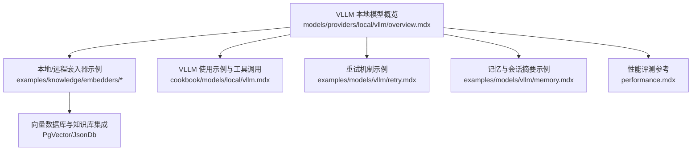
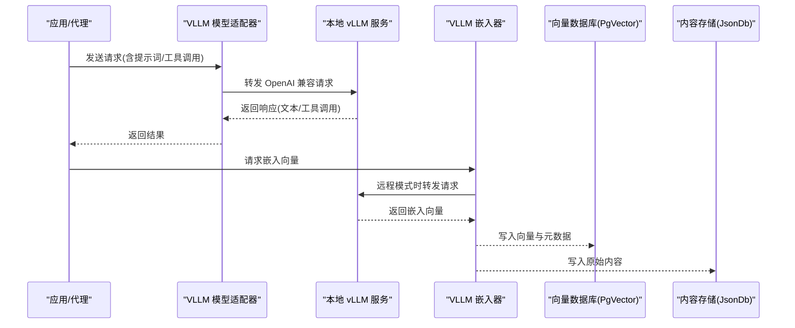
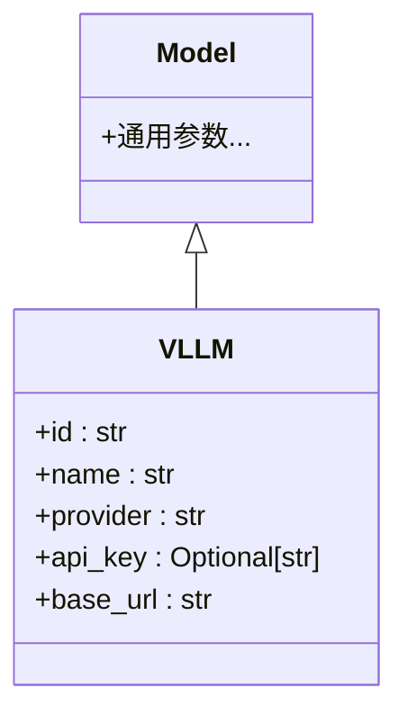
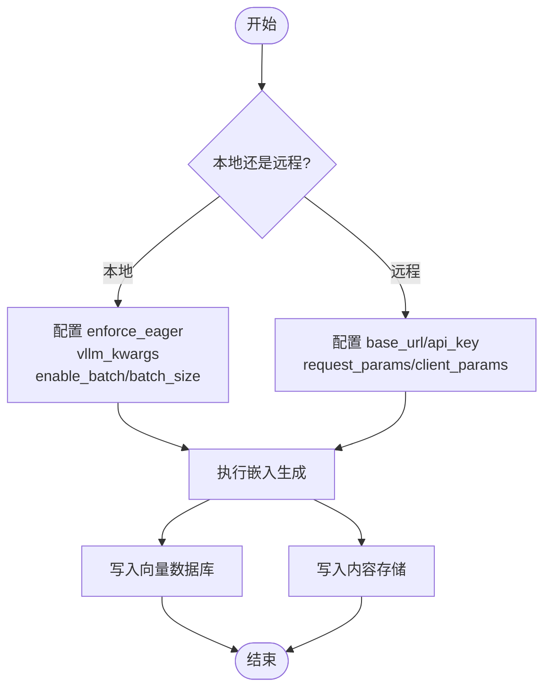
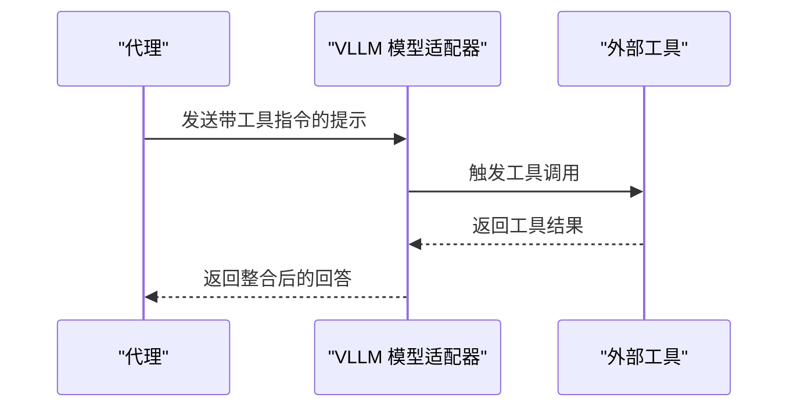
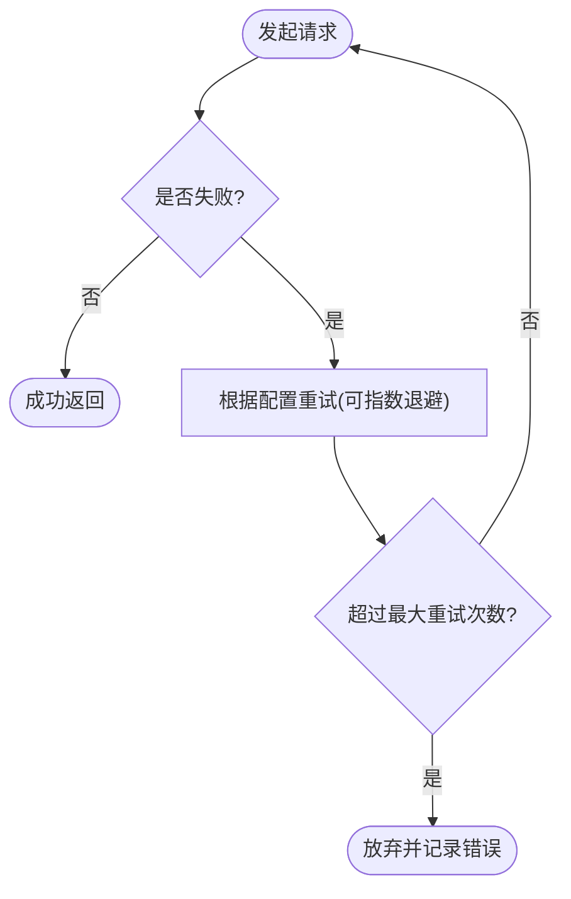
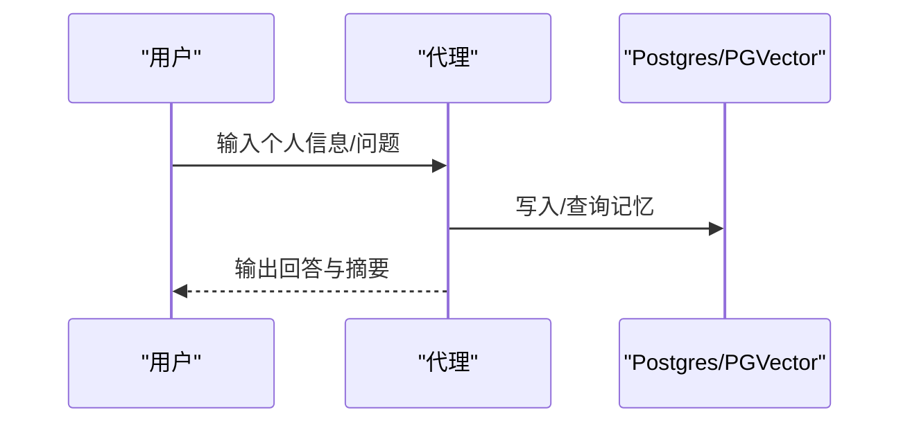
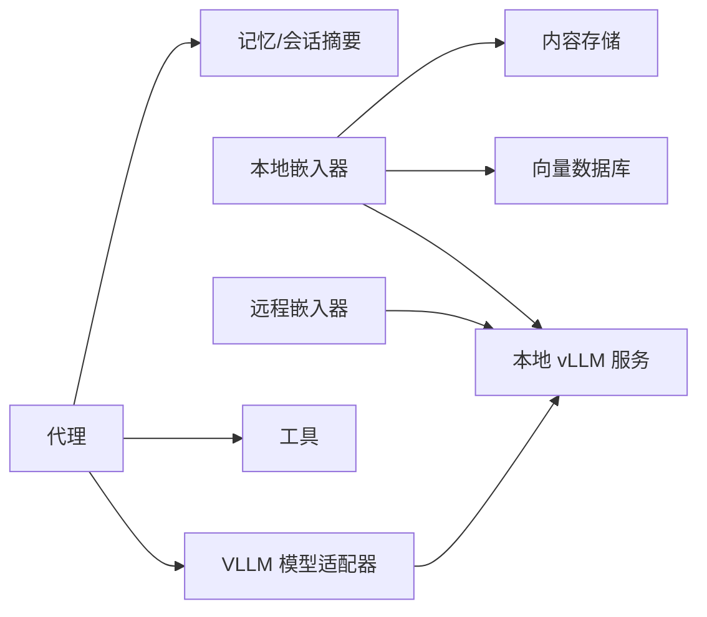

# VLLM 本地模型

<cite>
**本文引用的文件**
- [models/providers/local/vllm/overview.mdx](file://models/providers/local/vllm/overview.mdx)
- [cookbook/models/local/vllm.mdx](file://cookbook/models/local/vllm.mdx)
- [TBD/snippets/embedder-vllm-reference.mdx](file://TBD/snippets/embedder-vllm-reference.mdx)
- [examples/knowledge/embedders/vllm-embedder-local.mdx](file://examples/knowledge/embedders/vllm-embedder-local.mdx)
- [examples/knowledge/embedders/vllm-embedder-remote.mdx](file://examples/knowledge/embedders/vllm-embedder-remote.mdx)
- [examples/models/vllm/retry.mdx](file://examples/models/vllm/retry.mdx)
- [examples/models/vllm/memory.mdx](file://examples/models/vllm/memory.mdx)
- [performance.mdx](file://performance.mdx)
</cite>

## 目录
1. [简介](#简介)
2. [项目结构](#项目结构)
3. [核心组件](#核心组件)
4. [架构总览](#架构总览)
5. [详细组件分析](#详细组件分析)
6. [依赖关系分析](#依赖关系分析)
7. [性能考量](#性能考量)
8. [故障排查指南](#故障排查指南)
9. [结论](#结论)
10. [附录](#附录)

## 简介
本文件面向在本地部署与使用 VLLM 推理引擎的用户，系统性阐述其高性能本地推理能力、安装与配置要点（含 CUDA 支持与硬件建议）、模型加载与优化机制、参数配置指南（批量大小、序列长度、GPU 内存优化等），以及在代码生成、数据库集成、内存管理与重试机制方面的特性与最佳实践。同时提供可复现实战示例路径与性能评测参考，帮助用户充分发挥 VLLM 的高吞吐与低延迟优势。

## 项目结构
围绕 VLLM 的文档与示例主要分布在以下位置：
- 提供商概览与参数：models/providers/local/vllm/overview.mdx
- 使用示例与工具调用：cookbook/models/local/vllm.mdx
- 向量嵌入器参数参考：TBD/snippets/embedder-vllm-reference.mdx
- 本地与远程嵌入器示例：examples/knowledge/embedders/vllm-embedder-local.mdx、examples/knowledge/embedders/vllm-embedder-remote.mdx
- 重试机制示例：examples/models/vllm/retry.mdx
- 记忆与会话摘要示例：examples/models/vllm/memory.mdx
- 性能评测参考：performance.mdx

**图表来源**
- [models/providers/local/vllm/overview.mdx:1-87](file://models/providers/local/vllm/overview.mdx#L1-L87)
- [cookbook/models/local/vllm.mdx:1-68](file://cookbook/models/local/vllm.mdx#L1-L68)
- [examples/knowledge/embedders/vllm-embedder-local.mdx:1-110](file://examples/knowledge/embedders/vllm-embedder-local.mdx#L1-L110)
- [examples/knowledge/embedders/vllm-embedder-remote.mdx:1-122](file://examples/knowledge/embedders/vllm-embedder-remote.mdx#L1-L122)
- [examples/models/vllm/retry.mdx:1-50](file://examples/models/vllm/retry.mdx#L1-L50)
- [examples/models/vllm/memory.mdx:1-98](file://examples/models/vllm/memory.mdx#L1-L98)
- [performance.mdx:38-67](file://performance.mdx#L38-L67)

**章节来源**
- [models/providers/local/vllm/overview.mdx:1-87](file://models/providers/local/vllm/overview.mdx#L1-L87)
- [cookbook/models/local/vllm.mdx:1-68](file://cookbook/models/local/vllm.mdx#L1-L68)

## 核心组件
- VLLM 模型适配器：用于以 OpenAI 兼容接口对接本地 vLLM 服务，支持基础参数与扩展参数传递。
- VLLM 嵌入器：支持本地与远程模式，具备批处理、维度控制、执行模式选择与额外引擎参数透传。
- 示例与工具：涵盖基础对话、工具调用、结构化输出、嵌入生成、重试策略与记忆会话管理。

**章节来源**
- [models/providers/local/vllm/overview.mdx:76-87](file://models/providers/local/vllm/overview.mdx#L76-L87)
- [TBD/snippets/embedder-vllm-reference.mdx:1-13](file://TBD/snippets/embedder-vllm-reference.mdx#L1-L13)
- [cookbook/models/local/vllm.mdx:1-68](file://cookbook/models/local/vllm.mdx#L1-L68)

## 架构总览
下图展示了从应用到本地 vLLM 服务的整体交互流程，以及嵌入器在知识库中的角色。

**图表来源**
- [models/providers/local/vllm/overview.mdx:25-27](file://models/providers/local/vllm/overview.mdx#L25-L27)
- [examples/knowledge/embedders/vllm-embedder-local.mdx:24-52](file://examples/knowledge/embedders/vllm-embedder-local.mdx#L24-L52)
- [examples/knowledge/embedders/vllm-embedder-remote.mdx:24-49](file://examples/knowledge/embedders/vllm-embedder-remote.mdx#L24-L49)

## 详细组件分析

### 组件一：VLLM 模型适配器
- 角色定位：封装对本地 vLLM 服务的访问，提供 OpenAI 兼容接口。
- 关键参数
  - id：模型标识（HuggingFace 标识）
  - name/provider：名称与提供方
  - api_key：远程模式下的认证密钥（本地模式通常无需）
  - base_url：本地默认端点
- 与父类关系：继承通用 Model 类，复用其参数体系。

**图表来源**
- [models/providers/local/vllm/overview.mdx:76-87](file://models/providers/local/vllm/overview.mdx#L76-L87)

**章节来源**
- [models/providers/local/vllm/overview.mdx:76-87](file://models/providers/local/vllm/overview.mdx#L76-L87)

### 组件二：VLLM 嵌入器（本地/远程）
- 角色定位：负责将文本转换为向量，支撑 RAG 与知识检索。
- 本地模式
  - enforce_eager：强制惰性/急切执行模式（按需选择）
  - vllm_kwargs：透传给本地引擎的关键字参数（如禁用滑动窗口、最大上下文长度等）
  - enable_batch/batch_size：批处理开关与批次大小
- 远程模式
  - base_url/api_key：远程服务地址与认证
  - request_params/client_params：请求与客户端配置透传
- 集成方式：与向量数据库（如 PgVector）与内容存储（如 JsonDb）配合完成知识入库与检索。

**图表来源**
- [TBD/snippets/embedder-vllm-reference.mdx:1-13](file://TBD/snippets/embedder-vllm-reference.mdx#L1-L13)
- [examples/knowledge/embedders/vllm-embedder-local.mdx:24-52](file://examples/knowledge/embedders/vllm-embedder-local.mdx#L24-L52)
- [examples/knowledge/embedders/vllm-embedder-remote.mdx:24-49](file://examples/knowledge/embedders/vllm-embedder-remote.mdx#L24-L49)

**章节来源**
- [TBD/snippets/embedder-vllm-reference.mdx:1-13](file://TBD/snippets/embedder-vllm-reference.mdx#L1-L13)
- [examples/knowledge/embedders/vllm-embedder-local.mdx:24-52](file://examples/knowledge/embedders/vllm-embedder-local.mdx#L24-L52)
- [examples/knowledge/embedders/vllm-embedder-remote.mdx:24-49](file://examples/knowledge/embedders/vllm-embedder-remote.mdx#L24-L49)

### 组件三：工具调用与结构化输出
- 工具调用：通过启用自动工具选择与解析器，使模型在本地 vLLM 服务上直接进行工具调用。
- 结构化输出：结合 Pydantic 模式定义输出结构，由模型返回符合 Schema 的结果，便于下游处理。

**图表来源**
- [cookbook/models/local/vllm.mdx:20-34](file://cookbook/models/local/vllm.mdx#L20-L34)

**章节来源**
- [cookbook/models/local/vllm.mdx:20-34](file://cookbook/models/local/vllm.mdx#L20-L34)

### 组件四：重试机制
- 场景：当模型标识错误或网络异常导致请求失败时，可通过重试策略提升鲁棒性。
- 参数：重试次数、每次重试间隔、指数退避等。
- 实践：示例中故意使用错误模型 ID 来触发重试流程。

**图表来源**
- [examples/models/vllm/retry.mdx:16-26](file://examples/models/vllm/retry.mdx#L16-L26)

**章节来源**
- [examples/models/vllm/retry.mdx:1-50](file://examples/models/vllm/retry.mdx#L1-L50)

### 组件五：记忆与会话摘要
- 功能：结合数据库（如 Postgres + pgvector）实现个性化记忆与会话总结。
- 流程：运行对话 → 更新记忆 → 生成会话摘要 → 查询历史与摘要。

**图表来源**
- [examples/models/vllm/memory.mdx:36-50](file://examples/models/vllm/memory.mdx#L36-L50)

**章节来源**
- [examples/models/vllm/memory.mdx:1-98](file://examples/models/vllm/memory.mdx#L1-L98)

## 依赖关系分析
- VLLM 模型适配器依赖本地 vLLM 服务提供的 OpenAI 兼容接口。
- 嵌入器可独立于模型适配器工作，既可连接本地服务，也可连接远程服务。
- 知识库构建依赖向量数据库与内容存储，形成“嵌入→入库→检索”的闭环。
- 代理层可组合工具、记忆与会话摘要，形成完整的智能体能力。

**图表来源**
- [models/providers/local/vllm/overview.mdx:25-27](file://models/providers/local/vllm/overview.mdx#L25-L27)
- [examples/knowledge/embedders/vllm-embedder-local.mdx:24-52](file://examples/knowledge/embedders/vllm-embedder-local.mdx#L24-L52)
- [examples/models/vllm/memory.mdx:36-50](file://examples/models/vllm/memory.mdx#L36-L50)

**章节来源**
- [models/providers/local/vllm/overview.mdx:1-87](file://models/providers/local/vllm/overview.mdx#L1-L87)
- [examples/knowledge/embedders/vllm-embedder-local.mdx:1-110](file://examples/knowledge/embedders/vllm-embedder-local.mdx#L1-L110)
- [examples/models/vllm/memory.mdx:1-98](file://examples/models/vllm/memory.mdx#L1-L98)

## 性能考量
- 服务器启动与参数
  - 通过服务命令行参数启用自动工具选择、工具调用解析器、精度与最大上下文长度、GPU 内存利用率等，以平衡吞吐与资源占用。
- 批处理与并发
  - 嵌入器支持批处理模式，合理设置批次大小可提升吞吐；同时注意单次请求的序列长度与并发度。
- 执行模式
  - 本地嵌入器可选择执行模式（如急切/惰性），依据具体场景权衡延迟与资源。
- 性能评测
  - 参考仓库中的性能评测脚本与视频，了解框架级对比与测量方法。

**章节来源**
- [models/providers/local/vllm/overview.mdx:16-23](file://models/providers/local/vllm/overview.mdx#L16-L23)
- [TBD/snippets/embedder-vllm-reference.mdx:7-10](file://TBD/snippets/embedder-vllm-reference.mdx#L7-L10)
- [performance.mdx:38-67](file://performance.mdx#L38-L67)

## 故障排查指南
- 服务器连通性
  - 确认本地 vLLM 服务已启动且监听在默认端口；若使用远程模式，检查 base_url 与 api_key。
- 模型加载与可用性
  - 若出现模型不可用或工具调用失败，检查模型标识、服务日志与工具解析器配置。
- 嵌入器连接
  - 远程模式下若连接失败，检查网络、认证与请求参数；本地模式下检查引擎参数与执行模式。
- 记忆与会话
  - 数据库连接失败或写入异常时，核对连接串、权限与表结构。
- 重试策略
  - 对网络超时、速率限制等可恢复错误启用重试；对无效输入等不可恢复错误应跳过。

**章节来源**
- [models/providers/local/vllm/overview.mdx:25-27](file://models/providers/local/vllm/overview.mdx#L25-L27)
- [examples/knowledge/embedders/vllm-embedder-remote.mdx:68-77](file://examples/knowledge/embedders/vllm-embedder-remote.mdx#L68-L77)
- [examples/models/vllm/retry.mdx:16-26](file://examples/models/vllm/retry.mdx#L16-L26)
- [examples/models/vllm/memory.mdx:34-35](file://examples/models/vllm/memory.mdx#L34-L35)

## 结论
VLLM 通过本地服务化与 OpenAI 兼容接口，为本地推理提供了高吞吐、低延迟与易用性的解决方案。结合嵌入器的本地/远程模式、批处理能力、工具调用与结构化输出、记忆与会话摘要、以及完善的重试机制，可在生产环境中快速搭建稳定可靠的智能体系统。建议根据硬件条件与业务负载，合理配置服务参数与执行模式，并通过性能评测持续优化。

## 附录
- 快速开始与示例路径
  - 本地模型与工具调用示例：[cookbook/models/local/vllm.mdx:1-68](file://cookbook/models/local/vllm.mdx#L1-L68)
  - 本地嵌入器示例：[examples/knowledge/embedders/vllm-embedder-local.mdx:1-110](file://examples/knowledge/embedders/vllm-embedder-local.mdx#L1-L110)
  - 远程嵌入器示例：[examples/knowledge/embedders/vllm-embedder-remote.mdx:1-122](file://examples/knowledge/embedders/vllm-embedder-remote.mdx#L1-L122)
  - 重试机制示例：[examples/models/vllm/retry.mdx:1-50](file://examples/models/vllm/retry.mdx#L1-L50)
  - 记忆与会话摘要示例：[examples/models/vllm/memory.mdx:1-98](file://examples/models/vllm/memory.mdx#L1-L98)
  - 服务启动与参数参考：[models/providers/local/vllm/overview.mdx:16-23](file://models/providers/local/vllm/overview.mdx#L16-L23)
  - 嵌入器参数参考：[TBD/snippets/embedder-vllm-reference.mdx:1-13](file://TBD/snippets/embedder-vllm-reference.mdx#L1-L13)
  - 性能评测参考：[performance.mdx:38-67](file://performance.mdx#L38-L67)