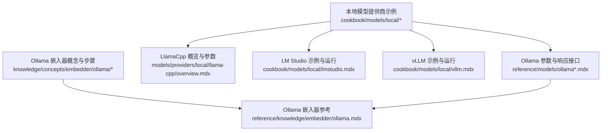
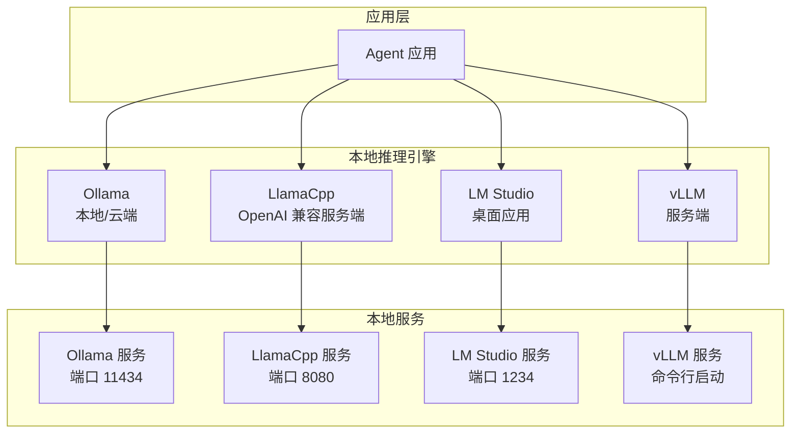
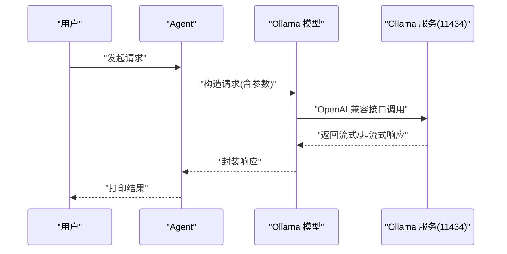
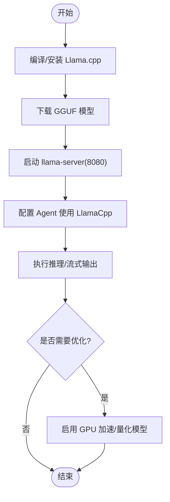
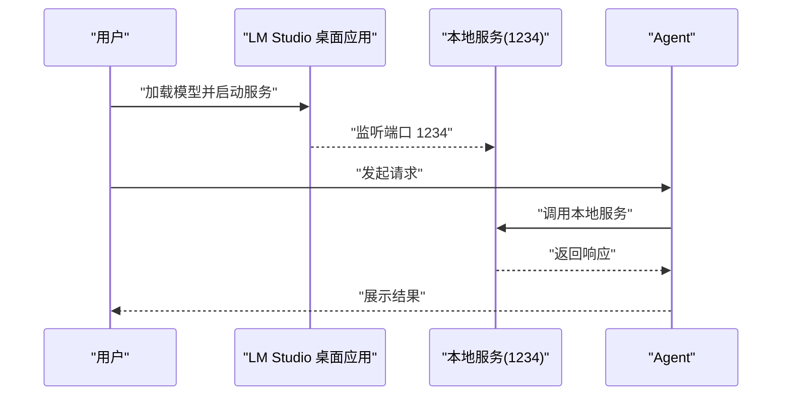
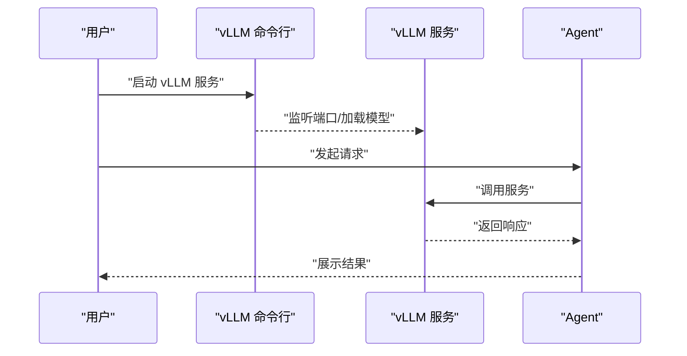
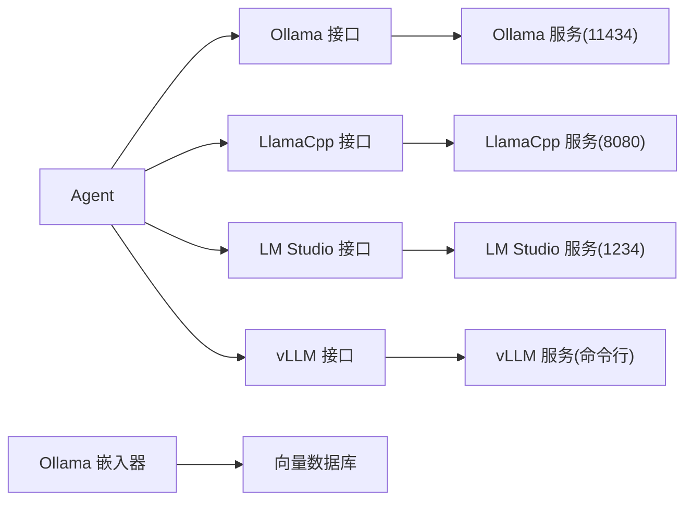

# 本地模型提供商

<cite>
**本文引用的文件**
- [cookbook/models/local/ollama.mdx](file://cookbook/models/local/ollama.mdx)
- [cookbook/models/local/llama-cpp.mdx](file://cookbook/models/local/llama-cpp.mdx)
- [cookbook/models/local/lmstudio.mdx](file://cookbook/models/local/lmstudio.mdx)
- [cookbook/models/local/vllm.mdx](file://cookbook/models/local/vllm.mdx)
- [models/providers/local/llama-cpp/overview.mdx](file://models/providers/local/llama-cpp/overview.mdx)
- [reference/models/ollama.mdx](file://reference/models/ollama.mdx)
- [reference/models/ollama-responses.mdx](file://reference/models/ollama-responses.mdx)
- [knowledge/concepts/embedder/ollama/ollama-embedder.mdx](file://knowledge/concepts/embedder/ollama/ollama-embedder.mdx)
- [reference/knowledge/embedder/ollama.mdx](file://reference/knowledge/embedder/ollama.mdx)
</cite>

## 目录
1. [简介](#简介)
2. [项目结构](#项目结构)
3. [核心组件](#核心组件)
4. [架构总览](#架构总览)
5. [组件详解](#组件详解)
6. [依赖关系分析](#依赖关系分析)
7. [性能与优化](#性能与优化)
8. [故障排除指南](#故障排除指南)
9. [结论](#结论)
10. [附录](#附录)

## 简介
本技术文档面向本地模型提供商的部署、配置与使用，覆盖以下四个本地推理引擎：Ollama、LlamaCpp、LM Studio、vLLM。我们将从隐私保护、离线可用性、成本控制等本地部署优势出发，结合系统要求、依赖项、模型下载与管理、参数配置、性能优化与故障排除，给出可操作的实践路径与参考示例。

## 项目结构
围绕本地模型提供商的相关文档主要分布在以下位置：
- 本地模型使用示例与运行指引：cookbook/models/local 下的各引擎文档
- 引擎能力与参数参考：models/providers/local/*/overview.mdx 与 reference/models/*.mdx
- 嵌入器（向量化）与数据库集成：knowledge/concepts/embedder/*/ 与 reference/knowledge/embedder/*.mdx

**图表来源**
- [cookbook/models/local/ollama.mdx](file://cookbook/models/local/ollama.mdx)
- [cookbook/models/local/llama-cpp.mdx](file://cookbook/models/local/llama-cpp.mdx)
- [cookbook/models/local/lmstudio.mdx](file://cookbook/models/local/lmstudio.mdx)
- [cookbook/models/local/vllm.mdx](file://cookbook/models/local/vllm.mdx)
- [models/providers/local/llama-cpp/overview.mdx](file://models/providers/local/llama-cpp/overview.mdx)
- [reference/models/ollama.mdx](file://reference/models/ollama.mdx)
- [reference/models/ollama-responses.mdx](file://reference/models/ollama-responses.mdx)
- [knowledge/concepts/embedder/ollama/ollama-embedder.mdx](file://knowledge/concepts/embedder/ollama/ollama-embedder.mdx)
- [reference/knowledge/embedder/ollama.mdx](file://reference/knowledge/embedder/ollama.mdx)

**章节来源**
- [cookbook/models/local/ollama.mdx](file://cookbook/models/local/ollama.mdx)
- [cookbook/models/local/llama-cpp.mdx](file://cookbook/models/local/llama-cpp.mdx)
- [cookbook/models/local/lmstudio.mdx](file://cookbook/models/local/lmstudio.mdx)
- [cookbook/models/local/vllm.mdx](file://cookbook/models/local/vllm.mdx)
- [models/providers/local/llama-cpp/overview.mdx](file://models/providers/local/llama-cpp/overview.mdx)
- [reference/models/ollama.mdx](file://reference/models/ollama.mdx)
- [reference/models/ollama-responses.mdx](file://reference/models/ollama-responses.mdx)
- [knowledge/concepts/embedder/ollama/ollama-embedder.mdx](file://knowledge/concepts/embedder/ollama/ollama-embedder.mdx)
- [reference/knowledge/embedder/ollama.mdx](file://reference/knowledge/embedder/ollama.mdx)

## 核心组件
- Ollama：支持本地与云端两种部署形态，参数丰富，适合开发与生产；提供 OpenAI 兼容响应接口与嵌入器。
- LlamaCpp：以 GGUF 模型为核心，强调 CPU 高效推理与 OpenAI 兼容服务端；支持多加速后端与量化模型。
- LM Studio：桌面应用，界面友好，适合开发与测试；默认监听本地端口，支持工具调用与视觉输入。
- vLLM：面向生产的大吞吐量推理引擎；通过命令行启动服务，支持结构化输出与工具调用。

**章节来源**
- [reference/models/ollama.mdx](file://reference/models/ollama.mdx)
- [reference/models/ollama-responses.mdx](file://reference/models/ollama-responses.mdx)
- [models/providers/local/llama-cpp/overview.mdx](file://models/providers/local/llama-cpp/overview.mdx)
- [cookbook/models/local/lmstudio.mdx](file://cookbook/models/local/lmstudio.mdx)
- [cookbook/models/local/vllm.mdx](file://cookbook/models/local/vllm.mdx)

## 架构总览
下图展示了四种本地模型提供商在系统中的角色与交互方式：Agent 通过统一的模型接口对接不同本地推理引擎，引擎再与各自的本地服务或桌面应用通信。

**图表来源**
- [reference/models/ollama.mdx](file://reference/models/ollama.mdx)
- [models/providers/local/llama-cpp/overview.mdx](file://models/providers/local/llama-cpp/overview.mdx)
- [cookbook/models/local/lmstudio.mdx](file://cookbook/models/local/lmstudio.mdx)
- [cookbook/models/local/vllm.mdx](file://cookbook/models/local/vllm.mdx)

## 组件详解

### Ollama
- 部署与使用
  - 支持本地自托管与 Ollama Cloud 云端模式；本地默认端口为 11434，云端通过 API Key 自动切换。
  - 提供 OpenAI 兼容响应接口与嵌入器，便于检索增强生成（RAG）与知识库构建。
- 关键参数
  - 主机地址、超时、格式、采样选项、模板、系统消息、流式输出、重试策略等。
- 示例与运行
  - 包含基础对话、工具调用、视觉输入、结构化输出等示例；提供启动服务与拉取模型的命令行步骤。

**图表来源**
- [reference/models/ollama.mdx](file://reference/models/ollama.mdx)
- [reference/models/ollama-responses.mdx](file://reference/models/ollama-responses.mdx)
- [cookbook/models/local/ollama.mdx](file://cookbook/models/local/ollama.mdx)

**章节来源**
- [reference/models/ollama.mdx](file://reference/models/ollama.mdx)
- [reference/models/ollama-responses.mdx](file://reference/models/ollama-responses.mdx)
- [cookbook/models/local/ollama.mdx](file://cookbook/models/local/ollama.mdx)

### LlamaCpp
- 部署与使用
  - 以 GGUF 模型为核心，通过 llama-server 启动 OpenAI 兼容服务，默认监听 8080 端口。
  - 支持多种硬件加速后端与量化模型，便于在资源受限环境下获得更好性能。
- 关键参数
  - 服务器地址、上下文窗口、采样温度、top-p/top-k 等；继承 OpenAI 兼容参数。
- 示例与运行
  - 包含基础对话、工具调用、结构化输出等示例；提供编译安装、模型下载与服务启动步骤。

**图表来源**
- [models/providers/local/llama-cpp/overview.mdx](file://models/providers/local/llama-cpp/overview.mdx)
- [cookbook/models/local/llama-cpp.mdx](file://cookbook/models/local/llama-cpp.mdx)

**章节来源**
- [models/providers/local/llama-cpp/overview.mdx](file://models/providers/local/llama-cpp/overview.mdx)
- [cookbook/models/local/llama-cpp.mdx](file://cookbook/models/local/llama-cpp.mdx)

### LM Studio
- 部署与使用
  - 桌面应用，图形界面加载模型；默认本地服务端口 1234；适合开发与测试阶段。
  - 支持工具调用、图像输入、结构化输出等典型 Agent 能力。
- 示例与运行
  - 提供基础对话、工具调用、视觉输入、结构化输出示例；包含启动应用与运行示例脚本。

**图表来源**
- [cookbook/models/local/lmstudio.mdx](file://cookbook/models/local/lmstudio.mdx)

**章节来源**
- [cookbook/models/local/lmstudio.mdx](file://cookbook/models/local/lmstudio.mdx)

### vLLM
- 部署与使用
  - 面向生产的大吞吐量推理引擎；通过命令行启动服务，支持结构化输出与工具调用。
  - 适合需要高并发与低延迟的自托管场景。
- 示例与运行
  - 提供基础对话、工具调用、结构化输出示例；包含启动服务与运行示例脚本。

**图表来源**
- [cookbook/models/local/vllm.mdx](file://cookbook/models/local/vllm.mdx)

**章节来源**
- [cookbook/models/local/vllm.mdx](file://cookbook/models/local/vllm.mdx)

## 依赖关系分析
- Agent 与模型接口：Agent 通过统一模型接口对接各本地引擎，屏蔽底层差异。
- 本地服务耦合：Ollama 与 LlamaCpp 分别依赖各自的服务端；LM Studio 依赖桌面应用服务；vLLM 依赖命令行服务。
- 嵌入器与向量库：Ollama 嵌入器可用于知识库构建，配合向量数据库实现检索增强。

**图表来源**
- [reference/models/ollama.mdx](file://reference/models/ollama.mdx)
- [models/providers/local/llama-cpp/overview.mdx](file://models/providers/local/llama-cpp/overview.mdx)
- [cookbook/models/local/lmstudio.mdx](file://cookbook/models/local/lmstudio.mdx)
- [cookbook/models/local/vllm.mdx](file://cookbook/models/local/vllm.mdx)
- [knowledge/concepts/embedder/ollama/ollama-embedder.mdx](file://knowledge/concepts/embedder/ollama/ollama-embedder.mdx)

**章节来源**
- [reference/models/ollama.mdx](file://reference/models/ollama.mdx)
- [models/providers/local/llama-cpp/overview.mdx](file://models/providers/local/llama-cpp/overview.mdx)
- [cookbook/models/local/lmstudio.mdx](file://cookbook/models/local/lmstudio.mdx)
- [cookbook/models/local/vllm.mdx](file://cookbook/models/local/vllm.mdx)
- [knowledge/concepts/embedder/ollama/ollama-embedder.mdx](file://knowledge/concepts/embedder/ollama/ollama-embedder.mdx)

## 性能与优化
- LlamaCpp
  - 硬件加速：NVIDIA CUDA、Apple Metal、OpenCL 等后端可按需启用。
  - 模型量化：根据速度/质量权衡选择 Q4_K_M、Q8_0、Q2_K 等量化版本。
  - 服务端参数：合理设置上下文大小、批处理大小、线程数等。
- vLLM
  - 针对大模型与高吞吐场景进行参数与资源规划，结合命令行启动参数进行调优。
- LM Studio
  - 在桌面端加载合适规模的模型，确保内存与显存充足。
- Ollama
  - 本地/云端双形态下均可通过参数与模型选择实现性能平衡。

**章节来源**
- [models/providers/local/llama-cpp/overview.mdx](file://models/providers/local/llama-cpp/overview.mdx)
- [cookbook/models/local/vllm.mdx](file://cookbook/models/local/vllm.mdx)
- [cookbook/models/local/lmstudio.mdx](file://cookbook/models/local/lmstudio.mdx)
- [reference/models/ollama.mdx](file://reference/models/ollama.mdx)

## 故障排除指南
- LlamaCpp
  - 服务连接问题：确认服务已启动且端口可达；可通过查询模型列表接口验证。
  - 模型加载问题：检查模型文件存在性、格式与版本兼容性；关注内存占用。
  - 性能问题：调整批处理大小、启用硬件加速、选择更合适的量化模型。
- LM Studio
  - 端口冲突：若默认端口被占用，可在应用内调整或更换端口。
  - 模型不兼容：确保所选模型与当前版本兼容，并满足系统资源要求。
- vLLM
  - 服务未启动：确认命令行启动成功，端口未被占用。
  - 模型加载失败：检查模型路径与权限，确保磁盘空间充足。
- Ollama
  - 本地服务不可达：检查端口与防火墙设置；云端模式需正确配置 API Key。
  - 请求超时/重试：根据网络状况与负载调整超时与重试策略。

**章节来源**
- [models/providers/local/llama-cpp/overview.mdx](file://models/providers/local/llama-cpp/overview.mdx)
- [cookbook/models/local/lmstudio.mdx](file://cookbook/models/local/lmstudio.mdx)
- [cookbook/models/local/vllm.mdx](file://cookbook/models/local/vllm.mdx)
- [reference/models/ollama.mdx](file://reference/models/ollama.mdx)

## 结论
- 本地部署的核心价值在于隐私可控、离线可用与成本可控。
- 不同引擎各有侧重：Ollama 易于切换本地/云端；LlamaCpp 强调 CPU 高效与量化；LM Studio 适合开发测试；vLLM 适合生产高吞吐。
- 建议结合业务场景选择引擎，并通过参数与硬件加速实现性能优化；配合嵌入器与向量库构建 RAG 场景。

## 附录
- 安装与运行步骤（示例）
  - Ollama：启动服务、拉取模型、运行示例脚本。
  - LlamaCpp：编译/安装、下载模型、启动服务、运行示例脚本。
  - LM Studio：启动桌面应用、加载模型、运行示例脚本。
  - vLLM：启动服务、运行示例脚本。
- 嵌入器与知识库
  - 使用 Ollama 嵌入器生成向量，配合向量数据库实现检索增强。

**章节来源**
- [cookbook/models/local/ollama.mdx](file://cookbook/models/local/ollama.mdx)
- [cookbook/models/local/llama-cpp.mdx](file://cookbook/models/local/llama-cpp.mdx)
- [cookbook/models/local/lmstudio.mdx](file://cookbook/models/local/lmstudio.mdx)
- [cookbook/models/local/vllm.mdx](file://cookbook/models/local/vllm.mdx)
- [knowledge/concepts/embedder/ollama/ollama-embedder.mdx](file://knowledge/concepts/embedder/ollama/ollama-embedder.mdx)
- [reference/knowledge/embedder/ollama.mdx](file://reference/knowledge/embedder/ollama.mdx)