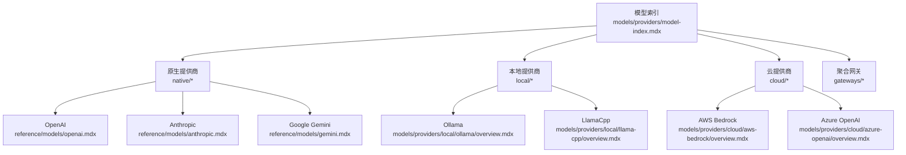
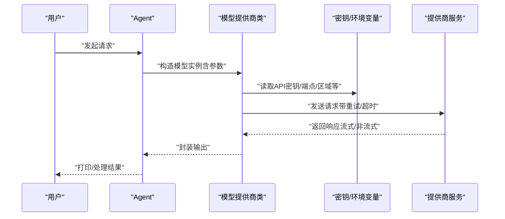
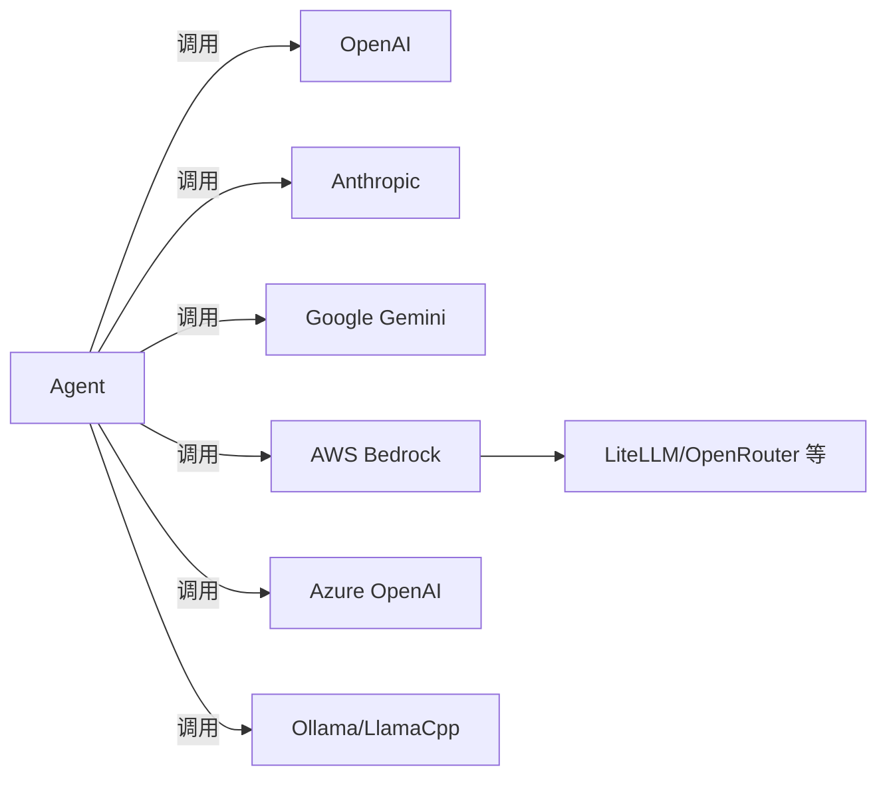

# 模型提供商

<cite>
**本文引用的文件**
- [cookbook/models/overview.mdx](file://cookbook/models/overview.mdx)
- [models/providers/model-index.mdx](file://models/providers/model-index.mdx)
- [models/compatibility.mdx](file://models/compatibility.mdx)
- [reference/models/openai.mdx](file://reference/models/openai.mdx)
- [reference/models/anthropic.mdx](file://reference/models/anthropic.mdx)
- [reference/models/gemini.mdx](file://reference/models/gemini.mdx)
- [reference/models/azure-open-ai.mdx](file://reference/models/azure-open-ai.mdx)
- [reference/models/bedrock.mdx](file://reference/models/bedrock.mdx)
- [reference/models/ollama.mdx](file://reference/models/ollama.mdx)
- [reference/models/ollama-responses.mdx](file://reference/models/ollama-responses.mdx)
- [models/providers/local/ollama/overview.mdx](file://models/providers/local/ollama/overview.mdx)
- [models/providers/local/llama-cpp/overview.mdx](file://models/providers/local/llama-cpp/overview.mdx)
- [models/providers/cloud/aws-bedrock/overview.mdx](file://models/providers/cloud/aws-bedrock/overview.mdx)
- [models/providers/cloud/azure-openai/overview.mdx](file://models/providers/cloud/azure-openai/overview.mdx)
- [_snippets/set-openai-key.mdx](file://_snippets/set-openai-key.mdx)
- [deploy/templates/aws/deploy.mdx](file://deploy/templates/aws/deploy.mdx)
</cite>

## 目录
1. [简介](#简介)
2. [项目结构](#项目结构)
3. [核心组件](#核心组件)
4. [架构总览](#架构总览)
5. [详细组件分析](#详细组件分析)
6. [依赖关系分析](#依赖关系分析)
7. [性能考量](#性能考量)
8. [故障排查指南](#故障排查指南)
9. [结论](#结论)
10. [附录](#附录)

## 简介
本文件面向“模型提供商系统”，围绕 40+ 支持的模型提供商进行系统化技术说明，覆盖三大类别：原生提供商（OpenAI、Anthropic、Google Gemini 等）、本地提供商（Ollama、LlamaCpp 等）与云提供商（AWS Bedrock、Azure OpenAI 等）。文档重点包括：
- 各提供商的特性、优势与适用场景
- 认证方式与密钥管理
- 配置参数与调用示例（以路径代替具体代码）
- 企业级特性与安全注意事项
- 性能优化与成本控制策略

## 项目结构
Agno 将模型提供商抽象为统一接口，通过“同 Agent 接口，换 Provider 即可切换”的设计实现跨提供商一致性体验。模型索引页按类别组织，便于快速定位与选型。

图表来源
- [models/providers/model-index.mdx:1-375](file://models/providers/model-index.mdx#L1-L375)
- [reference/models/openai.mdx:1-53](file://reference/models/openai.mdx#L1-L53)
- [reference/models/anthropic.mdx:1-32](file://reference/models/anthropic.mdx#L1-L32)
- [reference/models/gemini.mdx:1-27](file://reference/models/gemini.mdx#L1-L27)
- [models/providers/local/ollama/overview.mdx:1-153](file://models/providers/local/ollama/overview.mdx#L1-L153)
- [models/providers/local/llama-cpp/overview.mdx:1-198](file://models/providers/local/llama-cpp/overview.mdx#L1-L198)
- [models/providers/cloud/aws-bedrock/overview.mdx:1-155](file://models/providers/cloud/aws-bedrock/overview.mdx#L1-L155)
- [models/providers/cloud/azure-openai/overview.mdx:1-81](file://models/providers/cloud/azure-openai/overview.mdx#L1-L81)

章节来源
- [models/providers/model-index.mdx:1-375](file://models/providers/model-index.mdx#L1-L375)

## 核心组件
- 统一模型抽象：所有提供商均遵循一致的 Agent 接口，仅需替换 Provider 类即可切换模型。
- 参数与能力矩阵：各 Provider 的参数、能力（流式、工具调用、结构化输出等）在参考页中明确列出。
- 示例与速查：cookbook 提供多语言导入与最小可用示例，便于快速上手。

章节来源
- [cookbook/models/overview.mdx:1-107](file://cookbook/models/overview.mdx#L1-L107)
- [models/compatibility.mdx:1-92](file://models/compatibility.mdx#L1-L92)

## 架构总览
下图展示了从 Agent 到不同提供商的调用路径与关键参数位置，帮助理解认证、参数传递与错误重试机制。

图表来源
- [reference/models/openai.mdx:1-53](file://reference/models/openai.mdx#L1-L53)
- [reference/models/azure-open-ai.mdx:1-37](file://reference/models/azure-open-ai.mdx#L1-L37)
- [reference/models/bedrock.mdx:1-31](file://reference/models/bedrock.mdx#L1-L31)
- [reference/models/ollama.mdx:1-19](file://reference/models/ollama.mdx#L1-L19)

## 详细组件分析

### 原生提供商

#### OpenAI
- 特性与优势
  - 支持多模态（文本/音频）、结构化输出、推理模式等
  - 提供丰富的采样与生成参数，便于精细化控制
- 适用场景
  - 需要高精度推理与多模态输入输出的任务
- 认证与密钥管理
  - 通过环境变量或显式参数传入 API Key；支持自定义 base_url、超时与重试
- 参考参数与示例路径
  - 参数表：[参考页:8-53](file://reference/models/openai.mdx#L8-L53)
  - 示例与导入：[示例页:48-48](file://cookbook/models/overview.mdx#L48-L48)

章节来源
- [reference/models/openai.mdx:1-53](file://reference/models/openai.mdx#L1-L53)
- [cookbook/models/overview.mdx:48-48](file://cookbook/models/overview.mdx#L48-L48)

#### Anthropic Claude
- 特性与优势
  - 强推理与思维链能力，支持缓存系统提示词提升性能
- 适用场景
  - 需要深度思考与长上下文推理的任务
- 认证与密钥管理
  - 通过环境变量或显式参数传入 API Key；支持 MCP 服务器配置
- 参考参数与示例路径
  - 参数表：[参考页:8-32](file://reference/models/anthropic.mdx#L8-L32)
  - 示例与导入：[示例页:49-49](file://cookbook/models/overview.mdx#L49-L49)

章节来源
- [reference/models/anthropic.mdx:1-32](file://reference/models/anthropic.mdx#L1-L32)
- [cookbook/models/overview.mdx:49-49](file://cookbook/models/overview.mdx#L49-L49)

#### Google Gemini
- 特性与优势
  - 原生视频/音频/搜索/图像输入与生成能力
- 适用场景
  - 多模态内容创作与检索增强
- 认证与密钥管理
  - 通过环境变量或显式参数传入 API Key；支持安全设置与工具配置
- 参考参数与示例路径
  - 参数表：[参考页:8-27](file://reference/models/gemini.mdx#L8-L27)
  - 示例与导入：[示例页:50-50](file://cookbook/models/overview.mdx#L50-L50)

章节来源
- [reference/models/gemini.mdx:1-27](file://reference/models/gemini.mdx#L1-L27)
- [cookbook/models/overview.mdx:50-50](file://cookbook/models/overview.mdx#L50-L50)

### 本地提供商

#### Ollama
- 特性与优势
  - 支持本地与云端两种部署形态；自动根据 API Key 切换主机；支持 Responses API（无状态）
- 适用场景
  - 隐私敏感、离线或边缘部署
- 认证与密钥管理
  - 云端使用需设置 OLLAMA_API_KEY；本地无需密钥
- 参考参数与示例路径
  - 参数表：[参考页:1-19](file://reference/models/ollama.mdx#L1-L19)
  - Responses API 要求与特性：[参考页:1-20](file://reference/models/ollama-responses.mdx#L1-L20)
  - 使用说明与示例：[本地/云端示例页:25-107](file://models/providers/local/ollama/overview.mdx#L25-L107)

章节来源
- [reference/models/ollama.mdx:1-19](file://reference/models/ollama.mdx#L1-L19)
- [reference/models/ollama-responses.mdx:1-20](file://reference/models/ollama-responses.mdx#L1-L20)
- [models/providers/local/ollama/overview.mdx:1-153](file://models/providers/local/ollama/overview.mdx#L1-L153)

#### LlamaCpp
- 特性与优势
  - 本地高效推理，OpenAI 兼容端点；支持硬件加速与量化模型
- 适用场景
  - 资源受限环境下的本地推理
- 部署与配置要点
  - 启动本地服务后，通过 LlamaCpp 模型类访问；可自定义 base_url、上下文窗口与采样参数
- 参考参数与示例路径
  - 参数表与服务器选项：[本地示例页:115-198](file://models/providers/local/llama-cpp/overview.mdx#L115-L198)

章节来源
- [models/providers/local/llama-cpp/overview.mdx:1-198](file://models/providers/local/llama-cpp/overview.mdx#L1-L198)

### 云提供商

#### AWS Bedrock
- 特性与优势
  - 多厂商基础模型聚合；支持多种认证方式（Access Key、SSO、Boto3 Session）
- 适用场景
  - 企业级大规模推理与合规要求较高的任务
- 认证与密钥管理
  - 支持 Access Key/Secret Key、SSO 与 Boto3 Session；优先级顺序明确
- 参考参数与示例路径
  - 认证与示例：[云提供商页:24-109](file://models/providers/cloud/aws-bedrock/overview.mdx#L24-L109)
  - 参数表：[参考页:8-31](file://reference/models/bedrock.mdx#L8-L31)

章节来源
- [models/providers/cloud/aws-bedrock/overview.mdx:1-155](file://models/providers/cloud/aws-bedrock/overview.mdx#L1-L155)
- [reference/models/bedrock.mdx:1-31](file://reference/models/bedrock.mdx#L1-L31)

#### Azure OpenAI
- 特性与优势
  - 在 Azure 基础设施上运行 OpenAI 模型；内置提示缓存能力
- 适用场景
  - 需要 Azure 生态集成与企业级 SLA 的任务
- 认证与密钥管理
  - 通过环境变量或显式参数传入 API Key 与 Endpoint；支持 Azure AD Token
- 参考参数与示例路径
  - 认证与示例：[云提供商页:11-51](file://models/providers/cloud/azure-openai/overview.mdx#L11-L51)
  - 参数表：[参考页:8-37](file://reference/models/azure-open-ai.mdx#L8-L37)

章节来源
- [models/providers/cloud/azure-openai/overview.mdx:1-81](file://models/providers/cloud/azure-openai/overview.mdx#L1-L81)
- [reference/models/azure-open-ai.mdx:1-37](file://reference/models/azure-open-ai.mdx#L1-L37)

### 通用配置与最佳实践

#### 认证与密钥管理
- OpenAI：设置 OPENAI_API_KEY 环境变量
  - 示例路径：[_snippets/set-openai-key.mdx:1-16](file://_snippets/set-openai-key.mdx#L1-L16)
- Azure OpenAI：设置 AZURE_OPENAI_API_KEY 与 AZURE_OPENAI_ENDPOINT
  - 示例路径：[Azure OpenAI 页:13-31](file://models/providers/cloud/azure-openai/overview.mdx#L13-L31)
- AWS Bedrock：设置 AWS_ACCESS_KEY_ID、AWS_SECRET_ACCESS_KEY、AWS_REGION 或使用 SSO/Session
  - 示例路径：[AWS Bedrock 页:26-109](file://models/providers/cloud/aws-bedrock/overview.mdx#L26-L109)
- Ollama：设置 OLLAMA_API_KEY（云端）或本地免密钥
  - 示例路径：[Ollama 页:25-41](file://models/providers/local/ollama/overview.mdx#L25-L41)

章节来源
- [_snippets/set-openai-key.mdx:1-16](file://_snippets/set-openai-key.mdx#L1-L16)
- [models/providers/cloud/azure-openai/overview.mdx:11-31](file://models/providers/cloud/azure-openai/overview.mdx#L11-L31)
- [models/providers/cloud/aws-bedrock/overview.mdx:24-109](file://models/providers/cloud/aws-bedrock/overview.mdx#L24-L109)
- [models/providers/local/ollama/overview.mdx:25-41](file://models/providers/local/ollama/overview.mdx#L25-L41)

#### 错误重试与超时
- 所有 Provider 均支持 retries、delay_between_retries、exponential_backoff 等重试参数
- 参考路径：
  - [OpenAI 参数:50-53](file://reference/models/openai.mdx#L50-L53)
  - [Azure OpenAI 参数:35-37](file://reference/models/azure-open-ai.mdx#L35-L37)
  - [AWS Bedrock 参数:28-31](file://reference/models/bedrock.mdx#L28-L31)
  - [Ollama 参数:1-19](file://reference/models/ollama.mdx#L1-L19)

章节来源
- [reference/models/openai.mdx:50-53](file://reference/models/openai.mdx#L50-L53)
- [reference/models/azure-open-ai.mdx:35-37](file://reference/models/azure-open-ai.mdx#L35-L37)
- [reference/models/bedrock.mdx:28-31](file://reference/models/bedrock.mdx#L28-L31)
- [reference/models/ollama.mdx:1-19](file://reference/models/ollama.mdx#L1-L19)

#### 企业级特性与安全
- 数据主权与隐私：本地与私有云部署确保数据不出站
- 访问控制与审计：结合平台 RBAC 与日志保留策略
- 成本控制：按需选择模型与并发，启用压缩与缓存减少 token 消耗
- 参考路径：
  - [AWS 模板与成本估算:33-44](file://deploy/templates/aws/deploy.mdx#L33-L44)

章节来源
- [deploy/templates/aws/deploy.mdx:1-218](file://deploy/templates/aws/deploy.mdx#L1-L218)

## 依赖关系分析
- Provider 与 Agent 的耦合度低：通过统一接口解耦，便于替换与扩展
- 参数与能力矩阵：兼容性页列出各 Provider 的多模态与工具调用支持情况
- 聚合网关：LiteLLM、OpenRouter 等提供统一入口，简化多 Provider 管理

图表来源
- [models/providers/model-index.mdx:1-375](file://models/providers/model-index.mdx#L1-L375)
- [models/compatibility.mdx:39-88](file://models/compatibility.mdx#L39-L88)

章节来源
- [models/providers/model-index.mdx:1-375](file://models/providers/model-index.mdx#L1-L375)
- [models/compatibility.mdx:1-92](file://models/compatibility.mdx#L1-L92)

## 性能考量
- 本地推理
  - LlamaCpp：启用硬件加速（CUDA/Metal/OpenCL）、选择合适量化级别（Q4/Q8），调整上下文与批大小
  - Ollama：合理设置 keep_alive、stream 与格式化参数
- 云推理
  - AWS Bedrock/Azure OpenAI：根据模型能力选择合适温度与采样参数；利用缓存与提示复用降低延迟
- 通用建议
  - 启用流式输出以改善用户体验
  - 对高频请求配置指数退避与最大重试次数
  - 结合压缩与分块策略减少上下文长度

## 故障排查指南
- 连接问题
  - LlamaCpp：确认服务端口可达、模型已加载
    - 参考路径：[LlamaCpp 故障排查:177-198](file://models/providers/local/llama-cpp/overview.mdx#L177-L198)
  - Ollama：检查 API Key 与主机地址
    - 参考路径：[Ollama 云端认证:25-41](file://models/providers/local/ollama/overview.mdx#L25-L41)
- 权限与认证
  - Azure OpenAI：核对 Endpoint、Key 与 API 版本
    - 参考路径：[Azure OpenAI 认证:11-31](file://models/providers/cloud/azure-openai/overview.mdx#L11-L31)
  - AWS Bedrock：优先使用 Session/SSO，避免硬编码密钥
    - 参考路径：[AWS Bedrock 认证:66-109](file://models/providers/cloud/aws-bedrock/overview.mdx#L66-L109)
- 性能瓶颈
  - 本地：尝试量化模型、GPU 加速与批处理优化
  - 云：选择更高吞吐模型、开启缓存与预热

章节来源
- [models/providers/local/llama-cpp/overview.mdx:177-198](file://models/providers/local/llama-cpp/overview.mdx#L177-L198)
- [models/providers/local/ollama/overview.mdx:25-41](file://models/providers/local/ollama/overview.mdx#L25-L41)
- [models/providers/cloud/azure-openai/overview.mdx:11-31](file://models/providers/cloud/azure-openai/overview.mdx#L11-L31)
- [models/providers/cloud/aws-bedrock/overview.mdx:66-109](file://models/providers/cloud/aws-bedrock/overview.mdx#L66-L109)

## 结论
Agno 的模型提供商体系以统一抽象为核心，覆盖原生、本地与云三大阵营，并提供详尽的参数与示例文档。通过合理的认证与密钥管理、性能优化与成本控制策略，可在不同场景下灵活选择最适合的模型提供商组合，满足从个人开发到企业级生产的多样化需求。

## 附录

### 快速选型指引
- 高精度推理与多模态：OpenAI / Google Gemini
- 长上下文与思维链：Anthropic Claude
- 私有化与离线：Ollama / LlamaCpp
- 企业级与合规：AWS Bedrock / Azure OpenAI
- 多 Provider 统一接入：LiteLLM / OpenRouter

章节来源
- [models/providers/model-index.mdx:1-375](file://models/providers/model-index.mdx#L1-L375)
- [cookbook/models/overview.mdx:21-42](file://cookbook/models/overview.mdx#L21-L42)