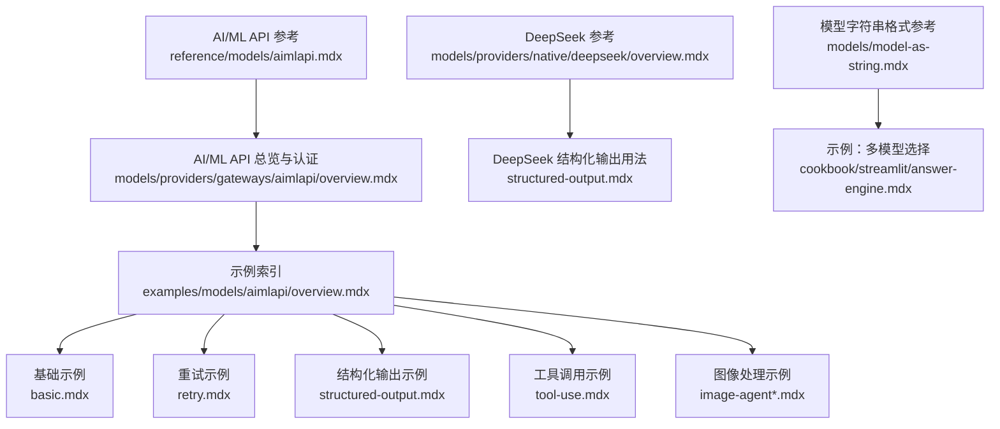
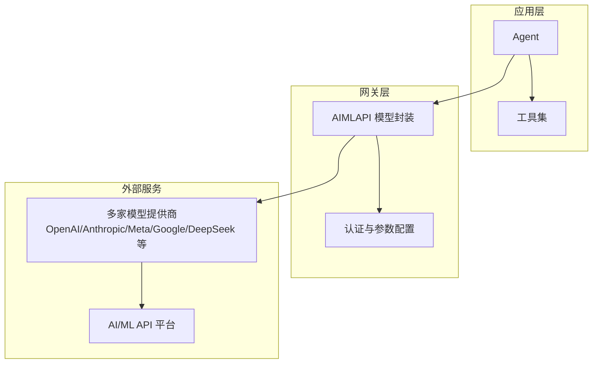
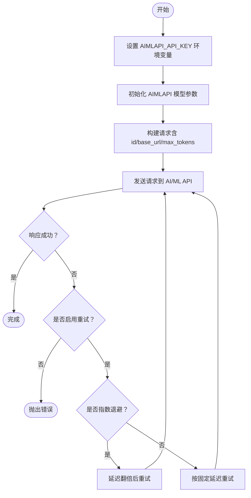
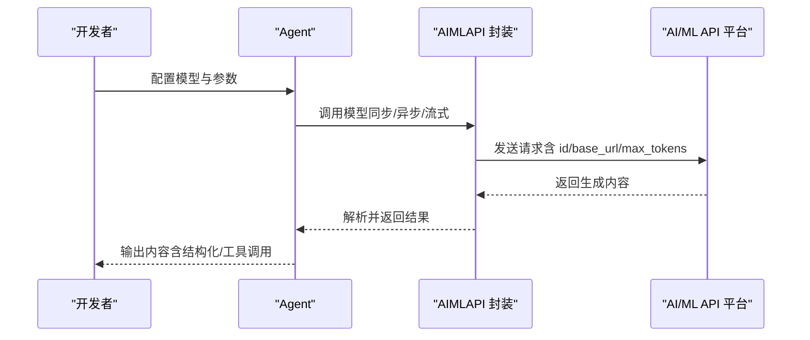
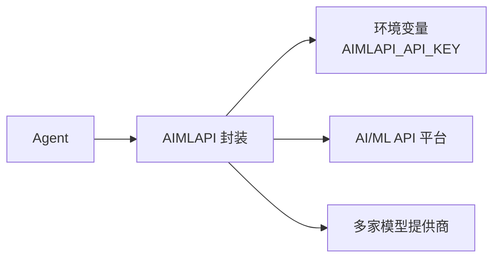

# AI/ML API 网关

<cite>
**本文引用的文件**
- [reference/models/aimlapi.mdx](file://reference/models/aimlapi.mdx)
- [models/providers/gateways/aimlapi/overview.mdx](file://models/providers/gateways/aimlapi/overview.mdx)
- [examples/models/aimlapi/overview.mdx](file://examples/models/aimlapi/overview.mdx)
- [examples/models/aimlapi/basic.mdx](file://examples/models/aimlapi/basic.mdx)
- [examples/models/aimlapi/retry.mdx](file://examples/models/aimlapi/retry.mdx)
- [examples/models/aimlapi/structured-output.mdx](file://examples/models/aimlapi/structured-output.mdx)
- [examples/models/aimlapi/tool-use.mdx](file://examples/models/aimlapi/tool-use.mdx)
- [examples/models/aimlapi/image-agent.mdx](file://examples/models/aimlapi/image-agent.mdx)
- [examples/models/aimlapi/image-agent-bytes.mdx](file://examples/models/aimlapi/image-agent-bytes.mdx)
- [models/providers/native/deepseek/overview.mdx](file://models/providers/native/deepseek/overview.mdx)
- [models/providers/native/deepseek/usage/structured-output.mdx](file://models/providers/native/deepseek/usage/structured-output.mdx)
- [models/model-as-string.mdx](file://models/model-as-string.mdx)
- [cookbook/streamlit/answer-engine.mdx](file://cookbook/streamlit/answer-engine.mdx)
</cite>

## 目录
1. [简介](#简介)
2. [项目结构](#项目结构)
3. [核心组件](#核心组件)
4. [架构总览](#架构总览)
5. [详细组件分析](#详细组件分析)
6. [依赖关系分析](#依赖关系分析)
7. [性能考量](#性能考量)
8. [故障排查指南](#故障排查指南)
9. [结论](#结论)
10. [附录](#附录)

## 简介
本文件面向希望在 Agent 中统一接入并使用 AI/ML API 的开发者，系统性介绍 AI/ML API 网关的能力与用法：统一访问 300+ 模型（包含 DeepSeek、Gemini、ChatGPT 等），提供企业级限流与高可用；支持认证配置（环境变量）、参数配置（模型 ID、名称、提供商、API 密钥、基础 URL、最大令牌数等）、图像处理、重试机制、结构化输出与工具调用等高级能力。文末提供可直接参考的示例路径与最佳实践。

## 项目结构
围绕 AI/ML API 的文档与示例主要分布在以下位置：
- 参考与参数说明：reference/models/aimlapi.mdx
- 使用总览与认证示例：models/providers/gateways/aimlapi/overview.mdx
- 示例索引与多场景示例：examples/models/aimlapi/*
- 其他相关模型与字符串格式参考：models/providers/native/deepseek/*、models/model-as-string.mdx、cookbook/streamlit/answer-engine.mdx

**图表来源**
- [reference/models/aimlapi.mdx:1-27](file://reference/models/aimlapi.mdx#L1-L27)
- [models/providers/gateways/aimlapi/overview.mdx:1-69](file://models/providers/gateways/aimlapi/overview.mdx#L1-L69)
- [examples/models/aimlapi/overview.mdx:1-15](file://examples/models/aimlapi/overview.mdx#L1-L15)
- [examples/models/aimlapi/basic.mdx:1-58](file://examples/models/aimlapi/basic.mdx#L1-L58)
- [examples/models/aimlapi/retry.mdx:1-50](file://examples/models/aimlapi/retry.mdx#L1-L50)
- [examples/models/aimlapi/structured-output.mdx:1-77](file://examples/models/aimlapi/structured-output.mdx#L1-L77)
- [examples/models/aimlapi/tool-use.mdx:1-47](file://examples/models/aimlapi/tool-use.mdx#L1-L47)
- [examples/models/aimlapi/image-agent.mdx:1-56](file://examples/models/aimlapi/image-agent.mdx#L1-L56)
- [examples/models/aimlapi/image-agent-bytes.mdx:1-61](file://examples/models/aimlapi/image-agent-bytes.mdx#L1-L61)
- [models/providers/native/deepseek/overview.mdx:1-54](file://models/providers/native/deepseek/overview.mdx#L1-L54)
- [models/providers/native/deepseek/usage/structured-output.mdx:44-69](file://models/providers/native/deepseek/usage/structured-output.mdx#L44-L69)
- [models/model-as-string.mdx:101-121](file://models/model-as-string.mdx#L101-L121)
- [cookbook/streamlit/answer-engine.mdx:92-106](file://cookbook/streamlit/answer-engine.mdx#L92-L106)

**章节来源**
- [reference/models/aimlapi.mdx:1-27](file://reference/models/aimlapi.mdx#L1-L27)
- [models/providers/gateways/aimlapi/overview.mdx:1-69](file://models/providers/gateways/aimlapi/overview.mdx#L1-L69)
- [examples/models/aimlapi/overview.mdx:1-15](file://examples/models/aimlapi/overview.mdx#L1-L15)

## 核心组件
- AI/ML API 提供商：统一接入 300+ 模型，覆盖 OpenAI、Anthropic、Meta、Google、DeepSeek 等主流提供商；具备企业级限流与高可用。
- 认证与配置：通过环境变量 AIMLAPI_API_KEY 进行认证，默认从 AIMLAPI_API_KEY 读取密钥；支持自定义 base_url、max_tokens、retries、延迟与指数退避等参数。
- 参数与兼容性：继承 OpenAI 兼容接口，支持大多数 OpenAI 参数；同时提供结构化输出、工具调用、图像输入等增强能力。
- 示例与最佳实践：提供基础调用、流式输出、异步执行、重试策略、结构化输出、工具调用、图像处理（URL/字节）等完整示例路径。

**章节来源**
- [reference/models/aimlapi.mdx:6-27](file://reference/models/aimlapi.mdx#L6-L27)
- [models/providers/gateways/aimlapi/overview.mdx:9-69](file://models/providers/gateways/aimlapi/overview.mdx#L9-L69)

## 架构总览
AI/ML API 网关在 Agent 层以统一接口暴露，底层对接多家模型提供商，实现“一次配置、多模型即用”的能力。

**图表来源**
- [models/providers/gateways/aimlapi/overview.mdx:7-69](file://models/providers/gateways/aimlapi/overview.mdx#L7-L69)
- [reference/models/aimlapi.mdx:6-27](file://reference/models/aimlapi.mdx#L6-L27)

## 详细组件分析

### 认证与配置
- 环境变量：设置 AIMLAPI_API_KEY；平台提供注册入口与官方文档链接。
- 基础参数：id（模型标识）、name（模型名称）、provider（提供商）、api_key（默认读取环境变量）、base_url（默认平台 v1 接口）、max_tokens（默认 4096）。
- 重试与退避：retries（重试次数）、delay_between_retries（秒级延迟）、exponential_backoff（指数退避开关）。

**图表来源**
- [models/providers/gateways/aimlapi/overview.mdx:9-23](file://models/providers/gateways/aimlapi/overview.mdx#L9-L23)
- [reference/models/aimlapi.mdx:12-27](file://reference/models/aimlapi.mdx#L12-L27)

**章节来源**
- [models/providers/gateways/aimlapi/overview.mdx:9-23](file://models/providers/gateways/aimlapi/overview.mdx#L9-L23)
- [reference/models/aimlapi.mdx:12-27](file://reference/models/aimlapi.mdx#L12-L27)

### 在 Agent 中使用 AI/ML API
- 基础用法：创建 Agent 并指定 AIMLAPI(id=...)，支持同步/异步与流式输出。
- 图像处理：通过 images 参数传入图片（URL 或字节），适用于具备视觉理解能力的模型。
- 工具调用：结合工具集（如网络搜索）实现检索增强或多轮协作。
- 结构化输出：通过 output_schema 与 use_json_mode 实现 JSON 模式输出，提升结果稳定性与解析效率。

**图表来源**
- [examples/models/aimlapi/basic.mdx:20-44](file://examples/models/aimlapi/basic.mdx#L20-L44)
- [examples/models/aimlapi/tool-use.mdx:18-33](file://examples/models/aimlapi/tool-use.mdx#L18-L33)
- [examples/models/aimlapi/structured-output.mdx:44-54](file://examples/models/aimlapi/structured-output.mdx#L44-L54)
- [examples/models/aimlapi/image-agent.mdx:21-34](file://examples/models/aimlapi/image-agent.mdx#L21-L34)

**章节来源**
- [examples/models/aimlapi/basic.mdx:20-44](file://examples/models/aimlapi/basic.mdx#L20-L44)
- [examples/models/aimlapi/tool-use.mdx:18-33](file://examples/models/aimlapi/tool-use.mdx#L18-L33)
- [examples/models/aimlapi/structured-output.mdx:44-54](file://examples/models/aimlapi/structured-output.mdx#L44-L54)
- [examples/models/aimlapi/image-agent.mdx:21-34](file://examples/models/aimlapi/image-agent.mdx#L21-L34)

### 可用模型与提供商
- OpenAI：gpt-4o、gpt-4o-mini、o1、o1-mini
- Anthropic：claude-3-5-sonnet-20241022、claude-3-5-haiku-20241022
- Meta：meta-llama/Llama-3.2-11B-Vision-Instruct-Turbo、meta-llama/Meta-Llama-3.1-405B-Instruct-Turbo
- Google：gemini-1.5-pro、gemini-1.5-flash
- DeepSeek：deepseek-chat、deepseek-reasoner

注：以上列表来源于 AI/ML API 官方文档与平台提供的模型清单。

**章节来源**
- [models/providers/gateways/aimlapi/overview.mdx:58-69](file://models/providers/gateways/aimlapi/overview.mdx#L58-L69)

### 参数配置详解
- id：目标模型标识符（如 meta-llama/Llama-3.2-11B-Vision-Instruct-Turbo）
- name：模型显示名称（默认 AIMLAPI）
- provider：提供商名称（默认 AIMLAPI）
- api_key：API 密钥（默认从 AIMLAPI_API_KEY 读取）
- base_url：平台 v1 接口地址（默认 https://api.aimlapi.com/v1）
- max_tokens：最大生成长度（默认 4096）
- retries/delay/exponential_backoff：重试策略与退避策略

**章节来源**
- [reference/models/aimlapi.mdx:12-27](file://reference/models/aimlapi.mdx#L12-L27)
- [models/providers/gateways/aimlapi/overview.mdx:45-56](file://models/providers/gateways/aimlapi/overview.mdx#L45-L56)

### 图像处理与多模态
- URL 图片：通过 Image(url=...) 传入远程图片链接，适合具备视觉理解能力的模型。
- 字节图片：通过 Image(content=bytes) 传入本地图片字节，便于离线或私有数据场景。
- 流式输出：配合 stream=True 获取增量输出，改善交互体验。

**章节来源**
- [examples/models/aimlapi/image-agent.mdx:21-34](file://examples/models/aimlapi/image-agent.mdx#L21-L34)
- [examples/models/aimlapi/image-agent-bytes.mdx:23-39](file://examples/models/aimlapi/image-agent-bytes.mdx#L23-L39)

### 重试机制与稳定性
- 当模型 ID 错误或网络波动时，可通过 retries、delay_between_retries 与 exponential_backoff 控制重试行为。
- 指数退避可降低对上游的压力峰值，提高整体成功率。

**章节来源**
- [examples/models/aimlapi/retry.mdx:16-26](file://examples/models/aimlapi/retry.mdx#L16-L26)
- [reference/models/aimlapi.mdx:22-24](file://reference/models/aimlapi.mdx#L22-L24)

### 结构化输出与工具使用
- 结构化输出：通过 output_schema 与 use_json_mode，使模型输出符合 Pydantic 模型，便于后续解析与落地。
- 工具使用：结合 WebSearch 等工具，实现检索增强与多轮对话。

**章节来源**
- [examples/models/aimlapi/structured-output.mdx:25-49](file://examples/models/aimlapi/structured-output.mdx#L25-L49)
- [examples/models/aimlapi/tool-use.mdx:18-22](file://examples/models/aimlapi/tool-use.mdx#L18-L22)

### 与其他模型提供商的对比与迁移
- DeepSeek：同样基于 OpenAI 兼容接口，参数与 AIMLAPI 类似；注意其结构化输出兼容性提示。
- 模型字符串格式：支持 openai:model_id、anthropic:model_id、google:model_id 等统一格式，便于在不同提供商间切换。

**章节来源**
- [models/providers/native/deepseek/overview.mdx:17-54](file://models/providers/native/deepseek/overview.mdx#L17-L54)
- [models/providers/native/deepseek/usage/structured-output.mdx:44-69](file://models/providers/native/deepseek/usage/structured-output.mdx#L44-L69)
- [models/model-as-string.mdx:101-121](file://models/model-as-string.mdx#L101-L121)
- [cookbook/streamlit/answer-engine.mdx:92-106](file://cookbook/streamlit/answer-engine.mdx#L92-L106)

## 依赖关系分析
- 组件耦合：Agent 依赖 AIMLAPI 封装；AIMLAPI 封装依赖外部模型提供商与 AI/ML API 平台。
- 外部依赖：需要正确设置 AIMLAPI_API_KEY；若使用图像或多模态能力，需确保 Image 输入格式正确。
- 兼容性：AIMLAPI 继承 OpenAI 兼容接口，大部分参数可复用；但部分提供商（如 DeepSeek）在结构化输出方面存在差异。

**图表来源**
- [models/providers/gateways/aimlapi/overview.mdx:9-11](file://models/providers/gateways/aimlapi/overview.mdx#L9-L11)
- [reference/models/aimlapi.mdx:19](file://reference/models/aimlapi.mdx#L19)

**章节来源**
- [models/providers/gateways/aimlapi/overview.mdx:9-11](file://models/providers/gateways/aimlapi/overview.mdx#L9-L11)
- [reference/models/aimlapi.mdx:19](file://reference/models/aimlapi.mdx#L19)

## 性能考量
- 合理设置 max_tokens 与并发请求，避免触发平台限流。
- 对于高延迟场景，启用指数退避可平滑重试压力。
- 图像处理建议优先使用字节输入以减少网络抖动影响。
- 结构化输出可降低后处理成本，提升整体吞吐。

## 故障排查指南
- 认证失败：检查 AIMLAPI_API_KEY 是否正确设置；确认密钥未过期。
- 请求超时/不稳定：开启重试与指数退避；适当增加 delay_between_retries。
- 结果格式异常：启用 use_json_mode 并提供 output_schema；必要时切换至兼容性更好的提供商。
- 图像输入无效：确认 Image(url/content) 格式正确；确保图片可访问且尺寸合理。

**章节来源**
- [models/providers/gateways/aimlapi/overview.mdx:9-23](file://models/providers/gateways/aimlapi/overview.mdx#L9-L23)
- [examples/models/aimlapi/retry.mdx:16-26](file://examples/models/aimlapi/retry.mdx#L16-L26)
- [examples/models/aimlapi/structured-output.mdx:44-49](file://examples/models/aimlapi/structured-output.mdx#L44-L49)

## 结论
AI/ML API 网关为统一接入 300+ 模型提供了标准化路径，具备企业级稳定性与易用性。通过环境变量认证、OpenAI 兼容参数、图像处理、重试与结构化输出等能力，开发者可在 Agent 中快速集成并迭代多模型工作负载。建议结合示例路径进行实操，并根据业务场景调整参数与重试策略。

## 附录
- 快速开始示例路径
  - 基础调用与流式输出：[basic.mdx:20-44](file://examples/models/aimlapi/basic.mdx#L20-L44)
  - 重试机制演示：[retry.mdx:16-26](file://examples/models/aimlapi/retry.mdx#L16-L26)
  - 结构化输出示例：[structured-output.mdx:44-54](file://examples/models/aimlapi/structured-output.mdx#L44-L54)
  - 工具调用示例：[tool-use.mdx:18-22](file://examples/models/aimlapi/tool-use.mdx#L18-L22)
  - 图像处理示例（URL）：[image-agent.mdx:21-34](file://examples/models/aimlapi/image-agent.mdx#L21-L34)
  - 图像处理示例（字节）：[image-agent-bytes.mdx:23-39](file://examples/models/aimlapi/image-agent-bytes.mdx#L23-L39)
- 模型字符串格式参考：[model-as-string.mdx:101-121](file://models/model-as-string.mdx#L101-L121)
- 多模型选择示例：[answer-engine.mdx:92-106](file://cookbook/streamlit/answer-engine.mdx#L92-L106)
- DeepSeek 参考与结构化输出用法：[overview.mdx:17-54](file://models/providers/native/deepseek/overview.mdx#L17-L54)、[structured-output.mdx:44-69](file://models/providers/native/deepseek/usage/structured-output.mdx#L44-L69)