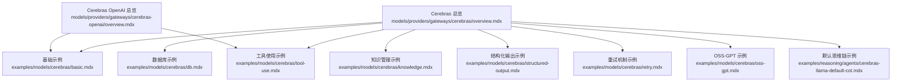
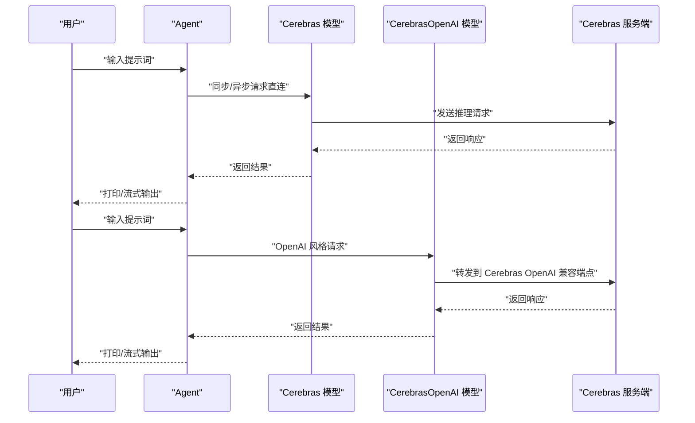
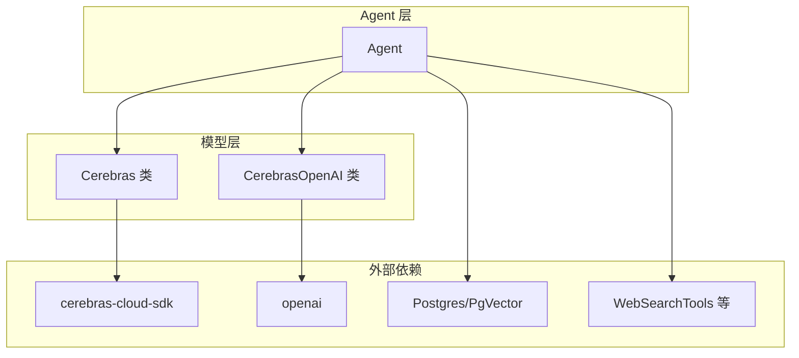

# Cerebras 网关

<cite>
**本文引用的文件**
- [Cerebras 总览](file://models/providers/gateways/cerebras/overview.mdx)
- [Cerebras OpenAI 总览](file://models/providers/gateways/cerebras-openai/overview.mdx)
- [Cerebras 基础示例](file://examples/models/cerebras/basic.mdx)
- [Cerebras 数据库示例](file://examples/models/cerebras/db.mdx)
- [Cerebras 知识管理示例](file://examples/models/cerebras/knowledge.mdx)
- [Cerebras 结构化输出示例](file://examples/models/cerebras/structured-output.mdx)
- [Cerebras 工具使用示例](file://examples/models/cerebras/tool-use.mdx)
- [Cerebras 重试机制示例](file://examples/models/cerebras/retry.mdx)
- [Cerebras OSS-GPT 示例](file://examples/models/cerebras/oss-gpt.mdx)
- [Cerebras 默认思维链示例](file://examples/reasoning/agents/cerebras-llama-default-cot.mdx)
</cite>

## 目录
1. [简介](#简介)
2. [项目结构](#项目结构)
3. [核心组件](#核心组件)
4. [架构总览](#架构总览)
5. [详细组件分析](#详细组件分析)
6. [依赖关系分析](#依赖关系分析)
7. [性能考虑](#性能考虑)
8. [故障排查指南](#故障排查指南)
9. [结论](#结论)
10. [附录](#附录)

## 简介
本文件为 Cerebras 网关的详细使用文档，面向希望在 Agent 中集成高性能推理与 AI 模型的开发者与使用者。Cerebras 提供基于 Wafer-Scale Engines 和 CS-3 系统的高速低延迟推理能力，支持多种 Llama 系列模型，并通过 Agno 的 Cerebras 网关与 OpenAI 兼容接口实现无缝接入。

- 高性能：基于专用硬件加速，提供低延迟推理体验
- 易集成：直接对接 Cerebras Python SDK，支持 OpenAI 兼容接口
- 多场景：支持文本生成、结构化输出、工具调用、知识检索、推理增强等

## 项目结构
围绕 Cerebras 的文档与示例主要分布在以下位置：
- 模型网关总览：models/providers/gateways/cerebras/overview.mdx
- OpenAI 兼容网关：models/providers/gateways/cerebras-openai/overview.mdx
- 示例集合：examples/models/cerebras/*.mdx
- 推理示例：examples/reasoning/agents/cerebras-llama-default-cot.mdx

图表来源
- [Cerebras 总览:1-115](file://models/providers/gateways/cerebras/overview.mdx#L1-L115)
- [Cerebras OpenAI 总览:1-54](file://models/providers/gateways/cerebras-openai/overview.mdx#L1-L54)
- [Cerebras 基础示例:1-58](file://examples/models/cerebras/basic.mdx#L1-L58)
- [Cerebras 数据库示例:1-50](file://examples/models/cerebras/db.mdx#L1-L50)
- [Cerebras 知识管理示例:1-51](file://examples/models/cerebras/knowledge.mdx#L1-L51)
- [Cerebras 结构化输出示例:1-85](file://examples/models/cerebras/structured-output.mdx#L1-L85)
- [Cerebras 工具使用示例:1-60](file://examples/models/cerebras/tool-use.mdx#L1-L60)
- [Cerebras 重试机制示例:1-50](file://examples/models/cerebras/retry.mdx#L1-L50)
- [Cerebras OSS-GPT 示例:1-52](file://examples/models/cerebras/oss-gpt.mdx#L1-L52)
- [Cerebras 默认思维链示例:1-49](file://examples/reasoning/agents/cerebras-llama-default-cot.mdx#L1-L49)

章节来源
- [Cerebras 总览:1-115](file://models/providers/gateways/cerebras/overview.mdx#L1-L115)
- [Cerebras OpenAI 总览:1-54](file://models/providers/gateways/cerebras-openai/overview.mdx#L1-L54)

## 核心组件
- Cerebras 类（直连 Cerebras SDK）
  - 支持模型参数、温度、采样策略、结构化输出、客户端配置、超时与重试等
  - 可直接传入已配置的同步/异步客户端实例
- CerebrasOpenAI 类（OpenAI 兼容接口）
  - 以 OpenAI 风格封装 Cerebras 能力，便于与现有 OpenAI 生态工具集成
  - 支持 OpenAI 参数兼容，如 api_key、base_url 等

章节来源
- [Cerebras 总览:55-84](file://models/providers/gateways/cerebras/overview.mdx#L55-L84)
- [Cerebras OpenAI 总览:37-49](file://models/providers/gateways/cerebras-openai/overview.mdx#L37-L49)

## 架构总览
下图展示了 Agent 使用 Cerebras 的典型交互流程，包括直连模式与 OpenAI 兼容模式：

图表来源
- [Cerebras 总览:25-40](file://models/providers/gateways/cerebras/overview.mdx#L25-L40)
- [Cerebras OpenAI 总览:21-35](file://models/providers/gateways/cerebras-openai/overview.mdx#L21-L35)

## 详细组件分析

### 认证与环境变量
- 必需步骤
  - 安装 Cerebras SDK：使用包管理器安装 cerebras-cloud-sdk
  - 设置环境变量：导出 CEREBRAS_API_KEY 为你的密钥
- CerebrasOpenAI
  - 支持通过 api_key 参数或环境变量 CEREBRAS_API_KEY 进行认证
  - 默认 base_url 指向 Cerebras OpenAI 兼容端点

章节来源
- [Cerebras 总览:9-23](file://models/providers/gateways/cerebras/overview.mdx#L9-L23)
- [Cerebras OpenAI 总览:15-29](file://models/providers/gateways/cerebras-openai/overview.mdx#L15-L29)

### 基础使用（Agent 配置与调用）
- 直连 Cerebras
  - 创建 Agent 并指定 model=Cerebras(id="...")，可启用 markdown 输出
  - 支持同步、异步与流式输出
- OpenAI 兼容
  - 使用 CerebrasOpenAI 作为 model，保持 OpenAI 风格的调用方式

章节来源
- [Cerebras 总览:25-40](file://models/providers/gateways/cerebras/overview.mdx#L25-L40)
- [Cerebras OpenAI 总览:21-35](file://models/providers/gateways/cerebras-openai/overview.mdx#L21-L35)
- [Cerebras 基础示例:22-43](file://examples/models/cerebras/basic.mdx#L22-L43)

### 数据库集成
- 在 Agent 中注入数据库连接（如 Postgres），并结合工具（如网络搜索）进行上下文增强
- 适用于需要访问结构化数据与外部信息的场景

章节来源
- [Cerebras 数据库示例:17-28](file://examples/models/cerebras/db.mdx#L17-L28)

### 知识管理
- 通过 Knowledge 与向量数据库（如 PgVector）构建检索增强生成（RAG）
- 将 PDF 等内容插入知识库后，Agent 可基于知识回答问题

章节来源
- [Cerebras 知识管理示例:17-26](file://examples/models/cerebras/knowledge.mdx#L17-L26)

### 结构化输出
- 通过 Pydantic 模型定义输出结构，Agent 返回符合 schema 的 JSON
- 支持严格模式（strict_output=True）与指导模式（strict_output=False）

章节来源
- [Cerebras 结构化输出示例:25-63](file://examples/models/cerebras/structured-output.mdx#L25-L63)
- [Cerebras 总览:86-105](file://models/providers/gateways/cerebras/overview.mdx#L86-L105)

### 工具使用
- 为 Agent 注入工具（如 WebSearchTools），实现检索增强与多轮对话
- 同时支持同步、异步与流式工具调用

章节来源
- [Cerebras 工具使用示例:23-45](file://examples/models/cerebras/tool-use.mdx#L23-L45)

### 推理增强（思维链）
- 通过开启 reasoning 与调试模式，观察 Agent 的推理过程
- 适合复杂任务分解与逐步思考

章节来源
- [Cerebras 默认思维链示例:19-34](file://examples/reasoning/agents/cerebras-llama-default-cot.mdx#L19-L34)

### 模型选择与参数配置
- 支持的模型列表与知识截止时间可参考总览文档
- 关键参数
  - id：模型标识符
  - temperature/top_p/top_k：控制多样性与随机性
  - repetition_penalty：重复惩罚
  - max_completion_tokens：最大生成长度
  - strict_output：结构化输出开关
  - api_key/base_url：认证与端点
  - timeout/max_retries：超时与重试策略
  - client/async_client：自定义客户端实例

章节来源
- [Cerebras 总览:42-84](file://models/providers/gateways/cerebras/overview.mdx#L42-L84)

### 性能优化建议
- 选择合适模型：根据任务复杂度与延迟要求选择不同参数规模的模型
- 控制采样参数：降低 temperature/top_p 可提升确定性；合理设置 top_k 以平衡多样性
- 合理分页与缓存：对长上下文采用分块与缓存策略
- 流式输出：在支持的场景启用流式输出以改善用户体验
- 超时与重试：为不稳定网络配置合理的超时与指数退避重试

章节来源
- [Cerebras 重试机制示例:16-26](file://examples/models/cerebras/retry.mdx#L16-L26)
- [Cerebras 总览:55-84](file://models/providers/gateways/cerebras/overview.mdx#L55-L84)

### 与其他组件的集成与最佳实践
- 与数据库：在 Agent 中注入数据库连接，结合工具实现检索增强
- 与知识库：使用 Knowledge 与向量数据库构建 RAG，提升问答质量
- 与工具：通过工具扩展 Agent 的能力，如网络搜索、文件解析等
- 与推理：在复杂任务中启用 reasoning，提升逻辑与规划能力

章节来源
- [Cerebras 数据库示例:17-28](file://examples/models/cerebras/db.mdx#L17-L28)
- [Cerebras 知识管理示例:17-26](file://examples/models/cerebras/knowledge.mdx#L17-L26)
- [Cerebras 工具使用示例:23-45](file://examples/models/cerebras/tool-use.mdx#L23-L45)
- [Cerebras 默认思维链示例:19-34](file://examples/reasoning/agents/cerebras-llama-default-cot.mdx#L19-L34)

## 依赖关系分析
- Cerebras 类依赖 Cerebras Python SDK（直连模式）
- CerebrasOpenAI 类依赖 OpenAI SDK（兼容模式）
- 示例脚本演示了与数据库、知识库、工具、推理的组合使用

图表来源
- [Cerebras 总览:13-17](file://models/providers/gateways/cerebras/overview.mdx#L13-L17)
- [Cerebras OpenAI 总览:15-19](file://models/providers/gateways/cerebras-openai/overview.mdx#L15-L19)
- [Cerebras 数据库示例:8-26](file://examples/models/cerebras/db.mdx#L8-L26)
- [Cerebras 知识管理示例:8-25](file://examples/models/cerebras/knowledge.mdx#L8-L25)
- [Cerebras 工具使用示例:15-27](file://examples/models/cerebras/tool-use.mdx#L15-L27)

## 性能考虑
- 模型选择：大参数模型适合复杂推理与生成，小参数模型适合快速响应
- 采样策略：适度降低随机性可减少重复与漂移
- 上下文管理：对长文档采用分块与摘要策略
- 流式输出：在前端支持的情况下优先使用流式输出
- 超时与重试：在网络波动环境下启用指数退避重试

## 故障排查指南
- 认证失败
  - 确认 CEREBRAS_API_KEY 是否正确设置
  - 若使用 CerebrasOpenAI，请确认 api_key 或环境变量是否生效
- 请求超时
  - 调整 timeout 参数，必要时增加重试次数与退避间隔
- 模型不可用
  - 使用错误的模型 ID 会触发重试，检查模型名称与可用性
- 输出格式不符
  - 对于结构化输出，确保输出 schema 正确且 strict_output 配置符合预期

章节来源
- [Cerebras 重试机制示例:16-26](file://examples/models/cerebras/retry.mdx#L16-L26)
- [Cerebras 总览:72-76](file://models/providers/gateways/cerebras/overview.mdx#L72-L76)

## 结论
Cerebras 网关为 Agent 提供了高性能、低延迟的推理能力，并通过直连 SDK 与 OpenAI 兼容接口满足不同集成需求。结合数据库、知识库、工具与推理增强，可在多种场景下实现高质量的智能体应用。建议根据任务特性选择合适的模型与参数，并配合流式输出与重试机制提升稳定性与用户体验。

## 附录
- 安装与认证
  - 安装 cerebras-cloud-sdk
  - 设置 CEREBRAS_API_KEY 环境变量
- 常用参数速查
  - id、temperature、top_p、top_k、repetition_penalty、max_completion_tokens、strict_output、api_key、base_url、timeout、max_retries、client/async_client
- 示例清单
  - 基础文本生成、数据库检索、知识库问答、结构化输出、工具调用、推理增强、重试机制、OSS-GPT

章节来源
- [Cerebras 总览:13-23](file://models/providers/gateways/cerebras/overview.mdx#L13-L23)
- [Cerebras OpenAI 总览:15-29](file://models/providers/gateways/cerebras-openai/overview.mdx#L15-L29)
- [Cerebras 基础示例:22-43](file://examples/models/cerebras/basic.mdx#L22-L43)
- [Cerebras 数据库示例:17-28](file://examples/models/cerebras/db.mdx#L17-L28)
- [Cerebras 知识管理示例:17-26](file://examples/models/cerebras/knowledge.mdx#L17-L26)
- [Cerebras 结构化输出示例:25-63](file://examples/models/cerebras/structured-output.mdx#L25-L63)
- [Cerebras 工具使用示例:23-45](file://examples/models/cerebras/tool-use.mdx#L23-L45)
- [Cerebras 默认思维链示例:19-34](file://examples/reasoning/agents/cerebras-llama-default-cot.mdx#L19-L34)
- [Cerebras 重试机制示例:16-26](file://examples/models/cerebras/retry.mdx#L16-L26)
- [Cerebras OSS-GPT 示例:21-30](file://examples/models/cerebras/oss-gpt.mdx#L21-L30)