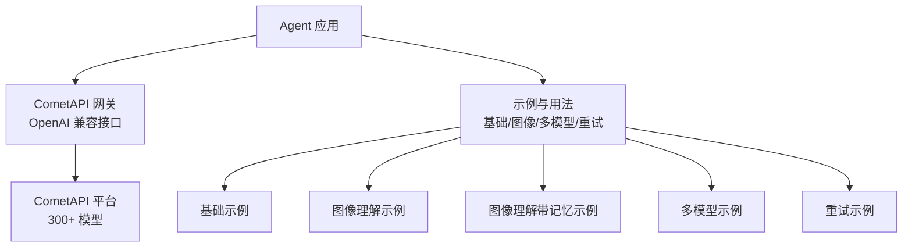
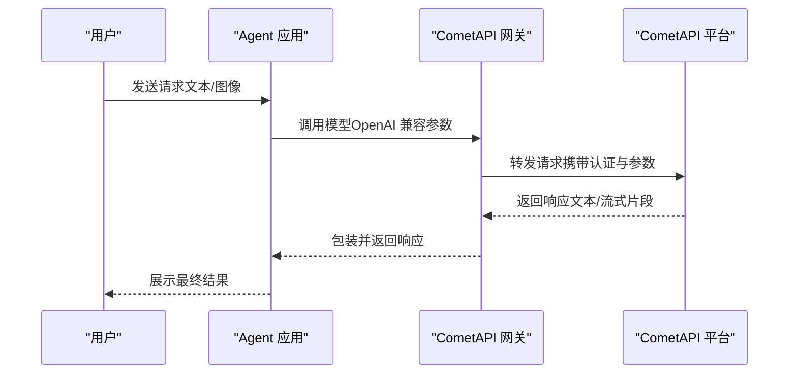
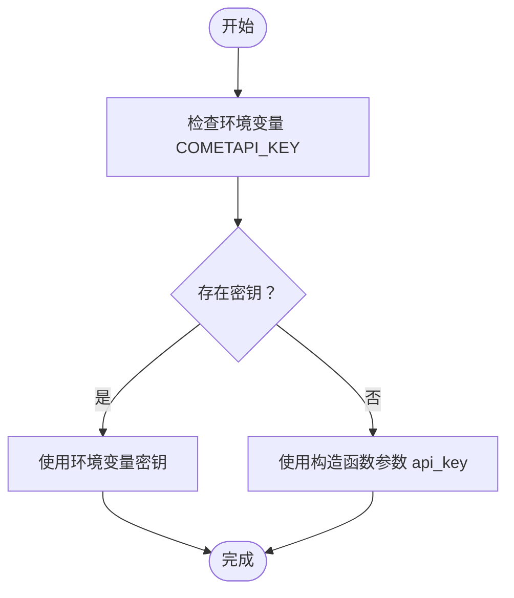
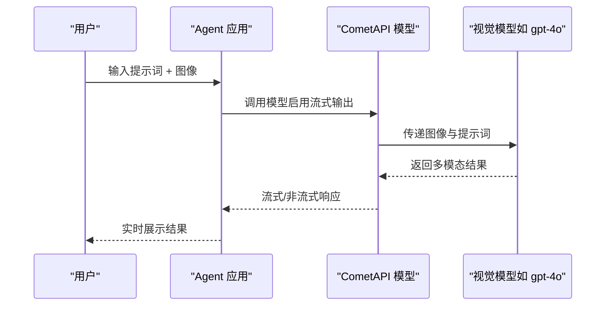
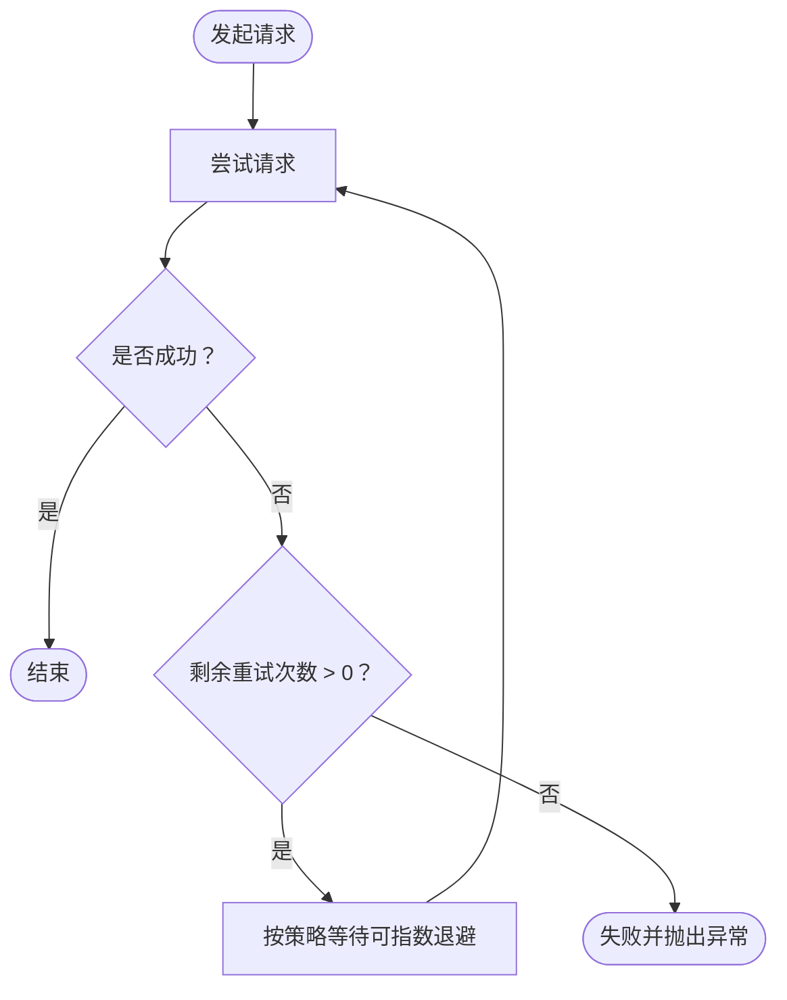
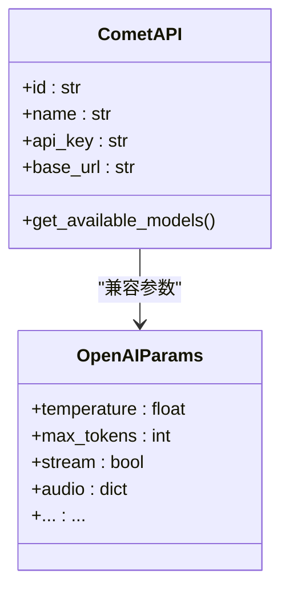

# CometAPI 网关

<cite>
**本文引用的文件**
- [CometAPI 总览](file://models/providers/gateways/cometapi/overview.mdx)
- [CometAPI 基础示例](file://examples/models/cometapi/basic.mdx)
- [CometAPI 图像理解示例](file://examples/models/cometapi/image-agent.mdx)
- [CometAPI 图像理解（带记忆）示例](file://examples/models/cometapi/image-agent-with-memory.mdx)
- [CometAPI 多模型示例](file://examples/models/cometapi/multi-model.mdx)
- [CometAPI 重试示例](file://examples/models/cometapi/retry.mdx)
- [模型总览](file://models/overview.mdx)
- [OpenAI 模型总览](file://models/providers/native/openai/completion/overview.mdx)
</cite>

## 目录
1. [简介](#简介)
2. [项目结构](#项目结构)
3. [核心组件](#核心组件)
4. [架构总览](#架构总览)
5. [详细组件分析](#详细组件分析)
6. [依赖分析](#依赖分析)
7. [性能考虑](#性能考虑)
8. [故障排查指南](#故障排查指南)
9. [结论](#结论)
10. [附录](#附录)

## 简介
CometAPI 是一个为大语言模型提供统一网关的平台，支持 300+ AI 模型，并通过 OpenAI 兼容接口对外提供服务。在 Agent 中，你可以直接以 OpenAI 兼容的方式调用 CometAPI，无需关心底层提供商差异。该网关支持多种使用模式：基础文本生成、流式输出、异步调用、图像理解（视觉模型）、多模型切换、以及可配置的重试机制。

## 项目结构
本仓库中与 CometAPI 网关相关的内容主要分布在以下位置：
- 模型网关总览与参数说明：models/providers/gateways/cometapi/overview.mdx
- 使用示例（基础、图像理解、多模型、重试）：examples/models/cometapi/*.mdx
- 模型通用概念与重试机制：models/overview.mdx
- OpenAI 兼容参数参考：models/providers/native/openai/completion/overview.mdx

**图表来源**
- [CometAPI 总览:1-74](file://models/providers/gateways/cometapi/overview.mdx#L1-L74)
- [CometAPI 基础示例:1-62](file://examples/models/cometapi/basic.mdx#L1-L62)
- [CometAPI 图像理解示例:1-54](file://examples/models/cometapi/image-agent.mdx#L1-L54)
- [CometAPI 图像理解（带记忆）示例:1-63](file://examples/models/cometapi/image-agent-with-memory.mdx#L1-L63)
- [CometAPI 多模型示例:1-81](file://examples/models/cometapi/multi-model.mdx#L1-L81)
- [CometAPI 重试示例:1-49](file://examples/models/cometapi/retry.mdx#L1-L49)

**章节来源**
- [CometAPI 总览:1-74](file://models/providers/gateways/cometapi/overview.mdx#L1-L74)
- [模型总览:1-62](file://models/overview.mdx#L1-L62)

## 核心组件
- 认证与密钥
  - 通过环境变量 COMETAPI_KEY 进行认证，可在不同操作系统上设置。
  - 支持在初始化时显式传入 api_key 参数覆盖默认值。
- 模型选择与参数
  - 默认模型 id 为 gpt-5-mini；可通过 id 指定具体模型。
  - 支持 OpenAI 兼容参数（如温度、最大令牌数、流式输出等），便于迁移与复用。
- 可用模型查询
  - 提供获取可用模型列表的能力，便于动态选择或展示。
- 图像理解能力
  - 通过视觉模型（例如 gpt-4o）实现图像输入与多模态输出。
- 异步与流式输出
  - 支持同步、异步与流式响应，满足不同交互需求。
- 重试机制
  - 支持固定次数、指数退避、重试间隔等配置，提升稳定性。

**章节来源**
- [CometAPI 总览:15-73](file://models/providers/gateways/cometapi/overview.mdx#L15-L73)
- [模型总览:29-44](file://models/overview.mdx#L29-L44)
- [OpenAI 模型总览:63-107](file://models/providers/native/openai/completion/overview.mdx#L63-L107)

## 架构总览
CometAPI 网关在 Agent 与模型平台之间充当“适配层”，将 Agent 的请求转换为 OpenAI 兼容格式并转发至 CometAPI 平台，再将结果返回给 Agent。该设计使得用户可以在不修改业务代码的情况下切换到其他兼容 OpenAI 接口的提供商。

**图表来源**
- [CometAPI 总览:31-50](file://models/providers/gateways/cometapi/overview.mdx#L31-L50)
- [OpenAI 模型总览:34-61](file://models/providers/native/openai/completion/overview.mdx#L34-L61)

## 详细组件分析

### 组件一：认证与密钥配置
- 环境变量 COMETAPI_KEY 用于认证，可在 macOS 与 Windows 上分别设置。
- 初始化时可显式传入 api_key，优先级高于环境变量。
- 建议在生产环境中通过安全的密钥管理方案注入环境变量。

**图表来源**
- [CometAPI 总览:15-30](file://models/providers/gateways/cometapi/overview.mdx#L15-L30)

**章节来源**
- [CometAPI 总览:15-30](file://models/providers/gateways/cometapi/overview.mdx#L15-L30)

### 组件二：基础使用与多模态
- 文本生成：支持同步、异步与流式输出。
- 图像理解：使用具备视觉能力的模型（如 gpt-4o）进行图像描述与问答。
- 多模型测试：可遍历不同模型类别进行对比与选择。

**图表来源**
- [CometAPI 基础示例:32-47](file://examples/models/cometapi/basic.mdx#L32-L47)
- [CometAPI 图像理解示例:18-32](file://examples/models/cometapi/image-agent.mdx#L18-L32)
- [CometAPI 多模型示例:31-58](file://examples/models/cometapi/multi-model.mdx#L31-L58)

**章节来源**
- [CometAPI 基础示例:1-62](file://examples/models/cometapi/basic.mdx#L1-L62)
- [CometAPI 图像理解示例:1-54](file://examples/models/cometapi/image-agent.mdx#L1-L54)
- [CometAPI 图像理解（带记忆）示例:1-63](file://examples/models/cometapi/image-agent-with-memory.mdx#L1-L63)
- [CometAPI 多模型示例:1-81](file://examples/models/cometapi/multi-model.mdx#L1-L81)

### 组件三：重试机制与稳定性
- 支持配置重试次数、重试间隔与指数退避策略。
- 示例演示了通过错误的模型 ID 触发重试，验证机制有效性。

**图表来源**
- [CometAPI 重试示例:16-26](file://examples/models/cometapi/retry.mdx#L16-L26)
- [模型总览:29-44](file://models/overview.mdx#L29-L44)

**章节来源**
- [CometAPI 重试示例:1-49](file://examples/models/cometapi/retry.mdx#L1-L49)
- [模型总览:29-44](file://models/overview.mdx#L29-L44)

### 组件四：OpenAI 兼容参数与迁移
- 支持大多数 OpenAI 参数（如温度、最大令牌数、流式输出、音频等），便于从 OpenAI 平台平滑迁移。
- 参数参考可查阅 OpenAI 官方文档与本仓库的参数表。

**图表来源**
- [CometAPI 总览:52-61](file://models/providers/gateways/cometapi/overview.mdx#L52-L61)
- [OpenAI 模型总览:63-107](file://models/providers/native/openai/completion/overview.mdx#L63-L107)

**章节来源**
- [CometAPI 总览:52-61](file://models/providers/gateways/cometapi/overview.mdx#L52-L61)
- [OpenAI 模型总览:63-107](file://models/providers/native/openai/completion/overview.mdx#L63-L107)

## 依赖分析
- 组件耦合
  - Agent 仅依赖 CometAPI 网关提供的 OpenAI 兼容接口，耦合度低，便于替换。
  - 网关对平台的依赖集中在认证与请求转发，逻辑清晰。
- 外部依赖
  - 需要稳定的网络访问与正确的认证信息。
  - 对于图像理解场景，需确保图像资源可访问且格式受支持。
- 循环依赖
  - 当前结构无循环依赖风险。

**图表来源**
- [CometAPI 总览:31-50](file://models/providers/gateways/cometapi/overview.mdx#L31-L50)

**章节来源**
- [CometAPI 总览:31-50](file://models/providers/gateways/cometapi/overview.mdx#L31-L50)

## 性能考虑
- 选择合适的模型
  - 不同模型在推理速度、成本与质量上存在差异。建议根据任务类型与预算选择最优模型。
- 合理使用流式输出
  - 对于长文本或实时反馈场景，开启流式输出可显著改善用户体验。
- 控制并发与超时
  - 在高并发场景下，合理设置超时与重试策略，避免雪崩效应。
- 缓存与复用
  - 对重复提示词或常用模板可结合缓存策略减少重复调用（参考模型缓存机制）。

[本节为通用指导，无需特定文件来源]

## 故障排查指南
- 认证失败
  - 检查 COMETAPI_KEY 是否正确设置；若使用代理或企业网络，请确认网络可达性。
- 请求超时或不稳定
  - 调整重试次数与间隔，必要时启用指数退避；检查模型负载与平台限流情况。
- 图像理解异常
  - 确认所选模型具备视觉能力；检查图像 URL 可达性与格式是否受支持。
- 多模型切换问题
  - 使用可用模型查询接口核对模型列表；确保模型 ID 正确无误。

**章节来源**
- [CometAPI 总览:15-73](file://models/providers/gateways/cometapi/overview.mdx#L15-L73)
- [CometAPI 重试示例:1-49](file://examples/models/cometapi/retry.mdx#L1-L49)

## 结论
CometAPI 网关通过 OpenAI 兼容接口，为 Agent 提供了统一、灵活且高性能的多模型接入能力。借助完善的认证、参数体系、图像理解与重试机制，开发者可以快速构建从文本生成到多模态理解的各类应用，并在保证稳定性的前提下优化成本与性能。

[本节为总结性内容，无需特定文件来源]

## 附录

### 快速开始步骤
- 设置认证密钥
  - 在系统环境变量中设置 COMETAPI_KEY。
- 创建 Agent 并调用模型
  - 使用 CometAPI 类初始化 Agent，传入所需模型 id 与参数。
- 运行示例
  - 参考基础示例、图像理解示例与多模型示例，逐步体验不同能力。

**章节来源**
- [CometAPI 总览:15-50](file://models/providers/gateways/cometapi/overview.mdx#L15-L50)
- [CometAPI 基础示例:32-47](file://examples/models/cometapi/basic.mdx#L32-L47)
- [CometAPI 图像理解示例:18-32](file://examples/models/cometapi/image-agent.mdx#L18-L32)
- [CometAPI 多模型示例:31-58](file://examples/models/cometapi/multi-model.mdx#L31-L58)