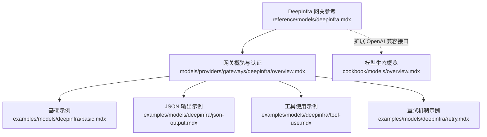
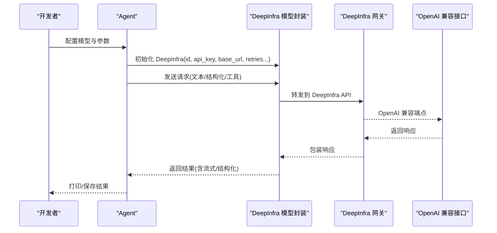
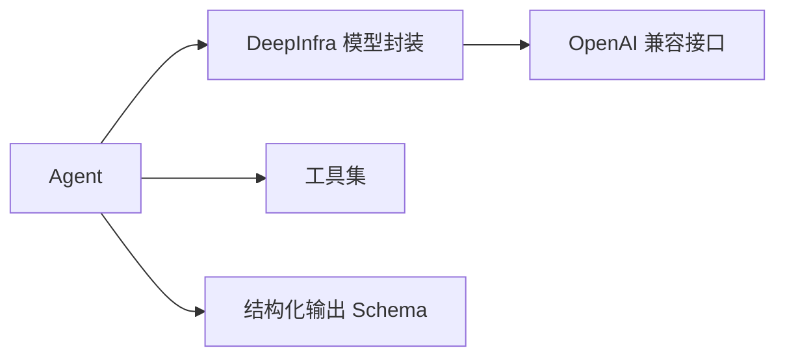

# DeepInfra 网关

<cite>
**本文引用的文件**
- [reference/models/deepinfra.mdx](file://reference/models/deepinfra.mdx)
- [models/providers/gateways/deepinfra/overview.mdx](file://models/providers/gateways/deepinfra/overview.mdx)
- [examples/models/deepinfra/basic.mdx](file://examples/models/deepinfra/basic.mdx)
- [examples/models/deepinfra/json-output.mdx](file://examples/models/deepinfra/json-output.mdx)
- [examples/models/deepinfra/tool-use.mdx](file://examples/models/deepinfra/tool-use.mdx)
- [examples/models/deepinfra/retry.mdx](file://examples/models/deepinfra/retry.mdx)
- [cookbook/models/overview.mdx](file://cookbook/models/overview.mdx)
</cite>

## 目录
1. [简介](#简介)
2. [项目结构](#项目结构)
3. [核心组件](#核心组件)
4. [架构总览](#架构总览)
5. [组件详解](#组件详解)
6. [依赖关系分析](#依赖关系分析)
7. [性能考量](#性能考量)
8. [故障排查指南](#故障排查指南)
9. [结论](#结论)
10. [附录](#附录)

## 简介
本文件面向使用 Agno 框架集成 DeepInfra 开源模型网关的用户，系统性介绍 DeepInfra 作为开源模型聚合平台的特点与优势，提供认证配置、API 密钥设置、基础使用示例（含 Agent 配置）、JSON 结构化输出、工具调用、模型选择与参数配置、性能优化建议，并给出完整可运行的示例路径，帮助快速落地文本生成、结构化输出等典型场景。

## 项目结构
围绕 DeepInfra 的文档与示例主要分布在以下位置：
- 参考与参数说明：reference/models/deepinfra.mdx
- 网关概览与认证：models/providers/gateways/deepinfra/overview.mdx
- 基础示例：examples/models/deepinfra/basic.mdx
- JSON 输出示例：examples/models/deepinfra/json-output.mdx
- 工具使用示例：examples/models/deepinfra/tool-use.mdx
- 重试机制示例：examples/models/deepinfra/retry.mdx
- 模型生态概览：cookbook/models/overview.mdx

图表来源
- [reference/models/deepinfra.mdx:1-22](file://reference/models/deepinfra.mdx#L1-L22)
- [models/providers/gateways/deepinfra/overview.mdx:1-70](file://models/providers/gateways/deepinfra/overview.mdx#L1-L70)
- [examples/models/deepinfra/basic.mdx:1-61](file://examples/models/deepinfra/basic.mdx#L1-L61)
- [examples/models/deepinfra/json-output.mdx:1-77](file://examples/models/deepinfra/json-output.mdx#L1-L77)
- [examples/models/deepinfra/tool-use.mdx:1-46](file://examples/models/deepinfra/tool-use.mdx#L1-L46)
- [examples/models/deepinfra/retry.mdx:1-50](file://examples/models/deepinfra/retry.mdx#L1-L50)
- [cookbook/models/overview.mdx:1-107](file://cookbook/models/overview.mdx#L1-L107)

章节来源
- [reference/models/deepinfra.mdx:1-22](file://reference/models/deepinfra.mdx#L1-L22)
- [models/providers/gateways/deepinfra/overview.mdx:1-70](file://models/providers/gateways/deepinfra/overview.mdx#L1-L70)
- [cookbook/models/overview.mdx:1-107](file://cookbook/models/overview.mdx#L1-L107)

## 核心组件
- DeepInfra 模型封装：提供 id、name、provider、api_key、base_url 等参数；支持 OpenAI 兼容接口；并扩展 retries、delay_between_retries、exponential_backoff 等错误处理参数。
- Agent 集成：通过 Agent(model=DeepInfra(...)) 的方式接入，支持同步/异步、流式/非流式响应。
- 结构化输出：结合 Pydantic 模型与 output_schema，实现 JSON 结构化输出。
- 工具调用：与内置工具（如 WebSearch）组合，实现检索增强或多跳推理。
- 重试策略：通过 retries、delay_between_retries、exponential_backoff 控制失败重试行为。

章节来源
- [reference/models/deepinfra.mdx:8-22](file://reference/models/deepinfra.mdx#L8-L22)
- [models/providers/gateways/deepinfra/overview.mdx:19-70](file://models/providers/gateways/deepinfra/overview.mdx#L19-L70)

## 架构总览
下图展示了从 Agent 到 DeepInfra 网关的整体调用链路，以及关键参数与能力映射。

图表来源
- [models/providers/gateways/deepinfra/overview.mdx:35-57](file://models/providers/gateways/deepinfra/overview.mdx#L35-L57)
- [reference/models/deepinfra.mdx:10-21](file://reference/models/deepinfra.mdx#L10-L21)

## 组件详解

### 认证与密钥配置
- 通过环境变量 DEEPINFRA_API_KEY 注入密钥，支持 macOS 与 Windows 平台设置方式。
- 若未显式传入 api_key，将默认读取该环境变量。

章节来源
- [models/providers/gateways/deepinfra/overview.mdx:19-34](file://models/providers/gateways/deepinfra/overview.mdx#L19-L34)

### 参数与兼容性
- 关键参数
  - id：目标 DeepInfra 模型标识
  - name/provider：模型名称与提供商标识
  - api_key：API 密钥（默认从环境变量读取）
  - base_url：DeepInfra OpenAI 兼容端点
  - retries/delay/exponential_backoff：重试策略
- 兼容性：DeepInfra 扩展 OpenAI 兼容接口，支持大多数 OpenAI 参数。

章节来源
- [reference/models/deepinfra.mdx:10-21](file://reference/models/deepinfra.mdx#L10-L21)
- [models/providers/gateways/deepinfra/overview.mdx:59-69](file://models/providers/gateways/deepinfra/overview.mdx#L59-L69)

### 基础使用（文本生成）
- 支持同步、异步、流式与非流式输出。
- 示例路径：examples/models/deepinfra/basic.mdx

章节来源
- [examples/models/deepinfra/basic.mdx:1-61](file://examples/models/deepinfra/basic.mdx#L1-L61)

### JSON 结构化输出
- 使用 Pydantic 模型定义 schema，配合 output_schema 实现结构化输出。
- 示例路径：examples/models/deepinfra/json-output.mdx

章节来源
- [examples/models/deepinfra/json-output.mdx:1-77](file://examples/models/deepinfra/json-output.mdx#L1-L77)

### 工具使用（检索增强/多跳推理）
- 将工具（如 WebSearch）注入 Agent，实现带工具的对话与推理。
- 示例路径：examples/models/deepinfra/tool-use.mdx

章节来源
- [examples/models/deepinfra/tool-use.mdx:1-46](file://examples/models/deepinfra/tool-use.mdx#L1-L46)

### 重试机制（稳定性保障）
- 当模型 ID 错误或网络异常时，可通过 retries、delay_between_retries、exponential_backoff 提升成功率。
- 示例路径：examples/models/deepinfra/retry.mdx

章节来源
- [examples/models/deepinfra/retry.mdx:1-50](file://examples/models/deepinfra/retry.mdx#L1-L50)

### 模型选择与推荐
- 推荐模型类型
  - 推理类：deepseek-ai/DeepSeek-R1-Distill-Llama-70B
  - 基础任务：meta-llama/Llama-2-70b-chat-hf
  - 多步任务：meta-llama/Llama-3.3-70B-Instruct
- 注意：DeepInfra 存在速率限制，请参考官方文档。

章节来源
- [models/providers/gateways/deepinfra/overview.mdx:11-17](file://models/providers/gateways/deepinfra/overview.mdx#L11-L17)

### 与其他模型的区别与定位
- DeepInfra 属于“开源模型”类别，可通过多种渠道（Groq、Together、Fireworks 等）聚合开源模型，适合需要灵活切换与成本控制的场景。
- 在模型生态概览中，Open Source 分类明确包含 Llama、Mistral、DeepSeek 等通过不同供应商提供的开源模型。

章节来源
- [cookbook/models/overview.mdx:33-42](file://cookbook/models/overview.mdx#L33-L42)
- [cookbook/models/overview.mdx:54-55](file://cookbook/models/overview.mdx#L54-L55)

## 依赖关系分析
- DeepInfra 模型封装依赖 OpenAI 兼容接口，以统一请求/响应格式。
- Agent 通过统一的模型抽象对接 DeepInfra，便于在不同提供商间切换。
- 工具与结构化输出通过 Agent 的扩展能力实现，不改变模型层接口。

图表来源
- [reference/models/deepinfra.mdx:21](file://reference/models/deepinfra.mdx#L21)
- [examples/models/deepinfra/tool-use.mdx:8-21](file://examples/models/deepinfra/tool-use.mdx#L8-L21)
- [examples/models/deepinfra/json-output.mdx:15-49](file://examples/models/deepinfra/json-output.mdx#L15-L49)

## 性能考量
- 选择合适模型：根据任务复杂度选择推理型或多步任务模型，平衡效果与成本。
- 合理使用流式输出：在长文本生成场景中启用流式，提升交互体验。
- 结构化输出：通过 schema 约束减少后处理开销，提高下游解析效率。
- 重试策略：适度增加 retries 并开启指数退避，降低瞬时波动对成功率的影响。
- 速率限制：关注 DeepInfra 官方速率限制，必要时进行限流或排队。

## 故障排查指南
- 认证失败
  - 确认 DEEPINFRA_API_KEY 是否正确设置且未过期。
  - 参考：models/providers/gateways/deepinfra/overview.mdx
- 模型不可用/ID 错误
  - 使用示例中的错误 ID 触发重试逻辑，验证 retries/delay/exponential_backoff 配置是否生效。
  - 参考：examples/models/deepinfra/retry.mdx
- 输出格式不符合预期
  - 检查是否正确设置 output_schema 与模型支持 JSON 模式。
  - 参考：examples/models/deepinfra/json-output.mdx
- 工具调用无响应
  - 确认工具已正确注入 Agent，并检查网络与权限。
  - 参考：examples/models/deepinfra/tool-use.mdx

章节来源
- [models/providers/gateways/deepinfra/overview.mdx:19-34](file://models/providers/gateways/deepinfra/overview.mdx#L19-L34)
- [examples/models/deepinfra/retry.mdx:16-28](file://examples/models/deepinfra/retry.mdx#L16-L28)
- [examples/models/deepinfra/json-output.mdx:44-55](file://examples/models/deepinfra/json-output.mdx#L44-L55)
- [examples/models/deepinfra/tool-use.mdx:17-31](file://examples/models/deepinfra/tool-use.mdx#L17-L31)

## 结论
DeepInfra 网关通过 OpenAI 兼容接口与丰富的开源模型生态，为用户提供统一、易用、可扩展的模型接入方案。借助 Agent 抽象，开发者可在不改动业务逻辑的前提下快速切换模型与供应商。配合结构化输出、工具调用与稳健的重试机制，可覆盖从基础问答到复杂推理与检索增强的多样化场景。

## 附录
- 快速开始示例路径
  - 基础文本生成：examples/models/deepinfra/basic.mdx
  - JSON 结构化输出：examples/models/deepinfra/json-output.mdx
  - 工具使用：examples/models/deepinfra/tool-use.mdx
  - 重试机制：examples/models/deepinfra/retry.mdx
- 模型生态概览：cookbook/models/overview.mdx