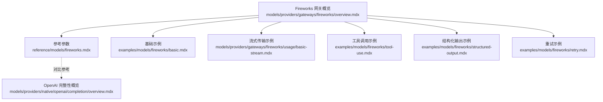
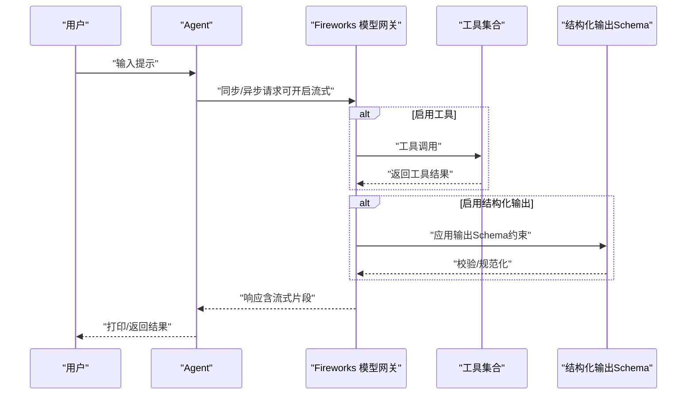
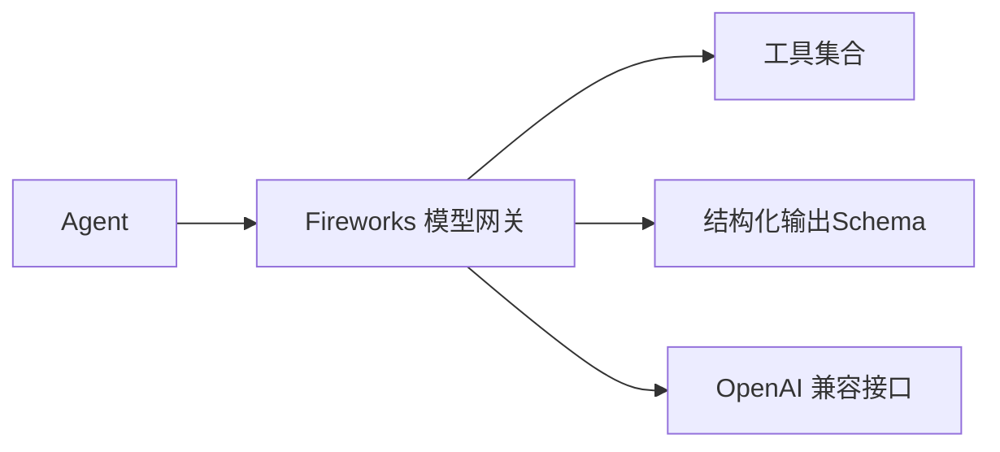

# Fireworks 网关

<cite>
**本文引用的文件**
- [Fireworks 概览](file://models/providers/gateways/fireworks/overview.mdx)
- [Fireworks 参考参数](file://reference/models/fireworks.mdx)
- [Fireworks 基础示例](file://examples/models/fireworks/basic.mdx)
- [Fireworks 流式传输示例](file://models/providers/gateways/fireworks/usage/basic-stream.mdx)
- [Fireworks 工具调用示例](file://examples/models/fireworks/tool-use.mdx)
- [Fireworks 结构化输出示例](file://examples/models/fireworks/structured-output.mdx)
- [Fireworks 重试示例](file://examples/models/fireworks/retry.mdx)
- [OpenAI 完整性概览（用于对比）](file://models/providers/native/openai/completion/overview.mdx)
</cite>

## 目录
1. [简介](#简介)
2. [项目结构](#项目结构)
3. [核心组件](#核心组件)
4. [架构总览](#架构总览)
5. [详细组件分析](#详细组件分析)
6. [依赖关系分析](#依赖关系分析)
7. [性能考量](#性能考量)
8. [故障排查指南](#故障排查指南)
9. [结论](#结论)
10. [附录](#附录)

## 简介
本文件为 Fireworks 网关的使用文档，面向希望在 Agent 中集成 Fireworks AI 模型的开发者与运维人员。内容覆盖认证配置、API 密钥管理、基础使用示例、重试机制、结构化输出与工具使用、模型选择策略、性能监控与成本优化、以及与知识库/嵌入器等组件的集成最佳实践。文档同时提供可直接运行的示例路径，帮助快速落地。

## 项目结构
围绕 Fireworks 的文档与示例主要分布在以下位置：
- 网关概览与参数：models/providers/gateways/fireworks/overview.mdx
- 参考参数与扩展能力：reference/models/fireworks.mdx
- 示例与用法：
  - 基础与流式传输：examples/models/fireworks/basic.mdx、models/providers/gateways/fireworks/usage/basic-stream.mdx
  - 工具调用：examples/models/fireworks/tool-use.mdx
  - 结构化输出：examples/models/fireworks/structured-output.mdx
  - 重试机制：examples/models/fireworks/retry.mdx
- 对比参考：models/providers/native/openai/completion/overview.mdx（用于理解 OpenAI 兼容接口）

**图表来源**
- [Fireworks 概览:1-64](file://models/providers/gateways/fireworks/overview.mdx#L1-L64)
- [Fireworks 参考参数:1-21](file://reference/models/fireworks.mdx#L1-L21)
- [Fireworks 基础示例:1-61](file://examples/models/fireworks/basic.mdx#L1-L61)
- [Fireworks 流式传输示例:1-48](file://models/providers/gateways/fireworks/usage/basic-stream.mdx#L1-L48)
- [Fireworks 工具调用示例:1-47](file://examples/models/fireworks/tool-use.mdx#L1-L47)
- [Fireworks 结构化输出示例:1-77](file://examples/models/fireworks/structured-output.mdx#L1-L77)
- [Fireworks 重试示例:1-49](file://examples/models/fireworks/retry.mdx#L1-L49)
- [OpenAI 完整性概览（用于对比）:1-108](file://models/providers/native/openai/completion/overview.mdx#L1-L108)

**章节来源**
- [Fireworks 概览:1-64](file://models/providers/gateways/fireworks/overview.mdx#L1-L64)
- [Fireworks 参考参数:1-21](file://reference/models/fireworks.mdx#L1-L21)

## 核心组件
- Fireworks 模型网关
  - 支持通过环境变量或显式参数传入 API 密钥
  - 默认基础 URL 指向 Fireworks 推理服务
  - 继承 OpenAI 兼容接口，支持大多数 OpenAI 参数
  - 提供 prompt caching 能力（自动启用）
- Agent 集成点
  - 同步/异步调用
  - 流式传输
  - 工具调用
  - 结构化输出（JSON 模式/Pydantic Schema）
- 可选增强能力
  - 重试机制（次数、间隔、指数退避）
  - 与知识库/嵌入器的组合使用

**章节来源**
- [Fireworks 概览:9-27](file://models/providers/gateways/fireworks/overview.mdx#L9-L27)
- [Fireworks 参考参数:8-20](file://reference/models/fireworks.mdx#L8-L20)

## 架构总览
下图展示了 Agent 与 Fireworks 网关的交互流程，以及与工具、结构化输出、流式传输的关系。

**图表来源**
- [Fireworks 基础示例:21-24](file://examples/models/fireworks/basic.mdx#L21-L24)
- [Fireworks 工具调用示例:18-22](file://examples/models/fireworks/tool-use.mdx#L18-L22)
- [Fireworks 结构化输出示例:45-49](file://examples/models/fireworks/structured-output.mdx#L45-L49)
- [Fireworks 流式传输示例:12-15](file://models/providers/gateways/fireworks/usage/basic-stream.mdx#L12-L15)

## 详细组件分析

### 认证与 API 密钥管理
- 环境变量
  - 通过设置 FIREWORKS_API_KEY 实现密钥注入
  - 支持 macOS 与 Windows 的设置方式
- 显式参数
  - 可在初始化 Fireworks 时传入 api_key
- 最佳实践
  - 生产环境建议使用密钥轮换与最小权限原则
  - 将密钥存储于平台机密管理器中，避免硬编码

**章节来源**
- [Fireworks 概览:9-23](file://models/providers/gateways/fireworks/overview.mdx#L9-L23)

### 基础使用与流式传输
- 基础用法
  - 创建 Agent 并指定 Fireworks 模型 id
  - 支持同步与异步打印响应
- 流式传输
  - 通过 stream=True 获取增量片段
  - 适用于长文本生成与实时反馈场景

**章节来源**
- [Fireworks 基础示例:21-46](file://examples/models/fireworks/basic.mdx#L21-L46)
- [Fireworks 流式传输示例:12-23](file://models/providers/gateways/fireworks/usage/basic-stream.mdx#L12-L23)

### 工具使用
- 在 Agent 初始化时注入工具列表
- Fireworks 支持函数调用（tool-calling），可在推理过程中动态调用外部工具
- 适合需要联网搜索、数据查询等能力的场景

**章节来源**
- [Fireworks 工具调用示例:18-32](file://examples/models/fireworks/tool-use.mdx#L18-L32)

### 结构化输出
- 通过 output_schema 指定 Pydantic 模型
- 模型在生成时遵循 Schema 约束，提升输出一致性与解析效率
- 适合抽取结构化信息、生成 JSON/对象等任务

**章节来源**
- [Fireworks 结构化输出示例:45-53](file://examples/models/fireworks/structured-output.mdx#L45-L53)

### 重试机制
- 参数支持
  - retries：最大重试次数
  - delay_between_retries：每次重试间隔（秒）
  - exponential_backoff：是否采用指数退避
- 场景建议
  - 网络抖动、上游限流、无效模型 ID 等异常情况
  - 与指数退避配合可降低对上游的压力峰值

**章节来源**
- [Fireworks 参考参数:17-19](file://reference/models/fireworks.mdx#L17-L19)
- [Fireworks 重试示例:20-26](file://examples/models/fireworks/retry.mdx#L20-L26)

### 模型选择策略
- 通用建议
  - 根据任务复杂度与成本预算选择合适模型
  - 优先尝试较小模型进行基准测试，再逐步切换到更大模型
- 与 OpenAI 对比
  - Fireworks 继承 OpenAI 兼容接口，参数体系相近，便于迁移与对比
- prompt caching
  - Fireworks 自动启用 prompt caching，有助于降低重复请求成本与延迟

**章节来源**
- [Fireworks 概览:25-27](file://models/providers/gateways/fireworks/overview.mdx#L25-L27)
- [OpenAI 完整性概览（用于对比）:9-16](file://models/providers/native/openai/completion/overview.mdx#L9-L16)

### 性能监控与成本优化
- 性能监控
  - 可结合可观测性平台记录模型调用链路与耗时
  - 关注关键指标：首字节时间、吞吐量、错误率、重试次数
- 成本优化
  - 利用 prompt caching 减少重复计算
  - 通过较小模型先行验证，再按需扩容
  - 控制上下文长度与生成长度，避免不必要的 token 消耗

**章节来源**
- [Fireworks 概览:25-27](file://models/providers/gateways/fireworks/overview.mdx#L25-L27)

### 与其他组件的集成与配置最佳实践
- 与知识库/嵌入器
  - 可将 Fireworks 作为检索增强（RAG）中的生成器
  - 嵌入器可选用兼容 OpenAI 接口的实现，保持一致的调用体验
- 与工具
  - 将工具封装为可复用组件，统一在 Agent 层注入
  - 对工具调用进行日志与限流控制
- 与结构化输出
  - 在 Schema 设计阶段明确字段与约束，减少后处理开销
- 配置最佳实践
  - 明确区分开发/预发/生产三套密钥与基础 URL
  - 为不同 Agent 设置独立的超时与重试策略
  - 对流式场景增加背压与缓冲区上限，避免内存压力

**章节来源**
- [Fireworks 概览:63-63](file://models/providers/gateways/fireworks/overview.mdx#L63-L63)
- [OpenAI 完整性概览（用于对比）:63-108](file://models/providers/native/openai/completion/overview.mdx#L63-L108)

## 依赖关系分析
- Fireworks 网关与 Agent 的耦合度低，通过统一的模型接口对接
- 工具与结构化输出为可插拔扩展，不改变核心调用链
- 与 OpenAI 兼容接口的存在降低了迁移与对比成本

**图表来源**
- [Fireworks 基础示例:21-24](file://examples/models/fireworks/basic.mdx#L21-L24)
- [Fireworks 工具调用示例:18-22](file://examples/models/fireworks/tool-use.mdx#L18-L22)
- [Fireworks 结构化输出示例:45-49](file://examples/models/fireworks/structured-output.mdx#L45-L49)
- [OpenAI 完整性概览（用于对比）:63-108](file://models/providers/native/openai/completion/overview.mdx#L63-L108)

## 性能考量
- 延迟与吞吐
  - 优先使用较小模型进行快速迭代；在关键路径上再切换到更大模型
  - 合理设置流式传输，缩短感知延迟
- 成本控制
  - 充分利用 prompt caching 与上下文压缩
  - 控制 max_tokens 与温度等参数，避免过度生成
- 稳定性
  - 配置合理的重试与退避策略，避免雪崩效应
  - 对上游限流与错误进行分类处理

## 故障排查指南
- 常见问题定位
  - API 密钥未设置或过期：检查环境变量与平台密钥管理
  - 模型 ID 错误：确认模型 id 是否存在且可用
  - 网络不稳定：启用重试并观察指数退避效果
- 日志与观测
  - 记录请求/响应体摘要与关键指标
  - 对工具调用与结构化输出失败进行专项追踪
- 快速恢复
  - 临时回退到更稳定的模型或禁用工具/结构化输出以隔离问题

**章节来源**
- [Fireworks 重试示例:16-26](file://examples/models/fireworks/retry.mdx#L16-L26)

## 结论
Fireworks 网关以 OpenAI 兼容接口为核心，提供了简洁而强大的模型接入方式。通过 prompt caching、流式传输、工具调用与结构化输出等能力，能够覆盖从对话生成到代码辅助、再到多模态处理的广泛场景。结合合理的模型选择策略、性能监控与成本优化手段，可在保证质量的同时实现高效与可控的部署。

## 附录
- 示例清单（可直接运行）
  - 基础用法：[Fireworks 基础示例:21-46](file://examples/models/fireworks/basic.mdx#L21-L46)
  - 流式传输：[Fireworks 流式传输示例:12-23](file://models/providers/gateways/fireworks/usage/basic-stream.mdx#L12-L23)
  - 工具调用：[Fireworks 工具调用示例:18-32](file://examples/models/fireworks/tool-use.mdx#L18-L32)
  - 结构化输出：[Fireworks 结构化输出示例:45-53](file://examples/models/fireworks/structured-output.mdx#L45-L53)
  - 重试机制：[Fireworks 重试示例:20-26](file://examples/models/fireworks/retry.mdx#L20-L26)
- 对比参考
  - [OpenAI 完整性概览（用于对比）:63-108](file://models/providers/native/openai/completion/overview.mdx#L63-L108)