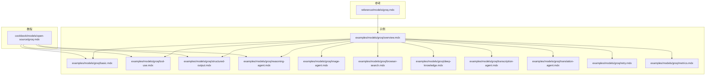
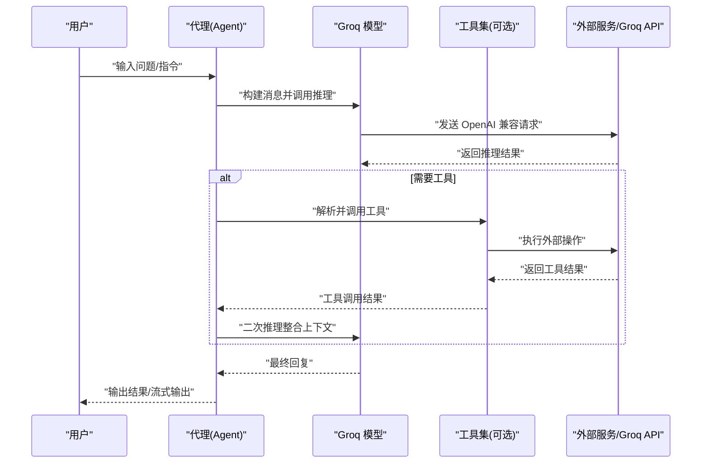
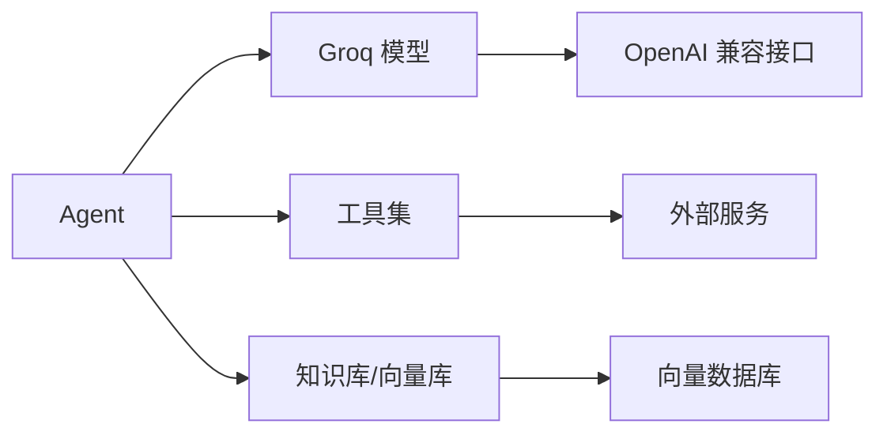

# Groq 网关

<cite>
**本文引用的文件**
- [models/providers/gateways/groq/overview.mdx](file://models/providers/gateways/groq/overview.mdx)
- [reference/models/groq.mdx](file://reference/models/groq.mdx)
- [examples/models/groq/overview.mdx](file://examples/models/groq/overview.mdx)
- [examples/models/groq/basic.mdx](file://examples/models/groq/basic.mdx)
- [examples/models/groq/browser-search.mdx](file://examples/models/groq/browser-search.mdx)
- [examples/models/groq/deep-knowledge.mdx](file://examples/models/groq/deep-knowledge.mdx)
- [examples/models/groq/image-agent.mdx](file://examples/models/groq/image-agent.mdx)
- [examples/models/groq/reasoning-agent.mdx](file://examples/models/groq/reasoning-agent.mdx)
- [examples/models/groq/structured-output.mdx](file://examples/models/groq/structured-output.mdx)
- [examples/models/groq/translation-agent.mdx](file://examples/models/groq/translation-agent.mdx)
- [examples/models/groq/transcription-agent.mdx](file://examples/models/groq/transcription-agent.mdx)
- [examples/models/groq/tool-use.mdx](file://examples/models/groq/tool-use.mdx)
- [cookbook/models/open-source/groq.mdx](file://cookbook/models/open-source/groq.mdx)
- [examples/models/groq/retry.mdx](file://examples/models/groq/retry.mdx)
- [examples/models/groq/metrics.mdx](file://examples/models/groq/metrics.mdx)
- [examples/reasoning/models/groq/fast-reasoning.mdx](file://examples/reasoning/models/groq/fast-reasoning.mdx)
</cite>

## 目录
1. [简介](#简介)
2. [项目结构](#项目结构)
3. [核心组件](#核心组件)
4. [架构总览](#架构总览)
5. [详细组件分析](#详细组件分析)
6. [依赖关系分析](#依赖关系分析)
7. [性能考量](#性能考量)
8. [故障排查指南](#故障排查指南)
9. [结论](#结论)
10. [附录](#附录)

## 简介
本文件为 Groq 网关的详细使用文档，聚焦于在 Agno 框架中通过 Groq 高性能推理引擎实现快速、稳定的多模态与工具调用能力。Groq 提供极低延迟的大模型推理服务，适合需要快速响应的代理系统与生产场景。本文将从认证配置、模型参数、结构化输出、工具使用、推理流程、性能优化与成本控制等方面进行系统讲解，并提供覆盖代理团队、浏览器搜索、深度知识、图像处理、研究代理、推理代理、转录代理、翻译代理等典型应用场景的实践路径。

## 项目结构
围绕 Groq 的使用，相关文档分布在“参考”、“示例”、“教程”三大类中：
- 参考：模型参数与默认值、错误重试与指数退避等
- 示例：基础对话、工具调用、结构化输出、推理代理、图像理解、转录与翻译、深度知识检索等
- 教程：开源模型与 Groq 的结合实践

**图表来源**
- [reference/models/groq.mdx:1-21](file://reference/models/groq.mdx#L1-L21)
- [examples/models/groq/overview.mdx:1-25](file://examples/models/groq/overview.mdx#L1-L25)
- [cookbook/models/open-source/groq.mdx:1-86](file://cookbook/models/open-source/groq.mdx#L1-L86)

**章节来源**
- [reference/models/groq.mdx:1-21](file://reference/models/groq.mdx#L1-L21)
- [examples/models/groq/overview.mdx:1-25](file://examples/models/groq/overview.mdx#L1-L25)
- [cookbook/models/open-source/groq.mdx:1-86](file://cookbook/models/open-source/groq.mdx#L1-L86)

## 核心组件
- Groq 模型封装：提供统一的 OpenAI 兼容接口，支持 id、name、provider、api_key、base_url、retries、delay_between_retries、exponential_backoff 等参数。
- 代理（Agent）：通过注入 Groq 模型或推理模型，实现问答、工具调用、结构化输出、多模态输入等能力。
- 工具集：如浏览器搜索、新闻抓取、财务数据查询、语音转写与翻译等，配合 Groq 实现端到端应用。
- 认证与环境变量：通过 GROQ_API_KEY 设置密钥；支持本地开发与 CI/CD 环境。

关键参数说明（摘自参考文档）：
- id：模型标识，默认为通用大模型
- name/provider：模型名称与提供商标识
- api_key：可显式传入或使用环境变量
- base_url：Groq OpenAI 兼容接口地址
- retries/delay/exponential_backoff：请求失败时的重试策略

**章节来源**
- [reference/models/groq.mdx:8-21](file://reference/models/groq.mdx#L8-L21)
- [models/providers/gateways/groq/overview.mdx:19-33](file://models/providers/gateways/groq/overview.mdx#L19-L33)

## 架构总览
下图展示了从用户请求到 Groq 推理与工具调用的整体流程，以及与代理系统的交互方式。

**图表来源**
- [examples/models/groq/tool-use.mdx:23-34](file://examples/models/groq/tool-use.mdx#L23-L34)
- [examples/models/groq/reasoning-agent.mdx:20-28](file://examples/models/groq/reasoning-agent.mdx#L20-L28)
- [cookbook/models/open-source/groq.mdx:20-52](file://cookbook/models/open-source/groq.mdx#L20-L52)

## 详细组件分析

### 认证与 API 密钥配置
- 在本地环境中设置 GROQ_API_KEY，可在 macOS/Linux 使用 export，Windows 使用 setx。
- Groq 模型封装默认从环境变量读取密钥，也可显式传入 api_key 参数。

最佳实践：
- 将密钥保存在安全的机密管理器或环境变量中，避免硬编码。
- 在 CI/CD 中通过平台提供的密钥管理服务注入。

**章节来源**
- [models/providers/gateways/groq/overview.mdx:19-33](file://models/providers/gateways/groq/overview.mdx#L19-L33)
- [reference/models/groq.mdx:15-16](file://reference/models/groq.mdx#L15-L16)

### 基础使用与多模态输入
- 支持同步/异步、流式/非流式的响应模式。
- 多模态场景可通过图片输入增强理解能力（如图像描述、视觉问答）。

示例要点：
- 基础对话：同步/异步打印响应
- 流式输出：提升交互体验
- 图像输入：以图片作为输入参与推理

**章节来源**
- [examples/models/groq/basic.mdx:21-45](file://examples/models/groq/basic.mdx#L21-L45)
- [examples/models/groq/image-agent.mdx:21-29](file://examples/models/groq/image-agent.mdx#L21-L29)
- [cookbook/models/open-source/groq.mdx:8-18](file://cookbook/models/open-source/groq.mdx#L8-L18)

### 工具使用与浏览器搜索
- 通过工具集扩展代理能力，如浏览器搜索、新闻抓取、财务数据查询等。
- 结合 Groq 的快速推理，实现“搜索+阅读+总结”的完整链路。

示例要点：
- 定义工具列表并注入代理
- 组织提示词与上下文，确保工具调用准确
- 支持异步流式输出，提升交互效率

**章节来源**
- [examples/models/groq/tool-use.mdx:23-34](file://examples/models/groq/tool-use.mdx#L23-L34)
- [examples/models/groq/browser-search.mdx:20-24](file://examples/models/groq/browser-search.mdx#L20-L24)
- [cookbook/models/open-source/groq.mdx:20-34](file://cookbook/models/open-source/groq.mdx#L20-L34)

### 结构化输出与 JSON 模式
- 通过 Pydantic 模型定义输出结构，结合 use_json_mode 保证输出符合预期格式。
- 适用于报告生成、摘要抽取、分类标注等场景。

示例要点：
- 定义输出模式（如电影脚本字段）
- 启用 JSON 模式并运行代理
- 获取结构化结果并进行后续处理

**章节来源**
- [examples/models/groq/structured-output.mdx:44-49](file://examples/models/groq/structured-output.mdx#L44-L49)
- [cookbook/models/open-source/groq.mdx:54-72](file://cookbook/models/open-source/groq.mdx#L54-L72)

### 推理代理与多模型协同
- 使用推理模型（如深智 R1）进行中间推理，再由通用模型生成最终回答。
- 适合复杂计算、逻辑判断、数学比较等任务。

示例要点：
- 分别配置推理模型与通用模型
- 控制温度、最大 token、top_p 等参数
- 观察推理过程与最终结论

**章节来源**
- [examples/models/groq/reasoning-agent.mdx:20-31](file://examples/models/groq/reasoning-agent.mdx#L20-L31)
- [cookbook/models/open-source/groq.mdx:36-52](file://cookbook/models/open-source/groq.mdx#L36-L52)
- [examples/reasoning/models/groq/fast-reasoning.mdx:53-88](file://examples/reasoning/models/groq/fast-reasoning.mdx#L53-L88)

### 深度知识与检索增强
- 通过知识库（嵌入、向量数据库）与迭代搜索，逐步完善答案。
- 支持混合检索、来源标注与溯源，适合研究型代理。

示例要点：
- 初始化知识库（嵌入器、向量库）
- 设计检索与合成流程
- 保持透明的推理过程与引用来源

**章节来源**
- [examples/models/groq/deep-knowledge.mdx:42-55](file://examples/models/groq/deep-knowledge.mdx#L42-L55)
- [examples/models/groq/deep-knowledge.mdx:62-121](file://examples/models/groq/deep-knowledge.mdx#L62-L121)

### 转录与翻译代理
- 通过 Groq 工具集实现语音转写与多语言翻译，结合音频生成工具完成端到端流程。
- 适合内容本地化、会议记录、教学材料制作等场景。

示例要点：
- 注入 Groq 工具集（排除不需要的工具）
- 指定音频输入路径并触发转写/翻译
- 保存或进一步处理生成的音频

**章节来源**
- [examples/models/groq/transcription-agent.mdx:18-24](file://examples/models/groq/transcription-agent.mdx#L18-L24)
- [examples/models/groq/translation-agent.mdx:27-36](file://examples/models/groq/translation-agent.mdx#L27-L36)

### 模型选择与推荐
- 通用用途：建议使用通用大模型
- 追求极致速度：可选用更小更快的模型
- 图像理解：建议使用具备视觉能力的模型

**章节来源**
- [models/providers/gateways/groq/overview.mdx:11-13](file://models/providers/gateways/groq/overview.mdx#L11-L13)

## 依赖关系分析
- Groq 模型封装依赖 OpenAI 兼容接口，参数与行为与 OpenAI 类似，便于迁移与复用。
- 代理系统通过工具集扩展能力，工具调用与推理解耦，便于按需组合。
- 知识库与向量数据库为检索增强提供支撑，形成“检索-推理-生成”的闭环。

**图表来源**
- [cookbook/models/open-source/groq.mdx:20-52](file://cookbook/models/open-source/groq.mdx#L20-L52)
- [examples/models/groq/deep-knowledge.mdx:42-55](file://examples/models/groq/deep-knowledge.mdx#L42-L55)

**章节来源**
- [cookbook/models/open-source/groq.mdx:1-86](file://cookbook/models/open-source/groq.mdx#L1-L86)
- [examples/models/groq/deep-knowledge.mdx:42-55](file://examples/models/groq/deep-knowledge.mdx#L42-L55)

## 性能考量
- 模型选择：根据任务复杂度与延迟要求选择合适模型；对简单任务优先考虑更快模型。
- 流式输出：开启流式可显著改善感知延迟，尤其在工具调用与长文本生成场景。
- 异步执行：在高并发或 I/O 密集场景使用异步接口，提升吞吐。
- 指标监控：利用消息级指标与会话级指标评估耗时、Token 使用与工具调用开销。
- 重试策略：合理设置重试次数与退避策略，平衡稳定性与成本。

**章节来源**
- [examples/models/groq/basic.mdx:33-45](file://examples/models/groq/basic.mdx#L33-L45)
- [examples/models/groq/metrics.mdx:23-46](file://examples/models/groq/metrics.mdx#L23-L46)
- [examples/models/groq/retry.mdx:19-26](file://examples/models/groq/retry.mdx#L19-L26)
- [reference/models/groq.mdx:17-19](file://reference/models/groq.mdx#L17-L19)

## 故障排查指南
常见问题与处理建议：
- 认证失败：检查 GROQ_API_KEY 是否正确设置，确认网络可达性。
- 请求超时：适当增加重试次数与退避间隔，或切换更小模型。
- 输出格式不符：启用 JSON 模式并明确输出 Schema，必要时加强提示词约束。
- 工具调用异常：确认工具权限与外部服务可用性，查看工具调用日志与指标。

**章节来源**
- [models/providers/gateways/groq/overview.mdx:19-33](file://models/providers/gateways/groq/overview.mdx#L19-L33)
- [examples/models/groq/retry.mdx:19-26](file://examples/models/groq/retry.mdx#L19-L26)
- [examples/models/groq/structured-output.mdx:44-49](file://examples/models/groq/structured-output.mdx#L44-L49)

## 结论
通过 Groq 网关，Agno 代理系统能够在保证推理质量的同时获得极低延迟与高吞吐。结合工具集、结构化输出、多模态输入与检索增强，可覆盖从基础问答到复杂研究、从图像理解到音视频处理的广泛场景。建议在实际部署中综合考虑模型选择、流式与异步策略、指标监控与重试机制，以实现性能与成本的最佳平衡。

## 附录
- 快速开始：设置密钥后，直接使用 Groq 模型创建代理并打印响应。
- 示例索引：包含基础、工具使用、结构化输出、推理代理、图像、浏览器搜索、深度知识、转录与翻译等丰富示例，便于按需参考与复用。

**章节来源**
- [models/providers/gateways/groq/overview.mdx:35-57](file://models/providers/gateways/groq/overview.mdx#L35-L57)
- [examples/models/groq/overview.mdx:6-24](file://examples/models/groq/overview.mdx#L6-L24)