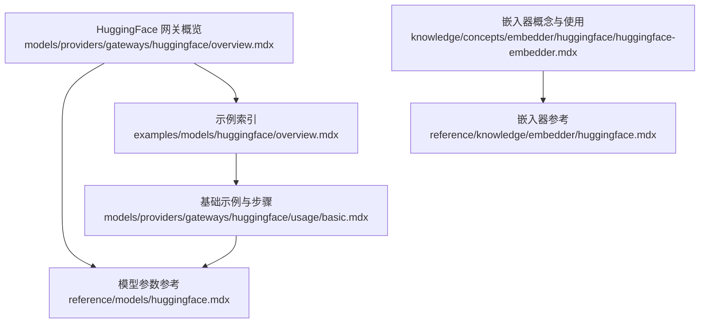
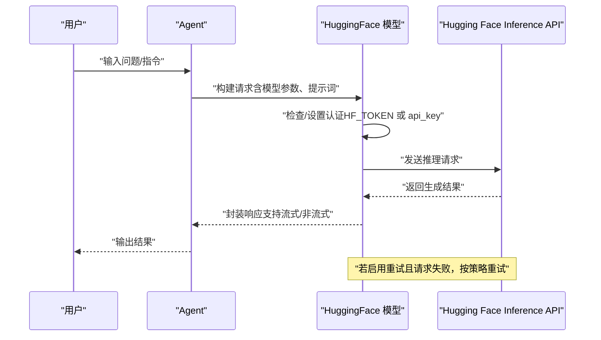
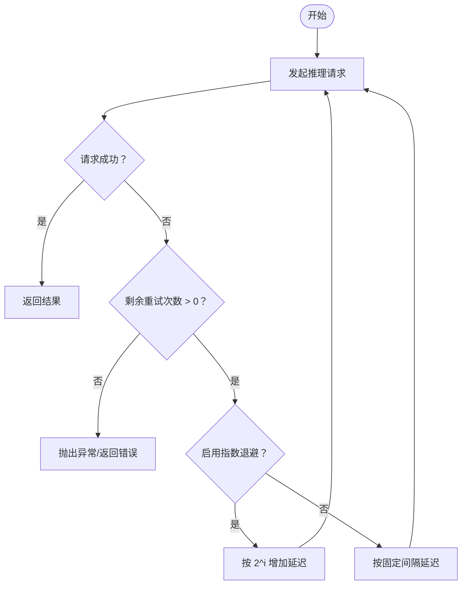
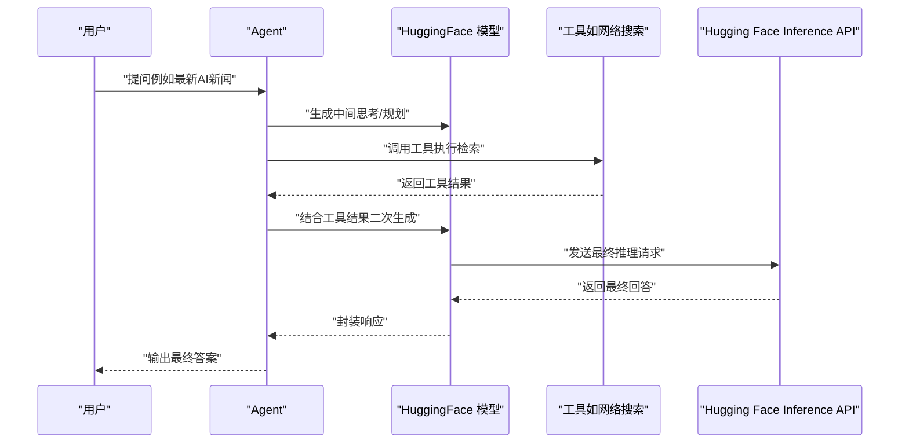
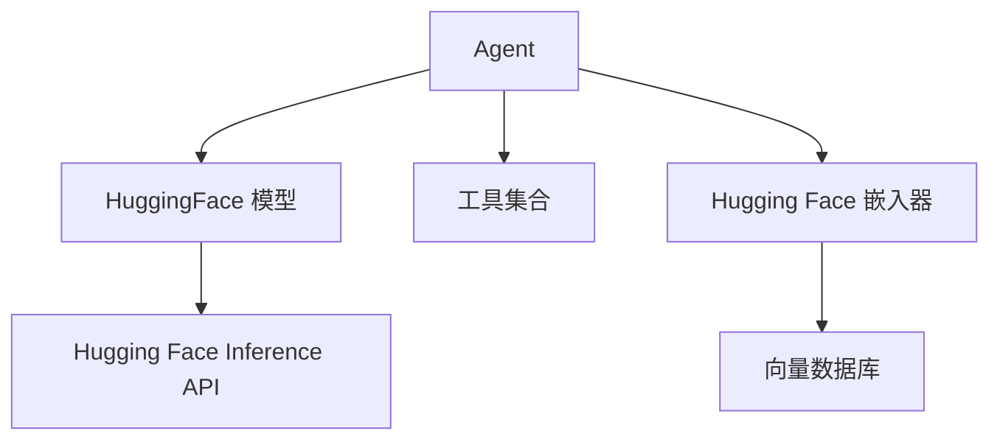

# Hugging Face 网关

<cite>
**本文引用的文件**
- [models/providers/gateways/huggingface/overview.mdx](file://models/providers/gateways/huggingface/overview.mdx)
- [reference/models/huggingface.mdx](file://reference/models/huggingface.mdx)
- [examples/models/huggingface/overview.mdx](file://examples/models/huggingface/overview.mdx)
- [examples/models/huggingface/basic.mdx](file://examples/models/huggingface/basic.mdx)
- [examples/models/huggingface/retry.mdx](file://examples/models/huggingface/retry.mdx)
- [examples/models/huggingface/tool-use.mdx](file://examples/models/huggingface/tool-use.mdx)
- [models/providers/gateways/huggingface/usage/basic.mdx](file://models/providers/gateways/huggingface/usage/basic.mdx)
- [knowledge/concepts/embedder/huggingface/huggingface-embedder.mdx](file://knowledge/concepts/embedder/huggingface/huggingface-embedder.mdx)
- [reference/knowledge/embedder/huggingface.mdx](file://reference/knowledge/embedder/huggingface.mdx)
</cite>

## 目录
1. [简介](#简介)
2. [项目结构](#项目结构)
3. [核心组件](#核心组件)
4. [架构总览](#架构总览)
5. [详细组件分析](#详细组件分析)
6. [依赖关系分析](#依赖关系分析)
7. [性能考虑](#性能考虑)
8. [故障排查指南](#故障排查指南)
9. [结论](#结论)
10. [附录](#附录)

## 简介
本文件面向在 Agent 中集成 Hugging Face 开源模型与工具的用户，系统性介绍 Hugging Face 作为开源机器学习平台的特点与优势（丰富的开源模型与工具、易用性与灵活性），并围绕 Hugging Face 网关提供认证配置、API 密钥管理、基础使用示例、重试机制与工具使用、模型选择策略、模型下载与缓存管理、以及典型应用场景（文本生成、模型推理、工具调用）的完整使用指南。同时总结开源生态的优势与使用注意事项，帮助读者快速上手并在生产环境中稳定运行。

## 项目结构
与 Hugging Face 网关相关的内容主要分布在以下位置：
- 网关概览与参数：models/providers/gateways/huggingface/overview.mdx
- 模型参考参数：reference/models/huggingface.mdx
- 示例索引与示例文档：examples/models/huggingface/*
- 基础示例与使用步骤：models/providers/gateways/huggingface/usage/basic.mdx
- 知识嵌入器（Embedder）与向量库结合：knowledge/concepts/embedder/huggingface/* 与 reference/knowledge/embedder/huggingface.mdx

**图表来源**
- [models/providers/gateways/huggingface/overview.mdx:1-73](file://models/providers/gateways/huggingface/overview.mdx#L1-L73)
- [reference/models/huggingface.mdx:1-25](file://reference/models/huggingface.mdx#L1-L25)
- [examples/models/huggingface/overview.mdx:1-12](file://examples/models/huggingface/overview.mdx#L1-L12)
- [models/providers/gateways/huggingface/usage/basic.mdx:1-44](file://models/providers/gateways/huggingface/usage/basic.mdx#L1-L44)
- [knowledge/concepts/embedder/huggingface/huggingface-embedder.mdx:1-62](file://knowledge/concepts/embedder/huggingface/huggingface-embedder.mdx#L1-L62)
- [reference/knowledge/embedder/huggingface.mdx:1-7](file://reference/knowledge/embedder/huggingface.mdx#L1-L7)

**章节来源**
- [models/providers/gateways/huggingface/overview.mdx:1-73](file://models/providers/gateways/huggingface/overview.mdx#L1-L73)
- [reference/models/huggingface.mdx:1-25](file://reference/models/huggingface.mdx#L1-L25)
- [examples/models/huggingface/overview.mdx:1-12](file://examples/models/huggingface/overview.mdx#L1-L12)
- [models/providers/gateways/huggingface/usage/basic.mdx:1-44](file://models/providers/gateways/huggingface/usage/basic.mdx#L1-L44)
- [knowledge/concepts/embedder/huggingface/huggingface-embedder.mdx:1-62](file://knowledge/concepts/embedder/huggingface/huggingface-embedder.mdx#L1-L62)
- [reference/knowledge/embedder/huggingface.mdx:1-7](file://reference/knowledge/embedder/huggingface.mdx#L1-L7)

## 核心组件
- HuggingFace 网关模型类：提供对 Hugging Face Hub 上托管模型的访问能力，支持同步/异步、流式输出、参数化控制（如最大生成长度、温度、采样策略、重复惩罚等），并内置重试与指数退避机制。
- 认证与密钥管理：默认从环境变量 HF_TOKEN 获取 API 密钥；也可通过构造函数显式传入 api_key。
- 工具集成：可与 Agent 的工具系统配合使用，实现“思考-检索-行动”的增强推理流程。
- 嵌入器（Embedder）：支持基于 Hugging Face Inference API 的自定义嵌入器，用于知识入库与检索。

关键参数要点（节选）：
- id：要使用的模型标识符（如 meta-llama/Meta-Llama-3-8B-Instruct）
- api_key：Hugging Face API 密钥（默认取 HF_TOKEN）
- base_url：Hugging Face Inference API 基础地址
- wait_for_model：是否等待冷启动模型加载
- use_cache：是否启用缓存以提升推理速度
- max_tokens、temperature、top_p、repetition_penalty：生成质量与多样性控制
- retries、delay_between_retries、exponential_backoff：重试策略

**章节来源**
- [models/providers/gateways/huggingface/overview.mdx:56-73](file://models/providers/gateways/huggingface/overview.mdx#L56-L73)
- [reference/models/huggingface.mdx:8-25](file://reference/models/huggingface.mdx#L8-L25)

## 架构总览
下图展示了 Agent 使用 HuggingFace 网关进行推理的整体流程，包括认证、参数传递、请求与响应处理、以及可选的工具调用与重试机制。

**图表来源**
- [models/providers/gateways/huggingface/overview.mdx:14-28](file://models/providers/gateways/huggingface/overview.mdx#L14-L28)
- [reference/models/huggingface.mdx:23-25](file://reference/models/huggingface.mdx#L23-L25)
- [examples/models/huggingface/retry.mdx:19-26](file://examples/models/huggingface/retry.mdx#L19-L26)

## 详细组件分析

### 组件一：认证与 API 密钥管理
- 默认优先从环境变量 HF_TOKEN 读取密钥；也可在构造 HuggingFace 模型时显式传入 api_key。
- 在不同操作系统中设置环境变量的方式见网关概览中的示例。
- 若未正确配置密钥，将导致鉴权失败或无法访问受限模型。

最佳实践：
- 在本地开发与 CI 环境中统一使用 HF_TOKEN，避免硬编码。
- 对于多租户或多项目场景，建议通过外部密钥管理服务注入环境变量。

**章节来源**
- [models/providers/gateways/huggingface/overview.mdx:14-28](file://models/providers/gateways/huggingface/overview.mdx#L14-L28)
- [reference/models/huggingface.mdx:15](file://reference/models/huggingface.mdx#L15)

### 组件二：基础使用与参数控制
- 支持同步与异步两种调用方式，并可开启流式输出以获得更佳交互体验。
- 关键参数包括 id、max_tokens、temperature、top_p、repetition_penalty 等，用于控制模型行为与生成质量。
- 可直接将 HuggingFace 模型接入 Agent，无需额外适配层。

示例路径：
- [基础示例代码:1-71](file://examples/models/huggingface/basic.mdx#L1-L71)
- [基础使用步骤与密钥设置:27-31](file://models/providers/gateways/huggingface/usage/basic.mdx#L27-L31)

**章节来源**
- [examples/models/huggingface/basic.mdx:1-71](file://examples/models/huggingface/basic.mdx#L1-L71)
- [models/providers/gateways/huggingface/usage/basic.mdx:1-44](file://models/providers/gateways/huggingface/usage/basic.mdx#L1-L44)
- [models/providers/gateways/huggingface/overview.mdx:58-71](file://models/providers/gateways/huggingface/overview.mdx#L58-L71)

### 组件三：重试机制与错误处理
- HuggingFace 模型支持 retries、delay_between_retries、exponential_backoff 三项重试参数。
- 典型场景：网络抖动、模型冷启动、上游限流等导致的瞬时失败。
- 示例演示了通过错误的模型 ID 触发重试逻辑，便于验证策略有效性。

**图表来源**
- [reference/models/huggingface.mdx:23-25](file://reference/models/huggingface.mdx#L23-L25)
- [examples/models/huggingface/retry.mdx:19-26](file://examples/models/huggingface/retry.mdx#L19-L26)

**章节来源**
- [reference/models/huggingface.mdx:23-25](file://reference/models/huggingface.mdx#L23-L25)
- [examples/models/huggingface/retry.mdx:1-50](file://examples/models/huggingface/retry.mdx#L1-L50)

### 组件四：工具使用与增强推理
- 将 HuggingFace 模型与工具（如网络搜索）结合，可实现“检索-思考-生成”的增强推理链路。
- 示例展示了在 Agent 中注入工具后，模型可基于工具返回的信息进行更准确的回复。

**图表来源**
- [examples/models/huggingface/tool-use.mdx:21-25](file://examples/models/huggingface/tool-use.mdx#L21-L25)

**章节来源**
- [examples/models/huggingface/tool-use.mdx:1-50](file://examples/models/huggingface/tool-use.mdx#L1-L50)

### 组件五：模型选择策略、下载与缓存管理
- 模型选择策略建议：
  - 任务导向：根据具体任务（对话、推理、代码）选择合适规模与风格的开源模型。
  - 性能导向：在资源受限环境下优先选择轻量化模型；在追求质量时选择更大模型。
  - 成本与延迟：结合并发与吞吐需求评估推理成本与时延。
- 下载与缓存：
  - Hugging Face 提供模型与分词器的本地缓存机制，减少重复下载。
  - 网关层可通过 use_cache 参数优化重复请求的响应时间。
  - 冷启动：wait_for_model 控制是否等待模型加载完成，避免首次请求超时。

**章节来源**
- [models/providers/gateways/huggingface/overview.mdx:65-66](file://models/providers/gateways/huggingface/overview.mdx#L65-L66)

### 组件六：嵌入器与知识库（可选）
- Hugging Face 嵌入器可用于将文本转换为向量，配合向量数据库（如 PgVector）实现高效检索。
- 使用流程包含：设置 HUGGINGFACE_API_KEY、安装依赖、运行示例脚本。
- 该能力适合需要“检索增强生成”（RAG）的 Agent 场景。

**章节来源**
- [knowledge/concepts/embedder/huggingface/huggingface-embedder.mdx:1-62](file://knowledge/concepts/embedder/huggingface/huggingface-embedder.mdx#L1-L62)
- [reference/knowledge/embedder/huggingface.mdx:1-7](file://reference/knowledge/embedder/huggingface.mdx#L1-L7)

## 依赖关系分析
- HuggingFace 网关模型依赖于 Hugging Face Inference API，认证由 HF_TOKEN 或显式 api_key 提供。
- Agent 通过模型接口统一调用，支持同步/异步与流式输出。
- 工具系统与模型解耦，可按需组合，形成“模型 + 工具”的复合能力。
- 嵌入器与向量库属于知识管线的一部分，与推理阶段可独立部署。

**图表来源**
- [models/providers/gateways/huggingface/overview.mdx:36-50](file://models/providers/gateways/huggingface/overview.mdx#L36-L50)
- [examples/models/huggingface/tool-use.mdx:21-25](file://examples/models/huggingface/tool-use.mdx#L21-L25)
- [knowledge/concepts/embedder/huggingface/huggingface-embedder.mdx:21-28](file://knowledge/concepts/embedder/huggingface/huggingface-embedder.mdx#L21-L28)

**章节来源**
- [models/providers/gateways/huggingface/overview.mdx:36-50](file://models/providers/gateways/huggingface/overview.mdx#L36-L50)
- [examples/models/huggingface/tool-use.mdx:1-50](file://examples/models/huggingface/tool-use.mdx#L1-L50)
- [knowledge/concepts/embedder/huggingface/huggingface-embedder.mdx:1-62](file://knowledge/concepts/embedder/huggingface/huggingface-embedder.mdx#L1-L62)

## 性能考虑
- 启用缓存：use_cache 可显著降低重复请求的延迟。
- 控制生成参数：合理设置 max_tokens、temperature、top_p 等参数，平衡质量与性能。
- 异步与流式：在高并发或长文本场景下，采用异步与流式输出可改善用户体验。
- 重试策略：适度的重试与指数退避可提升稳定性，但需避免过度重试造成资源浪费。
- 模型选择：根据任务复杂度与资源约束选择合适规模的模型，必要时采用分层策略（小模型负责路由，大模型负责生成）。

[本节为通用指导，不直接分析特定文件]

## 故障排查指南
常见问题与解决思路：
- 鉴权失败
  - 确认 HF_TOKEN 是否正确设置，或在模型构造时传入 api_key。
  - 检查 base_url 是否指向正确的 Inference API。
- 冷启动与超时
  - 设置 wait_for_model=True，确保模型加载完成后再发起请求。
- 生成质量不佳
  - 调整 temperature、top_p、repetition_penalty 等参数。
- 网络不稳定导致失败
  - 配置 retries、delay_between_retries、exponential_backoff，验证重试策略。
- 工具调用异常
  - 检查工具可用性与权限，确认 Agent 工具注册与调用链路正常。

**章节来源**
- [models/providers/gateways/huggingface/overview.mdx:14-28](file://models/providers/gateways/huggingface/overview.mdx#L14-L28)
- [reference/models/huggingface.mdx:15-17](file://reference/models/huggingface.mdx#L15-L17)
- [examples/models/huggingface/retry.mdx:19-26](file://examples/models/huggingface/retry.mdx#L19-L26)

## 结论
Hugging Face 网关为在 Agent 中集成开源模型与工具提供了简洁、灵活且可扩展的方案。通过合理的认证配置、参数调优、重试策略与工具组合，可在多种业务场景中实现高质量的文本生成与推理。结合嵌入器与向量库，还可进一步构建强大的 RAG 能力。建议在生产环境中重视缓存、异步与流式输出的使用，并建立完善的监控与重试策略，以获得稳定可靠的用户体验。

[本节为总结性内容，不直接分析特定文件]

## 附录

### 实际应用示例（路径指引）
- 基础文本生成与流式输出：[示例代码:1-71](file://examples/models/huggingface/basic.mdx#L1-L71)
- 错误模型 ID 触发重试：[示例代码:1-50](file://examples/models/huggingface/retry.mdx#L1-L50)
- 工具使用（检索增强）：[示例代码:1-50](file://examples/models/huggingface/tool-use.mdx#L1-L50)
- 嵌入器与向量库：[概念与使用:1-62](file://knowledge/concepts/embedder/huggingface/huggingface-embedder.mdx#L1-L62)

**章节来源**
- [examples/models/huggingface/basic.mdx:1-71](file://examples/models/huggingface/basic.mdx#L1-L71)
- [examples/models/huggingface/retry.mdx:1-50](file://examples/models/huggingface/retry.mdx#L1-L50)
- [examples/models/huggingface/tool-use.mdx:1-50](file://examples/models/huggingface/tool-use.mdx#L1-L50)
- [knowledge/concepts/embedder/huggingface/huggingface-embedder.mdx:1-62](file://knowledge/concepts/embedder/huggingface/huggingface-embedder.mdx#L1-L62)