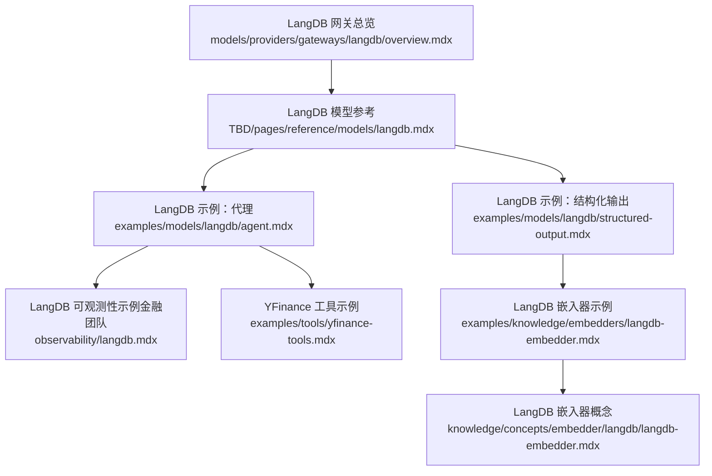
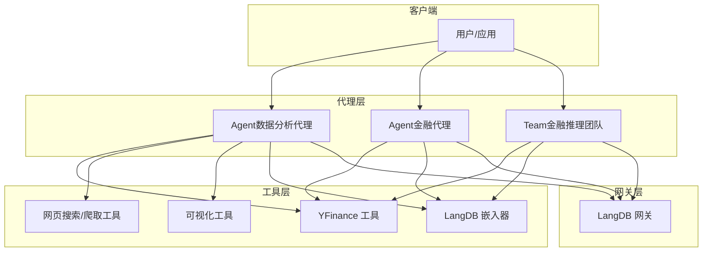
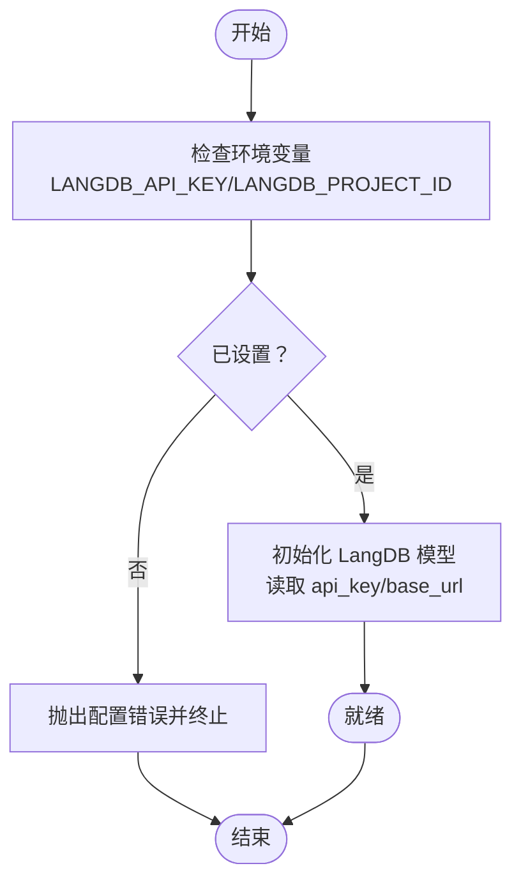
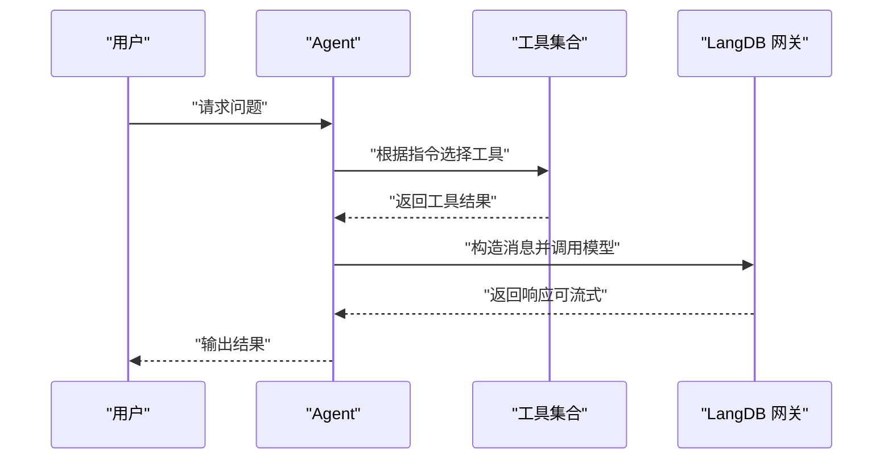
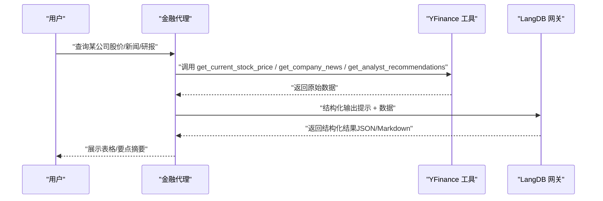
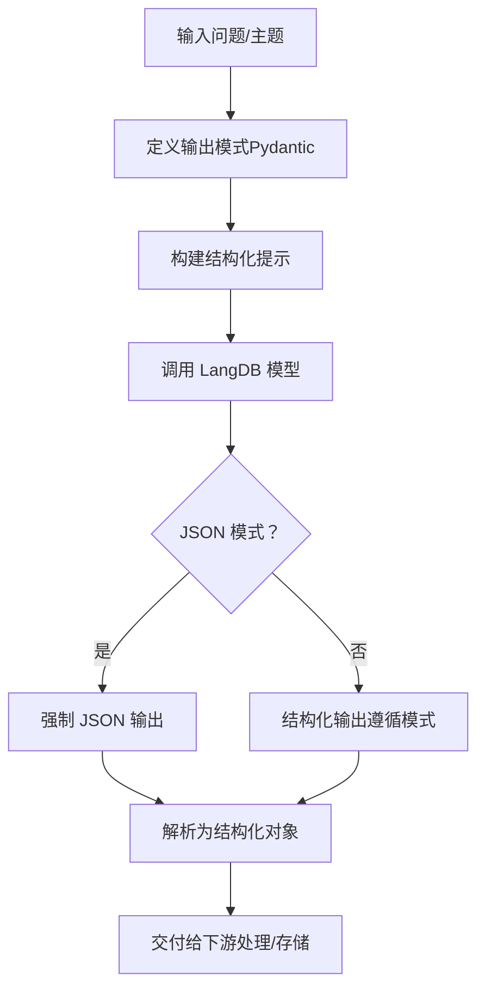
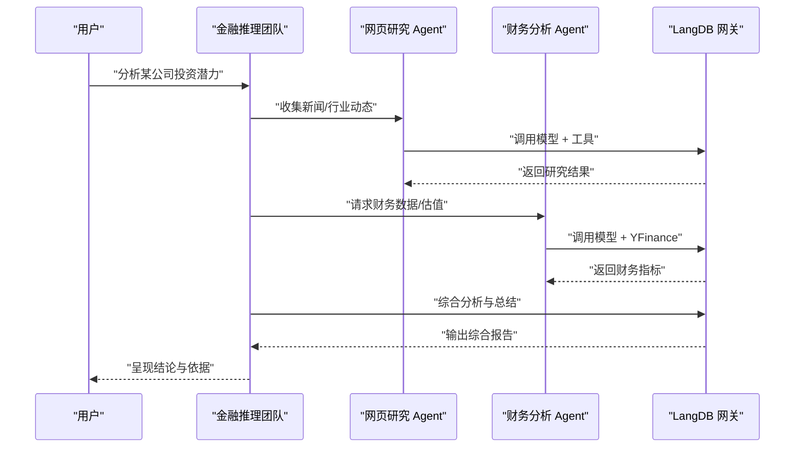
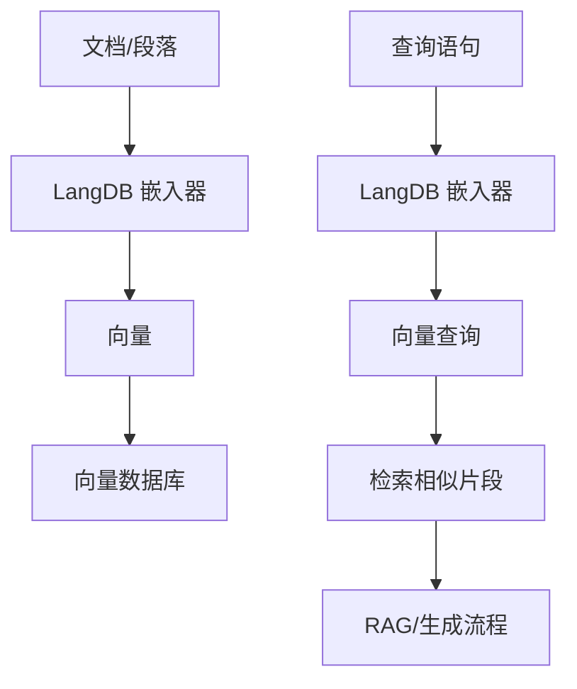
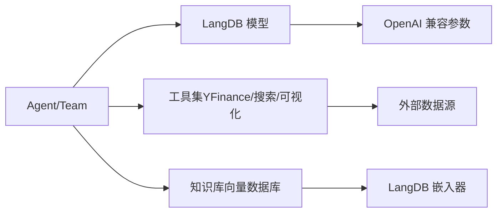

# LangDB 网关

<cite>
**本文引用的文件**
- [LangDB 网关总览](file://models/providers/gateways/langdb/overview.mdx)
- [LangDB 模型参考](file://TBD/pages/reference/models/langdb.mdx)
- [LangDB 示例：代理](file://examples/models/langdb/agent.mdx)
- [LangDB 示例：结构化输出](file://examples/models/langdb/structured-output.mdx)
- [LangDB 可观测性示例（金融团队）](file://observability/langdb.mdx)
- [YFinance 工具示例](file://examples/tools/yfinance-tools.mdx)
- [知识嵌入器：LangDB 嵌入器](file://examples/knowledge/embedders/langdb-embedder.mdx)
- [LangDB 嵌入器概念](file://knowledge/concepts/embedder/langdb/langdb-embedder.mdx)
</cite>

## 目录
1. [简介](#简介)
2. [项目结构](#项目结构)
3. [核心组件](#核心组件)
4. [架构总览](#架构总览)
5. [详细组件分析](#详细组件分析)
6. [依赖关系分析](#依赖关系分析)
7. [性能考虑](#性能考虑)
8. [故障排查指南](#故障排查指南)
9. [结论](#结论)
10. [附录](#附录)

## 简介
LangDB 是一个面向数据分析与金融领域的 AI 网关，提供对 350+ 大语言模型的统一接入，通过兼容 OpenAI 接口的方式实现安全、可控、可优化的 AI 流量治理。它支持结构化输出、工具调用、可观测性追踪，并在金融建模、市场分析、企业尽调等专业场景中具备显著优势。

LangDB 的关键价值在于：
- 统一多模型接入：通过单一网关访问多家模型供应商，简化集成与切换成本
- 安全与治理：集中鉴权、限流、审计与合规策略
- 性能与弹性：内置重试、指数退避、超时控制等机制
- 开放兼容：完全兼容 OpenAI 接口参数，便于迁移与复用现有生态

## 项目结构
本仓库中与 LangDB 相关的内容主要分布在以下位置：
- 模型网关总览与快速上手：models/providers/gateways/langdb/overview.mdx
- LangDB 模型参数与默认值：TBD/pages/reference/models/langdb.mdx
- 使用示例：examples/models/langdb/*
- 结构化输出示例：examples/models/langdb/structured-output.mdx
- 可观测性示例（金融团队协作）：observability/langdb.mdx
- 知识嵌入与检索：examples/knowledge/embedders/langdb-embedder.mdx 与 knowledge/concepts/embedder/langdb/langdb-embedder.mdx
- 金融数据工具：examples/tools/yfinance-tools.mdx

**图表来源**
- [LangDB 网关总览:1-62](file://models/providers/gateways/langdb/overview.mdx#L1-L62)
- [LangDB 模型参考:1-22](file://TBD/pages/reference/models/langdb.mdx#L1-L22)
- [LangDB 示例：代理:1-52](file://examples/models/langdb/agent.mdx#L1-L52)
- [LangDB 示例：结构化输出:1-88](file://examples/models/langdb/structured-output.mdx#L1-L88)
- [LangDB 可观测性示例（金融团队）:88-131](file://observability/langdb.mdx#L88-L131)
- [YFinance 工具示例:1-161](file://examples/tools/yfinance-tools.mdx#L1-L161)
- [LangDB 嵌入器示例:1-60](file://examples/knowledge/embedders/langdb-embedder.mdx#L1-L60)
- [LangDB 嵌入器概念:1-200](file://knowledge/concepts/embedder/langdb/langdb-embedder.mdx#L1-L200)

**章节来源**
- [LangDB 网关总览:1-62](file://models/providers/gateways/langdb/overview.mdx#L1-L62)
- [LangDB 模型参考:1-22](file://TBD/pages/reference/models/langdb.mdx#L1-L22)

## 核心组件
- LangDB 模型封装：提供 id、name、provider、api_key、base_url 等参数；支持 OpenAI 兼容接口与常用参数；具备重试、延迟与指数退避等弹性机制
- 认证与环境变量：通过 LANGDB_API_KEY 与可选的 LANGDB_PROJECT_ID 进行鉴权
- 示例与最佳实践：包含基础代理、结构化输出、金融分析、团队协作与可观测性追踪等场景

**章节来源**
- [LangDB 网关总览:10-62](file://models/providers/gateways/langdb/overview.mdx#L10-L62)
- [LangDB 模型参考:8-22](file://TBD/pages/reference/models/langdb.mdx#L8-L22)

## 架构总览
LangDB 以“网关 + 代理 + 工具”的分层架构工作：
- 网关层：LangDB 提供统一的 OpenAI 兼容接口，负责路由、鉴权、限流与弹性
- 代理层：Agent/Team 封装业务逻辑与提示工程，按需启用结构化输出、工具调用与流式输出
- 工具层：金融数据（如 YFinance）、网页搜索/爬取、可视化等工具与知识库结合，形成端到端解决方案

**图表来源**
- [LangDB 示例：代理:1-52](file://examples/models/langdb/agent.mdx#L1-L52)
- [LangDB 示例：结构化输出:1-88](file://examples/models/langdb/structured-output.mdx#L1-L88)
- [LangDB 可观测性示例（金融团队）:88-131](file://observability/langdb.mdx#L88-L131)
- [YFinance 工具示例:1-161](file://examples/tools/yfinance-tools.mdx#L1-L161)
- [LangDB 嵌入器示例:1-60](file://examples/knowledge/embedders/langdb-embedder.mdx#L1-L60)

## 详细组件分析

### 认证与 API 配置
- 环境变量
  - LANGDB_API_KEY：必填，用于鉴权
  - LANGDB_PROJECT_ID：可选，用于项目级资源隔离或计费归属
- 设置方式（示例）
  - macOS/Linux：导出环境变量
  - Windows：使用 setx 设置系统环境变量
- 参数映射
  - api_key：默认从环境变量读取，也可显式传入
  - base_url：默认指向 LangDB 生产接口，可按需替换

**图表来源**
- [LangDB 网关总览:10-27](file://models/providers/gateways/langdb/overview.mdx#L10-L27)
- [LangDB 模型参考:10-16](file://TBD/pages/reference/models/langdb.mdx#L10-L16)

**章节来源**
- [LangDB 网关总览:10-27](file://models/providers/gateways/langdb/overview.mdx#L10-L27)
- [LangDB 模型参考:10-16](file://TBD/pages/reference/models/langdb.mdx#L10-L16)

### 基础代理（数据分析/通用场景）
- 场景定位：适合通用问答、内容生成、简单数据分析
- 关键点
  - 通过 LangDB(id="...") 指定模型
  - 支持同步与流式输出
  - 可结合工具（如网页搜索）增强上下文
- 示例路径
  - [LangDB 示例：代理:1-52](file://examples/models/langdb/agent.mdx#L1-L52)

**图表来源**
- [LangDB 示例：代理:16-38](file://examples/models/langdb/agent.mdx#L16-L38)

**章节来源**
- [LangDB 示例：代理:1-52](file://examples/models/langdb/agent.mdx#L1-L52)

### 金融代理（股票价格、公司信息、分析师观点）
- 场景定位：面向金融分析师、投资顾问，提供实时股价、财务指标、新闻与研报摘要
- 关键点
  - 使用 YFinance 工具获取实时与历史数据
  - 结合 LangDB 的结构化输出能力，规范返回格式
  - 支持 Markdown 表格展示，提升可读性
- 示例路径
  - [YFinance 工具示例:1-161](file://examples/tools/yfinance-tools.mdx#L1-L161)
  - [LangDB 示例：代理:1-52](file://examples/models/langdb/agent.mdx#L1-L52)

**图表来源**
- [YFinance 工具示例:22-95](file://examples/tools/yfinance-tools.mdx#L22-L95)
- [LangDB 示例：代理:16-21](file://examples/models/langdb/agent.mdx#L16-L21)

**章节来源**
- [YFinance 工具示例:1-161](file://examples/tools/yfinance-tools.mdx#L1-L161)
- [LangDB 示例：代理:1-52](file://examples/models/langdb/agent.mdx#L1-L52)

### 数据分析师代理（结构化输出与 JSON 模式）
- 场景定位：需要稳定、可解析的数据结构输出（如报告模板、评分表、清单）
- 关键点
  - 通过 output_schema 定义输出模式
  - 支持 use_json_mode 与结构化输出两种方式
  - 适用于报表生成、评分、分类标注等任务
- 示例路径
  - [LangDB 示例：结构化输出:1-88](file://examples/models/langdb/structured-output.mdx#L1-L88)

**图表来源**
- [LangDB 示例：结构化输出:25-57](file://examples/models/langdb/structured-output.mdx#L25-L57)

**章节来源**
- [LangDB 示例：结构化输出:1-88](file://examples/models/langdb/structured-output.mdx#L1-L88)

### 金融推理团队（多智能体协作与可观测性）
- 场景定位：跨职能团队协作，结合网页研究与财务分析，形成综合洞察
- 关键点
  - 团队内部分工：网页研究 Agent + 财务分析 Agent
  - 协同指令：融合基本面与市场情绪
  - 可观测性：通过 LangDB 仪表盘查看完整线程与调用轨迹
- 示例路径
  - [LangDB 可观测性示例（金融团队）:88-131](file://observability/langdb.mdx#L88-L131)

**图表来源**
- [LangDB 可观测性示例（金融团队）:88-117](file://observability/langdb.mdx#L88-L117)

**章节来源**
- [LangDB 可观测性示例（金融团队）:88-131](file://observability/langdb.mdx#L88-L131)

### 知识嵌入与检索（LangDB 嵌入器）
- 场景定位：将文档转换为向量，存入向量数据库，支持 RAG 与检索增强生成
- 关键点
  - 使用 LangDBEmbedder 获取文本向量
  - 可与知识库（如 pgvector、LanceDB 等）配合
  - 支持批量嵌入与持久化
- 示例路径
  - [LangDB 嵌入器示例:1-60](file://examples/knowledge/embedders/langdb-embedder.mdx#L1-L60)
  - [LangDB 嵌入器概念:1-200](file://knowledge/concepts/embedder/langdb/langdb-embedder.mdx#L1-L200)

**图表来源**
- [LangDB 嵌入器示例:14-35](file://examples/knowledge/embedders/langdb-embedder.mdx#L14-L35)
- [LangDB 嵌入器概念:1-200](file://knowledge/concepts/embedder/langdb/langdb-embedder.mdx#L1-L200)

**章节来源**
- [LangDB 嵌入器示例:1-60](file://examples/knowledge/embedders/langdb-embedder.mdx#L1-L60)
- [LangDB 嵌入器概念:1-200](file://knowledge/concepts/embedder/langdb/langdb-embedder.mdx#L1-L200)

## 依赖关系分析
- LangDB 与 OpenAI 兼容接口：LangDB 模型参数与行为与 OpenAI 接近，便于迁移
- 工具依赖：金融代理依赖 YFinance 工具；网页研究依赖搜索/爬取工具；团队协作依赖 LangDB 的多轮对话与可观测性
- 知识库依赖：嵌入器与向量数据库（如 pgvector、LanceDB）配合，支撑检索增强

**图表来源**
- [LangDB 模型参考:10-22](file://TBD/pages/reference/models/langdb.mdx#L10-L22)
- [LangDB 示例：代理:1-52](file://examples/models/langdb/agent.mdx#L1-L52)
- [YFinance 工具示例:1-161](file://examples/tools/yfinance-tools.mdx#L1-L161)
- [LangDB 嵌入器示例:1-60](file://examples/knowledge/embedders/langdb-embedder.mdx#L1-L60)

**章节来源**
- [LangDB 模型参考:10-22](file://TBD/pages/reference/models/langdb.mdx#L10-L22)
- [LangDB 示例：代理:1-52](file://examples/models/langdb/agent.mdx#L1-L52)
- [YFinance 工具示例:1-161](file://examples/tools/yfinance-tools.mdx#L1-L161)
- [LangDB 嵌入器示例:1-60](file://examples/knowledge/embedders/langdb-embedder.mdx#L1-L60)

## 性能考虑
- 弹性与重试
  - retries：失败重试次数
  - delay_between_retries：重试间隔（秒）
  - exponential_backoff：启用指数退避，降低雪崩风险
- 流式输出
  - 在长文本或复杂分析场景下，开启流式输出可改善用户体验
- 工具调用优化
  - 合理选择工具范围（include_tools/exclude_tools），减少不必要的网络往返
- 模型选择
  - 根据任务复杂度与成本预算选择合适模型 ID；在金融与数据分析场景优先考虑更强推理与数学能力的模型

**章节来源**
- [LangDB 模型参考:18-21](file://TBD/pages/reference/models/langdb.mdx#L18-L21)
- [YFinance 工具示例:35-74](file://examples/tools/yfinance-tools.mdx#L35-L74)

## 故障排查指南
- 配置类问题
  - 缺少 LANGDB_API_KEY：请在环境中设置后重试
  - base_url 不可用：确认网络可达或切换至可用节点
- 调用类问题
  - 超时/频繁重试：适当提高 delay 或启用指数退避
  - 结果不稳定：尝试固定 seed 或使用更稳定的模型 ID
- 工具类问题
  - YFinance 请求失败：检查网络与 SSL 设置；必要时临时禁用校验（仅测试环境）
  - 工具权限不足：确认 include_tools/exclude_tools 配置是否正确
- 可观测性
  - 使用 LangDB 仪表盘查看线程与调用轨迹，定位慢请求与异常

**章节来源**
- [LangDB 网关总览:10-27](file://models/providers/gateways/langdb/overview.mdx#L10-L27)
- [LangDB 模型参考:18-21](file://TBD/pages/reference/models/langdb.mdx#L18-L21)
- [YFinance 工具示例:98-112](file://examples/tools/yfinance-tools.mdx#L98-L112)

## 结论
LangDB 为数据分析与金融领域提供了统一、安全、可治理且高性能的 AI 接入方案。通过兼容 OpenAI 接口、完善的参数体系、丰富的示例与可观测性能力，用户可以快速构建从基础代理到复杂金融推理团队的多种专业应用。建议在生产环境中结合工具权限控制、结构化输出与弹性重试策略，持续优化性能与稳定性。

## 附录
- 快速开始
  - 设置环境变量 LANGDB_API_KEY 与 LANGDB_PROJECT_ID
  - 选择合适的模型 ID 并初始化 LangDB 模型
  - 在 Agent 中启用所需工具与结构化输出
- 参考路径
  - [LangDB 网关总览:1-62](file://models/providers/gateways/langdb/overview.mdx#L1-L62)
  - [LangDB 模型参考:1-22](file://TBD/pages/reference/models/langdb.mdx#L1-L22)
  - [LangDB 示例：代理:1-52](file://examples/models/langdb/agent.mdx#L1-L52)
  - [LangDB 示例：结构化输出:1-88](file://examples/models/langdb/structured-output.mdx#L1-L88)
  - [LangDB 可观测性示例（金融团队）:88-131](file://observability/langdb.mdx#L88-L131)
  - [YFinance 工具示例:1-161](file://examples/tools/yfinance-tools.mdx#L1-L161)
  - [LangDB 嵌入器示例:1-60](file://examples/knowledge/embedders/langdb-embedder.mdx#L1-L60)
  - [LangDB 嵌入器概念:1-200](file://knowledge/concepts/embedder/langdb/langdb-embedder.mdx#L1-L200)