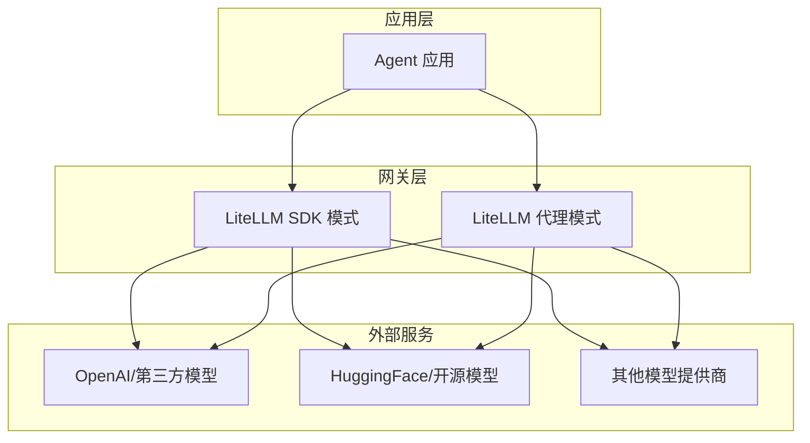
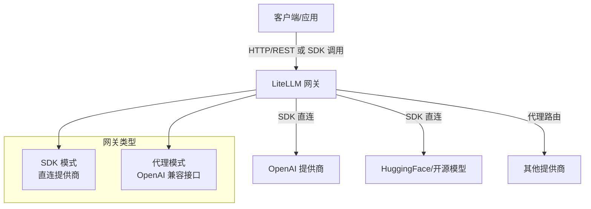
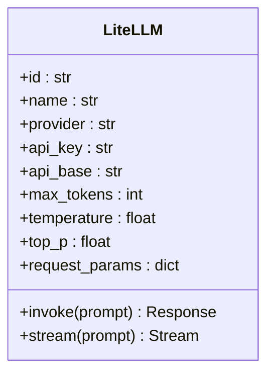
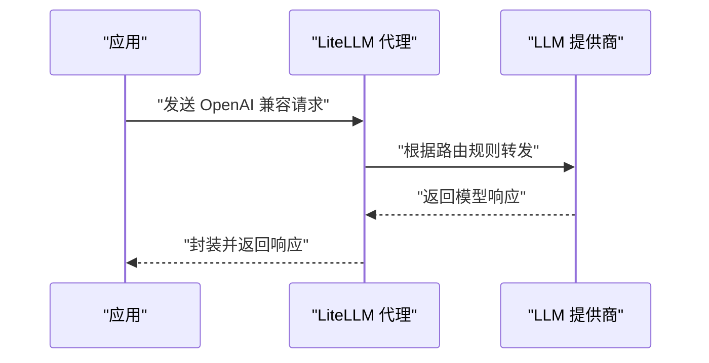
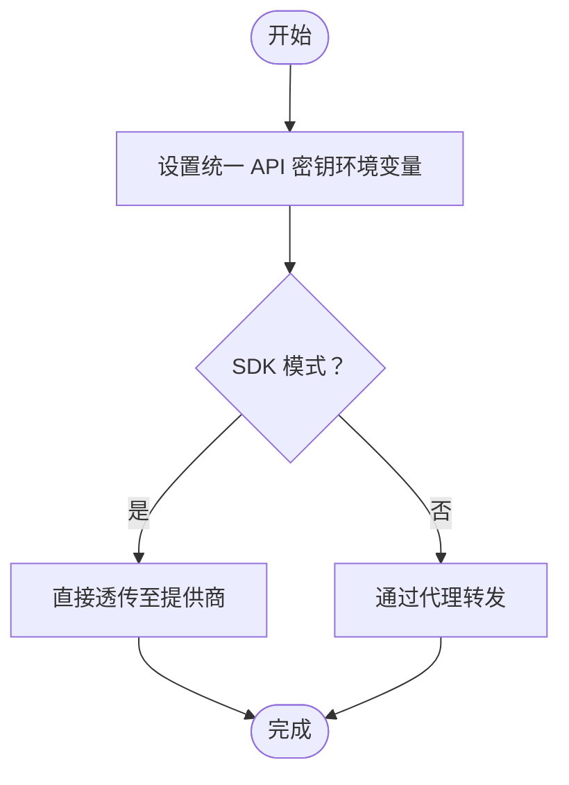
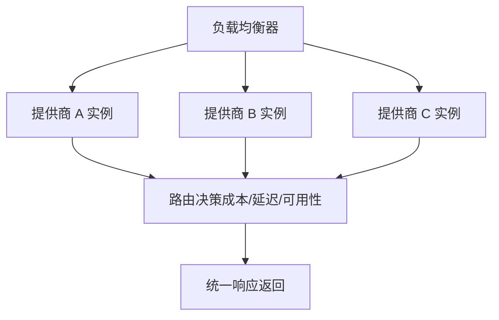
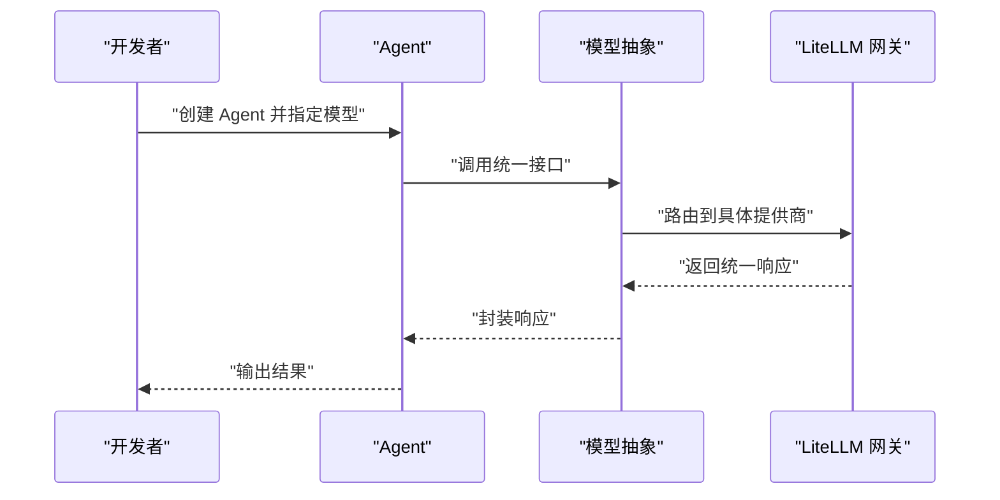
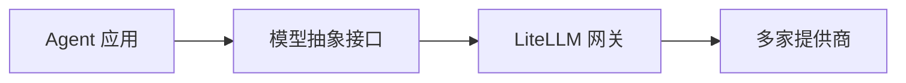

# LiteLLM 网关

<cite>
**本文引用的文件**
- [models/providers/gateways/litellm/overview.mdx](file://models/providers/gateways/litellm/overview.mdx)
- [models/providers/gateways/litellm-openai/overview.mdx](file://models/providers/gateways/litellm-openai/overview.mdx)
- [examples/models/litellm/basic.mdx](file://examples/models/litellm/basic.mdx)
- [examples/models/litellm/basic-gpt.mdx](file://examples/models/litellm/basic-gpt.mdx)
- [examples/models/litellm/audio-input-agent.mdx](file://examples/models/litellm/audio-input-agent.mdx)
- [examples/models/litellm/db.mdx](file://examples/models/litellm/db.mdx)
- [examples/models/litellm/image-agent-bytes.mdx](file://examples/models/litellm/image-agent-bytes.mdx)
- [cookbook/models/overview.mdx](file://cookbook/models/overview.mdx)
- [agent-os/security/overview.mdx](file://agent-os/security/overview.mdx)
- [agent-os/api/authentication.mdx](file://agent-os/api/authentication.mdx)
- [reference-api/overview.mdx](file://reference-api/overview.mdx)
</cite>

## 目录
1. [简介](#简介)
2. [项目结构](#项目结构)
3. [核心组件](#核心组件)
4. [架构总览](#架构总览)
5. [详细组件分析](#详细组件分析)
6. [依赖关系分析](#依赖关系分析)
7. [性能考虑](#性能考虑)
8. [故障排查指南](#故障排查指南)
9. [结论](#结论)
10. [附录](#附录)

## 简介
本文件面向希望在应用中以统一方式接入多种大语言模型（LLM）提供商的开发者，系统性介绍 LiteLLM 作为统一 LLM API 网关的能力与优势，并结合仓库中的示例与配置说明，帮助你快速完成认证配置、API 密钥管理、多提供商路由、负载均衡与故障转移、模型选择策略、成本优化与性能监控等关键主题。同时，我们强调 LiteLLM 在作为中间层时的灵活性与可扩展性，使你在不修改业务代码的情况下切换不同模型与提供商。

## 项目结构
围绕 LiteLLM 的使用，仓库提供了两类集成路径与丰富的示例场景：
- 直接 SDK 集成：通过 LiteLLM Python SDK 直连各提供商，适合灵活控制与细粒度参数配置。
- 代理服务器集成：通过 LiteLLM 代理服务对外暴露 OpenAI 兼容接口，便于统一入口与路由。

此外，示例覆盖了文本对话、图像理解、音频输入、数据库检索增强、以及多模式交互等典型用法，便于快速上手与迁移。

图表来源
- [models/providers/gateways/litellm/overview.mdx:1-91](file://models/providers/gateways/litellm/overview.mdx#L1-L91)
- [models/providers/gateways/litellm-openai/overview.mdx:1-64](file://models/providers/gateways/litellm-openai/overview.mdx#L1-L64)

章节来源
- [models/providers/gateways/litellm/overview.mdx:14-28](file://models/providers/gateways/litellm/overview.mdx#L14-L28)
- [models/providers/gateways/litellm-openai/overview.mdx:7-23](file://models/providers/gateways/litellm-openai/overview.mdx#L7-L23)

## 核心组件
- LiteLLM SDK 模式
  - 通过 LiteLLM Python SDK 直接调用，支持多种模型标识与参数，如温度、采样策略、最大输出长度等。
  - 支持直接使用 Hugging Face 等开源模型镜像，便于本地或私有化部署。
- LiteLLM 代理模式
  - 将 LiteLLM 作为 OpenAI 兼容代理，统一入口便于路由到不同后端模型。
  - 适合需要集中管理与可观测性的生产环境。

章节来源
- [models/providers/gateways/litellm/overview.mdx:30-91](file://models/providers/gateways/litellm/overview.mdx#L30-L91)
- [models/providers/gateways/litellm-openai/overview.mdx:25-64](file://models/providers/gateways/litellm-openai/overview.mdx#L25-L64)

## 架构总览
下图展示了 LiteLLM 作为统一网关的两种接入方式及其与外部提供商的关系：

图表来源
- [models/providers/gateways/litellm/overview.mdx:9-12](file://models/providers/gateways/litellm/overview.mdx#L9-L12)
- [models/providers/gateways/litellm-openai/overview.mdx:7-11](file://models/providers/gateways/litellm-openai/overview.mdx#L7-L11)

## 详细组件分析

### 组件一：LiteLLM SDK 模式
- 特点
  - 直接使用 LiteLLM SDK，无需额外代理进程，延迟更低。
  - 支持多种模型标识（含 Hugging Face 镜像），便于混合部署。
- 关键参数
  - 模型标识、显示名称、提供商名、API 密钥、基础请求地址、最大输出长度、采样温度、Top-p、附加请求参数等。
- 使用要点
  - API 密钥统一使用环境变量，便于在不同提供商间复用。
  - 可与工具、存储、多媒体输入（图像、音频）等模块组合使用。

图表来源
- [models/providers/gateways/litellm/overview.mdx:72-87](file://models/providers/gateways/litellm/overview.mdx#L72-L87)

章节来源
- [models/providers/gateways/litellm/overview.mdx:30-91](file://models/providers/gateways/litellm/overview.mdx#L30-L91)

### 组件二：LiteLLM 代理模式
- 特点
  - 启动 LiteLLM 代理，对外暴露 OpenAI 兼容接口，便于统一路由与管理。
  - 适合多模型、多提供商的集中调度与可观测性。
- 关键参数
  - 基础 URL 指向代理服务器，默认地址可在配置中调整。
- 使用要点
  - 与 OpenAI 兼容接口对接，便于现有生态平滑迁移。

图表来源
- [models/providers/gateways/litellm-openai/overview.mdx:25-41](file://models/providers/gateways/litellm-openai/overview.mdx#L25-L41)

章节来源
- [models/providers/gateways/litellm-openai/overview.mdx:7-64](file://models/providers/gateways/litellm-openai/overview.mdx#L7-L64)

### 组件三：认证与密钥管理
- 环境变量
  - 所有提供商均通过统一的环境变量注入 API 密钥，减少配置复杂度。
- AgentOS 安全机制
  - 支持安全密钥认证与 RBAC（基于 JWT）两种方式，生产推荐 RBAC。
  - 可通过控制平面启用授权与密钥轮换，确保访问安全。

图表来源
- [models/providers/gateways/litellm/overview.mdx:23-28](file://models/providers/gateways/litellm/overview.mdx#L23-L28)
- [agent-os/security/overview.mdx:14-41](file://agent-os/security/overview.mdx#L14-L41)

章节来源
- [models/providers/gateways/litellm/overview.mdx:23-28](file://models/providers/gateways/litellm/overview.mdx#L23-L28)
- [agent-os/security/overview.mdx:14-41](file://agent-os/security/overview.mdx#L14-L41)
- [agent-os/api/authentication.mdx:54-103](file://agent-os/api/authentication.mdx#L54-L103)
- [reference-api/overview.mdx:9-22](file://reference-api/overview.mdx#L9-L22)

### 组件四：多提供商路由、负载均衡与故障转移
- 路由策略
  - 通过 LiteLLM 的路由配置，可按模型、成本、性能指标进行动态选择。
  - 结合代理模式，可实现对多个后端提供商的统一入口与流量分发。
- 负载均衡与故障转移
  - 在代理层配置多后端实例，实现健康检查与自动切换，提升可用性。
- 成本优化
  - 基于响应时间、Token 价格与上下文长度等指标，自动选择性价比最优的后端。

图表来源
- [models/providers/gateways/litellm-openai/overview.mdx:7-11](file://models/providers/gateways/litellm-openai/overview.mdx#L7-L11)

章节来源
- [models/providers/gateways/litellm-openai/overview.mdx:7-11](file://models/providers/gateways/litellm-openai/overview.mdx#L7-L11)

### 组件五：模型选择策略与统一接口
- 统一接口
  - 通过相同的 Agent 接口与模型抽象，实现“一行代码切换提供商”的能力。
- 模型选择
  - 可根据任务类型（文本、视觉、音频）、成本预算、延迟要求等维度进行策略化选择。
- 示例参考
  - 文本对话、图像理解、音频输入、数据库检索增强等场景均有示例可循。

图表来源
- [cookbook/models/overview.mdx:9-19](file://cookbook/models/overview.mdx#L9-L19)

章节来源
- [cookbook/models/overview.mdx:9-19](file://cookbook/models/overview.mdx#L9-L19)

### 组件六：使用示例与最佳实践

#### 场景一：文本对话（基础）
- 适用：快速验证与原型开发。
- 关键点：模型标识、流式输出、异步调用。
- 示例路径
  - [examples/models/litellm/basic.mdx:1-61](file://examples/models/litellm/basic.mdx#L1-L61)
  - [examples/models/litellm/basic-gpt.mdx:1-50](file://examples/models/litellm/basic-gpt.mdx#L1-L50)

章节来源
- [examples/models/litellm/basic.mdx:18-47](file://examples/models/litellm/basic.mdx#L18-L47)
- [examples/models/litellm/basic-gpt.mdx:20-28](file://examples/models/litellm/basic-gpt.mdx#L20-L28)

#### 场景二：图像处理
- 适用：视觉理解、内容生成与检索增强。
- 关键点：图像输入格式、工具链配合（如网络搜索）。
- 示例路径
  - [examples/models/litellm/image-agent-bytes.mdx:1-69](file://examples/models/litellm/image-agent-bytes.mdx#L1-L69)

章节来源
- [examples/models/litellm/image-agent-bytes.mdx:25-47](file://examples/models/litellm/image-agent-bytes.mdx#L25-L47)

#### 场景三：音频输入代理
- 适用：语音转文字、音频问答与多模态交互。
- 关键点：音频模型选择、流式输出。
- 示例路径
  - [examples/models/litellm/audio-input-agent.mdx:1-59](file://examples/models/litellm/audio-input-agent.mdx#L1-L59)

章节来源
- [examples/models/litellm/audio-input-agent.mdx:29-37](file://examples/models/litellm/audio-input-agent.mdx#L29-L37)

#### 场景四：数据库集成（RAG）
- 适用：检索增强生成、带上下文的历史问答。
- 关键点：数据库连接、工具集成、历史上下文注入。
- 示例路径
  - [examples/models/litellm/db.mdx:1-53](file://examples/models/litellm/db.mdx#L1-L53)

章节来源
- [examples/models/litellm/db.mdx:23-31](file://examples/models/litellm/db.mdx#L23-L31)

## 依赖关系分析
- 组件耦合
  - Agent 仅依赖模型抽象接口，与 LiteLLM 网关解耦；LiteLLM 再与具体提供商解耦。
- 外部依赖
  - LiteLLM SDK 与代理服务依赖统一的 API 密钥环境变量。
  - 生产环境建议结合 RBAC 与 API 网关实现统一鉴权与限流。
- 循环依赖
  - 无直接循环依赖，职责清晰：应用层 -> 网关层 -> 提供商层。

图表来源
- [cookbook/models/overview.mdx:9-19](file://cookbook/models/overview.mdx#L9-L19)
- [models/providers/gateways/litellm/overview.mdx:9-12](file://models/providers/gateways/litellm/overview.mdx#L9-L12)

章节来源
- [cookbook/models/overview.mdx:9-19](file://cookbook/models/overview.mdx#L9-L19)
- [models/providers/gateways/litellm/overview.mdx:9-12](file://models/providers/gateways/litellm/overview.mdx#L9-L12)

## 性能考虑
- 延迟与吞吐
  - SDK 直连通常具有更低的网络往返延迟；代理模式便于集中优化与缓存。
- 流式输出
  - 对长文本与多模态任务，优先使用流式输出以改善用户体验。
- 资源与成本
  - 基于 Token 计费与上下文长度，合理设置 max_tokens 与采样参数，避免不必要的开销。
- 可观测性
  - 在代理层开启日志与指标上报，结合 APM 工具进行端到端追踪与瓶颈定位。

## 故障排查指南
- 认证失败
  - 确认是否启用 RBAC 或安全密钥认证，检查令牌或密钥是否正确配置。
- 代理不可达
  - 校验代理地址与端口，确认网络连通性与防火墙策略。
- 模型不可用
  - 检查模型标识是否正确，确认提供商可用性与配额状态。
- 性能问题
  - 分析请求耗时分布，识别慢查询与热点模型，必要时引入缓存与降级策略。

章节来源
- [agent-os/security/overview.mdx:14-41](file://agent-os/security/overview.mdx#L14-L41)
- [agent-os/api/authentication.mdx:54-103](file://agent-os/api/authentication.mdx#L54-L103)
- [models/providers/gateways/litellm-openai/overview.mdx:19-23](file://models/providers/gateways/litellm-openai/overview.mdx#L19-L23)

## 结论
LiteLLM 作为统一网关，既能在开发阶段以 SDK 直连快速验证，也能在生产阶段通过代理实现统一入口、路由与可观测性。结合仓库提供的认证、示例与最佳实践，你可以以最小成本完成多提供商的统一管理与灵活切换，显著降低维护成本并提升系统的弹性与可扩展性。

## 附录
- 快速开始
  - 安装依赖与设置 API 密钥，参考以下文件路径：
    - [models/providers/gateways/litellm/overview.mdx:18-28](file://models/providers/gateways/litellm/overview.mdx#L18-L28)
    - [models/providers/gateways/litellm-openai/overview.mdx:15-23](file://models/providers/gateways/litellm-openai/overview.mdx#L15-L23)
- 示例清单
  - 文本对话、图像处理、音频输入、数据库集成等示例路径：
    - [examples/models/litellm/basic.mdx:1-61](file://examples/models/litellm/basic.mdx#L1-L61)
    - [examples/models/litellm/basic-gpt.mdx:1-50](file://examples/models/litellm/basic-gpt.mdx#L1-L50)
    - [examples/models/litellm/image-agent-bytes.mdx:1-69](file://examples/models/litellm/image-agent-bytes.mdx#L1-L69)
    - [examples/models/litellm/audio-input-agent.mdx:1-59](file://examples/models/litellm/audio-input-agent.mdx#L1-L59)
    - [examples/models/litellm/db.mdx:1-53](file://examples/models/litellm/db.mdx#L1-L53)
- 更多提供商与统一接口
  - 参考模型示例总览，了解如何以相同接口适配多家提供商：
    - [cookbook/models/overview.mdx:46-73](file://cookbook/models/overview.mdx#L46-L73)