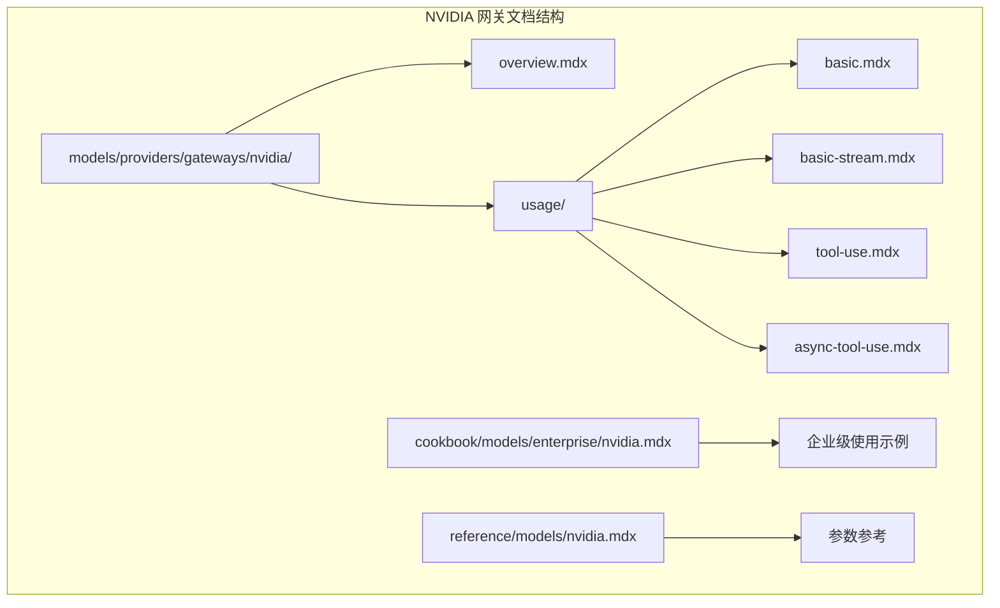
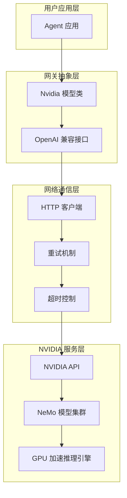
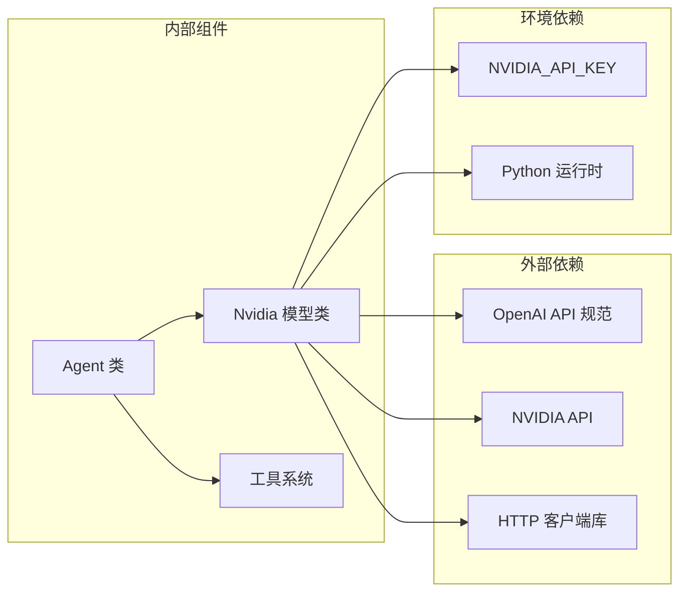

# NVIDIA 网关

<cite>
**本文档引用的文件**
- [models/providers/gateways/nvidia/overview.mdx](file://models/providers/gateways/nvidia/overview.mdx)
- [cookbook/models/enterprise/nvidia.mdx](file://cookbook/models/enterprise/nvidia.mdx)
- [reference/models/nvidia.mdx](file://reference/models/nvidia.mdx)
- [models/providers/gateways/nvidia/usage/basic.mdx](file://models/providers/gateways/nvidia/usage/basic.mdx)
- [models/providers/gateways/nvidia/usage/basic-stream.mdx](file://models/providers/gateways/nvidia/usage/basic-stream.mdx)
- [models/providers/gateways/nvidia/usage/tool-use.mdx](file://models/providers/gateways/nvidia/usage/tool-use.mdx)
- [models/providers/gateways/nvidia/usage/async-tool-use.mdx](file://models/providers/gateways/nvidia/usage/async-tool-use.mdx)
- [examples/models/nvidia/retry.mdx](file://examples/models/nvidia/retry.mdx)
</cite>

## 目录
1. [简介](#简介)
2. [项目结构](#项目结构)
3. [核心组件](#核心组件)
4. [架构概览](#架构概览)
5. [详细组件分析](#详细组件分析)
6. [依赖关系分析](#依赖关系分析)
7. [性能考虑](#性能考虑)
8. [故障排除指南](#故障排除指南)
9. [结论](#结论)
10. [附录](#附录)

## 简介

NVIDIA 网关是 Agno 框架中用于访问 NVIDIA 高性能语言模型的接口层。NVIDIA 作为全球领先的 GPU 加速和 AI 计算提供商，其 NeMo 框架提供了优化高级自然语言处理任务的语言模型套件。这些模型专为大规模工作负载设计，利用 GPU 加速实现更快的推理和训练。

NVIDIA 的硬件加速优势主要体现在：
- **并行计算能力**：GPU 拥有数千个小型计算核心，能够同时处理大量数据点
- **内存带宽优势**：相比 CPU，GPU 具有更高的内存带宽，适合大规模矩阵运算
- **专用 AI 指令集**：NVIDIA Tensor Cores 专门为深度学习计算优化
- **可扩展性**：支持多 GPU 和分布式训练

## 项目结构

NVIDIA 网关相关的文档分布在以下目录结构中：



**图表来源**
- [models/providers/gateways/nvidia/overview.mdx:1-63](file://models/providers/gateways/nvidia/overview.mdx#L1-L63)
- [cookbook/models/enterprise/nvidia.mdx:1-66](file://cookbook/models/enterprise/nvidia.mdx#L1-L66)
- [reference/models/nvidia.mdx:1-21](file://reference/models/nvidia.mdx#L1-L21)

**章节来源**
- [models/providers/gateways/nvidia/overview.mdx:1-63](file://models/providers/gateways/nvidia/overview.mdx#L1-L63)
- [cookbook/models/enterprise/nvidia.mdx:1-66](file://cookbook/models/enterprise/nvidia.mdx#L1-L66)
- [reference/models/nvidia.mdx:1-21](file://reference/models/nvidia.mdx#L1-L21)

## 核心组件

### Nvidia 模型类

NVIDIA 网关的核心是 `Nvidia` 类，它扩展了 OpenAI 兼容接口，支持大多数 OpenAI 模型参数。该类提供了以下关键特性：

#### 主要参数配置

| 参数名 | 类型 | 默认值 | 描述 |
|--------|------|--------|------|
| `id` | `str` | `"nvidia/llama-3.1-nemotron-70b-instruct"` | 要使用的 NVIDIA 模型标识符 |
| `name` | `str` | `"NVIDIA"` | 模型显示名称 |
| `provider` | `str` | `"NVIDIA"` | 提供商名称 |
| `api_key` | `Optional[str]` | `None` | NVIDIA API 密钥（默认使用环境变量） |
| `base_url` | `str` | `"https://integrate.api.nvidia.com/v1"` | NVIDIA API 基础 URL |

#### 认证配置

NVIDIA 网关使用环境变量进行认证：
- **主要认证方式**：`NVIDIA_API_KEY` 环境变量
- **API 密钥获取**：通过 [NVIDIA Build 平台](https://build.nvidia.com/explore/discover) 获取

**章节来源**
- [models/providers/gateways/nvidia/overview.mdx:15-30](file://models/providers/gateways/nvidia/overview.mdx#L15-L30)
- [reference/models/nvidia.mdx:8-21](file://reference/models/nvidia.mdx#L8-L21)

## 架构概览

NVIDIA 网关采用分层架构设计，提供从基础到高级功能的完整支持：



**图表来源**
- [models/providers/gateways/nvidia/overview.mdx:7-11](file://models/providers/gateways/nvidia/overview.mdx#L7-L11)
- [reference/models/nvidia.mdx:17-20](file://reference/models/nvidia.mdx#L17-L20)

## 详细组件分析

### 基础使用示例

#### 基本文本生成

最简单的使用方式是创建一个带有 NVIDIA 模型的 Agent：

```python
from agno.agent import Agent
from agno.models.nvidia import Nvidia

agent = Agent(model=Nvidia(), markdown=True)
agent.print_response("Share a 2 sentence horror story")
```

#### 流式响应处理

对于需要实时反馈的应用场景，可以使用流式响应：

```python
from agno.agent import Agent
from agno.models.nvidia import Nvidia

agent = Agent(model=Nvidia(id="meta/llama-3.3-70b-instruct"), markdown=True)
agent.print_response("Explain GPU acceleration", stream=True)
```

**章节来源**
- [models/providers/gateways/nvidia/usage/basic.mdx:7-20](file://models/providers/gateways/nvidia/usage/basic.mdx#L7-L20)
- [models/providers/gateways/nvidia/usage/basic-stream.mdx:7-21](file://models/providers/gateways/nvidia/usage/basic-stream.mdx#L7-L21)

### 工具集成使用

NVIDIA 网关支持与各种工具的集成，实现更复杂的功能：

```python
from agno.agent import Agent
from agno.models.nvidia import Nvidia
from agno.tools.yfinance import YFinanceTools

agent = Agent(
    model=Nvidia(id="meta/llama-3.3-70b-instruct"),
    tools=[YFinanceTools(stock_price=True)],
    markdown=True,
)

agent.print_response("What's NVDA's stock price?", stream=True)
```

**章节来源**
- [cookbook/models/enterprise/nvidia.mdx:22-34](file://cookbook/models/enterprise/nvidia.mdx#L22-L34)

### 异步处理能力

对于高并发应用场景，NVIDIA 网关支持异步操作：

```python
import asyncio
from agno.agent import Agent
from agno.models.nvidia import Nvidia
from agno.tools.hackernews import HackerNewsTools

agent = Agent(
    model=Nvidia(id="meta/llama-3.3-70b-instruct"),
    tools=[HackerNewsTools()],
    markdown=True,
)

asyncio.run(agent.aprint_response("Whats happening in France?", stream=True))
```

**章节来源**
- [models/providers/gateways/nvidia/usage/async-tool-use.mdx:7-22](file://models/providers/gateways/nvidia/usage/async-tool-use.mdx#L7-L22)

### 结构化输出支持

NVIDIA 网关支持 Pydantic 模型的结构化输出：

```python
from pydantic import BaseModel, Field
from agno.agent import Agent
from agno.models.nvidia import Nvidia

class Summary(BaseModel):
    title: str = Field(..., description="Title")
    key_points: list[str] = Field(..., description="Key points")

agent = Agent(
    model=Nvidia(id="meta/llama-3.3-70b-instruct"),
    output_schema=Summary,
)

agent.print_response("Summarize CUDA programming benefits")
```

**章节来源**
- [cookbook/models/enterprise/nvidia.mdx:36-53](file://cookbook/models/enterprise/nvidia.mdx#L36-L53)

### 重试机制详解

NVIDIA 网关提供了完善的错误处理和重试机制：

```python
from agno.agent import Agent
from agno.models.nvidia import Nvidia

agent = Agent(
    model=Nvidia(
        id="nvidia-wrong-id",
        retries=3,  # 重试次数
        delay_between_retries=1,  # 重试间隔（秒）
        exponential_backoff=True,  # 指数退避
    ),
)
```

重试机制的关键参数：
- **retries**：最大重试次数，默认 0（禁用重试）
- **delay_between_retries**：重试间隔时间（秒），默认 1
- **exponential_backoff**：是否启用指数退避，默认 False

**章节来源**
- [examples/models/nvidia/retry.mdx:6-26](file://examples/models/nvidia/retry.mdx#L6-L26)
- [reference/models/nvidia.mdx:17-20](file://reference/models/nvidia.mdx#L17-L20)

## 依赖关系分析

NVIDIA 网关的依赖关系相对简洁，主要依赖于 OpenAI 兼容接口：



**图表来源**
- [models/providers/gateways/nvidia/overview.mdx:15-17](file://models/providers/gateways/nvidia/overview.mdx#L15-L17)
- [reference/models/nvidia.mdx:15-16](file://reference/models/nvidia.mdx#L15-L16)

**章节来源**
- [models/providers/gateways/nvidia/overview.mdx:15-17](file://models/providers/gateways/nvidia/overview.mdx#L15-L17)
- [reference/models/nvidia.mdx:15-16](file://reference/models/nvidia.mdx#L15-L16)

## 性能考虑

### GPU 加速优势

NVIDIA 网关充分利用 GPU 的并行计算能力：

1. **大规模并行处理**：GPU 可以同时处理数千个计算任务
2. **内存带宽优化**：相比 CPU，GPU 具有更高的内存带宽
3. **专用 AI 指令集**：Tensor Cores 专门优化深度学习计算
4. **可扩展架构**：支持多 GPU 和分布式部署

### 推理性能优化

- **批处理支持**：可以同时处理多个请求
- **流式响应**：减少用户等待时间
- **缓存机制**：重复查询的快速响应
- **连接池管理**：高效的网络资源利用

### 并行计算场景

NVIDIA 网关特别适合以下场景：

1. **大规模模型推理**：处理复杂的 AI 模型
2. **实时数据处理**：流式数据的即时分析
3. **多模态应用**：结合文本、图像等多种输入
4. **分布式 AI 任务**：跨多个 GPU 的协同计算

## 故障排除指南

### 常见问题及解决方案

#### 认证失败

**问题**：`NVIDIA_API_KEY` 设置不正确
**解决方案**：
1. 确认 API 密钥来自正确的 NVIDIA 账户
2. 检查环境变量是否正确设置
3. 验证 API 密钥权限范围

#### 网络连接问题

**问题**：无法连接到 NVIDIA API
**解决方案**：
1. 检查网络连接状态
2. 验证 `base_url` 配置
3. 确认防火墙设置允许出站连接

#### 模型不可用

**问题**：指定的模型 ID 不存在或不可用
**解决方案**：
1. 使用有效的模型 ID
2. 检查模型的可用性状态
3. 参考官方模型列表

#### 超时问题

**问题**：请求超时
**解决方案**：
1. 增加超时时间设置
2. 检查网络延迟
3. 考虑使用异步处理

**章节来源**
- [examples/models/nvidia/retry.mdx:16-26](file://examples/models/nvidia/retry.mdx#L16-L26)

## 结论

NVIDIA 网关为 Agno 框架提供了强大的 GPU 加速 AI 推理能力。通过简洁的 API 设计和完善的错误处理机制，开发者可以轻松地将 NVIDIA 的高性能语言模型集成到自己的应用中。

关键优势包括：
- **易于集成**：基于 OpenAI 兼容接口，学习成本低
- **高性能**：充分利用 GPU 加速优势
- **可靠性**：内置重试机制和错误处理
- **灵活性**：支持多种使用模式（同步、异步、流式）

随着 AI 应用对计算性能要求的不断提高，NVIDIA 网关将成为构建高性能 AI 应用的重要基础设施。

## 附录

### 快速开始示例

```python
# 基础使用
from agno.agent import Agent
from agno.models.nvidia import Nvidia

# 设置 API 密钥
# export NVIDIA_API_KEY=your_key_here

agent = Agent(model=Nvidia())
response = agent.run("Hello, world!")
print(response.content)
```

### 支持的模型类型

NVIDIA 网关支持多种类型的模型，包括但不限于：
- Llama 系列模型
- Nemotron 系列模型
- 其他优化的 NLP 模型

### 最佳实践建议

1. **合理设置重试参数**：根据应用需求调整重试次数和间隔
2. **监控性能指标**：使用异步处理提高吞吐量
3. **错误处理策略**：实现适当的错误恢复机制
4. **资源管理**：合理配置并发连接数