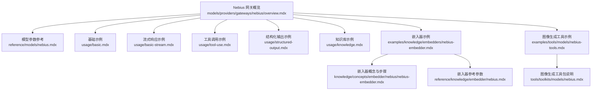
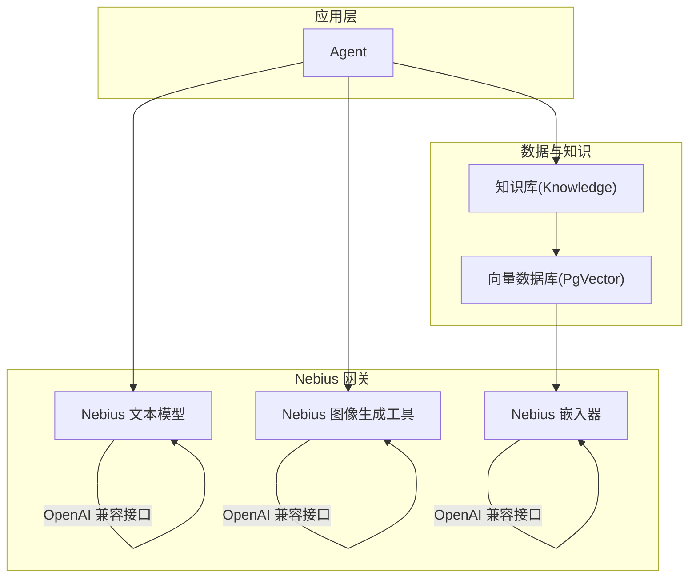
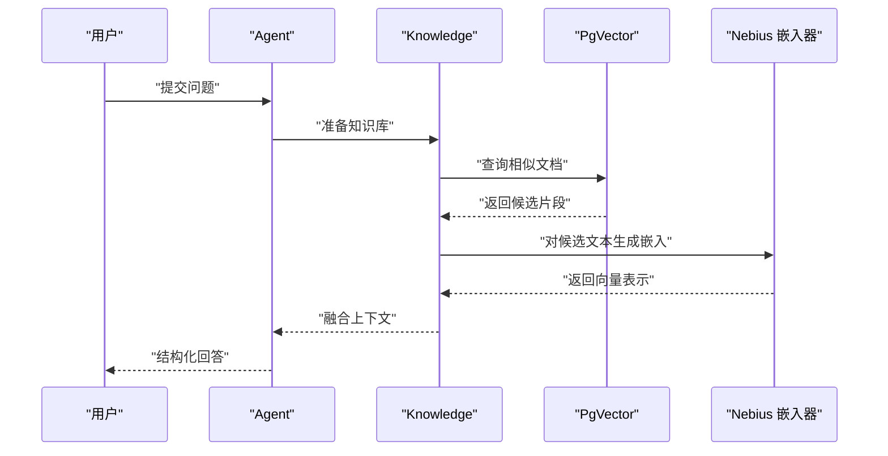
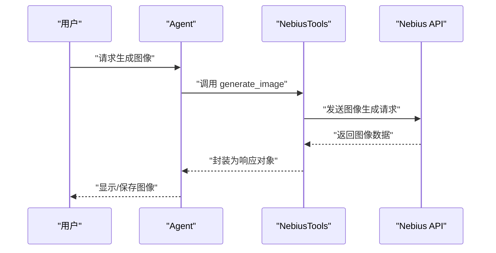
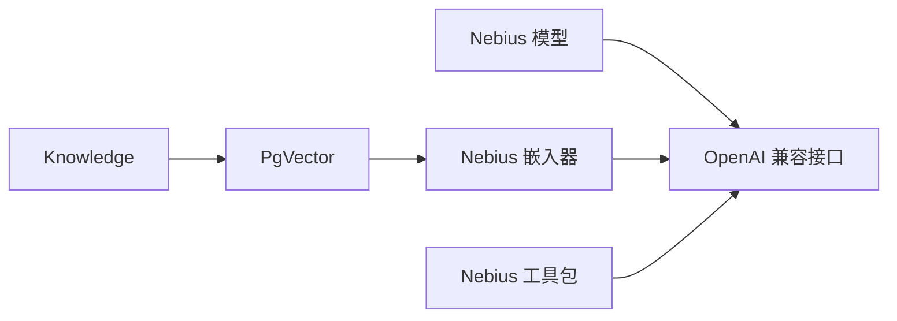

# Nebius 网关

<cite>
**本文引用的文件**
- [models/providers/gateways/nebius/overview.mdx](file://models/providers/gateways/nebius/overview.mdx)
- [reference/models/nebius.mdx](file://reference/models/nebius.mdx)
- [models/providers/gateways/nebius/usage/basic.mdx](file://models/providers/gateways/nebius/usage/basic.mdx)
- [models/providers/gateways/nebius/usage/basic-stream.mdx](file://models/providers/gateways/nebius/usage/basic-stream.mdx)
- [models/providers/gateways/nebius/usage/tool-use.mdx](file://models/providers/gateways/nebius/usage/tool-use.mdx)
- [models/providers/gateways/nebius/usage/structured-output.mdx](file://models/providers/gateways/nebius/usage/structured-output.mdx)
- [models/providers/gateways/nebius/usage/knowledge.mdx](file://models/providers/gateways/nebius/usage/knowledge.mdx)
- [examples/knowledge/embedders/nebius-embedder.mdx](file://examples/knowledge/embedders/nebius-embedder.mdx)
- [knowledge/concepts/embedder/nebius/nebius-embedder.mdx](file://knowledge/concepts/embedder/nebius/nebius-embedder.mdx)
- [reference/knowledge/embedder/nebius.mdx](file://reference/knowledge/embedder/nebius.mdx)
- [examples/tools/models/nebius-tools.mdx](file://examples/tools/models/nebius-tools.mdx)
- [tools/toolkits/models/nebius.mdx](file://tools/toolkits/models/nebius.mdx)
- [docs.json](file://docs.json)
</cite>

## 目录
1. [简介](#简介)
2. [项目结构](#项目结构)
3. [核心组件](#核心组件)
4. [架构总览](#架构总览)
5. [详细组件分析](#详细组件分析)
6. [依赖关系分析](#依赖关系分析)
7. [性能考量](#性能考量)
8. [故障排查指南](#故障排查指南)
9. [结论](#结论)
10. [附录](#附录)

## 简介
本文件面向希望在 Agent 中集成 Nebius（Token Factory）云原生模型的用户，系统性介绍 Nebius 的能力边界、认证与密钥配置、基础使用示例、数据库与知识管理集成、结构化输出能力，以及云原生部署、弹性扩缩容与成本优化策略。同时给出典型应用场景：文本生成、知识检索、工具调用与图像生成。

Nebius Token Factory 是来自 Nebius 的云原生 AI 模型网关，提供与 OpenAI 兼容的接口，支持文本与图像生成，并提供嵌入模型用于知识入库与检索。通过环境变量或显式参数注入 API 密钥即可快速接入。

## 项目结构
围绕 Nebius 的文档与示例主要分布在以下路径：
- 模型网关概览与参数说明：models/providers/gateways/nebius/*
- 模型参考与参数表：reference/models/nebius.mdx
- 使用示例（基础、流式、工具、结构化输出、知识库）：models/providers/gateways/nebius/usage/*
- 嵌入器与知识库示例：examples/knowledge/embedders/nebius-embedder.mdx、knowledge/concepts/embedder/nebius/nebius-embedder.mdx、reference/knowledge/embedder/nebius.mdx
- 图像生成工具包：examples/tools/models/nebius-tools.mdx、tools/toolkits/models/nebius.mdx

**图表来源**
- [models/providers/gateways/nebius/overview.mdx:1-63](file://models/providers/gateways/nebius/overview.mdx#L1-L63)
- [reference/models/nebius.mdx:1-21](file://reference/models/nebius.mdx#L1-L21)
- [models/providers/gateways/nebius/usage/basic.mdx:1-48](file://models/providers/gateways/nebius/usage/basic.mdx#L1-L48)
- [models/providers/gateways/nebius/usage/basic-stream.mdx:1-43](file://models/providers/gateways/nebius/usage/basic-stream.mdx#L1-L43)
- [models/providers/gateways/nebius/usage/tool-use.mdx:1-43](file://models/providers/gateways/nebius/usage/tool-use.mdx#L1-L43)
- [models/providers/gateways/nebius/usage/structured-output.mdx:1-65](file://models/providers/gateways/nebius/usage/structured-output.mdx#L1-L65)
- [models/providers/gateways/nebius/usage/knowledge.mdx:1-70](file://models/providers/gateways/nebius/usage/knowledge.mdx#L1-L70)
- [examples/knowledge/embedders/nebius-embedder.mdx:1-64](file://examples/knowledge/embedders/nebius-embedder.mdx#L1-L64)
- [knowledge/concepts/embedder/nebius/nebius-embedder.mdx:1-74](file://knowledge/concepts/embedder/nebius/nebius-embedder.mdx#L1-L74)
- [reference/knowledge/embedder/nebius.mdx:1-23](file://reference/knowledge/embedder/nebius.mdx#L1-L23)
- [examples/tools/models/nebius-tools.mdx:1-134](file://examples/tools/models/nebius-tools.mdx#L1-L134)
- [tools/toolkits/models/nebius.mdx:1-50](file://tools/toolkits/models/nebius.mdx#L1-L50)

**章节来源**
- [models/providers/gateways/nebius/overview.mdx:1-63](file://models/providers/gateways/nebius/overview.mdx#L1-L63)
- [reference/models/nebius.mdx:1-21](file://reference/models/nebius.mdx#L1-L21)
- [docs.json:3621-3635](file://docs.json#L3621-L3635)

## 核心组件
- Nebius 模型类：提供与 OpenAI 兼容的文本模型访问，支持重试、指数退避等参数；默认 base_url 指向 Nebius Token Factory 的 v1 接口。
- Nebius 嵌入器：基于 OpenAI 兼容接口实现，支持批量嵌入、维度控制与编码格式选择。
- Nebius 工具包：提供图像生成工具，支持多种图像模型、尺寸与质量配置。
- 知识库与向量库：结合 PgVector 等向量数据库，实现文档嵌入、入库与检索。

关键参数要点（节选）：
- 模型参数：id、name、provider、api_key、base_url、retries、delay_between_retries、exponential_backoff
- 嵌入器参数：id、dimensions、encoding_format、user、api_key、organization、base_url、request_params、client_params、openai_client、enable_batch、batch_size
- 工具包参数：api_key、base_url、image_model、image_quality、image_size、image_style、enable_generate_image

**章节来源**
- [reference/models/nebius.mdx:8-21](file://reference/models/nebius.mdx#L8-L21)
- [reference/knowledge/embedder/nebius.mdx:7-23](file://reference/knowledge/embedder/nebius.mdx#L7-L23)
- [tools/toolkits/models/nebius.mdx:27-44](file://tools/toolkits/models/nebius.mdx#L27-L44)

## 架构总览
下图展示了 Agent 与 Nebius 网关的交互路径，包括文本生成、图像生成、知识检索与嵌入处理：

**图表来源**
- [models/providers/gateways/nebius/overview.mdx:12-63](file://models/providers/gateways/nebius/overview.mdx#L12-L63)
- [reference/models/nebius.mdx:1-21](file://reference/models/nebius.mdx#L1-L21)
- [examples/knowledge/embedders/nebius-embedder.mdx:15-29](file://examples/knowledge/embedders/nebius-embedder.mdx#L15-L29)
- [knowledge/concepts/embedder/nebius/nebius-embedder.mdx:21-28](file://knowledge/concepts/embedder/nebius/nebius-embedder.mdx#L21-L28)
- [examples/tools/models/nebius-tools.mdx:27-39](file://examples/tools/models/nebius-tools.mdx#L27-L39)

## 详细组件分析

### 认证与 API 密钥配置
- 通过环境变量 NEBIUS_API_KEY 注入密钥，或在 Nebius 类中显式传入 api_key 参数。
- 支持在不同平台导出该变量，示例包含 macOS 与 Windows 的命令行方式。
- base_url 默认指向 Nebius Token Factory 的 v1 接口，可按需覆盖。

最佳实践：
- 在本地开发与 CI/CD 中统一使用环境变量，避免硬编码。
- 对于多租户或多账户场景，建议通过外部密钥管理服务注入。

**章节来源**
- [models/providers/gateways/nebius/overview.mdx:12-26](file://models/providers/gateways/nebius/overview.mdx#L12-L26)
- [reference/models/nebius.mdx:15-16](file://reference/models/nebius.mdx#L15-L16)

### 基础使用示例（文本生成）
- 示例演示了如何创建 Agent 并使用 Nebius 文本模型进行问答与故事生成。
- 支持同步与流式两种响应模式，便于终端输出与实时体验。

操作步骤（摘自示例）：
- 创建虚拟环境并安装依赖
- 设置 NEBIUS_API_KEY
- 运行示例脚本

**章节来源**
- [models/providers/gateways/nebius/usage/basic.mdx:25-47](file://models/providers/gateways/nebius/usage/basic.mdx#L25-L47)
- [models/providers/gateways/nebius/usage/basic-stream.mdx:21-43](file://models/providers/gateways/nebius/usage/basic-stream.mdx#L21-L43)

### 工具使用（工具调用）
- 将第三方工具（如 HackerNews）与 Nebius 模型结合，实现信息查询与总结。
- Agent 可以根据任务动态决定是否调用工具并返回结果。

**章节来源**
- [models/providers/gateways/nebius/usage/tool-use.mdx:21-43](file://models/providers/gateways/nebius/usage/tool-use.mdx#L21-L43)

### 结构化输出
- 通过 Pydantic 模型定义输出结构，Agent 返回符合 Schema 的 JSON 内容，便于下游解析与存储。
- 示例中定义了电影剧本的字段集合，Agent 基于提示词生成结构化内容。

**章节来源**
- [models/providers/gateways/nebius/usage/structured-output.mdx:43-65](file://models/providers/gateways/nebius/usage/structured-output.mdx#L43-L65)

### 数据库与知识管理
- 使用 Knowledge 与 PgVector 向量数据库，实现文档嵌入、入库与检索。
- 示例中通过嵌入器对 PDF 文档进行向量化并插入到向量库，随后在 Agent 中进行检索增强生成。

**图表来源**
- [models/providers/gateways/nebius/usage/knowledge.mdx:7-27](file://models/providers/gateways/nebius/usage/knowledge.mdx#L7-L27)
- [examples/knowledge/embedders/nebius-embedder.mdx:22-46](file://examples/knowledge/embedders/nebius-embedder.mdx#L22-L46)
- [knowledge/concepts/embedder/nebius/nebius-embedder.mdx:21-28](file://knowledge/concepts/embedder/nebius/nebius-embedder.mdx#L21-L28)

**章节来源**
- [models/providers/gateways/nebius/usage/knowledge.mdx:1-70](file://models/providers/gateways/nebius/usage/knowledge.mdx#L1-L70)
- [examples/knowledge/embedders/nebius-embedder.mdx:1-64](file://examples/knowledge/embedders/nebius-embedder.mdx#L1-L64)
- [knowledge/concepts/embedder/nebius/nebius-embedder.mdx:1-74](file://knowledge/concepts/embedder/nebius/nebius-embedder.mdx#L1-L74)
- [reference/knowledge/embedder/nebius.mdx:1-23](file://reference/knowledge/embedder/nebius.mdx#L1-L23)

### 图像生成工具
- 通过 NebiusTools 快速启用文本到图像生成，支持多种模型与质量/尺寸配置。
- 示例展示了三种不同质量与风格的图像生成流程，并保存为本地文件。

**图表来源**
- [examples/tools/models/nebius-tools.mdx:27-101](file://examples/tools/models/nebius-tools.mdx#L27-L101)
- [tools/toolkits/models/nebius.mdx:10-25](file://tools/toolkits/models/nebius.mdx#L10-L25)

**章节来源**
- [examples/tools/models/nebius-tools.mdx:1-134](file://examples/tools/models/nebius-tools.mdx#L1-L134)
- [tools/toolkits/models/nebius.mdx:1-50](file://tools/toolkits/models/nebius.mdx#L1-L50)

### 云原生特性与适用场景
- 与 OpenAI 兼容的接口设计，降低迁移与适配成本。
- 支持流式响应、结构化输出与工具调用，满足多样化业务需求。
- 嵌入器与向量数据库组合，适合 RAG 场景与企业知识库建设。
- 图像生成工具开箱即用，便于构建多模态应用。

对比传统模型提供商：
- 更贴近云原生生态与 OpenAI 生态，便于在现有工程中复用接口与工具链。
- 提供更丰富的图像生成模型与参数选项，适合创意与营销类场景。

**章节来源**
- [reference/models/nebius.mdx:21-21](file://reference/models/nebius.mdx#L21-L21)
- [models/providers/gateways/nebius/overview.mdx:7-11](file://models/providers/gateways/nebius/overview.mdx#L7-L11)

## 依赖关系分析
- Nebius 模型依赖 OpenAI 兼容接口，具备重试与退避机制，提升稳定性。
- 嵌入器同样基于 OpenAI 兼容接口，支持批量处理以减少 API 调用次数。
- 工具包直接对接图像生成接口，简化图像生成流程。
- 知识库与向量数据库解耦，便于替换底层存储与检索引擎。

**图表来源**
- [reference/models/nebius.mdx:15-21](file://reference/models/nebius.mdx#L15-L21)
- [reference/knowledge/embedder/nebius.mdx:15-23](file://reference/knowledge/embedder/nebius.mdx#L15-L23)
- [examples/knowledge/embedders/nebius-embedder.mdx:22-29](file://examples/knowledge/embedders/nebius-embedder.mdx#L22-L29)
- [tools/toolkits/models/nebius.mdx:32-32](file://tools/toolkits/models/nebius.mdx#L32-L32)

**章节来源**
- [reference/models/nebius.mdx:1-21](file://reference/models/nebius.mdx#L1-L21)
- [reference/knowledge/embedder/nebius.mdx:1-23](file://reference/knowledge/embedder/nebius.mdx#L1-L23)
- [examples/knowledge/embedders/nebius-embedder.mdx:15-29](file://examples/knowledge/embedders/nebius-embedder.mdx#L15-L29)
- [tools/toolkits/models/nebius.mdx:27-38](file://tools/toolkits/models/nebius.mdx#L27-L38)

## 性能考量
- 合理设置重试与退避参数，平衡失败恢复与延迟成本。
- 批量嵌入可显著降低 API 调用次数，建议在知识入库阶段启用批量处理。
- 流式响应适用于长文本生成与实时反馈场景，注意客户端渲染与网络带宽。
- 向量数据库的索引与查询参数应结合业务规模与 SLA 进行调优。

[本节为通用指导，无需特定文件来源]

## 故障排查指南
常见问题与定位思路：
- API 密钥无效或未设置：检查 NEBIUS_API_KEY 是否正确导出，确认密钥来源与权限范围。
- 接口超时或不稳定：适当增加重试次数与退避间隔，关注网络连通性与并发限制。
- 嵌入维度不匹配：确保嵌入器与向量库的维度一致，避免检索失败。
- 图像生成失败：核对图像模型名称、尺寸与质量参数，确认配额与计费状态。

**章节来源**
- [models/providers/gateways/nebius/overview.mdx:12-26](file://models/providers/gateways/nebius/overview.mdx#L12-L26)
- [reference/models/nebius.mdx:17-21](file://reference/models/nebius.mdx#L17-L21)
- [reference/knowledge/embedder/nebius.mdx:21-23](file://reference/knowledge/embedder/nebius.mdx#L21-L23)

## 结论
Nebius 网关以 OpenAI 兼容接口为核心，提供从文本生成、图像生成到知识管理与结构化输出的一体化能力。通过合理的认证配置、参数调优与云原生部署策略，可在 Agent 中高效集成 Nebius 的云原生模型，支撑多样化的智能应用。

[本节为总结性内容，无需特定文件来源]

## 附录

### 快速开始清单
- 设置 NEBIUS_API_KEY
- 安装依赖并运行示例脚本
- 配置向量数据库（如 PgVector）以启用知识检索
- 根据场景选择模型与工具包参数

**章节来源**
- [models/providers/gateways/nebius/usage/basic.mdx:25-47](file://models/providers/gateways/nebius/usage/basic.mdx#L25-L47)
- [models/providers/gateways/nebius/usage/knowledge.mdx:29-70](file://models/providers/gateways/nebius/usage/knowledge.mdx#L29-L70)
- [examples/tools/models/nebius-tools.mdx:119-134](file://examples/tools/models/nebius-tools.mdx#L119-L134)