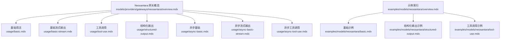
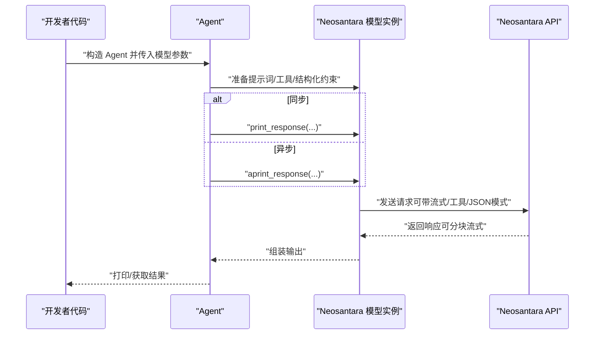
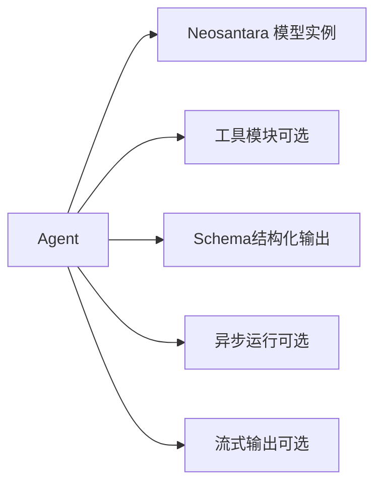

# Neosantara 网关

<cite>
**本文引用的文件**
- [models/providers/gateways/neosantara/overview.mdx](file://models/providers/gateways/neosantara/overview.mdx)
- [models/providers/gateways/neosantara/usage/basic.mdx](file://models/providers/gateways/neosantara/usage/basic.mdx)
- [models/providers/gateways/neosantara/usage/basic-stream.mdx](file://models/providers/gateways/neosantara/usage/basic-stream.mdx)
- [models/providers/gateways/neosantara/usage/tool-use.mdx](file://models/providers/gateways/neosantara/usage/tool-use.mdx)
- [models/providers/gateways/neosantara/usage/structured-output.mdx](file://models/providers/gateways/neosantara/usage/structured-output.mdx)
- [models/providers/gateways/neosantara/usage/async-basic.mdx](file://models/providers/gateways/neosantara/usage/async-basic.mdx)
- [models/providers/gateways/neosantara/usage/async-basic-stream.mdx](file://models/providers/gateways/neosantara/usage/async-basic-stream.mdx)
- [models/providers/gateways/neosantara/usage/async-tool-use.mdx](file://models/providers/gateways/neosantara/usage/async-tool-use.mdx)
- [examples/models/neosantara/overview.mdx](file://examples/models/neosantara/overview.mdx)
- [examples/models/neosantara/basic.mdx](file://examples/models/neosantara/basic.mdx)
- [examples/models/neosantara/structured-output.mdx](file://examples/models/neosantara/structured-output.mdx)
- [examples/models/neosantara/tool-use.mdx](file://examples/models/neosantara/tool-use.mdx)
</cite>

## 目录
1. [简介](#简介)
2. [项目结构](#项目结构)
3. [核心组件](#核心组件)
4. [架构总览](#架构总览)
5. [详细组件分析](#详细组件分析)
6. [依赖关系分析](#依赖关系分析)
7. [性能考量](#性能考量)
8. [故障排查指南](#故障排查指南)
9. [结论](#结论)
10. [附录](#附录)

## 简介
Neosantara 是来自印尼的本地化大模型网关，提供统一接口访问多家 AI 模型。其优势在于：
- 本地化服务：数据路径更贴近东南亚用户，降低跨境延迟与合规风险
- 多模型聚合：通过统一网关调用不同模型，便于在应用中灵活切换
- 开放生态：支持结构化输出与工具调用，适配多类业务场景

本使用文档将围绕认证配置、API 密钥管理、基础与高级用法（含流式输出、异步执行、工具调用、结构化输出）展开，并结合印尼语与本地化内容处理场景，帮助你在 Agent 中快速集成 Neosantara。

## 项目结构
Neosantara 在文档侧的组织方式如下：
- 网关概览与参数说明
- 基础用法与流式输出
- 工具调用与异步执行
- 结构化输出与模式约束
- 示例索引与运行指引

图表来源
- [models/providers/gateways/neosantara/overview.mdx:1-59](file://models/providers/gateways/neosantara/overview.mdx#L1-L59)
- [models/providers/gateways/neosantara/usage/basic.mdx:1-46](file://models/providers/gateways/neosantara/usage/basic.mdx#L1-L46)
- [models/providers/gateways/neosantara/usage/basic-stream.mdx:1-40](file://models/providers/gateways/neosantara/usage/basic-stream.mdx#L1-L40)
- [models/providers/gateways/neosantara/usage/tool-use.mdx:1-47](file://models/providers/gateways/neosantara/usage/tool-use.mdx#L1-L47)
- [models/providers/gateways/neosantara/usage/structured-output.mdx:1-69](file://models/providers/gateways/neosantara/usage/structured-output.mdx#L1-L69)
- [models/providers/gateways/neosantara/usage/async-basic.mdx:1-45](file://models/providers/gateways/neosantara/usage/async-basic.mdx#L1-L45)
- [models/providers/gateways/neosantara/usage/async-basic-stream.mdx:1-45](file://models/providers/gateways/neosantara/usage/async-basic-stream.mdx#L1-L45)
- [models/providers/gateways/neosantara/usage/async-tool-use.mdx:1-49](file://models/providers/gateways/neosantara/usage/async-tool-use.mdx#L1-L49)
- [examples/models/neosantara/overview.mdx:1-11](file://examples/models/neosantara/overview.mdx#L1-L11)
- [examples/models/neosantara/basic.mdx:1-58](file://examples/models/neosantara/basic.mdx#L1-L58)
- [examples/models/neosantara/structured-output.mdx:1-74](file://examples/models/neosantara/structured-output.mdx#L1-L74)
- [examples/models/neosantara/tool-use.mdx:1-58](file://examples/models/neosantara/tool-use.mdx#L1-L58)

章节来源
- [models/providers/gateways/neosantara/overview.mdx:1-59](file://models/providers/gateways/neosantara/overview.mdx#L1-L59)
- [examples/models/neosantara/overview.mdx:1-11](file://examples/models/neosantara/overview.mdx#L1-L11)

## 核心组件
- 认证与密钥管理
  - 通过环境变量设置 API 密钥，避免硬编码风险
  - 支持跨平台设置（Mac/Windows）
- 模型选择与参数
  - 默认模型 ID 与名称可按需覆盖
  - 支持自定义 base_url 以适配测试或代理环境
  - 继承 OpenAI 兼容参数，便于迁移与复用
- 运行模式
  - 同步与异步两种执行方式
  - 流式输出提升交互体验
  - 工具调用与结构化输出增强业务能力

章节来源
- [models/providers/gateways/neosantara/overview.mdx:9-59](file://models/providers/gateways/neosantara/overview.mdx#L9-L59)

## 架构总览
下图展示了 Agent 调用 Neosantara 的典型流程：Agent 将消息与工具/模式约束交给 Neosantara 网关，网关经由统一接口向后端模型服务发起请求并返回结果；流式输出与异步执行在不改变上层调用方式的前提下提升性能与用户体验。

图表来源
- [models/providers/gateways/neosantara/usage/basic.mdx:7-22](file://models/providers/gateways/neosantara/usage/basic.mdx#L7-L22)
- [models/providers/gateways/neosantara/usage/tool-use.mdx:7-22](file://models/providers/gateways/neosantara/usage/tool-use.mdx#L7-L22)
- [models/providers/gateways/neosantara/usage/structured-output.mdx:7-44](file://models/providers/gateways/neosantara/usage/structured-output.mdx#L7-L44)
- [models/providers/gateways/neosantara/usage/async-basic.mdx:7-20](file://models/providers/gateways/neosantara/usage/async-basic.mdx#L7-L20)
- [models/providers/gateways/neosantara/usage/async-tool-use.mdx:7-24](file://models/providers/gateways/neosantara/usage/async-tool-use.mdx#L7-L24)

## 详细组件分析

### 认证与 API 密钥管理
- 环境变量名：NEOSANTARA_API_KEY
- 设置位置：系统环境变量（推荐）
- 跨平台示例：Mac/Linux 使用 export，Windows 使用 setx
- 安全建议：避免将密钥写入版本控制；生产环境建议使用机密管理服务

章节来源
- [models/providers/gateways/neosantara/overview.mdx:9-23](file://models/providers/gateways/neosantara/overview.mdx#L9-L23)

### 基础使用（同步与异步）
- 同步：适合简单脚本与快速验证
- 异步：适合高并发或已有事件循环的场景
- 关键点：保持 Agent 初始化一致，仅替换调用方式

章节来源
- [models/providers/gateways/neosantara/usage/basic.mdx:7-22](file://models/providers/gateways/neosantara/usage/basic.mdx#L7-L22)
- [models/providers/gateways/neosantara/usage/async-basic.mdx:7-20](file://models/providers/gateways/neosantara/usage/async-basic.mdx#L7-L20)

### 流式输出（同步与异步）
- 场景：实时反馈、长文本生成、改善等待体验
- 实现：在调用时开启流式开关，即可逐块接收输出
- 注意：流式输出通常与同步/异步模式组合使用

章节来源
- [models/providers/gateways/neosantara/usage/basic-stream.mdx:7-15](file://models/providers/gateways/neosantara/usage/basic-stream.mdx#L7-L15)
- [models/providers/gateways/neosantara/usage/async-basic-stream.mdx:7-20](file://models/providers/gateways/neosantara/usage/async-basic-stream.mdx#L7-L20)

### 工具调用
- 集成外部能力：如网络搜索、数据库查询等
- 使用方式：在 Agent 初始化时注入工具列表
- 适用：需要动态检索信息或执行外部操作的任务

章节来源
- [models/providers/gateways/neosantara/usage/tool-use.mdx:7-22](file://models/providers/gateways/neosantara/usage/tool-use.mdx#L7-L22)
- [models/providers/gateways/neosantara/usage/async-tool-use.mdx:7-24](file://models/providers/gateways/neosantara/usage/async-tool-use.mdx#L7-L24)
- [examples/models/neosantara/tool-use.mdx:15-44](file://examples/models/neosantara/tool-use.mdx#L15-L44)

### 结构化输出（JSON 模式）
- 目标：确保模型输出符合预定义 Schema，便于下游解析与入库
- 关键点：配合输出模式与描述提示，提高 JSON 一致性
- 应用：抽取结构化数据、生成标准化报告等

章节来源
- [models/providers/gateways/neosantara/usage/structured-output.mdx:7-44](file://models/providers/gateways/neosantara/usage/structured-output.mdx#L7-L44)
- [examples/models/neosantara/structured-output.mdx:24-52](file://examples/models/neosantara/structured-output.mdx#L24-L52)

### 参数与兼容性
- 主要参数：模型 ID、名称、提供方、API 密钥、基础地址
- 兼容性：继承 OpenAI 兼容参数，便于迁移与统一管理

章节来源
- [models/providers/gateways/neosantara/overview.mdx:48-59](file://models/providers/gateways/neosantara/overview.mdx#L48-L59)

### 多语言与本地化内容处理
- 多语言支持：通过模型选择与提示工程实现多语言对话与生成
- 文化适应：结合本地场景（如印尼语、本地节日、习惯表达）优化提示词与输出约束
- 内容本地化：优先使用本地数据源与工具，减少跨域传输与延迟

章节来源
- [models/providers/gateways/neosantara/overview.mdx:7](file://models/providers/gateways/neosantara/overview.mdx#L7)

### 实际应用示例（基于仓库示例）
- 基础示例：同步/异步/流式三类模式对比
- 工具调用示例：结合网络搜索工具完成信息检索
- 结构化输出示例：定义 Schema 输出电影剧本要点

章节来源
- [examples/models/neosantara/basic.mdx:22-44](file://examples/models/neosantara/basic.mdx#L22-L44)
- [examples/models/neosantara/tool-use.mdx:23-44](file://examples/models/neosantara/tool-use.mdx#L23-L44)
- [examples/models/neosantara/structured-output.mdx:44-52](file://examples/models/neosantara/structured-output.mdx#L44-L52)

## 依赖关系分析
- Agent 依赖 Neosantara 模型实例
- 工具调用依赖具体工具模块（如网络搜索）
- 结构化输出依赖 Pydantic 模式定义
- 运行时可选依赖：异步运行器、流式渲染

图表来源
- [models/providers/gateways/neosantara/usage/tool-use.mdx:7-22](file://models/providers/gateways/neosantara/usage/tool-use.mdx#L7-L22)
- [models/providers/gateways/neosantara/usage/structured-output.mdx:7-44](file://models/providers/gateways/neosantara/usage/structured-output.mdx#L7-L44)
- [models/providers/gateways/neosantara/usage/async-basic.mdx:7-20](file://models/providers/gateways/neosantara/usage/async-basic.mdx#L7-L20)
- [models/providers/gateways/neosantara/usage/basic-stream.mdx:7-15](file://models/providers/gateways/neosantara/usage/basic-stream.mdx#L7-L15)

## 性能考量
- 选择合适的模型 ID：根据任务复杂度与延迟要求权衡
- 合理使用流式输出：在长文本与实时反馈场景收益显著
- 异步执行：在高并发或多任务场景减少阻塞
- 工具调用前置缓存：对重复查询进行缓存以降低往返时间
- 本地化部署：尽量靠近用户的数据中心，减少跨境传输

## 故障排查指南
- 认证失败
  - 检查 NEOSANTARA_API_KEY 是否正确设置
  - 确认密钥未过期且具有相应权限
- 请求超时
  - 检查网络连通性与代理设置
  - 尝试切换 base_url 或使用本地镜像
- 输出格式异常
  - 对于结构化输出，确认 Schema 定义完整且描述清晰
  - 开启 JSON 模式并提供明确的约束提示
- 工具调用失败
  - 确认工具已正确注册到 Agent
  - 检查工具依赖是否安装齐全

章节来源
- [models/providers/gateways/neosantara/overview.mdx:9-23](file://models/providers/gateways/neosantara/overview.mdx#L9-L23)
- [models/providers/gateways/neosantara/usage/structured-output.mdx:46-49](file://models/providers/gateways/neosantara/usage/structured-output.mdx#L46-L49)

## 结论
Neosantara 为印尼及东南亚用户提供了一个本地化的模型网关入口。通过统一的认证与参数体系、丰富的运行模式（同步/异步/流式）、以及对工具调用与结构化输出的良好支持，可在 Agent 中快速构建从基础问答到复杂业务编排的智能应用。结合多语言与本地化内容处理策略，可进一步提升文化适配与用户体验。

## 附录
- 快速开始步骤
  - 设置 NEOSANTARA_API_KEY
  - 安装依赖（如 openai、对应工具库）
  - 运行示例脚本，验证输出
- 参考示例
  - 基础示例、流式输出、异步执行、工具调用、结构化输出

章节来源
- [models/providers/gateways/neosantara/usage/basic.mdx:24-46](file://models/providers/gateways/neosantara/usage/basic.mdx#L24-L46)
- [models/providers/gateways/neosantara/usage/basic-stream.mdx:17-40](file://models/providers/gateways/neosantara/usage/basic-stream.mdx#L17-L40)
- [models/providers/gateways/neosantara/usage/tool-use.mdx:24-47](file://models/providers/gateways/neosantara/usage/tool-use.mdx#L24-L47)
- [models/providers/gateways/neosantara/usage/structured-output.mdx:46-69](file://models/providers/gateways/neosantara/usage/structured-output.mdx#L46-L69)
- [models/providers/gateways/neosantara/usage/async-basic.mdx:22-45](file://models/providers/gateways/neosantara/usage/async-basic.mdx#L22-L45)
- [models/providers/gateways/neosantara/usage/async-basic-stream.mdx:21-45](file://models/providers/gateways/neosantara/usage/async-basic-stream.mdx#L21-L45)
- [models/providers/gateways/neosantara/usage/async-tool-use.mdx:26-49](file://models/providers/gateways/neosantara/usage/async-tool-use.mdx#L26-L49)