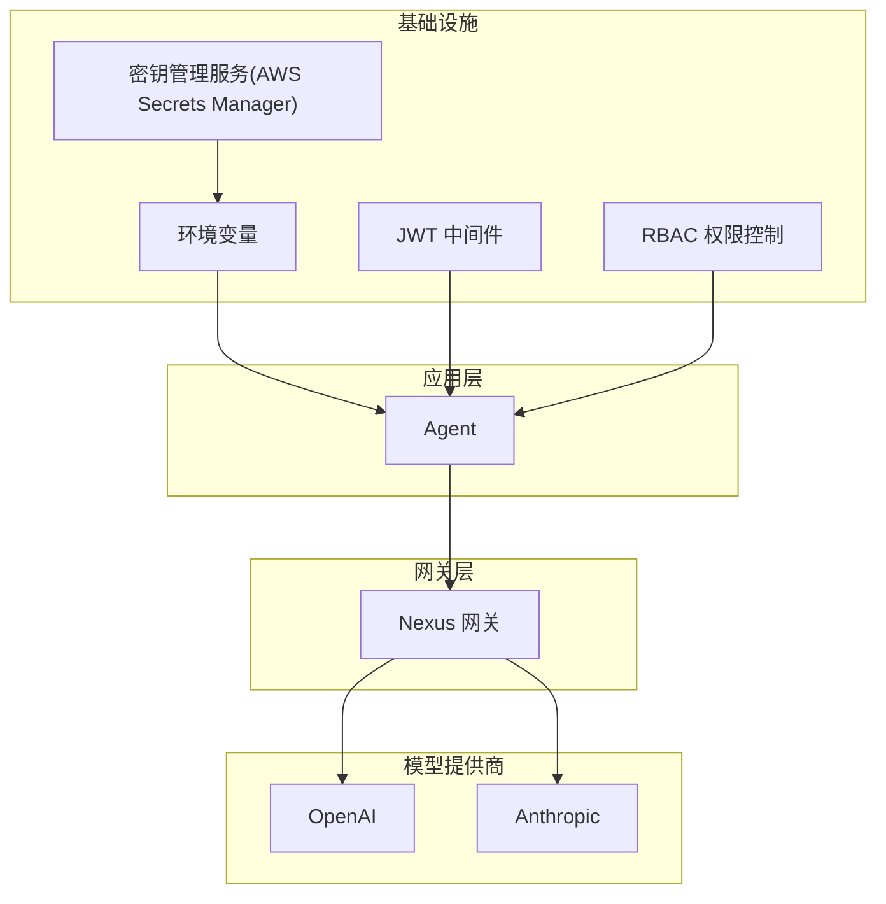
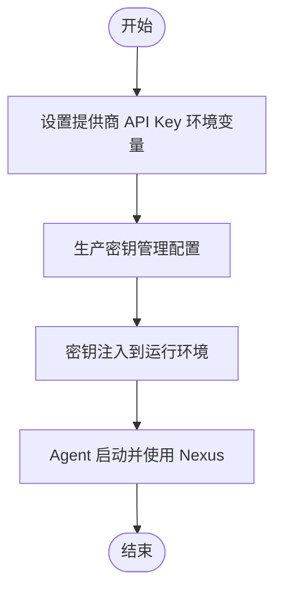
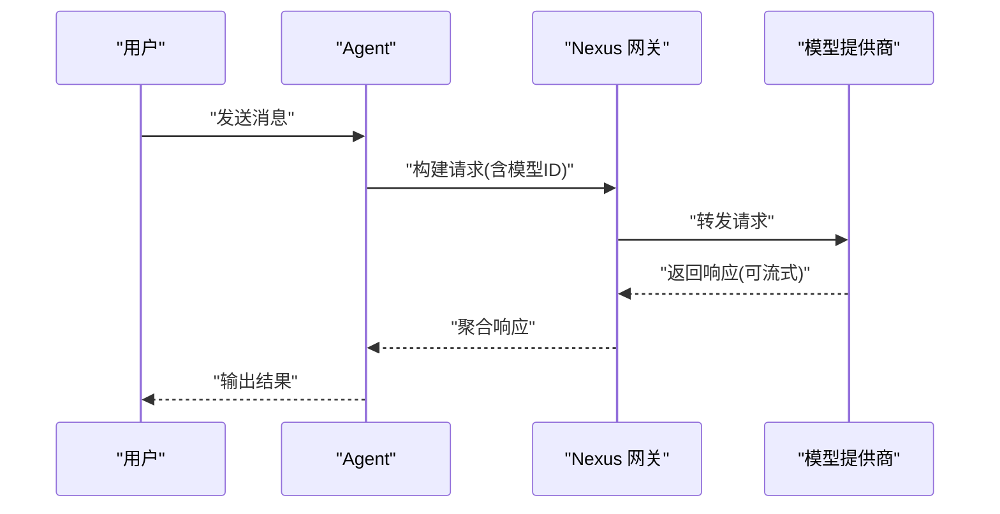
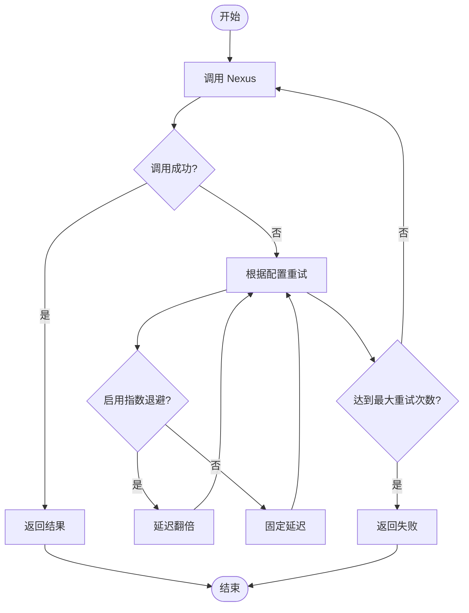
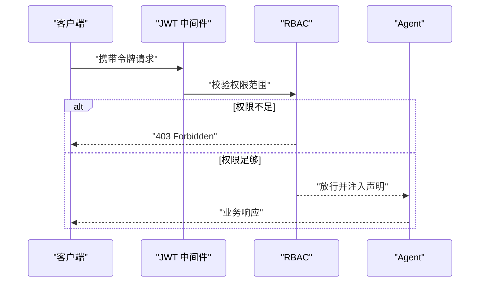
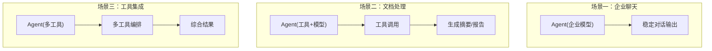
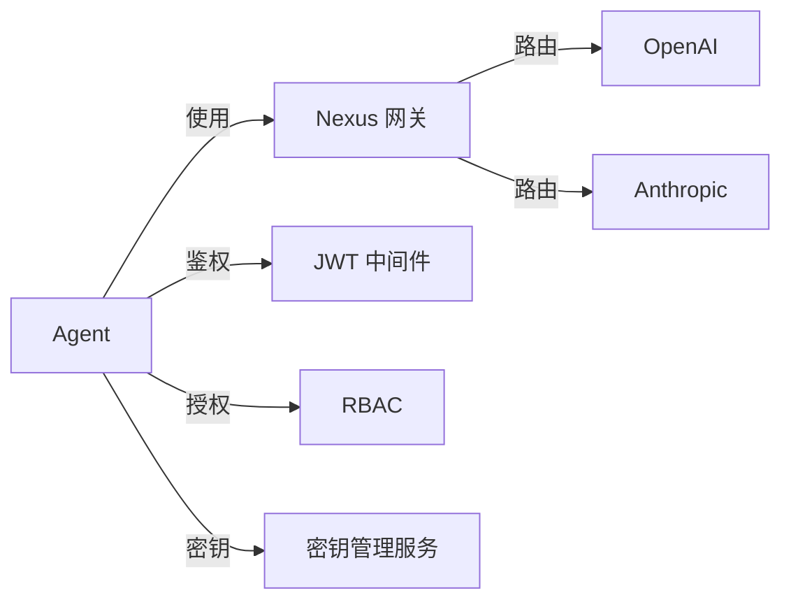

# Nexus 网关

<cite>
**本文引用的文件**
- [models/providers/gateways/nexus/overview.mdx](file://models/providers/gateways/nexus/overview.mdx)
- [models/providers/gateways/nexus/usage/basic.mdx](file://models/providers/gateways/nexus/usage/basic.mdx)
- [models/providers/gateways/nexus/usage/basic-stream.mdx](file://models/providers/gateways/nexus/usage/basic-stream.mdx)
- [models/providers/gateways/nexus/usage/async-basic.mdx](file://models/providers/gateways/nexus/usage/async-basic.mdx)
- [models/providers/gateways/nexus/usage/async-tool-use.mdx](file://models/providers/gateways/nexus/usage/async-tool-use.mdx)
- [models/providers/gateways/nexus/usage/tool-use.mdx](file://models/providers/gateways/nexus/usage/tool-use.mdx)
- [examples/models/nexus/retry.mdx](file://examples/models/nexus/retry.mdx)
- [examples/models/nexus/overview.mdx](file://examples/models/nexus/overview.mdx)
- [deploy/templates/aws/configure/secrets.mdx](file://deploy/templates/aws/configure/secrets.mdx)
- [deploy/templates/aws/configure/env-vars.mdx](file://deploy/templates/aws/configure/env-vars.mdx)
- [_snippets/set-openai-key.mdx](file://_snippets/set-openai-key.mdx)
- [prompts/docs-sync.md](file://prompts/docs-sync.md)
- [agent-os/security/overview.mdx](file://agent-os/security/overview.mdx)
- [reference/models/aimlapi.mdx](file://reference/models/aimlapi.mdx)
- [models/providers/gateways/aimlapi/overview.mdx](file://models/providers/gateways/aimlapi/overview.mdx)
</cite>

## 目录
1. [简介](#简介)
2. [项目结构](#项目结构)
3. [核心组件](#核心组件)
4. [架构总览](#架构总览)
5. [详细组件分析](#详细组件分析)
6. [依赖关系分析](#依赖关系分析)
7. [性能考量](#性能考量)
8. [故障排查指南](#故障排查指南)
9. [结论](#结论)
10. [附录](#附录)

## 简介
本文件面向企业用户，系统化介绍 Nexus 网关在 Agent 中的使用方式与最佳实践。Nexus 是一个路由平台，通过统一的 API 接口为多种大模型提供访问能力。本文重点覆盖以下方面：
- 认证与密钥配置（含环境变量与生产密钥管理）
- 基础与高级用法（同步/异步、流式输出、工具调用）
- 重试机制与容错策略
- 企业级安全与合规要点（基于 AgentOS 的 RBAC/JWT 与密钥管理）
- 实战场景：企业聊天、文档处理、工具集成等
- 企业级 AI 服务特点与与消费级模型提供商的差异

## 项目结构
围绕 Nexus 的文档与示例主要分布在如下位置：
- 概览与参数说明：models/providers/gateways/nexus/overview.mdx
- 使用示例：basic、basic-stream、async-basic、async-tool-use、tool-use
- 重试示例：examples/models/nexus/retry.mdx
- 生产密钥与环境变量：deploy/templates/aws/configure/secrets.mdx、env-vars.mdx
- 安全与鉴权参考：agent-os/security/overview.mdx
- 企业级能力对比参考：reference/models/aimlapi.mdx、models/providers/gateways/aimlapi/overview.mdx

```mermaid
graph TB
A["Nexus 概览<br/>models/providers/gateways/nexus/overview.mdx"] --> B["基础用法<br/>models/providers/gateways/nexus/usage/basic.mdx"]
A --> C["流式输出<br/>models/providers/gateways/nexus/usage/basic-stream.mdx"]
A --> D["异步基础<br/>models/providers/gateways/nexus/usage/async-basic.mdx"]
A --> E["异步工具调用<br/>models/providers/gateways/nexus/usage/async-tool-use.mdx"]
A --> F["工具调用<br/>models/providers/gateways/nexus/usage/tool-use.mdx"]
A --> G["重试示例<br/>examples/models/nexus/retry.mdx"]
H["AWS 密钥管理<br/>deploy/templates/aws/configure/secrets.mdx"] --> I["环境变量参考<br/>deploy/templates/aws/configure/env-vars.mdx"]
J["AgentOS 安全概览<br/>agent-os/security/overview.mdx"] --> K["RBAC/JWT 鉴权说明"]
L["企业级能力参考<br/>reference/models/aimlapi.mdx"] --> M["AI/ML API 概览<br/>models/providers/gateways/aimlapi/overview.mdx"]
```

**图表来源**
- [models/providers/gateways/nexus/overview.mdx:1-64](file://models/providers/gateways/nexus/overview.mdx#L1-L64)
- [models/providers/gateways/nexus/usage/basic.mdx:1-45](file://models/providers/gateways/nexus/usage/basic.mdx#L1-L45)
- [models/providers/gateways/nexus/usage/basic-stream.mdx:1-46](file://models/providers/gateways/nexus/usage/basic-stream.mdx#L1-L46)
- [models/providers/gateways/nexus/usage/async-basic.mdx:1-46](file://models/providers/gateways/nexus/usage/async-basic.mdx#L1-L46)
- [models/providers/gateways/nexus/usage/async-tool-use.mdx:1-50](file://models/providers/gateways/nexus/usage/async-tool-use.mdx#L1-L50)
- [models/providers/gateways/nexus/usage/tool-use.mdx:1-47](file://models/providers/gateways/nexus/usage/tool-use.mdx#L1-L47)
- [examples/models/nexus/retry.mdx:1-50](file://examples/models/nexus/retry.mdx#L1-L50)
- [deploy/templates/aws/configure/secrets.mdx:1-108](file://deploy/templates/aws/configure/secrets.mdx#L1-L108)
- [deploy/templates/aws/configure/env-vars.mdx:1-38](file://deploy/templates/aws/configure/env-vars.mdx#L1-L38)
- [agent-os/security/overview.mdx:51-70](file://agent-os/security/overview.mdx#L51-L70)
- [reference/models/aimlapi.mdx:1-12](file://reference/models/aimlapi.mdx#L1-L12)
- [models/providers/gateways/aimlapi/overview.mdx:56-68](file://models/providers/gateways/aimlapi/overview.mdx#L56-L68)

**章节来源**
- [models/providers/gateways/nexus/overview.mdx:1-64](file://models/providers/gateways/nexus/overview.mdx#L1-L64)
- [models/providers/gateways/nexus/usage/basic.mdx:1-45](file://models/providers/gateways/nexus/usage/basic.mdx#L1-L45)
- [models/providers/gateways/nexus/usage/basic-stream.mdx:1-46](file://models/providers/gateways/nexus/usage/basic-stream.mdx#L1-L46)
- [models/providers/gateways/nexus/usage/async-basic.mdx:1-46](file://models/providers/gateways/nexus/usage/async-basic.mdx#L1-L46)
- [models/providers/gateways/nexus/usage/async-tool-use.mdx:1-50](file://models/providers/gateways/nexus/usage/async-tool-use.mdx#L1-L50)
- [models/providers/gateways/nexus/usage/tool-use.mdx:1-47](file://models/providers/gateways/nexus/usage/tool-use.mdx#L1-L47)
- [examples/models/nexus/retry.mdx:1-50](file://examples/models/nexus/retry.mdx#L1-L50)
- [examples/models/nexus/overview.mdx:1-11](file://examples/models/nexus/overview.mdx#L1-L11)
- [deploy/templates/aws/configure/secrets.mdx:1-108](file://deploy/templates/aws/configure/secrets.mdx#L1-L108)
- [deploy/templates/aws/configure/env-vars.mdx:1-38](file://deploy/templates/aws/configure/env-vars.mdx#L1-L38)
- [agent-os/security/overview.mdx:51-70](file://agent-os/security/overview.mdx#L51-L70)
- [reference/models/aimlapi.mdx:1-12](file://reference/models/aimlapi.mdx#L1-L12)
- [models/providers/gateways/aimlapi/overview.mdx:56-68](file://models/providers/gateways/aimlapi/overview.mdx#L56-L68)

## 核心组件
- Nexus 模型封装：通过统一接口访问多种后端模型，支持 OpenAI 兼容参数。
- 认证与密钥：Nexus 本身不直接暴露密钥，而是依赖底层模型提供商的 API Key；需正确设置环境变量或密钥管理服务。
- 重试与退避：内置重试配置项，支持指数退避与固定延迟。
- 工具集成：与 Agent 的工具系统无缝对接，支持同步与异步工具调用。
- 流式输出：支持流式响应，便于实时交互与前端渲染。

**章节来源**
- [models/providers/gateways/nexus/overview.mdx:15-64](file://models/providers/gateways/nexus/overview.mdx#L15-L64)
- [examples/models/nexus/retry.mdx:16-26](file://examples/models/nexus/retry.mdx#L16-L26)
- [models/providers/gateways/nexus/usage/tool-use.mdx:14-18](file://models/providers/gateways/nexus/usage/tool-use.mdx#L14-L18)
- [models/providers/gateways/nexus/usage/async-tool-use.mdx:18-22](file://models/providers/gateways/nexus/usage/async-tool-use.mdx#L18-L22)

## 架构总览
下图展示了 Nexus 在企业 Agent 中的典型调用链路：Agent 调用 Nexus，Nexus 将请求路由到具体的模型提供商（如 OpenAI、Anthropic），并返回结果。生产部署中，密钥通过密钥管理服务注入，AgentOS 提供 JWT/RBAC 鉴权保障访问安全。

**图表来源**
- [models/providers/gateways/nexus/overview.mdx:15-31](file://models/providers/gateways/nexus/overview.mdx#L15-L31)
- [deploy/templates/aws/configure/secrets.mdx:1-108](file://deploy/templates/aws/configure/secrets.mdx#L1-L108)
- [deploy/templates/aws/configure/env-vars.mdx:1-38](file://deploy/templates/aws/configure/env-vars.mdx#L1-L38)
- [agent-os/security/overview.mdx:51-70](file://agent-os/security/overview.mdx#L51-L70)

## 详细组件分析

### 认证与 API 密钥配置
- Nexus 不直接持有模型提供商的密钥，需要在运行环境中设置对应提供商的 API Key。
- 示例：为 OpenAI、Anthropic 设置环境变量。
- 生产环境建议使用密钥管理服务（如 AWS Secrets Manager）集中管理，并通过环境变量注入。

**图表来源**
- [models/providers/gateways/nexus/overview.mdx:15-31](file://models/providers/gateways/nexus/overview.mdx#L15-L31)
- [deploy/templates/aws/configure/secrets.mdx:1-108](file://deploy/templates/aws/configure/secrets.mdx#L1-L108)
- [deploy/templates/aws/configure/env-vars.mdx:1-38](file://deploy/templates/aws/configure/env-vars.mdx#L1-L38)

**章节来源**
- [models/providers/gateways/nexus/overview.mdx:15-31](file://models/providers/gateways/nexus/overview.mdx#L15-L31)
- [deploy/templates/aws/configure/secrets.mdx:1-108](file://deploy/templates/aws/configure/secrets.mdx#L1-L108)
- [deploy/templates/aws/configure/env-vars.mdx:1-38](file://deploy/templates/aws/configure/env-vars.mdx#L1-L38)
- [_snippets/set-openai-key.mdx:1-15](file://_snippets/set-openai-key.mdx#L1-L15)

### 基础使用与集成示例
- 同步基础：创建 Agent 并指定 Nexus 模型 ID，打印响应。
- 异步基础：使用异步接口进行相同操作。
- 工具调用：在 Agent 中注册工具（如 HackerNews），实现带工具的对话。
- 流式输出：以流式方式接收模型输出，适合实时展示。

**图表来源**
- [models/providers/gateways/nexus/usage/basic.mdx:11-18](file://models/providers/gateways/nexus/usage/basic.mdx#L11-L18)
- [models/providers/gateways/nexus/usage/async-basic.mdx:17-19](file://models/providers/gateways/nexus/usage/async-basic.mdx#L17-L19)
- [models/providers/gateways/nexus/usage/tool-use.mdx:14-18](file://models/providers/gateways/nexus/usage/tool-use.mdx#L14-L18)
- [models/providers/gateways/nexus/usage/basic-stream.mdx:11-19](file://models/providers/gateways/nexus/usage/basic-stream.mdx#L11-L19)

**章节来源**
- [models/providers/gateways/nexus/usage/basic.mdx:1-45](file://models/providers/gateways/nexus/usage/basic.mdx#L1-L45)
- [models/providers/gateways/nexus/usage/async-basic.mdx:1-46](file://models/providers/gateways/nexus/usage/async-basic.mdx#L1-L46)
- [models/providers/gateways/nexus/usage/tool-use.mdx:1-47](file://models/providers/gateways/nexus/usage/tool-use.mdx#L1-L47)
- [models/providers/gateways/nexus/usage/basic-stream.mdx:1-46](file://models/providers/gateways/nexus/usage/basic-stream.mdx#L1-L46)

### 重试机制与容错策略
- 支持配置重试次数、每次重试间隔、是否启用指数退避。
- 示例演示了错误模型 ID 触发重试流程，便于验证容错行为。

**图表来源**
- [examples/models/nexus/retry.mdx:16-26](file://examples/models/nexus/retry.mdx#L16-L26)

**章节来源**
- [examples/models/nexus/retry.mdx:1-50](file://examples/models/nexus/retry.mdx#L1-L50)

### 企业级安全与合规
- JWT 中间件与 RBAC：未携带有效令牌返回 401，权限不足返回 403。
- 密钥管理：生产环境通过密钥管理服务集中存储与注入，避免硬编码。
- 合规性：结合企业审计与访问控制策略，确保模型调用的可追溯与可控。

**图表来源**
- [agent-os/security/overview.mdx:51-70](file://agent-os/security/overview.mdx#L51-L70)
- [deploy/templates/aws/configure/secrets.mdx:1-108](file://deploy/templates/aws/configure/secrets.mdx#L1-L108)
- [deploy/templates/aws/configure/env-vars.mdx:1-38](file://deploy/templates/aws/configure/env-vars.mdx#L1-L38)

**章节来源**
- [agent-os/security/overview.mdx:51-70](file://agent-os/security/overview.mdx#L51-L70)
- [deploy/templates/aws/configure/secrets.mdx:1-108](file://deploy/templates/aws/configure/secrets.mdx#L1-L108)
- [deploy/templates/aws/configure/env-vars.mdx:1-38](file://deploy/templates/aws/configure/env-vars.mdx#L1-L38)

### 实战场景与示例
- 企业聊天：Agent 通过 Nexus 访问企业偏好模型，实现稳定、可追踪的对话体验。
- 文档处理：结合工具调用（如搜索引擎、知识库检索）完成信息抽取与总结。
- 工具集成：注册第三方工具（如 HackerNews），实现多模态与外部数据联动。

**图表来源**
- [models/providers/gateways/nexus/usage/tool-use.mdx:14-18](file://models/providers/gateways/nexus/usage/tool-use.mdx#L14-L18)
- [models/providers/gateways/nexus/usage/async-tool-use.mdx:18-22](file://models/providers/gateways/nexus/usage/async-tool-use.mdx#L18-L22)

**章节来源**
- [models/providers/gateways/nexus/usage/tool-use.mdx:1-47](file://models/providers/gateways/nexus/usage/tool-use.mdx#L1-L47)
- [models/providers/gateways/nexus/usage/async-tool-use.mdx:1-50](file://models/providers/gateways/nexus/usage/async-tool-use.mdx#L1-L50)

### 企业级 AI 服务特点与对比
- 企业级能力参考：AI/ML API 提供超过 300+ 模型，具备企业级速率限制与可用性，适合生产使用。
- Nexus 特点：统一入口、路由灵活、兼容 OpenAI 参数，便于在企业内复用现有生态。
- 与消费级提供商差异：企业级更强调稳定性、合规、可观测与可治理；消费级更偏向易用与成本。

**章节来源**
- [reference/models/aimlapi.mdx:1-12](file://reference/models/aimlapi.mdx#L1-L12)
- [models/providers/gateways/aimlapi/overview.mdx:56-68](file://models/providers/gateways/aimlapi/overview.mdx#L56-L68)
- [prompts/docs-sync.md:667-674](file://prompts/docs-sync.md#L667-L674)

## 依赖关系分析
- 组件耦合：Agent 对 Nexus 的依赖为“使用”关系；Nexus 对模型提供商为“路由转发”关系。
- 外部依赖：OpenAI、Anthropic 等模型提供商的 API Key 与网络可达性。
- 安全依赖：JWT 中间件与 RBAC 的正确配置，密钥管理服务的可用性。

**图表来源**
- [models/providers/gateways/nexus/overview.mdx:15-31](file://models/providers/gateways/nexus/overview.mdx#L15-L31)
- [agent-os/security/overview.mdx:51-70](file://agent-os/security/overview.mdx#L51-L70)
- [deploy/templates/aws/configure/secrets.mdx:1-108](file://deploy/templates/aws/configure/secrets.mdx#L1-L108)

**章节来源**
- [models/providers/gateways/nexus/overview.mdx:15-31](file://models/providers/gateways/nexus/overview.mdx#L15-L31)
- [agent-os/security/overview.mdx:51-70](file://agent-os/security/overview.mdx#L51-L70)
- [deploy/templates/aws/configure/secrets.mdx:1-108](file://deploy/templates/aws/configure/secrets.mdx#L1-L108)

## 性能考量
- 连接与超时：合理设置连接池与超时阈值，避免长尾请求阻塞。
- 流式输出：在需要低延迟交互的场景优先采用流式响应。
- 重试策略：指数退避有助于缓解瞬时抖动，但应避免过度重试导致雪崩。
- 工具调用：对高延迟工具进行并发控制与缓存，减少端到端等待时间。

## 故障排查指南
- 401/403：检查 JWT 是否有效、权限范围是否满足；确认 RBAC 配置。
- 401/403：检查 JWT 是否有效、权限范围是否满足；确认 RBAC 配置。
- 密钥问题：确认环境变量已正确注入，密钥管理服务可用；核对提供商 Key 是否过期。
- 重试无效：检查重试次数、延迟与退避策略配置；观察日志定位失败原因。
- 工具调用失败：确认工具注册与权限；检查工具网络可达性与超时设置。

**章节来源**
- [agent-os/security/overview.mdx:51-70](file://agent-os/security/overview.mdx#L51-L70)
- [deploy/templates/aws/configure/secrets.mdx:1-108](file://deploy/templates/aws/configure/secrets.mdx#L1-L108)
- [examples/models/nexus/retry.mdx:16-26](file://examples/models/nexus/retry.mdx#L16-L26)

## 结论
Nexus 网关为企业用户提供统一、可扩展的大模型接入能力。通过合理的密钥管理、鉴权与重试策略，可在保证安全与合规的前提下，实现稳定、高效的智能体应用。结合工具调用与流式输出，可覆盖从企业聊天到复杂文档处理的多样化场景。

## 附录
- 快速上手清单
  - 设置模型提供商 API Key 环境变量
  - 配置生产密钥管理与注入
  - 启用 JWT 中间件与 RBAC
  - 选择合适的重试策略
  - 使用示例代码验证连通性

**章节来源**
- [models/providers/gateways/nexus/usage/basic.mdx:27-44](file://models/providers/gateways/nexus/usage/basic.mdx#L27-L44)
- [models/providers/gateways/nexus/usage/tool-use.mdx:29-46](file://models/providers/gateways/nexus/usage/tool-use.mdx#L29-L46)
- [examples/models/nexus/retry.mdx:38-49](file://examples/models/nexus/retry.mdx#L38-L49)