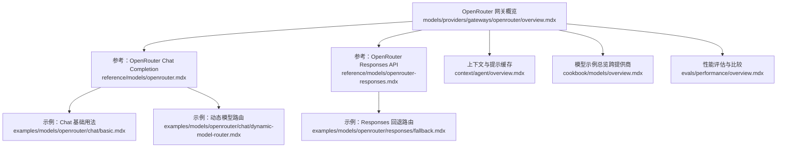
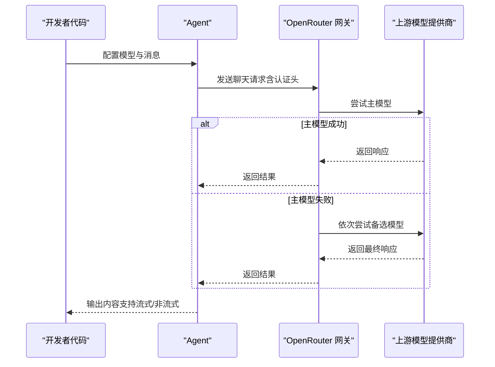
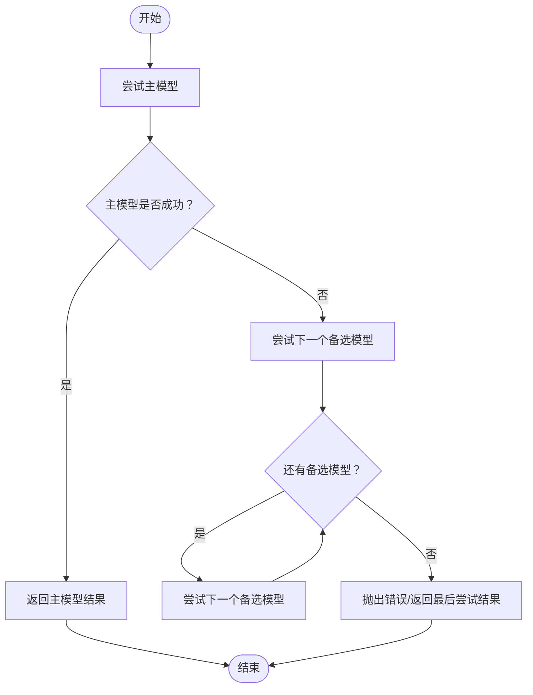
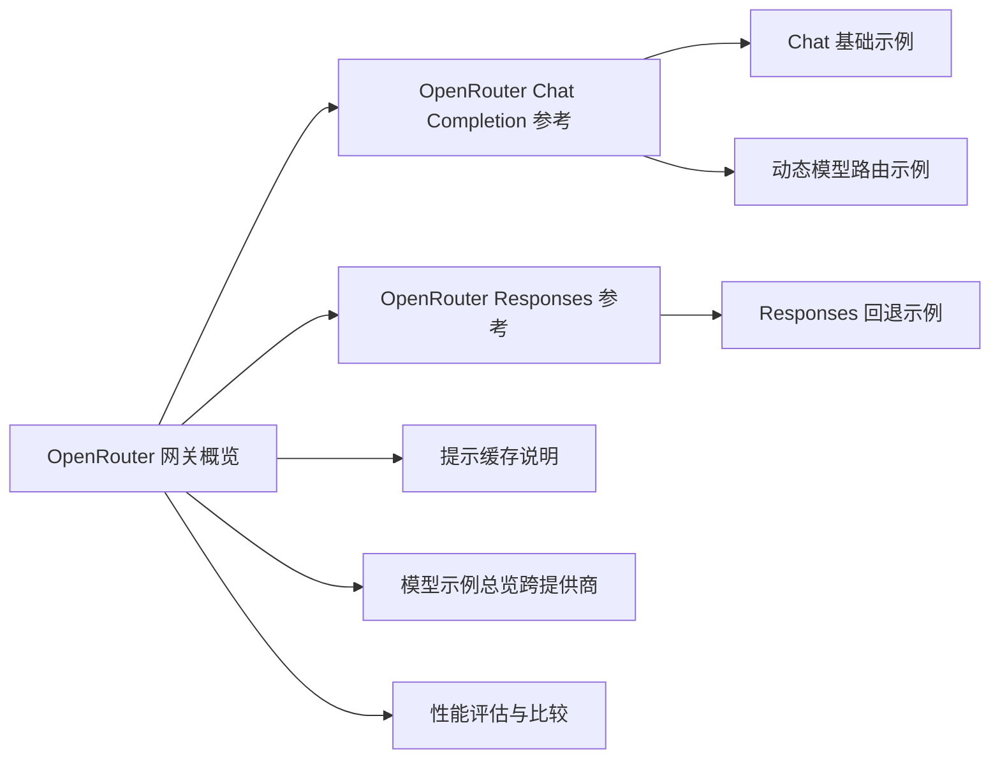

# OpenRouter 网关

<cite>
**本文引用的文件**
- [models/providers/gateways/openrouter/overview.mdx](file://models/providers/gateways/openrouter/overview.mdx)
- [reference/models/openrouter.mdx](file://reference/models/openrouter.mdx)
- [reference/models/openrouter-responses.mdx](file://reference/models/openrouter-responses.mdx)
- [examples/models/openrouter/chat/basic.mdx](file://examples/models/openrouter/chat/basic.mdx)
- [examples/models/openrouter/chat/dynamic-model-router.mdx](file://examples/models/openrouter/chat/dynamic-model-router.mdx)
- [examples/models/openrouter/responses/fallback.mdx](file://examples/models/openrouter/responses/fallback.mdx)
- [cookbook/models/overview.mdx](file://cookbook/models/overview.mdx)
- [context/agent/overview.mdx](file://context/agent/overview.mdx)
- [evals/performance/overview.mdx](file://evals/performance/overview.mdx)
</cite>

## 目录
1. [简介](#简介)
2. [项目结构](#项目结构)
3. [核心组件](#核心组件)
4. [架构总览](#架构总览)
5. [详细组件分析](#详细组件分析)
6. [依赖关系分析](#依赖关系分析)
7. [性能考量](#性能考量)
8. [故障排查指南](#故障排查指南)
9. [结论](#结论)
10. [附录](#附录)

## 简介
本文件面向希望在 Agent 中集成 OpenRouter 的开发者与产品团队，系统性介绍 OpenRouter 作为开源模型聚合平台的特性与优势，并提供从认证配置、API 密钥管理到聊天与响应处理的完整使用指南。文档同时覆盖动态模型路由、回退机制、提示缓存、性能评估与模型选择策略，帮助读者在不同业务场景下做出合理的技术决策。

OpenRouter 的关键优势包括：
- 统一接口：通过单一网关访问多家模型提供商，简化集成与切换成本
- 动态路由与回退：在主模型不可用时自动切换备选模型，提升可靠性
- 提示缓存：对支持的提供商自动启用提示缓存，降低延迟与费用
- 开源生态：拥抱开源模型与社区贡献，强调透明度与可审计性

## 项目结构
围绕 OpenRouter 的文档与示例主要分布在以下路径：
- 模型网关概览与参数说明：models/providers/gateways/openrouter/overview.mdx
- 参考文档（Chat Completion 与 Responses API）：reference/models/openrouter.mdx、reference/models/openrouter-responses.mdx
- 示例：examples/models/openrouter/chat/* 与 examples/models/openrouter/responses/*
- 模型示例总览与跨提供商对比：cookbook/models/overview.mdx
- 上下文与提示缓存相关说明：context/agent/overview.mdx
- 性能评估与模型比较：evals/performance/overview.mdx

图表来源
- [models/providers/gateways/openrouter/overview.mdx:1-105](file://models/providers/gateways/openrouter/overview.mdx#L1-L105)
- [reference/models/openrouter.mdx:1-22](file://reference/models/openrouter.mdx#L1-L22)
- [reference/models/openrouter-responses.mdx:1-95](file://reference/models/openrouter-responses.mdx#L1-L95)
- [examples/models/openrouter/chat/basic.mdx:1-58](file://examples/models/openrouter/chat/basic.mdx#L1-L58)
- [examples/models/openrouter/chat/dynamic-model-router.mdx:1-68](file://examples/models/openrouter/chat/dynamic-model-router.mdx#L1-L68)
- [examples/models/openrouter/responses/fallback.mdx:1-57](file://examples/models/openrouter/responses/fallback.mdx#L1-L57)
- [context/agent/overview.mdx:510-523](file://context/agent/overview.mdx#L510-L523)
- [cookbook/models/overview.mdx:1-107](file://cookbook/models/overview.mdx#L1-L107)
- [evals/performance/overview.mdx:1-452](file://evals/performance/overview.mdx#L1-L452)

章节来源
- [models/providers/gateways/openrouter/overview.mdx:1-105](file://models/providers/gateways/openrouter/overview.mdx#L1-L105)
- [cookbook/models/overview.mdx:1-107](file://cookbook/models/overview.mdx#L1-L107)

## 核心组件
- OpenRouter Chat Completion 模型：提供统一的聊天补全能力，支持与 OpenAI 兼容的参数集合，便于在不同提供商间切换。
- OpenRouter Responses API：以 OpenAI 兼容的方式访问多模型，支持回退路由、无状态请求、推理模式等特性。
- 动态模型路由：允许在主模型失败时按顺序尝试备选模型，增强可用性与弹性。
- 提示缓存：对支持的提供商自动启用；对不支持的场景可通过特定头部开启。
- 认证与密钥管理：通过环境变量 OPENROUTER_API_KEY 进行配置，确保密钥安全与最小暴露面。

章节来源
- [models/providers/gateways/openrouter/overview.mdx:9-23](file://models/providers/gateways/openrouter/overview.mdx#L9-L23)
- [models/providers/gateways/openrouter/overview.mdx:47-58](file://models/providers/gateways/openrouter/overview.mdx#L47-L58)
- [reference/models/openrouter.mdx:8-22](file://reference/models/openrouter.mdx#L8-L22)
- [reference/models/openrouter-responses.mdx:6-22](file://reference/models/openrouter-responses.mdx#L6-L22)
- [models/providers/gateways/openrouter/overview.mdx:101-105](file://models/providers/gateways/openrouter/overview.mdx#L101-L105)

## 架构总览
下图展示了 Agent 使用 OpenRouter 的典型调用链路，包括认证、动态路由与回退策略：

图表来源
- [models/providers/gateways/openrouter/overview.mdx:25-47](file://models/providers/gateways/openrouter/overview.mdx#L25-L47)
- [reference/models/openrouter-responses.mdx:68-88](file://reference/models/openrouter-responses.mdx#L68-L88)
- [examples/models/openrouter/chat/dynamic-model-router.mdx:28-43](file://examples/models/openrouter/chat/dynamic-model-router.mdx#L28-L43)

## 详细组件分析

### 认证与密钥管理
- 环境变量：OPENROUTER_API_KEY
- 设置方式：在本地终端导出或在部署平台配置
- 安全建议：避免硬编码密钥；使用平台提供的密钥轮换与权限控制功能

章节来源
- [models/providers/gateways/openrouter/overview.mdx:9-23](file://models/providers/gateways/openrouter/overview.mdx#L9-L23)

### Chat Completion 使用示例
- 基础用法：同步/异步、流式/非流式输出
- 适用场景：快速集成、原型验证、批量任务

章节来源
- [examples/models/openrouter/chat/basic.mdx:1-58](file://examples/models/openrouter/chat/basic.mdx#L1-L58)

### 动态模型路由与回退
- 场景：主模型遇到限流、超时、不可用或过载
- 行为：按顺序尝试备选模型直至成功
- 结果：提升稳定性与可用性，便于灰度与 A/B 路由

图表来源
- [examples/models/openrouter/chat/dynamic-model-router.mdx:6-18](file://examples/models/openrouter/chat/dynamic-model-router.mdx#L6-L18)
- [examples/models/openrouter/chat/dynamic-model-router.mdx:28-43](file://examples/models/openrouter/chat/dynamic-model-router.mdx#L28-L43)

章节来源
- [examples/models/openrouter/chat/dynamic-model-router.mdx:1-68](file://examples/models/openrouter/chat/dynamic-model-router.mdx#L1-L68)

### Responses API 与回退路由
- 特性：统一接口、无状态请求、推理模式、回退模型列表
- 适用：需要更强弹性与兼容性的生产场景

章节来源
- [reference/models/openrouter-responses.mdx:6-22](file://reference/models/openrouter-responses.mdx#L6-L22)
- [examples/models/openrouter/responses/fallback.mdx:1-57](file://examples/models/openrouter/responses/fallback.mdx#L1-L57)

### 提示缓存
- 自动缓存：对支持的提供商自动生效
- 手动控制：对不支持的场景可通过特定头部启用
- 效果：降低重复输入的延迟与费用

章节来源
- [models/providers/gateways/openrouter/overview.mdx:101-105](file://models/providers/gateways/openrouter/overview.mdx#L101-L105)
- [context/agent/overview.mdx:514-515](file://context/agent/overview.mdx#L514-L515)

### 在 Agent 中集成 OpenRouter
- 统一接口：Agent 无需感知底层提供商差异
- 参数兼容：继承 OpenAI 兼容参数，便于迁移与复用
- 多种模式：Responses API 适合高弹性需求；Chat Completion 适合快速集成

章节来源
- [models/providers/gateways/openrouter/overview.mdx:47-58](file://models/providers/gateways/openrouter/overview.mdx#L47-L58)
- [reference/models/openrouter.mdx:10-22](file://reference/models/openrouter.mdx#L10-L22)

## 依赖关系分析
OpenRouter 网关在文档体系中的位置与其上下游依赖如下：

图表来源
- [models/providers/gateways/openrouter/overview.mdx:1-105](file://models/providers/gateways/openrouter/overview.mdx#L1-L105)
- [reference/models/openrouter.mdx:1-22](file://reference/models/openrouter.mdx#L1-L22)
- [reference/models/openrouter-responses.mdx:1-95](file://reference/models/openrouter-responses.mdx#L1-L95)
- [examples/models/openrouter/chat/basic.mdx:1-58](file://examples/models/openrouter/chat/basic.mdx#L1-L58)
- [examples/models/openrouter/chat/dynamic-model-router.mdx:1-68](file://examples/models/openrouter/chat/dynamic-model-router.mdx#L1-L68)
- [examples/models/openrouter/responses/fallback.mdx:1-57](file://examples/models/openrouter/responses/fallback.mdx#L1-L57)
- [context/agent/overview.mdx:510-523](file://context/agent/overview.mdx#L510-L523)
- [cookbook/models/overview.mdx:1-107](file://cookbook/models/overview.mdx#L1-L107)
- [evals/performance/overview.mdx:1-452](file://evals/performance/overview.mdx#L1-L452)

章节来源
- [cookbook/models/overview.mdx:44-73](file://cookbook/models/overview.mdx#L44-L73)

## 性能考量
- 启动与实例化开销：通过性能评估工具测量 Agent/Team 的实例化耗时与内存增长，识别潜在瓶颈
- 工具与存储影响：评估工具调用与存储写入对性能的影响，优化高频路径
- 异步执行：在高并发场景采用异步调用，减少阻塞
- 缓存与回退：结合提示缓存与动态路由，平衡延迟与可用性

章节来源
- [evals/performance/overview.mdx:11-47](file://evals/performance/overview.mdx#L11-L47)
- [evals/performance/overview.mdx:48-85](file://evals/performance/overview.mdx#L48-L85)
- [evals/performance/overview.mdx:87-117](file://evals/performance/overview.mdx#L87-L117)
- [evals/performance/overview.mdx:118-201](file://evals/performance/overview.mdx#L118-L201)
- [evals/performance/overview.mdx:202-251](file://evals/performance/overview.mdx#L202-L251)
- [evals/performance/overview.mdx:252-344](file://evals/performance/overview.mdx#L252-L344)

## 故障排查指南
- 认证失败：确认 OPENROUTER_API_KEY 是否正确设置且未过期
- 请求失败与回退：若主模型失败，检查备选模型列表与网络连通性
- 提示缓存未生效：确认提供商是否支持自动缓存；必要时手动添加相关头部
- 性能异常：使用性能评估工具定位实例化、工具调用与存储写入的热点

章节来源
- [models/providers/gateways/openrouter/overview.mdx:9-23](file://models/providers/gateways/openrouter/overview.mdx#L9-L23)
- [reference/models/openrouter-responses.mdx:68-88](file://reference/models/openrouter-responses.mdx#L68-L88)
- [models/providers/gateways/openrouter/overview.mdx:101-105](file://models/providers/gateways/openrouter/overview.mdx#L101-L105)
- [evals/performance/overview.mdx:346-452](file://evals/performance/overview.mdx#L346-L452)

## 结论
OpenRouter 为构建可移植、可弹性、可观测的 AI 应用提供了统一网关。通过动态路由与回退机制、提示缓存与 OpenAI 兼容接口，开发者可以在不改变业务代码的情况下灵活切换与组合模型资源。配合性能评估与模型示例总览，可以形成从开发到生产的闭环实践。

## 附录

### 实际应用示例（路径指引）
- 对话生成与响应处理（基础）：[examples/models/openrouter/chat/basic.mdx:1-58](file://examples/models/openrouter/chat/basic.mdx#L1-L58)
- 动态模型路由（主模型失败时自动回退）：[examples/models/openrouter/chat/dynamic-model-router.mdx:1-68](file://examples/models/openrouter/chat/dynamic-model-router.mdx#L1-L68)
- Responses API 回退路由（高弹性）：[examples/models/openrouter/responses/fallback.mdx:1-57](file://examples/models/openrouter/responses/fallback.mdx#L1-L57)

### 模型比较与选择策略（路径指引）
- 跨提供商模型一览与导入方式：[cookbook/models/overview.mdx:44-73](file://cookbook/models/overview.mdx#L44-L73)
- 性能评估与比较：[evals/performance/overview.mdx:1-452](file://evals/performance/overview.mdx#L1-L452)