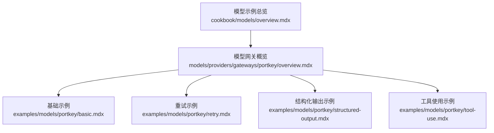
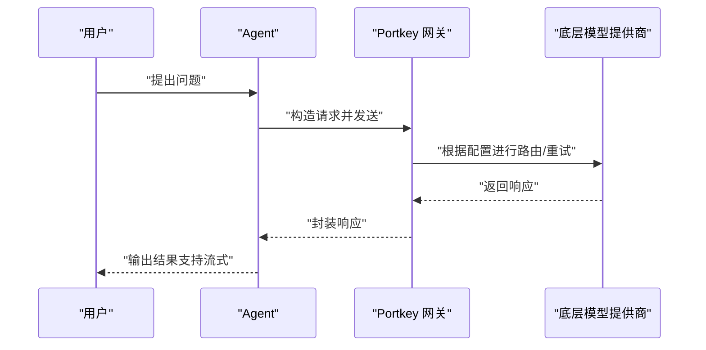
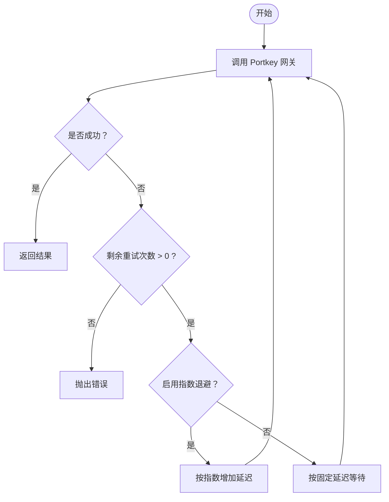
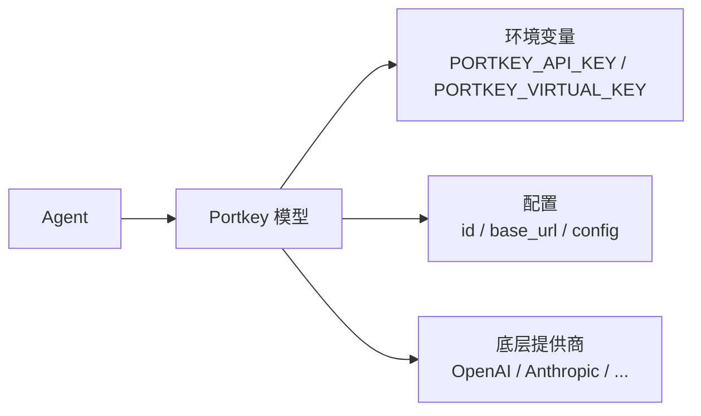

# Portkey 网关

<cite>
**本文引用的文件**
- [Portkey 概览](file://models/providers/gateways/portkey/overview.mdx)
- [Portkey 基础示例](file://examples/models/portkey/basic.mdx)
- [Portkey 重试示例](file://examples/models/portkey/retry.mdx)
- [Portkey 结构化输出示例](file://examples/models/portkey/structured-output.mdx)
- [Portkey 工具使用示例](file://examples/models/portkey/tool-use.mdx)
- [模型示例总览](file://cookbook/models/overview.mdx)
</cite>

## 目录
1. [简介](#简介)
2. [项目结构](#项目结构)
3. [核心组件](#核心组件)
4. [架构概览](#架构概览)
5. [详细组件分析](#详细组件分析)
6. [依赖分析](#依赖分析)
7. [性能考虑](#性能考虑)
8. [故障排查指南](#故障排查指南)
9. [结论](#结论)
10. [附录](#附录)

## 简介
Portkey 是一个 AI 网关，为多提供商路由提供统一接口，并支持高级能力如路由、负载均衡、重试与可观测性。通过 Portkey，开发者可以构建具备更高可靠性与成本优化能力的生产级 AI 应用。在本仓库中，Portkey 以模型网关的形式与 Agent 集成，支持同步/异步调用、流式输出、工具调用以及结构化输出。

## 项目结构
与 Portkey 相关的内容主要分布在以下位置：
- 模型网关概览：models/providers/gateways/portkey/overview.mdx
- 示例集合：examples/models/portkey/*
- 模型示例总览：cookbook/models/overview.mdx（包含 Portkey 的导入方式）

图表来源
- [Portkey 概览:1-105](file://models/providers/gateways/portkey/overview.mdx#L1-L105)
- [Portkey 基础示例:1-71](file://examples/models/portkey/basic.mdx#L1-L71)
- [Portkey 重试示例:1-50](file://examples/models/portkey/retry.mdx#L1-L50)
- [Portkey 结构化输出示例:1-75](file://examples/models/portkey/structured-output.mdx#L1-L75)
- [Portkey 工具使用示例:1-68](file://examples/models/portkey/tool-use.mdx#L1-L68)
- [模型示例总览:1-107](file://cookbook/models/overview.mdx#L1-L107)

章节来源
- [Portkey 概览:1-105](file://models/providers/gateways/portkey/overview.mdx#L1-L105)
- [模型示例总览:1-107](file://cookbook/models/overview.mdx#L1-L107)

## 核心组件
- Portkey 模型类：用于封装通过 Portkey 网关访问底层模型所需的参数与行为，支持与 Agent 的无缝集成。
- 配置参数：
  - id：通过 Portkey 访问的模型标识
  - name：模型名称
  - provider：提供方标识
  - portkey_api_key：Portkey API 密钥（默认从环境变量读取）
  - base_url：Portkey 网关端点（标准托管服务默认值适用于大多数场景）
  - virtual_key：底层提供商的虚拟密钥
  - config：高级配置（如路由策略、目标提供商等）
- 支持的通用参数：与 OpenAI 参数保持一致，便于跨提供商迁移

章节来源
- [Portkey 概览:84-104](file://models/providers/gateways/portkey/overview.mdx#L84-L104)

## 架构概览
下图展示了 Agent 使用 Portkey 作为网关时的整体交互流程：

图表来源
- [Portkey 概览:35-82](file://models/providers/gateways/portkey/overview.mdx#L35-L82)
- [Portkey 基础示例:37-56](file://examples/models/portkey/basic.mdx#L37-L56)

## 详细组件分析

### 组件一：认证与密钥配置
- 需要两把“钥匙”：
  - Portkey API Key：用于访问 Portkey 网关
  - Virtual Key：用于指定底层提供商（例如 OpenAI、Anthropic 等）
- 环境变量建议：
  - Mac/Linux：PORTKEY_API_KEY、PORTKEY_VIRTUAL_KEY
  - Windows：通过 setx 设置系统环境变量
- 网关端点：
  - 默认标准托管服务端点适用于大多数场景
  - 自托管或企业定制时可覆盖 base_url

章节来源
- [Portkey 概览:17-33](file://models/providers/gateways/portkey/overview.mdx#L17-L33)
- [Portkey 概览:98-104](file://models/providers/gateways/portkey/overview.mdx#L98-L104)

### 组件二：基础使用与集成
- 在 Agent 中直接使用 Portkey 模型，即可获得统一的调用体验
- 支持同步、异步与流式输出，满足不同场景需求
- 示例路径参考：
  - [基础示例:37-56](file://examples/models/portkey/basic.mdx#L37-L56)

章节来源
- [Portkey 概览:35-54](file://models/providers/gateways/portkey/overview.mdx#L35-L54)
- [Portkey 基础示例:37-56](file://examples/models/portkey/basic.mdx#L37-L56)

### 组件三：重试机制
- 可通过 retries、delay_between_retries、exponential_backoff 等参数配置重试策略
- 典型用法：当模型 ID 不正确或网络波动导致失败时，自动重试以提升稳定性
- 示例路径参考：
  - [重试示例:16-26](file://examples/models/portkey/retry.mdx#L16-L26)

图表来源
- [Portkey 重试示例:16-26](file://examples/models/portkey/retry.mdx#L16-L26)

章节来源
- [Portkey 重试示例:16-26](file://examples/models/portkey/retry.mdx#L16-L26)

### 组件四：结构化输出
- 通过定义 Pydantic 输出模式，Agent 返回符合 Schema 的结构化内容
- 典型场景：生成剧本、产品清单、分类标签等
- 示例路径参考：
  - [结构化输出示例:24-47](file://examples/models/portkey/structured-output.mdx#L24-L47)

章节来源
- [Portkey 结构化输出示例:24-47](file://examples/models/portkey/structured-output.mdx#L24-L47)

### 组件五：工具使用
- 将工具（如网络搜索）与 Portkey 模型结合，实现“思考+行动”的智能体工作流
- 支持同步/异步与流式输出，便于实时反馈
- 示例路径参考：
  - [工具使用示例:23-27](file://examples/models/portkey/tool-use.mdx#L23-L27)

章节来源
- [Portkey 工具使用示例:23-27](file://examples/models/portkey/tool-use.mdx#L23-L27)

### 组件六：高级配置（路由与目标）
- 通过 config 提供策略与目标列表，实现多提供商的回退/轮询等路由策略
- 示例路径参考：
  - [Portkey 概览（高级配置）:56-82](file://models/providers/gateways/portkey/overview.mdx#L56-L82)

章节来源
- [Portkey 概览:56-82](file://models/providers/gateways/portkey/overview.mdx#L56-L82)

## 依赖分析
- 与 Agent 的耦合度低，仅需在 Agent 初始化时传入 Portkey 模型实例
- 与底层提供商解耦：通过 virtual_key 与 config 实现对多家提供商的统一接入
- 与 OpenAI 参数兼容：便于在不同提供商间切换

图表来源
- [Portkey 概览:17-33](file://models/providers/gateways/portkey/overview.mdx#L17-L33)
- [Portkey 概览:84-104](file://models/providers/gateways/portkey/overview.mdx#L84-L104)

章节来源
- [Portkey 概览:17-33](file://models/providers/gateways/portkey/overview.mdx#L17-L33)
- [Portkey 概览:84-104](file://models/providers/gateways/portkey/overview.mdx#L84-L104)

## 性能考虑
- 路由与回退：在多个提供商之间进行动态选择，提高可用性与稳定性
- 缓存与限流：通过网关侧缓存与限流策略降低调用成本与抖动
- 指数退避：在重试时采用指数退避，避免雪崩效应
- 流式输出：减少端到端等待时间，改善用户体验

章节来源
- [Portkey 概览:9-15](file://models/providers/gateways/portkey/overview.mdx#L9-L15)
- [Portkey 重试示例:22-24](file://examples/models/portkey/retry.mdx#L22-L24)

## 故障排查指南
- 环境变量未设置：确认 PORTKEY_API_KEY 与 PORTKEY_VIRTUAL_KEY 是否正确导出
- 端点异常：若使用自托管或企业定制端点，请检查 base_url 配置
- 模型 ID 错误：可通过重试配置提升容错；必要时核对虚拟键与模型标识
- 输出格式不符：若使用结构化输出，确保输出模式定义完整且与提示词匹配

章节来源
- [Portkey 概览:17-33](file://models/providers/gateways/portkey/overview.mdx#L17-L33)
- [Portkey 概览:98-104](file://models/providers/gateways/portkey/overview.mdx#L98-L104)
- [Portkey 重试示例:16-26](file://examples/models/portkey/retry.mdx#L16-L26)
- [Portkey 结构化输出示例:24-47](file://examples/models/portkey/structured-output.mdx#L24-L47)

## 结论
Portkey 网关为多提供商 AI 场景提供了统一、可靠且可扩展的接入层。通过与 Agent 的简单集成，即可获得路由、回退、重试、可观测性与成本优化等能力。结合结构化输出与工具使用，Portkey 能够支撑从基础问答到复杂推理与执行的多样化应用。

## 附录
- 快速开始与更多示例入口：
  - [模型示例总览:72-72](file://cookbook/models/overview.mdx#L72-L72)
  - [Portkey 基础示例:59-70](file://examples/models/portkey/basic.mdx#L59-L70)
  - [Portkey 重试示例:38-49](file://examples/models/portkey/retry.mdx#L38-L49)
  - [Portkey 结构化输出示例:63-74](file://examples/models/portkey/structured-output.mdx#L63-L74)
  - [Portkey 工具使用示例:56-67](file://examples/models/portkey/tool-use.mdx#L56-L67)