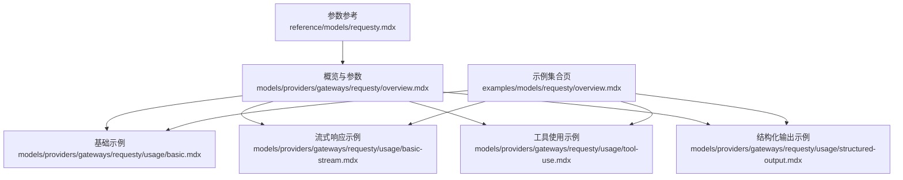
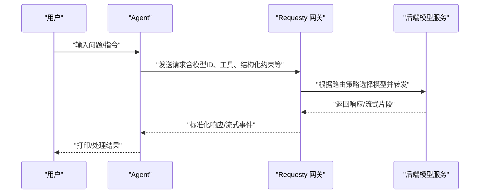

# Requesty 网关

<cite>
**本文引用的文件**
- [models/providers/gateways/requesty/overview.mdx](file://models/providers/gateways/requesty/overview.mdx)
- [reference/models/requesty.mdx](file://reference/models/requesty.mdx)
- [models/providers/gateways/requesty/usage/basic.mdx](file://models/providers/gateways/requesty/usage/basic.mdx)
- [models/providers/gateways/requesty/usage/basic-stream.mdx](file://models/providers/gateways/requesty/usage/basic-stream.mdx)
- [models/providers/gateways/requesty/usage/tool-use.mdx](file://models/providers/gateways/requesty/usage/tool-use.mdx)
- [models/providers/gateways/requesty/usage/structured-output.mdx](file://models/providers/gateways/requesty/usage/structured-output.mdx)
- [examples/models/requesty/overview.mdx](file://examples/models/requesty/overview.mdx)
- [examples/models/requesty/basic.mdx](file://examples/models/requesty/basic.mdx)
- [examples/models/requesty/tool-use.mdx](file://examples/models/requesty/tool-use.mdx)
- [examples/models/requesty/structured-output.mdx](file://examples/models/requesty/structured-output.mdx)
- [examples/models/requesty/retry.mdx](file://examples/models/requesty/retry.mdx)
</cite>

## 目录
1. [简介](#简介)
2. [项目结构](#项目结构)
3. [核心组件](#核心组件)
4. [架构总览](#架构总览)
5. [详细组件分析](#详细组件分析)
6. [依赖关系分析](#依赖关系分析)
7. [性能考虑](#性能考虑)
8. [故障排查指南](#故障排查指南)
9. [结论](#结论)
10. [附录](#附录)

## 简介
本文件为 Requesty 网关的使用文档，面向希望在 Agent 中集成请求路由与模型聚合能力的用户。Requesty 是一个具备 AI 治理与监控能力的 LLM 网关，通过统一入口访问多种语言模型，并提供路由优化、重试机制、结构化输出与工具调用等能力。本文将从认证配置、API 密钥设置、基础使用示例、重试机制、结构化输出与工具使用等方面进行系统说明，并给出请求路由策略、负载均衡与性能优化建议。

## 项目结构
围绕 Requesty 的文档与示例主要分布在以下路径：
- 概览与参数参考：models/providers/gateways/requesty/overview.mdx、reference/models/requesty.mdx
- 使用示例（Cookbook）：models/providers/gateways/requesty/usage/*
- 示例集合页面：examples/models/requesty/*

图表来源
- [models/providers/gateways/requesty/overview.mdx:1-63](file://models/providers/gateways/requesty/overview.mdx#L1-L63)
- [reference/models/requesty.mdx:1-19](file://reference/models/requesty.mdx#L1-L19)
- [models/providers/gateways/requesty/usage/basic.mdx:1-49](file://models/providers/gateways/requesty/usage/basic.mdx#L1-L49)
- [models/providers/gateways/requesty/usage/basic-stream.mdx:1-46](file://models/providers/gateways/requesty/usage/basic-stream.mdx#L1-L46)
- [models/providers/gateways/requesty/usage/tool-use.mdx:1-45](file://models/providers/gateways/requesty/usage/tool-use.mdx#L1-L45)
- [models/providers/gateways/requesty/usage/structured-output.mdx:1-65](file://models/providers/gateways/requesty/usage/structured-output.mdx#L1-L65)
- [examples/models/requesty/overview.mdx:1-12](file://examples/models/requesty/overview.mdx#L1-L12)

章节来源
- [models/providers/gateways/requesty/overview.mdx:1-63](file://models/providers/gateways/requesty/overview.mdx#L1-L63)
- [reference/models/requesty.mdx:1-19](file://reference/models/requesty.mdx#L1-L19)
- [examples/models/requesty/overview.mdx:1-12](file://examples/models/requesty/overview.mdx#L1-L12)

## 核心组件
- Requesty 模型封装：提供统一的模型标识、提供商名称、API 密钥、基础 URL、最大生成长度等参数；支持 OpenAI 兼容参数；并扩展了重试相关参数（重试次数、重试间隔、指数退避）。
- 认证与密钥：通过环境变量 REQUESTY_API_KEY 或显式传入 api_key 进行认证；默认基础 URL 指向 Requesty 路由器。
- 使用示例：包含基础对话、流式响应、工具调用、结构化输出以及重试配置等典型场景。

章节来源
- [models/providers/gateways/requesty/overview.mdx:15-63](file://models/providers/gateways/requesty/overview.mdx#L15-L63)
- [reference/models/requesty.mdx:8-19](file://reference/models/requesty.mdx#L8-L19)
- [models/providers/gateways/requesty/usage/basic.mdx:7-24](file://models/providers/gateways/requesty/usage/basic.mdx#L7-L24)
- [models/providers/gateways/requesty/usage/basic-stream.mdx:7-21](file://models/providers/gateways/requesty/usage/basic-stream.mdx#L7-L21)
- [models/providers/gateways/requesty/usage/tool-use.mdx:7-20](file://models/providers/gateways/requesty/usage/tool-use.mdx#L7-L20)
- [models/providers/gateways/requesty/usage/structured-output.mdx:7-40](file://models/providers/gateways/requesty/usage/structured-output.mdx#L7-L40)
- [examples/models/requesty/basic.mdx:13-48](file://examples/models/requesty/basic.mdx#L13-L48)
- [examples/models/requesty/tool-use.mdx:10-33](file://examples/models/requesty/tool-use.mdx#L10-L33)
- [examples/models/requesty/structured-output.mdx:15-58](file://examples/models/requesty/structured-output.mdx#L15-L58)
- [examples/models/requesty/retry.mdx:16-26](file://examples/models/requesty/retry.mdx#L16-L26)

## 架构总览
下图展示了 Agent 通过 Requesty 网关发起请求的整体流程：Agent 将消息与工具调用意图交给 Requesty，Requesty 基于路由策略选择后端模型并执行，返回文本或流式片段；若启用结构化输出，Requesty 将确保输出符合指定模式。

图表来源
- [models/providers/gateways/requesty/usage/basic.mdx:7-24](file://models/providers/gateways/requesty/usage/basic.mdx#L7-L24)
- [models/providers/gateways/requesty/usage/tool-use.mdx:7-20](file://models/providers/gateways/requesty/usage/tool-use.mdx#L7-L20)
- [models/providers/gateways/requesty/usage/structured-output.mdx:7-40](file://models/providers/gateways/requesty/usage/structured-output.mdx#L7-L40)

## 详细组件分析

### 组件一：认证与 API 密钥配置
- 环境变量：REQUESTY_API_KEY
- 代码路径：概览与使用示例中均明确要求设置该环境变量
- 参考路径：
  - [models/providers/gateways/requesty/overview.mdx:15-30](file://models/providers/gateways/requesty/overview.mdx#L15-L30)
  - [models/providers/gateways/requesty/usage/basic.mdx:31-35](file://models/providers/gateways/requesty/usage/basic.mdx#L31-L35)
  - [models/providers/gateways/requesty/usage/basic-stream.mdx:28-32](file://models/providers/gateways/requesty/usage/basic-stream.mdx#L28-L32)
  - [models/providers/gateways/requesty/usage/tool-use.mdx:27-31](file://models/providers/gateways/requesty/usage/tool-use.mdx#L27-L31)
  - [models/providers/gateways/requesty/usage/structured-output.mdx:47-51](file://models/providers/gateways/requesty/usage/structured-output.mdx#L47-L51)

章节来源
- [models/providers/gateways/requesty/overview.mdx:15-30](file://models/providers/gateways/requesty/overview.mdx#L15-L30)
- [models/providers/gateways/requesty/usage/basic.mdx:31-35](file://models/providers/gateways/requesty/usage/basic.mdx#L31-L35)
- [models/providers/gateways/requesty/usage/basic-stream.mdx:28-32](file://models/providers/gateways/requesty/usage/basic-stream.mdx#L28-L32)
- [models/providers/gateways/requesty/usage/tool-use.mdx:27-31](file://models/providers/gateways/requesty/usage/tool-use.mdx#L27-L31)
- [models/providers/gateways/requesty/usage/structured-output.mdx:47-51](file://models/providers/gateways/requesty/usage/structured-output.mdx#L47-L51)

### 组件二：基础使用与流式响应
- 基础示例：创建 Agent 并使用 Requesty 模型进行问答
- 流式示例：开启 stream 参数以接收增量内容
- 参考路径：
  - [models/providers/gateways/requesty/usage/basic.mdx:7-24](file://models/providers/gateways/requesty/usage/basic.mdx#L7-L24)
  - [models/providers/gateways/requesty/usage/basic-stream.mdx:7-21](file://models/providers/gateways/requesty/usage/basic-stream.mdx#L7-L21)
  - [examples/models/requesty/basic.mdx:13-48](file://examples/models/requesty/basic.mdx#L13-L48)

章节来源
- [models/providers/gateways/requesty/usage/basic.mdx:7-24](file://models/providers/gateways/requesty/usage/basic.mdx#L7-L24)
- [models/providers/gateways/requesty/usage/basic-stream.mdx:7-21](file://models/providers/gateways/requesty/usage/basic-stream.mdx#L7-L21)
- [examples/models/requesty/basic.mdx:13-48](file://examples/models/requesty/basic.mdx#L13-L48)

### 组件三：工具使用（Tool Use）
- 在 Agent 中注册工具，Requesty 将根据模型能力决定是否进行工具调用
- 参考路径：
  - [models/providers/gateways/requesty/usage/tool-use.mdx:7-20](file://models/providers/gateways/requesty/usage/tool-use.mdx#L7-L20)
  - [examples/models/requesty/tool-use.mdx:10-33](file://examples/models/requesty/tool-use.mdx#L10-L33)

章节来源
- [models/providers/gateways/requesty/usage/tool-use.mdx:7-20](file://models/providers/gateways/requesty/usage/tool-use.mdx#L7-L20)
- [examples/models/requesty/tool-use.mdx:10-33](file://examples/models/requesty/tool-use.mdx#L10-L33)

### 组件四：结构化输出（Structured Output）
- 通过输出模式定义（如 Pydantic 模型）约束模型输出格式
- 参考路径：
  - [models/providers/gateways/requesty/usage/structured-output.mdx:7-40](file://models/providers/gateways/requesty/usage/structured-output.mdx#L7-L40)
  - [examples/models/requesty/structured-output.mdx:15-58](file://examples/models/requesty/structured-output.mdx#L15-L58)

章节来源
- [models/providers/gateways/requesty/usage/structured-output.mdx:7-40](file://models/providers/gateways/requesty/usage/structured-output.mdx#L7-L40)
- [examples/models/requesty/structured-output.mdx:15-58](file://examples/models/requesty/structured-output.mdx#L15-L58)

### 组件五：重试机制（Retries）
- 支持设置重试次数、重试间隔与指数退避策略
- 示例演示了错误模型 ID 触发重试的场景
- 参考路径：
  - [reference/models/requesty.mdx:18-19](file://reference/models/requesty.mdx#L18-L19)
  - [examples/models/requesty/retry.mdx:16-26](file://examples/models/requesty/retry.mdx#L16-L26)

章节来源
- [reference/models/requesty.mdx:18-19](file://reference/models/requesty.mdx#L18-L19)
- [examples/models/requesty/retry.mdx:16-26](file://examples/models/requesty/retry.mdx#L16-L26)

### 组件六：参数与兼容性
- Requesty 参数表：id、name、provider、api_key、base_url、max_tokens、retries、delay_between_retries 等
- 兼容 OpenAI 参数：可直接复用 OpenAI 风格的参数
- 参考路径：
  - [models/providers/gateways/requesty/overview.mdx:52-63](file://models/providers/gateways/requesty/overview.mdx#L52-L63)
  - [reference/models/requesty.mdx:8-19](file://reference/models/requesty.mdx#L8-L19)

章节来源
- [models/providers/gateways/requesty/overview.mdx:52-63](file://models/providers/gateways/requesty/overview.mdx#L52-L63)
- [reference/models/requesty.mdx:8-19](file://reference/models/requesty.mdx#L8-L19)

## 依赖关系分析
- Agent 依赖 Requesty 模型封装，后者负责与 Requesty 网关交互
- Requesty 网关依赖后端模型服务（由 Requesty 路由策略决定）
- 工具与结构化输出通过 Requesty 的路由与治理能力进行编排

图表来源
- [models/providers/gateways/requesty/usage/tool-use.mdx:7-20](file://models/providers/gateways/requesty/usage/tool-use.mdx#L7-L20)
- [models/providers/gateways/requesty/usage/structured-output.mdx:7-40](file://models/providers/gateways/requesty/usage/structured-output.mdx#L7-L40)

## 性能考虑
- 合理设置 max_tokens 与流式传输，降低首字节延迟并提升用户体验
- 在高并发场景下，结合 Requesty 的路由策略与后端模型能力，避免热点模型过载
- 使用指数退避与重试机制，增强网络抖动下的稳定性
- 对工具调用进行缓存与去重，减少重复外部请求

## 故障排查指南
- 认证失败：确认 REQUESTY_API_KEY 是否正确设置且未过期
- 路由错误：检查 id 是否为 Requesty 支持的模型标识
- 输出不符合预期：核对结构化输出模式定义与提示词
- 网络不稳定：适当提高 retries 与 delay_between_retries，并启用指数退避

章节来源
- [models/providers/gateways/requesty/overview.mdx:15-30](file://models/providers/gateways/requesty/overview.mdx#L15-L30)
- [examples/models/requesty/retry.mdx:16-26](file://examples/models/requesty/retry.mdx#L16-L26)
- [models/providers/gateways/requesty/usage/structured-output.mdx:7-40](file://models/providers/gateways/requesty/usage/structured-output.mdx#L7-L40)

## 结论
Requesty 网关为多模型环境提供了统一的请求路由与治理能力。通过合理的认证配置、参数设置与示例实践，可以在 Agent 中高效地实现基础对话、流式响应、工具调用与结构化输出。配合重试与指数退避策略，可在复杂网络环境中保持稳定与高性能。

## 附录
- 快速开始步骤（来自使用示例）：
  - 创建虚拟环境
  - 设置 REQUESTY_API_KEY
  - 安装依赖并运行示例脚本
- 参考路径：
  - [models/providers/gateways/requesty/usage/basic.mdx:26-48](file://models/providers/gateways/requesty/usage/basic.mdx#L26-L48)
  - [models/providers/gateways/requesty/usage/basic-stream.mdx:23-45](file://models/providers/gateways/requesty/usage/basic-stream.mdx#L23-L45)
  - [models/providers/gateways/requesty/usage/tool-use.mdx:22-44](file://models/providers/gateways/requesty/usage/tool-use.mdx#L22-L44)
  - [models/providers/gateways/requesty/usage/structured-output.mdx:42-64](file://models/providers/gateways/requesty/usage/structured-output.mdx#L42-L64)