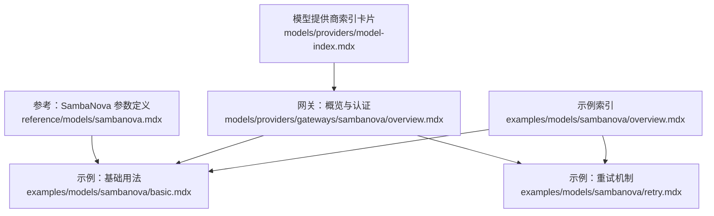
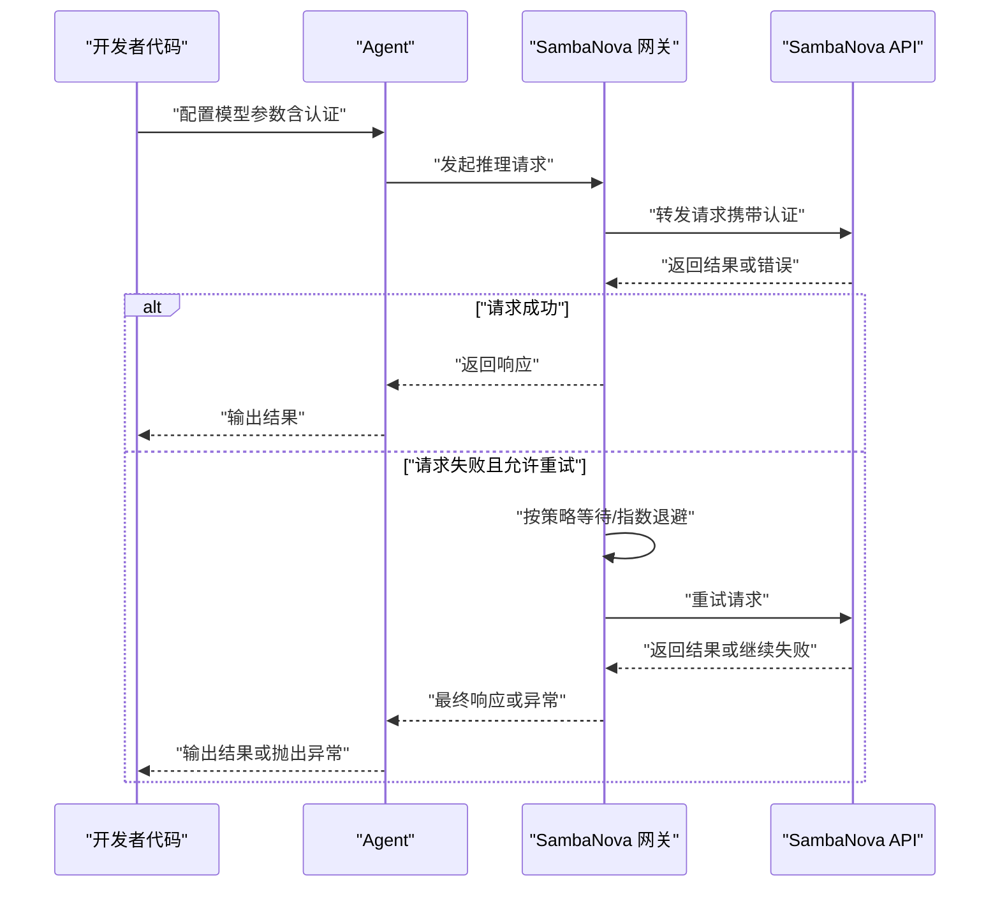
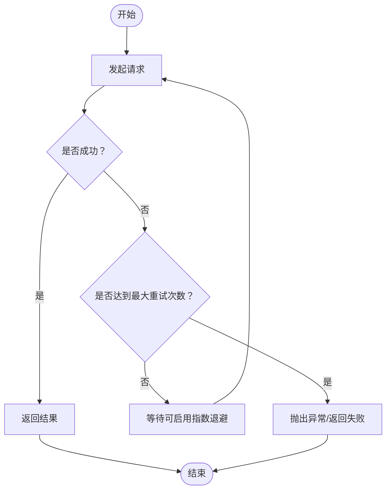
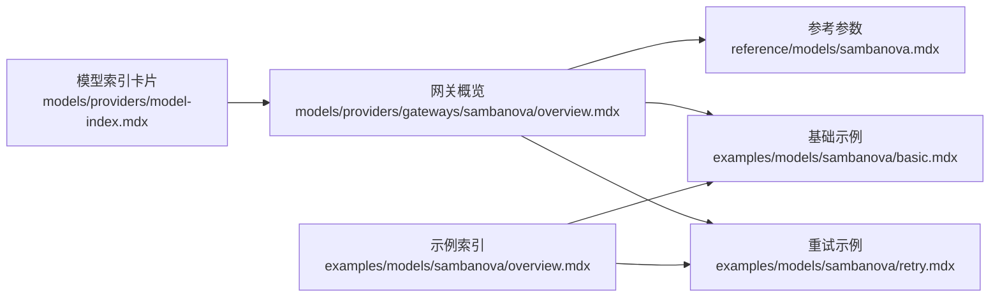

# SambaNova 网关

<cite>
**本文引用的文件**   
- [reference/models/sambanova.mdx](file://reference/models/sambanova.mdx)
- [models/providers/gateways/sambanova/overview.mdx](file://models/providers/gateways/sambanova/overview.mdx)
- [examples/models/sambanova/basic.mdx](file://examples/models/sambanova/basic.mdx)
- [examples/models/sambanova/retry.mdx](file://examples/models/sambanova/retry.mdx)
- [examples/models/sambanova/overview.mdx](file://examples/models/sambanova/overview.mdx)
- [models/providers/model-index.mdx](file://models/providers/model-index.mdx)
</cite>

## 目录
1. [简介](#简介)
2. [项目结构](#项目结构)
3. [核心组件](#核心组件)
4. [架构总览](#架构总览)
5. [详细组件分析](#详细组件分析)
6. [依赖关系分析](#依赖关系分析)
7. [性能考虑](#性能考虑)
8. [故障排查指南](#故障排查指南)
9. [结论](#结论)
10. [附录](#附录)

## 简介
本文件面向在 Agent 中集成 SambaNova 的用户，系统性介绍 SambaNova 作为高性能 AI 推理平台的能力与特性，并提供从认证配置到基础使用、重试机制与参数调优的完整指南。SambaNova 提供 OpenAI 兼容接口，支持同步与异步、流式与非流式等多种调用方式；同时通过可配置的重试策略提升稳定性。尽管当前不支持函数调用（function calling），但其在低延迟与高吞吐方面的表现适合对实时性有要求的应用场景。

## 项目结构
围绕 SambaNova 的文档与示例主要分布在以下位置：
- 参考与参数定义：reference/models/sambanova.mdx
- 网关概览与认证：models/providers/gateways/sambanova/overview.mdx
- 基础与重试示例：examples/models/sambanova/basic.mdx、examples/models/sambanova/retry.mdx
- 示例索引：examples/models/sambanova/overview.mdx
- 模型提供商索引卡片：models/providers/model-index.mdx

**图表来源**
- [reference/models/sambanova.mdx:1-21](file://reference/models/sambanova.mdx#L1-L21)
- [models/providers/gateways/sambanova/overview.mdx:1-55](file://models/providers/gateways/sambanova/overview.mdx#L1-L55)
- [examples/models/sambanova/basic.mdx:1-58](file://examples/models/sambanova/basic.mdx#L1-L58)
- [examples/models/sambanova/retry.mdx:1-50](file://examples/models/sambanova/retry.mdx#L1-L50)
- [examples/models/sambanova/overview.mdx:1-10](file://examples/models/sambanova/overview.mdx#L1-L10)
- [models/providers/model-index.mdx:350-375](file://models/providers/model-index.mdx#L350-L375)

**章节来源**
- [reference/models/sambanova.mdx:1-21](file://reference/models/sambanova.mdx#L1-L21)
- [models/providers/gateways/sambanova/overview.mdx:1-55](file://models/providers/gateways/sambanova/overview.mdx#L1-L55)
- [examples/models/sambanova/basic.mdx:1-58](file://examples/models/sambanova/basic.mdx#L1-L58)
- [examples/models/sambanova/retry.mdx:1-50](file://examples/models/sambanova/retry.mdx#L1-L50)
- [examples/models/sambanova/overview.mdx:1-10](file://examples/models/sambanova/overview.mdx#L1-L10)
- [models/providers/model-index.mdx:350-375](file://models/providers/model-index.mdx#L350-L375)

## 核心组件
- SambaNova 模型封装：提供 id、name、provider、api_key、base_url 等参数，以及 retries、delay_between_retries、exponential_backoff 等重试相关参数。
- 认证与环境变量：通过环境变量设置 API Key，便于在不同运行环境中安全注入密钥。
- 调用方式：支持同步、异步、流式与非流式调用，满足多样化的性能与体验需求。
- 与 Agent 集成：以模型参数形式注入 Agent，即可直接进行对话或工具交互。

**章节来源**
- [reference/models/sambanova.mdx:8-21](file://reference/models/sambanova.mdx#L8-L21)
- [models/providers/gateways/sambanova/overview.mdx:9-23](file://models/providers/gateways/sambanova/overview.mdx#L9-L23)
- [examples/models/sambanova/basic.mdx:32-43](file://examples/models/sambanova/basic.mdx#L32-L43)

## 架构总览
下图展示了 Agent 使用 SambaNova 进行推理的整体流程，包括认证、请求发送、重试与响应返回的关键节点。

**图表来源**
- [reference/models/sambanova.mdx:17-19](file://reference/models/sambanova.mdx#L17-L19)
- [models/providers/gateways/sambanova/overview.mdx:9-23](file://models/providers/gateways/sambanova/overview.mdx#L9-L23)
- [examples/models/sambanova/retry.mdx:19-26](file://examples/models/sambanova/retry.mdx#L19-L26)

## 详细组件分析

### 组件一：认证与 API 密钥设置
- 环境变量：SambaNova 支持通过环境变量设置 API Key，避免硬编码密钥带来的安全风险。
- 设置方式：提供 macOS 与 Windows 的典型设置示例，便于本地开发与 CI/CD 环境统一管理。

**章节来源**
- [models/providers/gateways/sambanova/overview.mdx:9-23](file://models/providers/gateways/sambanova/overview.mdx#L9-L23)

### 组件二：基础使用与调用模式
- 同步与异步：支持同步打印与异步打印两种调用方式，满足不同并发模型。
- 流式与非流式：支持流式输出，适合需要边生成边显示的交互体验。
- 示例覆盖：包含同步、同步+流式、异步、异步+流式的完整用法演示。

**章节来源**
- [examples/models/sambanova/basic.mdx:32-43](file://examples/models/sambanova/basic.mdx#L32-L43)

### 组件三：重试机制与配置选项
- 重试参数：retries、delay_between_retries、exponential_backoff 三个关键参数用于控制重试次数、间隔与退避策略。
- 实战示例：通过故意传入错误的模型 ID 触发重试链路，验证指数退避与多轮重试的效果。
- 适用场景：网络抖动、上游限流或瞬时不可用等场景下提升成功率。

**图表来源**
- [reference/models/sambanova.mdx:17-19](file://reference/models/sambanova.mdx#L17-L19)
- [examples/models/sambanova/retry.mdx:19-26](file://examples/models/sambanova/retry.mdx#L19-L26)

**章节来源**
- [reference/models/sambanova.mdx:17-19](file://reference/models/sambanova.mdx#L17-L19)
- [examples/models/sambanova/retry.mdx:16-28](file://examples/models/sambanova/retry.mdx#L16-L28)

### 组件四：与 Agent 的集成
- 模型注入：将 SambaNova 实例作为 Agent 的 model 参数，即可直接进行对话与工具调用。
- 参数兼容：SambaNova 扩展自 OpenAI 兼容接口，大部分 OpenAI 参数同样适用，便于迁移与复用。

**章节来源**
- [models/providers/gateways/sambanova/overview.mdx:27-42](file://models/providers/gateways/sambanova/overview.mdx#L27-L42)
- [reference/models/sambanova.mdx:21](file://reference/models/sambanova.mdx#L21)

## 依赖关系分析
- 文档层级依赖：示例文档依赖网关概览与参考参数定义；模型提供商索引卡片指向网关概览页面。
- 示例内部依赖：基础示例与重试示例共享“SambaNova”主题，便于用户在同一入口查看多种用法。

**图表来源**
- [models/providers/gateways/sambanova/overview.mdx:1-55](file://models/providers/gateways/sambanova/overview.mdx#L1-L55)
- [reference/models/sambanova.mdx:1-21](file://reference/models/sambanova.mdx#L1-L21)
- [examples/models/sambanova/basic.mdx:1-58](file://examples/models/sambanova/basic.mdx#L1-L58)
- [examples/models/sambanova/retry.mdx:1-50](file://examples/models/sambanova/retry.mdx#L1-L50)
- [examples/models/sambanova/overview.mdx:1-10](file://examples/models/sambanova/overview.mdx#L1-L10)
- [models/providers/model-index.mdx:350-375](file://models/providers/model-index.mdx#L350-L375)

**章节来源**
- [models/providers/gateways/sambanova/overview.mdx:1-55](file://models/providers/gateways/sambanova/overview.mdx#L1-L55)
- [reference/models/sambanova.mdx:1-21](file://reference/models/sambanova.mdx#L1-L21)
- [examples/models/sambanova/basic.mdx:1-58](file://examples/models/sambanova/basic.mdx#L1-L58)
- [examples/models/sambanova/retry.mdx:1-50](file://examples/models/sambanova/retry.mdx#L1-L50)
- [examples/models/sambanova/overview.mdx:1-10](file://examples/models/sambanova/overview.mdx#L1-L10)
- [models/providers/model-index.mdx:350-375](file://models/providers/model-index.mdx#L350-L375)

## 性能考虑
- 低延迟与高吞吐：SambaNova 以高性能推理为目标，适合对响应时间敏感的实时应用。
- 流式输出：在需要边生成边显示的场景中，优先选择流式输出以改善感知延迟。
- 异步执行：在高并发或后台任务中采用异步调用，减少阻塞并提升整体吞吐。
- 重试策略：适度开启重试并在指数退避下平衡成功率与延迟，避免过度重试导致端到端延迟上升。
- 平台限制：当前不支持函数调用，若需工具调用能力，建议结合其他具备该能力的网关或通过外部逻辑实现。

[本节为通用性能建议，无需特定文件引用]

## 故障排查指南
- 认证失败：检查环境变量是否正确设置，确认密钥未过期或被撤销。
- 请求失败与重试：根据示例调整 retries、delay_between_retries 与 exponential_backoff，观察端到端延迟与成功率变化。
- 模型 ID 错误：示例中通过错误 ID 触发重试链路，便于验证重试配置的有效性。
- 输出格式问题：如需结构化输出，可结合其他具备结构化输出能力的网关或在应用层进行二次解析。

**章节来源**
- [models/providers/gateways/sambanova/overview.mdx:9-23](file://models/providers/gateways/sambanova/overview.mdx#L9-L23)
- [examples/models/sambanova/retry.mdx:16-28](file://examples/models/sambanova/retry.mdx#L16-L28)

## 结论
SambaNova 为在 Agent 中集成高性能推理提供了简洁而强大的路径：通过 OpenAI 兼容接口、完善的认证与重试机制、以及丰富的调用模式，能够在保证稳定性的同时满足低延迟与高吞吐的实时应用需求。对于不支持函数调用的限制，可通过外部逻辑或与其他网关组合的方式进行弥补。建议在生产环境中结合异步与流式能力，并合理配置重试策略以获得最佳的端到端体验。

[本节为总结性内容，无需特定文件引用]

## 附录
- 示例索引：包含基础用法与重试示例的入口，便于快速定位所需用法。
- 模型提供商索引卡片：在模型提供商列表中可直接跳转至 SambaNova 网关概览页面。

**章节来源**
- [examples/models/sambanova/overview.mdx:6-9](file://examples/models/sambanova/overview.mdx#L6-L9)
- [models/providers/model-index.mdx:350-355](file://models/providers/model-index.mdx#L350-L355)