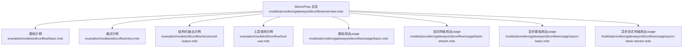
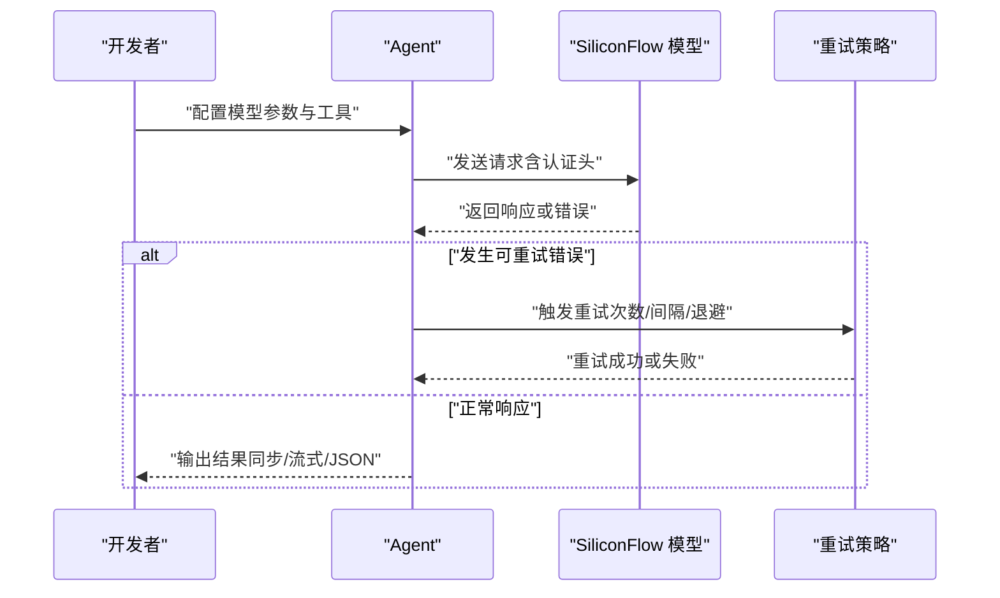
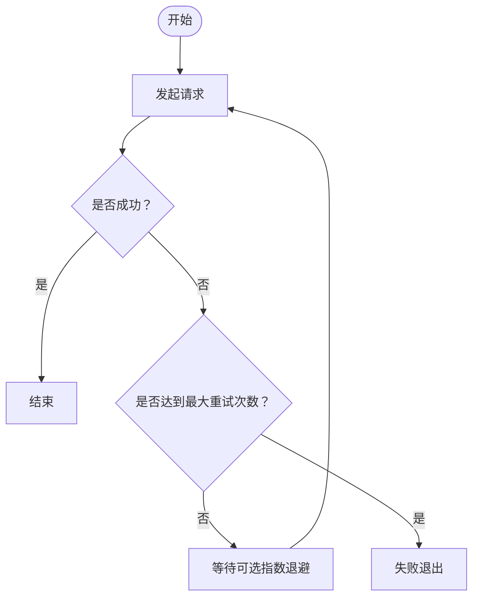
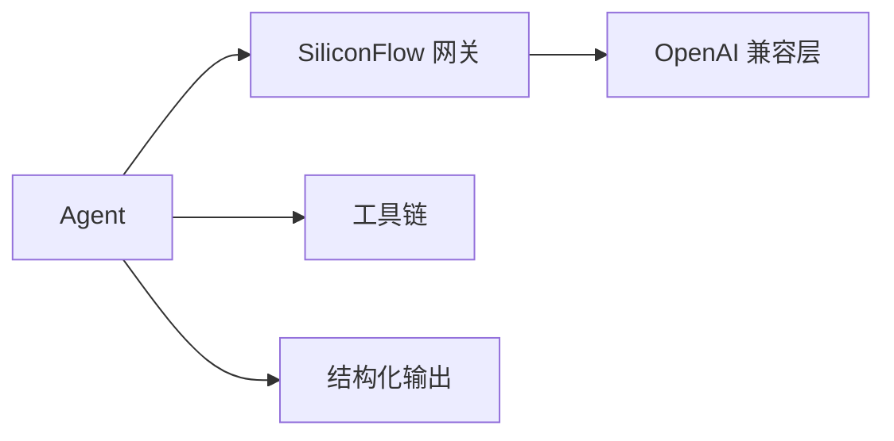

# SiliconFlow 网关

<cite>
**本文引用的文件**
- [SiliconFlow 总览](file://models/providers/gateways/siliconflow/overview.mdx)
- [SiliconFlow 基础示例](file://examples/models/siliconflow/basic.mdx)
- [SiliconFlow 重试示例](file://examples/models/siliconflow/retry.mdx)
- [SiliconFlow 结构化输出示例](file://examples/models/siliconflow/structured-output.mdx)
- [SiliconFlow 工具使用示例](file://examples/models/siliconflow/tool-use.mdx)
- [SiliconFlow 基础用法（usage）](file://models/providers/gateways/siliconflow/usage/basic.mdx)
- [SiliconFlow 流式传输用法（usage）](file://models/providers/gateways/siliconflow/usage/basic-stream.mdx)
- [SiliconFlow 异步基础用法（usage）](file://models/providers/gateways/siliconflow/usage/async-basic.mdx)
- [SiliconFlow 异步流式传输用法（usage）](file://models/providers/gateways/siliconflow/usage/async-basic-stream.mdx)
</cite>

## 目录
1. [简介](#简介)
2. [项目结构](#项目结构)
3. [核心组件](#核心组件)
4. [架构总览](#架构总览)
5. [详细组件分析](#详细组件分析)
6. [依赖关系分析](#依赖关系分析)
7. [性能与弹性](#性能与弹性)
8. [故障排查指南](#故障排查指南)
9. [结论](#结论)
10. [附录](#附录)

## 简介
本文件面向在 Agent 中集成 SiliconFlow 云端模型的用户，系统性介绍 SiliconFlow 作为云端 AI 模型提供商的特点与优势，并基于仓库中的示例与用法文档，给出认证配置、API 密钥设置、基础使用、重试机制、结构化输出、工具调用等关键能力的实操说明。同时结合 Agent OS 的通用能力，给出云端部署、弹性扩缩容与成本优化的策略建议，并提供可复现的应用示例路径，帮助快速落地。

## 项目结构
围绕 SiliconFlow 的文档与示例，主要分布在以下位置：
- 提供商网关总览：models/providers/gateways/siliconflow/overview.mdx
- 示例集合：examples/models/siliconflow/*
- 用法示例（usage）：models/providers/gateways/siliconflow/usage/*

下图展示了与 SiliconFlow 相关的文档组织关系：

**图表来源**
- [SiliconFlow 总览:1-59](file://models/providers/gateways/siliconflow/overview.mdx#L1-L59)
- [SiliconFlow 基础示例:1-55](file://examples/models/siliconflow/basic.mdx#L1-L55)
- [SiliconFlow 重试示例:1-50](file://examples/models/siliconflow/retry.mdx#L1-L50)
- [SiliconFlow 结构化输出示例:1-77](file://examples/models/siliconflow/structured-output.mdx#L1-L77)
- [SiliconFlow 工具使用示例:1-50](file://examples/models/siliconflow/tool-use.mdx#L1-L50)
- [SiliconFlow 基础用法（usage）:1-37](file://models/providers/gateways/siliconflow/usage/basic.mdx#L1-L37)
- [SiliconFlow 流式传输用法（usage）:1-38](file://models/providers/gateways/siliconflow/usage/basic-stream.mdx#L1-L38)
- [SiliconFlow 异步基础用法（usage）:1-34](file://models/providers/gateways/siliconflow/usage/async-basic.mdx#L1-L34)
- [SiliconFlow 异步流式传输用法（usage）:1-34](file://models/providers/gateways/siliconflow/usage/async-basic-stream.mdx#L1-L34)

**章节来源**
- [SiliconFlow 总览:1-59](file://models/providers/gateways/siliconflow/overview.mdx#L1-L59)

## 核心组件
- 认证与密钥
  - 通过环境变量设置 API 密钥，支持 macOS 与 Windows 平台设置方式。
  - 可在 SiliconFlow 官网获取密钥并进行测试。
- 模型参数
  - 支持指定模型 id、名称、供应商、API 密钥与基础 URL。
  - 继承 OpenAI 参数兼容性，便于迁移与统一管理。
- 使用模式
  - 同步/异步、流式/非流式响应，满足不同交互与性能需求。
- 高级能力
  - 重试机制：可配置重试次数、重试间隔与指数退避。
  - 结构化输出：通过 JSON 模式与 Pydantic 模型约束输出格式。
  - 工具调用：与内置工具链集成，支持函数调用与工具执行。

**章节来源**
- [SiliconFlow 总览:11-58](file://models/providers/gateways/siliconflow/overview.mdx#L11-L58)
- [SiliconFlow 基础示例:21-40](file://examples/models/siliconflow/basic.mdx#L21-L40)
- [SiliconFlow 重试示例:19-26](file://examples/models/siliconflow/retry.mdx#L19-L26)
- [SiliconFlow 结构化输出示例:44-49](file://examples/models/siliconflow/structured-output.mdx#L44-L49)
- [SiliconFlow 工具使用示例:20-26](file://examples/models/siliconflow/tool-use.mdx#L20-L26)

## 架构总览
下图展示了 Agent 调用 SiliconFlow 的典型流程，包含认证、请求构建、重试与响应处理等环节。

**图表来源**
- [SiliconFlow 总览:11-58](file://models/providers/gateways/siliconflow/overview.mdx#L11-L58)
- [SiliconFlow 重试示例:19-26](file://examples/models/siliconflow/retry.mdx#L19-L26)
- [SiliconFlow 基础示例:33-40](file://examples/models/siliconflow/basic.mdx#L33-L40)
- [SiliconFlow 结构化输出示例:44-49](file://examples/models/siliconflow/structured-output.mdx#L44-L49)
- [SiliconFlow 工具使用示例:20-26](file://examples/models/siliconflow/tool-use.mdx#L20-L26)

## 详细组件分析

### 认证与 API 密钥配置
- 环境变量名：SILICONFLOW_API_KEY
- 设置方式：macOS 与 Windows 提供示例命令
- 获取入口：SiliconFlow 官网
- 作用范围：所有 SiliconFlow 相关调用均依赖该密钥

**章节来源**
- [SiliconFlow 总览:11-25](file://models/providers/gateways/siliconflow/overview.mdx#L11-L25)

### 基础使用与多模式调用
- 支持同步、异步、流式与非流式多种调用方式
- 示例覆盖了打印响应与获取返回值两种常见用法
- 可直接在 Agent 中以 Siliconflow 作为模型后端

**章节来源**
- [SiliconFlow 基础示例:21-40](file://examples/models/siliconflow/basic.mdx#L21-L40)
- [SiliconFlow 基础用法（usage）:11-18](file://models/providers/gateways/siliconflow/usage/basic.mdx#L11-L18)
- [SiliconFlow 流式传输用法（usage）:11-19](file://models/providers/gateways/siliconflow/usage/basic-stream.mdx#L11-L19)
- [SiliconFlow 异步基础用法（usage）:13-15](file://models/providers/gateways/siliconflow/usage/async-basic.mdx#L13-L15)
- [SiliconFlow 异步流式传输用法（usage）:13-15](file://models/providers/gateways/siliconflow/usage/async-basic-stream.mdx#L13-L15)

### 重试机制
- 可配置项：重试次数、每次重试间隔、是否启用指数退避
- 典型场景：网络抖动、上游限流或模型不可用时自动恢复
- 示例演示：故意使用错误模型 ID 触发重试逻辑

**图表来源**
- [SiliconFlow 重试示例:19-26](file://examples/models/siliconflow/retry.mdx#L19-L26)

**章节来源**
- [SiliconFlow 重试示例:19-26](file://examples/models/siliconflow/retry.mdx#L19-L26)

### 结构化输出（JSON 模式）
- 通过 response_model 与 use_json_mode 实现可控的结构化输出
- 示例中定义了 Pydantic 模型用于约束输出字段
- 适合需要稳定解析的下游处理场景

**章节来源**
- [SiliconFlow 结构化输出示例:25-49](file://examples/models/siliconflow/structured-output.mdx#L25-L49)

### 工具使用（函数调用）
- 与内置工具链集成，支持函数调用与工具执行
- 示例中集成了 WebSearchTools，开启工具调用展示与调试模式
- 适用于需要联网检索或外部系统交互的 Agent 场景

**章节来源**
- [SiliconFlow 工具使用示例:20-26](file://examples/models/siliconflow/tool-use.mdx#L20-L26)

## 依赖关系分析
- SiliconFlow 网关依赖 Agent OS 的模型抽象与运行时
- 与 OpenAI 参数兼容，便于统一接入与切换
- 工具链与结构化输出能力由 Agent OS 提供，SiliconFlow 作为底层推理后端

**图表来源**
- [SiliconFlow 总览:58-58](file://models/providers/gateways/siliconflow/overview.mdx#L58-L58)

**章节来源**
- [SiliconFlow 总览:48-58](file://models/providers/gateways/siliconflow/overview.mdx#L48-L58)

## 性能与弹性
- 云原生优势
  - 无需自建与维护推理基础设施，按需弹性扩缩容
  - 通过流式传输降低首字节延迟，提升交互体验
- 成本优化策略
  - 优先选择合适模型尺寸与上下文长度，避免过度计算
  - 利用重试与指数退避减少无效重试，提高成功率
  - 在高峰时段合理调度任务，错峰使用以降低成本
- 可靠性保障
  - 结合结构化输出与工具调用，增强结果稳定性与可解析性
  - 通过日志与可观测性工具追踪调用耗时与错误分布

[本节为通用指导，不直接分析具体文件]

## 故障排查指南
- 认证失败
  - 检查环境变量是否正确设置，确认密钥有效
  - 参考认证示例中的平台命令进行核对
- 请求超时或不稳定
  - 启用重试并适当增大重试间隔与最大次数
  - 开启指数退避以缓解上游压力
- 输出格式异常
  - 使用结构化输出模式并明确 Pydantic Schema
  - 在调试模式下观察工具调用与中间结果
- 工具调用未生效
  - 确认已正确注册工具并开启工具调用展示
  - 检查工具依赖是否安装完整

**章节来源**
- [SiliconFlow 总览:11-25](file://models/providers/gateways/siliconflow/overview.mdx#L11-L25)
- [SiliconFlow 重试示例:19-26](file://examples/models/siliconflow/retry.mdx#L19-L26)
- [SiliconFlow 结构化输出示例:44-49](file://examples/models/siliconflow/structured-output.mdx#L44-L49)
- [SiliconFlow 工具使用示例:20-26](file://examples/models/siliconflow/tool-use.mdx#L20-L26)

## 结论
SiliconFlow 作为云端模型提供商，凭借简洁的认证配置、OpenAI 兼容的参数体系以及丰富的使用模式（同步/异步、流式/非流式），能够快速融入 Agent OS 生态。配合重试机制、结构化输出与工具调用能力，可在多种业务场景中实现稳定高效的云端推理与自动化工作流。

[本节为总结性内容，不直接分析具体文件]

## 附录
- 快速开始步骤
  - 设置环境变量：参考认证示例中的平台命令
  - 安装依赖：参考各用法示例中的安装步骤
  - 运行示例：参考各示例的“运行”部分
- 推荐实践
  - 在开发阶段使用结构化输出与工具调用验证结果
  - 在生产阶段结合重试与流式传输优化用户体验
  - 通过日志与监控持续评估成本与性能表现

**章节来源**
- [SiliconFlow 基础用法（usage）:24-36](file://models/providers/gateways/siliconflow/usage/basic.mdx#L24-L36)
- [SiliconFlow 流式传输用法（usage）:24-37](file://models/providers/gateways/siliconflow/usage/basic-stream.mdx#L24-L37)
- [SiliconFlow 异步基础用法（usage）:21-33](file://models/providers/gateways/siliconflow/usage/async-basic.mdx#L21-L33)
- [SiliconFlow 异步流式传输用法（usage）:21-33](file://models/providers/gateways/siliconflow/usage/async-basic-stream.mdx#L21-L33)