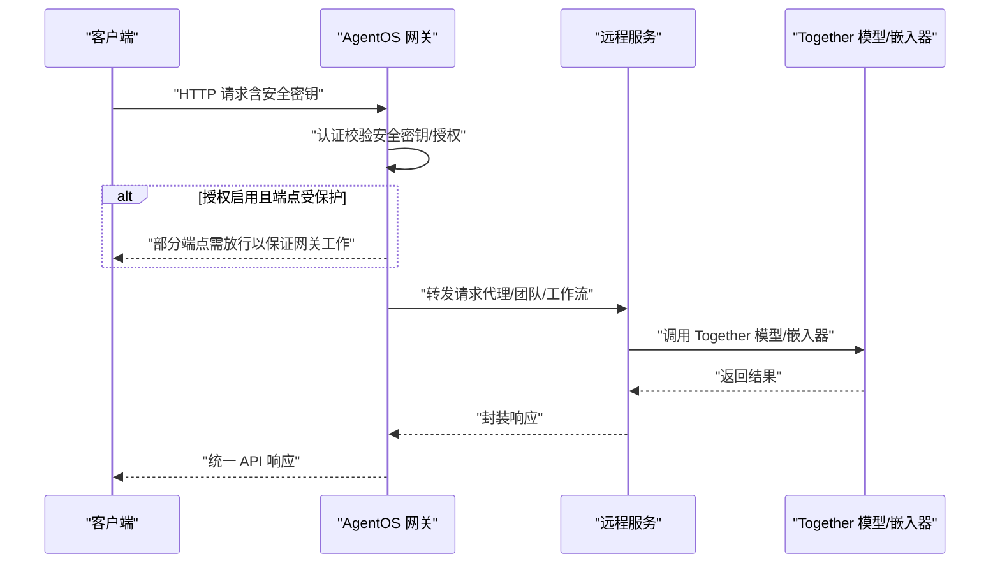
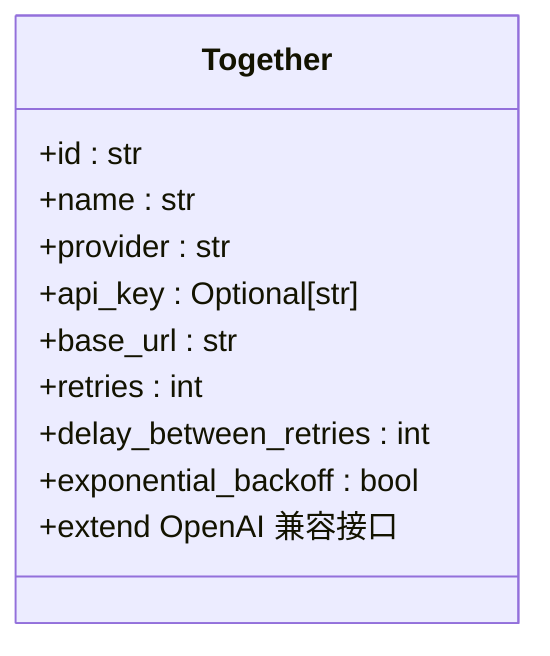
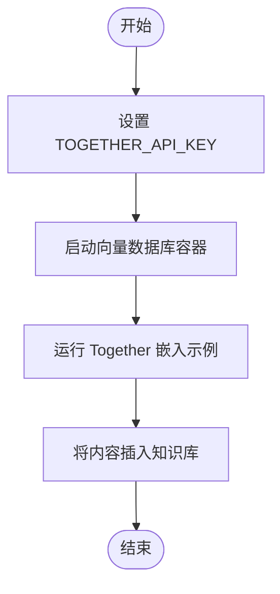
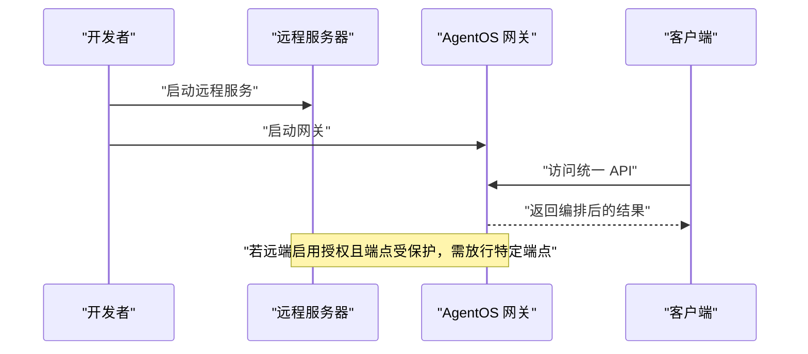
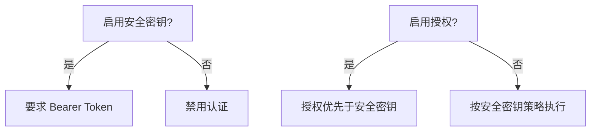
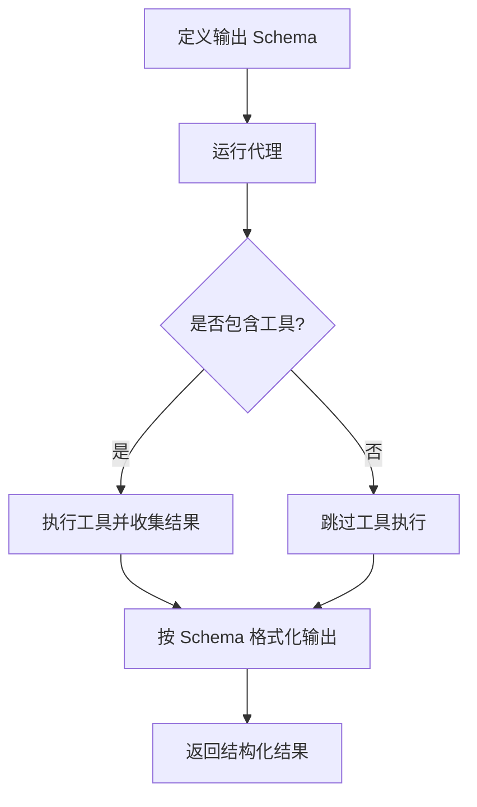
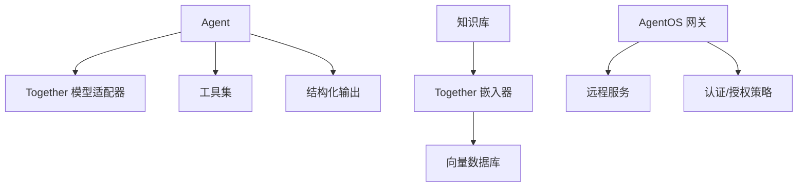

# Together 网关

<cite>
**本文引用的文件**
- [cookbook/models/open-source/together.mdx](file://cookbook/models/open-source/together.mdx)
- [reference/models/together.mdx](file://reference/models/together.mdx)
- [examples/knowledge/embedders/together-embedder.mdx](file://examples/knowledge/embedders/together-embedder.mdx)
- [knowledge/concepts/embedder/together/together-embedder.mdx](file://knowledge/concepts/embedder/together/together-embedder.mdx)
- [agent-os/usage/remote-execution/gateway.mdx](file://agent-os/usage/remote-execution/gateway.mdx)
- [examples/agent-os/remote/agent-os-gateway.mdx](file://examples/agent-os/remote/agent-os-gateway.mdx)
- [reference-api/overview.mdx](file://reference-api/overview.mdx)
- [faq/rbac-auth-failed.mdx](file://faq/rbac-auth-failed.mdx)
- [input-output/structured-output/agent.mdx](file://input-output/structured-output/agent.mdx)
- [tools/overview.mdx](file://tools/overview.mdx)
- [cookbook/models/overview.mdx](file://cookbook/models/overview.mdx)
- [other/contribute.mdx](file://other/contribute.mdx)
- [CONTRIBUTING.md](file://CONTRIBUTING.md)
</cite>

## 目录
1. [简介](#简介)
2. [项目结构](#项目结构)
3. [核心组件](#核心组件)
4. [架构总览](#架构总览)
5. [详细组件分析](#详细组件分析)
6. [依赖关系分析](#依赖关系分析)
7. [性能考量](#性能考量)
8. [故障排查指南](#故障排查指南)
9. [结论](#结论)
10. [附录](#附录)

## 简介
本文件面向使用 Together 网关的用户，系统性介绍如何在开源 AI 模型聚合平台 Together 上进行认证配置、API 密钥设置，并提供多种使用场景（基础代理、图像代理、推理代理等）的实践指南。文档同时覆盖重试机制、结构化输出与工具使用等关键能力，并结合开源模型选择、社区贡献与透明度优势，帮助读者高效构建可扩展、可维护的智能体应用。

## 项目结构
围绕 Together 网关，相关知识主要分布在以下区域：
- 模型与示例：cookbook/models/open-source/together.mdx 展示如何通过 Together 模型驱动代理；reference/models/together.mdx 提供参数参考。
- 嵌入与知识库：examples/knowledge/embedders/together-embedder.mdx 与 knowledge/concepts/embedder/together/together-embedder.mdx 展示如何使用 Together 嵌入器构建知识库。
- 网关与远程执行：agent-os/usage/remote-execution/gateway.mdx 与 examples/agent-os/remote/agent-os-gateway.mdx 提供网关搭建与访问方式。
- 认证与安全：reference-api/overview.mdx 与 faq/rbac-auth-failed.mdx 提供安全密钥与授权冲突的处理建议。
- 结构化输出与工具：input-output/structured-output/agent.mdx 与 tools/overview.mdx 提供结构化输出与工具调用的最佳实践。
- 开源模型与社区：cookbook/models/overview.mdx 与 other/contribute.mdx、CONTRIBUTING.md 提供开源模型生态与贡献路径。

```mermaid
graph TB
subgraph "模型与示例"
T1["cookbook/models/open-source/together.mdx"]
T2["reference/models/together.mdx"]
end
subgraph "嵌入与知识库"
E1["examples/knowledge/embedders/together-embedder.mdx"]
E2["knowledge/concepts/embedder/together/together-embedder.mdx"]
end
subgraph "网关与远程执行"
G1["agent-os/usage/remote-execution/gateway.mdx"]
G2["examples/agent-os/remote/agent-os-gateway.mdx"]
end
subgraph "认证与安全"
A1["reference-api/overview.mdx"]
A2["faq/rbac-auth-failed.mdx"]
end
subgraph "结构化输出与工具"
S1["input-output/structured-output/agent.mdx"]
U1["tools/overview.mdx"]
end
subgraph "开源模型与社区"
M1["cookbook/models/overview.mdx"]
C1["other/contribute.mdx"]
C2["CONTRIBUTING.md"]
end
T1 --> T2
E1 --> E2
G1 --> G2
A1 --> A2
S1 --> U1
M1 --> C1
C1 --> C2
```

**图表来源**
- [cookbook/models/open-source/together.mdx:1-67](file://cookbook/models/open-source/together.mdx#L1-L67)
- [reference/models/together.mdx:1-21](file://reference/models/together.mdx#L1-L21)
- [examples/knowledge/embedders/together-embedder.mdx:1-64](file://examples/knowledge/embedders/together-embedder.mdx#L1-L64)
- [knowledge/concepts/embedder/together/together-embedder.mdx:1-73](file://knowledge/concepts/embedder/together/together-embedder.mdx#L1-L73)
- [agent-os/usage/remote-execution/gateway.mdx:1-146](file://agent-os/usage/remote-execution/gateway.mdx#L1-L146)
- [examples/agent-os/remote/agent-os-gateway.mdx:1-198](file://examples/agent-os/remote/agent-os-gateway.mdx#L1-L198)
- [reference-api/overview.mdx:1-25](file://reference-api/overview.mdx#L1-L25)
- [faq/rbac-auth-failed.mdx:1-31](file://faq/rbac-auth-failed.mdx#L1-L31)
- [input-output/structured-output/agent.mdx:1-201](file://input-output/structured-output/agent.mdx#L1-L201)
- [tools/overview.mdx:1-566](file://tools/overview.mdx#L1-L566)
- [cookbook/models/overview.mdx:1-107](file://cookbook/models/overview.mdx#L1-L107)
- [other/contribute.mdx:1-45](file://other/contribute.mdx#L1-L45)
- [CONTRIBUTING.md:1-135](file://CONTRIBUTING.md#L1-L135)

**章节来源**
- [cookbook/models/open-source/together.mdx:1-67](file://cookbook/models/open-source/together.mdx#L1-L67)
- [reference/models/together.mdx:1-21](file://reference/models/together.mdx#L1-L21)
- [examples/knowledge/embedders/together-embedder.mdx:1-64](file://examples/knowledge/embedders/together-embedder.mdx#L1-L64)
- [knowledge/concepts/embedder/together/together-embedder.mdx:1-73](file://knowledge/concepts/embedder/together/together-embedder.mdx#L1-L73)
- [agent-os/usage/remote-execution/gateway.mdx:1-146](file://agent-os/usage/remote-execution/gateway.mdx#L1-L146)
- [examples/agent-os/remote/agent-os-gateway.mdx:1-198](file://examples/agent-os/remote/agent-os-gateway.mdx#L1-L198)
- [reference-api/overview.mdx:1-25](file://reference-api/overview.mdx#L1-L25)
- [faq/rbac-auth-failed.mdx:1-31](file://faq/rbac-auth-failed.mdx#L1-L31)
- [input-output/structured-output/agent.mdx:1-201](file://input-output/structured-output/agent.mdx#L1-L201)
- [tools/overview.mdx:1-566](file://tools/overview.mdx#L1-L566)
- [cookbook/models/overview.mdx:1-107](file://cookbook/models/overview.mdx#L1-L107)
- [other/contribute.mdx:1-45](file://other/contribute.mdx#L1-L45)
- [CONTRIBUTING.md:1-135](file://CONTRIBUTING.md#L1-L135)

## 核心组件
- Together 模型适配器：提供与 OpenAI 兼容接口的参数配置，支持重试策略与指数退避等高级选项。
- Together 嵌入器：用于将文本转换为向量，支撑知识库检索与 RAG 场景。
- AgentOS 网关：统一汇聚本地与远程资源，对外暴露一致的 API，便于多来源代理与团队编排。
- 认证与安全：支持安全密钥认证与授权策略，解决版本差异导致的冲突问题。
- 结构化输出与工具：通过 Pydantic Schema 约束输出，结合工具实现复杂推理与外部系统交互。

**章节来源**
- [reference/models/together.mdx:8-21](file://reference/models/together.mdx#L8-L21)
- [examples/knowledge/embedders/together-embedder.mdx:15-46](file://examples/knowledge/embedders/together-embedder.mdx#L15-L46)
- [agent-os/usage/remote-execution/gateway.mdx:60-82](file://agent-os/usage/remote-execution/gateway.mdx#L60-L82)
- [reference-api/overview.mdx:9-22](file://reference-api/overview.mdx#L9-L22)
- [faq/rbac-auth-failed.mdx:16-31](file://faq/rbac-auth-failed.mdx#L16-L31)
- [input-output/structured-output/agent.mdx:35-44](file://input-output/structured-output/agent.mdx#L35-L44)
- [tools/overview.mdx:50-58](file://tools/overview.mdx#L50-L58)

## 架构总览
下图展示从客户端到网关再到远程服务的整体流程，以及认证与安全控制点：

**图表来源**
- [agent-os/usage/remote-execution/gateway.mdx:105-145](file://agent-os/usage/remote-execution/gateway.mdx#L105-L145)
- [reference-api/overview.mdx:9-22](file://reference-api/overview.mdx#L9-L22)
- [faq/rbac-auth-failed.mdx:16-31](file://faq/rbac-auth-failed.mdx#L16-L31)

## 详细组件分析

### 组件一：Together 模型适配器
- 功能要点
  - 提供与 OpenAI 兼容接口，支持常用参数透传。
  - 支持重试次数、重试间隔与指数退避策略，提升稳定性。
  - 默认 API 基础地址与环境变量 TOGETHER_API_KEY 集成。
- 参数参考
  - 关键参数包括 id、name、provider、api_key、base_url、retries、delay_between_retries、exponential_backoff 等。
- 使用示例
  - 基础代理、工具使用、结构化输出等示例可参考模型示例页面。

**图表来源**
- [reference/models/together.mdx:8-21](file://reference/models/together.mdx#L8-L21)

**章节来源**
- [reference/models/together.mdx:8-21](file://reference/models/together.mdx#L8-L21)
- [cookbook/models/open-source/together.mdx:8-67](file://cookbook/models/open-source/together.mdx#L8-L67)

### 组件二：Together 嵌入器与知识库
- 功能要点
  - 将文本转换为向量，支持与向量数据库（如 PgVector）集成。
  - 提供最小可运行示例与 Docker 快速启动指南。
- 使用步骤
  - 设置 TOGETHER_API_KEY。
  - 启动向量数据库容器。
  - 运行示例脚本完成嵌入与知识插入。

**图表来源**
- [knowledge/concepts/embedder/together/together-embedder.mdx:36-73](file://knowledge/concepts/embedder/together/together-embedder.mdx#L36-L73)
- [examples/knowledge/embedders/together-embedder.mdx:19-64](file://examples/knowledge/embedders/together-embedder.mdx#L19-L64)

**章节来源**
- [examples/knowledge/embedders/together-embedder.mdx:15-64](file://examples/knowledge/embedders/together-embedder.mdx#L15-L64)
- [knowledge/concepts/embedder/together/together-embedder.mdx:1-73](file://knowledge/concepts/embedder/together/together-embedder.mdx#L1-L73)

### 组件三：AgentOS 网关
- 功能要点
  - 聚合本地与远程代理、团队与工作流，统一对外提供 API。
  - 支持远程代理/团队/工作流的组合编排。
- 访问方式
  - 启动后可通过指定端口访问统一 API。
  - 若远端启用了授权并保护了关键端点，需放行部分端点以确保网关正常工作。

**图表来源**
- [agent-os/usage/remote-execution/gateway.mdx:105-145](file://agent-os/usage/remote-execution/gateway.mdx#L105-L145)
- [examples/agent-os/remote/agent-os-gateway.mdx:105-198](file://examples/agent-os/remote/agent-os-gateway.mdx#L105-L198)

**章节来源**
- [agent-os/usage/remote-execution/gateway.mdx:1-146](file://agent-os/usage/remote-execution/gateway.mdx#L1-L146)
- [examples/agent-os/remote/agent-os-gateway.mdx:1-198](file://examples/agent-os/remote/agent-os-gateway.mdx#L1-L198)

### 组件四：认证与安全
- 安全密钥认证
  - 当 OS_SECURITY_KEY 设置时，所有路由需要携带 Bearer Token。
  - 未设置时，实例禁用认证。
- 授权冲突处理
  - 新版本中授权优先于安全密钥，需根据版本选择关闭授权或调整策略。

**图表来源**
- [reference-api/overview.mdx:9-22](file://reference-api/overview.mdx#L9-L22)
- [faq/rbac-auth-failed.mdx:16-31](file://faq/rbac-auth-failed.mdx#L16-L31)

**章节来源**
- [reference-api/overview.mdx:9-22](file://reference-api/overview.mdx#L9-L22)
- [faq/rbac-auth-failed.mdx:16-31](file://faq/rbac-auth-failed.mdx#L16-L31)

### 组件五：结构化输出与工具
- 结构化输出
  - 通过 Pydantic Schema 约束输出，支持在运行时动态覆盖。
  - 可与工具协同，先调用工具再格式化最终响应。
- 工具使用
  - 支持并发工具调用、工具包、媒体参数与可调用工厂模式等高级特性。

**图表来源**
- [input-output/structured-output/agent.mdx:35-44](file://input-output/structured-output/agent.mdx#L35-L44)
- [tools/overview.mdx:50-58](file://tools/overview.mdx#L50-L58)

**章节来源**
- [input-output/structured-output/agent.mdx:1-201](file://input-output/structured-output/agent.mdx#L1-L201)
- [tools/overview.mdx:1-566](file://tools/overview.mdx#L1-L566)

## 依赖关系分析
- 模型层依赖：Agent 通过 Together 模型适配器与 OpenAI 兼容接口交互。
- 知识层依赖：嵌入器依赖 Together API，向量数据库负责持久化与检索。
- 网关层依赖：网关依赖远程服务提供的代理/团队/工作流资源。
- 安全层依赖：认证与授权策略影响网关对远端资源的访问能力。

**图表来源**
- [reference/models/together.mdx:8-21](file://reference/models/together.mdx#L8-L21)
- [examples/knowledge/embedders/together-embedder.mdx:15-46](file://examples/knowledge/embedders/together-embedder.mdx#L15-L46)
- [agent-os/usage/remote-execution/gateway.mdx:60-82](file://agent-os/usage/remote-execution/gateway.mdx#L60-L82)
- [reference-api/overview.mdx:9-22](file://reference-api/overview.mdx#L9-L22)

**章节来源**
- [cookbook/models/overview.mdx:44-73](file://cookbook/models/overview.mdx#L44-L73)

## 性能考量
- 重试与退避：合理配置重试次数与延迟，避免瞬时错误放大。
- 并发工具：在支持并行函数调用的模型上，利用并发执行减少整体耗时。
- 网关端点放行：在远端启用授权时，仅放行必要端点，平衡安全性与可用性。

[本节为通用指导，不直接分析具体文件]

## 故障排查指南
- 认证失败（授权与安全密钥冲突）
  - 新版本中授权优先于安全密钥，需根据版本选择关闭授权或调整策略。
- 网关无法访问远端资源
  - 若远端启用了授权并保护了关键端点，需放行特定端点以保证网关正常工作。
- API 密钥与环境变量
  - 确保 TOGETHER_API_KEY 正确设置，避免因密钥缺失导致调用失败。

**章节来源**
- [faq/rbac-auth-failed.mdx:16-31](file://faq/rbac-auth-failed.mdx#L16-L31)
- [agent-os/usage/remote-execution/gateway.mdx:143-145](file://agent-os/usage/remote-execution/gateway.mdx#L143-L145)
- [knowledge/concepts/embedder/together/together-embedder.mdx:36-40](file://knowledge/concepts/embedder/together/together-embedder.mdx#L36-L40)

## 结论
Together 网关通过统一的 API 抽象，将本地与远程资源整合，配合认证与安全策略、结构化输出与工具体系，为构建可扩展的智能体应用提供了坚实基础。依托开源模型生态与社区贡献，Together 在开放性、透明度与可参与性方面具备显著优势，适合在多样化场景中快速落地与迭代。

[本节为总结性内容，不直接分析具体文件]

## 附录

### 使用示例与配置清单
- 基础代理（Togethers）
  - 参考路径：[cookbook/models/open-source/together.mdx:8-18](file://cookbook/models/open-source/together.mdx#L8-L18)
- 工具使用（Togethers）
  - 参考路径：[cookbook/models/open-source/together.mdx:22-34](file://cookbook/models/open-source/together.mdx#L22-L34)
- 结构化输出（Togethers）
  - 参考路径：[cookbook/models/open-source/together.mdx:38-53](file://cookbook/models/open-source/together.mdx#L38-L53)
- 嵌入与知识库
  - 参考路径：[examples/knowledge/embedders/together-embedder.mdx:15-46](file://examples/knowledge/embedders/together-embedder.mdx#L15-L46)
- 网关搭建与访问
  - 参考路径：[agent-os/usage/remote-execution/gateway.mdx:105-145](file://agent-os/usage/remote-execution/gateway.mdx#L105-L145)
- 认证与安全
  - 参考路径：[reference-api/overview.mdx:9-22](file://reference-api/overview.mdx#L9-L22)
  - 冲突处理：[faq/rbac-auth-failed.mdx:16-31](file://faq/rbac-auth-failed.mdx#L16-L31)

### 开源模型与社区贡献
- 开源模型生态概览
  - 参考路径：[cookbook/models/overview.mdx:33-35](file://cookbook/models/overview.mdx#L33-L35)
- 社区贡献流程
  - 参考路径：[other/contribute.mdx:8-16](file://other/contribute.mdx#L8-L16)
  - 文档贡献规范：[CONTRIBUTING.md:16-26](file://CONTRIBUTING.md#L16-L26)