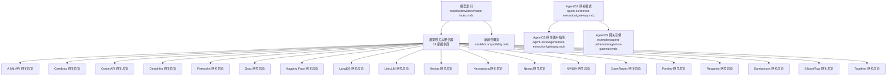
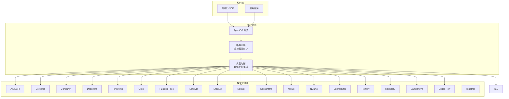
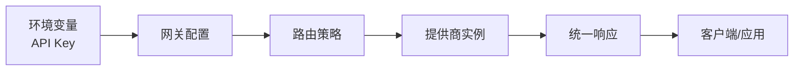

# 模型网关与聚合器

<cite>
**本文引用的文件**
- [模型索引](file://models/providers/model-index.mdx)
- [兼容性概览](file://models/compatibility.mdx)
- [AgentOS 网关模式](file://agent-os/remote-execution/gateway.mdx)
- [AgentOS 网关使用指南](file://agent-os/usage/remote-execution/gateway.mdx)
- [AgentOS 网关示例](file://examples/agent-os/remote/agent-os-gateway.mdx)
- [AI/ML API 网关总览](file://models/providers/gateways/aimlapi/overview.mdx)
- [Cerebras 网关总览](file://models/providers/gateways/cerebras/overview.mdx)
- [CometAPI 网关总览](file://models/providers/gateways/cometapi/overview.mdx)
- [DeepInfra 网关总览](file://models/providers/gateways/deepinfra/overview.mdx)
- [Fireworks 网关总览](file://models/providers/gateways/fireworks/overview.mdx)
- [Groq 网关总览](file://models/providers/gateways/groq/overview.mdx)
- [Hugging Face 网关总览](file://models/providers/gateways/huggingface/overview.mdx)
- [LangDB 网关总览](file://models/providers/gateways/langdb/overview.mdx)
- [LiteLLM 网关总览](file://models/providers/gateways/litellm/overview.mdx)
- [Nebius 网关总览](file://models/providers/gateways/nebius/overview.mdx)
- [Neosantara 网关总览](file://models/providers/gateways/neosantara/overview.mdx)
- [Nexus 网关总览](file://models/providers/gateways/nexus/overview.mdx)
- [NVIDIA 网关总览](file://models/providers/gateways/nvidia/overview.mdx)
- [OpenRouter 网关总览](file://models/providers/gateways/openrouter/overview.mdx)
- [Portkey 网关总览](file://models/providers/gateways/portkey/overview.mdx)
- [Requesty 网关总览](file://models/providers/gateways/requesty/overview.mdx)
- [Sambanova 网关总览](file://models/providers/gateways/sambanova/overview.mdx)
- [SiliconFlow 网关总览](file://models/providers/gateways/siliconflow/overview.mdx)
- [Together 网关总览](file://models/providers/gateways/together/overview.mdx)
</cite>

## 目录
1. [简介](#简介)
2. [项目结构](#项目结构)
3. [核心组件](#核心组件)
4. [架构总览](#架构总览)
5. [详细组件分析](#详细组件分析)
6. [依赖关系分析](#依赖关系分析)
7. [性能考量](#性能考量)
8. [故障排查指南](#故障排查指南)
9. [结论](#结论)
10. [附录](#附录)

## 简介
本文件面向“模型网关与聚合器”的综合技术文档，系统介绍 19 个模型网关与聚合器提供商（AIML API、Cerebras、CometAPI、DeepInfra、Fireworks、Groq、Hugging Face、LangDB、LiteLLM、Nebius、Neosantara、Nexus、NVIDIA、OpenRouter、Portkey、Requesty、Sambanova、SiliconFlow、Together），以及它们在统一接口、负载均衡、故障转移、成本优化、A/B 测试等方面的实践价值。同时结合 AgentOS 的“网关模式”，说明如何通过单一入口聚合本地与远程的代理、团队与工作流，实现多模型管理、路由策略与成本控制。

## 项目结构
- 模型提供商索引集中于“模型索引”页面，按“原生模型提供商”“本地模型提供商”“云模型提供商”“模型网关与聚合器”四类组织，其中“模型网关与聚合器”包含 19 个子页签，覆盖 AIML API、Cerebras、CometAPI、DeepInfra、Fireworks、Groq、Hugging Face、LangDB、LiteLLM、Nebius、Neosantara、Nexus、NVIDIA、OpenRouter、Portkey、Requesty、Sambanova、SiliconFlow、Together。
- 兼容性概览页面列出各提供商对“流式响应、工具调用、结构化输出、异步执行”等核心能力的支持情况，并标注部分提供商的特性限制或差异。
- AgentOS 网关模式与使用指南提供了统一 API 网关的搭建方式、本地与远程混合部署、认证注意事项等，是实现多模型与多实例聚合的关键参考。

**图表来源**
- [模型索引:201-372](file://models/providers/model-index.mdx#L201-L372)
- [兼容性概览:1-92](file://models/compatibility.mdx#L1-L92)
- [AgentOS 网关模式:1-174](file://agent-os/remote-execution/gateway.mdx#L1-L174)
- [AgentOS 网关使用指南:1-146](file://agent-os/usage/remote-execution/gateway.mdx#L1-L146)
- [AgentOS 网关示例:1-199](file://examples/agent-os/remote/agent-os-gateway.mdx#L1-L199)

**章节来源**
- [模型索引:1-375](file://models/providers/model-index.mdx#L1-L375)
- [兼容性概览:1-92](file://models/compatibility.mdx#L1-L92)

## 核心组件
- 统一接口层：各网关均以 OpenAI 兼容接口或自有 SDK 包装，对外暴露一致的调用参数与响应格式，便于在应用侧无感切换不同提供商。
- 负载均衡与故障转移：通过在网关层聚合多个提供商或实例，结合健康检查与重试策略，实现请求分发与失败切换。
- 成本优化：在网关层设置“成本优先”策略，基于实时价格与历史用量动态选择最优提供商；或按模型类别分流至不同供应商以获得更优单价。
- A/B 测试：在网关层对同一任务的不同模型或不同提供商进行分流，记录延迟、成本、质量指标，支持灰度发布与效果评估。
- 多模型管理：在网关层维护模型清单、版本映射与别名，统一命名空间与路由规则，简化上层调用与迁移。

**章节来源**
- [兼容性概览:10-37](file://models/compatibility.mdx#L10-L37)
- [AgentOS 网关模式:9-14](file://agent-os/remote-execution/gateway.mdx#L9-L14)

## 架构总览
下图展示了“模型网关与聚合器”的典型架构：客户端通过统一网关发起请求，网关根据路由策略选择合适的提供商或模型实例，再由提供商返回结果。AgentOS 网关可进一步聚合本地与远程的代理、团队与工作流，形成统一 API 出口。

**图表来源**
- [模型索引:201-372](file://models/providers/model-index.mdx#L201-L372)
- [AgentOS 网关模式:16-45](file://agent-os/remote-execution/gateway.mdx#L16-L45)

## 详细组件分析

### AIML API 网关
- 作用：提供统一访问 300+ 模型的能力，覆盖 OpenAI、Anthropic、Meta、Google、DeepSeek 等多家模型生态，具备高可用与高限额。
- 配置要点：设置环境变量后，直接以 OpenAI 兼容接口调用；默认基础地址与模型 ID 可在参数中覆盖。
- 使用建议：适合需要“多模型即插即用”的场景；若需特定模型族（如 DeepSeek Reasoner）可直接指定模型 ID。

**章节来源**
- [AI/ML API 网关总览:1-69](file://models/providers/gateways/aimlapi/overview.mdx#L1-L69)

### Cerebras 网关
- 作用：接入 Cerebras 高速推理能力，支持 Llama 系列模型，具备低延迟与高吞吐特性。
- 配置要点：安装 Cerebras SDK 并设置 API Key；支持结构化输出（JSON Schema）、温度、TopP、TopK 等参数。
- 使用建议：适用于对延迟敏感的推理任务；注意部分模型的并行工具调用限制。

**章节来源**
- [Cerebras 网关总览:1-115](file://models/providers/gateways/cerebras/overview.mdx#L1-L115)

### CometAPI 网关
- 作用：提供大量 LLM 接口端点，支持 OpenAI 兼容接口。
- 配置要点：设置 COMETAPI_KEY 后即可使用；可通过编程方式查询可用模型列表。
- 使用建议：适合作为“快速接入”的聚合层，便于在多模型间切换。

**章节来源**
- [CometAPI 网关总览:1-74](file://models/providers/gateways/cometapi/overview.mdx#L1-L74)

### DeepInfra 网关
- 作用：提供多种推理模型，适合命令式与对话式任务。
- 配置要点：设置 DEEPINFRA_API_KEY；注意其速率限制。
- 使用建议：针对推理成本敏感的任务，可结合路由策略选择性价比更高的模型。

**章节来源**
- [DeepInfra 网关总览:1-70](file://models/providers/gateways/deepinfra/overview.mdx#L1-L70)

### Fireworks 网关
- 作用：提供 OpenAI 兼容接口与自动提示缓存能力，降低重复输入的延迟与成本。
- 配置要点：设置 FIREWORKS_API_KEY；模型 ID 常见前缀包含 accounts/fireworks。
- 使用建议：适合高频重复提示的场景；可配合缓存策略优化成本。

**章节来源**
- [Fireworks 网关总览:1-64](file://models/providers/gateways/fireworks/overview.mdx#L1-L64)

### Groq 网关
- 作用：以“快速推理”为核心卖点，适合低延迟与高吞吐场景。
- 配置要点：设置相应 API Key；提供多种使用示例（工具调用、结构化输出、知识检索等）。
- 使用建议：将长文本生成与短时问答分流至不同提供商，平衡延迟与质量。

**章节来源**
- [Groq 网关总览:1-120](file://models/providers/gateways/groq/overview.mdx#L1-L120)

### Hugging Face 网关
- 作用：提供大量开源模型与推理端点，支持 OpenAI 兼容接口。
- 配置要点：设置 HF_TOKEN；注意部分提供商对流式工具调用的支持差异。
- 使用建议：适合开源生态与私有化部署需求；可结合本地/边缘推理降低成本。

**章节来源**
- [Hugging Face 网关总览:1-120](file://models/providers/gateways/huggingface/overview.mdx#L1-L120)

### LangDB 网关
- 作用：提供数据库与向量检索能力，适合知识增强与 RAG 场景。
- 配置要点：设置相应密钥；提供结构化输出与工具调用示例。
- 使用建议：在需要“带上下文检索”的对话或问答中优先考虑。

**章节来源**
- [LangDB 网关总览:1-120](file://models/providers/gateways/langdb/overview.mdx#L1-L120)

### LiteLLM 网关
- 作用：统一多提供商接口，支持路由、缓存、成本追踪与 A/B 测试。
- 配置要点：支持 OpenAI 兼容与非兼容模型；提供丰富的使用示例。
- 使用建议：作为“智能路由中枢”，在多提供商之间做动态调度与成本优化。

**章节来源**
- [LiteLLM 网关总览:1-120](file://models/providers/gateways/litellm/overview.mdx#L1-L120)

### Nebius 网关
- 作用：Token Factory 模型与推理服务，适合高性能与高并发场景。
- 配置要点：设置相应密钥；提供结构化输出与工具调用示例。
- 使用建议：在需要高吞吐与稳定 SLA 的任务中优先考虑。

**章节来源**
- [Nebius 网关总览:1-120](file://models/providers/gateways/nebius/overview.mdx#L1-L120)

### Neosantara 网关
- 作用：提供多模型与工具调用能力，支持异步与流式输出。
- 配置要点：设置相应密钥；提供多种使用示例。
- 使用建议：适合多模态与复杂工具链任务。

**章节来源**
- [Neosantara 网关总览:1-120](file://models/providers/gateways/neosantara/overview.mdx#L1-L120)

### Nexus 网关
- 作用：提供多模型与工具调用能力，支持异步与流式输出。
- 配置要点：设置相应密钥；提供多种使用示例。
- 使用建议：适合需要灵活路由与多模型组合的场景。

**章节来源**
- [Nexus 网关总览:1-120](file://models/providers/gateways/nexus/overview.mdx#L1-L120)

### NVIDIA 网关
- 作用：提供多模型与工具调用能力，支持异步与流式输出。
- 配置要点：设置相应密钥；提供多种使用示例。
- 使用建议：适合需要高性能与高并发的推理任务。

**章节来源**
- [NVIDIA 网关总览:1-120](file://models/providers/gateways/nvidia/overview.mdx#L1-L120)

### OpenRouter 网关
- 作用：聚合多家模型提供商，支持路由与 A/B 测试。
- 配置要点：提供总览页面；具体参数与示例可在其使用页面查看。
- 使用建议：作为“聚合中枢”，在多模型间做动态选择与成本优化。

**章节来源**
- [OpenRouter 网关总览:1-120](file://models/providers/gateways/openrouter/overview.mdx#L1-L120)

### Portkey 网关
- 作用：提供模型网关集成，支持路由、缓存与可观测性。
- 配置要点：设置相应密钥；提供工具调用与结构化输出示例。
- 使用建议：适合需要统一监控与成本追踪的生产环境。

**章节来源**
- [Portkey 网关总览:1-120](file://models/providers/gateways/portkey/overview.mdx#L1-L120)

### Requesty 网关
- 作用：提供模型提供商集成，支持 OpenAI 兼容接口。
- 配置要点：设置相应密钥；提供多种使用示例。
- 使用建议：适合需要快速接入与多模型切换的场景。

**章节来源**
- [Requesty 网关总览:1-120](file://models/providers/gateways/requesty/overview.mdx#L1-L120)

### Sambanova 网关
- 作用：提供多模型与工具调用能力，支持异步与流式输出。
- 配置要点：设置相应密钥；提供多种使用示例。
- 使用建议：适合需要高性能与高并发的推理任务。

**章节来源**
- [Sambanova 网关总览:1-120](file://models/providers/gateways/sambanova/overview.mdx#L1-L120)

### SiliconFlow 网关
- 作用：提供模型提供商集成，支持 OpenAI 兼容接口。
- 配置要点：设置相应密钥；提供多种使用示例。
- 使用建议：适合需要快速接入与多模型切换的场景。

**章节来源**
- [SiliconFlow 网关总览:1-120](file://models/providers/gateways/siliconflow/overview.mdx#L1-L120)

### Together 网关
- 作用：提供多模型与工具调用能力，支持异步与流式输出。
- 配置要点：设置相应密钥；提供多种使用示例。
- 使用建议：适合需要灵活路由与多模型组合的场景。

**章节来源**
- [Together 网关总览:1-120](file://models/providers/gateways/together/overview.mdx#L1-L120)

## 依赖关系分析
- 统一接口依赖：多数网关以 OpenAI 兼容接口或 SDK 包装，降低上层耦合度。
- 认证与密钥：各网关均通过环境变量注入 API Key，避免硬编码。
- 路由与策略：在网关层实现“成本优先”“延迟优先”“SLA 优先”等策略，结合模型清单与价格表动态选择。
- 远程聚合：AgentOS 网关可聚合本地与远程代理、团队与工作流，形成统一 API 出口，便于跨实例协作。

**图表来源**
- [AgentOS 网关模式:16-45](file://agent-os/remote-execution/gateway.mdx#L16-L45)
- [兼容性概览:10-37](file://models/compatibility.mdx#L10-L37)

**章节来源**
- [AgentOS 网关模式:16-45](file://agent-os/remote-execution/gateway.mdx#L16-L45)
- [AgentOS 网关使用指南:105-117](file://agent-os/usage/remote-execution/gateway.mdx#L105-L117)

## 性能考量
- 延迟优化：优先选择低延迟提供商（如 Groq、Cerebras），并将短时问答与长文本生成分流。
- 吞吐扩展：通过负载均衡与多实例部署提升并发能力；对重复提示启用缓存（如 Fireworks 提示缓存）。
- 成本控制：建立“模型-价格-性能”矩阵，按任务类型选择最优模型；对批量任务采用异步执行与批处理。
- 可靠性：在网关层实现健康检查与自动故障转移，确保关键任务的可用性与稳定性。

[本节为通用指导，无需引用具体文件]

## 故障排查指南
- 认证问题：确认环境变量已正确设置且未被覆盖；AgentOS 网关在远程服务器端需开放 /config、/agents、/teams、/workflows 等端点以便网关发现与调用。
- 路由异常：检查路由策略是否正确匹配模型与提供商；核对模型清单与别名映射。
- 性能瓶颈：观察延迟与错误率分布，必要时调整负载均衡权重或引入缓存层。
- 日志与追踪：在网关层开启统一日志与指标采集，定位慢请求与失败路径。

**章节来源**
- [AgentOS 网关模式:161-174](file://agent-os/remote-execution/gateway.mdx#L161-L174)
- [AgentOS 网关使用指南:143-146](file://agent-os/usage/remote-execution/gateway.mdx#L143-L146)

## 结论
通过统一网关与聚合器，可以在不改变上层调用方式的前提下，灵活地在 19 家提供商之间进行切换与编排。结合 AgentOS 的网关模式，可以实现本地与远程资源的一体化管理，达成“统一接口、负载均衡、故障转移、成本优化、A/B 测试”的目标。建议在生产环境中建立完善的路由策略、成本监控与可观测体系，持续优化模型选择与资源配置。

[本节为总结性内容，无需引用具体文件]

## 附录
- 快速开始步骤（以某网关为例）
  1) 设置环境变量（如 API_KEY）。
  2) 在 Agent 中指定对应网关模型（如 AIML API、Cerebras、DeepInfra 等）。
  3) 通过统一接口发起请求，观察延迟与成本指标。
  4) 在网关层配置路由策略与缓存策略，逐步上线到生产。
- 多提供商混合使用建议
  - 将“短时问答”分流至低延迟提供商，“长文本生成”分流至高性价比提供商。
  - 对重复提示启用缓存，减少重复计算与费用。
  - 在网关层实现 A/B 测试，对比不同模型在质量与成本上的表现。

[本节为通用指导，无需引用具体文件]