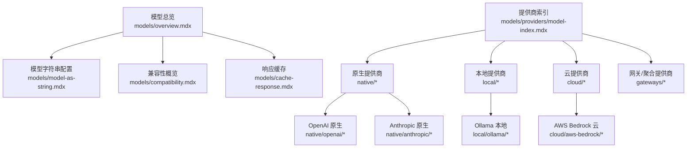
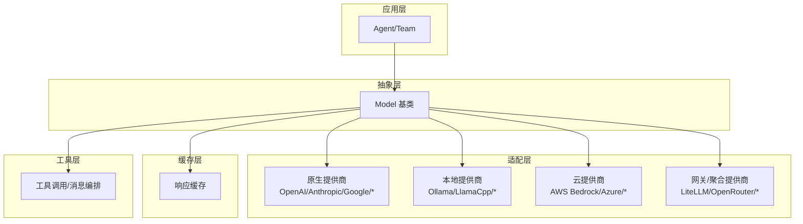
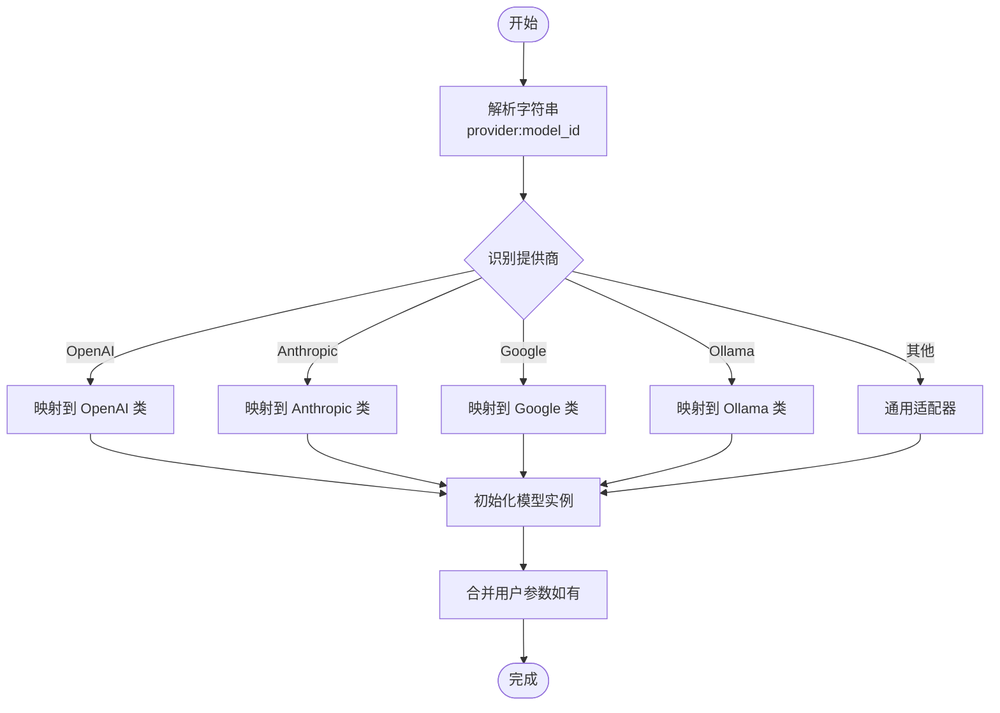
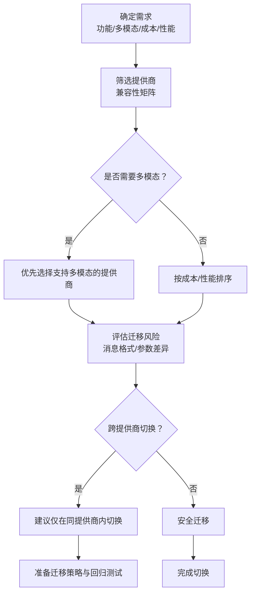
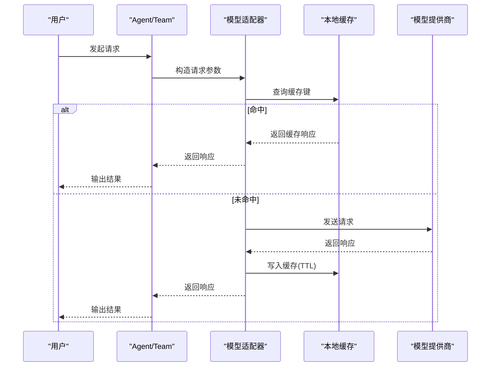
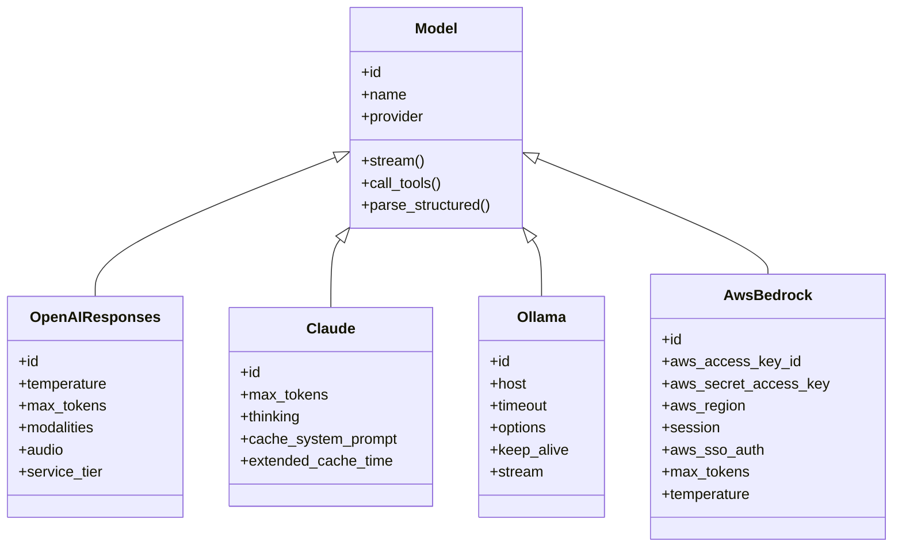
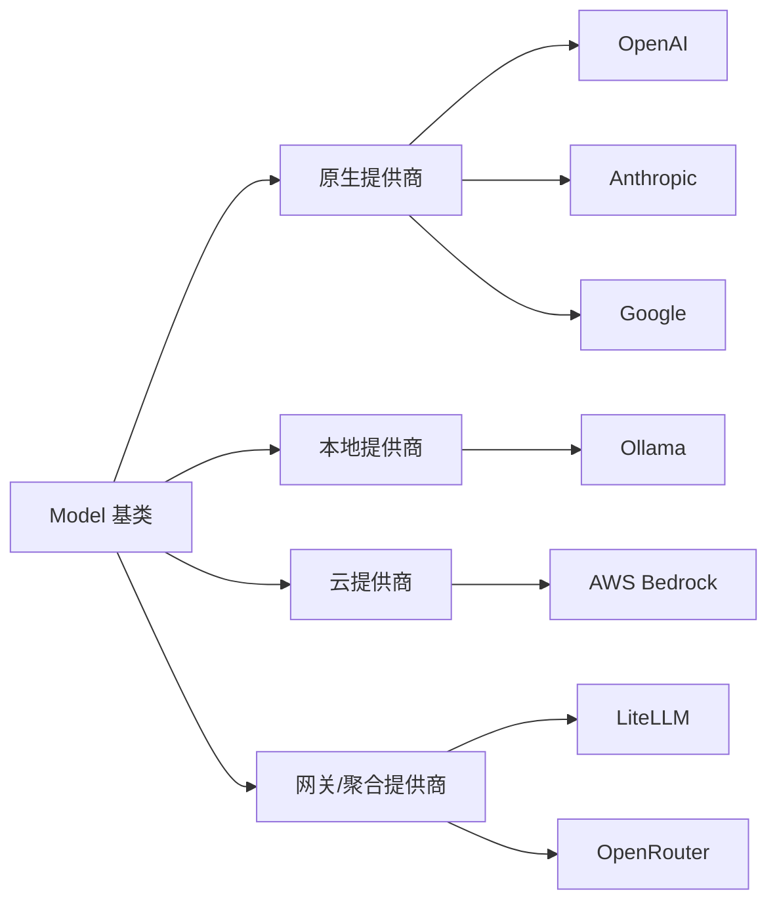

# 模型系统

<cite>
**本文引用的文件**   
- [models/overview.mdx](file://models/overview.mdx)
- [models/model-as-string.mdx](file://models/model-as-string.mdx)
- [models/compatibility.mdx](file://models/compatibility.mdx)
- [models/cache-response.mdx](file://models/cache-response.mdx)
- [models/providers/model-index.mdx](file://models/providers/model-index.mdx)
- [models/providers/native/openai/completion/overview.mdx](file://models/providers/native/openai/completion/overview.mdx)
- [models/providers/native/anthropic/overview.mdx](file://models/providers/native/anthropic/overview.mdx)
- [models/providers/local/ollama/overview.mdx](file://models/providers/local/ollama/overview.mdx)
- [models/providers/cloud/aws-bedrock/overview.mdx](file://models/providers/cloud/aws-bedrock/overview.mdx)
- [faq/switching-models.mdx](file://faq/switching-models.mdx)
- [cookbook/models/overview.mdx](file://cookbook/models/overview.mdx)
</cite>

## 目录
1. [简介](#简介)
2. [项目结构](#项目结构)
3. [核心组件](#核心组件)
4. [架构总览](#架构总览)
5. [详细组件分析](#详细组件分析)
6. [依赖关系分析](#依赖关系分析)
7. [性能考量](#性能考量)
8. [故障排查指南](#故障排查指南)
9. [结论](#结论)
10. [附录](#附录)

## 简介
本技术文档面向模型系统，系统性阐述以下主题：
- 模型提供商抽象：统一接口设计与兼容性管理
- 支持的模型提供商概览：原生提供商（如 Anthropic、OpenAI、Google 等）、本地提供商（Ollama、LlamaCpp 等）、云提供商（AWS Bedrock、Azure 等）
- 模型字符串配置方法：模型标识符格式与参数传递
- 兼容性指南：跨提供商差异与迁移策略
- 响应缓存机制：缓存策略、过期时间与性能优化
- 模型选择最佳实践：成本与性能对比
- 实际配置示例与代码片段路径：覆盖不同场景下的使用方式

## 项目结构
模型系统文档由“总览”“字符串配置”“兼容性”“响应缓存”“提供商索引”以及各提供商“原生/本地/云/网关”等子页构成，形成从高层到落地实现的完整知识图谱。

图表来源
- [models/overview.mdx:1-62](file://models/overview.mdx#L1-L62)
- [models/providers/model-index.mdx:1-375](file://models/providers/model-index.mdx#L1-L375)

章节来源
- [models/overview.mdx:1-62](file://models/overview.mdx#L1-L62)
- [models/providers/model-index.mdx:1-375](file://models/providers/model-index.mdx#L1-L375)

## 核心组件
- 统一模型抽象层：所有提供商通过一致的 Agent 接口进行调用，屏蔽底层差异
- 字符串模型标识：以“provider:model_id”形式直接指定模型，降低样板代码
- 兼容性矩阵：明确各提供商对流式、工具调用、结构化输出、多模态等能力的支持
- 响应缓存：在开发测试阶段减少重复 API 调用，提升迭代效率并控制成本
- 错误重试与退避：支持请求级重试与指数退避，增强稳定性

章节来源
- [models/overview.mdx:12-62](file://models/overview.mdx#L12-L62)
- [models/model-as-string.mdx:12-122](file://models/model-as-string.mdx#L12-L122)
- [models/compatibility.mdx:8-92](file://models/compatibility.mdx#L8-L92)
- [models/cache-response.mdx:12-183](file://models/cache-response.mdx#L12-L183)

## 架构总览
模型系统采用“统一抽象 + 多提供商适配”的分层架构：
- 应用层：Agent/Team 使用统一接口
- 抽象层：Model 基类定义通用行为（如流式、工具、结构化输出）
- 适配层：各提供商（原生/本地/云/网关）实现具体协议与认证
- 缓存层：可选的本地响应缓存，按请求键生成与 TTL 控制
- 工具层：统一的工具调用与消息编排

图表来源
- [models/overview.mdx:12-62](file://models/overview.mdx#L12-L62)
- [models/providers/model-index.mdx:10-375](file://models/providers/model-index.mdx#L10-L375)

## 详细组件分析

### 组件A：模型字符串配置
- 目标：以“provider:model_id”字符串快速指定模型，无需导入具体类
- 适用范围：Agent、Team、多模型角色（主模型、推理模型、解析器模型、输出模型）
- 参数传递：复杂参数（如温度、最大令牌数）仍需使用对象语法
- 示例路径：
  - [Agent 使用字符串语法:35-47](file://models/model-as-string.mdx#L35-L47)
  - [Teams 使用字符串语法:49-80](file://models/model-as-string.mdx#L49-L80)
  - [多模型类型示例:82-99](file://models/model-as-string.mdx#L82-L99)

图表来源
- [models/model-as-string.mdx:16-32](file://models/model-as-string.mdx#L16-L32)
- [models/model-as-string.mdx:101-116](file://models/model-as-string.mdx#L101-L116)

章节来源
- [models/model-as-string.mdx:12-122](file://models/model-as-string.mdx#L12-L122)

### 组件B：兼容性管理
- 核心特性统一支持：流式、工具调用、结构化输出、异步执行
- 多模态支持：不同提供商对图像/音频/视频/文件上传的支持存在差异
- 迁移建议：同提供商内切换更安全；跨提供商切换需关注消息历史与参数差异

图表来源
- [models/compatibility.mdx:10-37](file://models/compatibility.mdx#L10-L37)
- [faq/switching-models.mdx:6-13](file://faq/switching-models.mdx#L6-L13)

章节来源
- [models/compatibility.mdx:8-92](file://models/compatibility.mdx#L8-L92)
- [faq/switching-models.mdx:6-13](file://faq/switching-models.mdx#L6-L13)

### 组件C：响应缓存机制
- 作用：在开发/测试阶段缓存模型响应，避免重复 API 调用，节省成本并加速迭代
- 工作流程：生成缓存键 → 查找缓存 → 命中则返回缓存 → 未命中则调用 API 并写入缓存 → TTL 到期自动失效
- 配置项：cache_response、cache_ttl、cache_dir；支持流式与非流式
- 使用范围：Agent、Team 的成员与领导模型均可独立启用

图表来源
- [models/cache-response.mdx:35-46](file://models/cache-response.mdx#L35-L46)
- [models/cache-response.mdx:47-101](file://models/cache-response.mdx#L47-L101)

章节来源
- [models/cache-response.mdx:12-183](file://models/cache-response.mdx#L12-L183)

### 组件D：提供商抽象与实现要点

#### 原生提供商示例：OpenAI
- 特点：GPT/o1 系列模型，支持提示缓存、多模态、工具调用、结构化输出
- 认证：OPENAI_API_KEY 环境变量或显式传入
- 参数：id、temperature、max_tokens、max_completion_tokens、modalities、audio、service_tier 等
- 示例路径：
  - [OpenAI 认证与示例:18-58](file://models/providers/native/openai/completion/overview.mdx#L18-L58)
  - [OpenAI 参数表:63-107](file://models/providers/native/openai/completion/overview.mdx#L63-L107)

#### 原生提供商示例：Anthropic Claude
- 特点：支持可见扩展思考、系统提示缓存、结构化输出（新模型）
- 认证：ANTHROPIC_API_KEY 环境变量
- 参数：id、max_tokens、thinking、cache_system_prompt、extended_cache_time 等
- 示例路径：
  - [Anthropic 认证与示例:24-58](file://models/providers/native/anthropic/overview.mdx#L24-L58)
  - [结构化输出示例:96-124](file://models/providers/native/anthropic/overview.mdx#L96-L124)
  - [参数表:126-149](file://models/providers/native/anthropic/overview.mdx#L126-L149)

#### 本地提供商示例：Ollama
- 特点：本地/云端均可运行，支持多种开源模型；支持 OpenAI Responses API（OllamaResponses）
- 认证（云端）：OLLAMA_API_KEY 环境变量
- 参数：id、host、timeout、format、options、keep_alive、template、system、raw、stream 等
- 示例路径：
  - [Ollama 本地/云端示例:43-107](file://models/providers/local/ollama/overview.mdx#L43-L107)
  - [OllamaResponses 参数:130-153](file://models/providers/local/ollama/overview.mdx#L130-L153)

#### 云提供商示例：AWS Bedrock
- 特点：访问 AWS 基础模型；支持三种认证方式（Access/SK、SSO、Boto3 Session）
- 认证：AWS_ACCESS_KEY_ID、AWS_SECRET_ACCESS_KEY、AWS_REGION 或 SSO/Session
- 参数：id、aws_access_key_id、aws_secret_access_key、aws_region、session、aws_sso_auth、max_tokens、temperature、top_p、stop_sequences、client_params 等
- 示例路径：
  - [AWS Bedrock 认证与示例:24-130](file://models/providers/cloud/aws-bedrock/overview.mdx#L24-L130)
  - [参数表:134-154](file://models/providers/cloud/aws-bedrock/overview.mdx#L134-L154)

图表来源
- [models/providers/native/openai/completion/overview.mdx:63-107](file://models/providers/native/openai/completion/overview.mdx#L63-L107)
- [models/providers/native/anthropic/overview.mdx:126-149](file://models/providers/native/anthropic/overview.mdx#L126-L149)
- [models/providers/local/ollama/overview.mdx:111-153](file://models/providers/local/ollama/overview.mdx#L111-L153)
- [models/providers/cloud/aws-bedrock/overview.mdx:134-154](file://models/providers/cloud/aws-bedrock/overview.mdx#L134-L154)

章节来源
- [models/providers/native/openai/completion/overview.mdx:18-107](file://models/providers/native/openai/completion/overview.mdx#L18-L107)
- [models/providers/native/anthropic/overview.mdx:10-149](file://models/providers/native/anthropic/overview.mdx#L10-L149)
- [models/providers/local/ollama/overview.mdx:1-153](file://models/providers/local/ollama/overview.mdx#L1-L153)
- [models/providers/cloud/aws-bedrock/overview.mdx:1-155](file://models/providers/cloud/aws-bedrock/overview.mdx#L1-L155)

### 组件E：提供商索引与分类
- 分类：原生提供商、本地提供商、云提供商、网关/聚合提供商
- 数量：涵盖 40+ 提供商，覆盖企业级（AWS Bedrock、Azure、Vertex AI、IBM、NVIDIA）、开源（Groq、Together、Fireworks）、本地（Ollama、vLLM、LMStudio、LlamaCpp）与聚合（LiteLLM、OpenRouter、Portkey 等）

章节来源
- [models/providers/model-index.mdx:8-375](file://models/providers/model-index.mdx#L8-L375)

### 组件F：迁移与最佳实践
- 同提供商内切换更安全：消息历史与参数兼容性更好
- 跨提供商切换注意事项：消息格式、必填参数、工具调用与结构化输出支持差异
- 成本与性能权衡：根据任务类型（推理、多模态、工具调用）选择合适模型与提供商
- 示例路径：
  - [安全切换示例:15-36](file://faq/switching-models.mdx#L15-L36)
  - [多提供商示例入口:21-107](file://cookbook/models/overview.mdx#L21-L107)

章节来源
- [faq/switching-models.mdx:6-36](file://faq/switching-models.mdx#L6-L36)
- [cookbook/models/overview.mdx:1-107](file://cookbook/models/overview.mdx#L1-L107)

## 依赖关系分析
- 组件耦合度：统一抽象层与适配层解耦，便于新增提供商
- 外部依赖：各提供商 SDK（如 OpenAI、Anthropic、AWS、Ollama）与认证环境变量
- 可能的循环依赖：无直接文件级循环；逻辑上通过抽象层隔离
- 接口契约：所有模型实现遵循统一的 Model 基类接口

图表来源
- [models/overview.mdx:12-62](file://models/overview.mdx#L12-L62)
- [models/providers/model-index.mdx:10-375](file://models/providers/model-index.mdx#L10-L375)

章节来源
- [models/overview.mdx:12-62](file://models/overview.mdx#L12-L62)
- [models/providers/model-index.mdx:10-375](file://models/providers/model-index.mdx#L10-L375)

## 性能考量
- 响应缓存：显著降低重复查询的等待与费用，适合开发/测试与稳定输入场景
- 流式输出：提升交互体验，结合缓存可进一步优化首包延迟
- 异步执行：在高并发或多模型协作时提升吞吐
- 模型选择：针对推理密集型任务优先考虑高吞吐模型（如 Groq、LiteLLM 聚合），对多模态需求优先选择原生支持良好的提供商
- 重试与退避：合理设置重试次数与指数退避，平衡稳定性与资源消耗

## 故障排查指南
- 认证失败：检查对应 PROVIDER_API_KEY 环境变量是否正确设置
- 跨提供商切换异常：确认消息格式与参数差异，必要时在同提供商内迁移
- 缓存命中异常：检查缓存键生成规则（请求参数差异）与 TTL 设置
- 速率限制：调整重试策略或降频，必要时升级账户等级
- 示例路径：
  - [OpenAI 认证与示例:18-58](file://models/providers/native/openai/completion/overview.mdx#L18-L58)
  - [Anthropic 认证与示例:24-58](file://models/providers/native/anthropic/overview.mdx#L24-L58)
  - [AWS Bedrock 认证与示例:24-130](file://models/providers/cloud/aws-bedrock/overview.mdx#L24-L130)
  - [Ollama 认证与示例:25-107](file://models/providers/local/ollama/overview.mdx#L25-L107)

章节来源
- [models/providers/native/openai/completion/overview.mdx:18-58](file://models/providers/native/openai/completion/overview.mdx#L18-L58)
- [models/providers/native/anthropic/overview.mdx:24-58](file://models/providers/native/anthropic/overview.mdx#L24-L58)
- [models/providers/cloud/aws-bedrock/overview.mdx:24-130](file://models/providers/cloud/aws-bedrock/overview.mdx#L24-L130)
- [models/providers/local/ollama/overview.mdx:25-107](file://models/providers/local/ollama/overview.mdx#L25-L107)

## 结论
模型系统通过统一抽象与字符串配置，实现了“同一套代码，任意模型”的灵活切换；借助兼容性矩阵与迁移指南，可在不同提供商间平滑演进；响应缓存与重试机制有效降低开发成本并提升稳定性。结合性能与成本考量，建议在开发阶段优先使用缓存与轻量模型，在生产阶段依据任务特性选择具备所需能力的提供商与模型组合。

## 附录
- 快速参考
  - 字符串模型：见 [模型字符串配置:16-32](file://models/model-as-string.mdx#L16-L32)
  - 兼容性矩阵：见 [兼容性概览:10-92](file://models/compatibility.mdx#L10-L92)
  - 响应缓存：见 [响应缓存:35-101](file://models/cache-response.mdx#L35-L101)
  - 提供商索引：见 [提供商索引:8-375](file://models/providers/model-index.mdx#L8-L375)
- 示例路径
  - OpenAI 基础使用：见 [OpenAI 原生概览:34-58](file://models/providers/native/openai/completion/overview.mdx#L34-L58)
  - Anthropic 基础使用：见 [Anthropic 原生概览:40-58](file://models/providers/native/anthropic/overview.mdx#L40-L58)
  - Ollama 本地/云端：见 [Ollama 本地概览:43-107](file://models/providers/local/ollama/overview.mdx#L43-L107)
  - AWS Bedrock 基础使用：见 [AWS Bedrock 云概览:111-130](file://models/providers/cloud/aws-bedrock/overview.mdx#L111-L130)
  - 跨提供商切换：见 [FAQ：切换模型:15-36](file://faq/switching-models.mdx#L15-L36)
  - 多提供商示例入口：见 [模型示例总览:21-107](file://cookbook/models/overview.mdx#L21-L107)