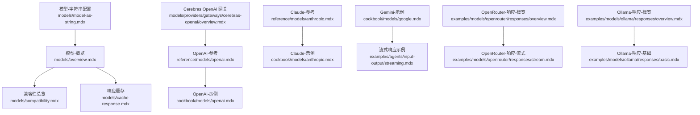
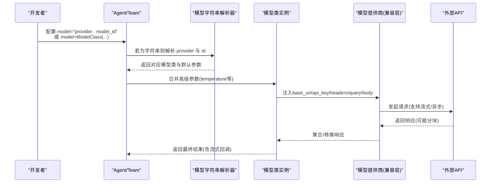
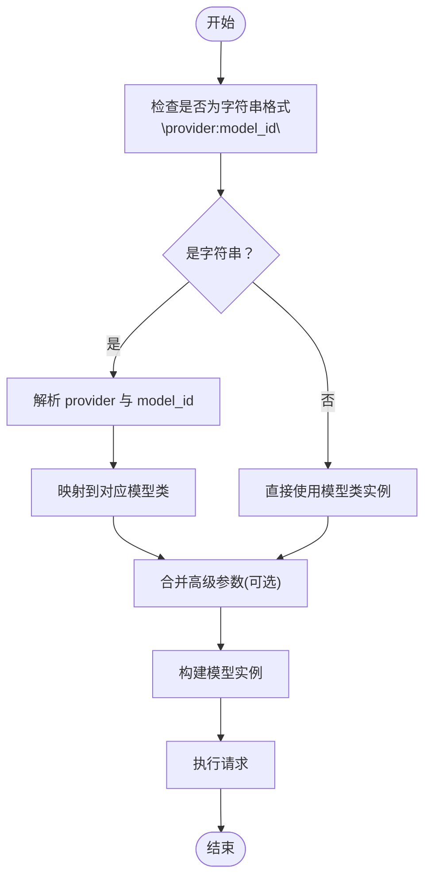
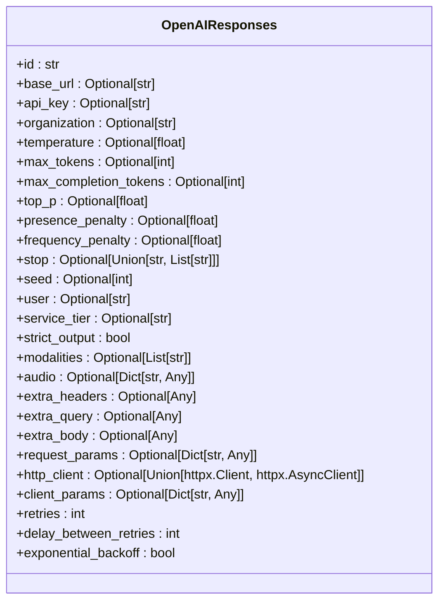
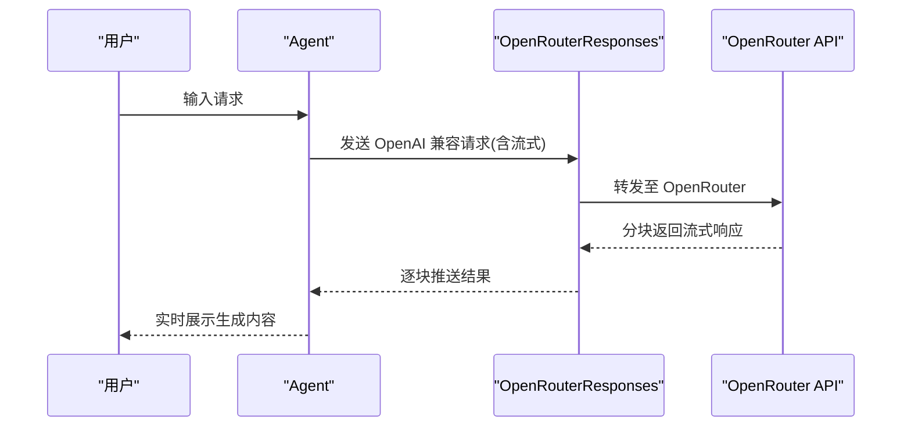
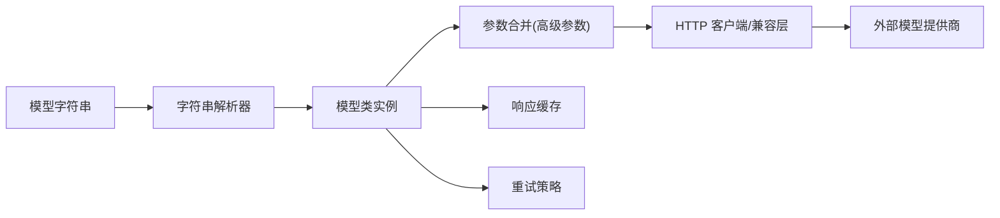

# 模型配置方法

<cite>
**本文引用的文件**
- [模型-字符串配置](file://models/model-as-string.mdx)
- [模型-概览](file://models/overview.mdx)
- [兼容性总览](file://models/compatibility.mdx)
- [响应缓存](file://models/cache-response.mdx)
- [OpenAI-参考](file://reference/models/openai.mdx)
- [Claude-参考](file://reference/models/anthropic.mdx)
- [OpenAI-示例](file://cookbook/models/openai.mdx)
- [Claude-示例](file://cookbook/models/anthropic.mdx)
- [Gemini-示例](file://cookbook/models/google.mdx)
- [流式响应示例](file://examples/agents/input-output/streaming.mdx)
- [OpenRouter-响应-概览](file://examples/models/openrouter/responses/overview.mdx)
- [OpenRouter-响应-流式](file://examples/models/openrouter/responses/stream.mdx)
- [Ollama-响应-概览](file://examples/models/ollama/responses/overview.mdx)
- [Ollama-响应-基础](file://examples/models/ollama/responses/basic.mdx)
- [输入校验-预钩子](file://hooks/usage/team/input-validation-pre-hook.mdx)
- [Cerebras OpenAI 网关](file://models/providers/gateways/cerebras-openai/overview.mdx)
</cite>

## 目录
1. [简介](#简介)
2. [项目结构](#项目结构)
3. [核心组件](#核心组件)
4. [架构总览](#架构总览)
5. [详细组件分析](#详细组件分析)
6. [依赖关系分析](#依赖关系分析)
7. [性能考量](#性能考量)
8. [故障排查指南](#故障排查指南)
9. [结论](#结论)
10. [附录](#附录)

## 简介
本文件系统化阐述在 Agno 中进行“模型配置”的方法与最佳实践，重点覆盖以下主题：
- 模型字符串配置方法：provider:model_id 的格式、适用场景与参数传递
- 何时使用模型字符串，何时使用完整模型类语法
- 高级参数配置：温度（temperature）、最大令牌数（max_tokens 或 max_completion_tokens）、停用序列、频率/存在惩罚、种子、顶部采样等
- OpenAI 兼容接口的配置：自定义端点（base_url）、认证（api_key/organization）、请求头与查询参数注入
- 性能优化与成本控制：响应缓存、重试策略、并发与流式
- 常见配置场景：流式响应、批量处理、错误处理
- 配置验证与调试技巧：输入校验、日志与评估工具

## 项目结构
围绕“模型配置”，仓库中与之直接相关的核心文档分布在以下位置：
- 模型字符串与通用模型说明：models/model-as-string.mdx、models/overview.mdx
- 参数参考与兼容性：reference/models/*.mdx、models/compatibility.mdx
- 示例与用法：cookbook/models/*、examples/agents/input-output/streaming.mdx、examples/models/*/responses/*
- 缓存与重试：models/cache-response.mdx
- 网关与兼容接口：models/providers/gateways/*/overview.mdx

**图表来源**
- [模型-字符串配置](file://models/model-as-string.mdx)
- [模型-概览](file://models/overview.mdx)
- [兼容性总览](file://models/compatibility.mdx)
- [响应缓存](file://models/cache-response.mdx)
- [OpenAI-参考](file://reference/models/openai.mdx)
- [OpenAI-示例](file://cookbook/models/openai.mdx)
- [Claude-参考](file://reference/models/anthropic.mdx)
- [Claude-示例](file://cookbook/models/anthropic.mdx)
- [Gemini-示例](file://cookbook/models/google.mdx)
- [流式响应示例](file://examples/agents/input-output/streaming.mdx)
- [OpenRouter-响应-概览](file://examples/models/openrouter/responses/overview.mdx)
- [OpenRouter-响应-流式](file://examples/models/openrouter/responses/stream.mdx)
- [Ollama-响应-概览](file://examples/models/ollama/responses/overview.mdx)
- [Ollama-响应-基础](file://examples/models/ollama/responses/basic.mdx)
- [Cerebras OpenAI 网关](file://models/providers/gateways/cerebras-openai/overview.mdx)

**章节来源**
- [模型-字符串配置](file://models/model-as-string.mdx)
- [模型-概览](file://models/overview.mdx)

## 核心组件
- 模型字符串语法：以 provider:model_id 表达模型标识，无需导入具体模型类即可使用；适合简单配置与快速原型。
- 完整模型类语法：通过显式构造模型类（如 OpenAIResponses、Claude 等），可传入 temperature、max_tokens、headers、base_url 等高级参数；适合复杂场景与细粒度控制。
- OpenAI 兼容接口：支持自定义 base_url、api_key、extra_headers、extra_query、extra_body、request_params 等，便于接入不同厂商的 OpenAI 兼容端点。
- 高级参数：temperature、max_tokens/max_completion_tokens、top_p、presence_penalty、frequency_penalty、stop、seed、user、service_tier、strict_output、modalities/audio 等。
- 缓存与重试：cache_response、cache_ttl、cache_dir、retries、delay_between_retries、exponential_backoff。
- 流式与异步：统一支持 streaming 与 async 执行。

**章节来源**
- [模型-字符串配置](file://models/model-as-string.mdx)
- [模型-概览](file://models/overview.mdx)
- [OpenAI-参考](file://reference/models/openai.mdx)
- [Claude-参考](file://reference/models/anthropic.mdx)
- [响应缓存](file://models/cache-response.mdx)

## 架构总览
下图展示了从“配置模型”到“执行请求”的整体流程，涵盖字符串解析、参数注入、兼容层适配与执行路径。

**图表来源**
- [模型-字符串配置](file://models/model-as-string.mdx)
- [OpenAI-参考](file://reference/models/openai.mdx)
- [OpenRouter-响应-概览](file://examples/models/openrouter/responses/overview.mdx)
- [Ollama-响应-概览](file://examples/models/ollama/responses/overview.mdx)

## 详细组件分析

### 组件A：模型字符串配置方法
- 语法与示例：provider:model_id，大小写不敏感；支持多提供商映射。
- 使用场景：
  - 快速原型与简单任务：优先使用字符串，减少样板代码。
  - 复杂参数与定制化：使用模型类语法传入 temperature、max_tokens、headers 等。
- 多模型类型：Agent 支持 main model、reasoning_model、parser_model、output_model 的组合配置。

**图表来源**
- [模型-字符串配置](file://models/model-as-string.mdx)

**章节来源**
- [模型-字符串配置](file://models/model-as-string.mdx)

### 组件B：OpenAI 兼容接口配置
- 自定义端点与认证：
  - base_url：指向任意 OpenAI 兼容服务（如 OpenRouter、Ollama、Cerebras 等）
  - api_key/organization：认证凭据，优先使用环境变量
- 请求扩展：
  - extra_headers/extra_query/extra_body/request_params：注入额外头部、查询参数或请求体字段
  - http_client/client_params：自定义 HTTP 客户端与连接参数
- 高级参数：
  - temperature、max_tokens/max_completion_tokens、top_p、presence_penalty、frequency_penalty、stop、seed、user、service_tier、strict_output、modalities/audio 等
- 错误与重试：
  - retries、delay_between_retries、exponential_backoff；也可在 Agent/Team 层配置全运行重试

**图表来源**
- [OpenAI-参考](file://reference/models/openai.mdx)

**章节来源**
- [OpenAI-参考](file://reference/models/openai.mdx)
- [Cerebras OpenAI 网关](file://models/providers/gateways/cerebras-openai/overview.mdx)

### 组件C：高级参数与最佳实践
- 温度（temperature）：控制输出随机性，范围通常为 0.0–2.0
- 最大令牌数（max_tokens / max_completion_tokens）：限制生成长度，避免过度消耗
- 采样策略（top_p/top_k）：控制多样性与创造性
- 惩罚项（presence_penalty/frequency_penalty）：抑制重复与引入新内容
- 停用序列（stop）：指定停止生成的标记
- 种子（seed）：启用确定性采样
- 用户标识（user）：用于审计与限流
- 结构化输出（strict_output）：确保输出符合模式约束
- 多模态（modalities/audio）：文本/音频/视频等多模态输入与输出
- 成本与性能优化：
  - 使用 cache_response 减少重复调用
  - 合理设置 max_tokens 与 temperature
  - 在开发阶段开启缓存，在生产关闭或谨慎使用
- 错误处理与重试：
  - 针对网络抖动与速率限制，配置 retries 与指数退避
  - 在 Agent/Team 层配置全运行重试策略

**章节来源**
- [OpenAI-参考](file://reference/models/openai.mdx)
- [Claude-参考](file://reference/models/anthropic.mdx)
- [响应缓存](file://models/cache-response.mdx)

### 组件D：OpenAI 兼容接口的常见场景
- 流式响应：适用于低延迟交互与动态工作流
- 工具调用：结合工具实现推理与行动
- 视觉理解：支持图片/视频输入
- 结构化输出：通过模式约束保证稳定性
- 动态路由与多模型：OpenRouter 提供统一入口与回退策略

**图表来源**
- [OpenRouter-响应-概览](file://examples/models/openrouter/responses/overview.mdx)
- [OpenRouter-响应-流式](file://examples/models/openrouter/responses/stream.mdx)

**章节来源**
- [OpenRouter-响应-概览](file://examples/models/openrouter/responses/overview.mdx)
- [OpenRouter-响应-流式](file://examples/models/openrouter/responses/stream.mdx)
- [Ollama-响应-概览](file://examples/models/ollama/responses/overview.mdx)
- [Ollama-响应-基础](file://examples/models/ollama/responses/basic.mdx)

### 组件E：多提供商与兼容性
- 核心能力：统一支持流式、工具调用、结构化输出、异步执行
- 多模态支持：各提供商在图像/音频/视频/文件上传方面能力差异较大
- 特殊说明：部分提供商在特定功能上有限制（例如某些提供商不支持原生结构化输出）

**章节来源**
- [兼容性总览](file://models/compatibility.mdx)

## 依赖关系分析
- 字符串到类的映射：模型字符串经解析后映射到具体模型类，再由该类负责参数合并与请求构造
- 兼容层：OpenAI 兼容接口通过 base_url 与 api_key 解耦于具体提供商，允许注入额外请求参数
- 缓存与重试：模型类内部或 Agent/Team 层均可配置，影响请求生命周期与成本

**图表来源**
- [模型-字符串配置](file://models/model-as-string.mdx)
- [OpenAI-参考](file://reference/models/openai.mdx)
- [响应缓存](file://models/cache-response.mdx)

**章节来源**
- [模型-字符串配置](file://models/model-as-string.mdx)
- [OpenAI-参考](file://reference/models/openai.mdx)
- [响应缓存](file://models/cache-response.mdx)

## 性能考量
- 响应缓存：在开发与测试阶段显著降低调用次数与等待时间，注意生产禁用或谨慎设置 TTL
- 令牌上限：合理设置 max_tokens/max_completion_tokens，避免长尾消耗
- 采样参数：适度降低 temperature 与 top_p 可提升一致性，减少重复
- 并发与流式：利用流式与异步能力提升用户体验，但需关注带宽与并发限制
- 多模态输入：图片/视频/音频会增加传输与处理开销，建议按需启用

[本节为通用指导，无需列出章节来源]

## 故障排查指南
- 输入校验与前置钩子：通过预钩子对输入进行安全、相关性与细节校验，拦截不当请求
- 日志与评估：使用性能评估工具观察运行时与内存增长，定位瓶颈
- 配置验证步骤：
  - 确认 provider 与 model_id 是否正确
  - 检查 base_url 与 api_key 是否可用
  - 校验高级参数范围与类型
  - 开启流式与缓存时分别验证行为
- 常见问题定位：
  - 认证失败：核对 api_key/organization 与环境变量
  - 端点不可达：确认 base_url 与网络连通性
  - 输出不符合预期：调整 temperature、max_tokens、strict_output 等参数
  - 性能异常：启用缓存、减少多模态输入、优化并发

**章节来源**
- [输入校验-预钩子](file://hooks/usage/team/input-validation-pre-hook.mdx)

## 结论
- 模型字符串语法适合快速与简洁配置；复杂参数与定制需求建议使用模型类语法
- OpenAI 兼容接口提供了统一的扩展点，便于接入多家厂商与自建网关
- 通过合理的参数设置、缓存与重试策略，可在性能与成本之间取得平衡
- 建议在开发阶段广泛使用缓存与流式，生产阶段严格控制参数与监控成本

[本节为总结，无需列出章节来源]

## 附录
- 常用配置场景示例路径（不含代码内容）：
  - 流式响应：[流式响应示例](file://examples/agents/input-output/streaming.mdx)
  - OpenRouter 流式：[OpenRouter-响应-流式](file://examples/models/openrouter/responses/stream.mdx)
  - Ollama 基础：[Ollama-响应-基础](file://examples/models/ollama/responses/basic.mdx)
  - OpenAI 基础/工具/视觉/结构化输出：[OpenAI-示例](file://cookbook/models/openai.mdx)
  - Claude 基础/工具/视觉/思维/结构化输出：[Claude-示例](file://cookbook/models/anthropic.mdx)
  - Gemini 基础/工具/视频/搜索/结构化输出：[Gemini-示例](file://cookbook/models/google.mdx)
- 参数参考：
  - OpenAI：[OpenAI-参考](file://reference/models/openai.mdx)
  - Claude：[Claude-参考](file://reference/models/anthropic.mdx)
- 兼容性矩阵：[兼容性总览](file://models/compatibility.mdx)
- 缓存与重试：[响应缓存](file://models/cache-response.mdx)
- 网关与兼容接口：[Cerebras OpenAI 网关](file://models/providers/gateways/cerebras-openai/overview.mdx)