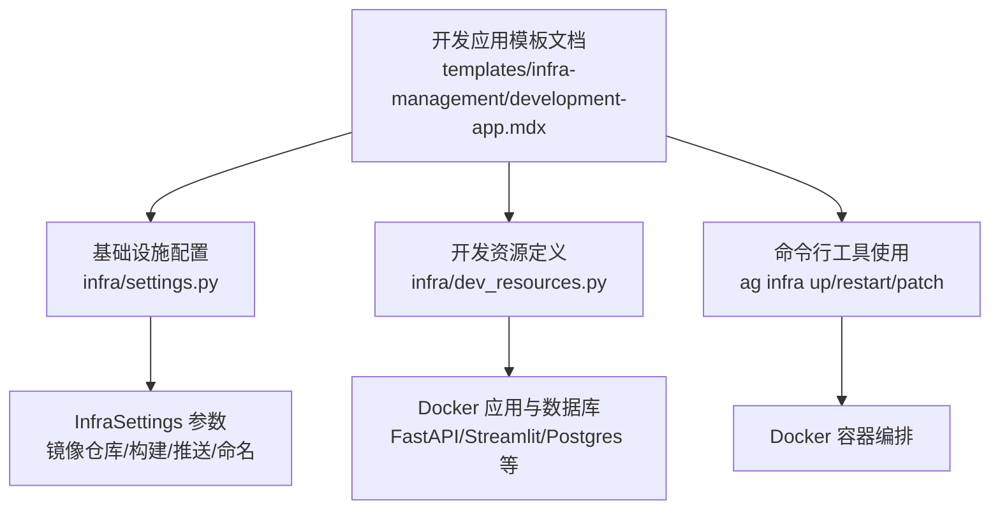
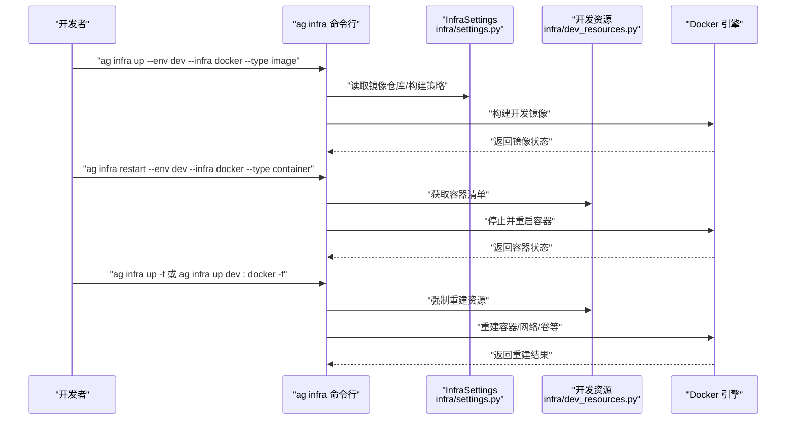
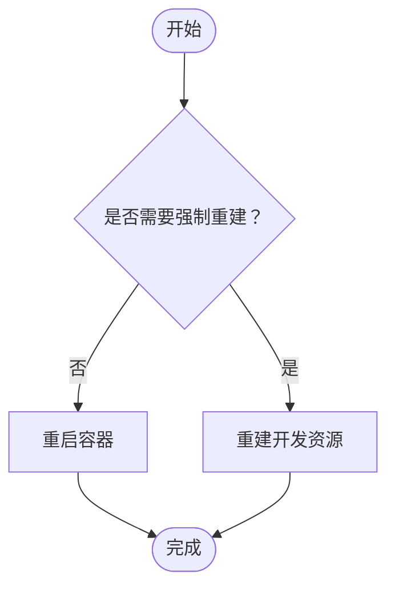
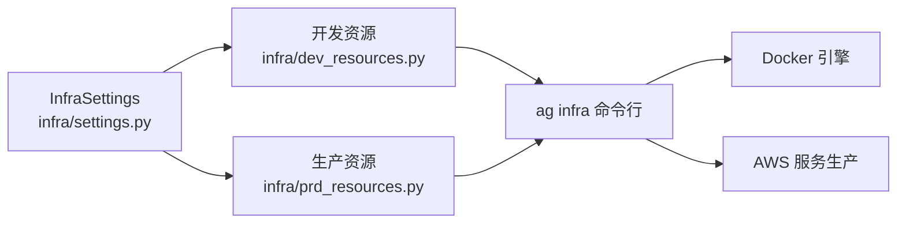

# 开发应用模板

<cite>
**本文引用的文件**
- [development-app.mdx](file://templates/infra-management/development-app.mdx)
- [development-app.mdx（AWS 配置）](file://deploy/templates/aws/configure/development-app.mdx)
- [development-app.mdx（生产定制 AWS）](file://production/templates/customize-aws/development-app.mdx)
- [Infra 设置](file://TBD/pages/templates/infra/settings.mdx)
- [Infra 资源](file://TBD/pages/templates/infra/resources.mdx)
- [Infra 设置（AWS 配置）](file://deploy/templates/aws/configure/infra-settings.mdx)
- [Infra 设置（生产定制 AWS）](file://production/templates/customize-aws/infra-settings.mdx)
- [生产应用](file://templates/infra-management/production-app.mdx)
- [Python 包管理](file://TBD/pages/templates/infra-management/python-packages.mdx)
- [Python 包管理（AWS 配置）](file://deploy/templates/aws/configure/python-packages.mdx)
- [环境变量](file://TBD/pages/templates/infra-management/env-vars.mdx)
- [环境变量（AWS 配置）](file://deploy/templates/aws/configure/env-vars.mdx)
- [环境变量（生产定制 AWS）](file://production/templates/customize-aws/env-vars.mdx)
- [基础设施概览](file://infra/overview.mdx)
</cite>

## 目录
1. [简介](#简介)
2. [项目结构](#项目结构)
3. [核心组件](#核心组件)
4. [架构总览](#架构总览)
5. [详细组件分析](#详细组件分析)
6. [依赖关系分析](#依赖关系分析)
7. [性能考虑](#性能考虑)
8. [故障排查指南](#故障排查指南)
9. [结论](#结论)
10. [附录](#附录)

## 简介
本技术文档面向使用“开发应用模板”的开发者，系统性阐述模板的设计目的、使用场景与最佳实践，重点覆盖以下方面：
- 快速搭建本地开发环境：通过 Docker 容器化运行应用与数据库，并由统一的基础设施配置驱动资源生命周期。
- 核心功能流程：镜像构建、容器重启、资源重建的完整步骤与命令行操作。
- 配置与自定义：镜像仓库设置、构建参数、环境变量注入、网络与资源命名策略等。
- 与生产模板的关系：对比开发与生产的差异与衔接点，帮助在不同环境间平滑迁移。

## 项目结构
开发应用模板围绕“基础设施配置 + 资源定义 + 命令行工具”组织内容，关键位置如下：
- 基础设施配置：infra/settings.py 中的 InfraSettings 对象，集中定义命名、镜像仓库、构建与推送策略、AWS 可用区与子网等。
- 资源定义：infra/dev_resources.py 定义开发环境的容器化应用与数据库等资源。
- 命令行工具：ag infra 提供 up/restart/patch/down 等子命令，按环境与基础设施类型进行资源编排。
- 模板文档：templates/infra-management/development-app.mdx 等提供操作指南与命令示例。

图表来源
- [development-app.mdx:1-107](file://templates/infra-management/development-app.mdx#L1-L107)
- [Infra 设置:14-70](file://TBD/pages/templates/infra/settings.mdx#L14-L70)
- [Infra 资源:1-54](file://TBD/pages/templates/infra/resources.mdx#L1-L54)
- [基础设施概览:64-168](file://infra/overview.mdx#L64-L168)

章节来源
- [development-app.mdx:1-107](file://templates/infra-management/development-app.mdx#L1-L107)
- [Infra 设置:14-70](file://TBD/pages/templates/infra/settings.mdx#L14-L70)
- [Infra 资源:1-54](file://TBD/pages/templates/infra/resources.mdx#L1-L54)
- [基础设施概览:64-168](file://infra/overview.mdx#L64-L168)

## 核心组件
- 基础设施配置（InfraSettings）
  - 作用：统一命名空间、镜像仓库、构建与推送策略、AWS 可用区与子网等。
  - 关键字段：infra_name、image_repo、build_images、push_images、skip_image_cache、force_pull_images、aws_region、aws_az1、aws_az2、subnet_ids 等。
- 开发资源定义（DockerResources）
  - 作用：声明开发环境中的应用与数据库等资源，例如 FastAPI、Streamlit、PgVectorDb 等。
  - 特点：通过 env 参数绑定开发环境，支持 secrets_file 注入密钥与配置。
- 命令行工具（ag infra）
  - 作用：对资源进行创建/重启/补丁/删除等操作；支持按环境（dev/prd）与基础设施（docker/aws/k8s）过滤。
  - 子命令：up、restart、patch、down、delete、config 等。

章节来源
- [Infra 设置:14-70](file://TBD/pages/templates/infra/settings.mdx#L14-L70)
- [Infra 资源:1-54](file://TBD/pages/templates/infra/resources.mdx#L1-L54)
- [基础设施概览:64-168](file://infra/overview.mdx#L64-L168)

## 架构总览
下图展示了开发应用模板在本地 Docker 环境下的典型工作流：从镜像构建到容器重启再到资源重建的关键步骤与命令入口。

图表来源
- [development-app.mdx:34-106](file://templates/infra-management/development-app.mdx#L34-L106)
- [Infra 设置:14-70](file://TBD/pages/templates/infra/settings.mdx#L14-L70)
- [Infra 资源:1-54](file://TBD/pages/templates/infra/resources.mdx#L1-L54)
- [基础设施概览:64-168](file://infra/overview.mdx#L64-L168)

## 详细组件分析

### 组件一：镜像构建与仓库设置
- 设计目的
  - 通过统一的 InfraSettings 控制镜像仓库与构建策略，确保开发与生产的镜像一致性。
- 关键配置
  - image_repo：镜像仓库地址（Docker Hub 或私有仓库）。
  - build_images：是否在本地构建镜像。
  - push_images：构建后是否推送到仓库。
  - skip_image_cache、force_pull_images：控制构建缓存与基础镜像拉取策略。
- 自定义方法
  - 在 infra/settings.py 中更新上述参数；也可通过环境变量或 .env 文件覆盖。
- 使用流程
  - 更新配置 → 执行镜像构建命令 → 如需强制重建可添加 --force/-f。
- 命令示例
  - 构建开发镜像：ag infra up --env dev --infra docker --type image
  - 强制重建镜像：ag infra up --env dev --infra docker --type image --force

章节来源
- [development-app.mdx:15-62](file://templates/infra-management/development-app.mdx#L15-L62)
- [Infra 设置（AWS 配置）:1-51](file://deploy/templates/aws/configure/infra-settings.mdx#L1-L51)
- [Infra 设置（生产定制 AWS）:1-51](file://production/templates/customize-aws/infra-settings.mdx#L1-L51)
- [Infra 设置:14-70](file://TBD/pages/templates/infra/settings.mdx#L14-L70)

### 组件二：容器重启与资源重建
- 设计目的
  - 在修改代码、依赖或配置后，快速重启容器以应用变更；必要时重建资源以恢复一致状态。
- 关键流程
  - 重启容器：ag infra restart --env dev --infra docker --type container
  - 强制重建资源：ag infra up -f 或 ag infra up dev:docker -f
- 注意事项
  - patch 命令对部分资源尚在开发中，必要时可用 restart 替代。
  - 重建会涉及容器、网络、卷等资源的重新创建，注意数据持久化策略。

图表来源
- [development-app.mdx:66-106](file://templates/infra-management/development-app.mdx#L66-L106)
- [基础设施概览:70-124](file://infra/overview.mdx#L70-L124)

章节来源
- [development-app.mdx:66-106](file://templates/infra-management/development-app.mdx#L66-L106)
- [基础设施概览:70-124](file://infra/overview.mdx#L70-L124)

### 组件三：环境变量与密钥注入
- 设计目的
  - 将运行时所需的敏感信息与配置项安全地注入到应用容器中，避免硬编码。
- 配置方式
  - 通过 env_vars 或 env_file 指定变量来源；开发与生产分别在 dev_resources.py 与 prd_resources.py 中配置。
  - 生产环境可通过 AWS Secrets Manager 等服务引用密钥。
- 实践建议
  - 开发环境可直接从本地环境变量读取；生产环境建议使用托管密钥服务。
  - 数据库连接信息可自动从数据库资源对象获取端点、端口、用户与密码。

章节来源
- [环境变量:1-51](file://TBD/pages/templates/infra-management/env-vars.mdx#L1-L51)
- [环境变量（AWS 配置）:1-38](file://deploy/templates/aws/configure/env-vars.mdx#L1-L38)
- [环境变量（生产定制 AWS）:1-51](file://production/templates/customize-aws/env-vars.mdx#L1-L51)

### 组件四：依赖管理与镜像重建
- 设计目的
  - 当 Python 依赖发生变化时，确保镜像包含最新依赖并正确重建容器。
- 流程要点
  - 更新 pyproject.toml 后生成 requirements.txt。
  - 通过 ag infra up 重建开发镜像；如需立即生效，再执行容器重启。
- 命令参考
  - 重建开发镜像：ag infra up --env dev --infra docker --type image
  - 重启开发容器：ag infra restart --env dev --infra docker --type container

章节来源
- [Python 包管理:50-128](file://TBD/pages/templates/infra-management/python-packages.mdx#L50-L128)
- [Python 包管理（AWS 配置）:50-128](file://deploy/templates/aws/configure/python-packages.mdx#L50-L128)

### 组件五：与生产模板的关系与差异
- 相同点
  - 均使用 InfraSettings 进行统一配置；均通过 ag infra 工具链进行资源编排。
- 差异点
  - 生产模板强调镜像推送到私有仓库（如 ECR），并提供 ECS 任务定义与服务更新流程。
  - 开发模板聚焦本地 Docker，资源更轻量，便于快速迭代。
- 迁移建议
  - 在开发阶段验证镜像与配置；生产阶段启用 push_images 并对接 CI/CD 流水线。

章节来源
- [生产应用:1-166](file://templates/infra-management/production-app.mdx#L1-L166)
- [Infra 设置（AWS 配置）:1-51](file://deploy/templates/aws/configure/infra-settings.mdx#L1-L51)
- [Infra 设置（生产定制 AWS）:1-51](file://production/templates/customize-aws/infra-settings.mdx#L1-L51)

## 依赖关系分析
- 配置层依赖
  - InfraSettings 为上层资源定义提供命名与参数来源，决定镜像仓库、构建策略与 AWS 资源属性。
- 资源层依赖
  - DockerResources 依赖 InfraSettings 的命名与开关，组合 FastAPI、数据库等应用组件。
- 命令行层依赖
  - ag infra 命令根据 --env 与 --infra 过滤目标资源，调用底层 Docker 或云平台 API。

图表来源
- [Infra 设置:14-70](file://TBD/pages/templates/infra/settings.mdx#L14-L70)
- [Infra 资源:1-54](file://TBD/pages/templates/infra/resources.mdx#L1-L54)
- [基础设施概览:64-168](file://infra/overview.mdx#L64-L168)

章节来源
- [Infra 设置:14-70](file://TBD/pages/templates/infra/settings.mdx#L14-L70)
- [Infra 资源:1-54](file://TBD/pages/templates/infra/resources.mdx#L1-L54)
- [基础设施概览:64-168](file://infra/overview.mdx#L64-L168)

## 性能考虑
- 构建性能
  - 合理使用 skip_image_cache 与 force_pull_images 控制缓存与基础镜像拉取，平衡构建速度与一致性。
  - 在开发阶段可开启 build_images 与 push_images，便于快速迭代与共享镜像。
- 运行性能
  - 通过 env_vars 调整应用内存与并发参数；在 Docker 资源中合理分配 CPU/内存限额。
  - 使用独立网络与卷，减少跨容器通信开销与 I/O 抖动。

## 故障排查指南
- 无法连接 Docker
  - 确认 Docker 服务已启动；检查 ag infra config 输出的调试日志定位问题。
- 镜像构建失败
  - 检查 requirements.txt 是否与 pyproject.toml 同步；确认镜像仓库可达且凭证正确。
- 容器重启无效
  - 使用 restart 命令替代 patch；若仍无效，尝试强制重建资源（--force）。
- 环境变量未生效
  - 核对 dev_resources.py/prd_resources.py 中 env_vars/env_file 配置；生产环境确认密钥服务可用。

章节来源
- [基础设施概览:64-168](file://infra/overview.mdx#L64-L168)

## 结论
开发应用模板通过统一的基础设施配置与命令行工具，实现了本地 Docker 环境下的一致化开发体验。结合镜像仓库设置、依赖管理与环境变量注入，开发者可以高效完成从镜像构建到容器重启再到资源重建的全流程操作。同时，模板与生产模板保持一致的配置模型与工具链，便于在不同环境间平滑迁移与扩展。

## 附录
- 常用命令速查
  - 构建开发镜像：ag infra up --env dev --infra docker --type image
  - 强制重建镜像：ag infra up --env dev --infra docker --type image --force
  - 重启开发容器：ag infra restart --env dev --infra docker --type container
  - 强制重建开发资源：ag infra up -f 或 ag infra up dev:docker -f
  - 查看当前配置：ag infra config
- 最佳实践
  - 在开发阶段频繁使用 restart 与 up -f 快速验证变更。
  - 生产阶段启用 push_images 并配合 CI/CD 自动化镜像发布与服务更新。