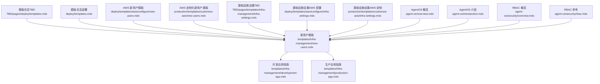
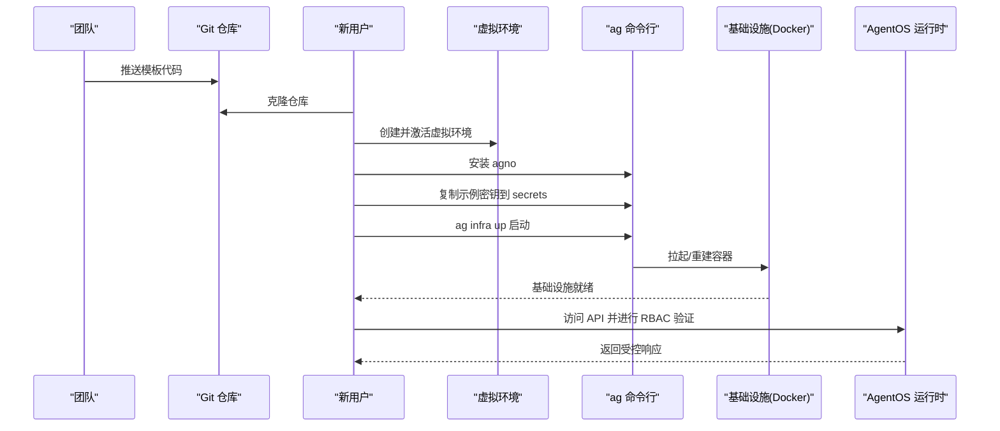
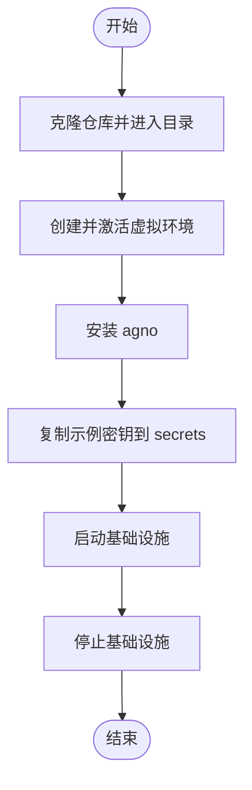
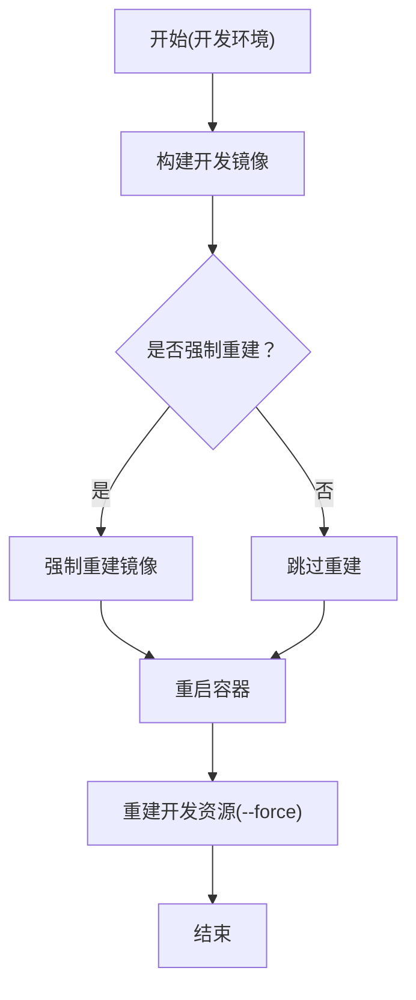
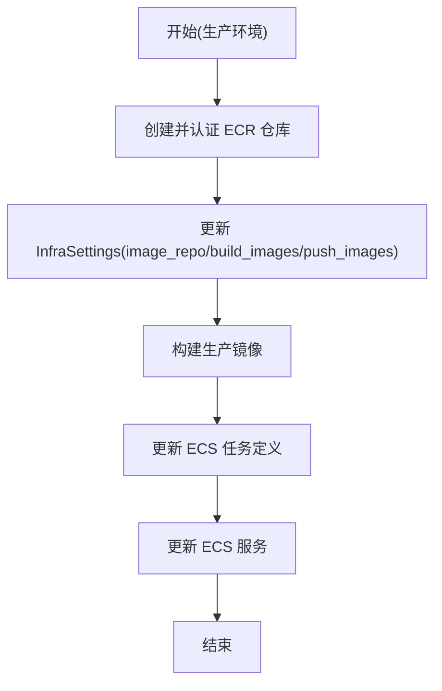
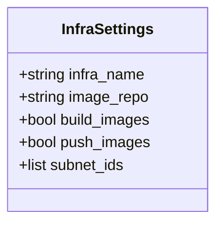
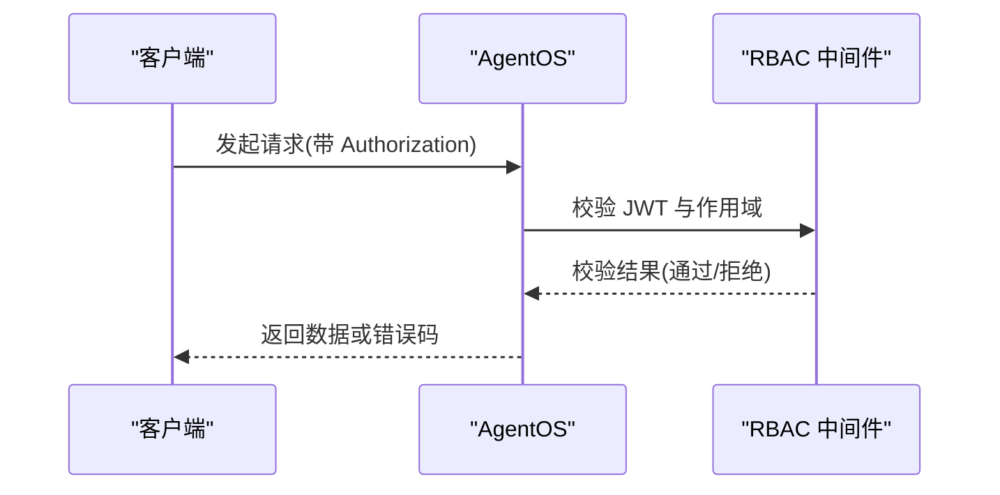
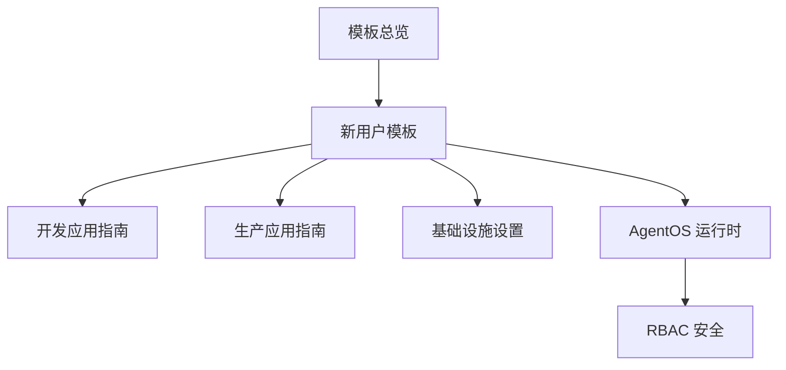

# 新用户模板

<cite>
**本文引用的文件**
- [new-users.mdx](file://templates/infra-management/new-users.mdx)
- [development-app.mdx](file://templates/infra-management/development-app.mdx)
- [production-app.mdx](file://templates/infra-management/production-app.mdx)
- [templates.mdx](file://TBD/pages/deploy/templates.mdx)
- [templates.mdx](file://deploy/templates.mdx)
- [new-users.mdx](file://deploy/templates/aws/configure/new-users.mdx)
- [new-users.mdx](file://production/templates/customize-aws/new-users.mdx)
- [infra-settings.mdx](file://TBD/pages/templates/infra-management/infra-settings.mdx)
- [infra-settings.mdx](file://deploy/templates/aws/configure/infra-settings.mdx)
- [infra-settings.mdx](file://production/templates/customize-aws/infra-settings.mdx)
- [agent-os-overview.mdx](file://agent-os/overview.mdx)
- [agent-os-introduction.mdx](file://agent-os/introduction.mdx)
- [rbac-overview.mdx](file://agent-os/security/overview.mdx)
- [rbac-reference.mdx](file://agent-os/security/rbac.mdx)
</cite>

## 目录
1. [简介](#简介)
2. [项目结构](#项目结构)
3. [核心组件](#核心组件)
4. [架构总览](#架构总览)
5. [详细组件分析](#详细组件分析)
6. [依赖关系分析](#依赖关系分析)
7. [性能考虑](#性能考虑)
8. [故障排除指南](#故障排除指南)
9. [结论](#结论)
10. [附录](#附录)

## 简介
本指南面向首次接触 Agno 框架的新用户，帮助你通过“新用户模板”快速完成本地开发环境的初始化与基础功能验证。该模板聚焦于以下目标：
- 快速搭建可运行的 AgentOS 基础设施（本地 Docker 开发环境）
- 提供最小可用的权限控制（RBAC）与安全基线
- 明确从模板下载、环境准备、基础设施启动到停止的完整流程
- 解释基础设施配置项（如镜像仓库、子网、名称等）及其个性化方法
- 对比不同模板与适用场景，指导后续扩展

## 项目结构
新用户模板相关文档分布在多个路径中，主要围绕“基础设施管理模板”“模板总览”“AWS/Railway/Docker 等模板”以及“AgentOS 运行时与安全”展开。

图表来源
- [new-users.mdx:1-125](file://templates/infra-management/new-users.mdx#L1-L125)
- [development-app.mdx:1-107](file://templates/infra-management/development-app.mdx#L1-L107)
- [production-app.mdx:1-166](file://templates/infra-management/production-app.mdx#L1-L166)
- [templates.mdx:1-95](file://TBD/pages/deploy/templates.mdx#L1-L95)
- [templates.mdx:1-48](file://deploy/templates.mdx#L1-L48)
- [new-users.mdx:1-124](file://deploy/templates/aws/configure/new-users.mdx#L1-L124)
- [new-users.mdx:1-124](file://production/templates/customize-aws/new-users.mdx#L1-L124)
- [infra-settings.mdx:1-80](file://TBD/pages/templates/infra-management/infra-settings.mdx#L1-L80)
- [infra-settings.mdx:1-80](file://deploy/templates/aws/configure/infra-settings.mdx#L1-L80)
- [infra-settings.mdx:1-80](file://production/templates/customize-aws/infra-settings.mdx#L1-L80)
- [agent-os-overview.mdx:1-86](file://agent-os/overview.mdx#L1-L86)
- [agent-os-introduction.mdx:1-113](file://agent-os/introduction.mdx#L1-L113)
- [rbac-overview.mdx:51-70](file://agent-os/security/overview.mdx#L51-L70)
- [rbac-reference.mdx:52-99](file://agent-os/security/rbac.mdx#L52-L99)

章节来源
- [new-users.mdx:1-125](file://templates/infra-management/new-users.mdx#L1-L125)
- [templates.mdx:1-95](file://TBD/pages/deploy/templates.mdx#L1-L95)
- [templates.mdx:1-48](file://deploy/templates.mdx#L1-L48)

## 核心组件
- 基础设施管理模板（新用户）
  - 提供“克隆仓库 → 创建并激活虚拟环境 → 安装 agno → 复制密钥 → 启动/停止基础设施”的标准流程
  - 适用于已有基础设施代码库的团队协作场景
- 开发应用指南
  - 说明如何构建开发镜像、重启容器、重建资源
  - 强调默认使用 agno 镜像，支持自定义镜像仓库与本地构建
- 生产应用指南
  - 说明如何在 AWS 上构建镜像、更新 ECS 任务定义与服务
  - 包含 ECR 认证、镜像仓库配置与强制重建选项
- AgentOS 运行时与安全
  - AgentOS 将代理系统转化为可部署的生产 API，支持 RBAC、追踪、数据库集成等
  - 提供最小示例与参数说明，便于快速上手

章节来源
- [new-users.mdx:6-124](file://templates/infra-management/new-users.mdx#L6-L124)
- [development-app.mdx:5-106](file://templates/infra-management/development-app.mdx#L5-L106)
- [production-app.mdx:5-165](file://templates/infra-management/production-app.mdx#L5-L165)
- [agent-os-overview.mdx:6-86](file://agent-os/overview.mdx#L6-L86)
- [agent-os-introduction.mdx:7-113](file://agent-os/introduction.mdx#L7-L113)

## 架构总览
下图展示了新用户从模板到运行时的整体流程：团队共享代码库 → 新用户克隆 → 虚拟环境与依赖 → 启动本地基础设施 → 使用 AgentOS API 与安全控制。

图表来源
- [new-users.mdx:10-122](file://templates/infra-management/new-users.mdx#L10-L122)
- [development-app.mdx:34-106](file://templates/infra-management/development-app.mdx#L34-L106)
- [production-app.mdx:83-157](file://templates/infra-management/production-app.mdx#L83-L157)
- [rbac-reference.mdx:52-99](file://agent-os/security/rbac.mdx#L52-L99)

## 详细组件分析

### 组件一：新用户模板（基础设施管理）
- 设计目标
  - 降低新成员上手成本：标准化步骤、明确命令与目录结构
  - 支持多平台（Mac/Windows）与多种环境（dev/prd）
  - 与模板体系（Docker/AWS/Railway）保持一致的使用体验
- 关键流程
  - 克隆仓库与进入目录
  - 创建并激活虚拟环境
  - 安装 agno
  - 复制示例密钥到 secrets
  - 启动/停止基础设施（支持完整选项、简写与默认）
- 适用场景
  - 团队已有基础设施代码库，需要新成员快速加入
  - 优先使用 Docker 作为本地开发环境

图表来源
- [new-users.mdx:10-122](file://templates/infra-management/new-users.mdx#L10-L122)

章节来源
- [new-users.mdx:6-124](file://templates/infra-management/new-users.mdx#L6-L124)

### 组件二：开发应用（本地 Docker）
- 核心能力
  - 构建开发镜像（支持强制重建）
  - 重启所有容器
  - 重建开发资源（配合 --force）
- 自定义镜像
  - 更新镜像仓库与开关 build_images
  - 在 settings.py 中配置 image_repo 与 build_images

图表来源
- [development-app.mdx:15-106](file://templates/infra-management/development-app.mdx#L15-L106)

章节来源
- [development-app.mdx:5-106](file://templates/infra-management/development-app.mdx#L5-L106)

### 组件三：生产应用（AWS）
- 核心能力
  - 构建生产镜像（支持 ECR/DockerHub）
  - 更新 ECS 任务定义与服务
  - ECR 认证与镜像推送
- 关键配置
  - 镜像仓库与推送策略
  - AWS 子网与区域信息
  - 强制重建镜像与仅更新服务的策略

图表来源
- [production-app.mdx:15-157](file://templates/infra-management/production-app.mdx#L15-L157)

章节来源
- [production-app.mdx:5-165](file://templates/infra-management/production-app.mdx#L5-L165)

### 组件四：基础设施设置（InfraSettings）
- 关键字段
  - infra_name：命名基础设施与资源
  - image_repo：镜像仓库（DockerHub 或 ECR）
  - build_images / push_images：构建与推送策略
  - AWS 子网与区域（生产环境）
- 个性化建议
  - 将 infra_name 改为团队或项目名
  - 根据部署平台选择镜像仓库
  - 结合环境变量或 .env 文件覆盖默认值

图表来源
- [infra-settings.mdx:7-20](file://TBD/pages/templates/infra-management/infra-settings.mdx#L7-L20)
- [infra-settings.mdx:7-20](file://deploy/templates/aws/configure/infra-settings.mdx#L7-L20)
- [infra-settings.mdx:7-20](file://production/templates/customize-aws/infra-settings.mdx#L7-L20)

章节来源
- [infra-settings.mdx:5-80](file://TBD/pages/templates/infra-management/infra-settings.mdx#L5-L80)
- [infra-settings.mdx:5-80](file://deploy/templates/aws/configure/infra-settings.mdx#L5-L80)
- [infra-settings.mdx:5-80](file://production/templates/customize-aws/infra-settings.mdx#L5-L80)

### 组件五：AgentOS 运行时与安全（RBAC）
- 运行时特性
  - 将代理系统转化为生产 API，支持会话、记忆、知识与追踪
  - 参数与方法说明，便于快速集成
- 安全控制
  - 基于 JWT 的 RBAC，支持细粒度作用域
  - 请求无有效令牌返回 401，权限不足返回 403

图表来源
- [agent-os-overview.mdx:27-86](file://agent-os/overview.mdx#L27-L86)
- [rbac-overview.mdx:51-70](file://agent-os/security/overview.mdx#L51-L70)
- [rbac-reference.mdx:52-99](file://agent-os/security/rbac.mdx#L52-L99)

章节来源
- [agent-os-overview.mdx:6-86](file://agent-os/overview.mdx#L6-L86)
- [agent-os-introduction.mdx:76-113](file://agent-os/introduction.mdx#L76-L113)
- [rbac-overview.mdx:51-70](file://agent-os/security/overview.mdx#L51-L70)
- [rbac-reference.mdx:52-99](file://agent-os/security/rbac.mdx#L52-L99)

## 依赖关系分析
- 模板与新用户流程
  - 新用户模板与开发/生产指南共同构成完整的基础设施生命周期
  - 模板总览文档提供平台选择与对比，辅助新用户决定使用 Docker/AWS/Railway
- AgentOS 与安全
  - 新用户模板侧重基础设施启动，AgentOS 文档提供运行时与安全控制
  - RBAC 与基础设施设置相互补充：前者保障访问控制，后者保障资源命名与镜像策略

图表来源
- [templates.mdx:31-71](file://TBD/pages/deploy/templates.mdx#L31-L71)
- [templates.mdx:10-48](file://deploy/templates.mdx#L10-L48)
- [new-users.mdx:6-124](file://templates/infra-management/new-users.mdx#L6-L124)
- [development-app.mdx:5-106](file://templates/infra-management/development-app.mdx#L5-L106)
- [production-app.mdx:5-165](file://templates/infra-management/production-app.mdx#L5-L165)
- [agent-os-overview.mdx:6-86](file://agent-os/overview.mdx#L6-L86)
- [rbac-reference.mdx:52-99](file://agent-os/security/rbac.mdx#L52-L99)

章节来源
- [templates.mdx:31-71](file://TBD/pages/deploy/templates.mdx#L31-L71)
- [templates.mdx:10-48](file://deploy/templates.mdx#L10-L48)

## 性能考虑
- 本地开发优先使用 Docker，减少云资源占用与等待时间
- 镜像构建与推送策略按需开启，避免不必要的网络与存储开销
- 在生产环境，合理规划 ECS 任务定义与服务规模，结合负载均衡与监控

## 故障排除指南
- 无法启动基础设施
  - 确认已安装 Docker Desktop，并具备相应权限
  - 检查 ag 命令的环境变量与密钥目录是否正确
- 权限错误（401/403）
  - 确认请求头携带有效的 JWT 令牌
  - 校验作用域是否满足端点要求
- 镜像构建失败
  - 检查镜像仓库配置与网络连通性
  - 如需强制重建，使用 --force 选项
- 生产环境更新未生效
  - 若仅更新镜像，可直接更新 ECS 服务；若涉及资源配置变更，需先更新任务定义

章节来源
- [new-users.mdx:81-85](file://templates/infra-management/new-users.mdx#L81-L85)
- [rbac-overview.mdx:51-70](file://agent-os/security/overview.mdx#L51-L70)
- [production-app.mdx:113-165](file://templates/infra-management/production-app.mdx#L113-L165)

## 结论
新用户模板通过标准化的步骤与清晰的命令，帮助团队新成员快速完成本地基础设施的初始化与验证。结合开发/生产指南与 AgentOS 运行时及 RBAC 安全机制，你可以以较低成本搭建可扩展、可治理的智能体系统。随着业务发展，可进一步选择合适的模板（Docker/AWS/Railway）并完善基础设施配置与安全策略。

## 附录
- 模板选择与比较
  - Docker：本地开发与自托管，适合快速迭代
  - AWS：企业级生产，强调可靠性与管控
  - Railway：快速上线，适合 MVP 与小团队
- 新用户模板与其他模板的关系
  - 新用户模板聚焦“现有基础设施”的接入流程
  - 模板总览提供平台选择与对比，辅助决策
  - 开发/生产指南分别覆盖本地与云端的运维细节

章节来源
- [templates.mdx:42-95](file://TBD/pages/deploy/templates.mdx#L42-L95)
- [templates.mdx:42-48](file://deploy/templates.mdx#L42-L48)