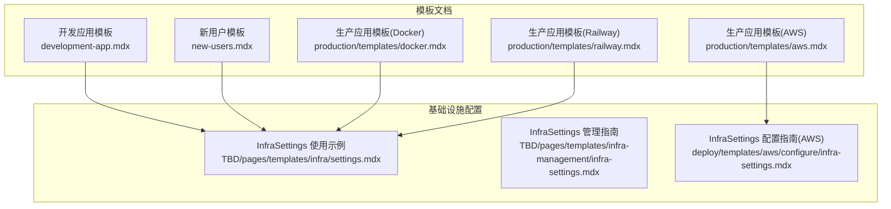
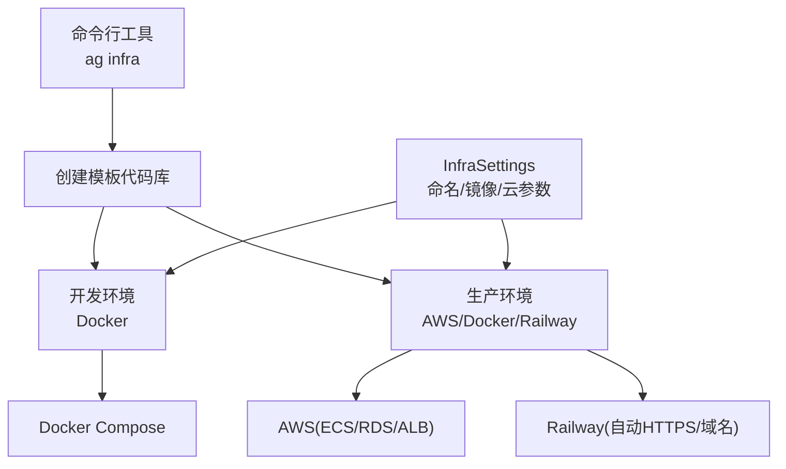
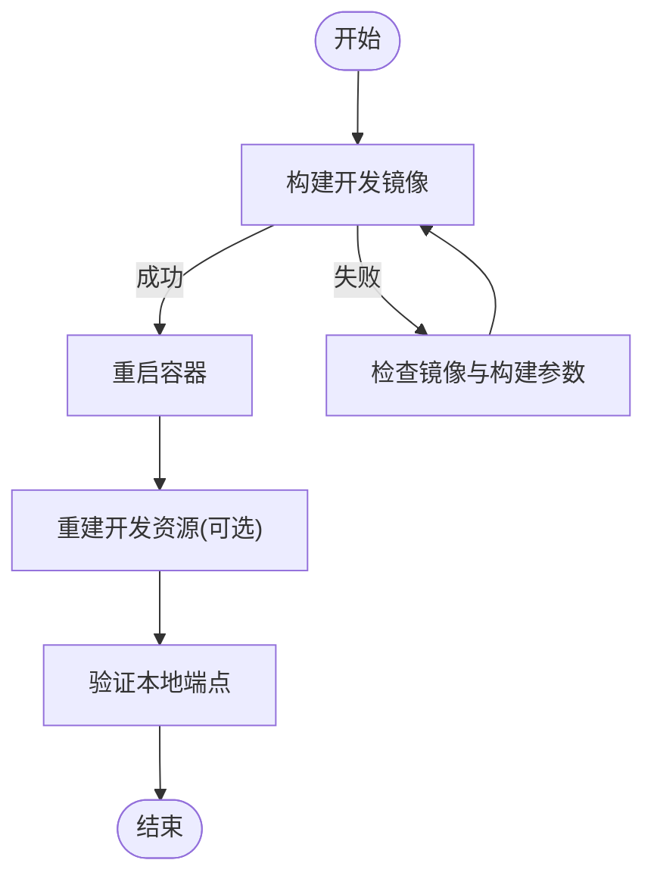
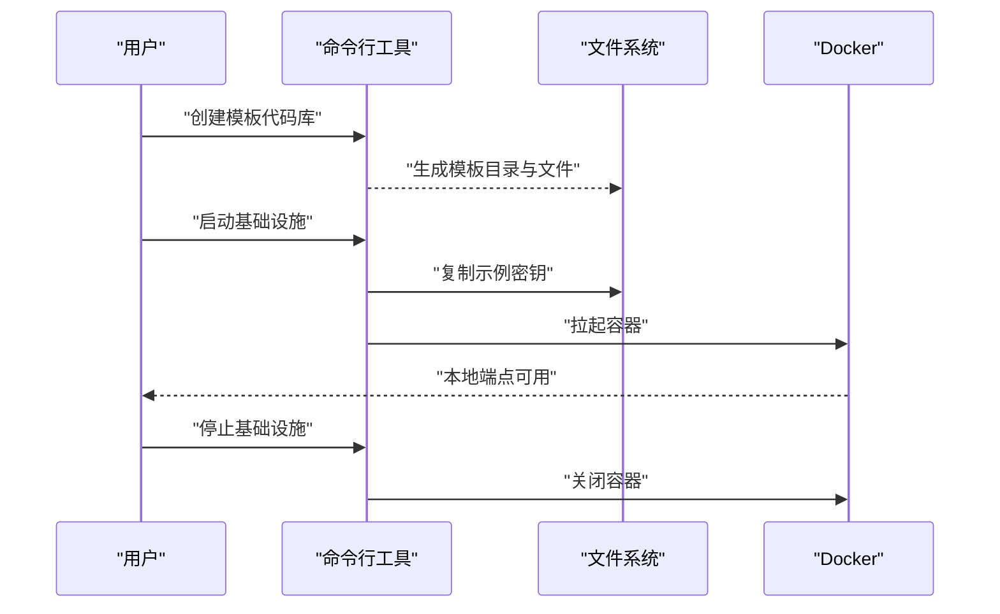
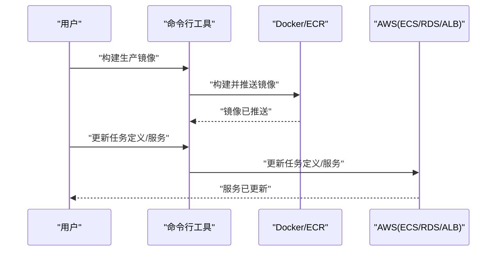
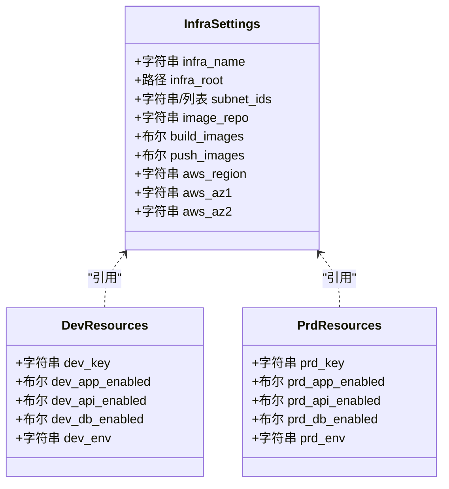
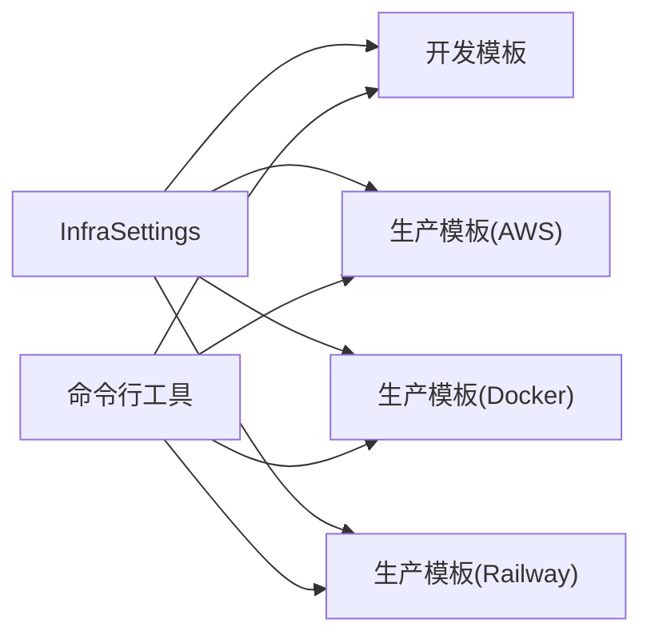

# 模板系统

<cite>
**本文引用的文件**
- [templates/infra-management/development-app.mdx](file://templates/infra-management/development-app.mdx)
- [templates/infra-management/new-users.mdx](file://templates/infra-management/new-users.mdx)
- [templates/infra-management/production-app.mdx](file://templates/infra-management/production-app.mdx)
- [production/templates/aws.mdx](file://production/templates/aws.mdx)
- [production/templates/docker.mdx](file://production/templates/docker.mdx)
- [production/templates/railway.mdx](file://production/templates/railway.mdx)
- [TBD/pages/templates/infra/settings.mdx](file://TBD/pages/templates/infra/settings.mdx)
- [TBD/pages/templates/infra-management/infra-settings.mdx](file://TBD/pages/templates/infra-management/infra-settings.mdx)
- [deploy/templates/aws/configure/infra-settings.mdx](file://deploy/templates/aws/configure/infra-settings.mdx)
- [TBD/pages/deploy/templates.mdx](file://TBD/pages/deploy/templates.mdx)
</cite>

## 目录
1. [简介](#简介)
2. [项目结构](#项目结构)
3. [核心组件](#核心组件)
4. [架构总览](#架构总览)
5. [详细组件分析](#详细组件分析)
6. [依赖关系分析](#依赖关系分析)
7. [性能考量](#性能考量)
8. [故障排查指南](#故障排查指南)
9. [结论](#结论)
10. [附录](#附录)

## 简介
本模板系统围绕“基础设施即代码（IaC）”理念设计，通过统一的命令行工具与可复用模板，实现开发、测试与生产的环境标准化与快速部署。系统提供三类模板：
- 开发应用模板：基于 Docker 的本地开发与调试，支持镜像构建、容器重启与资源重建。
- 新用户模板：面向首次使用者的引导流程，覆盖仓库克隆、虚拟环境、安装、密钥拷贝与启动/停止。
- 生产应用模板：面向 AWS、Docker 与 Railway 的生产部署，涵盖镜像构建、任务定义更新与服务滚动升级。

系统通过集中化的基础设施配置对象（InfraSettings）统一管理命名空间、镜像仓库、构建与推送策略以及云平台参数，确保跨环境一致性与可维护性。

## 项目结构
模板系统由“模板文档”和“基础设施配置”两大维度构成：
- 模板文档：按运行环境与平台划分，提供从安装到部署的完整步骤说明。
- 基础设施配置：以 InfraSettings 为核心，贯穿开发与生产环境的命名、镜像策略与云参数。

图表来源
- [templates/infra-management/development-app.mdx:1-107](file://templates/infra-management/development-app.mdx#L1-L107)
- [templates/infra-management/new-users.mdx:1-125](file://templates/infra-management/new-users.mdx#L1-L125)
- [templates/infra-management/production-app.mdx:1-166](file://templates/infra-management/production-app.mdx#L1-L166)
- [production/templates/aws.mdx:1-210](file://production/templates/aws.mdx#L1-L210)
- [production/templates/docker.mdx:1-164](file://production/templates/docker.mdx#L1-L164)
- [production/templates/railway.mdx:1-182](file://production/templates/railway.mdx#L1-L182)
- [TBD/pages/templates/infra/settings.mdx:1-70](file://TBD/pages/templates/infra/settings.mdx#L1-L70)
- [TBD/pages/templates/infra-management/infra-settings.mdx:1-79](file://TBD/pages/templates/infra-management/infra-settings.mdx#L1-L79)
- [deploy/templates/aws/configure/infra-settings.mdx:1-51](file://deploy/templates/aws/configure/infra-settings.mdx#L1-L51)

章节来源
- [TBD/pages/deploy/templates.mdx:31-94](file://TBD/pages/deploy/templates.mdx#L31-L94)

## 核心组件
- 命令行工具与模板选择
  - 通过命令行创建模板代码库，随后在模板内执行环境启动/停止/重启等操作，实现“一键部署”。
- 基础设施配置对象（InfraSettings）
  - 统一管理命名空间（infra_name）、镜像仓库（image_repo）、构建与推送策略（build_images/push_images）、云区域与子网等。
- 平台特定模板
  - AWS：ECS Fargate + RDS + 负载均衡器，支持镜像推送到 ECR。
  - Docker：本地 Docker Compose，适合开发与轻量级生产。
  - Railway：一键部署至 Railway，自动提供域名与 HTTPS。

章节来源
- [TBD/pages/deploy/templates.mdx:31-94](file://TBD/pages/deploy/templates.mdx#L31-L94)
- [TBD/pages/templates/infra/settings.mdx:1-70](file://TBD/pages/templates/infra/settings.mdx#L1-L70)
- [TBD/pages/templates/infra-management/infra-settings.mdx:1-79](file://TBD/pages/templates/infra-management/infra-settings.mdx#L1-L79)
- [deploy/templates/aws/configure/infra-settings.mdx:1-51](file://deploy/templates/aws/configure/infra-settings.mdx#L1-L51)

## 架构总览
模板系统采用“模板驱动 + 配置中心”的架构：
- 模板层：提供不同平台与环境的完整部署脚本与说明。
- 配置层：以 InfraSettings 为中心，集中管理命名、镜像与云参数。
- 命令层：通过统一 CLI 在不同环境间切换与执行操作。

图表来源
- [production/templates/aws.mdx:1-210](file://production/templates/aws.mdx#L1-L210)
- [production/templates/docker.mdx:1-164](file://production/templates/docker.mdx#L1-L164)
- [production/templates/railway.mdx:1-182](file://production/templates/railway.mdx#L1-L182)
- [TBD/pages/templates/infra/settings.mdx:1-70](file://TBD/pages/templates/infra/settings.mdx#L1-L70)

## 详细组件分析

### 开发应用模板（Docker 本地）
- 设计目标：提供可快速启动的本地开发环境，支持镜像构建、容器重启与资源重建。
- 关键能力
  - 镜像构建：支持强制重建与本地镜像策略。
  - 容器重启：一键重启所有容器。
  - 资源重建：通过强制标志重建开发资源。
- 使用要点
  - 修改镜像仓库与构建策略后，需重新构建镜像并重启容器。
  - 如需强制重建，使用相应命令的强制标志。

图表来源
- [templates/infra-management/development-app.mdx:15-107](file://templates/infra-management/development-app.mdx#L15-L107)

章节来源
- [templates/infra-management/development-app.mdx:1-107](file://templates/infra-management/development-app.mdx#L1-L107)

### 新用户模板（引导与本地启动）
- 设计目标：帮助新用户快速完成环境准备、安装与启动，降低上手门槛。
- 关键步骤
  - 克隆仓库并进入目录。
  - 创建并激活虚拟环境。
  - 安装模板所需的 CLI 与依赖。
  - 复制示例密钥到正式密钥目录。
  - 启动/停止基础设施。
- 最佳实践
  - 使用虚拟环境隔离依赖。
  - 启动前确认 Docker 已安装并可用。
  - 密钥复制后立即进行最小化配置验证。

图表来源
- [templates/infra-management/new-users.mdx:1-125](file://templates/infra-management/new-users.mdx#L1-L125)

章节来源
- [templates/infra-management/new-users.mdx:1-125](file://templates/infra-management/new-users.mdx#L1-L125)

### 生产应用模板（AWS）
- 设计目标：在 AWS 上实现生产级部署，包含 ECS Fargate、RDS PostgreSQL、负载均衡器与密钥管理。
- 关键流程
  - 镜像构建与推送：配置镜像仓库与推送策略，构建并推送到 ECR。
  - 任务定义更新：当镜像或资源配置变更时，更新 ECS 任务定义。
  - 服务滚动升级：仅更新镜像时可直接更新服务以拉取新镜像。
- 安全与合规
  - 使用 AWS Secrets Manager 存储敏感信息。
  - 通过安全组与子网控制网络访问。
- 成本估算
  - 提供典型规格的成本估算，便于预算规划。

图表来源
- [templates/infra-management/production-app.mdx:15-166](file://templates/infra-management/production-app.mdx#L15-L166)
- [production/templates/aws.mdx:88-127](file://production/templates/aws.mdx#L88-L127)

章节来源
- [templates/infra-management/production-app.mdx:1-166](file://templates/infra-management/production-app.mdx#L1-L166)
- [production/templates/aws.mdx:1-210](file://production/templates/aws.mdx#L1-L210)

### 生产应用模板（Docker）
- 设计目标：在任意支持 Docker 的平台上快速部署，适合小型生产或边缘场景。
- 关键流程
  - 本地验证：使用 Docker Compose 启动并验证端点。
  - 连接控制平面：在本地或云环境中连接到控制平面。
- 扩展建议
  - 可结合云厂商的容器服务进行弹性扩缩容。
  - 通过外部负载均衡器实现高可用。

章节来源
- [production/templates/docker.mdx:1-164](file://production/templates/docker.mdx#L1-L164)

### 生产应用模板（Railway）
- 设计目标：零运维一键部署，自动提供 HTTPS 与公共域名。
- 关键流程
  - 从模板创建项目并设置 API 密钥。
  - 登录 Railway 并执行部署脚本。
  - 获取域名并连接控制平面。
- 自定义能力
  - 支持自定义代理、工具与知识库，按需扩展功能。

章节来源
- [production/templates/railway.mdx:1-182](file://production/templates/railway.mdx#L1-L182)

### 基础设施配置（InfraSettings）
- 设计目标：以单一配置对象统一管理命名、镜像与云参数，减少重复与错误。
- 关键字段
  - 命名空间：用于资源命名与镜像标签。
  - 镜像仓库与策略：镜像仓库地址、是否构建与推送。
  - 云参数：区域、可用区与子网 ID。
- 使用方式
  - 可通过配置文件、环境变量或 .env 文件设置。
  - 在资源定义中引用配置对象，实现跨环境一致。

图表来源
- [TBD/pages/templates/infra/settings.mdx:14-63](file://TBD/pages/templates/infra/settings.mdx#L14-L63)
- [TBD/pages/templates/infra-management/infra-settings.mdx:7-79](file://TBD/pages/templates/infra-management/infra-settings.mdx#L7-L79)

章节来源
- [TBD/pages/templates/infra/settings.mdx:1-70](file://TBD/pages/templates/infra/settings.mdx#L1-L70)
- [TBD/pages/templates/infra-management/infra-settings.mdx:1-79](file://TBD/pages/templates/infra-management/infra-settings.mdx#L1-L79)
- [deploy/templates/aws/configure/infra-settings.mdx:1-51](file://deploy/templates/aws/configure/infra-settings.mdx#L1-L51)

## 依赖关系分析
- 模板与配置的耦合
  - 开发与生产模板均依赖 InfraSettings 中的命名与镜像策略，确保资源命名一致与镜像来源可控。
- 模板与平台的耦合
  - AWS 模板依赖 ECS、RDS、ALB 等资源；Railway 模板依赖其平台自动化能力；Docker 模板依赖容器编排。
- 命令行工具与模板的耦合
  - 通过统一 CLI 在不同模板间切换与执行操作，减少学习成本。

图表来源
- [TBD/pages/templates/infra/settings.mdx:1-70](file://TBD/pages/templates/infra/settings.mdx#L1-L70)
- [production/templates/aws.mdx:1-210](file://production/templates/aws.mdx#L1-L210)
- [production/templates/docker.mdx:1-164](file://production/templates/docker.mdx#L1-L164)
- [production/templates/railway.mdx:1-182](file://production/templates/railway.mdx#L1-L182)

章节来源
- [TBD/pages/deploy/templates.mdx:31-94](file://TBD/pages/deploy/templates.mdx#L31-L94)

## 性能考量
- 镜像构建与缓存
  - 合理设置镜像仓库与构建策略，避免不必要的重复构建。
  - 在开发阶段可启用跳过缓存选项以保证一致性。
- 容器与服务规模
  - 根据流量与资源需求调整副本数与实例规格，平衡成本与性能。
- 数据库性能
  - 在生产环境使用托管数据库并合理配置索引与查询计划。

## 故障排查指南
- AWS
  - RDS 不可达：等待实例就绪或检查网络与安全组。
  - ECS 任务失败：查看 CloudWatch 日志，检查环境变量与数据库连接。
  - 负载均衡器返回 503：等待健康检查通过。
- Docker
  - 端口占用：修改 compose 文件中的端口映射。
  - 数据库连接问题：确认数据库容器已启动并就绪。
- Railway
  - 命令不可用：安装 Railway CLI 或添加到 PATH。
  - 部署失败：先初始化项目再执行部署脚本。
  - 数据库超时：等待数据库初始化完成并查看日志。
  - 502 错误：等待容器启动完成并查看日志。

章节来源
- [production/templates/aws.mdx:194-210](file://production/templates/aws.mdx#L194-L210)
- [production/templates/docker.mdx:153-164](file://production/templates/docker.mdx#L153-L164)
- [production/templates/railway.mdx:163-182](file://production/templates/railway.mdx#L163-L182)

## 结论
模板系统通过“基础设施即代码”理念，将开发、测试与生产的环境标准化，并以统一的配置对象与命令行工具降低使用门槛。借助多平台模板与完善的故障排查指南，团队可以高效地完成从本地开发到生产部署的全流程，同时保持配置的一致性与可维护性。

## 附录
- 快速开始
  - 安装 CLI 与依赖后，使用模板创建命令生成代码库，再根据模板文档执行启动/停止/重启等操作。
- 版本管理与更新
  - 通过模板仓库的版本标签或分支管理更新；在生产环境更新前先在开发环境验证。
- 定制与扩展
  - 修改 InfraSettings 中的命名与镜像策略，按需扩展平台模板与资源定义。