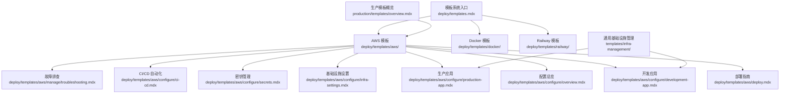
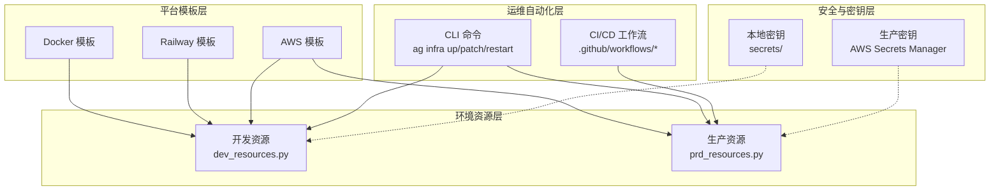
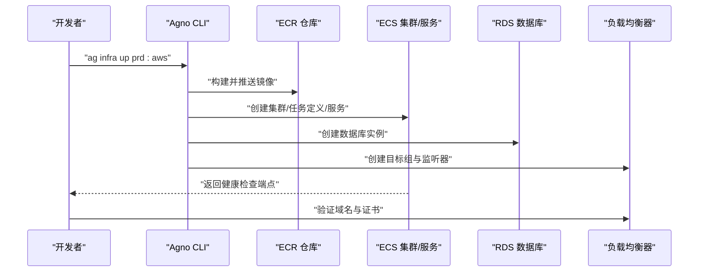
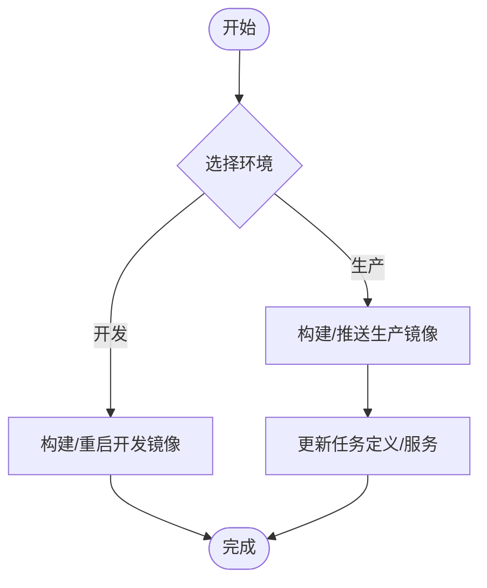
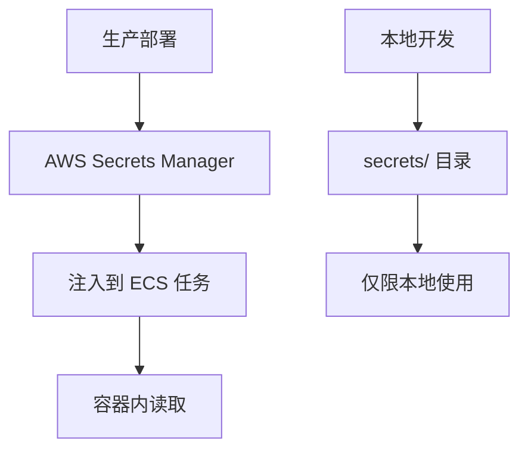
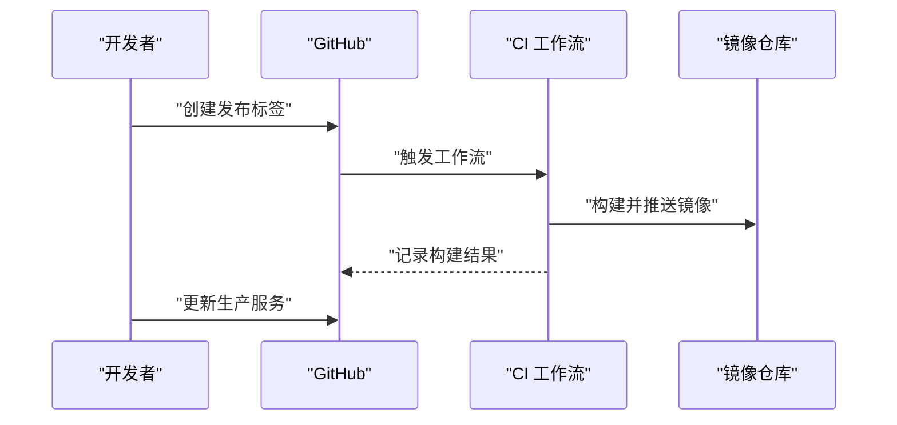
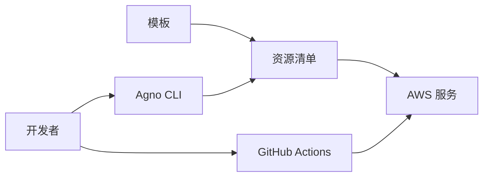

# 模板系统概述

<cite>
**本文档引用的文件**
- [deploy/templates.mdx](file://deploy/templates.mdx)
- [TBD/pages/deploy/templates.mdx](file://TBD/pages/deploy/templates.mdx)
- [deploy/templates/aws/deploy.mdx](file://deploy/templates/aws/deploy.mdx)
- [deploy/templates/aws/configure/overview.mdx](file://deploy/templates/aws/configure/overview.mdx)
- [deploy/templates/aws/configure/infra-settings.mdx](file://deploy/templates/aws/configure/infra-settings.mdx)
- [deploy/templates/aws/configure/development-app.mdx](file://deploy/templates/aws/configure/development-app.mdx)
- [deploy/templates/aws/configure/production-app.mdx](file://deploy/templates/aws/configure/production-app.mdx)
- [deploy/templates/aws/configure/secrets.mdx](file://deploy/templates/aws/configure/secrets.mdx)
- [deploy/templates/aws/configure/ci-cd.mdx](file://deploy/templates/aws/configure/ci-cd.mdx)
- [deploy/templates/aws/manage/troubleshooting.mdx](file://deploy/templates/aws/manage/troubleshooting.mdx)
- [production/templates/overview.mdx](file://production/templates/overview.mdx)
- [templates/infra-management/development-app.mdx](file://templates/infra-management/development-app.mdx)
- [templates/infra-management/production-app.mdx](file://templates/infra-management/production-app.mdx)
</cite>

## 目录
1. [引言](#引言)
2. [项目结构](#项目结构)
3. [核心组件](#核心组件)
4. [架构总览](#架构总览)
5. [详细组件分析](#详细组件分析)
6. [依赖关系分析](#依赖关系分析)
7. [性能考虑](#性能考虑)
8. [故障排查指南](#故障排查指南)
9. [结论](#结论)
10. [附录](#附录)

## 引言
模板系统是 Agno 框架中用于“基础设施即代码（IaC）”与“环境标准化”的关键能力，旨在通过可复用、可迭代的代码基，帮助团队在本地开发、测试与生产环境中实现一致的配置与部署流程。模板系统强调：
- 基础设施即代码：以代码定义资源与环境，确保可重复、可审计、可回滚。
- 环境标准化：统一开发、测试与生产的配置与工具链，降低环境漂移带来的风险。
- 快速部署：提供开箱即用的部署脚本与平台适配，加速从零到一的上线过程。

在 Agno 框架中，模板系统贯穿“空白画布”与“预置方案”，覆盖 Docker、Railway、AWS 等多种运行平台，并提供 CI/CD 自动化、密钥管理、数据库迁移与监控等运维能力，显著降低开发与运维门槛。

## 项目结构
模板系统主要分布在以下路径：
- deploy/templates：面向部署的模板与指南，包含 AWS、Docker、Railway 等平台模板及子主题（如配置、部署、运维）。
- production/templates：生产环境模板概览与选择指南。
- templates/infra-management：跨平台的基础设施管理通用指南（开发应用、生产应用）。

**图表来源**
- [deploy/templates.mdx:1-48](file://deploy/templates.mdx#L1-L48)
- [deploy/templates/aws/deploy.mdx:1-370](file://deploy/templates/aws/deploy.mdx#L1-L370)
- [deploy/templates/aws/configure/overview.mdx:1-75](file://deploy/templates/aws/configure/overview.mdx#L1-L75)
- [deploy/templates/aws/configure/infra-settings.mdx:1-80](file://deploy/templates/aws/configure/infra-settings.mdx#L1-L80)
- [deploy/templates/aws/configure/development-app.mdx:1-107](file://deploy/templates/aws/configure/development-app.mdx#L1-L107)
- [deploy/templates/aws/configure/production-app.mdx:1-166](file://deploy/templates/aws/configure/production-app.mdx#L1-L166)
- [deploy/templates/aws/configure/secrets.mdx:108-154](file://deploy/templates/aws/configure/secrets.mdx#L108-L154)
- [deploy/templates/aws/configure/ci-cd.mdx:1-200](file://deploy/templates/aws/configure/ci-cd.mdx#L1-L200)
- [deploy/templates/aws/manage/troubleshooting.mdx:1-209](file://deploy/templates/aws/manage/troubleshooting.mdx#L1-L209)
- [production/templates/overview.mdx:1-29](file://production/templates/overview.mdx#L1-L29)
- [templates/infra-management/development-app.mdx:1-107](file://templates/infra-management/development-app.mdx#L1-L107)
- [templates/infra-management/production-app.mdx:1-166](file://templates/infra-management/production-app.mdx#L1-L166)

**章节来源**
- [deploy/templates.mdx:1-48](file://deploy/templates.mdx#L1-L48)
- [production/templates/overview.mdx:1-29](file://production/templates/overview.mdx#L1-L29)
- [TBD/pages/deploy/templates.mdx:1-95](file://TBD/pages/deploy/templates.mdx#L1-L95)

## 核心组件
- 模板分类与定位
  - 空白画布：提供最小可用 AgentOS 实例，支持本地 Docker 运行与云平台部署（如 AWS、Railway）。
  - 预置方案：内置常见应用（如 Dash、Scout、Gcode），开箱即用，适合快速验证与演示。
- 平台适配
  - Docker：适用于本地开发与自托管，部署简单、成本低。
  - Railway：快速生产部署，无需管理基础设施。
  - AWS：企业级生产部署，具备高可用、安全与可观测性能力。
- 环境生命周期
  - 开发环境：以 Docker 为主，便于迭代与调试。
  - 生产环境：以云平台为主，结合 ECS、RDS、负载均衡等基础设施。
- 关键能力
  - 基础设施即代码：通过资源定义文件与 CLI 命令完成资源编排。
  - 环境标准化：统一的依赖、格式化、校验与 CI/CD 流程。
  - 安全与密钥管理：本地使用 Git 忽略目录，生产使用 AWS Secrets Manager。
  - 数据库迁移：开发使用本地数据库，生产使用 RDS 并支持启动时迁移。
  - CI/CD 自动化：预置 GitHub Actions 工作流，支持 DockerHub 与 ECR 推送。

**章节来源**
- [deploy/templates.mdx:6-48](file://deploy/templates.mdx#L6-L48)
- [TBD/pages/deploy/templates.mdx:6-30](file://TBD/pages/deploy/templates.mdx#L6-L30)
- [production/templates/overview.mdx:6-29](file://production/templates/overview.mdx#L6-L29)

## 架构总览
模板系统采用“平台模板 + 环境资源 + 运维自动化”的分层架构：
- 平台模板层：按平台划分（Docker、Railway、AWS），提供统一的部署与配置接口。
- 环境资源层：分别定义开发与生产环境的资源清单（如镜像、容器、数据库、网络与安全组）。
- 运维自动化层：通过 CLI 命令与 CI/CD 工作流实现构建、推送、部署与更新。
- 安全与密钥层：本地密钥与生产密钥分离，生产密钥集中存储于 AWS Secrets Manager。

**图表来源**
- [deploy/templates/aws/deploy.mdx:102-258](file://deploy/templates/aws/deploy.mdx#L102-L258)
- [deploy/templates/aws/configure/development-app.mdx:15-106](file://deploy/templates/aws/configure/development-app.mdx#L15-L106)
- [deploy/templates/aws/configure/production-app.mdx:15-165](file://deploy/templates/aws/configure/production-app.mdx#L15-L165)
- [deploy/templates/aws/configure/secrets.mdx:108-154](file://deploy/templates/aws/configure/secrets.mdx#L108-L154)
- [deploy/templates/aws/configure/ci-cd.mdx:32-199](file://deploy/templates/aws/configure/ci-cd.mdx#L32-L199)

## 详细组件分析

### 组件 A：AWS 模板与部署流程
- 设计理念
  - 以 ECS Fargate + RDS PostgreSQL + 负载均衡为核心，提供生产级可靠性与扩展性。
  - 通过 CLI 一键完成镜像构建、推送与资源编排，缩短部署时间。
- 关键流程
  - AWS 准备：创建 ECR 仓库、认证 Docker、获取子网 ID。
  - 配置：编辑基础设施设置与密钥文件。
  - 本地测试：使用 Docker 验证应用健康。
  - 生产部署：通过 CLI 创建 ECS、RDS、LB 等资源。
  - 验证与连接：检查健康状态与端点连通性。
- 最佳实践
  - 使用专用子网与安全组隔离网络访问。
  - 将 API 密钥与数据库凭据分离存储，降低泄露风险。
  - 在 CI/CD 中启用 OIDC 认证，避免长期凭证存储。

**图表来源**
- [deploy/templates/aws/deploy.mdx:104-294](file://deploy/templates/aws/deploy.mdx#L104-L294)
- [deploy/templates/aws/configure/secrets.mdx:108-154](file://deploy/templates/aws/configure/secrets.mdx#L108-L154)

**章节来源**
- [deploy/templates/aws/deploy.mdx:18-370](file://deploy/templates/aws/deploy.mdx#L18-L370)
- [deploy/templates/aws/configure/overview.mdx:17-75](file://deploy/templates/aws/configure/overview.mdx#L17-L75)

### 组件 B：开发与生产应用管理
- 开发应用（Docker）
  - 通过 settings.py 配置镜像仓库与构建参数，支持强制重建与重启容器。
  - 适用于本地迭代与联调，便于快速反馈。
- 生产应用（AWS）
  - 支持 ECR 认证与镜像推送，更新 ECS 任务定义与服务以触发滚动更新。
  - 可单独仅重建镜像后直接更新服务，减少停机时间。

**图表来源**
- [deploy/templates/aws/configure/development-app.mdx:15-106](file://deploy/templates/aws/configure/development-app.mdx#L15-L106)
- [deploy/templates/aws/configure/production-app.mdx:15-165](file://deploy/templates/aws/configure/production-app.mdx#L15-L165)

**章节来源**
- [templates/infra-management/development-app.mdx:1-107](file://templates/infra-management/development-app.mdx#L1-L107)
- [templates/infra-management/production-app.mdx:1-166](file://templates/infra-management/production-app.mdx#L1-L166)

### 组件 C：密钥与安全配置
- 本地密钥
  - 使用 Git 忽略的 secrets/ 目录存放开发密钥，避免误提交。
- 生产密钥
  - 使用 AWS Secrets Manager 分离 API 密钥与数据库凭据，支持独立轮换。
- 最佳实践
  - 将密钥注入到 ECS 任务或容器环境变量中。
  - 定期轮换密钥并验证其在生产中的可用性。

**图表来源**
- [deploy/templates/aws/configure/secrets.mdx:108-154](file://deploy/templates/aws/configure/secrets.mdx#L108-L154)

**章节来源**
- [deploy/templates/aws/configure/secrets.mdx:108-154](file://deploy/templates/aws/configure/secrets.mdx#L108-L154)

### 组件 D：CI/CD 自动化与版本管理
- 自动化流水线
  - PR 验证：格式化、类型检查与测试自动执行。
  - 发布构建：支持 DockerHub 与 ECR 推送，生成 dev/prd 标签。
  - OIDC 认证：使用 GitHub Actions OIDC 替代长期凭证，提升安全性。
- 版本管理策略
  - 通过发布标签驱动镜像版本，配合服务更新实现灰度与回滚。
  - 建议采用语义化版本命名规范，结合 CI/CD 自动化打标。

**图表来源**
- [deploy/templates/aws/configure/ci-cd.mdx:32-199](file://deploy/templates/aws/configure/ci-cd.mdx#L32-L199)

**章节来源**
- [deploy/templates/aws/configure/ci-cd.mdx:1-200](file://deploy/templates/aws/configure/ci-cd.mdx#L1-L200)

## 依赖关系分析
- 组件耦合
  - 平台模板与环境资源强耦合：模板决定资源清单结构，资源清单决定部署行为。
  - CLI 与 CI/CD 解耦：CLI 用于本地与一次性部署，CI/CD 用于持续交付。
- 外部依赖
  - AWS CLI、Docker、uv（包管理器）、GitHub Actions。
  - AWS 服务：ECR、ECS、RDS、Secrets Manager、CloudWatch Logs。
- 循环依赖
  - 模板系统未见循环导入或循环依赖；资源定义遵循单向依赖（模板 → 资源 → 云服务）。

**图表来源**
- [deploy/templates/aws/deploy.mdx:102-258](file://deploy/templates/aws/deploy.mdx#L102-L258)
- [deploy/templates/aws/configure/ci-cd.mdx:32-199](file://deploy/templates/aws/configure/ci-cd.mdx#L32-L199)

**章节来源**
- [deploy/templates/aws/deploy.mdx:102-258](file://deploy/templates/aws/deploy.mdx#L102-L258)
- [deploy/templates/aws/configure/ci-cd.mdx:32-199](file://deploy/templates/aws/configure/ci-cd.mdx#L32-L199)

## 性能考虑
- 镜像体积与构建时间
  - 控制依赖数量与层级，优先使用多阶段构建减少最终镜像大小。
  - 在 CI/CD 中缓存依赖层，缩短构建时间。
- 数据库性能
  - 生产使用 RDS 并开启只读副本与连接池优化。
  - 避免在容器中使用需要单写访问的数据库（如 DuckDB）时增加工作进程数。
- 网络与负载均衡
  - 合理配置子网与安全组，避免跨可用区网络延迟。
  - 使用健康检查与弹性伸缩策略提升可用性。

[本节为通用指导，不直接分析具体文件]

## 故障排查指南
- 常见问题与解决步骤
  - ECS 健康检查失败：检查容器日志与启动顺序，确认数据库连接与环境变量。
  - “无基本身份验证凭据”错误：重新认证 ECR 或使用 OIDC 角色。
  - 数据库连接失败：检查密码特殊字符与安全组放通规则。
  - EFS 挂载失败：确认挂载目标与子网匹配、权限点 UID/GID 设置正确。
- 调试命令
  - 查看 ECS 事件、最近日志与任务状态，定位异常原因。
  - 使用本地 Docker 与 ECS 执行命令进行交互式调试。

**章节来源**
- [deploy/templates/aws/manage/troubleshooting.mdx:11-209](file://deploy/templates/aws/manage/troubleshooting.mdx#L11-L209)

## 结论
模板系统通过“平台模板 + 环境资源 + 运维自动化”的分层设计，实现了从开发到生产的标准化与自动化。它不仅降低了部署复杂度，还通过密钥管理、CI/CD 与故障排查机制提升了安全性与可维护性。建议团队根据自身需求选择合适的模板与平台，并结合 CI/CD 与监控体系，持续演进模板以满足业务增长。

[本节为总结性内容，不直接分析具体文件]

## 附录
- 使用场景与最佳实践
  - 快速原型：使用 Docker 模板进行本地验证与演示。
  - MVP 上线：使用 Railway 模板快速发布，后续迁移至 AWS。
  - 生产部署：使用 AWS 模板，结合 ECS、RDS、Secrets Manager 与 OIDC CI/CD。
- 版本管理与更新机制
  - 通过发布标签驱动镜像版本，配合服务更新实现平滑升级与回滚。
  - 在 CI/CD 中启用 PR 验证与发布构建，确保质量与一致性。

**章节来源**
- [deploy/templates.mdx:42-48](file://deploy/templates.mdx#L42-L48)
- [production/templates/overview.mdx:22-29](file://production/templates/overview.mdx#L22-L29)
- [deploy/templates/aws/configure/ci-cd.mdx:183-200](file://deploy/templates/aws/configure/ci-cd.mdx#L183-L200)