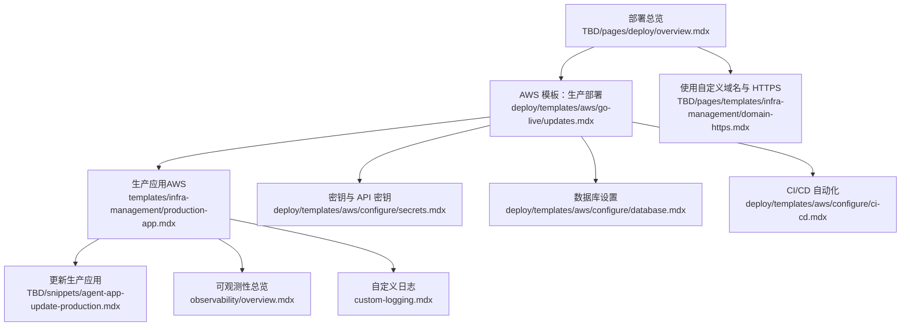
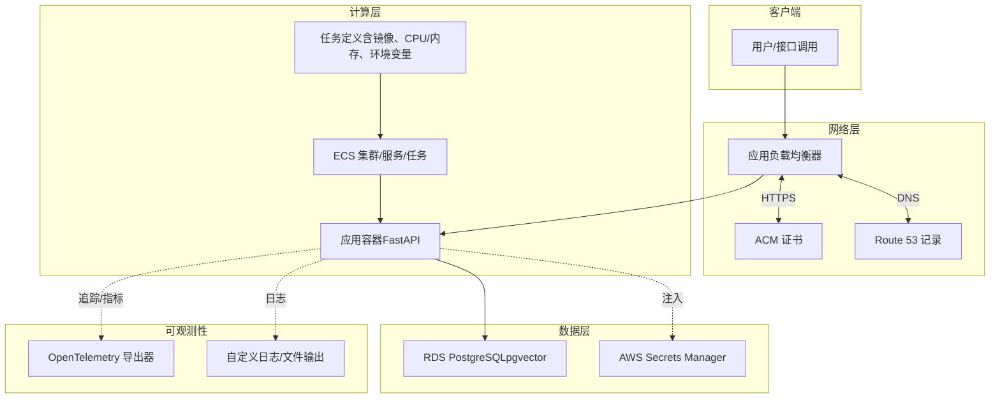
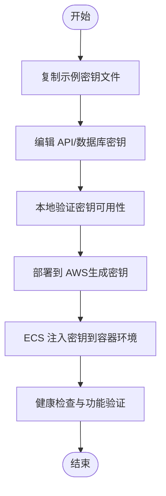
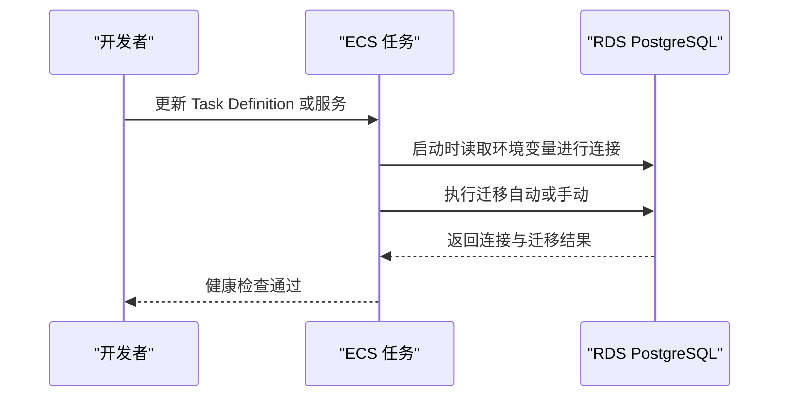
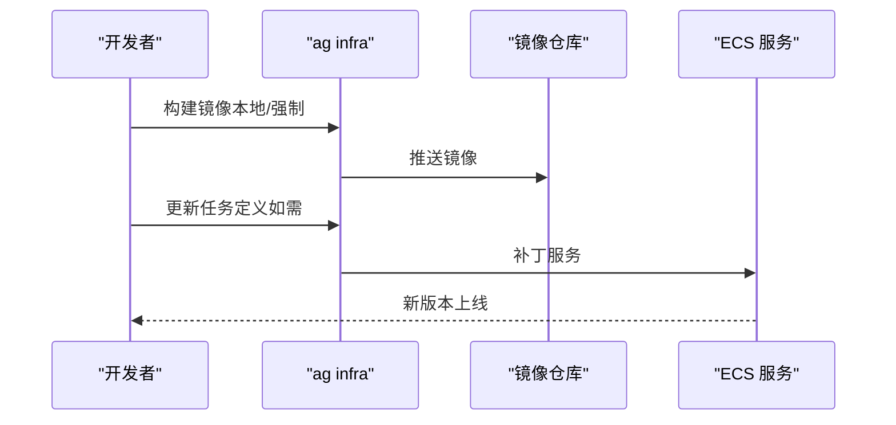
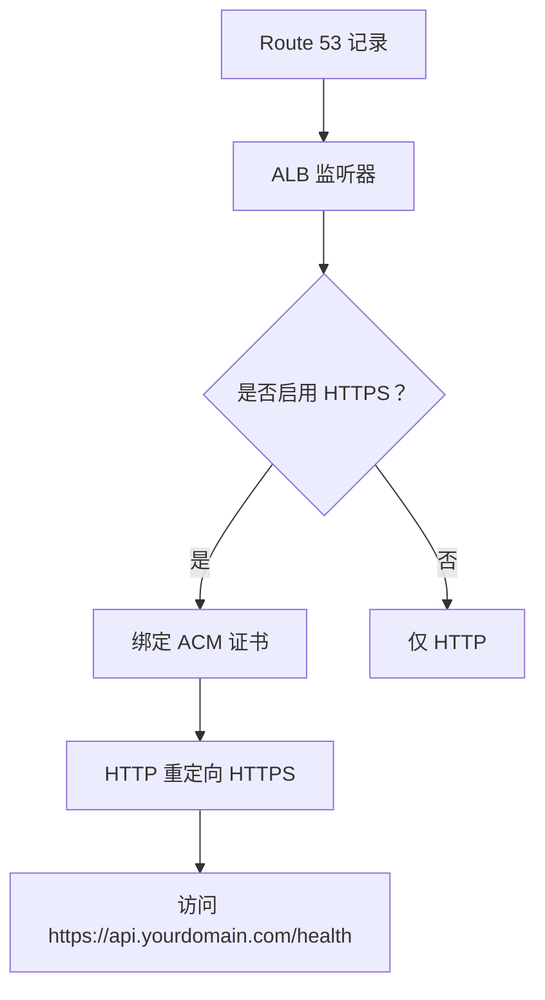
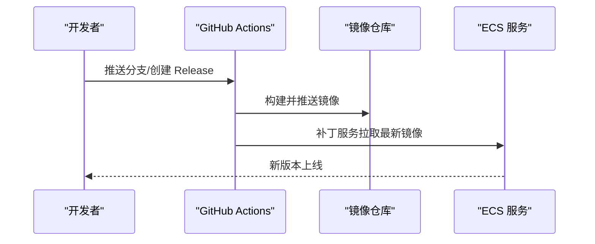
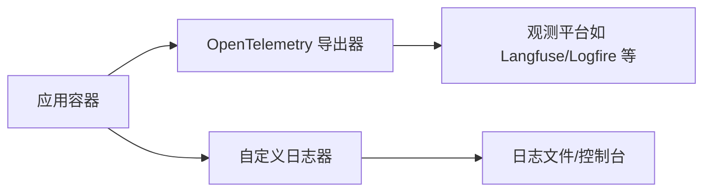
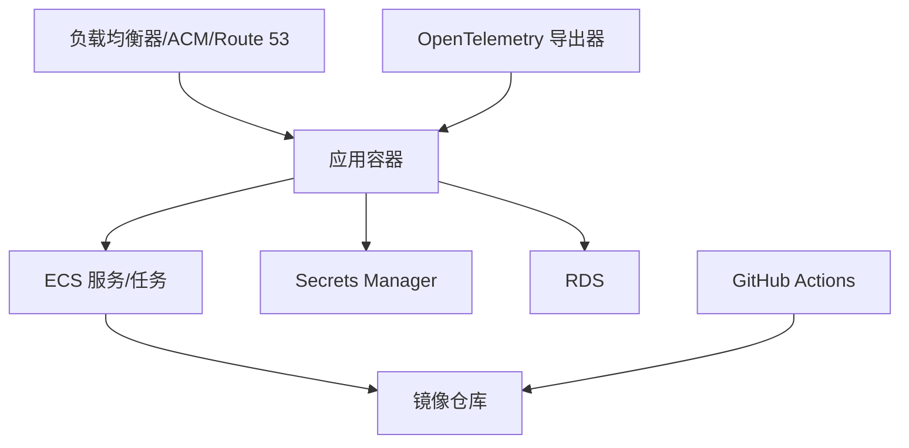

# 生产应用模板

<cite>
**本文引用的文件**
- [生产应用（AWS）](file://templates/infra-management/production-app.mdx)
- [AWS 模板：生产部署](file://deploy/templates/aws/go-live/updates.mdx)
- [AWS 模板：密钥与 API 密钥](file://deploy/templates/aws/configure/secrets.mdx)
- [AWS 模板：数据库设置](file://deploy/templates/aws/configure/database.mdx)
- [AWS 模板：CI/CD 自动化](file://deploy/templates/aws/configure/ci-cd.mdx)
- [自定义日志](file://custom-logging.mdx)
- [可观测性总览](file://observability/overview.mdx)
- [使用自定义域名与 HTTPS](file://TBD/pages/templates/infra-management/domain-https.mdx)
- [部署总览](file://TBD/pages/deploy/overview.mdx)
- [更新生产应用](file://TBD/snippets/agent-app-update-production.mdx)
</cite>

## 目录
1. [简介](#简介)
2. [项目结构](#项目结构)
3. [核心组件](#核心组件)
4. [架构总览](#架构总览)
5. [组件详解](#组件详解)
6. [依赖关系分析](#依赖关系分析)
7. [性能与稳定性考量](#性能与稳定性考量)
8. [运维指南](#运维指南)
9. [结论](#结论)
10. [附录](#附录)

## 简介
本文件面向在生产环境中运行 AgentOS 应用的工程团队，系统化阐述“生产应用模板”的设计理念与落地方法。该模板以 AWS 为典型生产平台，强调安全性、稳定性与可运维性，并提供从环境准备、镜像构建、服务部署、密钥与数据库管理、HTTPS 与域名、CI/CD 自动化，到监控与日志的完整流程。同时给出与开发/测试环境的差异与迁移策略，以及最佳实践与安全建议。

## 项目结构
围绕生产应用模板，仓库中与部署密切相关的文档主要分布在以下路径：
- 部署模板与指南：deploy/templates/aws/*
- 生产应用管理：templates/infra-management/production-app.mdx
- 观测性与日志：observability/*、custom-logging.mdx
- 域名与 HTTPS：TBD/pages/templates/infra-management/domain-https.mdx
- 部署总览与平台选择：TBD/pages/deploy/overview.mdx
- 更新生产应用：TBD/snippets/agent-app-update-production.mdx

**图表来源**
- [部署总览:80-142](file://TBD/pages/deploy/overview.mdx#L80-L142)
- [AWS 模板：生产部署:17-51](file://deploy/templates/aws/go-live/updates.mdx#L17-L51)
- [生产应用（AWS）:1-166](file://templates/infra-management/production-app.mdx#L1-L166)
- [AWS 模板：密钥与 API 密钥:1-180](file://deploy/templates/aws/configure/secrets.mdx#L1-L180)
- [AWS 模板：数据库设置:1-168](file://deploy/templates/aws/configure/database.mdx#L1-L168)
- [AWS 模板：CI/CD 自动化:1-200](file://deploy/templates/aws/configure/ci-cd.mdx#L1-L200)
- [使用自定义域名与 HTTPS:1-89](file://TBD/pages/templates/infra-management/domain-https.mdx#L1-L89)
- [可观测性总览:1-25](file://observability/overview.mdx#L1-L25)
- [自定义日志:1-193](file://custom-logging.mdx#L1-L193)
- [更新生产应用:1-6](file://TBD/snippets/agent-app-update-production.mdx#L1-L6)

**章节来源**
- [部署总览:80-142](file://TBD/pages/deploy/overview.mdx#L80-L142)
- [AWS 模板：生产部署:17-51](file://deploy/templates/aws/go-live/updates.mdx#L17-L51)
- [生产应用（AWS）:1-166](file://templates/infra-management/production-app.mdx#L1-L166)
- [AWS 模板：密钥与 API 密钥:1-180](file://deploy/templates/aws/configure/secrets.mdx#L1-L180)
- [AWS 模板：数据库设置:1-168](file://deploy/templates/aws/configure/database.mdx#L1-L168)
- [AWS 模板：CI/CD 自动化:1-200](file://deploy/templates/aws/configure/ci-cd.mdx#L1-L200)
- [使用自定义域名与 HTTPS:1-89](file://TBD/pages/templates/infra-management/domain-https.mdx#L1-L89)
- [可观测性总览:1-25](file://observability/overview.mdx#L1-L25)
- [自定义日志:1-193](file://custom-logging.mdx#L1-L193)
- [更新生产应用:1-6](file://TBD/snippets/agent-app-update-production.mdx#L1-L6)

## 核心组件
- 安全配置
  - 密钥与 API 密钥：本地示例文件复制、验证、同步至 AWS Secrets Manager；生产环境通过 ECS 注入。
  - 数据库凭据：独立密钥分组，避免交叉影响；密码字符限制，避免无声连接失败。
- 数据库与迁移
  - RDS PostgreSQL 实例自动创建；支持启动时迁移或 ECS Exec 手动迁移。
- 镜像与部署
  - 使用 ECR/DockerHub 存储镜像；通过 ECS Fargate 运行；Task Definition 与 Service 更新实现滚动发布。
- 网络与 HTTPS
  - 负载均衡器 + ACM 证书；Route 53 域名解析；HTTP 自动重定向 HTTPS。
- CI/CD 自动化
  - GitHub Actions：PR 验证、格式/类型/测试；发布触发镜像构建与推送；OIDC 无长期凭证。
- 观测性与日志
  - OpenTelemetry 支持；多后端兼容；自定义日志器与命名日志器；文件/控制台输出；工作流调试模式。
- 运维与变更
  - 镜像重建、Task Definition 更新、Service 重启；健康检查与负载均衡目标健康状态核验。

**章节来源**
- [AWS 模板：密钥与 API 密钥:1-180](file://deploy/templates/aws/configure/secrets.mdx#L1-L180)
- [AWS 模板：数据库设置:1-168](file://deploy/templates/aws/configure/database.mdx#L1-L168)
- [生产应用（AWS）:1-166](file://templates/infra-management/production-app.mdx#L1-L166)
- [使用自定义域名与 HTTPS:1-89](file://TBD/pages/templates/infra-management/domain-https.mdx#L1-L89)
- [AWS 模板：CI/CD 自动化:1-200](file://deploy/templates/aws/configure/ci-cd.mdx#L1-L200)
- [可观测性总览:1-25](file://observability/overview.mdx#L1-L25)
- [自定义日志:1-193](file://custom-logging.mdx#L1-L193)

## 架构总览
下图展示生产应用模板在 AWS 上的整体架构与关键交互：

**图表来源**
- [AWS 模板：生产部署:17-51](file://deploy/templates/aws/go-live/updates.mdx#L17-L51)
- [生产应用（AWS）:1-166](file://templates/infra-management/production-app.mdx#L1-L166)
- [AWS 模板：密钥与 API 密钥:108-128](file://deploy/templates/aws/configure/secrets.mdx#L108-L128)
- [AWS 模板：数据库设置:10-16](file://deploy/templates/aws/configure/database.mdx#L10-L16)
- [使用自定义域名与 HTTPS:25-89](file://TBD/pages/templates/infra-management/domain-https.mdx#L25-L89)
- [可观测性总览:14-23](file://observability/overview.mdx#L14-L23)
- [自定义日志:12-193](file://custom-logging.mdx#L12-L193)

## 组件详解

### 安全配置与密钥管理
- 本地密钥文件：复制示例文件，编辑 API 密钥与数据库凭据；部署前进行连通性验证。
- 生产注入：通过 AWS Secrets Manager 将密钥注入 ECS 任务；独立存放 API 与数据库密钥，便于轮换。
- 故障排查：密钥不存在、数据库静默连接失败、生产 API 密钥不生效等问题的定位与修复步骤。

**图表来源**
- [AWS 模板：密钥与 API 密钥:10-82](file://deploy/templates/aws/configure/secrets.mdx#L10-L82)
- [AWS 模板：密钥与 API 密钥:108-128](file://deploy/templates/aws/configure/secrets.mdx#L108-L128)
- [AWS 模板：密钥与 API 密钥:162-178](file://deploy/templates/aws/configure/secrets.mdx#L162-L178)

**章节来源**
- [AWS 模板：密钥与 API 密钥:1-180](file://deploy/templates/aws/configure/secrets.mdx#L1-L180)

### 数据库与迁移
- 默认使用 RDS PostgreSQL，支持引擎版本、实例规格、存储容量等定制。
- 迁移策略：启动时自动迁移或通过 ECS Exec 执行迁移命令；连接参数由资源文件自动注入。
- 连接验证：获取 RDS 终端节点、使用 psql 测试连接；常见问题定位。

**图表来源**
- [AWS 模板：数据库设置:101-168](file://deploy/templates/aws/configure/database.mdx#L101-L168)

**章节来源**
- [AWS 模板：数据库设置:1-168](file://deploy/templates/aws/configure/database.mdx#L1-L168)

### 镜像构建与部署
- 镜像仓库：ECR 或 DockerHub；认证与推送；强制重建镜像。
- ECS 更新：仅更新镜像时可直接补丁服务；若涉及 CPU/内存/环境变量需先更新任务定义再补丁服务。
- 发布流程：ag infra up / patch 命令驱动资源变更与滚动更新。

**图表来源**
- [生产应用（AWS）:83-157](file://templates/infra-management/production-app.mdx#L83-L157)

**章节来源**
- [生产应用（AWS）:1-166](file://templates/infra-management/production-app.mdx#L1-L166)

### 网络与 HTTPS
- 自定义域名：Route 53 记录指向负载均衡器。
- HTTPS：ACM 申请证书（通配符），在负载均衡器监听器中启用 HTTPS 并重定向 HTTP 到 HTTPS。
- 验证：健康检查返回状态正常、CloudWatch 日志显示启动完成、负载均衡器目标健康。

**图表来源**
- [使用自定义域名与 HTTPS:25-89](file://TBD/pages/templates/infra-management/domain-https.mdx#L25-L89)
- [AWS 模板：生产部署:84-92](file://deploy/templates/aws/go-live/updates.mdx#L84-L92)

**章节来源**
- [使用自定义域名与 HTTPS:1-89](file://TBD/pages/templates/infra-management/domain-https.mdx#L1-L89)
- [AWS 模板：生产部署:84-92](file://deploy/templates/aws/go-live/updates.mdx#L84-L92)

### CI/CD 自动化
- PR 验证：格式、测试、类型检查自动化。
- 镜像构建与推送：DockerHub 或 ECR；GitHub OIDC 无需长期凭证。
- 发布触发：Release 或手动触发；构建完成后补丁 ECS 服务完成上线。

**图表来源**
- [AWS 模板：CI/CD 自动化:30-200](file://deploy/templates/aws/configure/ci-cd.mdx#L30-L200)

**章节来源**
- [AWS 模板：CI/CD 自动化:1-200](file://deploy/templates/aws/configure/ci-cd.mdx#L1-L200)

### 观测性与日志
- OpenTelemetry：自动注入、灵活导出到多种后端；支持 Arize Phoenix、Langfuse、Langsmith、Logfire、Weave 等。
- 自定义日志：文件输出、控制台输出、命名日志器；按组件（Agent/Team/Workflow）分别配置；工作流调试模式开启后输出更详细日志。
- 建议：生产环境统一接入集中式日志与追踪平台，结合告警策略。

**图表来源**
- [可观测性总览:14-23](file://observability/overview.mdx#L14-L23)
- [自定义日志:12-193](file://custom-logging.mdx#L12-L193)

**章节来源**
- [可观测性总览:1-25](file://observability/overview.mdx#L1-L25)
- [自定义日志:1-193](file://custom-logging.mdx#L1-L193)

## 依赖关系分析
- 组件耦合
  - 应用容器依赖 ECS 任务定义与服务；任务定义依赖镜像仓库与密钥注入。
  - 数据库连接依赖 RDS 与 Secrets Manager；迁移脚本依赖容器内环境变量。
  - 网络访问依赖负载均衡器、ACM 证书与 Route 53。
  - CI/CD 依赖 GitHub Actions 工作流与镜像仓库。
- 外部依赖
  - AWS 服务：ECS、ECR、RDS、Secrets Manager、ACM、Route 53、CloudWatch。
  - 观测平台：OpenTelemetry 兼容后端（可选）。

**图表来源**
- [生产应用（AWS）:127-157](file://templates/infra-management/production-app.mdx#L127-L157)
- [AWS 模板：密钥与 API 密钥:108-128](file://deploy/templates/aws/configure/secrets.mdx#L108-L128)
- [AWS 模板：数据库设置:101-168](file://deploy/templates/aws/configure/database.mdx#L101-L168)
- [使用自定义域名与 HTTPS:25-89](file://TBD/pages/templates/infra-management/domain-https.mdx#L25-L89)
- [AWS 模板：CI/CD 自动化:30-200](file://deploy/templates/aws/configure/ci-cd.mdx#L30-L200)
- [可观测性总览:14-23](file://observability/overview.mdx#L14-L23)

**章节来源**
- [生产应用（AWS）:1-166](file://templates/infra-management/production-app.mdx#L1-L166)
- [AWS 模板：密钥与 API 密钥:1-180](file://deploy/templates/aws/configure/secrets.mdx#L1-L180)
- [AWS 模板：数据库设置:1-168](file://deploy/templates/aws/configure/database.mdx#L1-L168)
- [使用自定义域名与 HTTPS:1-89](file://TBD/pages/templates/infra-management/domain-https.mdx#L1-L89)
- [AWS 模板：CI/CD 自动化:1-200](file://deploy/templates/aws/configure/ci-cd.mdx#L1-L200)
- [可观测性总览:1-25](file://observability/overview.mdx#L1-L25)

## 性能与稳定性考量
- 资源分配
  - CPU/内存：根据峰值并发与模型推理需求评估；逐步扩容并观察延迟与错误率。
  - 存储：RDS 存储容量与 IOPS 根据写入量与查询复杂度调整；开启自动扩容以应对突发。
- 网络配置
  - 负载均衡器健康检查间隔与超时合理设置；跨可用区部署提升可用性。
  - HTTPS 仅在必要时启用，减少额外开销；证书有效期与续期纳入运维流程。
- 数据库优化
  - 连接池大小与超时；慢查询日志与索引优化；定期备份与只读副本。
- 可观测性
  - 关键指标：P95/P99 延迟、错误率、队列长度、数据库连接数；告警阈值分级。
  - 追踪采样：生产环境采用低采样率，聚焦异常与高延迟请求。

[本节为通用指导，不直接分析具体文件]

## 运维指南
- 日志管理
  - 控制台与文件双输出；按组件命名日志器；生产环境建议集中收集与归档。
- 性能监控
  - 结合 CloudWatch 指标与 OpenTelemetry 后端；建立仪表盘与告警规则。
- 故障处理
  - 健康检查失败：查看 CloudWatch 日志、确认密钥注入、检查 ECS 任务状态。
  - 数据库连接失败：检查安全组放行、密码字符合规、RDS 状态。
  - HTTPS 不生效：确认证书已签发、监听器已创建并重定向。
- 变更与回滚
  - 通过 ag infra patch 逐步更新；保留上一版本镜像以便快速回滚。
  - 密钥轮换：先更新 Secrets Manager，再补丁服务以热更新。

**章节来源**
- [AWS 模板：密钥与 API 密钥:162-178](file://deploy/templates/aws/configure/secrets.mdx#L162-L178)
- [AWS 模板：数据库设置:160-168](file://deploy/templates/aws/configure/database.mdx#L160-L168)
- [使用自定义域名与 HTTPS:114-120](file://TBD/pages/templates/infra-management/domain-https.mdx#L114-L120)
- [生产应用（AWS）:127-157](file://templates/infra-management/production-app.mdx#L127-L157)

## 结论
生产应用模板以 AWS 为基座，围绕“安全、稳定、可观测”三大目标设计：密钥与数据库分离、RDS 与 ECS 解耦、HTTPS 与域名治理、CI/CD 无凭证化、OpenTelemetry 与自定义日志体系。通过标准化的部署流程与运维规范，可在保障生产质量的同时，降低变更风险与维护成本。

[本节为总结性内容，不直接分析具体文件]

## 附录

### 开发/测试/生产环境差异与迁移策略
- 环境差异
  - 开发：本地密钥文件直读；轻量级数据库（SQLite/内存）；简化网络与安全配置。
  - 测试：独立密钥与数据库；最小化生产配置；自动化验收测试。
  - 生产：密钥集中管理与轮换；RDS；HTTPS 与域名；CI/CD 自动化；可观测性与告警。
- 迁移策略
  - 数据迁移：离线迁移（停机窗口）或在线迁移（双写/回放）；确保一致性校验。
  - 配置迁移：从本地示例文件迁移到 Secrets Manager；验证 ECS 注入与容器环境变量。
  - 流量迁移：蓝绿/金丝雀发布；逐步扩大流量比例；设置回滚阈值。

[本节为通用指导，不直接分析具体文件]

### 最佳实践与安全建议
- 安全
  - 最小权限原则：IAM 角色与策略；密钥轮换；禁用长期凭证（优先 OIDC）。
  - 网络隔离：私有子网 + NAT 网关；仅开放必要端口；WAF/IPS（可选）。
- 稳定性
  - 多可用区部署；弹性伸缩策略；健康检查与自动恢复。
  - 数据备份与快照；灾难恢复演练。
- 性能
  - 资源预留与上限；连接池与缓存；异步任务与队列。
- 可观测性
  - 统一日志与追踪；关键指标仪表盘；分级告警与根因分析。

[本节为通用指导，不直接分析具体文件]