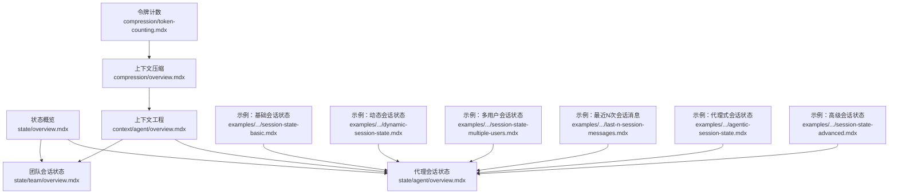
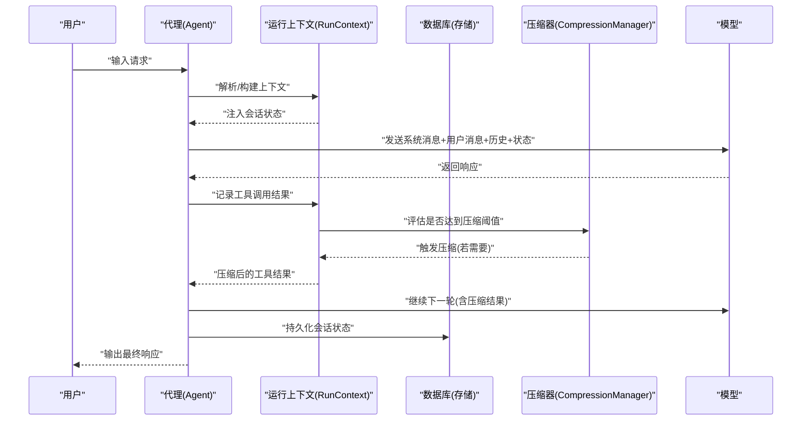
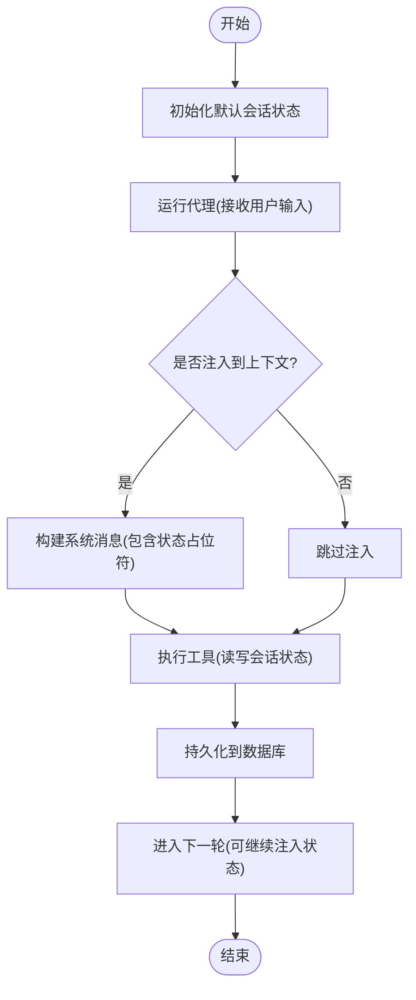
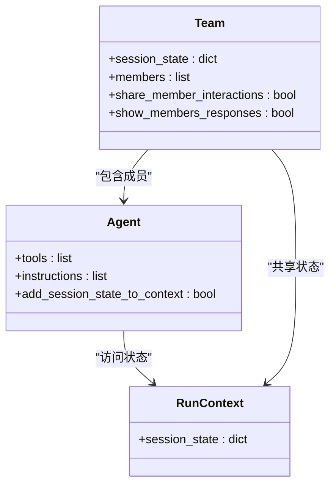
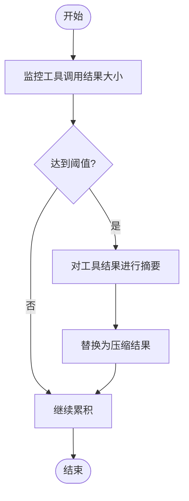
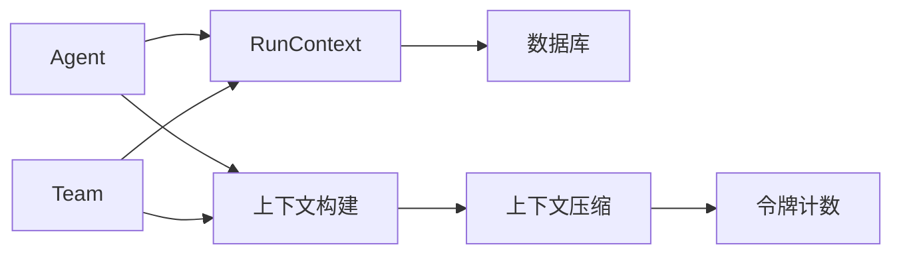

# 上下文中的会话状态

<cite>
**本文引用的文件**
- [state/overview.mdx](file://state/overview.mdx)
- [state/agent/overview.mdx](file://state/agent/overview.mdx)
- [state/team/overview.mdx](file://state/team/overview.mdx)
- [context/agent/overview.mdx](file://context/agent/overview.mdx)
- [compression/overview.mdx](file://compression/overview.mdx)
- [compression/token-counting.mdx](file://compression/token-counting.mdx)
- [examples/agents/state-and-session/session-state-basic.mdx](file://examples/agents/state-and-session/session-state-basic.mdx)
- [examples/agents/state-and-session/session-state-advanced.mdx](file://examples/agents/state-and-session/session-state-advanced.mdx)
- [examples/agents/state-and-session/dynamic-session-state.mdx](file://examples/agents/state-and-session/dynamic-session-state.mdx)
- [examples/agents/state-and-session/last-n-session-messages.mdx](file://examples/agents/state-and-session/last-n-session-messages.mdx)
- [examples/agents/state-and-session/agentic-session-state.mdx](file://examples/agents/state-and-session/agentic-session-state.mdx)
- [examples/agents/state-and-session/session-state-multiple-users.mdx](file://examples/agents/state-and-session/session-state-multiple-users.mdx)
- [state/agent/session-state-in-context.mdx](file://state/agent/session-state-in-context.mdx)
</cite>

## 目录
1. [引言](#引言)
2. [项目结构](#项目结构)
3. [核心组件](#核心组件)
4. [架构总览](#架构总览)
5. [详细组件分析](#详细组件分析)
6. [依赖关系分析](#依赖关系分析)
7. [性能考量](#性能考量)
8. [故障排查指南](#故障排查指南)
9. [结论](#结论)
10. [附录](#附录)

## 引言
本文件围绕“代理上下文中的会话状态”展开，系统阐述如何在代理运行时通过会话状态实现跨轮次的状态持久化与共享，并将其注入到系统消息与上下文中，以提升模型对任务的理解与执行稳定性。文档同时覆盖上下文窗口优化（尤其是工具调用结果的压缩）与状态信息的组织策略，给出最佳实践与完整示例路径，帮助读者在复杂上下文场景中高效使用会话状态。

## 项目结构
围绕会话状态与上下文工程的关键文档与示例分布在以下模块：
- 状态管理概览：state/overview.mdx
- 代理会话状态：state/agent/overview.mdx
- 团队会话状态：state/team/overview.mdx
- 上下文工程（系统消息、历史、工具调用等）：context/agent/overview.mdx
- 上下文压缩（工具调用结果压缩、令牌计数）：compression/overview.mdx、compression/token-counting.mdx
- 示例：agents/state-and-session 下的多个示例文件

图表来源
- [state/overview.mdx](file://state/overview.mdx)
- [state/agent/overview.mdx](file://state/agent/overview.mdx)
- [state/team/overview.mdx](file://state/team/overview.mdx)
- [context/agent/overview.mdx](file://context/agent/overview.mdx)
- [compression/overview.mdx](file://compression/overview.mdx)
- [compression/token-counting.mdx](file://compression/token-counting.mdx)
- [examples/agents/state-and-session/session-state-basic.mdx](file://examples/agents/state-and-session/session-state-basic.mdx)
- [examples/agents/state-and-session/session-state-advanced.mdx](file://examples/agents/state-and-session/session-state-advanced.mdx)
- [examples/agents/state-and-session/dynamic-session-state.mdx](file://examples/agents/state-and-session/dynamic-session-state.mdx)
- [examples/agents/state-and-session/last-n-session-messages.mdx](file://examples/agents/state-and-session/last-n-session-messages.mdx)
- [examples/agents/state-and-session/agentic-session-state.mdx](file://examples/agents/state-and-session/agentic-session-state.mdx)
- [examples/agents/state-and-session/session-state-multiple-users.mdx](file://examples/agents/state-and-session/session-state-multiple-users.mdx)

章节来源
- [state/overview.mdx](file://state/overview.mdx)
- [state/agent/overview.mdx](file://state/agent/overview.mdx)
- [state/team/overview.mdx](file://state/team/overview.mdx)
- [context/agent/overview.mdx](file://context/agent/overview.mdx)
- [compression/overview.mdx](file://compression/overview.mdx)
- [compression/token-counting.mdx](file://compression/token-counting.mdx)

## 核心组件
- 会话状态（Session State）
  - 在代理、团队与工作流中持久化与共享数据，支持跨轮次访问与更新。
  - 通过数据库存储，默认值可通过构造参数或运行时传入，后续运行可加载。
- 上下文注入（Context Injection）
  - 将会话状态以结构化方式注入系统消息与上下文，使模型在推理时可见状态。
  - 支持在描述、指令、附加信息、会话摘要、记忆等位置注入。
- 上下文压缩（Context Compression）
  - 针对工具调用结果进行自动压缩，避免上下文超限与成本上升。
  - 支持基于调用次数或基于令牌阈值两种触发模式。
- 令牌计数（Token Counting）
  - 提供上下文大小估算，辅助压缩阈值设定与内存优化。

章节来源
- [state/overview.mdx](file://state/overview.mdx)
- [state/agent/overview.mdx](file://state/agent/overview.mdx)
- [state/team/overview.mdx](file://state/team/overview.mdx)
- [context/agent/overview.mdx](file://context/agent/overview.mdx)
- [compression/overview.mdx](file://compression/overview.mdx)
- [compression/token-counting.mdx](file://compression/token-counting.mdx)

## 架构总览
下图展示了从“状态初始化/访问/更新”到“上下文构建与模型推理”的端到端流程，以及上下文压缩在工具调用阶段的作用点。

图表来源
- [state/agent/overview.mdx](file://state/agent/overview.mdx)
- [context/agent/overview.mdx](file://context/agent/overview.mdx)
- [compression/overview.mdx](file://compression/overview.mdx)

## 详细组件分析

### 组件A：代理会话状态与上下文注入
- 初始化与默认值
  - 在代理构造时设置默认会话状态；运行时可按会话ID覆盖。
- 访问与更新
  - 工具函数通过运行上下文访问/修改会话状态；变更自动持久化。
- 上下文注入
  - 可启用“将会话状态注入上下文”，并在描述/指令中直接引用键值。
- 多用户/多会话
  - 通过用户ID与会话ID区分不同用户的独立状态，确保隔离性。

图表来源
- [state/agent/overview.mdx](file://state/agent/overview.mdx)
- [context/agent/overview.mdx](file://context/agent/overview.mdx)

章节来源
- [state/agent/overview.mdx](file://state/agent/overview.mdx)
- [context/agent/overview.mdx](file://context/agent/overview.mdx)
- [examples/agents/state-and-session/session-state-basic.mdx](file://examples/agents/state-and-session/session-state-basic.mdx)
- [examples/agents/state-and-session/agentic-session-state.mdx](file://examples/agents/state-and-session/agentic-session-state.mdx)
- [examples/agents/state-and-session/session-state-in-context.mdx](file://state/agent/session-state-in-context.mdx)

### 组件B：团队会话状态与成员交互
- 共享状态
  - 团队级别设置初始共享状态；成员工具可读写该状态。
- 成员交互
  - 可开启成员间交互，使各成员在协作中共享上下文与状态。
- 注入与指令
  - 同样支持将共享状态注入上下文并在指令中引用。

图表来源
- [state/team/overview.mdx](file://state/team/overview.mdx)

章节来源
- [state/team/overview.mdx](file://state/team/overview.mdx)

### 组件C：上下文压缩与令牌计数
- 压缩触发
  - 调用次数阈值或令牌阈值两种模式；默认阈值可配置。
- 智能摘要
  - 保留关键事实（实体、数字、日期、URL），去除冗余文本。
- 令牌计数
  - 包括消息、工具定义、输出模式等，用于更贴近真实请求大小的估算。

图表来源
- [compression/overview.mdx](file://compression/overview.mdx)
- [compression/token-counting.mdx](file://compression/token-counting.mdx)

章节来源
- [compression/overview.mdx](file://compression/overview.mdx)
- [compression/token-counting.mdx](file://compression/token-counting.mdx)

### 组件D：复杂上下文场景示例
- 动态会话状态
  - 通过钩子在运行时动态更新状态，适用于需要根据输入实时扩展上下文的场景。
- 最近N次会话消息
  - 控制历史会话数量，避免上下文膨胀。
- 多用户会话状态
  - 基于用户ID与会话ID隔离状态，适合多租户或多会话并发场景。
- 代理式会话状态
  - 开启后由代理自动生成工具以管理状态，简化开发。

章节来源
- [examples/agents/state-and-session/dynamic-session-state.mdx](file://examples/agents/state-and-session/dynamic-session-state.mdx)
- [examples/agents/state-and-session/last-n-session-messages.mdx](file://examples/agents/state-and-session/last-n-session-messages.mdx)
- [examples/agents/state-and-session/session-state-multiple-users.mdx](file://examples/agents/state-and-session/session-state-multiple-users.mdx)
- [examples/agents/state-and-session/agentic-session-state.mdx](file://examples/agents/state-and-session/agentic-session-state.mdx)

## 依赖关系分析
- 组件耦合
  - 代理/团队依赖运行上下文访问会话状态；状态变更依赖数据库持久化。
  - 上下文压缩依赖令牌计数估算；压缩器可独立配置。
- 关系可视化

图表来源
- [state/agent/overview.mdx](file://state/agent/overview.mdx)
- [state/team/overview.mdx](file://state/team/overview.mdx)
- [context/agent/overview.mdx](file://context/agent/overview.mdx)
- [compression/overview.mdx](file://compression/overview.mdx)
- [compression/token-counting.mdx](file://compression/token-counting.mdx)

章节来源
- [state/agent/overview.mdx](file://state/agent/overview.mdx)
- [state/team/overview.mdx](file://state/team/overview.mdx)
- [context/agent/overview.mdx](file://context/agent/overview.mdx)
- [compression/overview.mdx](file://compression/overview.mdx)
- [compression/token-counting.mdx](file://compression/token-counting.mdx)

## 性能考量
- 上下文长度限制
  - 工具调用结果易导致上下文超限；建议结合“最近N轮工具调用”与“上下文压缩”控制规模。
- 令牌计数
  - 使用令牌计数估算上下文大小，有助于设定压缩阈值与内存优化。
- 压缩策略
  - 对大结果工具采用“令牌阈值”压缩；对可预测调用次数场景采用“调用次数阈值”。

章节来源
- [compression/overview.mdx](file://compression/overview.mdx)
- [compression/token-counting.mdx](file://compression/token-counting.mdx)
- [context/agent/overview.mdx](file://context/agent/overview.mdx)

## 故障排查指南
- 状态未生效
  - 检查是否启用“将会话状态注入上下文”；确认指令中正确引用状态键。
- 状态未持久化
  - 确认已配置数据库；检查会话ID与用户ID是否一致。
- 上下文超限
  - 启用上下文压缩；减少历史轮次；控制工具结果大小。
- 令牌计数不准确
  - 安装推荐依赖；注意不同模型/提供商的差异。

章节来源
- [state/agent/overview.mdx](file://state/agent/overview.mdx)
- [state/team/overview.mdx](file://state/team/overview.mdx)
- [compression/overview.mdx](file://compression/overview.mdx)
- [compression/token-counting.mdx](file://compression/token-counting.mdx)

## 结论
通过在代理上下文中系统性地使用会话状态，并将其注入到系统消息与上下文，可以显著提升模型对任务的连贯理解与执行稳定性。配合上下文压缩与令牌计数，可在复杂多轮与多工具场景中保持上下文窗口可控、成本合理。建议优先采用“将状态注入上下文”与“令牌阈值压缩”的组合策略，并在多用户/多会话场景中明确区分用户ID与会话ID，确保状态隔离与一致性。

## 附录
- 快速参考
  - 会话状态初始化与更新：参见代理/团队会话状态文档与示例。
  - 上下文注入：参见上下文工程文档。
  - 上下文压缩与令牌计数：参见压缩与令牌计数文档。
  - 示例路径（不含代码内容）：
    - [基础会话状态示例](file://examples/agents/state-and-session/session-state-basic.mdx)
    - [动态会话状态示例](file://examples/agents/state-and-session/dynamic-session-state.mdx)
    - [最近N次会话消息示例](file://examples/agents/state-and-session/last-n-session-messages.mdx)
    - [多用户会话状态示例](file://examples/agents/state-and-session/session-state-multiple-users.mdx)
    - [代理式会话状态示例](file://examples/agents/state-and-session/agentic-session-state.mdx)
    - [高级会话状态示例](file://examples/agents/state-and-session/session-state-advanced.mdx)
    - [会话状态在上下文中的示例](file://state/agent/session-state-in-context.mdx)