# 代理状态

<cite>
**本文引用的文件**
- [state/overview.mdx](file://state/overview.mdx)
- [reference/run/run-context.mdx](file://reference/run/run-context.mdx)
- [state/agent/overview.mdx](file://state/agent/overview.mdx)
- [state/agent/dynamic-session-state.mdx](file://state/agent/dynamic-session-state.mdx)
- [state/team/overview.mdx](file://state/team/overview.mdx)
- [state/workflows/overview.mdx](file://state/workflows/overview.mdx)
- [state/workflows/access-session-state-in-condition-evaluator-function.mdx](file://state/workflows/access-session-state-in-condition-evaluator-function.mdx)
- [examples/agents/state-and-session/session-state-basic.mdx](file://examples/agents/state-and-session/session-state-basic.mdx)
- [examples/agents/state-and-session/session-state-advanced.mdx](file://examples/agents/state-and-session/session-state-advanced.mdx)
- [examples/teams/state/state-sharing.mdx](file://examples/teams/state/state-sharing.mdx)
- [examples/agents/context-management/instructions-with-state.mdx](file://examples/agents/context-management/instructions-with-state.mdx)
- [sessions/persisting-sessions/overview.mdx](file://sessions/persisting-sessions/overview.mdx)
- [database/overview.mdx](file://database/overview.mdx)
</cite>

## 目录
1. [简介](#简介)
2. [项目结构](#项目结构)
3. [核心组件](#核心组件)
4. [架构总览](#架构总览)
5. [详细组件分析](#详细组件分析)
6. [依赖关系分析](#依赖关系分析)
7. [性能考量](#性能考量)
8. [故障排查指南](#故障排查指南)
9. [结论](#结论)
10. [附录](#附录)

## 简介
本篇文档系统性阐述代理状态（session_state）在 Agno 中的概念、实现机制与最佳实践，重点覆盖以下主题：
- session_state 的定义与生命周期：跨多次运行保持、自动持久化与加载
- 初始化策略：默认状态、运行时覆盖与合并策略
- 访问与修改：在工具函数、钩子、条件/路由选择器等上下文中通过 run_context.session_state 使用
- 动态状态管理：运行时变更与更新策略
- 多用户场景：用户隔离与状态共享
- 指令中的状态使用：状态变量替换与上下文注入
- 状态持久化：数据库存储机制与配置要点

## 项目结构
围绕“代理状态”的知识与示例分布在多个文档中：
- 概览与基本用法：state/overview.mdx、state/agent/overview.mdx
- 运行时上下文：reference/run/run-context.mdx
- 动态状态与钩子：state/agent/dynamic-session-state.mdx
- 团队与工作流中的状态：state/team/overview.mdx、state/workflows/overview.mdx 及其子页面
- 示例与实战：examples 下各示例文档
- 会话与持久化：sessions/persisting-sessions/overview.mdx、database/overview.mdx

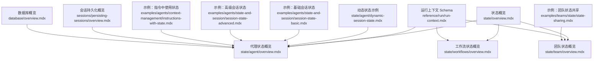

**图表来源**
- [state/overview.mdx:1-80](file://state/overview.mdx#L1-L80)
- [state/agent/overview.mdx:1-306](file://state/agent/overview.mdx#L1-L306)
- [state/team/overview.mdx:1-357](file://state/team/overview.mdx#L1-L357)
- [state/workflows/overview.mdx:1-277](file://state/workflows/overview.mdx#L1-L277)
- [reference/run/run-context.mdx:1-22](file://reference/run/run-context.mdx#L1-L22)
- [state/agent/dynamic-session-state.mdx:1-118](file://state/agent/dynamic-session-state.mdx#L1-L118)
- [examples/agents/state-and-session/session-state-basic.mdx:1-70](file://examples/agents/state-and-session/session-state-basic.mdx#L1-L70)
- [examples/agents/state-and-session/session-state-advanced.mdx:1-124](file://examples/agents/state-and-session/session-state-advanced.mdx#L1-L124)
- [examples/teams/state/state-sharing.mdx:1-102](file://examples/teams/state/state-sharing.mdx#L1-L102)
- [examples/agents/context-management/instructions-with-state.mdx:39-68](file://examples/agents/context-management/instructions-with-state.mdx#L39-L68)
- [sessions/persisting-sessions/overview.mdx:1-30](file://sessions/persisting-sessions/overview.mdx#L1-L30)
- [database/overview.mdx:25-54](file://database/overview.mdx#L25-L54)

**章节来源**
- [state/overview.mdx:1-80](file://state/overview.mdx#L1-L80)
- [reference/run/run-context.mdx:1-22](file://reference/run/run-context.mdx#L1-L22)

## 核心组件
- RunContext.session_state：贯穿工具、钩子、条件/路由选择器等的统一状态入口，类型为字典，支持任意可序列化数据结构
- Agent/Team/Workflow 的 session_state 参数：用于初始化默认状态或在运行时传入覆盖值
- 数据库持久化：当配置了 db 后，状态会在会话内自动保存与加载
- 指令中的状态变量替换：在 instructions/description 中以 {key} 形式引用 session_state

关键要点：
- 默认状态：通过构造参数 session_state 提供
- 运行时覆盖：调用 run/print_response 时传入 session_state 将与已有状态进行合并或覆盖（取决于配置）
- 自动注入：run_context 在工具与钩子中自动注入，无需手动传递
- 上下文注入：可通过 add_session_state_to_context 将 session_state 注入到模型上下文中

**章节来源**
- [reference/run/run-context.mdx:10-22](file://reference/run/run-context.mdx#L10-L22)
- [state/agent/overview.mdx:25-80](file://state/agent/overview.mdx#L25-L80)
- [state/workflows/overview.mdx:201-246](file://state/workflows/overview.mdx#L201-L246)

## 架构总览
下面的图展示了从“状态初始化”到“持久化与加载”的完整流程，以及在不同组件（Agent/Team/Workflow）中的协同。

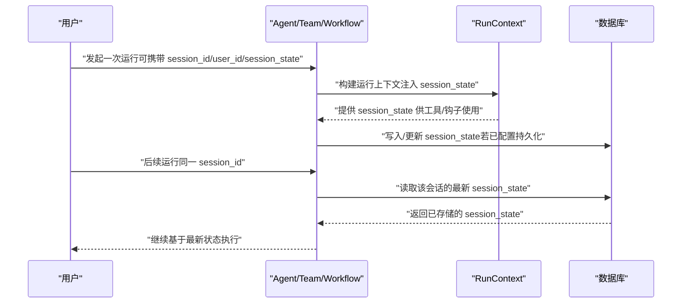

**图表来源**
- [state/agent/overview.mdx:82-170](file://state/agent/overview.mdx#L82-L170)
- [state/workflows/overview.mdx:25-39](file://state/workflows/overview.mdx#L25-L39)
- [sessions/persisting-sessions/overview.mdx:14-26](file://sessions/persisting-sessions/overview.mdx#L14-L26)
- [database/overview.mdx:25-54](file://database/overview.mdx#L25-L54)

## 详细组件分析

### RunContext 与 session_state
- RunContext 是运行期上下文对象，包含 run_id、session_id、user_id、dependencies、knowledge_filters、metadata、session_state 等字段
- session_state 作为字典，是所有组件（工具、钩子、条件/路由选择器等）共享的状态载体
- 在工具函数签名中，run_context 会自动注入；在自定义函数步骤中，也可通过 run_context 显式访问

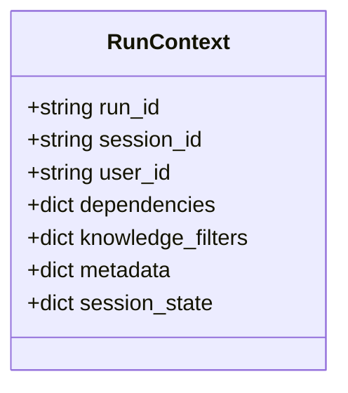

**图表来源**
- [reference/run/run-context.mdx:13-21](file://reference/run/run-context.mdx#L13-L21)

**章节来源**
- [reference/run/run-context.mdx:1-22](file://reference/run/run-context.mdx#L1-L22)

### 代理中的 session_state
- 初始化：Agent 构造时通过 session_state 设置默认状态
- 访问与修改：工具函数通过 run_context.session_state 读写
- 持久化：配置 db 后，状态在会话内自动保存与加载
- 指令注入：在 instructions/description 中以 {key} 引用 session_state，由框架进行变量替换

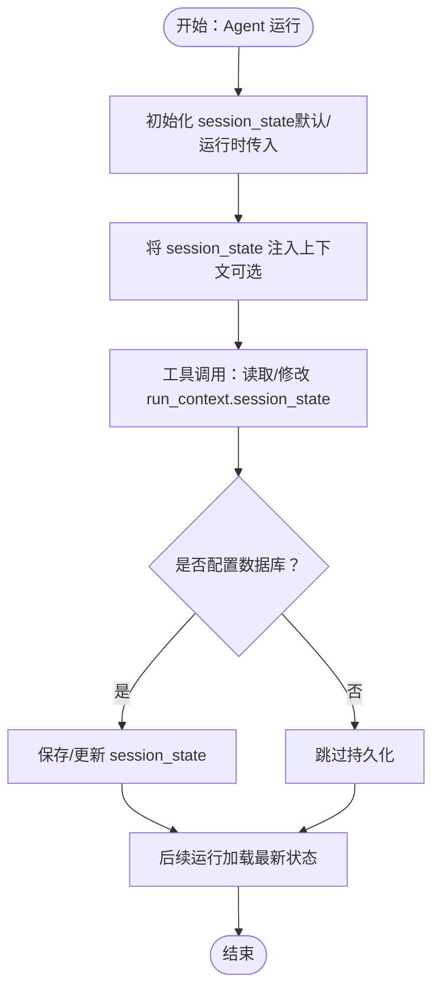

**图表来源**
- [state/agent/overview.mdx:25-80](file://state/agent/overview.mdx#L25-L80)
- [examples/agents/state-and-session/session-state-basic.mdx:21-28](file://examples/agents/state-and-session/session-state-basic.mdx#L21-L28)
- [examples/agents/context-management/instructions-with-state.mdx:39-68](file://examples/agents/context-management/instructions-with-state.mdx#L39-L68)

**章节来源**
- [state/agent/overview.mdx:25-80](file://state/agent/overview.mdx#L25-L80)
- [examples/agents/state-and-session/session-state-basic.mdx:1-70](file://examples/agents/state-and-session/session-state-basic.mdx#L1-L70)
- [examples/agents/context-management/instructions-with-state.mdx:39-68](file://examples/agents/context-management/instructions-with-state.mdx#L39-L68)

### 动态状态管理（工具钩子）
- 通过工具钩子在工具调用前后对 session_state 进行动态更新
- 典型场景：根据工具参数决定创建/查询客户档案，并更新 session_state
- 钩子中同样通过 run_context.session_state 访问与修改

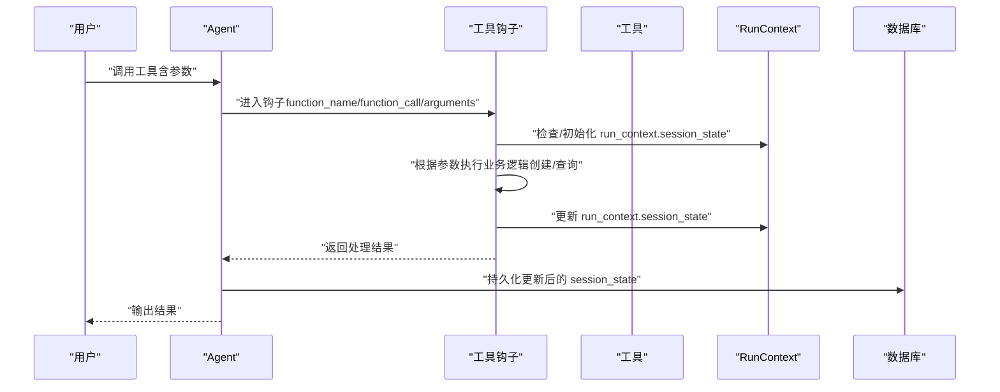

**图表来源**
- [state/agent/dynamic-session-state.mdx:40-70](file://state/agent/dynamic-session-state.mdx#L40-L70)

**章节来源**
- [state/agent/dynamic-session-state.mdx:1-118](file://state/agent/dynamic-session-state.mdx#L1-L118)

### 团队中的 session_state
- Team 支持在成员间共享 session_state，成员工具可通过 run_context.session_state 访问
- 支持嵌套团队结构，共享状态在子团队中同样生效
- 可通过 enable_agentic_state 为团队及成员启用自动状态管理工具

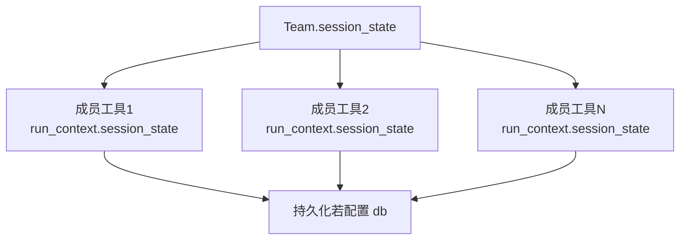

**图表来源**
- [state/team/overview.mdx:14-57](file://state/team/overview.mdx#L14-L57)

**章节来源**
- [state/team/overview.mdx:1-357](file://state/team/overview.mdx#L1-L357)
- [examples/teams/state/state-sharing.mdx:1-102](file://examples/teams/state/state-sharing.mdx#L1-L102)

### 工作流中的 session_state
- 工作流内的所有步骤（Agent/Team/自定义函数）共享同一份 session_state
- 可在自定义 Python 函数步骤、条件评估器、路由器选择器中通过 run_context.session_state 访问与修改
- 并行步骤中需注意并发写入的协调，避免竞态

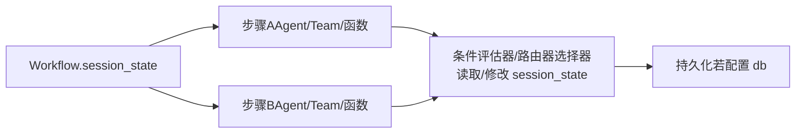

**图表来源**
- [state/workflows/overview.mdx:201-246](file://state/workflows/overview.mdx#L201-L246)

**章节来源**
- [state/workflows/overview.mdx:1-277](file://state/workflows/overview.mdx#L1-L277)
- [state/workflows/access-session-state-in-condition-evaluator-function.mdx:1-32](file://state/workflows/access-session-state-in-condition-evaluator-function.mdx#L1-L32)

### 指令中的状态使用与上下文注入
- 在 Agent/Team 的 instructions/description 中，可直接使用 {key} 引用 session_state
- 通过 add_session_state_to_context 可将 session_state 注入到模型上下文，便于在提示词中直接呈现

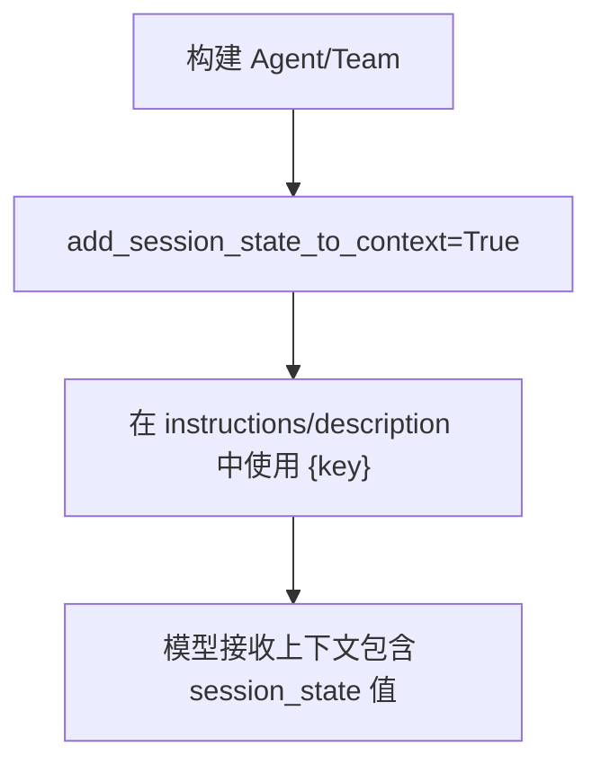

**图表来源**
- [state/agent/overview.mdx:200-228](file://state/agent/overview.mdx#L200-L228)
- [examples/agents/context-management/instructions-with-state.mdx:39-68](file://examples/agents/context-management/instructions-with-state.mdx#L39-L68)

**章节来源**
- [state/agent/overview.mdx:200-228](file://state/agent/overview.mdx#L200-L228)
- [examples/agents/context-management/instructions-with-state.mdx:39-68](file://examples/agents/context-management/instructions-with-state.mdx#L39-L68)

### 多用户场景：用户隔离与状态共享
- 用户隔离：通过 user_id 与 session_id 组合区分不同用户的会话状态
- 状态共享：同一 session_id 下的所有运行共享同一份 session_state
- 覆盖策略：运行时传入的 session_state 默认与数据库中已存状态进行合并；可通过 overwrite_db_session_state 控制是否覆盖

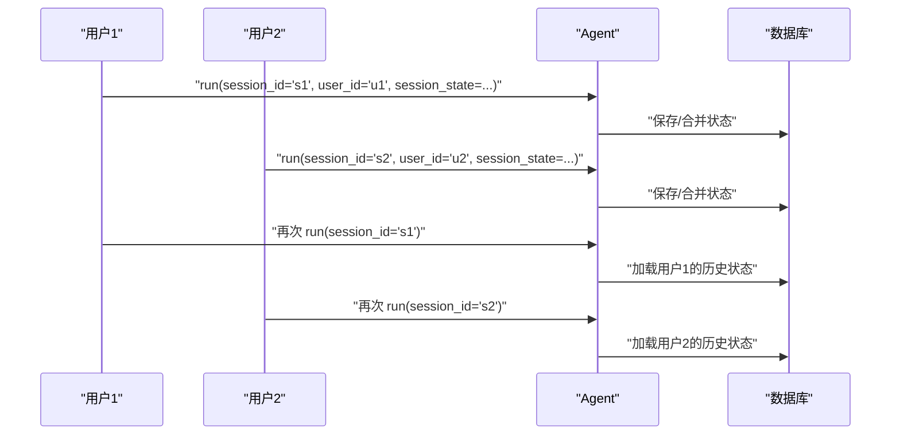

**图表来源**
- [state/agent/overview.mdx:230-258](file://state/agent/overview.mdx#L230-L258)
- [state/team/overview.mdx:237-266](file://state/team/overview.mdx#L237-L266)

**章节来源**
- [state/agent/overview.mdx:230-258](file://state/agent/overview.mdx#L230-L258)
- [state/team/overview.mdx:237-266](file://state/team/overview.mdx#L237-L266)

### 状态持久化与数据库存储
- 启用持久化：在 Agent/Team/Workflow 构造时传入 db 对象
- 自动保存：每次工具/钩子/步骤对 session_state 的修改都会在会话内持久化
- 加载策略：后续运行按 session_id 从数据库加载最新状态
- 支持多种数据库：SQLite、PostgreSQL、Redis、MongoDB 等（参考数据库概览）

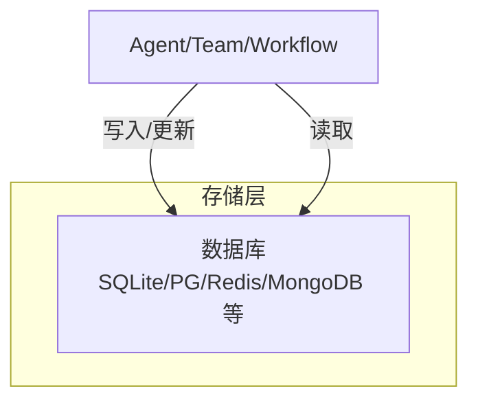

**图表来源**
- [sessions/persisting-sessions/overview.mdx:14-26](file://sessions/persisting-sessions/overview.mdx#L14-L26)
- [database/overview.mdx:25-54](file://database/overview.mdx#L25-L54)

**章节来源**
- [sessions/persisting-sessions/overview.mdx:1-30](file://sessions/persisting-sessions/overview.mdx#L1-L30)
- [database/overview.mdx:25-54](file://database/overview.mdx#L25-L54)

## 依赖关系分析
- 组件耦合
  - RunContext 与 Agent/Team/Workflow 解耦：通过运行期注入而非硬编码
  - 工具与钩子依赖 RunContext.session_state，但不关心底层存储
  - 数据库抽象：Agent/Team/Workflow 仅需传入 db 实例，不关心具体实现
- 外部依赖
  - 数据库驱动：PostgreSQL、SQLite、Redis、MongoDB 等
  - 模型服务：OpenAIResponses 等（示例中使用）

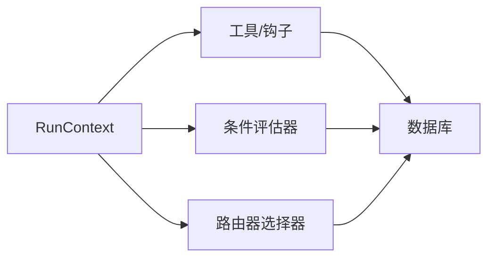

**图表来源**
- [reference/run/run-context.mdx:13-21](file://reference/run/run-context.mdx#L13-L21)
- [state/workflows/overview.mdx:220-246](file://state/workflows/overview.mdx#L220-L246)

**章节来源**
- [reference/run/run-context.mdx:1-22](file://reference/run/run-context.mdx#L1-L22)
- [state/workflows/overview.mdx:201-246](file://state/workflows/overview.mdx#L201-L246)

## 性能考量
- 并发写入：在并行工作流中，多个步骤同时写入 session_state 可能引发竞态，建议采用串行化或加锁策略
- 序列化成本：session_state 中的数据应尽量轻量且可高效序列化，避免大对象频繁写入
- 查询优化：按需读取与最小化更新，减少不必要的持久化开销
- 缓存策略：在内存数据库或本地缓存中短期缓存热点状态，降低数据库压力

## 故障排查指南
- session_state 为空
  - 确认在工具/钩子中对 run_context.session_state 进行了初始化（如为空则赋值空字典）
  - 检查是否正确传入 session_state 或是否被覆盖
- 状态未持久化
  - 确认已配置 db；确认运行期间未禁用持久化
  - 检查数据库连接字符串与权限
- 状态覆盖问题
  - 若希望运行时完全覆盖数据库中的状态，请开启覆盖选项（如 overwrite_db_session_state）
- 并发冲突
  - 并行步骤中对同一键的并发写入可能产生竞态，建议在步骤间增加同步或使用原子操作

**章节来源**
- [state/agent/overview.mdx:260-306](file://state/agent/overview.mdx#L260-L306)
- [state/workflows/overview.mdx:44-46](file://state/workflows/overview.mdx#L44-L46)

## 结论
- session_state 是 Agno 中实现“有状态”运行的核心机制，贯穿工具、钩子、条件/路由选择器与工作流步骤
- 通过 RunContext.session_state，开发者可以在任意运行期环节读写状态，并由框架自动完成持久化与加载
- 在多用户与多组件场景下，合理设计状态结构、覆盖策略与并发控制，是实现稳定、可维护状态管理的关键

## 附录
- 快速上手
  - 在 Agent/Team/Workflow 构造时传入 db 以启用持久化
  - 通过 session_state 初始化默认状态，必要时在运行时覆盖
  - 在工具/钩子中使用 run_context.session_state 访问与修改
  - 在指令中使用 {key} 引用 session_state，并通过 add_session_state_to_context 注入上下文
- 参考示例
  - 基础示例：[session-state-basic.mdx:1-70](file://examples/agents/state-and-session/session-state-basic.mdx#L1-L70)
  - 高级示例：[session-state-advanced.mdx:1-124](file://examples/agents/state-and-session/session-state-advanced.mdx#L1-L124)
  - 团队状态共享：[state-sharing.mdx:1-102](file://examples/teams/state/state-sharing.mdx#L1-L102)
  - 指令中使用状态：[instructions-with-state.mdx:39-68](file://examples/agents/context-management/instructions-with-state.mdx#L39-L68)
  - 动态状态（钩子）：[dynamic-session-state.mdx:1-118](file://state/agent/dynamic-session-state.mdx#L1-L118)