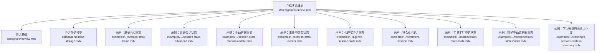
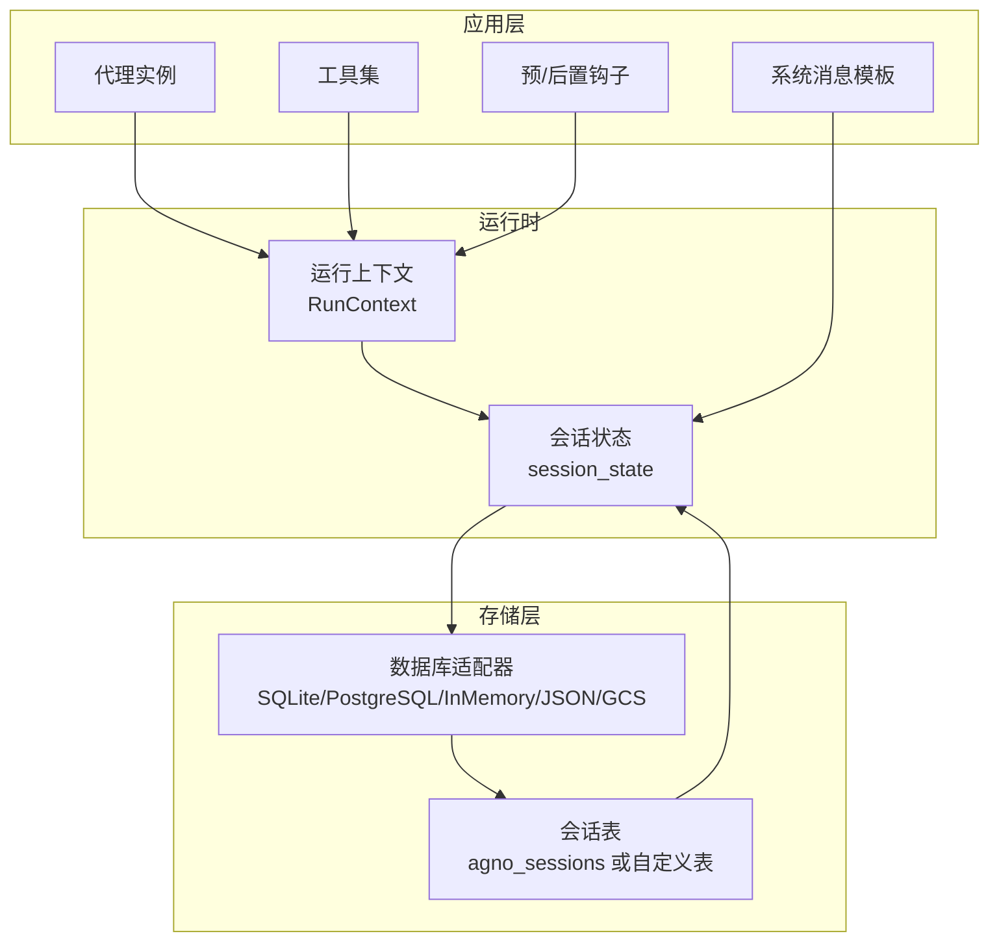
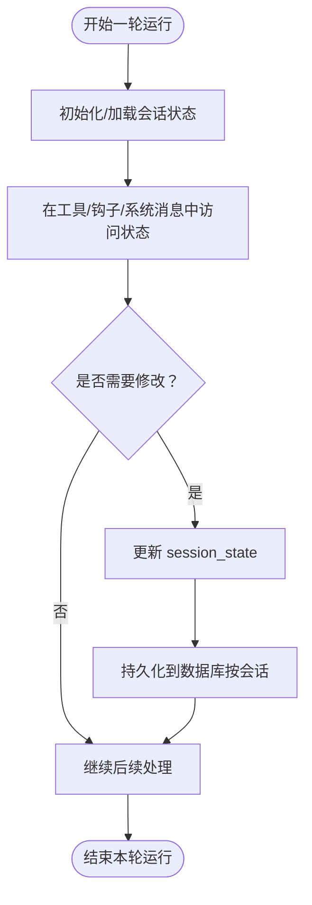
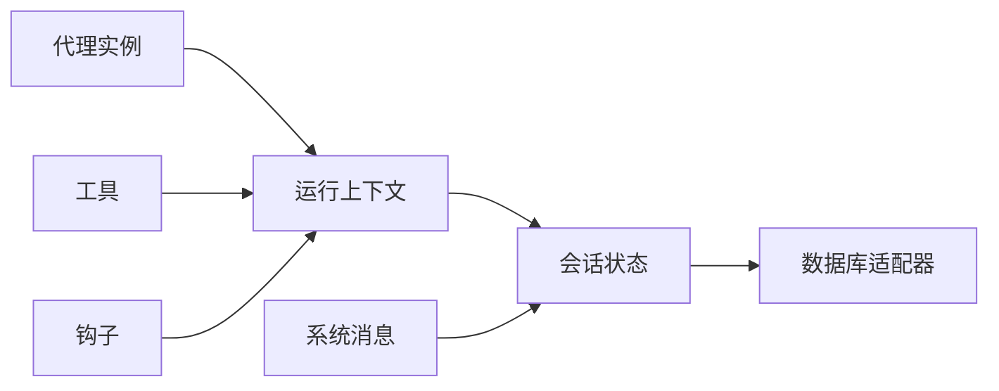

# 会话状态概述

<cite>
**本文引用的文件**
- [state/agent/overview.mdx](file://state/agent/overview.mdx)
- [sessions/overview.mdx](file://sessions/overview.mdx)
- [database/session-storage.mdx](file://database/session-storage.mdx)
- [examples/agents/state-and-session/session-state-basic.mdx](file://examples/agents/state-and-session/session-state-basic.mdx)
- [examples/agents/state-and-session/session-state-advanced.mdx](file://examples/agents/state-and-session/session-state-advanced.mdx)
- [examples/agents/state-and-session/session-state-manual-update.mdx](file://examples/agents/state-and-session/session-state-manual-update.mdx)
- [examples/agents/state-and-session/session-state-events.mdx](file://examples/agents/state-and-session/session-state-events.mdx)
- [examples/agents/state-and-session/agentic-session-state.mdx](file://examples/agents/state-and-session/agentic-session-state.mdx)
- [examples/agents/state-and-session/persistent-session.mdx](file://examples/agents/state-and-session/persistent-session.mdx)
- [examples/agents/tools/session-state-tools.mdx](file://examples/agents/tools/session-state-tools.mdx)
- [examples/agents/hooks/session-state-hooks.mdx](file://examples/agents/hooks/session-state-hooks.mdx)
- [examples/learning/basics/a-session-context-summary.mdx](file://examples/learning/basics/a-session-context-summary.mdx)
</cite>

## 目录
1. [简介](#简介)
2. [项目结构](#项目结构)
3. [核心组件](#核心组件)
4. [架构总览](#架构总览)
5. [详细组件分析](#详细组件分析)
6. [依赖关系分析](#依赖关系分析)
7. [性能考量](#性能考量)
8. [故障排查指南](#故障排查指南)
9. [结论](#结论)
10. [附录](#附录)

## 简介
本篇文档围绕“代理会话状态”进行系统化技术说明，目标是帮助开发者从概念到实现全面理解：
- 什么是会话状态及其在代理运行中的作用机制
- 会话状态与代理实例的关系：为何代理不直接维护工作状态
- 生命周期管理：初始化、访问、修改、持久化与续会加载
- 在工具调用、钩子函数与其他运行时组件中的可用性
- 与数据库存储的集成机制及会话延续时的状态自动加载
- 提供概念图与示例路径，便于快速上手

## 项目结构
围绕会话状态的关键文档与示例分布如下：
- 概念与使用指南：state/agent/overview.mdx
- 会话基础：sessions/overview.mdx
- 数据库存储模型：database/session-storage.mdx
- 示例集合（基础、高级、手动更新、事件、钩子、工具工厂等）：examples/.../session-state-*.mdx 与 examples/.../tools/*.mdx、examples/.../hooks/*.mdx、examples/.../learning/*.mdx

图表来源
- [state/agent/overview.mdx](file://state/agent/overview.mdx)
- [sessions/overview.mdx](file://sessions/overview.mdx)
- [database/session-storage.mdx](file://database/session-storage.mdx)
- [examples/agents/state-and-session/session-state-basic.mdx](file://examples/agents/state-and-session/session-state-basic.mdx)
- [examples/agents/state-and-session/session-state-advanced.mdx](file://examples/agents/state-and-session/session-state-advanced.mdx)
- [examples/agents/state-and-session/session-state-manual-update.mdx](file://examples/agents/state-and-session/session-state-manual-update.mdx)
- [examples/agents/state-and-session/session-state-events.mdx](file://examples/agents/state-and-session/session-state-events.mdx)
- [examples/agents/state-and-session/agentic-session-state.mdx](file://examples/agents/state-and-session/agentic-session-state.mdx)
- [examples/agents/state-and-session/persistent-session.mdx](file://examples/agents/state-and-session/persistent-session.mdx)
- [examples/agents/tools/session-state-tools.mdx](file://examples/agents/tools/session-state-tools.mdx)
- [examples/agents/hooks/session-state-hooks.mdx](file://examples/agents/hooks/session-state-hooks.mdx)
- [examples/learning/basics/a-session-context-summary.mdx](file://examples/learning/basics/a-session-context-summary.mdx)

章节来源
- [state/agent/overview.mdx](file://state/agent/overview.mdx)
- [sessions/overview.mdx](file://sessions/overview.mdx)
- [database/session-storage.mdx](file://database/session-storage.mdx)

## 核心组件
- 会话状态（Session State）
  - 定义：在一次或多轮会话中持续存在的数据，贯穿工具调用、预/后置钩子、系统消息等运行期组件
  - 特点：不直接保存在代理实例内存中；通过数据库持久化并在会话延续时自动加载
- 代理实例与会话状态
  - 代理实例本身不被修改；工作状态以“每轮运行”的方式管理，并按会话维度持久化
- 数据库存储
  - 默认表名与字段结构见会话存储模型文档
  - 支持多种数据库适配器（SQLite、PostgreSQL、InMemory、JSON、GCS 等）

章节来源
- [state/agent/overview.mdx](file://state/agent/overview.mdx)
- [database/session-storage.mdx](file://database/session-storage.mdx)

## 架构总览
下图展示“代理—会话—数据库”的整体交互关系，以及状态在不同运行阶段的流转。

图表来源
- [state/agent/overview.mdx](file://state/agent/overview.mdx)
- [database/session-storage.mdx](file://database/session-storage.mdx)

## 详细组件分析

### 1) 会话状态基本概念与使用
- 何时使用：当数据需要跨轮次保留或在会话期间更新时
- 可用位置：工具调用、预/后置钩子、其他运行时函数、系统消息
- 自动加载：配置数据库后，会话延续时自动从数据库加载状态

章节来源
- [state/agent/overview.mdx](file://state/agent/overview.mdx)

### 2) 会话生命周期管理
- 初始化
  - 通过代理构造参数设置默认会话状态
  - 运行时可通过传参覆盖当前轮次的会话状态
- 访问
  - 工具函数通过运行上下文访问 session_state
  - 系统消息可直接引用 session_state 中的键值
- 修改
  - 在工具或钩子中对 session_state 做增删改
  - 也可通过代理提供的方法进行手动更新
- 持久化与续会
  - 配置数据库后，状态按会话维度写入并自动加载
  - 多用户场景下，通过 user_id 与 session_id 组合隔离会话

图表来源
- [state/agent/overview.mdx](file://state/agent/overview.mdx)
- [database/session-storage.mdx](file://database/session-storage.mdx)

章节来源
- [state/agent/overview.mdx](file://state/agent/overview.mdx)
- [database/session-storage.mdx](file://database/session-storage.mdx)

### 3) 代理实例与会话状态的关系
- 代理实例不直接持有工作状态；状态管理由运行时上下文与数据库协作完成
- 代理实例的属性不会在运行过程中被修改，确保并发与一致性

章节来源
- [state/agent/overview.mdx](file://state/agent/overview.mdx)

### 4) 会话与数据库集成
- 存储结构
  - 默认表名为 agno_sessions，支持自定义表名
  - 字段包含会话标识、类型、关联对象、用户、会话数据、元数据、运行记录、摘要等
- 查询与检索
  - 通过统一接口获取会话，访问 runs 与 session_data
- 适用范围
  - 同样适用于团队与工作流的会话存储

章节来源
- [database/session-storage.mdx](file://database/session-storage.mdx)

### 5) 在工具调用与钩子中的可用性
- 工具调用
  - 工具函数可直接接收 session_state 参数（工厂模式需禁用缓存以实时生效）
- 钩子函数
  - 预/后置钩子可基于输入内容动态更新 session_state
- 事件
  - 流式事件中可获取最终 session_state

章节来源
- [examples/agents/tools/session-state-tools.mdx](file://examples/agents/tools/session-state-tools.mdx)
- [examples/agents/hooks/session-state-hooks.mdx](file://examples/agents/hooks/session-state-hooks.mdx)
- [examples/agents/state-and-session/session-state-events.mdx](file://examples/agents/state-and-session/session-state-events.mdx)

### 6) 代理式会话状态（Agentic Session State）
- 通过启用代理式状态管理，让代理自动维护与更新会话状态
- 需要显式开启并将状态注入上下文，以便模型可见

章节来源
- [examples/agents/state-and-session/agentic-session-state.mdx](file://examples/agents/state-and-session/agentic-session-state.mdx)
- [state/agent/overview.mdx](file://state/agent/overview.mdx)

### 7) 示例路径与用法要点
- 基础用法：在工具中读写 session_state 并在系统消息中引用
- 高级用法：多工具组合管理复杂状态（如购物清单）
- 手动更新：先获取当前状态，再调用更新接口写回
- 事件观察：在流式事件中打印最终 session_state
- 持久化会话：配置数据库后，同一 session_id 下的状态得以延续
- 工具工厂：根据 session_state 动态选择工具集
- 钩子动态更新：基于用户输入动态扩展会话主题等信息
- 学习模块：会话上下文用于总结对话要点

章节来源
- [examples/agents/state-and-session/session-state-basic.mdx](file://examples/agents/state-and-session/session-state-basic.mdx)
- [examples/agents/state-and-session/session-state-advanced.mdx](file://examples/agents/state-and-session/session-state-advanced.mdx)
- [examples/agents/state-and-session/session-state-manual-update.mdx](file://examples/agents/state-and-session/session-state-manual-update.mdx)
- [examples/agents/state-and-session/session-state-events.mdx](file://examples/agents/state-and-session/session-state-events.mdx)
- [examples/agents/state-and-session/persistent-session.mdx](file://examples/agents/state-and-session/persistent-session.mdx)
- [examples/agents/tools/session-state-tools.mdx](file://examples/agents/tools/session-state-tools.mdx)
- [examples/agents/hooks/session-state-hooks.mdx](file://examples/agents/hooks/session-state-hooks.mdx)
- [examples/learning/basics/a-session-context-summary.mdx](file://examples/learning/basics/a-session-context-summary.mdx)

## 依赖关系分析
- 低耦合设计
  - 代理实例不直接持有状态，避免与运行时状态强耦合
  - 通过运行上下文与数据库解耦
- 运行时依赖
  - 工具与钩子依赖运行上下文访问 session_state
  - 系统消息依赖 session_state 的键值替换
- 存储依赖
  - 会话存储依赖数据库适配器与会话表结构

图表来源
- [state/agent/overview.mdx](file://state/agent/overview.mdx)
- [database/session-storage.mdx](file://database/session-storage.mdx)

章节来源
- [state/agent/overview.mdx](file://state/agent/overview.mdx)
- [database/session-storage.mdx](file://database/session-storage.mdx)

## 性能考量
- 状态体积控制
  - 将仅在会话内必要的数据放入 session_state，避免冗余
- 数据库写入频率
  - 合理合并多次小更新，减少写入次数
- 工具工厂缓存
  - 若依赖 session_state 的动态选择，请禁用缓存以保证每次解析最新状态
- 事件流
  - 在流式输出中按需获取 session_state，避免频繁读取

## 故障排查指南
- 未配置数据库导致状态不持久
  - 现象：单轮运行有效，但会话延续时状态丢失
  - 处理：配置数据库适配器并确认会话表存在
- session_state 为空
  - 现象：工具中无法读取或更新状态
  - 处理：在钩子或工具中初始化空字典后再使用
- 工具工厂未生效
  - 现象：切换 session_state 后工具集未变化
  - 处理：关闭缓存，确保工厂每次执行
- 覆盖策略误解
  - 现象：传入新状态后未覆盖数据库中的旧状态
  - 处理：明确覆盖策略开关，按需启用覆盖行为

章节来源
- [state/agent/overview.mdx](file://state/agent/overview.mdx)
- [database/session-storage.mdx](file://database/session-storage.mdx)
- [examples/agents/state-and-session/session-state-manual-update.mdx](file://examples/agents/state-and-session/session-state-manual-update.mdx)
- [examples/agents/tools/session-state-tools.mdx](file://examples/agents/tools/session-state-tools.mdx)

## 结论
- 会话状态是实现“有记忆”的多轮对话与任务编排的关键
- 代理不直接维护工作状态，而是通过运行上下文与数据库协作完成
- 正确配置数据库后，状态可在会话延续时自动加载，支持多用户隔离
- 在工具、钩子与系统消息中灵活使用状态，可构建更智能、连贯的代理行为

## 附录
- 相关概念与示例
  - 会话基础与多用户隔离
  - 会话摘要与上下文总结
  - 事件驱动的状态观察

章节来源
- [sessions/overview.mdx](file://sessions/overview.mdx)
- [examples/learning/basics/a-session-context-summary.mdx](file://examples/learning/basics/a-session-context-summary.mdx)