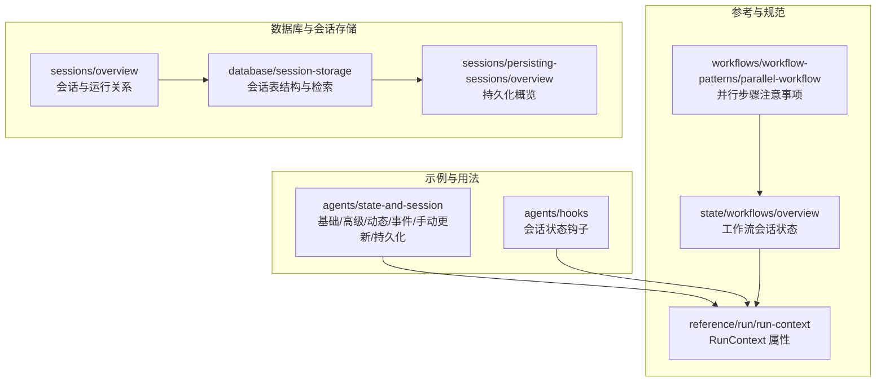
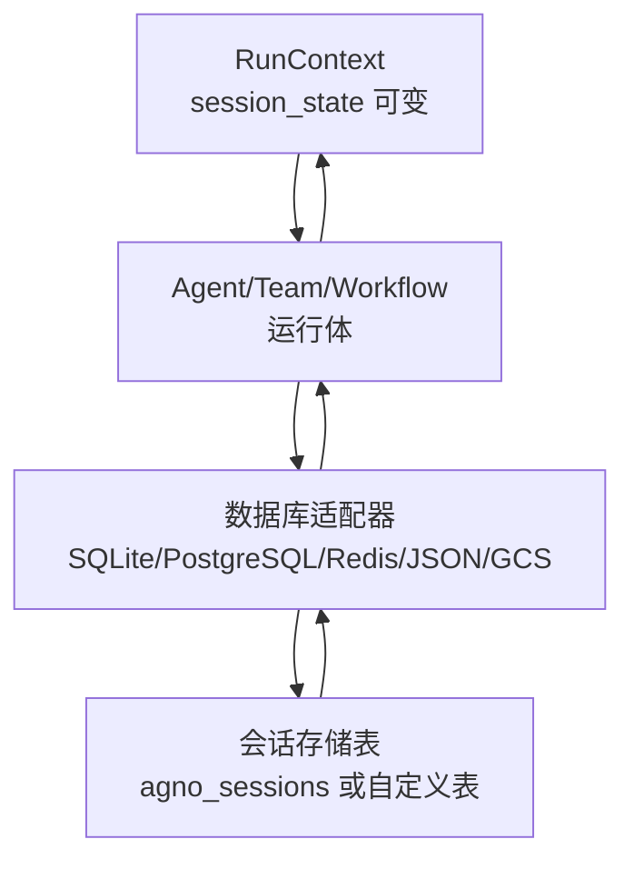
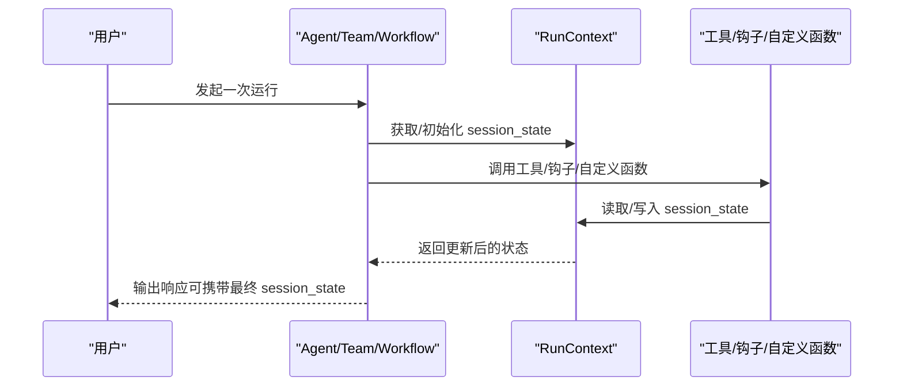
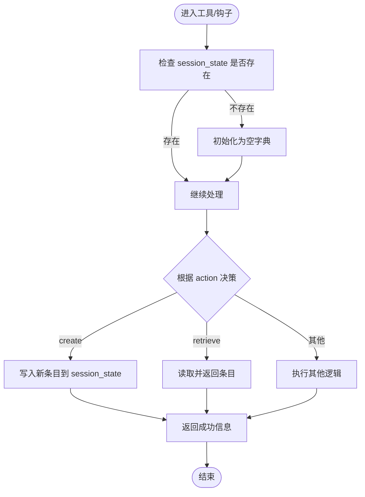
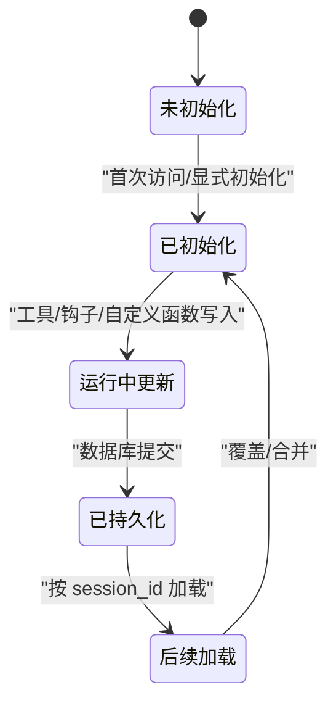
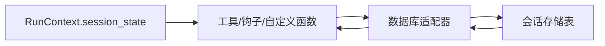

# 动态会话状态

<cite>
**本文引用的文件**
- [dynamic-session-state.mdx](file://examples/agents/state-and-session/dynamic-session-state.mdx)
- [session-state-basic.mdx](file://examples/agents/state-and-session/session-state-basic.mdx)
- [session-state-advanced.mdx](file://examples/agents/state-and-session/session-state-advanced.mdx)
- [session-state-hooks.mdx](file://examples/agents/hooks/session-state-hooks.mdx)
- [session-state-manual-update.mdx](file://examples/agents/state-and-session/session-state-manual-update.mdx)
- [session-state-events.mdx](file://examples/agents/state-and-session/session-state-events.mdx)
- [persistent-session.mdx](file://examples/agents/state-and-session/persistent-session.mdx)
- [session-storage.mdx](file://database/session-storage.mdx)
- [persisting-sessions-overview.mdx](file://sessions/persisting-sessions/overview.mdx)
- [sessions-overview.mdx](file://sessions/overview.mdx)
- [run-context.mdx](file://reference/run/run-context.mdx)
- [workflow-session-state-overview.mdx](file://state/workflows/overview.mdx)
- [parallel-workflow.mdx](file://workflows/workflow-patterns/parallel-workflow.mdx)
</cite>

## 目录
1. [简介](#简介)
2. [项目结构](#项目结构)
3. [核心组件](#核心组件)
4. [架构总览](#架构总览)
5. [详细组件分析](#详细组件分析)
6. [依赖关系分析](#依赖关系分析)
7. [性能考量](#性能考量)
8. [故障排查指南](#故障排查指南)
9. [结论](#结论)
10. [附录](#附录)

## 简介
本技术文档聚焦于“代理动态会话状态”的设计与实现，系统阐述如何在运行时（runtime）动态修改会话状态，覆盖以下关键主题：
- 在 RunContext 中对 session_state 的动态访问与修改方法
- 状态变更的生命周期：何时以及如何更新状态以确保数据一致性
- 原子性与并发控制：在多步或多线程场景下的状态更新策略
- 状态持久化与传播：状态对后续运行的影响与跨组件传播机制
- 最佳实践与注意事项：错误处理、并发冲突、事务语义与性能权衡

通过多个示例路径与参考文档，帮助读者从概念到实践全面掌握动态会话状态管理。

## 项目结构
围绕“动态会话状态”，仓库提供了多类示例与参考文档，主要分布在以下位置：
- 示例：agents/state-and-session 与 agents/hooks 下的状态示例
- 参考：RunContext 属性定义、工作流会话状态、并行步骤注意事项
- 数据库与会话存储：会话表结构、持久化配置与检索方式
- 会话概览：会话与运行的关系、持久化要求

**图表来源**
- [session-state-basic.mdx:1-70](file://examples/agents/state-and-session/session-state-basic.mdx#L1-L70)
- [session-state-advanced.mdx:1-124](file://examples/agents/state-and-session/session-state-advanced.mdx#L1-L124)
- [dynamic-session-state.mdx:1-116](file://examples/agents/state-and-session/dynamic-session-state.mdx#L1-L116)
- [session-state-events.mdx:1-72](file://examples/agents/state-and-session/session-state-events.mdx#L1-L72)
- [session-state-manual-update.mdx:1-73](file://examples/agents/state-and-session/session-state-manual-update.mdx#L1-L73)
- [session-state-hooks.mdx:1-108](file://examples/agents/hooks/session-state-hooks.mdx#L1-L108)
- [run-context.mdx:1-21](file://reference/run/run-context.mdx#L1-L21)
- [workflow-session-state-overview.mdx:1-39](file://state/workflows/overview.mdx#L1-L39)
- [parallel-workflow.mdx:44-54](file://workflows/workflow-patterns/parallel-workflow.mdx#L44-L54)
- [session-storage.mdx:1-119](file://database/session-storage.mdx#L1-L119)
- [persisting-sessions-overview.mdx:1-30](file://sessions/persisting-sessions/overview.mdx#L1-L30)
- [sessions-overview.mdx:1-24](file://sessions/overview.mdx#L1-L24)

**章节来源**
- [session-state-basic.mdx:1-70](file://examples/agents/state-and-session/session-state-basic.mdx#L1-L70)
- [session-state-advanced.mdx:1-124](file://examples/agents/state-and-session/session-state-advanced.mdx#L1-L124)
- [dynamic-session-state.mdx:1-116](file://examples/agents/state-and-session/dynamic-session-state.mdx#L1-L116)
- [session-state-events.mdx:1-72](file://examples/agents/state-and-session/session-state-events.mdx#L1-L72)
- [session-state-manual-update.mdx:1-73](file://examples/agents/state-and-session/session-state-manual-update.mdx#L1-L73)
- [session-state-hooks.mdx:1-108](file://examples/agents/hooks/session-state-hooks.mdx#L1-L108)
- [run-context.mdx:1-21](file://reference/run/run-context.mdx#L1-L21)
- [workflow-session-state-overview.mdx:1-39](file://state/workflows/overview.mdx#L1-L39)
- [parallel-workflow.mdx:44-54](file://workflows/workflow-patterns/parallel-workflow.mdx#L44-L54)
- [session-storage.mdx:1-119](file://database/session-storage.mdx#L1-L119)
- [persisting-sessions-overview.mdx:1-30](file://sessions/persisting-sessions/overview.mdx#L1-L30)
- [sessions-overview.mdx:1-24](file://sessions/overview.mdx#L1-L24)

## 核心组件
- RunContext：在预/后置钩子、工具函数、自定义函数中可直接访问与修改 session_state 的上下文对象。
- Agent/Team/Workflow：在各自运行周期内维护与共享 session_state；当配置数据库时，状态会被持久化并在后续运行加载。
- 数据库适配器：SQLite、PostgreSQL、Redis、JSON 文件、Google Cloud Storage 等，用于会话数据的持久化与检索。
- 事件与流式输出：RunCompletedEvent 等事件可用于在运行完成后读取最终 session_state。

关键属性与职责（来自 RunContext 参考）：
- run_id、session_id、user_id、dependencies、knowledge_filters、metadata、session_state

**章节来源**
- [run-context.mdx:10-21](file://reference/run/run-context.mdx#L10-L21)
- [session-storage.mdx:30-51](file://database/session-storage.mdx#L30-L51)

## 架构总览
下图展示了“动态会话状态”在运行时的关键交互：Agent/Team/Workflow 在运行过程中通过 RunContext 访问与修改 session_state；当启用数据库时，状态被持久化到会话表，并在后续运行中加载。

**图表来源**
- [run-context.mdx:10-21](file://reference/run/run-context.mdx#L10-L21)
- [session-storage.mdx:9-28](file://database/session-storage.mdx#L9-L28)
- [persisting-sessions-overview.mdx:14-26](file://sessions/persisting-sessions/overview.mdx#L14-L26)

## 详细组件分析

### 组件一：RunContext 中的动态访问与修改
- 在工具函数、钩子函数、自定义函数中，通过参数接收 RunContext，即可读写 session_state。
- 若 session_state 为空，应先初始化为空字典，再进行键值写入或合并。
- 示例路径：
  - 工具函数中直接修改 session_state：[session-state-basic.mdx:21-27](file://examples/agents/state-and-session/session-state-basic.mdx#L21-L27)
  - 钩子函数中读取输入并更新 session_state：[session-state-hooks.mdx:28-61](file://examples/agents/hooks/session-state-hooks.mdx#L28-L61)
  - 自定义工具中根据参数动态增删改查：[session-state-advanced.mdx:24-50](file://examples/agents/state-and-session/session-state-advanced.mdx#L24-L50)

**图表来源**
- [session-state-basic.mdx:21-27](file://examples/agents/state-and-session/session-state-basic.mdx#L21-L27)
- [session-state-hooks.mdx:28-61](file://examples/agents/hooks/session-state-hooks.mdx#L28-L61)
- [session-state-advanced.mdx:24-50](file://examples/agents/state-and-session/session-state-advanced.mdx#L24-L50)

**章节来源**
- [session-state-basic.mdx:21-27](file://examples/agents/state-and-session/session-state-basic.mdx#L21-L27)
- [session-state-hooks.mdx:28-61](file://examples/agents/hooks/session-state-hooks.mdx#L28-L61)
- [session-state-advanced.mdx:24-50](file://examples/agents/state-and-session/session-state-advanced.mdx#L24-L50)

### 组件二：动态会话状态示例与最佳实践
- 用户配置更新：在工具中根据 action 参数创建/查询客户档案，并写回 session_state。[dynamic-session-state.mdx:42-66](file://examples/agents/state-and-session/dynamic-session-state.mdx#L42-L66)
- 临时数据存储：购物清单等临时状态在运行间累积，适合在指令中直接引用。[session-state-basic.mdx:21-27](file://examples/agents/state-and-session/session-state-basic.mdx#L21-L27)
- 复杂状态管理：增删查操作与去重逻辑，演示复杂状态演进。[session-state-advanced.mdx:24-64](file://examples/agents/state-and-session/session-state-advanced.mdx#L24-L64)
- 手动更新与事件：通过 get_session_state 读取当前状态，手动修改后再 update_session_state 提交；事件中读取最终状态。[session-state-manual-update.mdx:52-54](file://examples/agents/state-and-session/session-state-manual-update.mdx#L52-L54)、[session-state-events.mdx:55-57](file://examples/agents/state-and-session/session-state-events.mdx#L55-L57)

**图表来源**
- [dynamic-session-state.mdx:42-66](file://examples/agents/state-and-session/dynamic-session-state.mdx#L42-L66)

**章节来源**
- [dynamic-session-state.mdx:42-66](file://examples/agents/state-and-session/dynamic-session-state.mdx#L42-L66)
- [session-state-basic.mdx:21-27](file://examples/agents/state-and-session/session-state-basic.mdx#L21-L27)
- [session-state-advanced.mdx:24-64](file://examples/agents/state-and-session/session-state-advanced.mdx#L24-L64)
- [session-state-manual-update.mdx:52-54](file://examples/agents/state-and-session/session-state-manual-update.mdx#L52-L54)
- [session-state-events.mdx:55-57](file://examples/agents/state-and-session/session-state-events.mdx#L55-L57)

### 组件三：状态生命周期与一致性
- 生命周期阶段
  - 初始化：首次访问时若为空则初始化
  - 运行中更新：工具/钩子/自定义函数在运行期间按需更新
  - 持久化：启用数据库后，状态随会话记录持久化
  - 后续加载：后续运行按 session_id 加载历史状态
- 一致性保障
  - 单次运行内：同一 RunContext 的多次读写遵循顺序一致性
  - 跨运行：数据库保证 session_data 的最终一致
  - 并发场景：并行步骤需协调，避免竞态条件

**图表来源**
- [session-storage.mdx:30-51](file://database/session-storage.mdx#L30-L51)
- [persisting-sessions-overview.mdx:14-26](file://sessions/persisting-sessions/overview.mdx#L14-L26)
- [parallel-workflow.mdx:44-46](file://workflows/workflow-patterns/parallel-workflow.mdx#L44-L46)

**章节来源**
- [session-storage.mdx:30-51](file://database/session-storage.mdx#L30-L51)
- [persisting-sessions-overview.mdx:14-26](file://sessions/persisting-sessions/overview.mdx#L14-L26)
- [parallel-workflow.mdx:44-46](file://workflows/workflow-patterns/parallel-workflow.mdx#L44-L46)

### 组件四：原子性与事务处理机制
- 原子性
  - 单次运行内的状态更新通常由框架保证顺序与隔离；跨运行的一致性由数据库事务/幂等写入保障。
- 事务建议
  - 对于需要强一致性的场景，可在工具内部实现“预期版本/乐观锁”字段，结合数据库层的条件更新，避免覆盖丢失。
  - 并行步骤中，建议引入外部锁或队列协调，避免并发写入导致的数据竞争。
- 参考：并行步骤注意事项与并发风险提示。[parallel-workflow.mdx:44-46](file://workflows/workflow-patterns/parallel-workflow.mdx#L44-L46)

**章节来源**
- [parallel-workflow.mdx:44-46](file://workflows/workflow-patterns/parallel-workflow.mdx#L44-L46)

### 组件五：状态变更对后续运行的影响与传播
- Agent/Team/Workflow 共享同一 session_state，可在多组件间传播。
- 工作流中的状态传播：所有步骤（含自定义函数）均可读写共享 session_state，适合跨步骤的状态协调。[workflow-session-state-overview.mdx:37-39](file://state/workflows/overview.mdx#L37-L39)
- 持久化影响：启用数据库后，状态在后续运行中保持连续，适合长流程与多轮对话。

**章节来源**
- [workflow-session-state-overview.mdx:23-39](file://state/workflows/overview.mdx#L23-L39)
- [sessions-overview.mdx:12-24](file://sessions/overview.mdx#L12-L24)

## 依赖关系分析
- RunContext 作为运行期上下文，贯穿工具、钩子与自定义函数
- Agent/Team/Workflow 依赖数据库适配器实现状态持久化
- 会话存储表结构与检索接口由数据库模块提供

**图表来源**
- [run-context.mdx:10-21](file://reference/run/run-context.mdx#L10-L21)
- [session-storage.mdx:30-51](file://database/session-storage.mdx#L30-L51)

**章节来源**
- [run-context.mdx:10-21](file://reference/run/run-context.mdx#L10-L21)
- [session-storage.mdx:30-51](file://database/session-storage.mdx#L30-L51)

## 性能考量
- 读写频率：频繁小粒度更新可能增加数据库写放大，建议批量合并更新或在运行末尾统一提交。
- 并发控制：并行步骤中避免无协调的并发写入，必要时引入外部锁或串行化。
- 序列化成本：大体量 session_state 会增加序列化/反序列化开销，建议仅保留必要字段。
- 缓存策略：对于只读热点数据，可在内存中缓存，但需与持久化写入保持一致性。

## 故障排查指南
- 常见问题
  - session_state 为空：在工具/钩子中先行初始化空字典，避免键访问异常。[session-state-basic.mdx:23-24](file://examples/agents/state-and-session/session-state-basic.mdx#L23-L24)
  - 并发竞态：并行步骤中出现状态不一致，需引入协调或串行化。[parallel-workflow.mdx:44-46](file://workflows/workflow-patterns/parallel-workflow.mdx#L44-L46)
  - 数据库未配置：会话无法持久化，后续运行无法加载历史状态。[persisting-sessions-overview.mdx:14-26](file://sessions/persisting-sessions/overview.mdx#L14-L26)
  - 事件中读取最终状态：使用 RunCompletedEvent 获取最终 session_state。[session-state-events.mdx:55-57](file://examples/agents/state-and-session/session-state-events.mdx#L55-L57)
- 排查步骤
  - 确认是否传入 db 实例以启用持久化
  - 在工具/钩子中打印/记录 session_state 变化轨迹
  - 并行场景下验证是否使用了协调机制

**章节来源**
- [session-state-basic.mdx:23-24](file://examples/agents/state-and-session/session-state-basic.mdx#L23-L24)
- [parallel-workflow.mdx:44-46](file://workflows/workflow-patterns/parallel-workflow.mdx#L44-L46)
- [persisting-sessions-overview.mdx:14-26](file://sessions/persisting-sessions/overview.mdx#L14-L26)
- [session-state-events.mdx:55-57](file://examples/agents/state-and-session/session-state-events.mdx#L55-L57)

## 结论
- RunContext 是动态会话状态的核心入口，贯穿工具、钩子与自定义函数。
- 通过合理的初始化、更新与持久化策略，可在单次运行与跨运行之间维持状态一致性。
- 在并行与高并发场景下，需引入协调与事务语义，确保原子性与一致性。
- 结合数据库与事件机制，可实现状态的可靠传播与可观测性。

## 附录
- 示例索引
  - 动态会话状态：[dynamic-session-state.mdx:1-116](file://examples/agents/state-and-session/dynamic-session-state.mdx#L1-L116)
  - 基础会话状态：[session-state-basic.mdx:1-70](file://examples/agents/state-and-session/session-state-basic.mdx#L1-L70)
  - 高级会话状态：[session-state-advanced.mdx:1-124](file://examples/agents/state-and-session/session-state-advanced.mdx#L1-L124)
  - 会话状态钩子：[session-state-hooks.mdx:1-108](file://examples/agents/hooks/session-state-hooks.mdx#L1-L108)
  - 手动更新与事件：[session-state-manual-update.mdx:1-73](file://examples/agents/state-and-session/session-state-manual-update.mdx#L1-L73)、[session-state-events.mdx:1-72](file://examples/agents/state-and-session/session-state-events.mdx#L1-L72)
  - 持久化会话：[persistent-session.mdx:1-50](file://examples/agents/state-and-session/persistent-session.mdx#L1-L50)
- 参考索引
  - RunContext 属性：[run-context.mdx:10-21](file://reference/run/run-context.mdx#L10-L21)
  - 工作流会话状态：[workflow-session-state-overview.mdx:23-39](file://state/workflows/overview.mdx#L23-L39)
  - 并行步骤注意事项：[parallel-workflow.mdx:44-46](file://workflows/workflow-patterns/parallel-workflow.mdx#L44-L46)
  - 会话存储与检索：[session-storage.mdx:30-51](file://database/session-storage.mdx#L30-L51)
  - 会话持久化概览：[persisting-sessions-overview.mdx:14-26](file://sessions/persisting-sessions/overview.mdx#L14-L26)
  - 会话与运行关系：[sessions-overview.mdx:12-24](file://sessions/overview.mdx#L12-L24)